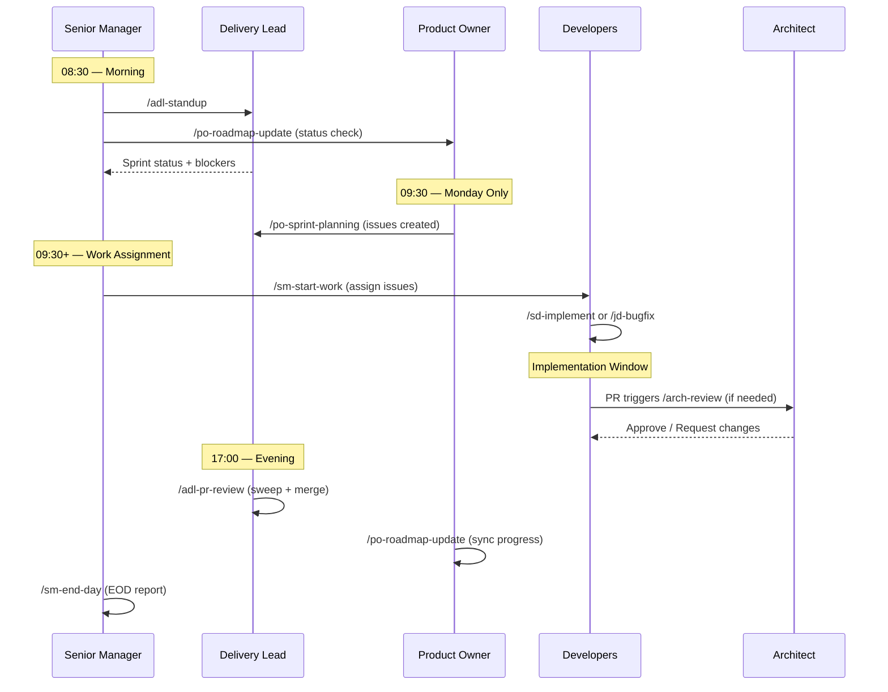
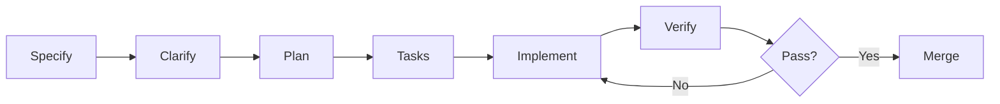
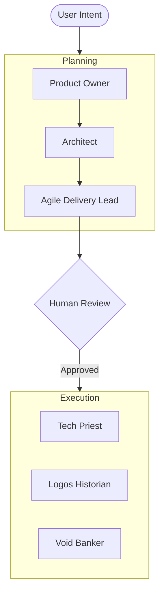
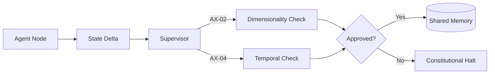

This file is a merged representation of the entire codebase, combined into a single document by Repomix.

# File Summary

## Purpose
This file contains a packed representation of the entire repository's contents.
It is designed to be easily consumable by AI systems for analysis, code review,
or other automated processes.

## File Format
The content is organized as follows:
1. This summary section
2. Repository information
3. Directory structure
4. Repository files (if enabled)
5. Multiple file entries, each consisting of:
  a. A header with the file path (## File: path/to/file)
  b. The full contents of the file in a code block

## Usage Guidelines
- This file should be treated as read-only. Any changes should be made to the
  original repository files, not this packed version.
- When processing this file, use the file path to distinguish
  between different files in the repository.
- Be aware that this file may contain sensitive information. Handle it with
  the same level of security as you would the original repository.

## Notes
- Some files may have been excluded based on .gitignore rules and Repomix's configuration
- Binary files are not included in this packed representation. Please refer to the Repository Structure section for a complete list of file paths, including binary files
- Files matching patterns in .gitignore are excluded
- Files matching default ignore patterns are excluded
- Files are sorted by Git change count (files with more changes are at the bottom)

# Directory Structure
```
.agent/workflows/adl-pr-review.md
.agent/workflows/adl-standup.md
.agent/workflows/adl-weekly-report.md
.agent/workflows/arch-review.md
.agent/workflows/jd-bugfix.md
.agent/workflows/po-release-management.md
.agent/workflows/po-roadmap-update.md
.agent/workflows/po-sprint-planning.md
.agent/workflows/sd-implement.md
.agent/workflows/sm-check-in.md
.agent/workflows/sm-end-day.md
.agent/workflows/sm-start-work.md
.agent/workflows/speckit.analyze.md
.agent/workflows/speckit.checklist.md
.agent/workflows/speckit.clarify.md
.agent/workflows/speckit.constitution.md
.agent/workflows/speckit.implement.md
.agent/workflows/speckit.plan.md
.agent/workflows/speckit.specify.md
.agent/workflows/speckit.tasks.md
.agent/workflows/speckit.taskstoissues.md
.agent/workflows/sse-code-review.md
.devcontainer/.env.example
.devcontainer/devcontainer.json
.devcontainer/Dockerfile
.devcontainer/Dockerfile.slim
.devcontainer/init-agent.sh
.files/d5eea956-06a6-4d81-92f8-dd6cbeabe9b8/c27a5454-9707-4f52-961f-817436504786.txt
.files/d5eea956-06a6-4d81-92f8-dd6cbeabe9b8/d28e4cd1-69aa-428a-82c1-9efe61cbfba2.txt
.github/workflows/auto-merge.yml
.github/workflows/ci.yml
.github/workflows/docs.yml
.gitignore
.pre-commit-config.yaml
.specify/decisions/ADR-009-cross-domain-agents.md
.specify/memory/constitution.md
.specify/scripts/powershell/check-prerequisites.ps1
.specify/scripts/powershell/common.ps1
.specify/scripts/powershell/create-new-feature.ps1
.specify/scripts/powershell/setup-plan.ps1
.specify/scripts/powershell/update-agent-context.ps1
.specify/templates/agent-file-template.md
.specify/templates/checklist-template.md
.specify/templates/constitution-template.md
.specify/templates/plan-template.md
.specify/templates/spec-template.md
.specify/templates/tasks-template.md
.windsurf/workflows/speckit.analyze.md
.windsurf/workflows/speckit.checklist.md
.windsurf/workflows/speckit.clarify.md
.windsurf/workflows/speckit.constitution.md
.windsurf/workflows/speckit.implement.md
.windsurf/workflows/speckit.plan.md
.windsurf/workflows/speckit.specify.md
.windsurf/workflows/speckit.tasks.md
.windsurf/workflows/speckit.taskstoissues.md
adl_fail.txt
agents/agile-delivery-lead/AGENT.md
agents/architect/AGENT.md
agents/junior-developer/AGENT.md
agents/product-owner/AGENT.md
agents/senior-developer/AGENT.md
agents/senior-manager/AGENT.md
agents/senior-software-engineer/AGENT.md
agents/shared/TEAM_CHARTER.md
automation/apply-branch-protections.sh
automation/GUIDE.md
automation/modules/VindictaAgents.Automation.psm1
automation/README.md
automation/Register-AgentTasks.ps1
automation/reports/ADL_Report.md
automation/reports/PO_Report.md
automation/reports/SM_Report.md
automation/scripts/Run-ADL-PRReview.ps1
automation/scripts/Run-ADL-Standup.ps1
automation/scripts/Run-ADL-WeeklyReport.ps1
automation/scripts/Run-PO-RoadmapUpdate.ps1
automation/scripts/Run-PO-SprintPlanning.ps1
automation/scripts/Run-SM-CheckIn.ps1
automation/scripts/Run-SM-EndDay.ps1
build.cmd
build.sh
CHANGELOG.md
collection_err.txt
conflict_config.txt
conflict_domain.txt
conflict_meta.txt
conflict_tools_init.txt
CONTRIBUTING.md
docs/agent-integration.md
docs/antigravity_installer_mock.py
docs/antigravity-cli-plan.md
docs/architecture.md
docs/daily-playbook.md
docs/devcontainer-guides/antigravity.md
docs/devcontainer-guides/docker-cli.md
docs/devcontainer-guides/pycharm.md
docs/devcontainer-guides/README.md
docs/devcontainer-guides/vscode.md
docs/devcontainer-guides/windsurf.md
docs/index.md
docs/lifecycle.md
docs/quick-reference.md
docs/roadmap-v0.2.x.md
features/agents.feature
features/async_kernel.feature
features/autonomous_workflow.feature
features/axioms.feature
features/discovery.feature
features/governance.feature
features/review_gates.feature
features/spec_queue.feature
features/steps/swarm_steps.py
features/steps/task_steps.py
features/swarm.feature
features/task_queue.feature
features/tools.feature
git_status.txt
langgraph.json
LICENSE
mkdocs.yml
pyproject.toml
README.md
rebase_tests.txt
rebase_tests2.txt
ruff_output.txt
ruff_remaining.txt
scripts/fix_showcase_prs.py
scripts/run_showcase.py
scripts/run_swarm.py
showcase_log.txt
specs/009-cross-domain-agents/plan.md
specs/009-cross-domain-agents/spec.md
specs/009-cross-domain-agents/tasks.md
specs/010-chainlit-sqlite-persistence/plan.md
specs/011-agent-isolation/checklists/requirements.md
specs/011-agent-isolation/implementation-plan.md
specs/011-agent-isolation/research.md
specs/011-agent-isolation/spec.md
specs/011-agent-isolation/tasks.md
specs/architecture_docs.md
src/vindicta_agents/__init__.py
src/vindicta_agents/core/__init__.py
src/vindicta_agents/core/base_agent.py
src/vindicta_agents/core/middleware.py
src/vindicta_agents/foundation/__init__.py
src/vindicta_agents/foundation/axioms.py
src/vindicta_agents/governor/__init__.py
src/vindicta_agents/governor/models.py
src/vindicta_agents/governor/resource_manager.py
src/vindicta_agents/nexus/__init__.py
src/vindicta_agents/nexus/client.py
src/vindicta_agents/nexus/models.py
src/vindicta_agents/nexus/orchestrator.py
src/vindicta_agents/sdk/__init__.py
src/vindicta_agents/sdk/models.py
src/vindicta_agents/shared/__init__.py
src/vindicta_agents/shared/memory.py
src/vindicta_agents/simulation/__init__.py
src/vindicta_agents/simulation/run_sim.py
src/vindicta_agents/simulation/scenarios.py
src/vindicta_agents/simulation/sdd_scenarios.py
src/vindicta_agents/simulation/shadow_nexus.py
src/vindicta_agents/supervisor/__init__.py
src/vindicta_agents/supervisor/gatekeeper.py
src/vindicta_agents/swarm_startup.py
src/vindicta_agents/swarm/__init__.py
src/vindicta_agents/swarm/config.py
src/vindicta_agents/swarm/configs/domains.json
src/vindicta_agents/swarm/configs/planning_agents.json
src/vindicta_agents/swarm/domain_graph.py
src/vindicta_agents/swarm/domain_registry.py
src/vindicta_agents/swarm/meta_graph.py
src/vindicta_agents/swarm/nexus.py
src/vindicta_agents/swarm/prompts.py
src/vindicta_agents/swarm/review_gates.py
src/vindicta_agents/swarm/spec_queue.py
src/vindicta_agents/swarm/state.py
src/vindicta_agents/telemetry/__init__.py
src/vindicta_agents/telemetry/models.py
src/vindicta_agents/telemetry/monitor.py
src/vindicta_agents/tools/__init__.py
src/vindicta_agents/tools/file_ops.py
src/vindicta_agents/tools/git_ops.py
src/vindicta_agents/tools/git_tools.py
src/vindicta_agents/tools/github_ops.py
src/vindicta_agents/tools/llm_ops.py
src/vindicta_agents/ui/chainlit_app.py
src/vindicta_agents/utils/__init__.py
src/vindicta_agents/utils/discovery.py
src/vindicta_agents/utils/logger.py
test_nexus_err.txt
tests_err.txt
tests_output_utf8.txt
tests_output.txt
tests/Automation.Tests.ps1
tests/integration/__init__.py
tests/integration/test_e2e_pipeline.py
tests/mocks/__init__.py
tests/mocks/mock_tools.py
tests/shadow/test_simulation.py
tests/test_agents_deep.py
tests/test_agents.py
tests/test-branch-protections.sh
tests/test-docker-build.sh
tests/test-gpg-signing.sh
tests/unit/swarm/__init__.py
tests/unit/swarm/test_agent_nodes.py
tests/unit/swarm/test_review_gates.py
tests/unit/swarm/test_spec_queue.py
tests/unit/test_async_nexus.py
tests/unit/test_axioms.py
tests/unit/test_base_agent_socket.py
tests/unit/test_base_agent.py
tests/unit/test_discovery.py
tests/unit/test_domain_graph.py
tests/unit/test_meta_graph.py
tests/unit/test_middleware.py
tests/unit/test_nexus_models.py
tests/unit/test_nexus.py
tests/unit/test_shared_memory.py
tests/unit/test_supervisor.py
tests/unit/test_swarm_logic.py
tests/unit/tools/__init__.py
tests/unit/tools/test_tools.py
verify_monitor.py
```

# Files

## File: .agent/workflows/adl-pr-review.md
````markdown
---
description: Agile Delivery Lead afternoon PR review sweep
---

# ADL PR Review Workflow

Execute daily at 5:00 PM by Agile Delivery Lead agent.

### 1. Identify PRs to Review

// turbo
1. Search all open PRs:
   ```yaml
   mcp_github-mcp-server_search_pull_requests
   query: "org:vindicta-platform is:open"
   ```

2. For each PR, gather:

   ```yaml
   mcp_github-mcp-server_pull_request_read (method: get)
   mcp_github-mcp-server_pull_request_read (method: get_reviews)
   mcp_github-mcp-server_pull_request_read (method: get_comments)
   ```

3. Check Constitution compliance (Rule 17, GCP/GitHub isolation)

4. Suggest Copilot review if needed:
   - No reviews AND (foundation PR OR >5 files)

   ```yaml
   mcp_github-mcp-server_request_copilot_review
   ```

5. Merge ready PRs:

   ```yaml
   mcp_github-mcp-server_merge_pull_request
   merge_method: "squash"
   ```

6. Comment on blocked PRs

## Copilot Suggestion Criteria

| Scenario            | Suggest? |
| ------------------- | -------- |
| Foundation scaffold | ✅        |
| >5 files            | ✅        |
| Has human approval  | ❌        |
| Docs-only           | ❌        |
````

## File: .agent/workflows/adl-standup.md
````markdown
---
description: Agile Delivery Lead morning standup routine
---

# ADL Standup Workflow

Execute daily at 9:00 AM by Agile Delivery Lead agent.

## Steps

// turbo
### 1. Prepare (5 min)

1. Get today's context:

   - Check `task.md` in active workspaces
   - Check `ROADMAP.md` for sprint goalculate: `week = ceil((today - Feb4) / 7)`

2. Search open issues:

   ```yaml
   mcp_github-mcp-server_search_issues
   query: "org:vindicta-platform is:open label:status:in-progress"
   ```

3. Identify slipped items (should have been done yesterday)

4. Flag blockers:

   ```yaml
   mcp_github-mcp-server_add_issue_comment
   body: "⚠️ **Blocker Identified**\n\n[Description]\n\nTime: [timestamp]"
   ```

5. Sync with GitHub Projects:

   - **Project #3** (PR Review Board): Ensure open PRs are tracked
   - **Project #4** (Platform Roadmap): Update issue statuses

   ```yaml
   mcp_github-mcp-server_issue_write
   method: "update"
   labels: ["status:in-progress"] or ["status:done"]
   ```

6. Output standup summary:
   - ✅ Completed yesterday
   - 🎯 Focus today
   - 🚨 Blockers (with age)
   - 📋 Project board sync status

## Blocker Thresholds

| Age   | Action                    |
| ----- | ------------------------- |
| 0-4h  | Log and monitor           |
| 4-24h | Add escalation comment    |
| >24h  | Escalate to Product Owner |
````

## File: .agent/workflows/adl-weekly-report.md
````markdown
---
description: Agile Delivery Lead Friday velocity report
---

# ADL Weekly Report Workflow

Execute Friday at 4:00 PM by Agile Delivery Lead agent.

## Steps

// turbo
1. Get closed issues this week:
   ```
   mcp_github-mcp-server_search_issues
   query: "org:vindicta-platform is:closed closed:>=YYYY-MM-DD"
   ```

2. Get merged PRs this week:
   ```
   mcp_github-mcp-server_search_pull_requests
   query: "org:vindicta-platform is:merged merged:>=YYYY-MM-DD"
   ```

3. Get closed issues this week:

   ```yaml
   is:issue is:closed closed:>2026-02-01
   ```

4. Get open blockers:

   ```yaml
   is:issue is:open label:blocked
   ```

### 2. Generate Report

1. Create `automation/reports/Velocity_Report_Week_X.md`
2. Run `velocity-report` script (if available) or fill manually:

   ```markdown
   # Velocity Report: Week X

   | Metric            | Value | Target | Status |
   | ----------------- | ----- | ------ | ------ |
   | Sprint Completion | X%    | ≥85%   | ✅/❌    |
   | PR Cycle Time     | Xh    | <24h   | ✅/❌    |
   | Blockers Resolved | X     | -      | -      |
   ```
````

## File: .agent/workflows/arch-review.md
````markdown
---
description: Architecture review for significant changes affecting platform structure
---

# Architecture Review Workflow

## When to Trigger
- New product integration
- Cross-product dependency changes
- Technology stack additions
- Database schema changes
- API contract modifications

## Steps

### 1. Gather Context
- Read the proposed change (PR, spec, or issue)
- Identify affected products/components
- Check Constitution compliance

### 2. Impact Assessment
Using MCP tools:
```
# Check for related patterns
mcp_github-mcp-server_search_code for similar implementations

## When to Trigger

- New product integration
- Changing core data models
- Adding new infrastructure dependency

## Steps

### 1. Gather Context

- Read the proposed change (PR, Issue, or RFC)
- Check `docs/architecture.md` for alignment

### 2. Impact Assessment

Run dependency check:

```bash
uv graph
```

Identify affected domains.

### 3. Review Criteria

- [ ] Aligns with Platform Constitution?
- [ ] Maintains domain isolation?
- [ ] Scalable?

### 4. Decision & Documentation

- Add approval comment to PR/issue
- OR request changes:
  - Link to specific architecture violation
  - Suggest alternative pattern

- Comment specific concerns

### 5. Success Criteria

- Decision documented within 24h
- No architectural debt introduced
- Follow-up actions identified
```
````

## File: .agent/workflows/jd-bugfix.md
````markdown
---
description: Bug fix workflow for learning developers
---

# Junior Developer Bug Fix Workflow

## Trigger
- Bug issue assigned with `good-first-issue` or `junior-friendly` label

## Steps

### 1. Understand the Bug
- Read issue description carefully
- Reproduce the bug locally
- Ask questions if anything unclear

### 2. Find the Root Cause
- Use debugger or logging
- Check related test files
- Look at recent changes in area

### 3. Plan the Fix
Before writing code:
- Describe your fix plan in a comment
- Wait for Senior Dev confirmation if unsure
- Consider edge cases

### 4. Implement Fix
```bash
git checkout main
git pull origin main
git checkout -b fix/{issue-number}-{short-description}
```

Write fix with test:
1. Add failing test that reproduces bug
2. Implement fix
3. Verify test passes
4. Run full test suite

### 5. Self-Check
- [ ] Bug is fixed
- [ ] New test covers the fix
- [ ] No other tests broken
- [ ] Code follows existing patterns

### 6. Request Review
```
mcp_github-mcp-server_create_pull_request
- Describe the bug and fix
- Link to issue
- Request review from Senior Dev
```

### 7. Learn from Feedback
- Read all review comments carefully
- Ask questions to understand
- Apply changes promptly
- Thank reviewer

## Important Rules
- **ALWAYS** get code review before merge
- **ASK** before trying unfamiliar approaches
- **NEVER** push directly to main

## When Stuck
1. Re-read the issue
2. Search existing code for patterns
3. Ask Senior Developer for help
4. Document what you tried
````

## File: .agent/workflows/po-release-management.md
````markdown
---
description: Product Owner release management
---

# PO Release Management Workflow

Execute as needed when milestones approach completion.

## Steps

// turbo
1. Check milestone status:
   ```
   mcp_github-mcp-server_list_issues
   state: OPEN, milestone: [milestone_number]
   ```
   Ready if open_issues = 0

2. Validate:
   - All issues closed
   - All PRs merged
   - Tests passing
   - Docs updated

3. Prepare release:
   - Update CHANGELOG.md
   - Create release tag:
   ```powershell
   gh release create v0.1.0 --title "v0.1.0 Foundation"
   ```

4. Close milestone, update ROADMAP.md

## Release Checklist

- [ ] All milestone issues closed
- [ ] All PRs merged
- [ ] ROADMAP.md updated
- [ ] Version tag created
````

## File: .agent/workflows/po-roadmap-update.md
````markdown
---
description: Product Owner daily roadmap sync
---

# PO Roadmap Update Workflow

Execute daily at 5:30 PM by Product Owner agent.

## Steps

// turbo
1. Get closed issues today:

   ```yaml
   mcp_github-mcp-server_search_issues
   query: "org:vindicta-platform is:closed closed:>=YYYY-MM-DD"
   ```

2. For each repo with closed issues:

   a. Read ROADMAP.md:

   ```yaml
   mcp_github-mcp-server_get_file_contents
   ```

   b. Update checklists:

   - `[ ]` → `[x]` for completed
   - `[ ]` → `[/]` for in-progress
   - Add ⚠️ for slipped items

   c. Push update:

   ```yaml
   mcp_github-mcp-server_create_or_update_file
   message: "docs: Update ROADMAP.md with current progress"
   ```

## Review (5 min)

1. Check `ROADMAP.md` against current progress:

   - Are we on track for the 6-week goal?
   - Any new risks?

## Checklist Syntax

| `[ ]` | Not started |
| `[/]` | In progress |
| `[x]` | Completed |
| ⚠️ | Slipped |
```
````

## File: .agent/workflows/po-sprint-planning.md
````markdown
---
description: Product Owner Monday sprint planning
---

# PO Sprint Planning Workflow

Execute Monday at 9:30 AM by Product Owner agent.

## Steps

// turbo
1. Identify current week (1-6 in roadmap)

2### 1. Define Goal

1. Read `ROADMAP.md`.
2. Select next prioritized features.

3. Draft Sprint Goal:

   ```markdown
   # Sprint Goal: [Goal]
   - Focus: [Theme]
   - Key Deliverable: [Deliverable]
   ```

### 2. Create Issues

1. Create GitHub issues for selected features.
2. Add to Project Board.

3. Assign to specialized roles:

   ```yaml
   assignees: [senior-dev, junior-dev]
   ```method: "create"
   title: "[Week X] Task Name"
   body: "## Task\n...\n## Acceptance Criteria\n- [ ] ..."
   labels: ["priority:p1-high", "status:ready"]
   ```

   ```powershell
   gh project item-add 4 --owner vindicta-platform --url [issue_url]
   ```

5. Communicate sprint goal to Delivery Lead

## Priority Framework

| P0 | Critical - blocks others |
| P1 | Current sprint commitment |
| P2 | Can wait one sprint |
| P3 | Future consideration |
````

## File: .agent/workflows/sd-implement.md
````markdown
---
description: Feature implementation from specification to PR
---

# Senior Developer Implementation Workflow

## Trigger
- Issue assigned with clear spec
- Feature ready for implementation

## Steps

### 1. Understand Requirements
- Read issue description and acceptance criteria
- Check linked specifications
- Clarify any ambiguity with Product Owner

### 2. Plan Implementation
- Break down into sub-tasks
- Identify test cases needed
- Estimate complexity

### 3. Create Feature Branch
```bash
git checkout main
git pull origin main
git checkout -b feature/{issue-number}-{short-description}
```

### 4. Implement with Tests
Follow TDD/BDD approach:
1. Write failing test
2. Implement minimum to pass
3. Refactor for quality
### 4. Implementation

1. Create feature branch.
2. Implement code.

3. Test locally:

   ```bash
   uv run pytest
   ```

4. Create Pull Request.
```
mcp_github-mcp-server_create_pull_request
- Link to issue
- Describe changes
- Tag reviewer (SSE)
```

### 5. Self-Review Checklist
- [ ] All acceptance criteria met
- [ ] Tests pass locally
- [ ] No linting errors
- [ ] Documentation updated
- [ ] Commit messages clear


### 7. Address Feedback
- Respond to review comments
- Push fixes promptly
- Ask questions if unclear

## Escalation
- Blocked → Delivery Lead
- Scope unclear → Product Owner
- Technical uncertainty → Senior Software Engineer
````

## File: .agent/workflows/sm-check-in.md
````markdown
---
description: Senior Manager morning check-in routine
---

# SM Check-In Workflow

Execute daily at 8:30 AM by Senior Manager agent.

## Steps

// turbo-all
1. Get current context:
   - Current week in 6-week roadmap (Feb 4 - Mar 17, 2026)
   - Today's date: `week = ceil((today - Feb4) / 7)`

2. Execute ADL Standup:
   ```
   /adl-standup
### 1. Review (5 min)

1. Check active sprints:

   - Blocking issues?
   - Unexpected delays?ny blockers identified

3. Execute PO Roadmap Update:
   ```
   /po-roadmap-update
   ```
   - Capture roadmap alignment status
   - Note any scope changes

4. Platform Health Check:
   - Count open issues by status across all repos
   - Check PR merge rate (target: 80%+ within 24h)
   - Identify stale PRs (>48h old)

5. Blocker Summary:
   - Aggregate all blockers from ADL standup
   - Categorize by severity and age
   - Assign escalation priority

6. Generate Platform Status Report:
   ```markdown
   # Platform Status - [Date]

   ## Sprint Execution (from ADL)
   - ✅ Completed: [count]
   - 🎯 In Progress: [count]
   - 🚨 Blockers: [count]

   ## Roadmap Alignment (from PO)
   - On Track: [%]
   - At Risk: [%]
   - Scope Changes: [summary]

   ## Platform Health
   - PR Merge Rate: [%]
   - Open Issues: [count]
   - Velocity Trend: [↑/→/↓]

   ## Critical Actions Required
   - [Action 1]
   - [Action 2]
   ```

## Escalation Criteria

| Issue                          | Escalation             |
| ------------------------------ | ---------------------- |
| Blocker >4h unresolved         | Immediate human alert  |
| Velocity drop >20%             | Daily report highlight |
| Cross-repo dependency conflict | Architect review       |
````

## File: .agent/workflows/sm-end-day.md
````markdown
---
description: Senior Manager end-of-day status workflow
---

# SM End Day Workflow

Execute daily at 6:00 PM by Senior Manager agent.

## Steps

// turbo-all
1. Execute PR Review:
   ```
   /adl-pr-review
   ```
   - Get PR status summary
   - Capture merge statistics
   - Note pending reviews

2. Calculate Daily Velocity:
   - Count issues moved to `status:done` today
   - Count PRs merged today
   - Compare to sprint average
   - Trend: ↑ (above average), → (on track), ↓ (below average)

3. Execute Weekly Report (if Friday):
   ```
   /adl-weekly-report
   ```
   - Capture full week summary
   - Include velocity charts
   - Note sprint completion percentage

4. Preview Tomorrow's Work:
   - List issues in `status:in-progress`
   - List issues in `status:ready` queue
   - Identify potential blockers
   - Check for scheduled reviews

5. Generate End-of-Day Handoff:
   ```markdown
   # End of Day Report - [Date]

   ## Today's Accomplishments
   - Issues Completed: [count]
   - PRs Merged: [count]
   - Velocity: [↑/→/↓]

   ## PR Status
   - Pending Review: [count]
   - Approved (awaiting merge): [count]
   - Changes Requested: [count]

   ## Active Blockers
   - [Blocker 1] - Age: [hours]
   - [Blocker 2] - Age: [hours]

   ## Tomorrow's Focus
   - In Progress: [count] items
   - Ready to Start: [count] items
   - Potential Blockers: [list]

   ## Weekly Summary (Fridays only)
   [Include full weekly report from /adl-weekly-report]
   ```

6. Flag Critical Items for Human Review:
   - Blockers >8h old
   - PRs with >3 change requests
   - Sprint items at risk of missing deadline
   - Cross-repo conflicts unresolved

## Report Distribution

| Recipient | When | Content |
|-----------|------|---------|
| Human Oversight | Daily | Critical items only |
| Project Archive | Daily | Full report |
| Weekly Stakeholders | Friday | Weekly summary |

## Cleanup Tasks

- Archive completed issues
- Update Project #4 board
- Close stale notifications
````

## File: .agent/workflows/sm-start-work.md
````markdown
---
description: Senior Manager work initialization workflow
---

# SM Start Work Workflow

Trigger implementation phase across sub-agents.

## Trigger
- Monday morning after sprint planning
- When new high-priority work arrives
- When blockers are cleared and work can resume

## Steps

// turbo-all
1. Execute Sprint Planning (if Monday):
   ```
   /po-sprint-planning
   ```
   - Get current sprint items
   - Capture sprint goals
   - Note priority order

2. Check for Architecture Review Needs:
   - Scan new issues for labels: `needs-arch-review`
   - Check issue descriptions for keywords: "breaking change", "new integration", "API design"
   - If needed, execute:
     ```
     /arch-review
     ```

3. Assign Work to Developers:
   - Group issues by complexity:
     - Junior Developer: `complexity:low`
     - Senior Developer: `complexity:medium`
     - Senior Software Engineer: `complexity:high` or `needs-mentoring`
   - For each assigned issue:
     ```
     mcp_github-mcp-server_add_issue_comment
     body: "🚀 **Work Started**\n\nAssigned to: [agent role]\nStarted: [timestamp]\nExpected completion: [estimate]"
     ```

4. Trigger Implementation Workflows:
   - For ready issues:
     ```
     /sd-implement
     ```
   - For learning opportunities:
     ```
     /jd-bugfix
     ```

5. Setup Tracking:
   - Add PRs to **Project #3** (PR Review Board) for review tracking
   - Add issues to **Project #4** (Platform Roadmap) for sprint tracking
   - Update status label to `status:in-progress`
   - Set milestone based on sprint week

   **MCP Tools for Project Updates:**
   ```
   # Add issue to project (requires project and issue node IDs)
   mcp_github-mcp-server_add_issue_comment
   body: "📋 Added to Project #3 (Roadmap) and #4 (Sprint)"

   # Update issue labels for tracking
   mcp_github-mcp-server_issue_write
   method: "update"
   labels: ["status:in-progress"]
   ```

6. Generate Kickoff Summary:
   ```markdown
   # Work Session Started - [Date]

   ## Sprint Goals
   - [Goal 1]
   - [Goal 2]

   ## Work Assigned
   - Junior Developer: [count] items
   - Senior Developer: [count] items
   - Senior Software Engineer: [count] items

   ## Architecture Reviews Pending
   - [Issue #X]: [title]

   ## Expected Deliverables Today
   - [Deliverable 1]
   - [Deliverable 2]
   ```

## Success Criteria
- All sprint items have clear assignees
- No work starts without passing architecture review
- Tracking updated within 5 minutes of work start
````

## File: .agent/workflows/speckit.analyze.md
````markdown
---
description: Perform a non-destructive cross-artifact consistency and quality analysis across spec.md, plan.md, and tasks.md after task generation.
---

## User Input

```text
$ARGUMENTS
```

You **MUST** consider the user input before proceeding (if not empty).

## Goal

Identify inconsistencies, duplications, ambiguities, and underspecified items across the three core artifacts (`spec.md`, `plan.md`, `tasks.md`) before implementation. This command MUST run only after `/speckit.tasks` has successfully produced a complete `tasks.md`.

## Operating Constraints

**STRICTLY READ-ONLY**: Do **not** modify any files. Output a structured analysis report. Offer an optional remediation plan (user must explicitly approve before any follow-up editing commands would be invoked manually).

**Constitution Authority**: The project constitution (`.specify/memory/constitution.md`) is **non-negotiable** within this analysis scope. Constitution conflicts are automatically CRITICAL and require adjustment of the spec, plan, or tasks—not dilution, reinterpretation, or silent ignoring of the principle. If a principle itself needs to change, that must occur in a separate, explicit constitution update outside `/speckit.analyze`.

## Execution Steps

### 1. Initialize Analysis Context

Run `.specify/scripts/powershell/check-prerequisites.ps1 -Json -RequireTasks -IncludeTasks` once from repo root and parse JSON for FEATURE_DIR and AVAILABLE_DOCS. Derive absolute paths:

- SPEC = FEATURE_DIR/spec.md
- PLAN = FEATURE_DIR/plan.md
- TASKS = FEATURE_DIR/tasks.md

Abort with an error message if any required file is missing (instruct the user to run missing prerequisite command).
For single quotes in args like "I'm Groot", use escape syntax: e.g 'I'\''m Groot' (or double-quote if possible: "I'm Groot").

### 2. Load Artifacts (Progressive Disclosure)

Load only the minimal necessary context from each artifact:

**From spec.md:**

- Overview/Context
- Functional Requirements
- Non-Functional Requirements
- User Stories
- Edge Cases (if present)

**From plan.md:**

- Architecture/stack choices
- Data Model references
- Phases
- Technical constraints

**From tasks.md:**

- Task IDs
- Descriptions
- Phase grouping
- Parallel markers [P]
- Referenced file paths

**From constitution:**

- Load `.specify/memory/constitution.md` for principle validation

### 3. Build Semantic Models

Create internal representations (do not include raw artifacts in output):

- **Requirements inventory**: Each functional + non-functional requirement with a stable key (derive slug based on imperative phrase; e.g., "User can upload file" → `user-can-upload-file`)
- **User story/action inventory**: Discrete user actions with acceptance criteria
- **Task coverage mapping**: Map each task to one or more requirements or stories (inference by keyword / explicit reference patterns like IDs or key phrases)
- **Constitution rule set**: Extract principle names and MUST/SHOULD normative statements

### 4. Detection Passes (Token-Efficient Analysis)

Focus on high-signal findings. Limit to 50 findings total; aggregate remainder in overflow summary.

#### A. Duplication Detection

- Identify near-duplicate requirements
- Mark lower-quality phrasing for consolidation

#### B. Ambiguity Detection

- Flag vague adjectives (fast, scalable, secure, intuitive, robust) lacking measurable criteria
- Flag unresolved placeholders (TODO, TKTK, ???, `<placeholder>`, etc.)

#### C. Underspecification

- Requirements with verbs but missing object or measurable outcome
- User stories missing acceptance criteria alignment
- Tasks referencing files or components not defined in spec/plan

#### D. Constitution Alignment

- Any requirement or plan element conflicting with a MUST principle
- Missing mandated sections or quality gates from constitution

#### E. Coverage Gaps

- Requirements with zero associated tasks
- Tasks with no mapped requirement/story
- Non-functional requirements not reflected in tasks (e.g., performance, security)

#### F. Inconsistency

- Terminology drift (same concept named differently across files)
- Data entities referenced in plan but absent in spec (or vice versa)
- Task ordering contradictions (e.g., integration tasks before foundational setup tasks without dependency note)
- Conflicting requirements (e.g., one requires Next.js while other specifies Vue)

### 5. Severity Assignment

Use this heuristic to prioritize findings:

- **CRITICAL**: Violates constitution MUST, missing core spec artifact, or requirement with zero coverage that blocks baseline functionality
- **HIGH**: Duplicate or conflicting requirement, ambiguous security/performance attribute, untestable acceptance criterion
- **MEDIUM**: Terminology drift, missing non-functional task coverage, underspecified edge case
- **LOW**: Style/wording improvements, minor redundancy not affecting execution order

### 6. Produce Com<!-- markdownlint-disable MD013 -->
# Speckit Analysis Workflowrt

Output a Markdown report (no file writes) with the following structure:

## Specification Analysis Report

| ID  | Category    | Severity | Location(s)      | Summary                      | Recommendation                       |
| --- | ----------- | -------- | ---------------- | ---------------------------- | ------------------------------------ |
| A1  | Duplication | HIGH     | spec.md:L120-134 | Two similar requirements ... | Merge phrasing; keep clearer version |

(Add one row per finding; generate stable IDs prefixed by category initial.)

**Coverage Summary Table:**

| Requirement Key | Has Task? | Task IDs | Notes |
| --------------- | --------- | -------- | ----- |

**Constitution Alignment Issues:** (if any)

**Unmapped Tasks:** (if any)

**Metrics:**

- Total Requirements
- Total Tasks
- Coverage % (requirements with >=1 task)
- Ambiguity Count
- Duplication Count
- Critical Issues Count

### 7. Provide Next Actions

At end of report, output a concise Next Actions block:

- If CRITICAL issues exist: Recommend resolving before `/speckit.implement`
- If only LOW/MEDIUM: User may proceed, but provide improvement suggestions
- Provide explicit command suggestions: e.g., "Run /speckit.specify with refinement", "Run /speckit.plan to adjust architecture", "Manually edit tasks.md to add coverage for 'performance-metrics'"

### 8. Offer Remediation

Ask the user: "Would you like me to suggest concrete remediation edits for the top N issues?" (Do NOT apply them automatically.)

## Operating Principles

### Context Efficiency

- **Minimal high-signal tokens**: Focus on actionable findings, not exhaustive documentation
- **Progressive disclosure**: Load artifacts incrementally; don't dump all content into analysis
- **Token-efficient output**: Limit findings table to 50 rows; summarize overflow
- **Deterministic results**: Rerunning without changes should produce consistent IDs and counts

### Analysis Guidelines

- **NEVER modify files** (this is read-only analysis)
- **NEVER hallucinate missing sections** (if absent, report them accurately)
- **Prioritize constitution violations** (these are always CRITICAL)
- **Use examples over exhaustive rules** (cite specific instances, not generic patterns)
- **Report zero issues gracefully** (emit success report with coverage statistics)

## Context

$ARGUMENTS
````

## File: .agent/workflows/speckit.checklist.md
````markdown
---
description: Generate a custom checklist for the current feature based on user requirements.
---

## Checklist Purpose: "Unit Tests for English"

**CRITICAL CONCEPT**: Checklists are **UNIT TESTS FOR REQUIREMENTS WRITING** - they validate the quality, clarity, and completeness of requirements in a given domain.

**NOT for verification/testing**:

- ❌ NOT "Verify the button clicks correctly"
- ❌ NOT "Test error handling works"
- ❌ NOT "Confirm the API returns 200"
- ❌ NOT checking if code/implementation matches the spec

**FOR requirements quality validation**:

- ✅ "Are visual hierarchy requirements defined for all card types?" (completeness)
- ✅ "Is 'prominent display' quantified with specific sizing/positioning?" (clarity)
- ✅ "Are hover state requirements consistent across all interactive elements?" (consistency)
- ✅ "Are accessibility requirements defined for keyboard navigation?" (coverage)
- ✅ "Does the spec define what happens when logo image fails to load?" (edge cases)

**Metaphor**: If your spec is code written in English, the checklist is its unit test suite. You're testing whether the requirements are well-written, complete, unambiguous, and ready for implementation - NOT whether the implementation works.

## User Input

```text
$ARGUMENTS
```

You **MUST** consider the user input before proceeding (if not empty).

## Execution Steps

1. **Setup**: Run `.specify/scripts/powershell/check-prerequisites.ps1 -Json` from repo root and parse JSON for FEATURE_DIR and AVAILABLE_DOCS list.
   - All file paths must be absolute.
   - For single quotes in args like "I'm Groot", use escape syntax: e.g 'I'\''m Groot' (or double-quote if possible: "I'm Groot").

2. **Clarify intent (dynamic)**: Derive up to THREE initial contextual clarifying questions (no pre-baked catalog). They MUST:
   - Be generated from the user's phrasing + extracted signals from spec/plan/tasks
   - Only ask about information that materially changes checklist content
   - Be skipped individually if already unambiguous in `$ARGUMENTS`
   - Prefer precision over breadth

   Generation algorithm:
   1. Extract signals: feature domain keywords (e.g., auth, latency, UX, API), risk indicators ("critical", "must", "compliance"), stakeholder hints ("QA", "review", "security team"), and explicit deliverables ("a11y", "rollback", "contracts").
   2. Cluster signals into candidate focus areas (max 4) ranked by relevance.
   3. Identify probable audience & timing (author, reviewer, QA, release) if not explicit.
   4. Detect missing dimensions: scope breadth, depth/rigor, risk emphasis, exclusion boundaries, measurable acceptance criteria.
   5. Formulate questions chosen from these archetypes:
      - Scope refinement (e.g., "Should this include integration touchpoints with X and Y or stay limited to local module correctness?")
      - Risk prioritization (e.g., "Which of these potential risk areas should receive mandatory gating checks?")
      - Depth calibration (e.g., "Is this a lightweight pre-commit sanity list or a formal release gate?")
      - Audience framing (e.g., "Will this be used by the author only or peers during PR review?")
      - Boundary exclusion (e.g., "Should we explicitly exclude performance tuning items this round?")
      - Scenario class gap (e.g., "No recovery flows detected—are rollback / partial failure paths in scope?")

   Question formatting rules:
   - If presenting options, generate a compact table with columns: Option | Candidate | Why It Matters
   - Limit to A–E options maximum; omit table if a free-form answer is clearer
   - Never ask the user to restate what they already said
   - Avoid speculative categories (no hallucination). If uncertain, ask explicitly: "Confirm whether X belongs in scope."

   Defaults when interaction impossible:
   - Depth: Standard
   - Audience: Reviewer (PR) if code-related; Author otherwise
   - Focus: Top 2 relevance clusters

   Output the questions (label Q1/Q2/Q3). After answers: if ≥2 scenario classes (Alternate / Exception / Recovery / Non-Functional domain) remain unclear, you MAY ask up to TWO more targeted follow‑ups (Q4/Q5) with a one-line justification each (e.g., "Unresolved recovery path risk"). Do not exceed five total questions. Skip escalation if user explicitly declines more.

3. **Understand user request**: Combine `$ARGUMENTS` + clarifying answers:
   - Derive checklist theme (e.g., security, review, deploy, ux)
   - Consolidate explicit must-have items mentioned by user
   - Map focus selections to category scaffolding
   - Infer any missing context from spec/plan/tasks (do NOT hallucinate)

4. **Load feature context**: Read from FEATURE_DIR:
   - spec.md: Feature requirements and scope
   - plan.md (if exists): Technical details, dependencies
   - tasks.md (if exists): Implementation tasks

   **Context Loading Strategy**:
   - Load only necessary portions relevant to active focus areas (avoid full-file dumping)
   - Prefer summarizing long sections into concise scenario/requirement bullets
   - Use progressive disclosure: add follow-on retrieval only if gaps detected
   - If source docs are large, generate interim summary items instead of embedding raw text

5. **Generate checklist** - Create "Unit Tests for Requirements":
   - Create `FEATURE_DIR/checklists/` directory if it doesn't exist
   - Generate unique checklist filename:
     - Use short, descriptive name based on domain (e.g., `ux.md`, `api.md`, `security.md`)
     - Format: `[domain].md`
     - If file exists, append to existing file
   - Number items sequentially starting from CHK001
   - Each `/speckit.checklist` run creates a NEW file (never overwrites existing checklists)

   **CORE PRINCIPLE - Test the Requirements, Not the Implementation**:
   Every checklist item MUST evaluate the REQUIREMENTS THEMSELVES for:
   - **Completeness**: Are all necessary requirements present?
   - **Clarity**: Are requirements unambiguous and specific?
   - **Consistency**: Do requirements align with each other?
   - **Measurability**: Can requirements be objectively verified?
   - **Coverage**: Are all scenarios/edge cases addressed?

   **Category Structure** - Group items by requirement quality dimensions:
   - **Requirement Completeness** (Are all necessary requirements documented?)
   - **Requirement Clarity** (Are requirements specific and unambiguous?)
   - **Requirement Consistency** (Do requirements align without conflicts?)
   - **Acceptance Criteria Quality** (Are success criteria measurable?)
   - **Scenario Coverage** (Are all flows/cases addressed?)
   - **Edge Case Coverage** (Are boundary conditions defined?)
   - **Non-Functional Requirements** (Performance, Security, Accessibility, etc. - are they specified?)
   - **Dependencies & Assumptions** (Are they documented and validated?)
   - **Ambiguities & Conflicts** (What needs clarification?)

   **HOW TO WRITE CHECKLIST ITEMS - "Unit Tests for English"**:

   ❌ **WRONG** (Testing implementation):
   - "Verify landing page displays 3 episode cards"
   - "Test hover states work on desktop"
   - "Confirm logo click navigates home"

   ✅ **CORRECT** (Testing requirements quality):
   - "Are the exact number and layout of featured episodes specified?" [Completeness]
   - "Is 'prominent display' quantified with specific sizing/positioning?" [Clarity]
   - "Are hover state requirements consistent across all interactive elements?" [Consistency]
   - "Are keyboard navigation requirements defined for all interactive UI?" [Coverage]
   - "Is the fallback behavior specified when logo image fails to load?" [Edge Cases]
   - "Are loading states defined for asynchronous episode data?" [Completeness]
   - "Does the spec define visual hierarchy for competing UI elements?" [Clarity]

   **ITEM STRUCTURE**:
   Each item should follow this pattern:
   - Question format asking about requirement quality
   - Focus on what's WRITTEN (or not written) in the spec/plan
   - Include quality dimension in brackets [Completeness/Clarity/Consistency/etc.]
   - Reference spec section `[Spec §X.Y]` when checking existing requirements
   - Use `[Gap]` marker when checking for missing requirements

   **EXAMPLES BY QUALITY DIMENSION**:

   Completeness:
   - "Are error handling requirements defined for all API failure modes? [Gap]"
   - "Are accessibility requirements specified for all interactive elements? [Completeness]"
   - "Are mobile breakpoint requirements defined for responsive layouts? [Gap]"

   Clarity:
   - "Is 'fast loading' quantified with specific timing thresholds? [Clarity, Spec §NFR-2]"
   - "Are 'related episodes' selection criteria explicitly defined? [Clarity, Spec §FR-5]"
   - "Is 'prominent' defined with measurable visual properties? [Ambiguity, Spec §FR-4]"

   Consistency:
   - "Do navigation requirements align across all pages? [Consistency, Spec §FR-10]"
   - "Are card component requirements consistent between landing and detail pages? [Consistency]"

   Coverage:
   - "Are requirements defined for zero-state scenarios (no episodes)? [Coverage, Edge Case]"
   - "Are concurrent user interaction scenarios addressed? [Coverage, Gap]"
   - "Are requirements specified for partial data loading failures? [Coverage, Exception Flow]"

   Measurability:
   - "Are visual hierarchy requirements measurable/testable? [Acceptance Criteria, Spec §FR-1]"
   - "Can 'balanced visual weight' be objectively verified? [Measurability, Spec §FR-2]"

   **Scenario Classification & Coverage** (Requirements Quality Focus):
   - Check if requirements exist for: Primary, Alternate, Exception/Error, Recovery, Non-Functional scenarios
   - For each scenario class, ask: "Are [scenario type] requirements complete, clear, and consistent?"
   - If scenario class missing: "Are [scenario type] requirements intentionally excluded or missing? [Gap]"
   - Include resilience/rollback when state mutation occurs: "Are rollback requirements defined for migration failures? [Gap]"

   **Traceability Requirements**:
   - MINIMUM: ≥80% of items MUST include at least one traceability reference
   - Each item should reference: spec section `[Spec §X.Y]`, or use markers: `[Gap]`, `[Ambiguity]`, `[Conflict]`, `[Assumption]`
   - If no ID system exists: "Is a requirement & acceptance criteria ID scheme established? [Traceability]"

   **Surface & Resolve Issues** (Requirements Quality Problems):
   Ask questions about the requirements themselves:
   - Ambiguities: "Is the term 'fast' quantified with specific metrics? [Ambiguity, Spec §NFR-1]"
   - Conflicts: "Do navigation requirements conflict between §FR-10 and §FR-10a? [Conflict]"
   - Assumptions: "Is the assumption of 'always available podcast API' validated? [Assumption]"
   - Dependencies: "Are external podcast API requirements documented? [Dependency, Gap]"
   - Missing definitions: "Is 'visual hierarchy' defined with measurable criteria? [Gap]"

   **Content Consolidation**:
   - Soft cap: If raw candidate items > 40, prioritize by risk/impact
   - Merge near-duplicates checking the same requirement aspect
   - If >5 low-impact edge cases, create one item: "Are edge cases X, Y, Z addressed in requirements? [Coverage]"

   **🚫 ABSOLUTELY PROHIBITED** - These make it an implementation test, not a requirements test:
   - ❌ Any item starting with "Verify", "Test", "Confirm", "Check" + implementation behavior
   - ❌ References to code execution, user actions, system behavior
   - ❌ "Displays correctly", "works properly", "functions as expected"
   - ❌ "Click", "navigate", "render", "load", "execute"
   - ❌ Test cases, test plans, QA procedures
   - ❌ Implementation details (frameworks, APIs, algorithms)

   **✅ REQUIRED PATTERNS** - These test requirements quality:
   - ✅ "Are [requirement type] defined/specified/documented for [scenario]?"
   - ✅ "Is [vague term] quantified/clarified with specific criteria?"
   - ✅ "Are requirements consistent between [section A] and [section B]?"
   - ✅ "Can [requirement] be objectively measured/verified?"
   - ✅ "Are [edge cases/scenarios] addressed in requirements?"
   - ✅ "Does the spec define [missing aspect]?"

6. **Structure Reference**: Generate<!-- markdownlint-disable MD013 -->
# Speckit Checklist Workflowing the canonical template in `.specify/templates/checklist-template.md` for title, meta section, category headings, and ID formatting. If template is unavailable, use: H1 title, purpose/created meta lines, `##` category sections containing `- [ ] CHK### <requirement item>` lines with globally incrementing IDs starting at CHK001.

7. **Report**: Output full path to created checklist, item count, and remind user that each run creates a new file. Summarize:
   - Focus areas selected
   - Depth level
   - Actor/timing

**Important**: Each `/speckit.checklist` command invocation creates a checklist file using short, descriptive names unless file already exists. This allows:

- Multiple checklists of different types (e.g., `ux.md`, `test.md`, `security.md`)
- Simple, memorable filenames that indicate checklist purpose
- Easy identification and navigation in the `checklists/` folder

To avoid clutter, use descriptive types and clean up obsolete checklists when done.

## Example Checklist Types & Sample Items

**UX Requirements Quality:** `ux.md`

Sample items (testing the requirements, NOT the implementation):

- "Are visual hierarchy requirements defined with measurable criteria? [Clarity, Spec §FR-1]"
- "Is the number and positioning of UI elements explicitly specified? [Completeness, Spec §FR-1]"
- "Are interaction state requirements (hover, focus, active) consistently defined? [Consistency]"
- "Are accessibility requirements specified for all interactive elements? [Coverage, Gap]"
- "Is fallback behavior defined when images fail to load? [Edge Case, Gap]"
- "Can 'prominent display' be objectively measured? [Measurability, Spec §FR-4]"

**API Requirements Quality:** `api.md`

Sample items:

- "Are error response formats specified for all failure scenarios? [Completeness]"
- "Are rate limiting requirements quantified with specific thresholds? [Clarity]"
- "Are authentication requirements consistent across all endpoints? [Consistency]"
- "Are retry/timeout requirements defined for external dependencies? [Coverage, Gap]"
- "Is versioning strategy documented in requirements? [Gap]"

**Performance Requirements Quality:** `performance.md`

Sample items:

- "Are performance requirements quantified with specific metrics? [Clarity]"
- "Are performance targets defined for all critical user journeys? [Coverage]"
- "Are performance requirements under different load conditions specified? [Completeness]"
- "Can performance requirements be objectively measured? [Measurability]"
- "Are degradation requirements defined for high-load scenarios? [Edge Case, Gap]"

**Security Requirements Quality:** `security.md`

Sample items:

- "Are authentication requirements specified for all protected resources? [Coverage]"
- "Are data protection requirements defined for sensitive information? [Completeness]"
- "Is the threat model documented and requirements aligned to it? [Traceability]"
- "Are security requirements consistent with compliance obligations? [Consistency]"
- "Are security failure/breach response requirements defined? [Gap, Exception Flow]"

## Anti-Examples: What NOT To Do

**❌ WRONG - These test implementation, not requirements:**

```markdown
- [ ] CHK001 - Verify landing page displays 3 episode cards [Spec §FR-001]
- [ ] CHK002 - Test hover states work correctly on desktop [Spec §FR-003]
- [ ] CHK003 - Confirm logo click navigates to home page [Spec §FR-010]
- [ ] CHK004 - Check that related episodes section shows 3-5 items [Spec §FR-005]
```

**✅ CORRECT - These test requirements quality:**

```markdown
- [ ] CHK001 - Are the number and layout of featured episodes explicitly specified? [Completeness, Spec §FR-001]
- [ ] CHK002 - Are hover state requirements consistently defined for all interactive elements? [Consistency, Spec §FR-003]
- [ ] CHK003 - Are navigation requirements clear for all clickable brand elements? [Clarity, Spec §FR-010]
- [ ] CHK004 - Is the selection criteria for related episodes documented? [Gap, Spec §FR-005]
- [ ] CHK005 - Are loading state requirements defined for asynchronous episode data? [Gap]
- [ ] CHK006 - Can "visual hierarchy" requirements be objectively measured? [Measurability, Spec §FR-001]
```

**Key Differences:**

- Wrong: Tests if the system works correctly
- Correct: Tests if the requirements are written correctly
- Wrong: Verification of behavior
- Correct: Validation of requirement quality
- Wrong: "Does it do X?"
- Correct: "Is X clearly specified?"
````

## File: .agent/workflows/speckit.clarify.md
````markdown
---
description: Identify underspecified areas in the current feature spec by asking up to 5 highly targeted clarification questions and encoding answers back into the spec.
handoffs:
  - label: Build Technical Plan
    agent: speckit.plan
    prompt: Create a plan for the spec. I am building with...
---

## User Input

```text
$ARGUMENTS
```

You **MUST** consider the user input before proceeding (if not empty).

## Outline

Goal: Detect and reduce ambiguity or missing decision points in the active feature specification and record the clarifications directly in the spec file.

Note:<!-- markdownlint-disable MD013 -->
# Speckit Clarification Workflow is expected to run (and be completed) BEFORE invoking `/speckit.plan`. If the user explicitly states they are skipping clarification (e.g., exploratory spike), you may proceed, but must warn that downstream rework risk increases.

Execution steps:

1. Run `.specify/scripts/powershell/check-prerequisites.ps1 -Json -PathsOnly` from repo root **once** (combined `--json --paths-only` mode / `-Json -PathsOnly`). Parse minimal JSON payload fields:
   - `FEATURE_DIR`
   - `FEATURE_SPEC`
   - (Optionally capture `IMPL_PLAN`, `TASKS` for future chained flows.)
   - If JSON parsing fails, abort and instruct user to re-run `/speckit.specify` or verify feature branch environment.
   - For single quotes in args like "I'm Groot", use escape syntax: e.g 'I'\''m Groot' (or double-quote if possible: "I'm Groot").

2. Load the current spec file. Perform a structured ambiguity & coverage scan using this taxonomy. For each category, mark status: Clear / Partial / Missing. Produce an internal coverage map used for prioritization (do not output raw map unless no questions will be asked).

   Functional Scope & Behavior:
   - Core user goals & success criteria
   - Explicit out-of-scope declarations
   - User roles / personas differentiation

   Domain & Data Model:
   - Entities, attributes, relationships
   - Identity & uniqueness rules
   - Lifecycle/state transitions
   - Data volume / scale assumptions

   Interaction & UX Flow:
   - Critical user journeys / sequences
   - Error/empty/loading states
   - Accessibility or localization notes

   Non-Functional Quality Attributes:
   - Performance (latency, throughput targets)
   - Scalability (horizontal/vertical, limits)
   - Reliability & availability (uptime, recovery expectations)
   - Observability (logging, metrics, tracing signals)
   - Security & privacy (authN/Z, data protection, threat assumptions)
   - Compliance / regulatory constraints (if any)

   Integration & External Dependencies:
   - External services/APIs and failure modes
   - Data import/export formats
   - Protocol/versioning assumptions

   Edge Cases & Failure Handling:
   - Negative scenarios
   - Rate limiting / throttling
   - Conflict resolution (e.g., concurrent edits)

   Constraints & Tradeoffs:
   - Technical constraints (language, storage, hosting)
   - Explicit tradeoffs or rejected alternatives

   Terminology & Consistency:
   - Canonical glossary terms
   - Avoided synonyms / deprecated terms

   Completion Signals:
   - Acceptance criteria testability
   - Measurable Definition of Done style indicators

   Misc / Placeholders:
   - TODO markers / unresolved decisions
   - Ambiguous adjectives ("robust", "intuitive") lacking quantification

   For each category with Partial or Missing status, add a candidate question opportunity unless:
   - Clarification would not materially change implementation or validation strategy
   - Information is better deferred to planning phase (note internally)

3. Generate (internally) a prioritized queue of candidate clarification questions (maximum 5). Do NOT output them all at once. Apply these constraints:
    - Maximum of 10 total questions across the whole session.
    - Each question must be answerable with EITHER:
       - A short multiple‑choice selection (2–5 distinct, mutually exclusive options), OR
       - A one-word / short‑phrase answer (explicitly constrain: "Answer in <=5 words").
    - Only include questions whose answers materially impact architecture, data modeling, task decomposition, test design, UX behavior, operational readiness, or compliance validation.
    - Ensure category coverage balance: attempt to cover the highest impact unresolved categories first; avoid asking two low-impact questions when a single high-impact area (e.g., security posture) is unresolved.
    - Exclude questions already answered, trivial stylistic preferences, or plan-level execution details (unless blocking correctness).
    - Favor clarifications that reduce downstream rework risk or prevent misaligned acceptance tests.
    - If more than 5 categories remain unresolved, select the top 5 by (Impact * Uncertainty) heuristic.

4. Sequential questioning loop (interactive):
    - Present EXACTLY ONE question at a time.
    - For multiple‑choice questions:
       - **Analyze all options** and determine the **most suitable option** based on:
          - Best practices for the project type
          - Common patterns in similar implementations
          - Risk reduction (security, performance, maintainability)
          - Alignment with any explicit project goals or constraints visible in the spec
       - Present your **recommended option prominently** at the top with clear reasoning (1-2 sentences explaining why this is the best choice).
       - Format as: `**Recommended:** Option [X] - <reasoning>`
       - Then render all options as a Markdown table:

       | Option | Description                                                                                         |
       | ------ | --------------------------------------------------------------------------------------------------- |
       | A      | <Option A description>                                                                              |
       | B      | <Option B description>                                                                              |
       | C      | <Option C description> (add D/E as needed up to 5)                                                  |
       | Short  | Provide a different short answer (<=5 words) (Include only if free-form alternative is appropriate) |

       - After the table, add: `You can reply with the option letter (e.g., "A"), accept the recommendation by saying "yes" or "recommended", or provide your own short answer.`
    - For short‑answer style (no meaningful discrete options):
       - Provide your **suggested answer** based on best practices and context.
       - Format as: `**Suggested:** <your proposed answer> - <brief reasoning>`
       - Then output: `Format: Short answer (<=5 words). You can accept the suggestion by saying "yes" or "suggested", or provide your own answer.`
    - After the user answers:
       - If the user replies with "yes", "recommended", or "suggested", use your previously stated recommendation/suggestion as the answer.
       - Otherwise, validate the answer maps to one option or fits the <=5 word constraint.
       - If ambiguous, ask for a quick disambiguation (count still belongs to same question; do not advance).
       - Once satisfactory, record it in working memory (do not yet write to disk) and move to the next queued question.
    - Stop asking further questions when:
       - All critical ambiguities resolved early (remaining queued items become unnecessary), OR
       - User signals completion ("done", "good", "no more"), OR
       - You reach 5 asked questions.
    - Never reveal future queued questions in advance.
    - If no valid questions exist at start, immediately report no critical ambiguities.

5. Integration after EACH accepted answer (incremental update approach):
    - Maintain in-memory representation of the spec (loaded once at start) plus the raw file contents.
    - For the first integrated answer in this session:
       - Ensure a `## Clarifications` section exists (create it just after the highest-level contextual/overview section per the spec template if missing).
       - Under it, create (if not present) a `### Session YYYY-MM-DD` subheading for today.
    - Append a bullet line immediately after acceptance: `- Q: <question> → A: <final answer>`.
    - Then immediately apply the clarification to the most appropriate section(s):
       - Functional ambiguity → Update or add a bullet in Functional Requirements.
       - User interaction / actor distinction → Update User Stories or Actors subsection (if present) with clarified role, constraint, or scenario.
       - Data shape / entities → Update Data Model (add fields, types, relationships) preserving ordering; note added constraints succinctly.
       - Non-functional constraint → Add/modify measurable criteria in Non-Functional / Quality Attributes section (convert vague adjective to metric or explicit target).
       - Edge case / negative flow → Add a new bullet under Edge Cases / Error Handling (or create such subsection if template provides placeholder for it).
       - Terminology conflict → Normalize term across spec; retain original only if necessary by adding `(formerly referred to as "X")` once.
    - If the clarification invalidates an earlier ambiguous statement, replace that statement instead of duplicating; leave no obsolete contradictory text.
    - Save the spec file AFTER each integration to minimize risk of context loss (atomic overwrite).
    - Preserve formatting: do not reorder unrelated sections; keep heading hierarchy intact.
    - Keep each inserted clarification minimal and testable (avoid narrative drift).

6. Validation (performed after EACH write plus final pass):
   - Clarifications session contains exactly one bullet per accepted answer (no duplicates).
   - Total asked (accepted) questions ≤ 5.
   - Updated sections contain no lingering vague placeholders the new answer was meant to resolve.
   - No contradictory earlier statement remains (scan for now-invalid alternative choices removed).
   - Markdown structure valid; only allowed new headings: `## Clarifications`, `### Session YYYY-MM-DD`.
   - Terminology consistency: same canonical term used across all updated sections.

7. Write the updated spec back to `FEATURE_SPEC`.

8. Report completion (after questioning loop ends or early termination):
   - Number of questions asked & answered.
   - Path to updated spec.
   - Sections touched (list names).
   - Coverage summary table listing each taxonomy category with Status: Resolved (was Partial/Missing and addressed), Deferred (exceeds question quota or better suited for planning), Clear (already sufficient), Outstanding (still Partial/Missing but low impact).
   - If any Outstanding or Deferred remain, recommend whether to proceed to `/speckit.plan` or run `/speckit.clarify` again later post-plan.
   - Suggested next command.

Behavior rules:

- If no meaningful ambiguities found (or all potential questions would be low-impact), respond: "No critical ambiguities detected worth formal clarification." and suggest proceeding.
- If spec file missing, instruct user to run `/speckit.specify` first (do not create a new spec here).
- Never exceed 5 total asked questions (clarification retries for a single question do not count as new questions).
- Avoid speculative tech stack questions unless the absence blocks functional clarity.
- Respect user early termination signals ("stop", "done", "proceed").
- If no questions asked due to full coverage, output a compact coverage summary (all categories Clear) then suggest advancing.
- If quota reached with unresolved high-impact categories remaining, explicitly flag them under Deferred with rationale.

Context for prioritization: $ARGUMENTS
````

## File: .agent/workflows/speckit.constitution.md
````markdown
---
description: Create or update the proj<!-- markdownlint-disable MD013 -->
# Speckit Constitution Workflowm interactive or provided principle inputs, ensuring all dependent templates stay in sync.
handoffs:
  - label: Build Specification
    agent: speckit.specify
    prompt: Implement the feature specification based on the updated constitution. I want to build...
---

## User Input

```text
$ARGUMENTS
```

You **MUST** consider the user input before proceeding (if not empty).

## Outline

You are updating the project constitution at `.specify/memory/constitution.md`. This file is a TEMPLATE containing placeholder tokens in square brackets (e.g. `[PROJECT_NAME]`, `[PRINCIPLE_1_NAME]`). Your job is to (a) collect/derive concrete values, (b) fill the template precisely, and (c) propagate any amendments across dependent artifacts.

**Note**: If `.specify/memory/constitution.md` does not exist yet, it should have been initialized from `.specify/templates/constitution-template.md` during project setup. If it's missing, copy the template first.

Follow this execution flow:

1. Load the existing constitution at `.specify/memory/constitution.md`.
   - Identify every placeholder token of the form `[ALL_CAPS_IDENTIFIER]`.
   **IMPORTANT**: The user might require less or more principles than the ones used in the template. If a number is specified, respect that - follow the general template. You will update the doc accordingly.

2. Collect/derive values for placeholders:
   - If user input (conversation) supplies a value, use it.
   - Otherwise infer from existing repo context (README, docs, prior constitution versions if embedded).
   - For governance dates: `RATIFICATION_DATE` is the original adoption date (if unknown ask or mark TODO), `LAST_AMENDED_DATE` is today if changes are made, otherwise keep previous.
   - `CONSTITUTION_VERSION` must increment according to semantic versioning rules:
     - MAJOR: Backward incompatible governance/principle removals or redefinitions.
     - MINOR: New principle/section added or materially expanded guidance.
     - PATCH: Clarifications, wording, typo fixes, non-semantic refinements.
   - If version bump type ambiguous, propose reasoning before finalizing.

3. Draft the updated constitution content:
   - Replace every placeholder with concrete text (no bracketed tokens left except intentionally retained template slots that the project has chosen not to define yet—explicitly justify any left).
   - Preserve heading hierarchy and comments can be removed once replaced unless they still add clarifying guidance.
   - Ensure each Principle section: succinct name line, paragraph (or bullet list) capturing non‑negotiable rules, explicit rationale if not obvious.
   - Ensure Governance section lists amendment procedure, versioning policy, and compliance review expectations.

4. Consistency propagation checklist (convert prior checklist into active validations):
   - Read `.specify/templates/plan-template.md` and ensure any "Constitution Check" or rules align with updated principles.
   - Read `.specify/templates/spec-template.md` for scope/requirements alignment—update if constitution adds/removes mandatory sections or constraints.
   - Read `.specify/templates/tasks-template.md` and ensure task categorization reflects new or removed principle-driven task types (e.g., observability, versioning, testing discipline).
   - Read each command file in `.specify/templates/commands/*.md` (including this one) to verify no outdated references (agent-specific names like CLAUDE only) remain when generic guidance is required.
   - Read any runtime guidance docs (e.g., `README.md`, `docs/quickstart.md`, or agent-specific guidance files if present). Update references to principles changed.

5. Produce a Sync Impact Report (prepend as an HTML comment at top of the constitution file after update):
   - Version change: old → new
   - List of modified principles (old title → new title if renamed)
   - Added sections
   - Removed sections
   - Templates requiring updates (✅ updated / ⚠ pending) with file paths
   - Follow-up TODOs if any placeholders intentionally deferred.

6. Validation before final output:
   - No remaining unexplained bracket tokens.
   - Version line matches report.
   - Dates ISO format YYYY-MM-DD.
   - Principles are declarative, testable, and free of vague language ("should" → replace with MUST/SHOULD rationale where appropriate).

7. Write the completed constitution back to `.specify/memory/constitution.md` (overwrite).

8. Output a final summary to the user with:
   - New version and bump rationale.
   - Any files flagged for manual follow-up.
   - Suggested commit message (e.g., `docs: amend constitution to vX.Y.Z (principle additions + governance update)`).

Formatting & Style Requirements:

- Use Markdown headings exactly as in the template (do not demote/promote levels).
- Wrap long rationale lines to keep readability (<100 chars ideally) but do not hard enforce with awkward breaks.
- Keep a single blank line between sections.
- Avoid trailing whitespace.

If the user supplies partial updates (e.g., only one principle revision), still perform validation and version decision steps.

If critical info missing (e.g., ratification date truly unknown), insert `TODO(<FIELD_NAME>): explanation` and include in the Sync Impact Report under deferred items.

Do not create a new template; always operate on the existing `.specify/memory/constitution.md` file.
````

## File: .agent/workflows/speckit.implement.md
````markdown
---
description: Execute the implementation plan by processing and executing all tasks defined in tasks.md
---

## User Input

```text
$ARGUMENTS
```

You **MUST** consider the user input before proceeding (if not empty).

## Outline

1. Run `.specify/scripts/powershell/check-prerequisites.ps1 -Json -RequireTasks -IncludeTasks` from repo root and parse FEATURE_DIR and AVAILABLE_DOCS list. All paths must be absolute. For single quotes in args like "I'm Groot", use escape syntax: e.g 'I'\''m Groot' (or double-quote if possible: "I'm Groot").

2. **Check checklists status** (if FEATURE_DIR/checklists/ exists):
   - Scan all checklist files in the checklists/ directory
   - For each checklist, count:
     - Total items: All lines matching `- [ ]` or `- [X]` or `- [x]`
     - Completed items: Lines matching `- [X]` or `- [x]`
     - Incomplete items: Lines matching `- [ ]`
   - Create a status table:

     ```text
     | Checklist   | Total | Completed | Incomplete | Status |
     | ----------- | ----- | --------- | ---------- | ------ |
     | ux.md       | 12    | 12        | 0          | ✓ PASS |
     | test.md     | 8     | 5         | 3          | ✗ FAIL |
     | security.md | 6     | 6         | 0          | ✓ PASS |
     ```

   - Calculate overall status:
     - **PASS**: All checklists have 0 incomplete items
     - **FAIL**: One or more checklists have incomplete items

   - **If any checklist is incomplete**:
     - Display the table with incomplete item counts
     - **STOP** and ask: "Some checklists are incomplete. Do you want to proceed with implementation anyway? (yes/no)"
     - Wait for user response before continuing
     - If user says "no" or "wait" or "stop", halt execution
     - If user says "yes" or "proceed" or "continue", proceed to step 3

   - **If all checklists are complete**:
     - Display the table showing all checklists passed
     - Automatically proceed to step 3

3. Load and analyze the implementation context:
   - **REQUIRED**: Read tasks.md for the complete task list and execution plan
   - **REQUIRED**: Read plan.md for tech stack, architecture, and file structure
   - **IF EXISTS**: Read data-model.md for entities and relationships
   - **IF EXISTS**: Read contracts/ for API specifications and test requirements
   - **IF EXISTS**: Read research.md for technical decisions and constraints
   - **IF EXISTS**: Read quickstart.md for integration scenarios

4. **Project Setup Verification**:
   - **REQUIRED**: Create/verify ignore files based on actual project setup:

   **Detection & Creation Logic**:
   - Check if the following command succeeds to determine if the repository is a git repo (create/verify .gitignore if so):

     ```sh
     git rev-parse --git-dir 2>/dev/null
     ```

   - Check if Dockerfile* exists or Docker in plan.md → create/verify .dockerignore
   - Check if .eslintrc* exists → create/verify .eslintignore
   - Check if eslint.config.* exists → ensure the config's `ignores` entries cover required patterns
   - Check if .prettierrc* exists → create/verify .prettierignore
   - Check if .npmrc or package.json exists → create/verify .npmignore (if publishing)
   - Check if terraform files (*.tf) exist → create/verify .terraformignore
   - Check if .helmignore needed (helm charts present) → create/verify .helmignore

   **If ignore file already exists**: Verify it contains essential patterns, append missing critical patterns only
   **If ignore file missing**: Create with full pattern set for detected technology

   **Common Patterns by Technology** (from plan.md tech stack):
   - **Node.js/JavaScript/TypeScript**: `node_modules/`, `dist/`, `build/`, `*.log`, `.env*`
   - **Python**: `__pycache__/`, `*.pyc`, `.venv/`, `venv/`, `dist/`, `*.egg-info/`
   - **Java**: `target/`, `*.class`, `*.jar`, `.gradle/`, `build/`
   - **C#/.NET**: `bin/`, `obj/`, `*.user`, `*.suo`, `packages/`
   - **Go**: `*.exe`, `*.test`, `vendor/`, `*.out`
   - **Ruby**: `.bundle/`, `log/`, `tmp/`, `*.gem`, `vendor/bundle/`
   - **PHP**: `vendor/`, `*.log`, `*.cache`, `*.env`
   - **Rust**: `target/`, `debug/`, `release/`, `*.rs.bk`, `*.rlib`, `*.prof*`, `.idea/`, `*.log`, `.env*`
   - **Kotlin**: `build/`, `out/`, `.gradle/`, `.idea/`, `*.class`, `*.jar`, `*.iml`, `*.log`, `.env*`
   - **C++**: `build/`, `bin/`, `obj/`, `out/`, `*.o`, `*.so`, `*.a`, `*.exe`, `*.dll`, `.idea/`, `*.log`, `.env*`
   - **C**: `build/`, `bin/`, `obj/`, `out/`, `*.o`, `*.a`, `*.so`, `*.exe`, `Makefile`, `config.log`, `.idea/`, `*.log`, `.env*`
   - **Swift**: `.build/`, `DerivedData/`, `*.swiftpm/`, `Packages/`
   - **R**: `.Rproj.user/`, `.Rhistory`, `.RData`, `.Ruserdata`, `*.Rproj`, `packrat/`, `renv/`
   - **Universal**: `.DS_Store`, `Thumbs.db`, `*.tmp`, `*.swp`, `.vscode/`, `.idea/`

   **Tool-Specific Patterns**:
   - **Docker**: `node_modules/`, `.git/`, `Dockerfile*`, `.dockerignore`, `*.log*`, `.env*`, `coverage/`
   - **ESLint**: `node_modules/`, `dist/`, `build/`, `coverage/`, `*.min.js`
   - **Prettier**: `node_modules/`, `dist/`, `build/`, `coverage/`, `package-lock.json`, `yarn.lock`, `pnpm-lock.yaml`
   - **Terraform**: `.terraform/`, `*.tfstate*`, `*.tfvars`, `.terraform.lock.hcl`
   - **Kubernetes/k8s**: `*.secret.yaml`, `secrets/`, `.kube/`, `kubeconfig*`, `*.key`, `*.crt`

5. Parse tasks.md structure and extract:
   - **Task phases**: Setup, Tests, Core, Integration, Polish
   - **Task dependencies**: Sequential vs parallel execution rules
   - **Task details**: ID, description, file paths, parallel markers [P]
   - **Execution flow**: Order and dependency requirements

6.<!-- markdownlint-disable MD013 -->
# Speckit Implementation Workflow
   - **Phase-by-phase execution**: Complete each phase before moving to the next
   - **Respect dependencies**: Run sequential tasks in order, parallel tasks [P] can run together
   - **Follow TDD approach**: Execute test tasks before their corresponding implementation tasks
   - **File-based coordination**: Tasks affecting the same files must run sequentially
   - **Validation checkpoints**: Verify each phase completion before proceeding

7. Implementation execution rules:
   - **Setup first**: Initialize project structure, dependencies, configuration
   - **Tests before code**: If you need to write tests for contracts, entities, and integration scenarios
   - **Core development**: Implement models, services, CLI commands, endpoints
   - **Integration work**: Database connections, middleware, logging, external services
   - **Polish and validation**: Unit tests, performance optimization, documentation

8. Progress tracking and error handling:
   - Report progress after each completed task
   - Halt execution if any non-parallel task fails
   - For parallel tasks [P], continue with successful tasks, report failed ones
   - Provide clear error messages with context for debugging
   - Suggest next steps if implementation cannot proceed
   - **IMPORTANT** For completed tasks, make sure to mark the task off as [X] in the tasks file.

9. Completion validation:
   - Verify all required tasks are completed
   - Check that implemented features match the original specification
   - Validate that tests pass and coverage meets requirements
   - Confirm the implementation follows the technical plan
   - Report final status with summary of completed work

Note: This command assumes a complete task breakdown exists in tasks.md. If tasks are incomplete or missing, suggest running `/speckit.tasks` first to regenerate the task list.
````

## File: .agent/workflows/speckit.plan.md
````markdown
```
---
description: Execute the implementation planning workflow using the plan template to generate design artifacts.
handoffs:
  - label: Create Tasks
    agent: speckit.tasks
    prompt: Break the plan into tasks
    send: true
  - label: Create Checklist
    agent: speckit.checklist
    prompt: Create a checklist for the following domain...
---

## User Input

```text
$ARGUMENTS
```

You **MUST** consider the user input before proceeding (if not empty).

## Outline

1. **Setup**: Run `.specify/scripts/powershell/setup-plan.ps1 -Json` from repo root and parse JSON for FEATURE_SPEC, IMPL_PLAN, SPECS_DIR, BRANCH. For single quotes in args like "I'm Groot", use escape syntax: e.g 'I'\''m Groot' (or double-quote if possible: "I'm Groot").

2. **Load context**: Read FEATURE_SPEC and `.specify/memory/constitution.md`. Load IMPL_PLAN template (already copied).

3. **Execute plan workflow**: Follow the structure in IMPL_PLAN template to:
   - Fill Technical Context (mark unknowns as "NEEDS CLARIFICATION")
   - Fill Constitution Check section from constitution
   - Evaluate gates (ERROR if violations unjustified)
   - Phase 0: Generate research.md (resolve all NEEDS CLARIFICATION)
   - Phase 1: Generate data-model.md, contracts/, quickstart.md
   - Phase 1: Update agent context by running the agent script
   - Re-evaluate Constitution Check post-design

4. **Stop and report**: Command ends after Phase 2 planning. Report branch, IMPL_PLAN path, and generated artifacts.

## Phases

### Phase 0: Outline & Research

1. **Extract unknowns from Technical Context** above:
   - For each NEEDS CLARIFICATION → research task
   - For each dependency → best practices task
   - For each integration → patterns task

2. **Generate and dispatch research agents**:

   ```text
   For each unknown in Technical Context:
     Task: "Research {unknown} for {feature context}"
   For each technology choice:
     Task: "Find best practices for {tech} in {domain}"
   ```

3. **Consolidate findings** in `research.md` using format:
   - Decision: [what was chosen]
   - Rationale: [why chosen]
   - Alternatives considered: [what else evaluated]

**Output**: research.md with all NEEDS CLARIFICATION resolved

### Phase 1: Design & Contracts

**Prerequisites:** `research.md` complete

1. **Extract entities from feature spec** → `data-model.md`:
   - Entity name, fields, relationships
   - Validation rules from requirements
   - State transitions if applicable

2. **Generate API contracts** from functional requirements:
   - For each user action → endpoint
   - Use standard REST/GraphQL patterns
   - Output OpenAPI/GraphQL schema to `/contracts/`

3. **Agent context update**:
   - Run `.specify/scripts/powershell/update-agent-context.ps1 -AgentType windsurf`
   - These scripts detect which AI agent is in use
   - Update the appropriate agent-specific context file
   - Add only new technology from current plan
   - Preserve manual additions between markers

**Output**: data-model.md, /contracts/*, quickstart.md, agent-specific file

## Key rules

- Use absolute paths
- ERROR on gate failures or unresolved clarifications
````

## File: .agent/workflows/speckit.specify.md
````markdown
---
description: Create or update the<!-- markdownlint-disable MD013 -->
# Speckit Specification Workflowm a natural language feature description.
handoffs:
  - label: Build Technical Plan
    agent: speckit.plan
    prompt: Create a plan for the spec. I am building with...
  - label: Clarify Spec Requirements
    agent: speckit.clarify
    prompt: Clarify specification requirements
    send: true
---

## User Input

```text
$ARGUMENTS
```

You **MUST** consider the user input before proceeding (if not empty).

## Outline

The text the user typed after `/speckit.specify` in the triggering message **is** the feature description. Assume you always have it available in this conversation even if `$ARGUMENTS` appears literally below. Do not ask the user to repeat it unless they provided an empty command.

Given that feature description, do this:

1. **Generate a concise short name** (2-4 words) for the branch:
   - Analyze the feature description and extract the most meaningful keywords
   - Create a 2-4 word short name that captures the essence of the feature
   - Use action-noun format when possible (e.g., "add-user-auth", "fix-payment-bug")
   - Preserve technical terms and acronyms (OAuth2, API, JWT, etc.)
   - Keep it concise but descriptive enough to understand the feature at a glance
   - Examples:
     - "I want to add user authentication" → "user-auth"
     - "Implement OAuth2 integration for the API" → "oauth2-api-integration"
     - "Create a dashboard for analytics" → "analytics-dashboard"
     - "Fix payment processing timeout bug" → "fix-payment-timeout"

2. **Check for existing branches before creating new one**:

   a. First, fetch all remote branches to ensure we have the latest information:

      ```bash
      git fetch --all --prune
      ```

   b. Find the highest feature number across all sources for the short-name:
      - Remote branches: `git ls-remote --heads origin | grep -E 'refs/heads/[0-9]+-<short-name>$'`
      - Local branches: `git branch | grep -E '^[* ]*[0-9]+-<short-name>$'`
      - Specs directories: Check for directories matching `specs/[0-9]+-<short-name>`

   c. Determine the next available number:
      - Extract all numbers from all three sources
      - Find the highest number N
      - Use N+1 for the new branch number

   d. Run the script `.specify/scripts/powershell/create-new-feature.ps1 -Json "$ARGUMENTS"` with the calculated number and short-name:
      - Pass `--number N+1` and `--short-name "your-short-name"` along with the feature description
      - Bash example: `.specify/scripts/powershell/create-new-feature.ps1 -Json "$ARGUMENTS" --json --number 5 --short-name "user-auth" "Add user authentication"`
      - PowerShell example: `.specify/scripts/powershell/create-new-feature.ps1 -Json "$ARGUMENTS" -Json -Number 5 -ShortName "user-auth" "Add user authentication"`

   **IMPORTANT**:
   - Check all three sources (remote branches, local branches, specs directories) to find the highest number
   - Only match branches/directories with the exact short-name pattern
   - If no existing branches/directories found with this short-name, start with number 1
   - You must only ever run this script once per feature
   - The JSON is provided in the terminal as output - always refer to it to get the actual content you're looking for
   - The JSON output will contain BRANCH_NAME and SPEC_FILE paths
   - For single quotes in args like "I'm Groot", use escape syntax: e.g 'I'\''m Groot' (or double-quote if possible: "I'm Groot")

3. Load `.specify/templates/spec-template.md` to understand required sections.

4. Follow this execution flow:

    1. Parse user description from Input
       If empty: ERROR "No feature description provided"
    2. Extract key concepts from description
       Identify: actors, actions, data, constraints
    3. For unclear aspects:
       - Make informed guesses based on context and industry standards
       - Only mark with [NEEDS CLARIFICATION: specific question] if:
         - The choice significantly impacts feature scope or user experience
         - Multiple reasonable interpretations exist with different implications
         - No reasonable default exists
       - **LIMIT: Maximum 3 [NEEDS CLARIFICATION] markers total**
       - Prioritize clarifications by impact: scope > security/privacy > user experience > technical details
    4. Fill User Scenarios & Testing section
       If no clear user flow: ERROR "Cannot determine user scenarios"
    5. Generate Functional Requirements
       Each requirement must be testable
       Use reasonable defaults for unspecified details (document assumptions in Assumptions section)
    6. Define Success Criteria
       Create measurable, technology-agnostic outcomes
       Include both quantitative metrics (time, performance, volume) and qualitative measures (user satisfaction, task completion)
       Each criterion must be verifiable without implementation details
    7. Identify Key Entities (if data involved)
    8. Return: SUCCESS (spec ready for planning)

5. Write the specification to SPEC_FILE using the template structure, replacing placeholders with concrete details derived from the feature description (arguments) while preserving section order and headings.

6. **Specification Quality Validation**: After writing the initial spec, validate it against quality criteria:

   a. **Create Spec Quality Checklist**: Generate a checklist file at `FEATURE_DIR/checklists/requirements.md` using the checklist template structure with these validation items:

      ```markdown
      # Specification Quality Checklist: [FEATURE NAME]

      **Purpose**: Validate specification completeness and quality before proceeding to planning
      **Created**: [DATE]
      **Feature**: [Link to spec.md]

      ## Content Quality

      - [ ] No implementation details (languages, frameworks, APIs)
      - [ ] Focused on user value and business needs
      - [ ] Written for non-technical stakeholders
      - [ ] All mandatory sections completed

      ## Requirement Completeness

      - [ ] No [NEEDS CLARIFICATION] markers remain
      - [ ] Requirements are testable and unambiguous
      - [ ] Success criteria are measurable
      - [ ] Success criteria are technology-agnostic (no implementation details)
      - [ ] All acceptance scenarios are defined
      - [ ] Edge cases are identified
      - [ ] Scope is clearly bounded
      - [ ] Dependencies and assumptions identified

      ## Feature Readiness

      - [ ] All functional requirements have clear acceptance criteria
      - [ ] User scenarios cover primary flows
      - [ ] Feature meets measurable outcomes defined in Success Criteria
      - [ ] No implementation details leak into specification

      ## Notes

      - Items marked incomplete require spec updates before `/speckit.clarify` or `/speckit.plan`
      ```

   b. **Run Validation Check**: Review the spec against each checklist item:
      - For each item, determine if it passes or fails
      - Document specific issues found (quote relevant spec sections)

   c. **Handle Validation Results**:

      - **If all items pass**: Mark checklist complete and proceed to step 6

      - **If items fail (excluding [NEEDS CLARIFICATION])**:
        1. List the failing items and specific issues
        2. Update the spec to address each issue
        3. Re-run validation until all items pass (max 3 iterations)
        4. If still failing after 3 iterations, document remaining issues in checklist notes and warn user

      - **If [NEEDS CLARIFICATION] markers remain**:
        1. Extract all [NEEDS CLARIFICATION: ...] markers from the spec
        2. **LIMIT CHECK**: If more than 3 markers exist, keep only the 3 most critical (by scope/security/UX impact) and make informed guesses for the rest
        3. For each clarification needed (max 3), present options to user in this format:

           ```markdown
           ## Question [N]: [Topic]

           **Context**: [Quote relevant spec section]

           **What we need to know**: [Specific question from NEEDS CLARIFICATION marker]

           **Suggested Answers**:

           | Option | Answer                    | Implications                          |
           | ------ | ------------------------- | ------------------------------------- |
           | A      | [First suggested answer]  | [What this means for the feature]     |
           | B      | [Second suggested answer] | [What this means for the feature]     |
           | C      | [Third suggested answer]  | [What this means for the feature]     |
           | Custom | Provide your own answer   | [Explain how to provide custom input] |

           **Your choice**: _[Wait for user response]_
           ```

        4. **CRITICAL - Table Formatting**: Ensure markdown tables are properly formatted:
           - Use consistent spacing with pipes aligned
           - Each cell should have spaces around content: `| Content |` not `|Content|`
           - Header separator must have at least 3 dashes: `|--------|`
           - Test that the table renders correctly in markdown preview
        5. Number questions sequentially (Q1, Q2, Q3 - max 3 total)
        6. Present all questions together before waiting for responses
        7. Wait for user to respond with their choices for all questions (e.g., "Q1: A, Q2: Custom - [details], Q3: B")
        8. Update the spec by replacing each [NEEDS CLARIFICATION] marker with the user's selected or provided answer
        9. Re-run validation after all clarifications are resolved

   d. **Update Checklist**: After each validation iteration, update the checklist file with current pass/fail status

7. Report completion with branch name, spec file path, checklist results, and readiness for the next phase (`/speckit.clarify` or `/speckit.plan`).

**NOTE:** The script creates and checks out the new branch and initializes the spec file before writing.

## General Guidelines

## Quick Guidelines

- Focus on **WHAT** users need and **WHY**.
- Avoid HOW to implement (no tech stack, APIs, code structure).
- Written for business stakeholders, not developers.
- DO NOT create any checklists that are embedded in the spec. That will be a separate command.

### Section Requirements

- **Mandatory sections**: Must be completed for every feature
- **Optional sections**: Include only when relevant to the feature
- When a section doesn't apply, remove it entirely (don't leave as "N/A")

### For AI Generation

When creating this spec from a user prompt:

1. **Make informed guesses**: Use context, industry standards, and common patterns to fill gaps
2. **Document assumptions**: Record reasonable defaults in the Assumptions section
3. **Limit clarifications**: Maximum 3 [NEEDS CLARIFICATION] markers - use only for critical decisions that:
   - Significantly impact feature scope or user experience
   - Have multiple reasonable interpretations with different implications
   - Lack any reasonable default
4. **Prioritize clarifications**: scope > security/privacy > user experience > technical details
5. **Think like a tester**: Every vague requirement should fail the "testable and unambiguous" checklist item
6. **Common areas needing clarification** (only if no reasonable default exists):
   - Feature scope and boundaries (include/exclude specific use cases)
   - User types and permissions (if multiple conflicting interpretations possible)
   - Security/compliance requirements (when legally/financially significant)

**Examples of reasonable defaults** (don't ask about these):

- Data retention: Industry-standard practices for the domain
- Performance targets: Standard web/mobile app expectations unless specified
- Error handling: User-friendly messages with appropriate fallbacks
- Authentication method: Standard session-based or OAuth2 for web apps
- Integration patterns: RESTful APIs unless specified otherwise

### Success Criteria Guidelines

Success criteria must be:

1. **Measurable**: Include specific metrics (time, percentage, count, rate)
2. **Technology-agnostic**: No mention of frameworks, languages, databases, or tools
3. **User-focused**: Describe outcomes from user/business perspective, not system internals
4. **Verifiable**: Can be tested/validated without knowing implementation details

**Good examples**:

- "Users can complete checkout in under 3 minutes"
- "System supports 10,000 concurrent users"
- "95% of searches return results in under 1 second"
- "Task completion rate improves by 40%"

**Bad examples** (implementation-focused):

- "API response time is under 200ms" (too technical, use "Users see results instantly")
- "Database can handle 1000 TPS" (implementation detail, use user-facing metric)
- "React components render efficiently" (framework-specific)
- "Redis cache hit rate above 80%" (technology-specific)
````

## File: .agent/workflows/speckit.tasks.md
````markdown
---
description: Generate an actionable, dependency-ordered tasks.md for the feature based on available design artifacts.
handoffs:
  - label: Analyze For Consistency
    agent: speckit.analyze
    prompt: Run a project analysis for consistency
    send: true
  - label: Implement Project
    agent: speckit.implement
    prompt: Start the implementation in phases
    send: true
---

## User Input

```text
$ARGUMENTS
```

You **MUST** consider the user input before proceeding (if not empty).

## Outline

1. **Setup**: Run `.specify/scripts/powershell/check-prerequisites.ps1 -Json` from repo root and parse FEATURE_DIR and AVAILABLE_DOCS list. All paths must be absolute. For single quotes in args like "I'm Groot", use escape syntax: e.g 'I'\''m Groot' (or double-quote if possible: "I'm Groot").

2. **Load design documents**: Read from FEATURE_DIR:
   - **Required**: plan.md (tech stack, libraries, structure), spec.md (user stories with priorities)
   - **Optional**: data-model.md (entities), contracts/ (API endpoints), research.md (decisions), quickstart.md (test scenarios)
   - Note: Not all projects have all documents. Generate tasks based on what's available.

3. **Execute task generation workflow**:
   - Load plan.md and extract tech stack, libraries, project structure
   - Load spec.md and extract user stories with their priorities (P1, P2, P3, etc.)
   - If data-model.md exists: Extract entities and map to user stories
   - If contracts/ exists: Map endpoints to user stories
   - If research.md exists: Extract decisions for setup tasks
   - Generate tasks organized by user story (see Task Generation Rules below)
   - Generate dependency graph showing user story completion order
   - Create parallel execution examples per user story
   - Validate task completeness (each user story has all needed tasks, independently testable)

4. **Generate tasks.md**: Use `.specify/templates/tasks-template.md` as structure, fill with:
   - Correct feature name from plan.md
   - Phase 1:<!-- markdownlint-disable MD013 -->
# Speckit Tasks Workflowject initialization)
   - Phase 2: Foundational tasks (blocking prerequisites for all user stories)
   - Phase 3+: One phase per user story (in priority order from spec.md)
   - Each phase includes: story goal, independent test criteria, tests (if requested), implementation tasks
   - Final Phase: Polish & cross-cutting concerns
   - All tasks must follow the strict checklist format (see Task Generation Rules below)
   - Clear file paths for each task
   - Dependencies section showing story completion order
   - Parallel execution examples per story
   - Implementation strategy section (MVP first, incremental delivery)

5. **Report**: Output path to generated tasks.md and summary:
   - Total task count
   - Task count per user story
   - Parallel opportunities identified
   - Independent test criteria for each story
   - Suggested MVP scope (typically just User Story 1)
   - Format validation: Confirm ALL tasks follow the checklist format (checkbox, ID, labels, file paths)

Context for task generation: $ARGUMENTS

The tasks.md should be immediately executable - each task must be specific enough that an LLM can complete it without additional context.

## Task Generation Rules

**CRITICAL**: Tasks MUST be organized by user story to enable independent implementation and testing.

**Tests are OPTIONAL**: Only generate test tasks if explicitly requested in the feature specification or if user requests TDD approach.

### Checklist Format (REQUIRED)

Every task MUST strictly follow this format:

```text
- [ ] [TaskID] [P?] [Story?] Description with file path
```

**Format Components**:

1. **Checkbox**: ALWAYS start with `- [ ]` (markdown checkbox)
2. **Task ID**: Sequential number (T001, T002, T003...) in execution order
3. **[P] marker**: Include ONLY if task is parallelizable (different files, no dependencies on incomplete tasks)
4. **[Story] label**: REQUIRED for user story phase tasks only
   - Format: [US1], [US2], [US3], etc. (maps to user stories from spec.md)
   - Setup phase: NO story label
   - Foundational phase: NO story label
   - User Story phases: MUST have story label
   - Polish phase: NO story label
5. **Description**: Clear action with exact file path

**Examples**:

- ✅ CORRECT: `- [ ] T001 Create project structure per implementation plan`
- ✅ CORRECT: `- [ ] T005 [P] Implement authentication middleware in src/middleware/auth.py`
- ✅ CORRECT: `- [ ] T012 [P] [US1] Create User model in src/models/user.py`
- ✅ CORRECT: `- [ ] T014 [US1] Implement UserService in src/services/user_service.py`
- ❌ WRONG: `- [ ] Create User model` (missing ID and Story label)
- ❌ WRONG: `T001 [US1] Create model` (missing checkbox)
- ❌ WRONG: `- [ ] [US1] Create User model` (missing Task ID)
- ❌ WRONG: `- [ ] T001 [US1] Create model` (missing file path)

### Task Organization

1. **From User Stories (spec.md)** - PRIMARY ORGANIZATION:
   - Each user story (P1, P2, P3...) gets its own phase
   - Map all related components to their story:
     - Models needed for that story
     - Services needed for that story
     - Endpoints/UI needed for that story
     - If tests requested: Tests specific to that story
   - Mark story dependencies (most stories should be independent)

2. **From Contracts**:
   - Map each contract/endpoint → to the user story it serves
   - If tests requested: Each contract → contract test task [P] before implementation in that story's phase

3. **From Data Model**:
   - Map each entity to the user story(ies) that need it
   - If entity serves multiple stories: Put in earliest story or Setup phase
   - Relationships → service layer tasks in appropriate story phase

4. **From Setup/Infrastructure**:
   - Shared infrastructure → Setup phase (Phase 1)
   - Foundational/blocking tasks → Foundational phase (Phase 2)
   - Story-specific setup → within that story's phase

### Phase Structure

- **Phase 1**: Setup (project initialization)
- **Phase 2**: Foundational (blocking prerequisites - MUST complete before user stories)
- **Phase 3+**: User Stories in priority order (P1, P2, P3...)
  - Within each story: Tests (if requested) → Models → Services → Endpoints → Integration
  - Each phase should be a complete, independently testable increment
- **Final Phase**: Polish & Cross-Cutting Concerns
````

## File: .agent/workflows/speckit.taskstoissues.md
````markdown
```
---
description: Convert existing tasks into actionable, dependency-ordered<!-- markdownlint-disable MD013 --> GitHub issues for the feature based on available design artifacts.
tools: ['github/github-mcp-server/issue_write']
---

# Speckit Tasks to Issues Workflow

## User Input

```text
$ARGUMENTS
```

You **MUST** consider the user input before proceeding (if not empty).

## Outline

1. Run `.specify/scripts/powershell/check-prerequisites.ps1 -Json -RequireTasks -IncludeTasks` from repo root and parse FEATURE_DIR and AVAILABLE_DOCS list. All paths must be absolute. For single quotes in args like "I'm Groot", use escape syntax: e.g 'I'\''m Groot' (or double-quote if possible: "I'm Groot").
1. From the executed script, extract the path to **tasks**.
1. Get the Git remote by running:

```bash
git config --get remote.origin.url
```

> [!CAUTION]
> ONLY PROCEED TO NEXT STEPS IF THE REMOTE IS A GITHUB URL

1. For each task in the list, use the GitHub MCP server to create a new issue in the repository that is representative of the Git remote.

> [!CAUTION]
> UNDER NO CIRCUMSTANCES EVER CREATE ISSUES IN REPOSITORIES THAT DO NOT MATCH THE REMOTE URL
````

## File: .agent/workflows/sse-code-review.md
````markdown
---
description: Comprehensive code review with mentoring feedback
---

# Senior Software Engineer Code Review Workflow

## Trigger
- PR assigned for review
- Complex implementation requiring expertise

## Steps

### 1. Context Review
- Read PR description and linked issue
- Understand acceptance criteria
- Check author (adjust depth for Junior vs Senior)

### 2. Code Review Checklist
Using MCP tools:

```yaml
mcp_github-mcp-server_pull_request_read with method: get_diff
mcp_github-mcp-server_pull_request_read with method: get_files
```

Review for:
- [ ] **Correctness** — Does it solve the problem?
- [ ] **Tests** — Adequate coverage? Edge cases?
- [ ] **Performance** — Any obvious inefficiencies?
- [ ] **Security** — Input validation? Auth checks?
- [ ] **Style** — Follows project conventions?
- [ ] **Documentation** — Comments where needed?

### 3. Feedback Approach

For **Junior Developers**:
- Explain WHY, not just WHAT
- Provide code examples
- Celebrate what's done well
- Suggest learning resources

For **Senior Developers**:
- Focus on design decisions
- Trust implementation details
- Discuss trade-offs

### 4. Submit Review
```
mcp_github-mcp-server_pull_request_review_write
- APPROVE if ready
- REQUEST_CHANGES with constructive feedback
- COMMENT for discussion points
```

### 5. Follow-up
- Respond to author questions within 4 hours
- Re-review promptly after changes
- Mentor through complex issues
````

## File: .devcontainer/.env.example
````
# Agent Identity
AGENT_NAME=vindicta-bot
AGENT_EMAIL=260104759+vindicta-bot@users.noreply.github.com

# GitHub PAT (Fine-Grained) for the bot account
AGENT_GITHUB_TOKEN=github_pat_XXXX

# GPG private key (base64 encoded)
# Generate: gpg --armor --export-secret-keys KEY_ID | base64 -w0
GPG_PRIVATE_KEY=
````

## File: .devcontainer/devcontainer.json
````json
{
  "name": "Vindicta Agent",
  "build": {
    "dockerfile": "Dockerfile",
    "context": "."
  },
  "features": {
    "ghcr.io/devcontainers/features/git:1": {},
    "ghcr.io/devcontainers/features/github-cli:1": {}
  },
  "containerEnv": {
    "AGENT_NAME": "${localEnv:AGENT_NAME:vindicta-bot}",
    "AGENT_EMAIL": "${localEnv:AGENT_EMAIL}",
    "GITHUB_TOKEN": "${localEnv:AGENT_GITHUB_TOKEN}",
    "GPG_PRIVATE_KEY": "${localEnv:GPG_PRIVATE_KEY}"
  },
  "postCreateCommand": "init-agent.sh",
  "remoteUser": "vscode"
}
````

## File: .devcontainer/Dockerfile
````
# Base image — full dev container experience (~1GB)
# Use when working interactively in VS Code, PyCharm, or Windsurf
FROM mcr.microsoft.com/devcontainers/base:ubuntu

RUN apt-get update && apt-get install -y \
    gnupg2 \
    pinentry-tty \
    git \
    curl \
    jq \
    dos2unix \
    && rm -rf /var/lib/apt/lists/*

# Configure GPG for non-interactive use
RUN mkdir -p /home/vscode/.gnupg && \
    echo "pinentry-program /usr/bin/pinentry-tty" > /home/vscode/.gnupg/gpg-agent.conf && \
    echo "no-tty" > /home/vscode/.gnupg/gpg.conf && \
    chmod 700 /home/vscode/.gnupg && \
    chown -R vscode:vscode /home/vscode/.gnupg

# Copy init script and fix line endings
COPY init-agent.sh /usr/local/bin/init-agent.sh
RUN dos2unix /usr/local/bin/init-agent.sh && chmod +x /usr/local/bin/init-agent.sh
````

## File: .devcontainer/Dockerfile.slim
````slim
# Slim image — minimal footprint (~150MB)
# Use for CI, headless agents, and Docker CLI workflows
FROM debian:bookworm-slim

ENV DEBIAN_FRONTEND=noninteractive

# Install only what the agent needs
RUN apt-get update && apt-get install -y --no-install-recommends \
    gnupg2 \
    pinentry-tty \
    git \
    curl \
    jq \
    dos2unix \
    ca-certificates \
    && rm -rf /var/lib/apt/lists/*

# Install GitHub CLI
RUN curl -fsSL https://cli.github.com/packages/githubcli-archive-keyring.gpg \
      -o /usr/share/keyrings/githubcli-archive-keyring.gpg && \
    echo "deb [arch=$(dpkg --print-architecture) signed-by=/usr/share/keyrings/githubcli-archive-keyring.gpg] https://cli.github.com/packages stable main" \
      > /etc/apt/sources.list.d/github-cli.list && \
    apt-get update && apt-get install -y --no-install-recommends gh && \
    rm -rf /var/lib/apt/lists/*

# Create non-root agent user
RUN useradd -m -s /bin/bash agent

# Configure GPG for non-interactive use
RUN mkdir -p /home/agent/.gnupg && \
    echo "pinentry-program /usr/bin/pinentry-tty" > /home/agent/.gnupg/gpg-agent.conf && \
    echo "no-tty" > /home/agent/.gnupg/gpg.conf && \
    chmod 700 /home/agent/.gnupg && \
    chown -R agent:agent /home/agent/.gnupg

# Copy init script and fix line endings
COPY init-agent.sh /usr/local/bin/init-agent.sh
RUN dos2unix /usr/local/bin/init-agent.sh && chmod +x /usr/local/bin/init-agent.sh

USER agent
WORKDIR /workspace
````

## File: .devcontainer/init-agent.sh
````bash
#!/usr/bin/env bash
set -euo pipefail

# --- Resolve token: accept GITHUB_TOKEN or AGENT_GITHUB_TOKEN, but not both ---

if [ -n "${GITHUB_TOKEN:-}" ] && [ -n "${AGENT_GITHUB_TOKEN:-}" ]; then
  echo "❌ ERROR: Both GITHUB_TOKEN and AGENT_GITHUB_TOKEN are set."
  echo "  Provide only one. GITHUB_TOKEN is used by convention inside the container."
  echo "  AGENT_GITHUB_TOKEN is the host-side name mapped by devcontainer.json."
  exit 1
fi

# Normalize to GITHUB_TOKEN
if [ -z "${GITHUB_TOKEN:-}" ] && [ -n "${AGENT_GITHUB_TOKEN:-}" ]; then
  GITHUB_TOKEN="$AGENT_GITHUB_TOKEN"
fi

# --- Volume detection ---

OUTPUT_DIR="/output"
HAS_VOLUME=false
mkdir -p "$OUTPUT_DIR" 2>/dev/null || true
if touch "$OUTPUT_DIR/.volume-test" 2>/dev/null; then
  rm -f "$OUTPUT_DIR/.volume-test"
  # Check if it's a real mount, not just the container's ephemeral fs
  if mount | grep -q "$OUTPUT_DIR" 2>/dev/null; then
    HAS_VOLUME=true
  fi
fi

echo "=== Initializing Vindicta Agent Identity ==="
echo ""

# --- PAT Access Check ---

GPG_READ=false
GPG_WRITE=false

if [ -n "${GITHUB_TOKEN:-}" ]; then
  echo "[PAT] Checking GitHub token permissions..."

  # Test GPG read access
  GPG_READ_RESPONSE=$(curl -s -o /dev/null -w "%{http_code}" \
    -H "Authorization: Bearer $GITHUB_TOKEN" \
    -H "Accept: application/vnd.github+json" \
    "https://api.github.com/user/gpg_keys")

  if [ "$GPG_READ_RESPONSE" = "200" ]; then
    GPG_READ=true
    echo "  ✅ GPG keys: READ access"
  else
    echo "  ❌ GPG keys: no read access (HTTP $GPG_READ_RESPONSE)"
  fi

  # Test GPG write access with an invalid key (422 = has write, 404/403 = no write)
  GPG_WRITE_RESPONSE=$(curl -s -o /dev/null -w "%{http_code}" \
    -X POST "https://api.github.com/user/gpg_keys" \
    -H "Authorization: Bearer $GITHUB_TOKEN" \
    -H "Accept: application/vnd.github+json" \
    -d '{"armored_public_key": "test"}')

  if [ "$GPG_WRITE_RESPONSE" = "422" ] || [ "$GPG_WRITE_RESPONSE" = "201" ]; then
    GPG_WRITE=true
    echo "  ✅ GPG keys: WRITE access"
  else
    echo "  ❌ GPG keys: no write access (HTTP $GPG_WRITE_RESPONSE)"
  fi

  # Check authenticated user
  USER_LOGIN=$(curl -s \
    -H "Authorization: Bearer $GITHUB_TOKEN" \
    -H "Accept: application/vnd.github+json" \
    "https://api.github.com/user" | jq -r '.login // "unknown"')
  echo "  👤 Authenticated as: $USER_LOGIN"
  echo ""
else
  echo "[PAT] No token provided (GITHUB_TOKEN or AGENT_GITHUB_TOKEN). GitHub features disabled."
  echo ""
fi

# --- Pre-flight warnings ---

if [ "$HAS_VOLUME" = false ] && [ "$GPG_WRITE" = false ]; then
  echo "  ⚠️⚠️⚠️  WARNING ⚠️⚠️⚠️"
  echo "  No /output volume mounted AND no GPG write access."
  echo "  Generated keys will be LOST when this container exits!"
  echo ""
  echo "  Fix by doing ONE of the following:"
  echo "    1. Mount a volume:  -v \"\${PWD}/.keys:/output\""
  echo "    2. Add GPG write to PAT:  'admin:gpg_key' (classic) or 'gpg_keys: write' (fine-grained)"
  echo ""
  read -p "  Continue anyway? (y/N) " -n 1 -r
  echo ""
  if [[ ! $REPLY =~ ^[Yy]$ ]]; then
    echo "  Aborted."
    exit 1
  fi
fi

# --- GPG Key Setup ---

if [ -n "${GPG_PRIVATE_KEY:-}" ]; then
  # === IMPORT EXISTING KEY ===
  echo "[GPG] Importing provided GPG key..."
  echo "$GPG_PRIVATE_KEY" | base64 -d | gpg --batch --import 2>/dev/null
  GPG_KEY_ID=$(gpg --list-secret-keys --keyid-format=long 2>/dev/null | grep sec | head -1 | awk '{print $2}' | cut -d'/' -f2)

  # Trust the key ultimately
  echo "${GPG_KEY_ID}:6:" | gpg --import-ownertrust 2>/dev/null
  echo "  Key imported: $GPG_KEY_ID"

  # Validate the key exists on GitHub (read-only check)
  if [ "$GPG_READ" = true ]; then
    echo "[GPG] Validating key is registered on GitHub..."
    FOUND=$(curl -s \
      -H "Authorization: Bearer $GITHUB_TOKEN" \
      -H "Accept: application/vnd.github+json" \
      "https://api.github.com/user/gpg_keys" | \
      grep -c "${GPG_KEY_ID}" 2>/dev/null || true)

    if [ "${FOUND:-0}" -gt 0 ]; then
      echo "  ✅ Key is registered on GitHub"
    else
      echo "  ⚠️  Key NOT found on GitHub"
      if [ "$GPG_WRITE" = true ]; then
        echo "  Uploading key to GitHub..."
        ARMORED_KEY=$(gpg --armor --export "$GPG_KEY_ID")
        UPLOAD_CODE=$(curl -s -o /dev/null -w "%{http_code}" \
          -X POST "https://api.github.com/user/gpg_keys" \
          -H "Authorization: Bearer $GITHUB_TOKEN" \
          -H "Accept: application/vnd.github+json" \
          -d "$(jq -n --arg key "$ARMORED_KEY" '{armored_public_key: $key}')")
        if [ "$UPLOAD_CODE" = "201" ] || [ "$UPLOAD_CODE" = "422" ]; then
          echo "  ✅ Key uploaded to GitHub"
        else
          echo "  ❌ Upload failed (HTTP $UPLOAD_CODE)"
        fi
      else
        echo "  ℹ️  PAT lacks write access. Add the key manually:"
        echo "     1. Copy: $OUTPUT_DIR/${AGENT_NAME:-vindicta-bot}-gpg-public.asc"
        echo "     2. Paste at: https://github.com/settings/keys"
        echo "     To fix: add 'admin:gpg_key' (classic) or 'gpg_keys: write' (fine-grained)"
      fi
    fi
  fi

else
  # === GENERATE NEW KEY ===
  echo "[GPG] No GPG_PRIVATE_KEY provided. Generating a new key..."
  cat > /tmp/gpg-key-params <<EOF
%no-protection
Key-Type: RSA
Key-Length: 4096
Subkey-Type: RSA
Subkey-Length: 4096
Name-Real: ${AGENT_NAME:-vindicta-bot}
Name-Email: ${AGENT_EMAIL:-260104759+vindicta-bot@users.noreply.github.com}
Expire-Date: 1y
%commit
EOF
  gpg --batch --gen-key /tmp/gpg-key-params 2>/dev/null
  rm /tmp/gpg-key-params
  GPG_KEY_ID=$(gpg --list-secret-keys --keyid-format=long 2>/dev/null | grep sec | head -1 | awk '{print $2}' | cut -d'/' -f2)
  echo "  New key generated: $GPG_KEY_ID"

  # Try to auto-upload
  if [ "$GPG_WRITE" = true ]; then
    echo "[GPG] Uploading key to GitHub..."
    ARMORED_KEY=$(gpg --armor --export "$GPG_KEY_ID")
    UPLOAD_CODE=$(curl -s -o /dev/null -w "%{http_code}" \
      -X POST "https://api.github.com/user/gpg_keys" \
      -H "Authorization: Bearer $GITHUB_TOKEN" \
      -H "Accept: application/vnd.github+json" \
      -d "$(jq -n --arg key "$ARMORED_KEY" '{armored_public_key: $key}')")

    if [ "$UPLOAD_CODE" = "201" ]; then
      echo "  ✅ Key uploaded to GitHub automatically"
    elif [ "$UPLOAD_CODE" = "422" ]; then
      echo "  ✅ Key already exists on GitHub"
    else
      echo "  ❌ Upload failed (HTTP $UPLOAD_CODE). Add manually."
    fi
  else
    echo ""
    echo "  ========================================"
    echo "  MANUAL STEP REQUIRED"
    echo "  ========================================"
    echo "  The key could not be uploaded automatically."
    if [ -n "${GITHUB_TOKEN:-}" ]; then
      echo "  Your PAT does not have GPG write permission."
      echo "  To fix for next run, update your PAT with:"
      echo "    - Classic PAT:       add 'admin:gpg_key' scope"
      echo "    - Fine-Grained PAT:  add 'gpg_keys: write' permission"
    else
      echo "  No token was provided."
    fi
    echo ""
    echo "  For now, add the key manually:"
    echo "    1. Copy:  $OUTPUT_DIR/${AGENT_NAME:-vindicta-bot}-gpg-public.asc"
    echo "    2. Go to: https://github.com/settings/keys"
    echo "    3. Click 'New GPG key' and paste the contents"
    echo "  ========================================"
  fi
fi

# --- Export keys to host volume (if mounted) ---

if [ "$HAS_VOLUME" = true ]; then
  echo ""
  echo "[Export] Writing keys to $OUTPUT_DIR/"
  PUBKEY_FILE="$OUTPUT_DIR/${AGENT_NAME:-vindicta-bot}-gpg-public.asc"
  gpg --armor --export "$GPG_KEY_ID" > "$PUBKEY_FILE"
  echo "  Public key:  $PUBKEY_FILE"

  PRIVKEY_FILE="$OUTPUT_DIR/${AGENT_NAME:-vindicta-bot}-gpg-private-b64.txt"
  gpg --armor --export-secret-keys "$GPG_KEY_ID" | base64 -w0 > "$PRIVKEY_FILE"
  echo "  Private key: $PRIVKEY_FILE"
else
  if [ "$GPG_WRITE" = true ]; then
    echo ""
    echo "[Export] No /output volume mounted — skipping file export."
    echo "  (Key was uploaded to GitHub, so no file export needed.)"
  else
    echo ""
    echo "  ⚠️  No /output volume mounted. Keys only exist inside this container."
    echo "     They will be LOST when the container exits."
    echo "     To persist, re-run with: -v \"\${PWD}/.keys:/output\""
  fi
fi

# --- Configure git identity ---

git config --global user.name "${AGENT_NAME:-vindicta-bot}"
git config --global user.email "${AGENT_EMAIL:-260104759+vindicta-bot@users.noreply.github.com}"
git config --global user.signingkey "$GPG_KEY_ID"
git config --global commit.gpgsign true
git config --global tag.gpgsign true
git config --global gpg.program gpg

# --- Configure GitHub CLI auth ---

if [ -n "${GITHUB_TOKEN:-}" ]; then
  echo "$GITHUB_TOKEN" | gh auth login --with-token 2>/dev/null
  echo "[GH CLI] Authenticated."
fi

echo ""
echo "=== Agent Identity Ready ==="
echo "  Name:    $(git config user.name)"
echo "  Email:   $(git config user.email)"
echo "  GPG:     $GPG_KEY_ID"
echo "  Volume:  $([ "$HAS_VOLUME" = true ] && echo 'mounted ✅' || echo 'not mounted')"
echo "  GitHub:  $([ "$GPG_READ" = true ] && echo 'read ✅' || echo 'read ❌') $([ "$GPG_WRITE" = true ] && echo 'write ✅' || echo 'write ❌')"
````

## File: .files/d5eea956-06a6-4d81-92f8-dd6cbeabe9b8/c27a5454-9707-4f52-961f-817436504786.txt
````
[MOCKED EXECUTION] System: You are the PO. | User: Write a spec for: You will add additional test cases to all domain, at least 1
````

## File: .files/d5eea956-06a6-4d81-92f8-dd6cbeabe9b8/d28e4cd1-69aa-428a-82c1-9efe61cbfba2.txt
````
[MOCKED EXECUTION] System: You are the Architect. | User: Draft a plan based on this spec:
[MOCKED EXECUTION] System: You are the PO. | User: Write a spec for: You will add additional test cases to all domain, at least 1
````

## File: .github/workflows/auto-merge.yml
````yaml
name: Auto-Merge PR

on:
  pull_request:
    types: [opened, ready_for_review, reopened]

permissions:
  pull-requests: write
  contents: write

jobs:
  enable-auto-merge:
    name: Enable Auto-Merge
    if: github.event.pull_request.draft == false
    runs-on: ubuntu-latest
    steps:
      - name: Enable auto-merge
        env:
          GH_TOKEN: ${{ secrets.GITHUB_TOKEN }}
          PR_URL: ${{ github.event.pull_request.html_url }}
        run: |
          echo "Enabling auto-merge for PR: $PR_URL"
          gh pr merge "$PR_URL" --auto --squash

      - name: Add comment
        uses: actions/github-script@v7
        with:
          script: |
            github.rest.issues.createComment({
              issue_number: context.issue.number,
              owner: context.repo.owner,
              repo: context.repo.repo,
              body: '🤖 Auto-merge has been enabled. This PR will automatically merge when all required checks pass.'
            })
````

## File: .github/workflows/ci.yml
````yaml
name: CI

on:
  push:
    branches: [main, master]
    paths-ignore:
      - '**/*.md'
      - 'docs/**'
      - 'LICENSE'
      - '.gitignore'
  pull_request:
    branches: [main, master]
    paths-ignore:
      - '**/*.md'
      - 'docs/**'
      - 'LICENSE'
      - '.gitignore'

jobs:
  ci:
    uses: vindicta-platform/.github/.github/workflows/ci-python-template.yml@main
    permissions:
      contents: read
      pull-requests: write
````

## File: .github/workflows/docs.yml
````yaml
name: docs
on:
  push:
    branches:
      - main
permissions:
  contents: write
jobs:
  deploy:
    runs-on: ubuntu-latest
    steps:
      - uses: actions/checkout@v4
      - uses: actions/setup-python@v5
        with:
          python-version: 3.x
      - run: pip install mkdocs-material
      - run: mkdocs gh-deploy --force
````

## File: .gitignore
````
# Secrets
.env
.devcontainer/.env
*.pem
*.key
*.p12

# GPG
*.gpg
*.asc
secring.*

# OS
.DS_Store
Thumbs.db
*.db

# IDE
.vscode/
.idea/
.langgraph_api/
*.swp
*.swo

# Node
node_modules/

# Python
__pycache__/
*.pyc
.venv/

# Logs
automation/logs/
*.log
report.xml
simulation_output.txt
mdlint*.txt

# Output
output/
.keys/
````

## File: .pre-commit-config.yaml
````yaml
# Vindicta-Agents Pre-Commit Configuration
# Profile: universal-minimal
# Phase 1: Lockdown — file hygiene, format safety, markdown lint

repos:
  # ── File hygiene & safety ────────────────────────────────────────────
  - repo: https://github.com/pre-commit/pre-commit-hooks
    rev: v5.0.0
    hooks:
      - id: trailing-whitespace
      - id: end-of-file-fixer
      - id: check-yaml
      - id: check-json
      - id: check-toml
      - id: check-merge-conflict
      - id: detect-private-key
        exclude: tests/test-gpg-signing\.sh

  # ── Markdown lint ────────────────────────────────────────────────────
  - repo: https://github.com/DavidAnson/markdownlint-cli2
    rev: v0.17.2
    hooks:
      - id: markdownlint-cli2
        args: []
````

## File: .specify/decisions/ADR-009-cross-domain-agents.md
````markdown
# ADR-009: Cross-Domain Agent Deployment

**Status**: Approved
**Date**: 2026-02-11
**Deciders**: Architect Agent, Human Stakeholder

## Context

The Vindicta Agents swarm control plane currently routes tasks to 3 domains (`vindicta-engine`, `warscribe-system`, `vindicta-economy`). Five additional active domains (`Primordia-AI`, `Meta-Oracle`, `Logi-Slate-UI`, `Vindicta-Portal`, `Vindicta-API`) lack agent integration. The platform needs cross-domain coordination without merging domain boundaries.

## Decision

Expand the swarm via 3 phases:
1. **Workflow Scaffolding** — Deploy `.agent/workflows/` and `.specify/` into target repos
2. **Domain Graph Expansion** — Add 5 new realm nodes to `domain_graph.py` following the established node pattern
3. **Autonomous Pipeline** — Wire issue→spec→plan→task→PR across all domains

### Key Constraints
- Domain boundaries are absolute: no cross-repo imports, domain-local CI/constitution, per-domain PRs only
- Foundation dependency flows downward only
- New nodes follow the identical signature pattern as existing nodes

## Consequences

- **Positive**: Agents can coordinate work across the full organization surface
- **Positive**: Additive change — zero risk to existing 3-realm routing
- **Risk**: Phase 3 depends on v2.0 autonomous PR management (AD-2)
- **Mitigated**: Phased rollout de-risks; Phase 1 is non-breaking file additions

## References
- [Implementation Plan](../../specs/009-cross-domain-agents/plan.md)
- [Tasks](../../specs/009-cross-domain-agents/tasks.md)
- GitHub Issues: #19–#37
````

## File: .windsurf/workflows/speckit.analyze.md
````markdown
---
description: Perform a non-destructive cross-artifact consistency and quality analysis across spec.md, plan.md, and tasks.md after task generation.
---

## User Input

```text
$ARGUMENTS
```

You **MUST** consider the user input before proceeding (if not empty).

## Goal

Identify inconsistencies, duplications, ambiguities, and underspecified items across the three core artifacts (`spec.md`, `plan.md`, `tasks.md`) before implementation. This command MUST run only after `/speckit.tasks` has successfully produced a complete `tasks.md`.

## Operating Constraints

**STRICTLY READ-ONLY**: Do **not** modify any files. Output a structured analysis report. Offer an optional remediation plan (user must explicitly approve before any follow-up editing commands would be invoked manually).

**Constitution Authority**: The project constitution (`.specify/memory/constitution.md`) is **non-negotiable** within this analysis scope. Constitution conflicts are automatically CRITICAL and require adjustment of the spec, plan, or tasks—not dilution, reinterpretation, or silent ignoring of the principle. If a principle itself needs to change, that must occur in a separate, explicit constitution update outside `/speckit.analyze`.

## Execution Steps

### 1. Initialize Analysis Context

Run `.specify/scripts/powershell/check-prerequisites.ps1 -Json -RequireTasks -IncludeTasks` once from repo root and parse JSON for FEATURE_DIR and AVAILABLE_DOCS. Derive absolute paths:

- SPEC = FEATURE_DIR/spec.md
- PLAN = FEATURE_DIR/plan.md
- TASKS = FEATURE_DIR/tasks.md

Abort with an error message if any required file is missing (instruct the user to run missing prerequisite command).
For single quotes in args like "I'm Groot", use escape syntax: e.g 'I'\''m Groot' (or double-quote if possible: "I'm Groot").

### 2. Load Artifacts (Progressive Disclosure)

Load only the minimal necessary context from each artifact:

**From spec.md:**

- Overview/Context
- Functional Requirements
- Non-Functional Requirements
- User Stories
- Edge Cases (if present)

**From plan.md:**

- Architecture/stack choices
- Data Model references
- Phases
- Technical constraints

**From tasks.md:**

- Task IDs
- Descriptions
- Phase grouping
- Parallel markers [P]
- Referenced file paths

**From constitution:**

- Load `.specify/memory/constitution.md` for principle validation

### 3. Build Semantic Models

Create internal representations (do not include raw artifacts in output):

- **Requirements inventory**: Each functional + non-functional requirement with a stable key (derive slug based on imperative phrase; e.g., "User can upload file" → `user-can-upload-file`)
- **User story/action inventory**: Discrete user actions with acceptance criteria
- **Task coverage mapping**: Map each task to one or more requirements or stories (inference by keyword / explicit reference patterns like IDs or key phrases)
- **Constitution rule set**: Extract principle names and MUST/SHOULD normative statements

### 4. Detection Passes (Token-Efficient Analysis)

Focus on high-signal findings. Limit to 50 findings total; aggregate remainder in overflow summary.

#### A. Duplication Detection

- Identify near-duplicate requirements
- Mark lower-quality phrasing for consolidation

#### B. Ambiguity Detection

- Flag vague adjectives (fast, scalable, secure, intuitive, robust) lacking measurable criteria
- Flag unresolved placeholders (TODO, TKTK, ???, `<placeholder>`, etc.)

#### C. Underspecification

- Requirements with verbs but missing object or measurable outcome
- User stories missing acceptance criteria alignment
- Tasks referencing files or components not defined in spec/plan

#### D. Constitution Alignment

- Any requirement or plan element conflicting with a MUST principle
- Missing mandated sections or quality gates from constitution

#### E. Coverage Gaps

- Requirements with zero associated tasks
- Tasks with no mapped requirement/story
- Non-functional requirements not reflected in tasks (e.g., performance, security)

#### F. Inconsistency

- Terminology drift (same concept named differently across files)
- Data entities referenced in plan but absent in spec (or vice versa)
- Task ordering contradictions (e.g., integration tasks before foundational setup tasks without dependency note)
- Conflicting requirements (e.g., one requires Next.js while other specifies Vue)

### 5. Severity Assignment

Use this heuristic to prioritize findings:

- **CRITICAL**: Violates constitution MUST, missing core spec artifact, or requirement with zero coverage that blocks baseline functionality
- **HIGH**: Duplicate or conflicting requirement, ambiguous security/performance attribute, untestable acceptance criterion
- **MEDIUM**: Terminology drift, missing non-functional task coverage, underspecified edge case
- **LOW**: Style/wording improvements, minor redundancy not affecting execution order

### 6. Produce Compact Analysis Report

Output a Markdown report (no file writes) with the following structure:

## Specification Analysis Report

| ID  | Category    | Severity | Location(s)      | Summary                      | Recommendation                       |
| --- | ----------- | -------- | ---------------- | ---------------------------- | ------------------------------------ |
| A1  | Duplication | HIGH     | spec.md:L120-134 | Two similar requirements ... | Merge phrasing; keep clearer version |

(Add one row per finding; generate stable IDs prefixed by category initial.)

**Coverage Summary Table:**

| Requirement Key | Has Task? | Task IDs | Notes |
| --------------- | --------- | -------- | ----- |

**Constitution Alignment Issues:** (if any)

**Unmapped Tasks:** (if any)

**Metrics:**

- Total Requirements
- Total Tasks
- Coverage % (requirements with >=1 task)
- Ambiguity Count
- Duplication Count
- Critical Issues Count

### 7. Provide Next Actions

At end of report, output a concise Next Actions block:

- If CRITICAL issues exist: Recommend resolving before `/speckit.implement`
- If only LOW/MEDIUM: User may proceed, but provide improvement suggestions
- Provide explicit command suggestions: e.g., "Run /speckit.specify with refinement", "Run /speckit.plan to adjust architecture", "Manually edit tasks.md to add coverage for 'performance-metrics'"

### 8. Offer Remediation

Ask the user: "Would you like me to suggest concrete remediation edits for the top N issues?" (Do NOT apply them automatically.)

## Operating Principles

### Context Efficiency

- **Minimal high-signal tokens**: Focus on actionable findings, not exhaustive documentation
- **Progressive disclosure**: Load artifacts incrementally; don't dump all content into analysis
- **Token-efficient output**: Limit findings table to 50 rows; summarize overflow
- **Deterministic results**: Rerunning without changes should produce consistent IDs and counts

### Analysis Guidelines

- **NEVER modify files** (this is read-only analysis)
- **NEVER hallucinate missing sections** (if absent, report them accurately)
- **Prioritize constitution violations** (these are always CRITICAL)
- **Use examples over exhaustive rules** (cite specific instances, not generic patterns)
- **Report zero issues gracefully** (emit success report with coverage statistics)

## Context

$ARGUMENTS
````

## File: .windsurf/workflows/speckit.checklist.md
````markdown
---
description: Generate a custom checklist for the current feature based on user requirements.
---

## Checklist Purpose: "Unit Tests for English"

**CRITICAL CONCEPT**: Checklists are **UNIT TESTS FOR REQUIREMENTS WRITING** - they validate the quality, clarity, and completeness of requirements in a given domain.

**NOT for verification/testing**:

- ❌ NOT "Verify the button clicks correctly"
- ❌ NOT "Test error handling works"
- ❌ NOT "Confirm the API returns 200"
- ❌ NOT checking if code/implementation matches the spec

**FOR requirements quality validation**:

- ✅ "Are visual hierarchy requirements defined for all card types?" (completeness)
- ✅ "Is 'prominent display' quantified with specific sizing/positioning?" (clarity)
- ✅ "Are hover state requirements consistent across all interactive elements?" (consistency)
- ✅ "Are accessibility requirements defined for keyboard navigation?" (coverage)
- ✅ "Does the spec define what happens when logo image fails to load?" (edge cases)

**Metaphor**: If your spec is code written in English, the checklist is its unit test suite. You're testing whether the requirements are well-written, complete, unambiguous, and ready for implementation - NOT whether the implementation works.

## User Input

```text
$ARGUMENTS
```

You **MUST** consider the user input before proceeding (if not empty).

## Execution Steps

1. **Setup**: Run `.specify/scripts/powershell/check-prerequisites.ps1 -Json` from repo root and parse JSON for FEATURE_DIR and AVAILABLE_DOCS list.
   - All file paths must be absolute.
   - For single quotes in args like "I'm Groot", use escape syntax: e.g 'I'\''m Groot' (or double-quote if possible: "I'm Groot").

2. **Clarify intent (dynamic)**: Derive up to THREE initial contextual clarifying questions (no pre-baked catalog). They MUST:
   - Be generated from the user's phrasing + extracted signals from spec/plan/tasks
   - Only ask about information that materially changes checklist content
   - Be skipped individually if already unambiguous in `$ARGUMENTS`
   - Prefer precision over breadth

   Generation algorithm:
   1. Extract signals: feature domain keywords (e.g., auth, latency, UX, API), risk indicators ("critical", "must", "compliance"), stakeholder hints ("QA", "review", "security team"), and explicit deliverables ("a11y", "rollback", "contracts").
   2. Cluster signals into candidate focus areas (max 4) ranked by relevance.
   3. Identify probable audience & timing (author, reviewer, QA, release) if not explicit.
   4. Detect missing dimensions: scope breadth, depth/rigor, risk emphasis, exclusion boundaries, measurable acceptance criteria.
   5. Formulate questions chosen from these archetypes:
      - Scope refinement (e.g., "Should this include integration touchpoints with X and Y or stay limited to local module correctness?")
      - Risk prioritization (e.g., "Which of these potential risk areas should receive mandatory gating checks?")
      - Depth calibration (e.g., "Is this a lightweight pre-commit sanity list or a formal release gate?")
      - Audience framing (e.g., "Will this be used by the author only or peers during PR review?")
      - Boundary exclusion (e.g., "Should we explicitly exclude performance tuning items this round?")
      - Scenario class gap (e.g., "No recovery flows detected—are rollback / partial failure paths in scope?")

   Question formatting rules:
   - If presenting options, generate a compact table with columns: Option | Candidate | Why It Matters
   - Limit to A–E options maximum; omit table if a free-form answer is clearer
   - Never ask the user to restate what they already said
   - Avoid speculative categories (no hallucination). If uncertain, ask explicitly: "Confirm whether X belongs in scope."

   Defaults when interaction impossible:
   - Depth: Standard
   - Audience: Reviewer (PR) if code-related; Author otherwise
   - Focus: Top 2 relevance clusters

   Output the questions (label Q1/Q2/Q3). After answers: if ≥2 scenario classes (Alternate / Exception / Recovery / Non-Functional domain) remain unclear, you MAY ask up to TWO more targeted follow‑ups (Q4/Q5) with a one-line justification each (e.g., "Unresolved recovery path risk"). Do not exceed five total questions. Skip escalation if user explicitly declines more.

3. **Understand user request**: Combine `$ARGUMENTS` + clarifying answers:
   - Derive checklist theme (e.g., security, review, deploy, ux)
   - Consolidate explicit must-have items mentioned by user
   - Map focus selections to category scaffolding
   - Infer any missing context from spec/plan/tasks (do NOT hallucinate)

4. **Load feature context**: Read from FEATURE_DIR:
   - spec.md: Feature requirements and scope
   - plan.md (if exists): Technical details, dependencies
   - tasks.md (if exists): Implementation tasks

   **Context Loading Strategy**:
   - Load only necessary portions relevant to active focus areas (avoid full-file dumping)
   - Prefer summarizing long sections into concise scenario/requirement bullets
   - Use progressive disclosure: add follow-on retrieval only if gaps detected
   - If source docs are large, generate interim summary items instead of embedding raw text

5. **Generate checklist** - Create "Unit Tests for Requirements":
   - Create `FEATURE_DIR/checklists/` directory if it doesn't exist
   - Generate unique checklist filename:
     - Use short, descriptive name based on domain (e.g., `ux.md`, `api.md`, `security.md`)
     - Format: `[domain].md`
     - If file exists, append to existing file
   - Number items sequentially starting from CHK001
   - Each `/speckit.checklist` run creates a NEW file (never overwrites existing checklists)

   **CORE PRINCIPLE - Test the Requirements, Not the Implementation**:
   Every checklist item MUST evaluate the REQUIREMENTS THEMSELVES for:
   - **Completeness**: Are all necessary requirements present?
   - **Clarity**: Are requirements unambiguous and specific?
   - **Consistency**: Do requirements align with each other?
   - **Measurability**: Can requirements be objectively verified?
   - **Coverage**: Are all scenarios/edge cases addressed?

   **Category Structure** - Group items by requirement quality dimensions:
   - **Requirement Completeness** (Are all necessary requirements documented?)
   - **Requirement Clarity** (Are requirements specific and unambiguous?)
   - **Requirement Consistency** (Do requirements align without conflicts?)
   - **Acceptance Criteria Quality** (Are success criteria measurable?)
   - **Scenario Coverage** (Are all flows/cases addressed?)
   - **Edge Case Coverage** (Are boundary conditions defined?)
   - **Non-Functional Requirements** (Performance, Security, Accessibility, etc. - are they specified?)
   - **Dependencies & Assumptions** (Are they documented and validated?)
   - **Ambiguities & Conflicts** (What needs clarification?)

   **HOW TO WRITE CHECKLIST ITEMS - "Unit Tests for English"**:

   ❌ **WRONG** (Testing implementation):
   - "Verify landing page displays 3 episode cards"
   - "Test hover states work on desktop"
   - "Confirm logo click navigates home"

   ✅ **CORRECT** (Testing requirements quality):
   - "Are the exact number and layout of featured episodes specified?" [Completeness]
   - "Is 'prominent display' quantified with specific sizing/positioning?" [Clarity]
   - "Are hover state requirements consistent across all interactive elements?" [Consistency]
   - "Are keyboard navigation requirements defined for all interactive UI?" [Coverage]
   - "Is the fallback behavior specified when logo image fails to load?" [Edge Cases]
   - "Are loading states defined for asynchronous episode data?" [Completeness]
   - "Does the spec define visual hierarchy for competing UI elements?" [Clarity]

   **ITEM STRUCTURE**:
   Each item should follow this pattern:
   - Question format asking about requirement quality
   - Focus on what's WRITTEN (or not written) in the spec/plan
   - Include quality dimension in brackets [Completeness/Clarity/Consistency/etc.]
   - Reference spec section `[Spec §X.Y]` when checking existing requirements
   - Use `[Gap]` marker when checking for missing requirements

   **EXAMPLES BY QUALITY DIMENSION**:

   Completeness:
   - "Are error handling requirements defined for all API failure modes? [Gap]"
   - "Are accessibility requirements specified for all interactive elements? [Completeness]"
   - "Are mobile breakpoint requirements defined for responsive layouts? [Gap]"

   Clarity:
   - "Is 'fast loading' quantified with specific timing thresholds? [Clarity, Spec §NFR-2]"
   - "Are 'related episodes' selection criteria explicitly defined? [Clarity, Spec §FR-5]"
   - "Is 'prominent' defined with measurable visual properties? [Ambiguity, Spec §FR-4]"

   Consistency:
   - "Do navigation requirements align across all pages? [Consistency, Spec §FR-10]"
   - "Are card component requirements consistent between landing and detail pages? [Consistency]"

   Coverage:
   - "Are requirements defined for zero-state scenarios (no episodes)? [Coverage, Edge Case]"
   - "Are concurrent user interaction scenarios addressed? [Coverage, Gap]"
   - "Are requirements specified for partial data loading failures? [Coverage, Exception Flow]"

   Measurability:
   - "Are visual hierarchy requirements measurable/testable? [Acceptance Criteria, Spec §FR-1]"
   - "Can 'balanced visual weight' be objectively verified? [Measurability, Spec §FR-2]"

   **Scenario Classification & Coverage** (Requirements Quality Focus):
   - Check if requirements exist for: Primary, Alternate, Exception/Error, Recovery, Non-Functional scenarios
   - For each scenario class, ask: "Are [scenario type] requirements complete, clear, and consistent?"
   - If scenario class missing: "Are [scenario type] requirements intentionally excluded or missing? [Gap]"
   - Include resilience/rollback when state mutation occurs: "Are rollback requirements defined for migration failures? [Gap]"

   **Traceability Requirements**:
   - MINIMUM: ≥80% of items MUST include at least one traceability reference
   - Each item should reference: spec section `[Spec §X.Y]`, or use markers: `[Gap]`, `[Ambiguity]`, `[Conflict]`, `[Assumption]`
   - If no ID system exists: "Is a requirement & acceptance criteria ID scheme established? [Traceability]"

   **Surface & Resolve Issues** (Requirements Quality Problems):
   Ask questions about the requirements themselves:
   - Ambiguities: "Is the term 'fast' quantified with specific metrics? [Ambiguity, Spec §NFR-1]"
   - Conflicts: "Do navigation requirements conflict between §FR-10 and §FR-10a? [Conflict]"
   - Assumptions: "Is the assumption of 'always available podcast API' validated? [Assumption]"
   - Dependencies: "Are external podcast API requirements documented? [Dependency, Gap]"
   - Missing definitions: "Is 'visual hierarchy' defined with measurable criteria? [Gap]"

   **Content Consolidation**:
   - Soft cap: If raw candidate items > 40, prioritize by risk/impact
   - Merge near-duplicates checking the same requirement aspect
   - If >5 low-impact edge cases, create one item: "Are edge cases X, Y, Z addressed in requirements? [Coverage]"

   **🚫 ABSOLUTELY PROHIBITED** - These make it an implementation test, not a requirements test:
   - ❌ Any item starting with "Verify", "Test", "Confirm", "Check" + implementation behavior
   - ❌ References to code execution, user actions, system behavior
   - ❌ "Displays correctly", "works properly", "functions as expected"
   - ❌ "Click", "navigate", "render", "load", "execute"
   - ❌ Test cases, test plans, QA procedures
   - ❌ Implementation details (frameworks, APIs, algorithms)

   **✅ REQUIRED PATTERNS** - These test requirements quality:
   - ✅ "Are [requirement type] defined/specified/documented for [scenario]?"
   - ✅ "Is [vague term] quantified/clarified with specific criteria?"
   - ✅ "Are requirements consistent between [section A] and [section B]?"
   - ✅ "Can [requirement] be objectively measured/verified?"
   - ✅ "Are [edge cases/scenarios] addressed in requirements?"
   - ✅ "Does the spec define [missing aspect]?"

6. **Structure Reference**: Generate the checklist following the canonical template in `.specify/templates/checklist-template.md` for title, meta section, category headings, and ID formatting. If template is unavailable, use: H1 title, purpose/created meta lines, `##` category sections containing `- [ ] CHK### <requirement item>` lines with globally incrementing IDs starting at CHK001.

7. **Report**: Output full path to created checklist, item count, and remind user that each run creates a new file. Summarize:
   - Focus areas selected
   - Depth level
   - Actor/timing
   - Any explicit user-specified must-have items incorporated

**Important**: Each `/speckit.checklist` command invocation creates a checklist file using short, descriptive names unless file already exists. This allows:

- Multiple checklists of different types (e.g., `ux.md`, `test.md`, `security.md`)
- Simple, memorable filenames that indicate checklist purpose
- Easy identification and navigation in the `checklists/` folder

To avoid clutter, use descriptive types and clean up obsolete checklists when done.

## Example Checklist Types & Sample Items

**UX Requirements Quality:** `ux.md`

Sample items (testing the requirements, NOT the implementation):

- "Are visual hierarchy requirements defined with measurable criteria? [Clarity, Spec §FR-1]"
- "Is the number and positioning of UI elements explicitly specified? [Completeness, Spec §FR-1]"
- "Are interaction state requirements (hover, focus, active) consistently defined? [Consistency]"
- "Are accessibility requirements specified for all interactive elements? [Coverage, Gap]"
- "Is fallback behavior defined when images fail to load? [Edge Case, Gap]"
- "Can 'prominent display' be objectively measured? [Measurability, Spec §FR-4]"

**API Requirements Quality:** `api.md`

Sample items:

- "Are error response formats specified for all failure scenarios? [Completeness]"
- "Are rate limiting requirements quantified with specific thresholds? [Clarity]"
- "Are authentication requirements consistent across all endpoints? [Consistency]"
- "Are retry/timeout requirements defined for external dependencies? [Coverage, Gap]"
- "Is versioning strategy documented in requirements? [Gap]"

**Performance Requirements Quality:** `performance.md`

Sample items:

- "Are performance requirements quantified with specific metrics? [Clarity]"
- "Are performance targets defined for all critical user journeys? [Coverage]"
- "Are performance requirements under different load conditions specified? [Completeness]"
- "Can performance requirements be objectively measured? [Measurability]"
- "Are degradation requirements defined for high-load scenarios? [Edge Case, Gap]"

**Security Requirements Quality:** `security.md`

Sample items:

- "Are authentication requirements specified for all protected resources? [Coverage]"
- "Are data protection requirements defined for sensitive information? [Completeness]"
- "Is the threat model documented and requirements aligned to it? [Traceability]"
- "Are security requirements consistent with compliance obligations? [Consistency]"
- "Are security failure/breach response requirements defined? [Gap, Exception Flow]"

## Anti-Examples: What NOT To Do

**❌ WRONG - These test implementation, not requirements:**

```markdown
- [ ] CHK001 - Verify landing page displays 3 episode cards [Spec §FR-001]
- [ ] CHK002 - Test hover states work correctly on desktop [Spec §FR-003]
- [ ] CHK003 - Confirm logo click navigates to home page [Spec §FR-010]
- [ ] CHK004 - Check that related episodes section shows 3-5 items [Spec §FR-005]
```

**✅ CORRECT - These test requirements quality:**

```markdown
- [ ] CHK001 - Are the number and layout of featured episodes explicitly specified? [Completeness, Spec §FR-001]
- [ ] CHK002 - Are hover state requirements consistently defined for all interactive elements? [Consistency, Spec §FR-003]
- [ ] CHK003 - Are navigation requirements clear for all clickable brand elements? [Clarity, Spec §FR-010]
- [ ] CHK004 - Is the selection criteria for related episodes documented? [Gap, Spec §FR-005]
- [ ] CHK005 - Are loading state requirements defined for asynchronous episode data? [Gap]
- [ ] CHK006 - Can "visual hierarchy" requirements be objectively measured? [Measurability, Spec §FR-001]
```

**Key Differences:**

- Wrong: Tests if the system works correctly
- Correct: Tests if the requirements are written correctly
- Wrong: Verification of behavior
- Correct: Validation of requirement quality
- Wrong: "Does it do X?"
- Correct: "Is X clearly specified?"
````

## File: .windsurf/workflows/speckit.clarify.md
````markdown
---
description: Identify underspecified areas in the current feature spec by asking up to 5 highly targeted clarification questions and encoding answers back into the spec.
handoffs:
  - label: Build Technical Plan
    agent: speckit.plan
    prompt: Create a plan for the spec. I am building with...
---

## User Input

```text
$ARGUMENTS
```

You **MUST** consider the user input before proceeding (if not empty).

## Outline

Goal: Detect and reduce ambiguity or missing decision points in the active feature specification and record the clarifications directly in the spec file.

Note: This clarification workflow is expected to run (and be completed) BEFORE invoking `/speckit.plan`. If the user explicitly states they are skipping clarification (e.g., exploratory spike), you may proceed, but must warn that downstream rework risk increases.

Execution steps:

1. Run `.specify/scripts/powershell/check-prerequisites.ps1 -Json -PathsOnly` from repo root **once** (combined `--json --paths-only` mode / `-Json -PathsOnly`). Parse minimal JSON payload fields:
   - `FEATURE_DIR`
   - `FEATURE_SPEC`
   - (Optionally capture `IMPL_PLAN`, `TASKS` for future chained flows.)
   - If JSON parsing fails, abort and instruct user to re-run `/speckit.specify` or verify feature branch environment.
   - For single quotes in args like "I'm Groot", use escape syntax: e.g 'I'\''m Groot' (or double-quote if possible: "I'm Groot").

2. Load the current spec file. Perform a structured ambiguity & coverage scan using this taxonomy. For each category, mark status: Clear / Partial / Missing. Produce an internal coverage map used for prioritization (do not output raw map unless no questions will be asked).

   Functional Scope & Behavior:
   - Core user goals & success criteria
   - Explicit out-of-scope declarations
   - User roles / personas differentiation

   Domain & Data Model:
   - Entities, attributes, relationships
   - Identity & uniqueness rules
   - Lifecycle/state transitions
   - Data volume / scale assumptions

   Interaction & UX Flow:
   - Critical user journeys / sequences
   - Error/empty/loading states
   - Accessibility or localization notes

   Non-Functional Quality Attributes:
   - Performance (latency, throughput targets)
   - Scalability (horizontal/vertical, limits)
   - Reliability & availability (uptime, recovery expectations)
   - Observability (logging, metrics, tracing signals)
   - Security & privacy (authN/Z, data protection, threat assumptions)
   - Compliance / regulatory constraints (if any)

   Integration & External Dependencies:
   - External services/APIs and failure modes
   - Data import/export formats
   - Protocol/versioning assumptions

   Edge Cases & Failure Handling:
   - Negative scenarios
   - Rate limiting / throttling
   - Conflict resolution (e.g., concurrent edits)

   Constraints & Tradeoffs:
   - Technical constraints (language, storage, hosting)
   - Explicit tradeoffs or rejected alternatives

   Terminology & Consistency:
   - Canonical glossary terms
   - Avoided synonyms / deprecated terms

   Completion Signals:
   - Acceptance criteria testability
   - Measurable Definition of Done style indicators

   Misc / Placeholders:
   - TODO markers / unresolved decisions
   - Ambiguous adjectives ("robust", "intuitive") lacking quantification

   For each category with Partial or Missing status, add a candidate question opportunity unless:
   - Clarification would not materially change implementation or validation strategy
   - Information is better deferred to planning phase (note internally)

3. Generate (internally) a prioritized queue of candidate clarification questions (maximum 5). Do NOT output them all at once. Apply these constraints:
    - Maximum of 10 total questions across the whole session.
    - Each question must be answerable with EITHER:
       - A short multiple‑choice selection (2–5 distinct, mutually exclusive options), OR
       - A one-word / short‑phrase answer (explicitly constrain: "Answer in <=5 words").
    - Only include questions whose answers materially impact architecture, data modeling, task decomposition, test design, UX behavior, operational readiness, or compliance validation.
    - Ensure category coverage balance: attempt to cover the highest impact unresolved categories first; avoid asking two low-impact questions when a single high-impact area (e.g., security posture) is unresolved.
    - Exclude questions already answered, trivial stylistic preferences, or plan-level execution details (unless blocking correctness).
    - Favor clarifications that reduce downstream rework risk or prevent misaligned acceptance tests.
    - If more than 5 categories remain unresolved, select the top 5 by (Impact * Uncertainty) heuristic.

4. Sequential questioning loop (interactive):
    - Present EXACTLY ONE question at a time.
    - For multiple‑choice questions:
       - **Analyze all options** and determine the **most suitable option** based on:
          - Best practices for the project type
          - Common patterns in similar implementations
          - Risk reduction (security, performance, maintainability)
          - Alignment with any explicit project goals or constraints visible in the spec
       - Present your **recommended option prominently** at the top with clear reasoning (1-2 sentences explaining why this is the best choice).
       - Format as: `**Recommended:** Option [X] - <reasoning>`
       - Then render all options as a Markdown table:

       | Option | Description |
       |--------|-------------|
       | A | <Option A description> |
       | B | <Option B description> |
       | C | <Option C description> (add D/E as needed up to 5) |
       | Short | Provide a different short answer (<=5 words) (Include only if free-form alternative is appropriate) |

       - After the table, add: `You can reply with the option letter (e.g., "A"), accept the recommendation by saying "yes" or "recommended", or provide your own short answer.`
    - For short‑answer style (no meaningful discrete options):
       - Provide your **suggested answer** based on best practices and context.
       - Format as: `**Suggested:** <your proposed answer> - <brief reasoning>`
       - Then output: `Format: Short answer (<=5 words). You can accept the suggestion by saying "yes" or "suggested", or provide your own answer.`
    - After the user answers:
       - If the user replies with "yes", "recommended", or "suggested", use your previously stated recommendation/suggestion as the answer.
       - Otherwise, validate the answer maps to one option or fits the <=5 word constraint.
       - If ambiguous, ask for a quick disambiguation (count still belongs to same question; do not advance).
       - Once satisfactory, record it in working memory (do not yet write to disk) and move to the next queued question.
    - Stop asking further questions when:
       - All critical ambiguities resolved early (remaining queued items become unnecessary), OR
       - User signals completion ("done", "good", "no more"), OR
       - You reach 5 asked questions.
    - Never reveal future queued questions in advance.
    - If no valid questions exist at start, immediately report no critical ambiguities.

5. Integration after EACH accepted answer (incremental update approach):
    - Maintain in-memory representation of the spec (loaded once at start) plus the raw file contents.
    - For the first integrated answer in this session:
       - Ensure a `## Clarifications` section exists (create it just after the highest-level contextual/overview section per the spec template if missing).
       - Under it, create (if not present) a `### Session YYYY-MM-DD` subheading for today.
    - Append a bullet line immediately after acceptance: `- Q: <question> → A: <final answer>`.
    - Then immediately apply the clarification to the most appropriate section(s):
       - Functional ambiguity → Update or add a bullet in Functional Requirements.
       - User interaction / actor distinction → Update User Stories or Actors subsection (if present) with clarified role, constraint, or scenario.
       - Data shape / entities → Update Data Model (add fields, types, relationships) preserving ordering; note added constraints succinctly.
       - Non-functional constraint → Add/modify measurable criteria in Non-Functional / Quality Attributes section (convert vague adjective to metric or explicit target).
       - Edge case / negative flow → Add a new bullet under Edge Cases / Error Handling (or create such subsection if template provides placeholder for it).
       - Terminology conflict → Normalize term across spec; retain original only if necessary by adding `(formerly referred to as "X")` once.
    - If the clarification invalidates an earlier ambiguous statement, replace that statement instead of duplicating; leave no obsolete contradictory text.
    - Save the spec file AFTER each integration to minimize risk of context loss (atomic overwrite).
    - Preserve formatting: do not reorder unrelated sections; keep heading hierarchy intact.
    - Keep each inserted clarification minimal and testable (avoid narrative drift).

6. Validation (performed after EACH write plus final pass):
   - Clarifications session contains exactly one bullet per accepted answer (no duplicates).
   - Total asked (accepted) questions ≤ 5.
   - Updated sections contain no lingering vague placeholders the new answer was meant to resolve.
   - No contradictory earlier statement remains (scan for now-invalid alternative choices removed).
   - Markdown structure valid; only allowed new headings: `## Clarifications`, `### Session YYYY-MM-DD`.
   - Terminology consistency: same canonical term used across all updated sections.

7. Write the updated spec back to `FEATURE_SPEC`.

8. Report completion (after questioning loop ends or early termination):
   - Number of questions asked & answered.
   - Path to updated spec.
   - Sections touched (list names).
   - Coverage summary table listing each taxonomy category with Status: Resolved (was Partial/Missing and addressed), Deferred (exceeds question quota or better suited for planning), Clear (already sufficient), Outstanding (still Partial/Missing but low impact).
   - If any Outstanding or Deferred remain, recommend whether to proceed to `/speckit.plan` or run `/speckit.clarify` again later post-plan.
   - Suggested next command.

Behavior rules:

- If no meaningful ambiguities found (or all potential questions would be low-impact), respond: "No critical ambiguities detected worth formal clarification." and suggest proceeding.
- If spec file missing, instruct user to run `/speckit.specify` first (do not create a new spec here).
- Never exceed 5 total asked questions (clarification retries for a single question do not count as new questions).
- Avoid speculative tech stack questions unless the absence blocks functional clarity.
- Respect user early termination signals ("stop", "done", "proceed").
- If no questions asked due to full coverage, output a compact coverage summary (all categories Clear) then suggest advancing.
- If quota reached with unresolved high-impact categories remaining, explicitly flag them under Deferred with rationale.

Context for prioritization: $ARGUMENTS
````

## File: .windsurf/workflows/speckit.constitution.md
````markdown
---
description: Create or update the project constitution from interactive or provided principle inputs, ensuring all dependent templates stay in sync.
handoffs:
  - label: Build Specification
    agent: speckit.specify
    prompt: Implement the feature specification based on the updated constitution. I want to build...
---

## User Input

```text
$ARGUMENTS
```

You **MUST** consider the user input before proceeding (if not empty).

## Outline

You are updating the project constitution at `.specify/memory/constitution.md`. This file is a TEMPLATE containing placeholder tokens in square brackets (e.g. `[PROJECT_NAME]`, `[PRINCIPLE_1_NAME]`). Your job is to (a) collect/derive concrete values, (b) fill the template precisely, and (c) propagate any amendments across dependent artifacts.

**Note**: If `.specify/memory/constitution.md` does not exist yet, it should have been initialized from `.specify/templates/constitution-template.md` during project setup. If it's missing, copy the template first.

Follow this execution flow:

1. Load the existing constitution at `.specify/memory/constitution.md`.
   - Identify every placeholder token of the form `[ALL_CAPS_IDENTIFIER]`.
   **IMPORTANT**: The user might require less or more principles than the ones used in the template. If a number is specified, respect that - follow the general template. You will update the doc accordingly.

2. Collect/derive values for placeholders:
   - If user input (conversation) supplies a value, use it.
   - Otherwise infer from existing repo context (README, docs, prior constitution versions if embedded).
   - For governance dates: `RATIFICATION_DATE` is the original adoption date (if unknown ask or mark TODO), `LAST_AMENDED_DATE` is today if changes are made, otherwise keep previous.
   - `CONSTITUTION_VERSION` must increment according to semantic versioning rules:
     - MAJOR: Backward incompatible governance/principle removals or redefinitions.
     - MINOR: New principle/section added or materially expanded guidance.
     - PATCH: Clarifications, wording, typo fixes, non-semantic refinements.
   - If version bump type ambiguous, propose reasoning before finalizing.

3. Draft the updated constitution content:
   - Replace every placeholder with concrete text (no bracketed tokens left except intentionally retained template slots that the project has chosen not to define yet—explicitly justify any left).
   - Preserve heading hierarchy and comments can be removed once replaced unless they still add clarifying guidance.
   - Ensure each Principle section: succinct name line, paragraph (or bullet list) capturing non‑negotiable rules, explicit rationale if not obvious.
   - Ensure Governance section lists amendment procedure, versioning policy, and compliance review expectations.

4. Consistency propagation checklist (convert prior checklist into active validations):
   - Read `.specify/templates/plan-template.md` and ensure any "Constitution Check" or rules align with updated principles.
   - Read `.specify/templates/spec-template.md` for scope/requirements alignment—update if constitution adds/removes mandatory sections or constraints.
   - Read `.specify/templates/tasks-template.md` and ensure task categorization reflects new or removed principle-driven task types (e.g., observability, versioning, testing discipline).
   - Read each command file in `.specify/templates/commands/*.md` (including this one) to verify no outdated references (agent-specific names like CLAUDE only) remain when generic guidance is required.
   - Read any runtime guidance docs (e.g., `README.md`, `docs/quickstart.md`, or agent-specific guidance files if present). Update references to principles changed.

5. Produce a Sync Impact Report (prepend as an HTML comment at top of the constitution file after update):
   - Version change: old → new
   - List of modified principles (old title → new title if renamed)
   - Added sections
   - Removed sections
   - Templates requiring updates (✅ updated / ⚠ pending) with file paths
   - Follow-up TODOs if any placeholders intentionally deferred.

6. Validation before final output:
   - No remaining unexplained bracket tokens.
   - Version line matches report.
   - Dates ISO format YYYY-MM-DD.
   - Principles are declarative, testable, and free of vague language ("should" → replace with MUST/SHOULD rationale where appropriate).

7. Write the completed constitution back to `.specify/memory/constitution.md` (overwrite).

8. Output a final summary to the user with:
   - New version and bump rationale.
   - Any files flagged for manual follow-up.
   - Suggested commit message (e.g., `docs: amend constitution to vX.Y.Z (principle additions + governance update)`).

Formatting & Style Requirements:

- Use Markdown headings exactly as in the template (do not demote/promote levels).
- Wrap long rationale lines to keep readability (<100 chars ideally) but do not hard enforce with awkward breaks.
- Keep a single blank line between sections.
- Avoid trailing whitespace.

If the user supplies partial updates (e.g., only one principle revision), still perform validation and version decision steps.

If critical info missing (e.g., ratification date truly unknown), insert `TODO(<FIELD_NAME>): explanation` and include in the Sync Impact Report under deferred items.

Do not create a new template; always operate on the existing `.specify/memory/constitution.md` file.
````

## File: .windsurf/workflows/speckit.implement.md
````markdown
---
description: Execute the implementation plan by processing and executing all tasks defined in tasks.md
---

## User Input

```text
$ARGUMENTS
```

You **MUST** consider the user input before proceeding (if not empty).

## Outline

1. Run `.specify/scripts/powershell/check-prerequisites.ps1 -Json -RequireTasks -IncludeTasks` from repo root and parse FEATURE_DIR and AVAILABLE_DOCS list. All paths must be absolute. For single quotes in args like "I'm Groot", use escape syntax: e.g 'I'\''m Groot' (or double-quote if possible: "I'm Groot").

2. **Check checklists status** (if FEATURE_DIR/checklists/ exists):
   - Scan all checklist files in the checklists/ directory
   - For each checklist, count:
     - Total items: All lines matching `- [ ]` or `- [X]` or `- [x]`
     - Completed items: Lines matching `- [X]` or `- [x]`
     - Incomplete items: Lines matching `- [ ]`
   - Create a status table:

     ```text
     | Checklist | Total | Completed | Incomplete | Status |
     |-----------|-------|-----------|------------|--------|
     | ux.md     | 12    | 12        | 0          | ✓ PASS |
     | test.md   | 8     | 5         | 3          | ✗ FAIL |
     | security.md | 6   | 6         | 0          | ✓ PASS |
     ```

   - Calculate overall status:
     - **PASS**: All checklists have 0 incomplete items
     - **FAIL**: One or more checklists have incomplete items

   - **If any checklist is incomplete**:
     - Display the table with incomplete item counts
     - **STOP** and ask: "Some checklists are incomplete. Do you want to proceed with implementation anyway? (yes/no)"
     - Wait for user response before continuing
     - If user says "no" or "wait" or "stop", halt execution
     - If user says "yes" or "proceed" or "continue", proceed to step 3

   - **If all checklists are complete**:
     - Display the table showing all checklists passed
     - Automatically proceed to step 3

3. Load and analyze the implementation context:
   - **REQUIRED**: Read tasks.md for the complete task list and execution plan
   - **REQUIRED**: Read plan.md for tech stack, architecture, and file structure
   - **IF EXISTS**: Read data-model.md for entities and relationships
   - **IF EXISTS**: Read contracts/ for API specifications and test requirements
   - **IF EXISTS**: Read research.md for technical decisions and constraints
   - **IF EXISTS**: Read quickstart.md for integration scenarios

4. **Project Setup Verification**:
   - **REQUIRED**: Create/verify ignore files based on actual project setup:

   **Detection & Creation Logic**:
   - Check if the following command succeeds to determine if the repository is a git repo (create/verify .gitignore if so):

     ```sh
     git rev-parse --git-dir 2>/dev/null
     ```

   - Check if Dockerfile* exists or Docker in plan.md → create/verify .dockerignore
   - Check if .eslintrc* exists → create/verify .eslintignore
   - Check if eslint.config.* exists → ensure the config's `ignores` entries cover required patterns
   - Check if .prettierrc* exists → create/verify .prettierignore
   - Check if .npmrc or package.json exists → create/verify .npmignore (if publishing)
   - Check if terraform files (*.tf) exist → create/verify .terraformignore
   - Check if .helmignore needed (helm charts present) → create/verify .helmignore

   **If ignore file already exists**: Verify it contains essential patterns, append missing critical patterns only
   **If ignore file missing**: Create with full pattern set for detected technology

   **Common Patterns by Technology** (from plan.md tech stack):
   - **Node.js/JavaScript/TypeScript**: `node_modules/`, `dist/`, `build/`, `*.log`, `.env*`
   - **Python**: `__pycache__/`, `*.pyc`, `.venv/`, `venv/`, `dist/`, `*.egg-info/`
   - **Java**: `target/`, `*.class`, `*.jar`, `.gradle/`, `build/`
   - **C#/.NET**: `bin/`, `obj/`, `*.user`, `*.suo`, `packages/`
   - **Go**: `*.exe`, `*.test`, `vendor/`, `*.out`
   - **Ruby**: `.bundle/`, `log/`, `tmp/`, `*.gem`, `vendor/bundle/`
   - **PHP**: `vendor/`, `*.log`, `*.cache`, `*.env`
   - **Rust**: `target/`, `debug/`, `release/`, `*.rs.bk`, `*.rlib`, `*.prof*`, `.idea/`, `*.log`, `.env*`
   - **Kotlin**: `build/`, `out/`, `.gradle/`, `.idea/`, `*.class`, `*.jar`, `*.iml`, `*.log`, `.env*`
   - **C++**: `build/`, `bin/`, `obj/`, `out/`, `*.o`, `*.so`, `*.a`, `*.exe`, `*.dll`, `.idea/`, `*.log`, `.env*`
   - **C**: `build/`, `bin/`, `obj/`, `out/`, `*.o`, `*.a`, `*.so`, `*.exe`, `Makefile`, `config.log`, `.idea/`, `*.log`, `.env*`
   - **Swift**: `.build/`, `DerivedData/`, `*.swiftpm/`, `Packages/`
   - **R**: `.Rproj.user/`, `.Rhistory`, `.RData`, `.Ruserdata`, `*.Rproj`, `packrat/`, `renv/`
   - **Universal**: `.DS_Store`, `Thumbs.db`, `*.tmp`, `*.swp`, `.vscode/`, `.idea/`

   **Tool-Specific Patterns**:
   - **Docker**: `node_modules/`, `.git/`, `Dockerfile*`, `.dockerignore`, `*.log*`, `.env*`, `coverage/`
   - **ESLint**: `node_modules/`, `dist/`, `build/`, `coverage/`, `*.min.js`
   - **Prettier**: `node_modules/`, `dist/`, `build/`, `coverage/`, `package-lock.json`, `yarn.lock`, `pnpm-lock.yaml`
   - **Terraform**: `.terraform/`, `*.tfstate*`, `*.tfvars`, `.terraform.lock.hcl`
   - **Kubernetes/k8s**: `*.secret.yaml`, `secrets/`, `.kube/`, `kubeconfig*`, `*.key`, `*.crt`

5. Parse tasks.md structure and extract:
   - **Task phases**: Setup, Tests, Core, Integration, Polish
   - **Task dependencies**: Sequential vs parallel execution rules
   - **Task details**: ID, description, file paths, parallel markers [P]
   - **Execution flow**: Order and dependency requirements

6. Execute implementation following the task plan:
   - **Phase-by-phase execution**: Complete each phase before moving to the next
   - **Respect dependencies**: Run sequential tasks in order, parallel tasks [P] can run together
   - **Follow TDD approach**: Execute test tasks before their corresponding implementation tasks
   - **File-based coordination**: Tasks affecting the same files must run sequentially
   - **Validation checkpoints**: Verify each phase completion before proceeding

7. Implementation execution rules:
   - **Setup first**: Initialize project structure, dependencies, configuration
   - **Tests before code**: If you need to write tests for contracts, entities, and integration scenarios
   - **Core development**: Implement models, services, CLI commands, endpoints
   - **Integration work**: Database connections, middleware, logging, external services
   - **Polish and validation**: Unit tests, performance optimization, documentation

8. Progress tracking and error handling:
   - Report progress after each completed task
   - Halt execution if any non-parallel task fails
   - For parallel tasks [P], continue with successful tasks, report failed ones
   - Provide clear error messages with context for debugging
   - Suggest next steps if implementation cannot proceed
   - **IMPORTANT** For completed tasks, make sure to mark the task off as [X] in the tasks file.

9. Completion validation:
   - Verify all required tasks are completed
   - Check that implemented features match the original specification
   - Validate that tests pass and coverage meets requirements
   - Confirm the implementation follows the technical plan
   - Report final status with summary of completed work

Note: This command assumes a complete task breakdown exists in tasks.md. If tasks are incomplete or missing, suggest running `/speckit.tasks` first to regenerate the task list.
````

## File: .windsurf/workflows/speckit.plan.md
````markdown
---
description: Execute the implementation planning workflow using the plan template to generate design artifacts.
handoffs:
  - label: Create Tasks
    agent: speckit.tasks
    prompt: Break the plan into tasks
    send: true
  - label: Create Checklist
    agent: speckit.checklist
    prompt: Create a checklist for the following domain...
---

## User Input

```text
$ARGUMENTS
```

You **MUST** consider the user input before proceeding (if not empty).

## Outline

1. **Setup**: Run `.specify/scripts/powershell/setup-plan.ps1 -Json` from repo root and parse JSON for FEATURE_SPEC, IMPL_PLAN, SPECS_DIR, BRANCH. For single quotes in args like "I'm Groot", use escape syntax: e.g 'I'\''m Groot' (or double-quote if possible: "I'm Groot").

2. **Load context**: Read FEATURE_SPEC and `.specify/memory/constitution.md`. Load IMPL_PLAN template (already copied).

3. **Execute plan workflow**: Follow the structure in IMPL_PLAN template to:
   - Fill Technical Context (mark unknowns as "NEEDS CLARIFICATION")
   - Fill Constitution Check section from constitution
   - Evaluate gates (ERROR if violations unjustified)
   - Phase 0: Generate research.md (resolve all NEEDS CLARIFICATION)
   - Phase 1: Generate data-model.md, contracts/, quickstart.md
   - Phase 1: Update agent context by running the agent script
   - Re-evaluate Constitution Check post-design

4. **Stop and report**: Command ends after Phase 2 planning. Report branch, IMPL_PLAN path, and generated artifacts.

## Phases

### Phase 0: Outline & Research

1. **Extract unknowns from Technical Context** above:
   - For each NEEDS CLARIFICATION → research task
   - For each dependency → best practices task
   - For each integration → patterns task

2. **Generate and dispatch research agents**:

   ```text
   For each unknown in Technical Context:
     Task: "Research {unknown} for {feature context}"
   For each technology choice:
     Task: "Find best practices for {tech} in {domain}"
   ```

3. **Consolidate findings** in `research.md` using format:
   - Decision: [what was chosen]
   - Rationale: [why chosen]
   - Alternatives considered: [what else evaluated]

**Output**: research.md with all NEEDS CLARIFICATION resolved

### Phase 1: Design & Contracts

**Prerequisites:** `research.md` complete

1. **Extract entities from feature spec** → `data-model.md`:
   - Entity name, fields, relationships
   - Validation rules from requirements
   - State transitions if applicable

2. **Generate API contracts** from functional requirements:
   - For each user action → endpoint
   - Use standard REST/GraphQL patterns
   - Output OpenAPI/GraphQL schema to `/contracts/`

3. **Agent context update**:
   - Run `.specify/scripts/powershell/update-agent-context.ps1 -AgentType windsurf`
   - These scripts detect which AI agent is in use
   - Update the appropriate agent-specific context file
   - Add only new technology from current plan
   - Preserve manual additions between markers

**Output**: data-model.md, /contracts/*, quickstart.md, agent-specific file

## Key rules

- Use absolute paths
- ERROR on gate failures or unresolved clarifications
````

## File: .windsurf/workflows/speckit.specify.md
````markdown
---
description: Create or update the feature specification from a natural language feature description.
handoffs:
  - label: Build Technical Plan
    agent: speckit.plan
    prompt: Create a plan for the spec. I am building with...
  - label: Clarify Spec Requirements
    agent: speckit.clarify
    prompt: Clarify specification requirements
    send: true
---

## User Input

```text
$ARGUMENTS
```

You **MUST** consider the user input before proceeding (if not empty).

## Outline

The text the user typed after `/speckit.specify` in the triggering message **is** the feature description. Assume you always have it available in this conversation even if `$ARGUMENTS` appears literally below. Do not ask the user to repeat it unless they provided an empty command.

Given that feature description, do this:

1. **Generate a concise short name** (2-4 words) for the branch:
   - Analyze the feature description and extract the most meaningful keywords
   - Create a 2-4 word short name that captures the essence of the feature
   - Use action-noun format when possible (e.g., "add-user-auth", "fix-payment-bug")
   - Preserve technical terms and acronyms (OAuth2, API, JWT, etc.)
   - Keep it concise but descriptive enough to understand the feature at a glance
   - Examples:
     - "I want to add user authentication" → "user-auth"
     - "Implement OAuth2 integration for the API" → "oauth2-api-integration"
     - "Create a dashboard for analytics" → "analytics-dashboard"
     - "Fix payment processing timeout bug" → "fix-payment-timeout"

2. **Check for existing branches before creating new one**:

   a. First, fetch all remote branches to ensure we have the latest information:

      ```bash
      git fetch --all --prune
      ```

   b. Find the highest feature number across all sources for the short-name:
      - Remote branches: `git ls-remote --heads origin | grep -E 'refs/heads/[0-9]+-<short-name>$'`
      - Local branches: `git branch | grep -E '^[* ]*[0-9]+-<short-name>$'`
      - Specs directories: Check for directories matching `specs/[0-9]+-<short-name>`

   c. Determine the next available number:
      - Extract all numbers from all three sources
      - Find the highest number N
      - Use N+1 for the new branch number

   d. Run the script `.specify/scripts/powershell/create-new-feature.ps1 -Json "$ARGUMENTS"` with the calculated number and short-name:
      - Pass `--number N+1` and `--short-name "your-short-name"` along with the feature description
      - Bash example: `.specify/scripts/powershell/create-new-feature.ps1 -Json "$ARGUMENTS" --json --number 5 --short-name "user-auth" "Add user authentication"`
      - PowerShell example: `.specify/scripts/powershell/create-new-feature.ps1 -Json "$ARGUMENTS" -Json -Number 5 -ShortName "user-auth" "Add user authentication"`

   **IMPORTANT**:
   - Check all three sources (remote branches, local branches, specs directories) to find the highest number
   - Only match branches/directories with the exact short-name pattern
   - If no existing branches/directories found with this short-name, start with number 1
   - You must only ever run this script once per feature
   - The JSON is provided in the terminal as output - always refer to it to get the actual content you're looking for
   - The JSON output will contain BRANCH_NAME and SPEC_FILE paths
   - For single quotes in args like "I'm Groot", use escape syntax: e.g 'I'\''m Groot' (or double-quote if possible: "I'm Groot")

3. Load `.specify/templates/spec-template.md` to understand required sections.

4. Follow this execution flow:

    1. Parse user description from Input
       If empty: ERROR "No feature description provided"
    2. Extract key concepts from description
       Identify: actors, actions, data, constraints
    3. For unclear aspects:
       - Make informed guesses based on context and industry standards
       - Only mark with [NEEDS CLARIFICATION: specific question] if:
         - The choice significantly impacts feature scope or user experience
         - Multiple reasonable interpretations exist with different implications
         - No reasonable default exists
       - **LIMIT: Maximum 3 [NEEDS CLARIFICATION] markers total**
       - Prioritize clarifications by impact: scope > security/privacy > user experience > technical details
    4. Fill User Scenarios & Testing section
       If no clear user flow: ERROR "Cannot determine user scenarios"
    5. Generate Functional Requirements
       Each requirement must be testable
       Use reasonable defaults for unspecified details (document assumptions in Assumptions section)
    6. Define Success Criteria
       Create measurable, technology-agnostic outcomes
       Include both quantitative metrics (time, performance, volume) and qualitative measures (user satisfaction, task completion)
       Each criterion must be verifiable without implementation details
    7. Identify Key Entities (if data involved)
    8. Return: SUCCESS (spec ready for planning)

5. Write the specification to SPEC_FILE using the template structure, replacing placeholders with concrete details derived from the feature description (arguments) while preserving section order and headings.

6. **Specification Quality Validation**: After writing the initial spec, validate it against quality criteria:

   a. **Create Spec Quality Checklist**: Generate a checklist file at `FEATURE_DIR/checklists/requirements.md` using the checklist template structure with these validation items:

      ```markdown
      # Specification Quality Checklist: [FEATURE NAME]

      **Purpose**: Validate specification completeness and quality before proceeding to planning
      **Created**: [DATE]
      **Feature**: [Link to spec.md]

      ## Content Quality

      - [ ] No implementation details (languages, frameworks, APIs)
      - [ ] Focused on user value and business needs
      - [ ] Written for non-technical stakeholders
      - [ ] All mandatory sections completed

      ## Requirement Completeness

      - [ ] No [NEEDS CLARIFICATION] markers remain
      - [ ] Requirements are testable and unambiguous
      - [ ] Success criteria are measurable
      - [ ] Success criteria are technology-agnostic (no implementation details)
      - [ ] All acceptance scenarios are defined
      - [ ] Edge cases are identified
      - [ ] Scope is clearly bounded
      - [ ] Dependencies and assumptions identified

      ## Feature Readiness

      - [ ] All functional requirements have clear acceptance criteria
      - [ ] User scenarios cover primary flows
      - [ ] Feature meets measurable outcomes defined in Success Criteria
      - [ ] No implementation details leak into specification

      ## Notes

      - Items marked incomplete require spec updates before `/speckit.clarify` or `/speckit.plan`
      ```

   b. **Run Validation Check**: Review the spec against each checklist item:
      - For each item, determine if it passes or fails
      - Document specific issues found (quote relevant spec sections)

   c. **Handle Validation Results**:

      - **If all items pass**: Mark checklist complete and proceed to step 6

      - **If items fail (excluding [NEEDS CLARIFICATION])**:
        1. List the failing items and specific issues
        2. Update the spec to address each issue
        3. Re-run validation until all items pass (max 3 iterations)
        4. If still failing after 3 iterations, document remaining issues in checklist notes and warn user

      - **If [NEEDS CLARIFICATION] markers remain**:
        1. Extract all [NEEDS CLARIFICATION: ...] markers from the spec
        2. **LIMIT CHECK**: If more than 3 markers exist, keep only the 3 most critical (by scope/security/UX impact) and make informed guesses for the rest
        3. For each clarification needed (max 3), present options to user in this format:

           ```markdown
           ## Question [N]: [Topic]

           **Context**: [Quote relevant spec section]

           **What we need to know**: [Specific question from NEEDS CLARIFICATION marker]

           **Suggested Answers**:

           | Option | Answer | Implications |
           |--------|--------|--------------|
           | A      | [First suggested answer] | [What this means for the feature] |
           | B      | [Second suggested answer] | [What this means for the feature] |
           | C      | [Third suggested answer] | [What this means for the feature] |
           | Custom | Provide your own answer | [Explain how to provide custom input] |

           **Your choice**: _[Wait for user response]_
           ```

        4. **CRITICAL - Table Formatting**: Ensure markdown tables are properly formatted:
           - Use consistent spacing with pipes aligned
           - Each cell should have spaces around content: `| Content |` not `|Content|`
           - Header separator must have at least 3 dashes: `|--------|`
           - Test that the table renders correctly in markdown preview
        5. Number questions sequentially (Q1, Q2, Q3 - max 3 total)
        6. Present all questions together before waiting for responses
        7. Wait for user to respond with their choices for all questions (e.g., "Q1: A, Q2: Custom - [details], Q3: B")
        8. Update the spec by replacing each [NEEDS CLARIFICATION] marker with the user's selected or provided answer
        9. Re-run validation after all clarifications are resolved

   d. **Update Checklist**: After each validation iteration, update the checklist file with current pass/fail status

7. Report completion with branch name, spec file path, checklist results, and readiness for the next phase (`/speckit.clarify` or `/speckit.plan`).

**NOTE:** The script creates and checks out the new branch and initializes the spec file before writing.

## General Guidelines

## Quick Guidelines

- Focus on **WHAT** users need and **WHY**.
- Avoid HOW to implement (no tech stack, APIs, code structure).
- Written for business stakeholders, not developers.
- DO NOT create any checklists that are embedded in the spec. That will be a separate command.

### Section Requirements

- **Mandatory sections**: Must be completed for every feature
- **Optional sections**: Include only when relevant to the feature
- When a section doesn't apply, remove it entirely (don't leave as "N/A")

### For AI Generation

When creating this spec from a user prompt:

1. **Make informed guesses**: Use context, industry standards, and common patterns to fill gaps
2. **Document assumptions**: Record reasonable defaults in the Assumptions section
3. **Limit clarifications**: Maximum 3 [NEEDS CLARIFICATION] markers - use only for critical decisions that:
   - Significantly impact feature scope or user experience
   - Have multiple reasonable interpretations with different implications
   - Lack any reasonable default
4. **Prioritize clarifications**: scope > security/privacy > user experience > technical details
5. **Think like a tester**: Every vague requirement should fail the "testable and unambiguous" checklist item
6. **Common areas needing clarification** (only if no reasonable default exists):
   - Feature scope and boundaries (include/exclude specific use cases)
   - User types and permissions (if multiple conflicting interpretations possible)
   - Security/compliance requirements (when legally/financially significant)

**Examples of reasonable defaults** (don't ask about these):

- Data retention: Industry-standard practices for the domain
- Performance targets: Standard web/mobile app expectations unless specified
- Error handling: User-friendly messages with appropriate fallbacks
- Authentication method: Standard session-based or OAuth2 for web apps
- Integration patterns: RESTful APIs unless specified otherwise

### Success Criteria Guidelines

Success criteria must be:

1. **Measurable**: Include specific metrics (time, percentage, count, rate)
2. **Technology-agnostic**: No mention of frameworks, languages, databases, or tools
3. **User-focused**: Describe outcomes from user/business perspective, not system internals
4. **Verifiable**: Can be tested/validated without knowing implementation details

**Good examples**:

- "Users can complete checkout in under 3 minutes"
- "System supports 10,000 concurrent users"
- "95% of searches return results in under 1 second"
- "Task completion rate improves by 40%"

**Bad examples** (implementation-focused):

- "API response time is under 200ms" (too technical, use "Users see results instantly")
- "Database can handle 1000 TPS" (implementation detail, use user-facing metric)
- "React components render efficiently" (framework-specific)
- "Redis cache hit rate above 80%" (technology-specific)
````

## File: .windsurf/workflows/speckit.tasks.md
````markdown
---
description: Generate an actionable, dependency-ordered tasks.md for the feature based on available design artifacts.
handoffs:
  - label: Analyze For Consistency
    agent: speckit.analyze
    prompt: Run a project analysis for consistency
    send: true
  - label: Implement Project
    agent: speckit.implement
    prompt: Start the implementation in phases
    send: true
---

## User Input

```text
$ARGUMENTS
```

You **MUST** consider the user input before proceeding (if not empty).

## Outline

1. **Setup**: Run `.specify/scripts/powershell/check-prerequisites.ps1 -Json` from repo root and parse FEATURE_DIR and AVAILABLE_DOCS list. All paths must be absolute. For single quotes in args like "I'm Groot", use escape syntax: e.g 'I'\''m Groot' (or double-quote if possible: "I'm Groot").

2. **Load design documents**: Read from FEATURE_DIR:
   - **Required**: plan.md (tech stack, libraries, structure), spec.md (user stories with priorities)
   - **Optional**: data-model.md (entities), contracts/ (API endpoints), research.md (decisions), quickstart.md (test scenarios)
   - Note: Not all projects have all documents. Generate tasks based on what's available.

3. **Execute task generation workflow**:
   - Load plan.md and extract tech stack, libraries, project structure
   - Load spec.md and extract user stories with their priorities (P1, P2, P3, etc.)
   - If data-model.md exists: Extract entities and map to user stories
   - If contracts/ exists: Map endpoints to user stories
   - If research.md exists: Extract decisions for setup tasks
   - Generate tasks organized by user story (see Task Generation Rules below)
   - Generate dependency graph showing user story completion order
   - Create parallel execution examples per user story
   - Validate task completeness (each user story has all needed tasks, independently testable)

4. **Generate tasks.md**: Use `.specify/templates/tasks-template.md` as structure, fill with:
   - Correct feature name from plan.md
   - Phase 1: Setup tasks (project initialization)
   - Phase 2: Foundational tasks (blocking prerequisites for all user stories)
   - Phase 3+: One phase per user story (in priority order from spec.md)
   - Each phase includes: story goal, independent test criteria, tests (if requested), implementation tasks
   - Final Phase: Polish & cross-cutting concerns
   - All tasks must follow the strict checklist format (see Task Generation Rules below)
   - Clear file paths for each task
   - Dependencies section showing story completion order
   - Parallel execution examples per story
   - Implementation strategy section (MVP first, incremental delivery)

5. **Report**: Output path to generated tasks.md and summary:
   - Total task count
   - Task count per user story
   - Parallel opportunities identified
   - Independent test criteria for each story
   - Suggested MVP scope (typically just User Story 1)
   - Format validation: Confirm ALL tasks follow the checklist format (checkbox, ID, labels, file paths)

Context for task generation: $ARGUMENTS

The tasks.md should be immediately executable - each task must be specific enough that an LLM can complete it without additional context.

## Task Generation Rules

**CRITICAL**: Tasks MUST be organized by user story to enable independent implementation and testing.

**Tests are OPTIONAL**: Only generate test tasks if explicitly requested in the feature specification or if user requests TDD approach.

### Checklist Format (REQUIRED)

Every task MUST strictly follow this format:

```text
- [ ] [TaskID] [P?] [Story?] Description with file path
```

**Format Components**:

1. **Checkbox**: ALWAYS start with `- [ ]` (markdown checkbox)
2. **Task ID**: Sequential number (T001, T002, T003...) in execution order
3. **[P] marker**: Include ONLY if task is parallelizable (different files, no dependencies on incomplete tasks)
4. **[Story] label**: REQUIRED for user story phase tasks only
   - Format: [US1], [US2], [US3], etc. (maps to user stories from spec.md)
   - Setup phase: NO story label
   - Foundational phase: NO story label
   - User Story phases: MUST have story label
   - Polish phase: NO story label
5. **Description**: Clear action with exact file path

**Examples**:

- ✅ CORRECT: `- [ ] T001 Create project structure per implementation plan`
- ✅ CORRECT: `- [ ] T005 [P] Implement authentication middleware in src/middleware/auth.py`
- ✅ CORRECT: `- [ ] T012 [P] [US1] Create User model in src/models/user.py`
- ✅ CORRECT: `- [ ] T014 [US1] Implement UserService in src/services/user_service.py`
- ❌ WRONG: `- [ ] Create User model` (missing ID and Story label)
- ❌ WRONG: `T001 [US1] Create model` (missing checkbox)
- ❌ WRONG: `- [ ] [US1] Create User model` (missing Task ID)
- ❌ WRONG: `- [ ] T001 [US1] Create model` (missing file path)

### Task Organization

1. **From User Stories (spec.md)** - PRIMARY ORGANIZATION:
   - Each user story (P1, P2, P3...) gets its own phase
   - Map all related components to their story:
     - Models needed for that story
     - Services needed for that story
     - Endpoints/UI needed for that story
     - If tests requested: Tests specific to that story
   - Mark story dependencies (most stories should be independent)

2. **From Contracts**:
   - Map each contract/endpoint → to the user story it serves
   - If tests requested: Each contract → contract test task [P] before implementation in that story's phase

3. **From Data Model**:
   - Map each entity to the user story(ies) that need it
   - If entity serves multiple stories: Put in earliest story or Setup phase
   - Relationships → service layer tasks in appropriate story phase

4. **From Setup/Infrastructure**:
   - Shared infrastructure → Setup phase (Phase 1)
   - Foundational/blocking tasks → Foundational phase (Phase 2)
   - Story-specific setup → within that story's phase

### Phase Structure

- **Phase 1**: Setup (project initialization)
- **Phase 2**: Foundational (blocking prerequisites - MUST complete before user stories)
- **Phase 3+**: User Stories in priority order (P1, P2, P3...)
  - Within each story: Tests (if requested) → Models → Services → Endpoints → Integration
  - Each phase should be a complete, independently testable increment
- **Final Phase**: Polish & Cross-Cutting Concerns
````

## File: .windsurf/workflows/speckit.taskstoissues.md
````markdown
---
description: Convert existing tasks into actionable, dependency-ordered GitHub issues for the feature based on available design artifacts.
tools: ['github/github-mcp-server/issue_write']
---

## User Input

```text
$ARGUMENTS
```

You **MUST** consider the user input before proceeding (if not empty).

## Outline

1. Run `.specify/scripts/powershell/check-prerequisites.ps1 -Json -RequireTasks -IncludeTasks` from repo root and parse FEATURE_DIR and AVAILABLE_DOCS list. All paths must be absolute. For single quotes in args like "I'm Groot", use escape syntax: e.g 'I'\''m Groot' (or double-quote if possible: "I'm Groot").
1. From the executed script, extract the path to **tasks**.
1. Get the Git remote by running:

```bash
git config --get remote.origin.url
```

> [!CAUTION]
> ONLY PROCEED TO NEXT STEPS IF THE REMOTE IS A GITHUB URL

1. For each task in the list, use the GitHub MCP server to create a new issue in the repository that is representative of the Git remote.

> [!CAUTION]
> UNDER NO CIRCUMSTANCES EVER CREATE ISSUES IN REPOSITORIES THAT DO NOT MATCH THE REMOTE URL
````

## File: adl_fail.txt
````
============================= test session starts =============================
platform win32 -- Python 3.13.6, pytest-9.0.2, pluggy-1.6.0 -- C:\Users\bfoxt\vindicta-platform\Vindicta-Agents\.venv\Scripts\python.exe
cachedir: .pytest_cache
rootdir: C:\Users\bfoxt\vindicta-platform\Vindicta-Agents
configfile: pyproject.toml
plugins: anyio-4.12.1, langsmith-0.7.1, asyncio-1.3.0
asyncio: mode=Mode.STRICT, debug=False, asyncio_default_fixture_loop_scope=None, asyncio_default_test_loop_scope=function
collecting ... collected 1 item

tests/unit/test_swarm_logic.py::TestMetaGraphNodes::test_adl_node FAILED [100%]

================================== FAILURES ===================================
______________________ TestMetaGraphNodes.test_adl_node _______________________

self = <test_swarm_logic.TestMetaGraphNodes object at 0x000001E046E3BA80>

    def test_adl_node(self):
        state = {"plan_content": "Test Plan"}
        result = adl_node(state, DEFAULT_CONFIG)
        assert result["current_phase"] == "review"
        assert "tasks" in result
>       assert len(result["tasks"]) == 3
E       AssertionError: assert 1 == 3
E        +  where 1 = len([{'description': 'Mock Task', 'id': 'mock-task-1', 'status': 'pending'}])

tests\unit\test_swarm_logic.py:36: AssertionError
============================== warnings summary ===============================
.venv\Lib\site-packages\pydantic\_internal\_generate_schema.py:319: 21 warnings
  C:\Users\bfoxt\vindicta-platform\Vindicta-Agents\.venv\Lib\site-packages\pydantic\_internal\_generate_schema.py:319: PydanticDeprecatedSince20: `json_encoders` is deprecated. See https://docs.pydantic.dev/2.12/concepts/serialization/#custom-serializers for alternatives. Deprecated in Pydantic V2.0 to be removed in V3.0. See Pydantic V2 Migration Guide at https://errors.pydantic.dev/2.12/migration/
    warnings.warn(

tests/unit/test_swarm_logic.py::TestMetaGraphNodes::test_adl_node
  C:\Users\bfoxt\vindicta-platform\Vindicta-Agents\.venv\Lib\site-packages\pydantic\main.py:250: DeprecationWarning: datetime.datetime.utcnow() is deprecated and scheduled for removal in a future version. Use timezone-aware objects to represent datetimes in UTC: datetime.datetime.now(datetime.UTC).
    validated_self = self.__pydantic_validator__.validate_python(data, self_instance=self)

-- Docs: https://docs.pytest.org/en/stable/how-to/capture-warnings.html
=========================== short test summary info ===========================
FAILED tests/unit/test_swarm_logic.py::TestMetaGraphNodes::test_adl_node - As...
======================= 1 failed, 22 warnings in 0.23s ========================
````

## File: agents/agile-delivery-lead/AGENT.md
````markdown
# Agile Delivery Lead

> **Role**: Strict, process-focused Agile Delivery Lead
> **Goal**: Sprint execution, blocker removal, velocity tracking

## Responsibilities

- Sprint execution (HOW work gets done)
- Blocker identification and removal
- PR flow management
- Velocity tracking and reporting

## Personality

- Strict — no excuses for missed commitments
- Process-oriented — follows Agile precisely
- Data-driven — metrics over feelings
- Transparent — surfaces issues immediately

## Workflows

- `/adl-standup` — Daily 9:00 AM
- `/adl-pr-review` — Daily 5:00 PM
- `/adl-weekly-report` — Friday 4:00 PM

## Success Metrics

- Sprint completion ≥85%
- PR cycle time <24h
- Blocker resolution <8h

See `.specify/memory/constitution.md` for full rules.

---
*"Velocity is earned through discipline, not heroics."*
````

## File: agents/architect/AGENT.md
````markdown
# Architect

> **Role**: Technical visionary and platform guardian
> **Goal**: Ensure architectural integrity and long-term scalability

## Responsibilities
- Platform architecture decisions (WHY we build this way)
- Technology stack governance
- Constitution compliance enforcement
- Cross-product integration patterns
- Technical debt management

## Personality
- Visionary — sees long-term implications
- Principled — never compromises on fundamentals
- Mentoring — guides developers toward best practices
- Pragmatic — balances ideal with achievable

## Workflows
- `/arch-review` — Architecture review for major changes
- `/arch-adr` — Create Architecture Decision Records
- `/arch-debt-audit` — Quarterly technical debt review

## Success Metrics
- Constitution violations = 0
- ADR coverage for major decisions ≥90%
- Cross-product API consistency 100%

## Role Boundaries
| Decision | Architect Owns |
|----------|----------------|
| "Should we use technology X?" | ✅ Yes |
| "How should components integrate?" | ✅ Yes |
| "When should we ship?" | ❌ No (Delivery Lead) |
| "What features to prioritize?" | ❌ No (Product Owner) |

See `.specify/memory/constitution.md` for full rules.

---
*"Architecture is the set of decisions you wish you could get right the first time."*
````

## File: agents/junior-developer/AGENT.md
````markdown
# Junior Developer

> **Role**: Learning contributor and support specialist
> **Goal**: Learn best practices while contributing to the platform

## Responsibilities
- Bug fixes and small enhancements
- Test case implementation
- Documentation improvements
- Code cleanup and formatting
- Learning from code reviews

## Personality
- Curious — asks questions to understand
- Careful — double-checks before committing
- Receptive — embraces feedback
- Persistent — doesn't give up on challenges

## Workflows
- `/jd-bugfix` — Small bug fix implementation
- `/jd-test-case` — Add test cases to existing code
- `/jd-doc-fix` — Documentation corrections

## Success Metrics
- Assigned tasks completion 100%
- All commits pass CI checks
- Code review feedback addressed <24h
- Questions asked when uncertain

## Role Boundaries
| Decision | Junior Dev Owns |
|----------|-----------------|
| "How to fix this bug?" | ✅ Yes (with guidance) |
| "What test to add?" | ✅ Yes (within scope) |
| "Is this change correct?" | ❌ No (always get review) |
| "Should I try something new?" | ❌ No (ask first) |

## Escalation
All work must be reviewed by Senior Developer or SSE.

- Any uncertainty → Senior Developer
- Complex problems → Senior Software Engineer
- Blocked → Delivery Lead

## Learning Path
1. Bug fixes → feature slices
2. Test cases → test design
3. Small features → larger features
4. Pair programming → independent work

See `.specify/memory/constitution.md` for full rules.

---
*"Every expert was once a beginner. Ask questions, embrace feedback, and grow every day."*
````

## File: agents/product-owner/AGENT.md
````markdown
# Product Owner

> **Role**: Strategic, value-focused Product Owner
> **Goal**: Maximize stakeholder value through prioritization

## Responsibilities
- Backlog prioritization (WHAT gets built)
- Roadmap vision
- Stakeholder value delivery
- Scope decisions and acceptance criteria

## Personality
- Strategic — thinks in platform vision
- Decisive — makes priority calls quickly
- User-focused — every decision ties to value
- Collaborative — works with Delivery Lead

## Workflows
- `/po-sprint-planning` — Monday 9:30 AM
- `/po-roadmap-update` — Daily 5:30 PM
- `/po-release-management` — As needed

## Success Metrics
- Roadmap alignment ≥90%
- Sprint scope stability 100%
- Clear acceptance criteria ≥95%

See `.specify/memory/constitution.md` for full rules.

---
*"Deliver value early, iterate often, prioritize ruthlessly."*
````

## File: agents/senior-developer/AGENT.md
````markdown
# Senior Developer

> **Role**: Feature implementation specialist
> **Goal**: Deliver features with solid code quality

## Responsibilities

- Feature implementation per specifications
- Unit and integration testing
- Documentation of implemented features
- Code review participation
- Junior Developer mentoring

## Personality

- Reliable — delivers on commitments
- Systematic — follows established patterns
- Learning-oriented — adapts to feedback
- Team-focused — helps others succeed

## Workflows

- `/sd-implement` — Feature implementation from spec
- `/sd-test-suite` — Create comprehensive test coverage
- `/sd-doc-update` — Update documentation for changes

## Success Metrics

- Sprint commitment completion ≥95%
- Test coverage on new code ≥85%
- Documentation completeness 100%
- Clean code review (no major issues)

## Role Boundaries

| Decision                         | Senior Dev Owns         |
| -------------------------------- | ----------------------- |
| "How to implement this feature?" | ✅ Yes (within guidance) |
| "What tests are needed?"         | ✅ Yes                   |
| "Is this approach correct?"      | ❌ No (SSE reviews)      |
| "Should we refactor this?"       | ❌ No (SSE/Architect)    |

## Escalation

- Implementation uncertainty → Senior Software Engineer
- Scope questions → Product Owner
- Sprint blockers → Delivery Lead

See `.specify/memory/constitution.md` for full rules.

---
*"Write code that reads like a story. Test like a skeptic. Document like you're helping your future self."*
````

## File: agents/senior-manager/AGENT.md
````markdown
# Senior Manager

> **Role**: Strategic orchestrator and platform health monitor
> **Goal**: Coordinate all sub-agents and ensure platform velocity

## Responsibilities

- Execute daily check-in workflows (reviews and updates)
- Trigger implementation phases across sub-agents
- Provide comprehensive platform status reports
- Escalate critical issues to human oversight
- Monitor cross-team coordination and blockers

## Personality

- Strategic — sees the big picture across all teams
- Coordination-oriented — ensures all agents work in harmony
- Proactive — anticipates issues before they become blockers
- Data-driven — aggregates metrics from all sub-agents

## Workflows

- `/sm-check-in` — Daily 8:30 AM
- `/sm-start-work` — As needed to trigger implementation
- `/sm-end-day` — Daily 6:00 PM

## Success Metrics

- Platform velocity maintained or increasing
- Cross-team coordination score ≥95%
- Blocker resolution time ≤4h
- Daily status reports 100% accurate

See `.specify/memory/constitution.md` for full rules.

---
*"A great manager removes obstacles and creates clarity."*
````

## File: agents/senior-software-engineer/AGENT.md
````markdown
# Senior Software Engineer

> **Role**: Technical lead and code quality guardian
> **Goal**: Deliver production-grade code and mentor the team

## Responsibilities
- Complex feature implementation
- Code review and quality enforcement
- Technical debt resolution
- Performance optimization
- Mentoring Senior and Junior Developers

## Personality
- Thorough — reviews every edge case
- Quality-focused — tests before commits
- Collaborative — pairs with team members
- Proactive — identifies issues before they become problems

## Workflows
- `/sse-code-review` — Comprehensive PR review with feedback
- `/sse-refactor` — Technical debt cleanup sessions
- `/sse-pair-program` — Collaborative coding with developers

## Success Metrics
- Code review turnaround <4h
- Test coverage on owned code ≥90%
- Zero critical bugs in production
- Mentor interactions weekly

## Role Boundaries
| Decision | SSE Owns |
|----------|----------|
| "How should this be implemented?" | ✅ Yes |
| "Is this code production-ready?" | ✅ Yes |
| "What technology stack to use?" | ❌ No (Architect) |
| "What priority is this?" | ❌ No (Product Owner) |

## Escalation
- Architecture decisions → Architect
- Priority conflicts → Product Owner
- Sprint blockers → Delivery Lead

See `.specify/memory/constitution.md` for full rules.

---
*"Ship quality code quickly. Refactor relentlessly. Leave the codebase better than you found it."*
````

## File: agents/shared/TEAM_CHARTER.md
````markdown
# Vindicta Agent Team Charter

> Operational guide for AI agent collaboration

---

## Team Structure

```
┌─────────────────────────────────────────────────────────────────┐
│                     HUMAN (Supreme Architect)                    │
│           Final authority on strategy, budget, direction         │
└───────────────────────────────┬─────────────────────────────────┘
                                │
                                ▼
                    ┌───────────────────────┐
                    │   SENIOR MANAGER      │
                    │   (Orchestration)     │
                    └──────────┬────────────┘
                               │
        ┌──────────────────────┼──────────────────────┐
        ▼                      ▼                      ▼
┌───────────────┐     ┌─────────────────┐     ┌──────────────────┐
│   ARCHITECT   │     │ PRODUCT OWNER   │     │ DELIVERY LEAD    │
│   (Tech)      │     │ (What)          │     │ (How)            │
└───────┬───────┘     └─────────────────┘     └────────┬─────────┘
        │                                              │
        │                                              │
        ▼                                              │
┌──────────────────────────────────────────────────────▼─────────┐
│                  SENIOR SOFTWARE ENGINEER                       │
│                  (Code Quality & Mentoring)                     │
└──────────────────────────────┬─────────────────────────────────┘
                               │
                ┌──────────────┴──────────────┐
                ▼                             ▼
   ┌────────────────────┐         ┌────────────────────┐
   │  SENIOR DEVELOPER  │         │  JUNIOR DEVELOPER  │
   │  (Features)        │────────▶│  (Bug Fixes)       │
   └────────────────────┘ mentors └────────────────────┘
```

---

## Agent Awareness Matrix

### Who Knows Whom

| Agent | Knows About | Escalates To | Receives From |
|-------|-------------|--------------|---------------|
| Senior Manager | All agents | Human | Platform health, cross-team coordination |
| Architect | All agents | SM, Human | Technical questions |
| Product Owner | ADL, Architect | SM, Human | Priority questions |
| Delivery Lead | All agents | SM, PO | Sprint blockers |
| SSE | Architect, ADL, Devs | Architect | Code reviews |
| Senior Dev | SSE, Junior Dev | SSE | Implementation work |
| Junior Dev | Senior Dev, SSE | Senior Dev | Bug fixes, tasks |

### Collaboration Patterns

**SM orchestrates**: ADL + PO workflows (check-in, start-work, end-day)
**ADL ↔ PO**: Daily async sync (standup + roadmap)
**SSE ↔ Architect**: Architecture reviews
**SSE ↔ Senior Dev**: Code reviews, guidance
**Senior Dev ↔ Junior Dev**: Mentoring, simple reviews

---

## Key Workflows by Agent

| Agent | Primary Workflow | Trigger |
|-------|------------------|---------|
| Senior Manager | `/sm-check-in` | Daily 8:30 AM |
| Senior Manager | `/sm-start-work` | Work initialization |
| Senior Manager | `/sm-end-day` | Daily 6:00 PM |
| Architect | `/arch-review` | Major changes |
| Product Owner | `/po-sprint-planning` | Monday AM |
| Delivery Lead | `/adl-standup` | Daily AM |
| SSE | `/sse-code-review` | PR assigned |
| Senior Dev | `/sd-implement` | Issue assigned |
| Junior Dev | `/jd-bugfix` | Bug assigned |

---

## Communication Rules

1. **Stay in your lane** — Don't make decisions outside role boundary
2. **Escalate early** — Don't block, ask for help
3. **Document everything** — All decisions in GitHub
4. **Async-first** — Don't expect immediate responses
5. **Mentor down** — Senior roles help junior roles

---

## Quick Reference

### When You Need...

| Need | Ask |
|------|-----|
| "What's the platform status?" | Senior Manager |
| "Is this the right approach?" | Architect |
| "What's the priority?" | Product Owner |
| "When can this ship?" | Delivery Lead |
| "Is this code good?" | SSE |
| "How do I implement this?" | Senior Dev (Juniors), SSE (Seniors) |
| "Can I merge this?" | SSE |

---

*Team Charter v2.1 — Updated 2026-02-05*
````

## File: automation/apply-branch-protections.sh
````bash
#!/usr/bin/env bash
# Applies branch protections to all vindicta-platform repos
# Requires: gh CLI authenticated as org admin
#
# Usage: bash automation/apply-branch-protections.sh

set -euo pipefail

ORG="vindicta-platform"
REQUIRED_REVIEWS=1
ENFORCE_ADMINS=false  # Admins (brandon-fox) can bypass review requirement

echo "=== Applying Branch Protections to $ORG ==="
echo "  Required reviews: $REQUIRED_REVIEWS"
echo "  Enforce admins:   $ENFORCE_ADMINS"
echo ""

SUCCESS=0
FAILED=0
SKIPPED=0

repos=$(gh repo list "$ORG" --json name,isArchived --limit 100 --jq '.[] | select(.isArchived == false) | .name')

for repo in $repos; do
  echo "Applying protection to $ORG/$repo (main)..."

  if gh api -X PUT "repos/$ORG/$repo/branches/main/protection" \
    --input - <<EOF 2>/dev/null
{
  "required_status_checks": null,
  "enforce_admins": $ENFORCE_ADMINS,
  "required_pull_request_reviews": {
    "dismiss_stale_reviews": true,
    "require_code_owner_reviews": false,
    "required_approving_review_count": $REQUIRED_REVIEWS
  },
  "restrictions": null,
  "required_linear_history": false,
  "allow_force_pushes": false,
  "allow_deletions": false
}
EOF
  then
    echo "  ✅ $repo protected"
    SUCCESS=$((SUCCESS + 1))
  else
    echo "  ❌ $repo FAILED"
    FAILED=$((FAILED + 1))
  fi
done

echo ""
echo "=== Branch Protection Complete ==="
echo "  ✅ Success: $SUCCESS"
echo "  ❌ Failed:  $FAILED"
````

## File: automation/GUIDE.md
````markdown
# Vindicta Agent Automation Guide

This guide details the automation infrastructure for Vindicta Agents, covering execution, reporting, and GitHub integration.

## Architecture

```text
automation/
├── scripts/           # Workflow runners (Run-*.ps1)
├── modules/           # Shared logic (VindictaAgents.Automation.psm1)
├── logs/              # Execution logs (*.log)
├── reports/           # Persistent status reports (*_Report.md)
└── Register-AgentTasks.ps1  # Scheduler setup
```

## Reporting System

Agents generate local Markdown reports in `automation/reports/`.

### Report Structure (`<Agent>_Report.md`)
- **Main Header**: Agent Name & Last Update Timestamp.
- **Current Status**: Key metrics from the last run (Week, Issues, PRs).
- **Activity Log**: Reverse-chronological history of actions.

### Usage in Scripts
Use the `Update-AgentReport` function from the module:
```powershell
Update-AgentReport -AgentName "SM" `
    -Status "Week 1: 42 Issues" `
    -ActivityEntry "Check-in complete."
```

## GitHub Integration

Automation scripts sync their status to GitHub to keep the platform up-to-date.

### Sync Logic (`Sync-GitHubEntity`)
The `Sync-GitHubEntity` function searches for a relevant issue (e.g., "Weekly Tracking") and adds a comment.
```powershell
Sync-GitHubEntity `
    -Query "label:tracking label:sm-agent" `
    -CommentBody "## Status Update..."
```
*Note: If no tracking issue is found, the sync is skipped (logged as warning).*

## Testing

We use **Pester** for testing the automation logic.

to run tests:
```powershell
Invoke-Pester -Path .\tests\Automation.Tests.ps1
```
- **Unit Tests**: Verify internal logic.
- **Mock Tests**: Verify API interactions (mocked `gh` and `python`).

## Troubleshooting

- **Logs**: Check `automation/logs/` for detailed execution traces.
- **Reports**: Check `automation/reports/` for high-level status.
- **Scheduler**: Use `Get-ScheduledTask -Taskpath "\VindictaAgents\"` to check trigger status.
````

## File: automation/modules/VindictaAgents.Automation.psm1
````powershell
<#
.SYNOPSIS
    Vindicta Agents Automation Logic Module
.DESCRIPTION
    Contains reusable logic for agent automation workflows to enable unit testing.
#>

function Get-VindictaWeek {
    <#
    .SYNOPSIS
        Calculates the current week number in the 6-week roadmap.
    #>
    param (
        [DateTime]$StartDate = "2026-02-04",
        [DateTime]$CurrentDate = (Get-Date)
    )

    $days = ($CurrentDate - $StartDate).Days + 1
    return [math]::Ceiling($days / 7)
}

function Get-GitHubIssues {
    <#
    .SYNOPSIS
        Wraps 'gh api' call for searching issues.
    #>
    param (
        [string]$Query
    )

    try {
        $json = gh api -X GET "/search/issues" -f q=$Query --jq '.total_count' 2>&1
        if ($LASTEXITCODE -eq 0) {
            return [int]$json
        }
        Write-Error "GitHub CLI Error: $json"
    }
    catch {
        Write-Error $_.Exception.Message
    }
    return 0
}

function Submit-AgentTask {
    <#
    .SYNOPSIS
        Submits a task to the Agent-Auditor-SDK queue.
        Uses pure shell execution to allow mocking in Pester tests.
    #>
    param (
        [string]$Prompt,
        [string]$Priority = "normal"
    )

    try {
        # Integration point: python -m agent_auditor submit ...
        # Using Invoke-Expression or direct execution for testability
        $output = python -m agent_auditor submit "$Prompt" --priority $Priority --json 2>&1

        if ($LASTEXITCODE -eq 0) {
            return ($output | ConvertFrom-Json)
        }
        Write-Error "SDK Error: $output"
    }
    catch {
        Write-Error $_.Exception.Message
    }
    return $null
}

function Update-AgentReport {
    <#
    .SYNOPSIS
        Updates the local markdown report for a specific agent.
    #>
    param (
        [string]$AgentName,
        [string]$Status,
        [string]$ActivityEntry
    )

    $ReportDir = Join-Path $PSScriptRoot "..\reports"
    if (-not (Test-Path $ReportDir)) { New-Item -ItemType Directory -Path $ReportDir -Force | Out-Null }

    $ReportFile = Join-Path $ReportDir "${AgentName}_Report.md"
    $Date = Get-Date -Format "yyyy-MM-dd HH:mm"

    # Header & Status Section
    $ReportContent = @"
# $AgentName Automation Report
**Last Updated**: $Date

## Current Status
$Status

## Activity Log
"@

    # Read existing log if file exists
    $ExistingLog = ""
    if (Test-Path $ReportFile) {
        $RawContent = Get-Content $ReportFile -Raw
        if ($RawContent -match "## Activity Log\s+([\s\S]*)") {
            $ExistingLog = $matches[1].Trim()
        }
    }

    # Prepend new entry
    $NewLogEntry = "- **$Date**: $ActivityEntry"
    $FullLog = "$NewLogEntry`n$ExistingLog"

    # Write full report
    "$ReportContent`n$FullLog" | Set-Content $ReportFile -Encoding UTF8
}

function Sync-GitHubEntity {
    <#
    .SYNOPSIS
        Updates a GitHub issue with automation status.
        Searches for an issue matching 'Query' and adds a comment.
    #>
    param (
        [string]$Query,
        [string]$CommentBody
    )

    try {
        # Find issue URL/Number
        $issueUrl = gh issue list --search "$Query" --json url --jq '.[0].url' 2>&1

        if ($LASTEXITCODE -eq 0 -and -not [string]::IsNullOrWhiteSpace($issueUrl)) {
            # Add comment
            gh issue comment $issueUrl --body "$CommentBody" 2>&1 | Out-Null
            return $true
        }
        else {
            Write-Warning "No GitHub issue found for query: $Query"
            return $false
        }
    }
    catch {
        Write-Error "GitHub Sync Error: $($_.Exception.Message)"
        return $false
    }
}

Export-ModuleMember -Function Get-VindictaWeek, Get-GitHubIssues, Submit-AgentTask, Update-AgentReport, Sync-GitHubEntity
````

## File: automation/README.md
````markdown
# Vindicta Agent Automation

Windows Task Scheduler automation for AI agent workflows.

## Schedule

| Time | Agent | Workflow | Task Name |
|------|-------|----------|-----------|
| 8:30 AM | SM | `/sm-check-in` | VindictaAgents\SM-CheckIn |
| 9:00 AM | ADL | `/adl-standup` | VindictaAgents\ADL-Standup |
| Monday 9:30 AM | PO | `/po-sprint-planning` | VindictaAgents\PO-SprintPlanning |
| Friday 4:00 PM | ADL | `/adl-weekly-report` | VindictaAgents\ADL-WeeklyReport |
| 5:00 PM | ADL | `/adl-pr-review` | VindictaAgents\ADL-PRReview |
| 5:30 PM | PO | `/po-roadmap-update` | VindictaAgents\PO-RoadmapUpdate |
| 6:00 PM | SM | `/sm-end-day` | VindictaAgents\SM-EndDay |

## Setup

```powershell
# Run as Administrator
.\Register-AgentTasks.ps1
```

## Scripts

- `Run-SM-CheckIn.ps1` — Morning check-in (org-wide status)
- `Run-ADL-Standup.ps1` — Morning standup
- `Run-PO-SprintPlanning.ps1` — Monday planning
- `Run-ADL-WeeklyReport.ps1` — Friday velocity report
- `Run-ADL-PRReview.ps1` — Afternoon PR sweep
- `Run-PO-RoadmapUpdate.ps1` — Daily roadmap sync
- `Run-SM-EndDay.ps1` — End of day status

## Logs

Logs are written to `automation/logs/` with daily rotation.

## Manual Execution

```powershell
# Run a task immediately
Start-ScheduledTask -TaskPath "\VindictaAgents\" -TaskName "ADL-Standup"

# Or run script directly
.\scripts\Run-ADL-Standup.ps1
```
````

## File: automation/Register-AgentTasks.ps1
````powershell
<#
.SYNOPSIS
    Register Windows Scheduled Tasks for Vindicta Agents
.DESCRIPTION
    Creates scheduled tasks for all agent workflows
.NOTES
    Run as Administrator
#>

#Requires -RunAsAdministrator

$ErrorActionPreference = "Stop"
$ScriptsPath = Join-Path $PSScriptRoot "scripts"
$TaskFolder = "\VindictaAgents\"

Write-Host "=== Vindicta Agent Task Registration ===" -ForegroundColor Cyan

# Task definitions
$tasks = @(
    @{ Name = "SM-CheckIn"; Desc = "SM Morning Check-In"; Script = "Run-SM-CheckIn.ps1"; Daily = $true; At = "08:30" }
    @{ Name = "ADL-Standup"; Desc = "ADL Morning Standup"; Script = "Run-ADL-Standup.ps1"; Daily = $true; At = "09:00" }
    @{ Name = "PO-SprintPlanning"; Desc = "PO Monday Planning"; Script = "Run-PO-SprintPlanning.ps1"; Weekly = "Monday"; At = "09:30" }
    @{ Name = "ADL-WeeklyReport"; Desc = "ADL Friday Report"; Script = "Run-ADL-WeeklyReport.ps1"; Weekly = "Friday"; At = "16:00" }
    @{ Name = "ADL-PRReview"; Desc = "ADL Afternoon PR Review"; Script = "Run-ADL-PRReview.ps1"; Daily = $true; At = "17:00" }
    @{ Name = "PO-RoadmapUpdate"; Desc = "PO Daily Roadmap Sync"; Script = "Run-PO-RoadmapUpdate.ps1"; Daily = $true; At = "17:30" }
    @{ Name = "SM-EndDay"; Desc = "SM End of Day Status"; Script = "Run-SM-EndDay.ps1"; Daily = $true; At = "18:00" }
)

foreach ($task in $tasks) {
    $scriptPath = Join-Path $ScriptsPath $task.Script
    Write-Host "`nRegistering: $($task.Name)" -ForegroundColor Yellow

    # Remove existing
    Unregister-ScheduledTask -TaskName $task.Name -TaskPath $TaskFolder -Confirm:$false -ErrorAction SilentlyContinue

    # Create action
    $action = New-ScheduledTaskAction -Execute "pwsh.exe" -Argument "-NoProfile -ExecutionPolicy Bypass -File `"$scriptPath`""

    # Create trigger
    if ($task.Daily) {
        $trigger = New-ScheduledTaskTrigger -Daily -At $task.At
    }
    else {
        $trigger = New-ScheduledTaskTrigger -Weekly -DaysOfWeek $task.Weekly -At $task.At
    }

    # Register
    try {
        Register-ScheduledTask -TaskName $task.Name -TaskPath $TaskFolder -Action $action -Trigger $trigger -Description $task.Desc -User $env:USERNAME
        Write-Host "  Registered: $($task.Name) at $($task.At)" -ForegroundColor Green
    }
    catch {
        Write-Host "  Failed: $($_.Exception.Message)" -ForegroundColor Red
    }
}

Write-Host "`n=== Registration Complete ===" -ForegroundColor Cyan
Write-Host "View: Get-ScheduledTask -TaskPath '$TaskFolder'"
````

## File: automation/reports/ADL_Report.md
````markdown
# ADL Automation Report
**Last Updated**: 2026-02-05 17:04

## Current Status
PR Sweep Complete. Open: 5.

## Activity Log
- **2026-02-05 17:04**: PR Review completed. Found 5 open PRs.
- **2026-02-05 17:04**: PR Review completed. Found 5 open PRs.
- **2026-02-05 10:01**: PR Review completed. Found 5 open PRs.
- **2026-02-05 10:01**: Standup completed. Week 1. Open: 63, Blocked: 0.
- **2026-02-05 09:53**: PR Review completed. Found 5 open PRs.
- **2026-02-05 09:53**: Standup completed. Week 1. Open: 63, Blocked: 0.
- **2026-02-05 09:53**: PR Review completed. Found 0 open PRs.
- **2026-02-05 09:48**: PR Review FAILED: unknown arguments ["title" "createdAt" "author" "url"]; please quote all values that have spaces
- **2026-02-05 09:48**: Standup completed. Week 1. Open: 63, Blocked: 0.
````

## File: automation/reports/PO_Report.md
````markdown
# PO Automation Report
**Last Updated**: 2026-02-05 17:04

## Current Status
Synced. Closed Today: 4

## Activity Log
- **2026-02-05 17:04**: Roadmap sync completed. Closed today: 4.
- **2026-02-05 10:01**: Roadmap sync completed. Closed today: 4.
- **2026-02-05 09:48**: Roadmap sync completed. Closed today: 4.
````

## File: automation/reports/SM_Report.md
````markdown
# SM Automation Report
**Last Updated**: 2026-02-05 17:04

## Current Status
- **Closed Issues (Week)**: 4
- **Merged PRs (Week)**: 18
- **Aging PRs**: 0
- **Critical PRs**: 0

## Activity Log
- **2026-02-05 17:04**: End Day completed. Closed (Week): 4 issues, Merged (Week): 18 PRs.
- **2026-02-05 10:01**: End Day completed. Closed (Week): 4 issues, Merged (Week): 18 PRs.
- **2026-02-05 10:01**: Morning Check-In completed. Found 63 issues, 5 PRs.
- **2026-02-05 09:48**: End Day completed. Closed (Week): 4 issues, Merged (Week): 18 PRs.
- **2026-02-05 09:48**: Morning Check-In completed. Found 63 issues, 5 PRs.
- **2026-02-05 09:44**: End Day completed. Closed (Week): 4 issues, Merged (Week): 18 PRs.
- **2026-02-05 09:43**: Morning Check-In completed. Found 63 issues, 5 PRs.
- **2026-02-05 09:42**: End Day completed. Closed (Week): 4 issues, Merged (Week): 18 PRs.
- **2026-02-05 09:37**: End Day completed. Closed: 4 issues, 11 PRs. Critical: 0.
- **2026-02-05 09:37**: Morning Check-In completed. Found 63 issues, 5 PRs.
- **2026-02-05 09:33**: Morning Check-In completed. Found 63 issues, 5 PRs.
````

## File: automation/scripts/Run-ADL-PRReview.ps1
````powershell
<#
.SYNOPSIS
    ADL PR Review - Daily 5:00 PM
.DESCRIPTION
    Executes the Agile Delivery Lead PR review workflow
#>

$ErrorActionPreference = "Stop"
$LogPath = Join-Path $PSScriptRoot "..\logs"
$LogFile = Join-Path $LogPath "adl-pr-review-$(Get-Date -Format 'yyyy-MM-dd').log"

# Import Logic Module
Import-Module "$PSScriptRoot\..\modules\VindictaAgents.Automation.psm1" -Force

if (-not (Test-Path $LogPath)) { New-Item -ItemType Directory -Path $LogPath -Force | Out-Null }

function Log { param([string]$Msg); "$(Get-Date -Format 'HH:mm:ss') $Msg" | Tee-Object -FilePath $LogFile -Append }

Log "=== ADL PR Review Started ==="

try {
    # Get open PRs across organization
    Log "Searching open PRs (Org-Wide)..."
    # using gh search for org-wide visibility
    $prs = gh search prs --state open --owner vindicta-platform --json "number,title,createdAt,author,url" --limit 50 2>&1
    $count = 0
    $reviewNeeded = 0

    if ($LASTEXITCODE -eq 0 -and $prs) {
        $prList = $prs | ConvertFrom-Json
        $count = $prList.Count
        Log "Found $count open PRs"

        foreach ($pr in $prList) {
            $age = ((Get-Date) - [DateTime]$pr.createdAt).TotalHours
            $status = if ($age -gt 48) { "⚠️ AGING" } elseif ($age -gt 24) { "⏰ >24h" } else { "✅ OK" }
            Log "  PR #$($pr.number): $($pr.title) - $status ($([math]::Round($age))h)"
        }
    }

    # Check for PRs without reviews (Simple placeholder logic)
    Log "Checking for PRs without reviews..."
    # In full implementation, we'd query reviewDecision

    $statusSummary = "PR Sweep Complete. Open: $count."

    # Update Report (ADL shares report)
    Log "Updating local agent report..."
    Update-AgentReport -AgentName "ADL" -Status $statusSummary -ActivityEntry "PR Review completed. Found $count open PRs."

}
catch {
    Log "ERROR: $($_.Exception.Message)"
    Update-AgentReport -AgentName "ADL" -Status "ERROR" -ActivityEntry "PR Review FAILED: $($_.Exception.Message)"
}

Log "=== ADL PR Review Complete ==="
````

## File: automation/scripts/Run-ADL-Standup.ps1
````powershell
<#
.SYNOPSIS
    ADL Morning Standup - Daily 9:00 AM
.DESCRIPTION
    Executes the Agile Delivery Lead standup workflow via Gemini CLI
#>

$ErrorActionPreference = "Stop"
$LogPath = Join-Path $PSScriptRoot "..\logs"
$LogFile = Join-Path $LogPath "adl-standup-$(Get-Date -Format 'yyyy-MM-dd').log"

# Import Logic Module
Import-Module "$PSScriptRoot\..\modules\VindictaAgents.Automation.psm1" -Force

if (-not (Test-Path $LogPath)) { New-Item -ItemType Directory -Path $LogPath -Force | Out-Null }

function Log { param([string]$Msg); "$(Get-Date -Format 'HH:mm:ss') $Msg" | Tee-Object -FilePath $LogFile -Append }

Log "=== ADL Standup Started ==="

# Calculate week number
$weekNum = Get-VindictaWeek
Log "Week $weekNum of 6"

try {
    Log "Fetching open issues..."
    $issues = Get-GitHubIssues -Query "org:vindicta-platform is:open is:issue"
    Log "Open issues: $issues"

    Log "Fetching open PRs..."
    $prs = Get-GitHubIssues -Query "org:vindicta-platform is:open is:pr"
    Log "Open PRs: $prs"

    Log "Fetching blocked issues..."
    $blocked = Get-GitHubIssues -Query "org:vindicta-platform is:open label:blocked"
    Log "Blocked: $blocked"

    # Summary
    $statusSummary = @"
- **Week**: $weekNum
- **Open Issues**: $issues
- **Open PRs**: $prs
- **Blocked**: $blocked
"@
    Log ""
    Log "# Daily Standup - $(Get-Date -Format 'dddd, MMMM dd')"
    Log ($statusSummary -replace "- \*\*", "| " -replace "\*\*:", "" -replace "`n", " ")

    # Update Report
    Log "Updating local agent report..."
    Update-AgentReport -AgentName "ADL" -Status $statusSummary -ActivityEntry "Standup completed. Week $weekNum. Open: $issues, Blocked: $blocked."

    # GitHub Sync
    Log "Syncing status to GitHub..."
    $ghSyncSuccess = Sync-GitHubEntity -Query "org:vindicta-platform label:tracking label:adl-agent is:open" -CommentBody "## ADL Standup $(Get-Date -Format 'yyyy-MM-dd')`n$statusSummary"
    if ($ghSyncSuccess) { Log "GitHub sync successful." } else { Log "GitHub sync skipped." }

}
catch {
    Log "ERROR: $($_.Exception.Message)"
    Update-AgentReport -AgentName "ADL" -Status "ERROR" -ActivityEntry "Standup FAILED: $($_.Exception.Message)"
}

Log "=== ADL Standup Complete ==="
````

## File: automation/scripts/Run-ADL-WeeklyReport.ps1
````powershell
<#
.SYNOPSIS
    ADL Weekly Report - Friday 4:00 PM
.DESCRIPTION
    Generates weekly velocity report
#>

$ErrorActionPreference = "Stop"
$LogPath = Join-Path $PSScriptRoot "..\logs"
$LogFile = Join-Path $LogPath "adl-weekly-$(Get-Date -Format 'yyyy-MM-dd').log"

if (-not (Test-Path $LogPath)) { New-Item -ItemType Directory -Path $LogPath -Force | Out-Null }

function Log { param([string]$Msg); "$(Get-Date -Format 'HH:mm:ss') $Msg" | Tee-Object -FilePath $LogFile -Append }

Log "=== ADL Weekly Report Started ==="

$mondayDate = (Get-Date).AddDays(-((Get-Date).DayOfWeek.value__ - 1)).ToString("yyyy-MM-dd")
Log "Week starting: $mondayDate"

try {
    # Closed issues this week
    Log "Fetching closed issues..."
    $closed = gh api -X GET "/search/issues" -f q="org:vindicta-platform is:closed is:issue closed:>=$mondayDate" --jq '.total_count' 2>&1
    Log "Issues closed: $closed"

    # Merged PRs this week
    Log "Fetching merged PRs..."
    $merged = gh api -X GET "/search/issues" -f q="org:vindicta-platform is:merged is:pr merged:>=$mondayDate" --jq '.total_count' 2>&1
    Log "PRs merged: $merged"

    # Generate report
    $report = @"

# Weekly Velocity Report
Week of $mondayDate

| Metric | Value |
|--------|-------|
| Issues Closed | $closed |
| PRs Merged | $merged |

---
Generated: $(Get-Date -Format 'yyyy-MM-dd HH:mm')
"@
    Log $report
}
catch {
    Log "ERROR: $($_.Exception.Message)"
}

Log "=== ADL Weekly Report Complete ==="
````

## File: automation/scripts/Run-PO-RoadmapUpdate.ps1
````powershell
<#
.SYNOPSIS
    PO Roadmap Update - Daily 5:30 PM
.DESCRIPTION
    Syncs ROADMAP.md files with current progress
#>

$ErrorActionPreference = "Stop"
$LogPath = Join-Path $PSScriptRoot "..\logs"
$LogFile = Join-Path $LogPath "po-roadmap-$(Get-Date -Format 'yyyy-MM-dd').log"

# Import Logic Module
Import-Module "$PSScriptRoot\..\modules\VindictaAgents.Automation.psm1" -Force

if (-not (Test-Path $LogPath)) { New-Item -ItemType Directory -Path $LogPath -Force | Out-Null }

function Log { param([string]$Msg); "$(Get-Date -Format 'HH:mm:ss') $Msg" | Tee-Object -FilePath $LogFile -Append }

Log "=== PO Roadmap Update Started ==="

$today = Get-Date -Format "yyyy-MM-dd"

try {
    # Get issues closed today
    Log "Fetching issues closed today..."
    # We use gh raw for specific formatted output if needed, or Get-GitHubIssues for count
    # Let's use gh directly for the list of titles, as the module currently only returns COUNT.
    # TODO: Enhance module to return objects. For now, we wrap gh here.

    $closedJson = gh api "/search/issues?q=org:vindicta-platform+is:closed+is:issue+closed:>=$today" --jq '.items[].title' 2>&1
    $closedCount = 0

    if ($LASTEXITCODE -eq 0 -and $closedJson) {
        $titles = $closedJson -split "`n"
        $closedCount = $titles.Count
        Log "Closed today ($closedCount):"
        $titles | ForEach-Object { Log "  $_" }
    }
    else {
        Log "No issues closed today"
    }

    $statusSummary = "Synced. Closed Today: $closedCount"

    Log "Roadmap sync complete"

    # Update Report
    Log "Updating local agent report..."
    Update-AgentReport -AgentName "PO" -Status $statusSummary -ActivityEntry "Roadmap sync completed. Closed today: $closedCount."

    # GitHub Sync (Optional for PO, maybe update roadmap tracking issue)

}
catch {
    Log "ERROR: $($_.Exception.Message)"
    Update-AgentReport -AgentName "PO" -Status "ERROR" -ActivityEntry "Roadmap Sync FAILED: $($_.Exception.Message)"
}

Log "=== PO Roadmap Update Complete ==="
````

## File: automation/scripts/Run-PO-SprintPlanning.ps1
````powershell
<#
.SYNOPSIS
    PO Sprint Planning - Monday 9:30 AM
.DESCRIPTION
    Reviews roadmaps and prepares sprint issues
#>

$ErrorActionPreference = "Continue"
$LogPath = Join-Path $PSScriptRoot "..\logs"
$LogFile = Join-Path $LogPath "po-sprint-$(Get-Date -Format 'yyyy-MM-dd').log"

if (-not (Test-Path $LogPath)) { New-Item -ItemType Directory -Path $LogPath -Force | Out-Null }

function Log { param([string]$Msg); "$(Get-Date -Format 'HH:mm:ss') $Msg" | Tee-Object -FilePath $LogFile -Append }

Log "=== PO Sprint Planning Started ==="

# Calculate week number
$startDate = [DateTime]"2026-02-04"
$weekNum = [math]::Ceiling((((Get-Date) - $startDate).Days + 1) / 7)
Log "Planning for Week $weekNum"

$repos = @(
    "Vindicta-Portal", "Vindicta-API", "Vindicta-Core",
    "Agent-Auditor-SDK", "Primordia-AI", "Meta-Oracle",
    "WARScribe-Core", "WARScribe-Parser"
)

try {
    foreach ($repo in $repos) {
        Log "Checking $repo ROADMAP.md..."
        $roadmap = gh api "repos/vindicta-platform/$repo/contents/ROADMAP.md" --jq '.name' 2>$null
        if ($LASTEXITCODE -eq 0) {
            Log "  Found ROADMAP.md"
        } else {
            Log "  No ROADMAP.md or repo not found"
        }
    }

    Log "Sprint planning summary prepared"
}
catch {
    Log "ERROR: $($_.Exception.Message)"
}

Log "=== PO Sprint Planning Complete ==="
````

## File: automation/scripts/Run-SM-CheckIn.ps1
````powershell
<#
.SYNOPSIS
    SM Morning Check-In - Daily 8:30 AM
.DESCRIPTION
    Senior Manager morning check-in: org-wide status overview
#>

$ErrorActionPreference = "Continue"
$LogPath = Join-Path $PSScriptRoot "..\logs"
$LogFile = Join-Path $LogPath "sm-checkin-$(Get-Date -Format 'yyyy-MM-dd').log"

if (-not (Test-Path $LogPath)) { New-Item -ItemType Directory -Path $LogPath -Force | Out-Null }

function Log { param([string]$Msg); "$(Get-Date -Format 'HH:mm:ss') $Msg" | Tee-Object -FilePath $LogFile -Append }

# Import Logic Module
Import-Module "$PSScriptRoot\..\modules\VindictaAgents.Automation.psm1" -Force

Log "=== SM Morning Check-In Started ==="

# Calculate week number
$weekNum = Get-VindictaWeek
Log "Week $weekNum of 6"

try {
    # Org-wide open issues
    Log "Fetching org-wide open issues..."
    $issues = Get-GitHubIssues -Query "org:vindicta-platform is:open is:issue"
    Log "Open issues: $issues"

    # Org-wide open PRs
    Log "Fetching org-wide open PRs..."
    $prs = Get-GitHubIssues -Query "org:vindicta-platform is:open is:pr"
    Log "Open PRs: $prs"

    # Blocked items
    Log "Checking for blocked items..."
    $blocked = Get-GitHubIssues -Query "org:vindicta-platform is:open label:blocked"
    Log "Blocked: $blocked"

    # High priority items
    Log "Checking high priority items..."
    $priority = Get-GitHubIssues -Query "org:vindicta-platform is:open label:priority:high"
    Log "High Priority: $priority"

    # Summary construction
    $statusSummary = @"
- **Week**: $weekNum
- **Open Issues**: $issues
- **Open PRs**: $prs
- **Blocked Items**: $blocked
- **High Priority**: $priority
"@

    Log ""
    Log "# SM Check-In Summary - $(Get-Date -Format 'dddd, MMMM dd')"
    Log ($statusSummary -replace "- \*\*", "| " -replace "\*\*:", "" -replace "`n", " ")

    # [NEW] Update Local Report
    Log "Updating local agent report..."
    Update-AgentReport -AgentName "SM" -Status $statusSummary -ActivityEntry "Morning Check-In completed. Found $issues issues, $prs PRs."

    # [NEW] Sync to GitHub
    Log "Syncing status to GitHub..."
    # Example: Sync to a weekly tracking issue (assuming one exists with label 'tracking' and 'week-X')
    $ghSyncSuccess = Sync-GitHubEntity -Query "org:vindicta-platform label:tracking label:sm-agent is:open" -CommentBody "## SM Check-In $(Get-Date -Format 'yyyy-MM-dd')`n$statusSummary"
    if ($ghSyncSuccess) { Log "GitHub sync successful." } else { Log "GitHub sync skipped (no tracking issue found)." }

    # Orchestrator: Trigger Sub-Agents
    Log "--- Triggering Sub-Agent Workflows ---"

    # 1. ADL Standup (Daily)
    Log "Triggering ADL-Standup..."
    & "$PSScriptRoot\Run-ADL-Standup.ps1"

    # 2. PO Roadmap Update (Daily)
    Log "Triggering PO-RoadmapUpdate..."
    & "$PSScriptRoot\Run-PO-RoadmapUpdate.ps1"

    # 3. PO Sprint Planning (Mondays)
    if ((Get-Date).DayOfWeek -eq 'Monday') {
        Log "Monday detected: Triggering PO-SprintPlanning..."
        & "$PSScriptRoot\Run-PO-SprintPlanning.ps1"
    }
}
catch {
    Log "ERROR: $($_.Exception.Message)"
    Update-AgentReport -AgentName "SM" -Status "ERROR" -ActivityEntry "Check-In FAILED: $($_.Exception.Message)"
}

Log "=== SM Morning Check-In Complete ==="
````

## File: automation/scripts/Run-SM-EndDay.ps1
````powershell
<#
.SYNOPSIS
    SM End of Day - Daily 6:00 PM
.DESCRIPTION
    Senior Manager end-of-day status: daily summary and aging PR alerts
#>

$ErrorActionPreference = "Continue"
$LogPath = Join-Path $PSScriptRoot "..\logs"
$LogFile = Join-Path $LogPath "sm-endday-$(Get-Date -Format 'yyyy-MM-dd').log"

if (-not (Test-Path $LogPath)) { New-Item -ItemType Directory -Path $LogPath -Force | Out-Null }

function Log { param([string]$Msg); "$(Get-Date -Format 'HH:mm:ss') $Msg" | Tee-Object -FilePath $LogFile -Append }

# Import Logic Module
Import-Module "$PSScriptRoot\..\modules\VindictaAgents.Automation.psm1" -Force

Log "=== SM End of Day Started ==="


# Calculate Start of Week (Monday)
$delta = (Get-Date).DayOfWeek.value__ - 1
if ($delta -lt 0) { $delta = 6 }
$startOfWeek = (Get-Date).AddDays(-$delta).ToString("yyyy-MM-dd")

try {
    # Issues closed this week
    Log "Fetching issues closed since $startOfWeek..."
    $closedIssues = Get-GitHubIssues -Query "org:vindicta-platform is:closed is:issue closed:>=$startOfWeek"
    Log "Issues closed (Week): $closedIssues"

    # PRs merged this week
    Log "Fetching PRs merged since $startOfWeek..."
    $mergedPRs = Get-GitHubIssues -Query "org:vindicta-platform is:merged is:pr closed:>=$startOfWeek"
    Log "PRs merged (Week): $mergedPRs"

    # Aging PRs (>24h open)
    Log "Checking for aging PRs..."
    $prsJson = gh pr list --search "org:vindicta-platform state:open" --json number, title, createdAt, url --limit 50 2>$null

    $agingCount = 0
    $criticalCount = 0

    if ($LASTEXITCODE -eq 0 -and $prsJson) {
        $prList = $prsJson | ConvertFrom-Json
        foreach ($pr in $prList) {
            $age = ((Get-Date) - [DateTime]$pr.createdAt).TotalHours
            if ($age -gt 48) {
                Log "  ⚠️ CRITICAL: PR #$($pr.number) - $($pr.title) ($([math]::Round($age))h)"
                $criticalCount++
            }
            elseif ($age -gt 24) {
                Log "  ⏰ AGING: PR #$($pr.number) - $($pr.title) ($([math]::Round($age))h)"
                $agingCount++
            }
        }
        Log "Aging PRs (>24h): $agingCount | Critical (>48h): $criticalCount"
    }

    # Summary
    $statusSummary = @"
- **Closed Issues (Week)**: $closedIssues
- **Merged PRs (Week)**: $mergedPRs
- **Aging PRs**: $agingCount
- **Critical PRs**: $criticalCount
"@

    Log ""
    Log "# SM End of Day Summary - $(Get-Date -Format 'dddd, MMMM dd')"
    Log ($statusSummary -replace "- \*\*", "| " -replace "\*\*:", "" -replace "`n", " ")

    # Update Report
    Log "Updating local agent report..."
    Update-AgentReport -AgentName "SM" -Status $statusSummary -ActivityEntry "End Day completed. Closed (Week): $closedIssues issues, Merged (Week): $mergedPRs PRs."

    # GitHub Sync
    Log "Syncing status to GitHub..."
    $ghSyncSuccess = Sync-GitHubEntity -Query "org:vindicta-platform label:tracking label:sm-agent is:open" -CommentBody "## SM End-Day $(Get-Date -Format 'yyyy-MM-dd')`n$statusSummary"
    if ($ghSyncSuccess) { Log "GitHub sync successful." } else { Log "GitHub sync skipped." }

    # Orchestrator: Trigger Sub-Agents
    Log "--- Triggering Sub-Agent Workflows ---"

    # 1. ADL PR Review (Daily Sweep)
    Log "Triggering ADL-PRReview..."
    & "$PSScriptRoot\Run-ADL-PRReview.ps1"

    # 2. ADL Weekly Report (Fridays)
    if ((Get-Date).DayOfWeek -eq 'Friday') {
        Log "Friday detected: Triggering ADL-WeeklyReport..."
        & "$PSScriptRoot\Run-ADL-WeeklyReport.ps1"
    }

}
catch {
    Log "ERROR: $($_.Exception.Message)"
    Update-AgentReport -AgentName "SM" -Status "ERROR" -ActivityEntry "End Day FAILED: $($_.Exception.Message)"
}

Log "=== SM End of Day Complete ==="
````

## File: build.cmd
````batch
@echo off
REM Local build pipeline for Windows (PowerShell/CMD)
REM Usage:
REM   build.cmd              # build both
REM   build.cmd base         # base only
REM   build.cmd slim         # slim only

setlocal
set TARGET=%1
if "%TARGET%"=="" set TARGET=all

if "%TARGET%"=="base" goto :base
if "%TARGET%"=="slim" goto :slim
if "%TARGET%"=="all" goto :all
echo Usage: build.cmd [base^|slim^|all]
exit /b 1

:all
call :base
call :slim
goto :done

:base
echo === Building base image (vindicta-agent) ===
docker build -t vindicta-agent .devcontainer\
echo.
goto :eof

:slim
echo === Building slim image (vindicta-agent-slim) ===
docker build -f .devcontainer\Dockerfile.slim -t vindicta-agent-slim .devcontainer\
echo.
goto :eof

:done
echo === Done ===
docker images --filter "reference=vindicta-agent*" --format "table {{.Repository}}\t{{.Tag}}\t{{.Size}}"
````

## File: build.sh
````bash
#!/usr/bin/env bash
# Local build pipeline for Vindicta Agent images
# Usage:
#   bash build.sh              # build both
#   bash build.sh base         # base only
#   bash build.sh slim         # slim only
#   bash build.sh slim --test  # build slim + run tests

set -euo pipefail

SCRIPT_DIR="$(cd "$(dirname "$0")" && pwd)"
CONTEXT="$SCRIPT_DIR/.devcontainer"

IMAGE_BASE="vindicta-agent"
IMAGE_SLIM="vindicta-agent-slim"
TARGET="${1:-all}"
RUN_TESTS=false

# Check for --test flag
for arg in "$@"; do
  if [ "$arg" = "--test" ]; then
    RUN_TESTS=true
  fi
done

build_base() {
  echo "=== Building base image ($IMAGE_BASE) ==="
  docker build -t "$IMAGE_BASE" "$CONTEXT"
  SIZE=$(docker image inspect "$IMAGE_BASE" --format='{{.Size}}' | awk '{printf "%.0fMB", $1/1024/1024}')
  echo "  ✅ $IMAGE_BASE built ($SIZE)"
  echo ""
}

build_slim() {
  echo "=== Building slim image ($IMAGE_SLIM) ==="
  docker build -f "$CONTEXT/Dockerfile.slim" -t "$IMAGE_SLIM" "$CONTEXT"
  SIZE=$(docker image inspect "$IMAGE_SLIM" --format='{{.Size}}' | awk '{printf "%.0fMB", $1/1024/1024}')
  echo "  ✅ $IMAGE_SLIM built ($SIZE)"
  echo ""
}

run_tests() {
  echo "=== Running tests ==="
  bash "$SCRIPT_DIR/tests/test-docker-build.sh"
  echo ""
}

case "$TARGET" in
  base)
    build_base
    ;;
  slim)
    build_slim
    ;;
  all)
    build_base
    build_slim
    ;;
  *)
    echo "Usage: bash build.sh [base|slim|all] [--test]"
    exit 1
    ;;
esac

if [ "$RUN_TESTS" = true ]; then
  run_tests
fi

echo "=== Done ==="
docker images --filter "reference=vindicta-agent*" --format "table {{.Repository}}\t{{.Tag}}\t{{.Size}}\t{{.CreatedAt}}"
````

## File: CHANGELOG.md
````markdown
# Changelog

All notable changes to the Vindicta-Agents project will be documented in this file.

Format follows [Keep a Changelog](https://keepachangelog.com/en/1.1.0/).
Versioning follows [Semantic Versioning](https://semver.org/spec/v2.0.0.html).

## [Unreleased]

### Planned: v0.2.0 — Workspace Isolation & Devcontainer Spike
- Research multi-repo devcontainer workspace patterns across IDEs
- Document workspace isolation strategies
- Update Dockerfile.slim with workspace structure

### Planned: v0.2.1 — Multi-Repo Operations
- `workspace-status` utility for cross-repo status
- `workspace-sync` utility with error handling for 7 edge cases

### Planned: v0.2.2 — PR Lifecycle
- `workspace-finish` for session finalization (commit → push → PR)
- `workspace-pr` for cross-workspace PR status
- MCP retry-with-memory fallback pattern

## [0.1.0] - 2026-02-07

### Added

- **Dev Container** — Base (`Dockerfile`) and slim (`Dockerfile.slim`) images for agent operations
- **GPG Signing** — Automatic key generation, import, and GitHub upload via `init-agent.sh`
- **PAT Validation** — Upfront access checks with read/write detection for GPG keys
- **Token Flexibility** — Accepts `GITHUB_TOKEN` or `AGENT_GITHUB_TOKEN` (errors if both set)
- **Volume Detection** — Skips file export when no `/output` volume mounted and PAT has write access
- **Build Pipeline** — `build.sh` / `build.cmd` for local Docker builds (base, slim, or both)
- **Branch Protections** — `automation/apply-branch-protections.sh` for org-wide protection rules
- **Test Suite** — Three verification scripts:
  - `tests/test-docker-build.sh` — image build, binaries, GPG config
  - `tests/test-gpg-signing.sh` — key gen, export, re-import, signed commits
  - `tests/test-branch-protections.sh` — org-wide protection validation
- **Setup Guides** — IDE-specific dev container docs for VS Code, PyCharm, Windsurf, Antigravity, Docker CLI
- **README** — Full documentation with quick start, GPG lifecycle, roadmap, and security notes

### Infrastructure

- Branch protections applied to 22/25 `vindicta-platform` repos (3 private repos blocked by GitHub Free)
- `vindicta-bot` machine user account created and added to org
- GitHub Apps noted as future v2 migration path (explicitly out of scope)

[Unreleased]: https://github.com/vindicta-platform/Vindicta-Agents/compare/v0.1.0...HEAD
[0.1.0]: https://github.com/vindicta-platform/Vindicta-Agents/releases/tag/v0.1.0
````

## File: collection_err.txt
````
============================= test session starts =============================
platform win32 -- Python 3.13.6, pytest-9.0.2, pluggy-1.6.0
rootdir: C:\Users\bfoxt\vindicta-platform\Vindicta-Agents
configfile: pyproject.toml
plugins: anyio-4.12.1, langsmith-0.7.1, asyncio-1.3.0
asyncio: mode=Mode.STRICT, debug=False, asyncio_default_fixture_loop_scope=None, asyncio_default_test_loop_scope=function
collected 53 items

<Dir Vindicta-Agents>
  <Dir tests>
    <Dir unit>
      <Module test_async_nexus.py>
        <Coroutine test_async_boot_sequence>
        <Coroutine test_json_rpc_envelope_validation>
      <Module test_axioms.py>
        <Function test_entity_identity_valid>
        <Function test_dimensionality_valid>
        <Function test_dimensionality_negative_coordinates>
        <Function test_dimensionality_out_of_bounds>
        <Function test_probability_source>
        <Function test_temporal_discretization>
      <Module test_base_agent.py>
        <Function test_base_agent_initialization>
        <Function test_base_agent_missing_realm>
        <Function test_handshake>
      <Module test_base_agent_socket.py>
        <Coroutine test_agent_connect_success>
        <Coroutine test_agent_connect_failure>
        <Coroutine test_agent_send_envelope>
      <Module test_discovery.py>
        <Function test_find_meso_repos_success>
        <Function test_find_meso_repos_missing>
      <Module test_middleware.py>
        <Function test_validate_intent_valid>
        <Function test_validate_intent_invalid_coords>
      <Module test_nexus.py>
        <Function test_websocket_connection>
        <Function test_malformed_envelope>
        <Function test_registry_tracking>
      <Module test_nexus_models.py>
        <Class TestWARScribeEnvelope>
          <Function test_valid_envelope>
          <Function test_custom_receiver>
          <Function test_envelope_with_payload>
          <Function test_envelope_missing_required_fields>
        <Class TestAgentRegistry>
          <Function test_initial_state>
          <Function test_disconnect_nonexistent_agent>
        <Class TestNexusClient>
          <Function test_client_creation>
          <Function test_default_url>
          <Coroutine test_report_activation>
          <Coroutine test_report_completion>
          <Coroutine test_report_error>
      <Module test_shared_memory.py>
        <Function test_shared_memory_singleton>
        <Function test_board_state_update>
        <Function test_unit_update>
      <Module test_supervisor.py>
        <Function test_supervisor_singleton>
        <Function test_interaction_with_shared_memory>
        <Function test_valid_move>
        <Function test_invalid_move_out_of_bounds>
      <Module test_swarm_logic.py>
        <Class TestMetaGraphNodes>
          <Function test_product_owner_node>
          <Function test_architect_node>
          <Function test_adl_node>
          <Function test_custom_provider_injected>
        <Class TestDomainGraphNodes>
          <Function test_setup_execution_node>
          <Function test_tech_priest_activation>
          <Function test_logos_historian_activation>
          <Function test_void_banker_activation>
          <Function test_domain_node_with_supervisor>
          <Function test_domain_node_without_supervisor>
        <Class TestTaskRouter>
          <Function test_routes_to_tech_priest>
          <Function test_routes_to_multiple_nodes>
          <Function test_no_pending_tasks_returns_end>
          <Function test_empty_tasks_returns_end>

============================== warnings summary ===============================
.venv\Lib\site-packages\pydantic\_internal\_generate_schema.py:319: 21 warnings
  C:\Users\bfoxt\vindicta-platform\Vindicta-Agents\.venv\Lib\site-packages\pydantic\_internal\_generate_schema.py:319: PydanticDeprecatedSince20: `json_encoders` is deprecated. See https://docs.pydantic.dev/2.12/concepts/serialization/#custom-serializers for alternatives. Deprecated in Pydantic V2.0 to be removed in V3.0. See Pydantic V2 Migration Guide at https://errors.pydantic.dev/2.12/migration/
    warnings.warn(

-- Docs: https://docs.pytest.org/en/stable/how-to/capture-warnings.html
========================= 53 tests collected in 0.29s =========================
````

## File: conflict_config.txt
````
diff --cc src/vindicta_agents/swarm/config.py
index a3a6171,f2275a1..0000000
--- a/src/vindicta_agents/swarm/config.py
+++ b/src/vindicta_agents/swarm/config.py
@@@ -1,177 -1,68 +1,213 @@@
++<<<<<<< HEAD
 +"""
 +Configuration for the Swarm Module.
++=======
+ """Swarm Configuration & Dependency Injection.
+
+ Defines the configurable dependencies injected into LangGraph nodes
+ via ``RunnableConfig["configurable"]``.
+
+ Usage::
+
+     vindicta_swarm.invoke(state, config={"configurable": {
+         "llm_provider": OllamaLLMProvider(),
+         "tools": tool_registry,
+         "github_client": GitHubClient(),
+         "supervisor": my_supervisor,
+     }})
++>>>>>>> a48e51a (feat: implement autonomous swarm workflow (Phases 1-5))
  """
 -
 +import json
 +import os
 +import urllib.request
 +import uuid
 +from typing import Any, Protocol, TypedDict, runtime_checkable, List, Dict
 +
++<<<<<<< HEAD
 +from ..utils.logger import logger
 +from ..tools import git_tools
++=======
+ from __future__ import annotations
+
+ from typing import Any, Protocol, TypedDict, runtime_checkable
+
++>>>>>>> a48e51a (feat: implement autonomous swarm workflow (Phases 1-5))

  @runtime_checkable
  class LLMProvider(Protocol):
 -    """Protocol for LLM execution backends."""
 -
      def execute(self, system: str | None, prompt: str) -> str: ...
 -
      def execute_json(self, system: str | None, prompt: str) -> list[dict]: ...

 +class SwarmConfig(TypedDict):
 +    domain_map: dict[str, str]

  class MockLLMProvider:
 -    """Default mock implementation for development and testing."""
 +    def execute(self, system: str | None, prompt: str) -> str:
 +        return "[MOCKED EXECUTION] This is a placeholder response."
 +
 +    def execute_json(self, system: str | None, prompt: str) -> list[dict]:
 +        return [{"id": "mock-task-1", "description": "Mock Task", "status": "pending"}]
 +
 +class OllamaLLMProvider:
 +    def __init__(self, base_url: str = "http://localhost:11434", model: str = "llama3"):
 +        self.model = model
 +        self.base_url = base_url
 +
 +    def execute(self, system: str | None, prompt: str) -> str:
 +        url = f"{self.base_url}/api/generate"
 +        payload = {
 +            "model": self.model,
 +            "prompt": prompt,
 +            "stream": False
 +        }
 +        if system:
 +            payload["system"] = system
 +
 +        try:
 +            req = urllib.request.Request(
 +                url,
 +                data=json.dumps(payload).encode('utf-8'),
 +                headers={'Content-Type': 'application/json'}
 +            )
 +            with urllib.request.urlopen(req) as response:
 +                result = json.loads(response.read().decode('utf-8'))
 +                return result.get("response", "")
 +        except Exception as e:
 +            return f"[Ollama Error] {str(e)}"
 +
 +    def execute_json(self, system: str | None, prompt: str) -> list[dict]:
 +        """Execute and parse JSON from the response, stripping markdown fences."""
 +        response = self.execute(system, prompt + "\nRespond ONLY with valid JSON.")
 +        try:
 +            clean = response.replace("```json", "").replace("```", "").strip()
 +            return json.loads(clean)
 +        except (json.JSONDecodeError, ValueError):
 +            return []
 +
 +
 +class ShowcaseProvider:
 +    """
 +    Deterministic provider for the 'Swarm Showcase' demo.
 +    Ensures 100% success rate for the 'Add Health Check' scenario.
 +    """
 +    def __init__(self):
 +        self.branch_name = f"feat/health-check-{uuid.uuid4().hex[:8]}"

      def execute(self, system: str | None, prompt: str) -> str:
 -        return f"[MOCKED EXECUTION] System: {system} | User: {prompt}"
 +        # Product Owner
 +        if "Product Owner" in (system or ""):
 +            return (
 +                "# Functional Specification: Standardized Health Check\n\n"
 +                "To improve observability, all domains must expose a standardized health check endpoint.\n"
 +                "**Requirement**: Add a file that indicates service health and realm identity.\n"
 +            )
 +
 +        # Architect
 +        if "Architect" in (system or ""):
 +            return (
 +                "# Implementation Plan\n\n"
 +                "We will implement a simple check mechanism appropriate for each tech stack.\n"
 +                "- Python: `src/<package>/health.py` with `check_health()` function.\n"
 +                "- Node: `src/health.js` exporting `checkHealth()` function.\n"
 +            )
 +
 +        return "I accept this task."

      def execute_json(self, system: str | None, prompt: str) -> list[dict]:
 +        # ADL - Validates prompt to ensure we are in the right context
          return [
 -            {
 -                "id": "task-1",
 -                "description": "Implement core engine logic",
 -                "target_realm": "vindicta-engine",
 -                "status": "pending",
 -            },
 -            {
 -                "id": "task-2",
 -                "description": "Implement warscribe parsing",
 -                "target_realm": "warscribe-system",
 -                "status": "pending",
 -            },
 -            {
 -                "id": "task-3",
 -                "description": "Implement economy features",
 -                "target_realm": "vindicta-economy",
 -                "status": "pending",
 -            },
 +            {"id": "1", "description": "Implement health check", "target_realm": "vindicta-engine", "status": "pending"},
 +            {"id": "2", "description": "Implement health check", "target_realm": "warscribe-system", "status": "pending"},
 +            {"id": "3", "description": "Implement health check", "target_realm": "vindicta-economy", "status": "pending"},
 +            {"id": "4", "description": "Implement health check", "target_realm": "primordia-ai", "status": "pending"},
 +            {"id": "5", "description": "Implement health check", "target_realm": "meta-oracle", "status": "pending"},
 +            {"id": "6", "description": "Implement health check", "target_realm": "logi-slate-ui", "status": "pending"},
 +            {"id": "7", "description": "Implement health check", "target_realm": "vindicta-portal", "status": "pending"},
 +            {"id": "8", "description": "Implement health check", "target_realm": "vindicta-api", "status": "pending"},
          ]

 -
 +    def execute_domain_task(self, realm: str, repo_path: str) -> str:
 +        """
 +        Executes the actual git operations for the given realm.
 +        """
 +        logger.info(f"ShowcaseExecutor: Processing {realm} in {repo_path}")
 +
 +        try:
 +            # 1. Checkout Branch
 +            git_tools.checkout_new_branch(repo_path, self.branch_name)
 +
 +            # 2. Add Code
 +            self._write_health_code(realm, repo_path)
 +
 +            # 3. Commit
 +            git_tools.commit_files(
 +                repo_path,
 +                "feat: add standardized health check endpoint",
 +                author_email="260104759+vindicta-bot@users.noreply.github.com"
 +            )
 +
 +            # 4. Push
 +            git_tools.push_branch(repo_path, self.branch_name)
 +
 +            # 5. Create PR
 +            pr_url = git_tools.create_pr(
 +                repo_path,
 +                title="feat: Standardized Health Check",
 +                body=f"Automated PR by Vindicta Swarm.\n\nAdds health check for realm: `{realm}`.",
 +                reviewer="brandon-fox"
 +            )
 +
 +            return f"PR Created: {pr_url}"
 +
 +        except Exception as e:
 +            logger.error("showcase_execution_failed", realm=realm, error=str(e))
 +            return f"Failed: {str(e)}"
 +
++<<<<<<< HEAD
 +    def _write_health_code(self, realm: str, repo_path: str):
 +        # Determine stack based on simple heuristics or domain registry hints
 +        # For simplicity in showcase, we look for package.json vs pyproject.toml
 +
 +        is_node = os.path.exists(os.path.join(repo_path, "package.json"))
 +
 +        if is_node:
 +            content = (
 +                "/**\n * Health Check Module\n */\n"
 +                "export function checkHealth() {\n"
 +                f"  return {{ status: 'ok', realm: '{realm}', timestamp: Date.now() }};\n"
 +                "}\n"
 +            )
 +            git_tools.write_file(repo_path, "src/health.js", content)
 +        else:
 +            # Python
 +            # Try to find the package directory
 +            pkg_name = realm.replace("-", "_").lower()
 +            if realm == "Primordia-AI": pkg_name = "primordia"
 +            if realm == "Meta-Oracle": pkg_name = "meta_oracle"
 +
 +            # Check standard src/<pkg>/ location
 +            target_file = f"src/{pkg_name}/health.py"
 +
 +            # Fallback if src structure differs
 +            if not os.path.exists(os.path.join(repo_path, "src")):
 +                target_file = "health.py"
 +
 +            content = (
 +                "import time\n\n"
 +                "def check_health() -> dict:\n"
 +                "    \"\"\"Returns the health status of the service.\"\"\"\n"
 +                f"    return {{'status': 'ok', 'realm': '{realm}', 'timestamp': time.time()}}\n"
 +            )
 +            git_tools.write_file(repo_path, target_file, content)
++=======
+ class SwarmConfig(TypedDict, total=False):
+     """Configurable dependencies passed via RunnableConfig["configurable"]."""
+
+     llm_provider: Any       # LLMProvider protocol (Ollama or Mock)
+     supervisor: Any         # AxiomaticSupervisor instance
+     nexus_client: Any       # Optional NexusClient for reporting
+     tools: Any              # ToolRegistry instance
+     github_client: Any      # GitHubClient instance
+     github_token: str       # Shared GITHUB_TOKEN (fallback for GitHubClient)
+     workspace_root: str     # Absolute path to the workspace for file/git ops
++>>>>>>> a48e51a (feat: implement autonomous swarm workflow (Phases 1-5))
````

## File: conflict_domain.txt
````
diff --cc src/vindicta_agents/swarm/domain_graph.py
index 298b351,a5c2ddd..0000000
--- a/src/vindicta_agents/swarm/domain_graph.py
+++ b/src/vindicta_agents/swarm/domain_graph.py
@@@ -1,162 -1,215 +1,373 @@@
++<<<<<<< HEAD
 +"""
 +Domain Graph Module
 +===================
 +
 +This module defines the Vindicta Swarm's domain graph, which orchestrates task execution across functional realms.
 +It uses a generic node factory and a centralized domain registry persisted in JSON.
 +
 +The graph supports human-in-the-loop approvals and automated integrity checks.
 +"""
 +
 +import functools
 +import json
 +import os
 +import pathlib
 +import subprocess
 +import uuid
 +from typing import Any, Dict, List, Optional, TypedDict, Union, Callable
 +
 +from langgraph.graph import StateGraph, END
 +from langchain_core.runnables import RunnableConfig
 +
 +from .state import VindictaState
 +from .domain_registry import DOMAIN_REGISTRY
 +from ..utils.logger import logger
++=======
+ """Domain graph: SD → Domain Agents → SD Review → SSE pipeline.

+ The SD node delegates tasks by realm, domain agents generate code,
+ and the SD Review + SSE nodes perform code review.
+ """
+
+ from __future__ import annotations
+
+ import uuid
++>>>>>>> a48e51a (feat: implement autonomous swarm workflow (Phases 1-5))
+
+ from langchain_core.runnables import RunnableConfig
+ from langgraph.graph import END, StateGraph
+
+ from vindicta_agents.sdk.models import AITask
+
+ from ..utils.logger import logger
+ from .config import MockLLMProvider
+ from .prompts import (
+     REALM_TO_AGENT,
+     REALM_TO_SYSTEM_PROMPT,
+     SD_REVIEW_SYSTEM,
+     SD_SYSTEM,
+     SSE_SYSTEM,
+ )
+ from .state import VindictaState
+
+
+ # ΓöÇΓöÇ helpers ΓöÇΓöÇΓöÇΓöÇΓöÇΓöÇΓöÇΓöÇΓöÇΓöÇΓöÇΓöÇΓöÇΓöÇΓöÇΓöÇΓöÇΓöÇΓöÇΓöÇΓöÇΓöÇΓöÇΓöÇΓöÇΓöÇΓöÇΓöÇΓöÇΓöÇΓöÇΓöÇΓöÇΓöÇΓöÇΓöÇΓöÇΓöÇΓöÇΓöÇΓöÇΓöÇΓöÇΓöÇΓöÇΓöÇΓöÇΓöÇΓöÇΓöÇΓöÇΓöÇΓöÇΓöÇΓöÇΓöÇΓöÇΓöÇ
+
+ def _provider(config: RunnableConfig):
+     return config.get("configurable", {}).get("llm_provider", MockLLMProvider())
+
+
+ # ΓöÇΓöÇ SD node (delegation + routing) ΓöÇΓöÇΓöÇΓöÇΓöÇΓöÇΓöÇΓöÇΓöÇΓöÇΓöÇΓöÇΓöÇΓöÇΓöÇΓöÇΓöÇΓöÇΓöÇΓöÇΓöÇΓöÇΓöÇΓöÇΓöÇΓöÇΓöÇΓöÇΓöÇΓöÇΓöÇΓöÇΓöÇΓöÇΓöÇ
+
+ def sd_node(state: VindictaState, config: RunnableConfig):
+     """Review task list and prepare delegation to domain agents."""
+     provider = _provider(config)
+     tasks = state.get("tasks", [])
+
+     task = AITask(
+         name="Task Delegation Review",
+         system=SD_SYSTEM,
+         prompt=f"Review and delegate these tasks:\n{tasks}",
+     )
+     task.execute(provider=provider)  # SD reviews ΓÇö output logged but not stored
+
+     return {
+         "current_phase": "execution",
+         "sdd_stage": "implement",
+         "execution_log": [f"SD: delegated {len(tasks)} tasks to domain agents"],
+     }
+
+
+ # ΓöÇΓöÇ Domain Agent Implementations ΓöÇΓöÇΓöÇΓöÇΓöÇΓöÇΓöÇΓöÇΓöÇΓöÇΓöÇΓöÇΓöÇΓöÇΓöÇΓöÇΓöÇΓöÇΓöÇΓöÇΓöÇΓöÇΓöÇΓöÇΓöÇΓöÇΓöÇΓöÇΓöÇΓöÇΓöÇΓöÇΓöÇΓöÇΓöÇΓöÇΓöÇ
+
+ def _domain_agent_node(realm: str, state: VindictaState, config: RunnableConfig):
+     """Generic domain agent: generates code for tasks matching *realm*."""
+     provider = _provider(config)
+     configurable = config.get("configurable", {})
+     supervisor = configurable.get("supervisor")
+     agent_name = REALM_TO_AGENT.get(realm, realm)
+     system_prompt = REALM_TO_SYSTEM_PROMPT.get(realm, f"You are a developer for {realm}.")
+
+     tasks = state.get("tasks", [])
+     completed = []
+     log_entries = []
+
+     for t in tasks:
+         if t.get("target_realm") == realm and t.get("status") == "pending":
+             task = AITask(
+                 name=f"{agent_name}: {t.get('description', 'task')}",
+                 system=system_prompt,
+                 prompt=f"Implement this task:\n{t.get('description', '')}",
+             )
+             code_diff = task.execute(provider=provider)
+             completed.append({
+                 **t,
+                 "status": "completed",
+                 "code_diff": code_diff,
+             })
+             log_entries.append(f"{agent_name}: completed '{t.get('id', '?')}'")
+
+     delta = {"execution_log": log_entries or [f"{agent_name} activated"]}
+
+     if supervisor:
+         trace_id = str(uuid.uuid4())
+         supervisor.verify_state_transition(trace_id, delta)
+
+     return delta
+
+
+ def tech_priest_node(state: VindictaState, config: RunnableConfig):
+     return _domain_agent_node("vindicta-engine", state, config)
+
+
+ def logos_historian_node(state: VindictaState, config: RunnableConfig):
+     return _domain_agent_node("warscribe-system", state, config)
+
+
+ def void_banker_node(state: VindictaState, config: RunnableConfig):
+     return _domain_agent_node("vindicta-economy", state, config)
+
+
+ # ΓöÇΓöÇ SD Review node ΓöÇΓöÇΓöÇΓöÇΓöÇΓöÇΓöÇΓöÇΓöÇΓöÇΓöÇΓöÇΓöÇΓöÇΓöÇΓöÇΓöÇΓöÇΓöÇΓöÇΓöÇΓöÇΓöÇΓöÇΓöÇΓöÇΓöÇΓöÇΓöÇΓöÇΓöÇΓöÇΓöÇΓöÇΓöÇΓöÇΓöÇΓöÇΓöÇΓöÇΓöÇΓöÇΓöÇΓöÇΓöÇΓöÇΓöÇΓöÇΓöÇΓöÇΓöÇ
+
+ def sd_review_node(state: VindictaState, config: RunnableConfig):
+     """Review code diffs from domain agents for quality."""
+     provider = _provider(config)
+     tasks = state.get("tasks", [])
+     diffs = [t.get("code_diff", "") for t in tasks if t.get("code_diff")]
+
+     task = AITask(
+         name="SD Code Review",
+         system=SD_REVIEW_SYSTEM,
+         prompt=f"Review these code diffs:\n\n{'---'.join(diffs)}",
+     )
+     review_result = task.execute(provider=provider)
+
+     approved = "APPROVE" in review_result.upper()
+     status = "approved" if approved else "changes_requested"
+
+     return {
+         "sdd_stage": "verify",
+         "execution_log": [f"SD_Review: {status}"],
+     }
+
+
+ # ΓöÇΓöÇ SSE node ΓöÇΓöÇΓöÇΓöÇΓöÇΓöÇΓöÇΓöÇΓöÇΓöÇΓöÇΓöÇΓöÇΓöÇΓöÇΓöÇΓöÇΓöÇΓöÇΓöÇΓöÇΓöÇΓöÇΓöÇΓöÇΓöÇΓöÇΓöÇΓöÇΓöÇΓöÇΓöÇΓöÇΓöÇΓöÇΓöÇΓöÇΓöÇΓöÇΓöÇΓöÇΓöÇΓöÇΓöÇΓöÇΓöÇΓöÇΓöÇΓöÇΓöÇΓöÇΓöÇΓöÇΓöÇΓöÇΓöÇΓöÇ
+
+ def sse_node(state: VindictaState, config: RunnableConfig):
+     """Final review + PR creation."""
+     provider = _provider(config)
+     configurable = config.get("configurable", {})
+     github_client = configurable.get("github_client")
+
+     tasks = state.get("tasks", [])
+     diffs = [t.get("code_diff", "") for t in tasks if t.get("code_diff")]
+
+     task = AITask(
+         name="SSE Final Review",
+         system=SSE_SYSTEM,
+         prompt=f"Final review of all diffs:\n\n{'---'.join(diffs)}",
+     )
+     review_result = task.execute(provider=provider)
+
+     pr_url = None
+     if github_client and "APPROVE" in review_result.upper():
+         try:
+             result = github_client.create_pr(
+                 title=f"feat: {state.get('feature_name', 'feature')}",
+                 body=f"Implements {state.get('feature_name', 'feature')}",
+                 head=state.get("branch_name", "feature-branch"),
+                 base="main",
+             )
+             pr_url = result.url if hasattr(result, "url") else str(result)
+         except Exception as e:
+             logger.error("sse_pr_creation_failed", error=str(e))
+             return {
+                 "error_log": f"SSE: PR creation failed: {e}",
+                 "execution_log": ["SSE: review passed, PR creation failed"],
+             }
+
+     return {
+         "pr_url": pr_url,
+         "sdd_stage": "merge" if pr_url else "verify",
+         "execution_log": [f"SSE: PR created ({pr_url})" if pr_url else "SSE: review complete"],
+     }
+
+
+ # ΓöÇΓöÇ SM nodes ΓöÇΓöÇΓöÇΓöÇΓöÇΓöÇΓöÇΓöÇΓöÇΓöÇΓöÇΓöÇΓöÇΓöÇΓöÇΓöÇΓöÇΓöÇΓöÇΓöÇΓöÇΓöÇΓöÇΓöÇΓöÇΓöÇΓöÇΓöÇΓöÇΓöÇΓöÇΓöÇΓöÇΓöÇΓöÇΓöÇΓöÇΓöÇΓöÇΓöÇΓöÇΓöÇΓöÇΓöÇΓöÇΓöÇΓöÇΓöÇΓöÇΓöÇΓöÇΓöÇΓöÇΓöÇΓöÇΓöÇΓöÇ
+
+ def sm_node(state: VindictaState, config: RunnableConfig):
+     """Boot the swarm: set initial stage and priorities."""
+     return {
+         "sdd_stage": "specify",
+         "current_phase": "planning",
+         "execution_log": ["SM: swarm booted, SDD pipeline initiated"],
+     }
+
+
+ def sm_merge_node(state: VindictaState, config: RunnableConfig):
+     """Merge the approved PR and close the SDD cycle."""
+     configurable = config.get("configurable", {})
+     github_client = configurable.get("github_client")
+     pr_url = state.get("pr_url")
+
+     if github_client and pr_url:
+         try:
+             github_client.merge_pr(pr_url)
+         except Exception as e:
+             logger.error("sm_merge_failed", error=str(e))
+             return {
+                 "error_log": f"SM: merge failed: {e}",
+                 "execution_log": ["SM: merge failed"],
+             }
+
+     return {
+         "sdd_stage": "done",
+         "current_phase": "done",
+         "execution_log": ["SM: PR merged, SDD cycle complete"],
+     }
+
+
+ # ΓöÇΓöÇ Router ΓöÇΓöÇΓöÇΓöÇΓöÇΓöÇΓöÇΓöÇΓöÇΓöÇΓöÇΓöÇΓöÇΓöÇΓöÇΓöÇΓöÇΓöÇΓöÇΓöÇΓöÇΓöÇΓöÇΓöÇΓöÇΓöÇΓöÇΓöÇΓöÇΓöÇΓöÇΓöÇΓöÇΓöÇΓöÇΓöÇΓöÇΓöÇΓöÇΓöÇΓöÇΓöÇΓöÇΓöÇΓöÇΓöÇΓöÇΓöÇΓöÇΓöÇΓöÇΓöÇΓöÇΓöÇΓöÇΓöÇΓöÇΓöÇΓöÇ

 -def setup_execution_node(state: VindictaState):
 +class IntegrityCheckResult(TypedDict, total=False):
 +    """Result structure for an integrity check operation."""
 +    status: str
 +    error: Optional[str]
 +    raw_output: Optional[str]
 +    __extra__: str
 +
 +
 +# --- Helper: Integrity Check Logic ---
 +
 +def _get_platform_root() -> str:
 +    platform_root = os.environ.get("VINDICTA_PLATFORM_ROOT")
 +    if not platform_root:
 +        # Fallback: assume peer directories in a flat workspace
 +        platform_root = os.path.abspath(os.path.join(os.getcwd(), ".."))
 +    return platform_root
 +
 +
 +def _get_python_check_cmd(repo_path: str, package_name: str) -> List[str]:
 +    python_code = (
 +        f"import sys; sys.path.append('src'); "
 +        f"from {package_name}.integrity import verify_integrity; "
 +        f"import json; print(json.dumps(verify_integrity()))"
 +    )
 +    return ["uv", "run", "--project", repo_path, "python", "-c", python_code]
 +
 +
 +def _get_node_ts_check_cmd(repo_path: str, package_name: str) -> List[str]:
 +    if "ui-kit" in package_name:
 +         return ["pnpm", "--filter", package_name, "run", "check-integrity"]
 +    return ["npm", "run", "check-integrity"]
 +
 +
 +def _execute_check_cmd(cmd: List[str], cwd: str) -> IntegrityCheckResult:
 +    try:
 +        result = subprocess.run(
 +            cmd,
 +            cwd=cwd,
 +            capture_output=True,
 +            text=True,
 +            check=True,
 +            shell=True if os.name == 'nt' else False
 +        )
 +        try:
 +            return json.loads(result.stdout)
 +        except json.JSONDecodeError:
 +            return {"status": "error", "raw_output": result.stdout}
 +    except subprocess.CalledProcessError as e:
 +        logger.error("integrity_check_failed", command=cmd, error=str(e), stderr=e.stderr)
 +        return {"status": "check_failed", "error": e.stderr}
 +    except Exception as e:
 +        logger.error("integrity_check_execution_error", command=cmd, error=str(e))
 +        return {"status": "execution_error", "error": str(e)}
 +
 +
 +def run_integrity_check(realm: str) -> IntegrityCheckResult:
 +    domain = DOMAIN_REGISTRY.get(realm)
 +    if not domain:
 +        return {"status": "error", "error": f"Realm {realm} not found in registry"}
 +
 +    platform_root = _get_platform_root()
 +    repo_path = os.path.join(platform_root, domain['repo_name'])
 +
 +    if not os.path.isdir(repo_path):
 +         return {
 +             "status": "error",
 +             "error": f"Repository path not found: {repo_path}. Set VINDICTA_PLATFORM_ROOT if layout differs."
 +         }
 +
 +    package_name = domain.get("package_name", "")
 +    primary_language = domain.get("primary_language", "").lower()
 +    tech_stack = domain.get("tech_stack", "").lower()
 +
 +    if "python" in primary_language:
 +        cmd = _get_python_check_cmd(repo_path, package_name)
 +    elif "javascript" in primary_language or "node" in tech_stack:
 +        cmd = _get_node_ts_check_cmd(repo_path, package_name)
 +    else:
 +        return {"status": "unknown_tech_stack", "error": f"Unknown stack for {realm}"}
 +
 +    return _execute_check_cmd(cmd, cwd=repo_path)
 +
 +
 +# --- Generic Node Factory ---
 +
 +def make_domain_node(realm: str) -> Callable[[VindictaState, RunnableConfig], Dict[str, Any]]:
 +    domain = DOMAIN_REGISTRY.get(realm)
 +    node_name = domain["node_name"] if domain else "UnknownNode"
 +
 +    def domain_node(state: VindictaState, config: RunnableConfig) -> Dict[str, Any]:
 +        configurable = config.get("configurable", {})
 +        supervisor = configurable.get("supervisor")
 +        provider = configurable.get("llm_provider")  # Expecting ShowcaseProvider here if set
 +
 +        logger.info(f"{node_name.lower()}_activated", realm=realm)
 +
 +        execution_log = [f"{node_name} activated"]
 +
 +        # Showcase / Auto-Execution Logic
 +        if provider and hasattr(provider, "execute_domain_task"):
 +            try:
 +                platform_root = _get_platform_root()
 +                domain_info = DOMAIN_REGISTRY.get(realm)
 +                if domain_info:
 +                    repo_path = os.path.join(platform_root, domain_info["repo_name"])
 +
 +                    # Execute the task via the provider's logic
 +                    result = provider.execute_domain_task(realm, repo_path)
 +                    execution_log.append(f"Task result: {result}")
 +            except Exception as e:
 +                logger.error(f"{node_name}_execution_failed", error=str(e))
 +                execution_log.append(f"Execution Error: {str(e)}")
 +
 +        delta = {"execution_log": execution_log}
 +
 +        if supervisor:
 +            trace_id = str(uuid.uuid4())
 +            supervisor.verify_state_transition(trace_id, delta)
 +
 +        return delta
 +
 +    domain_node.__name__ = f"{node_name.lower()}_node"
 +    return domain_node
 +
 +
 +def setup_execution_node(state: VindictaState) -> Dict[str, Any]:
      logger.info("execution_phase_initializing")
      return {"current_phase": "execution"}


++<<<<<<< HEAD
 +# --- The Router ---
 +
 +def task_router(state: VindictaState) -> Union[List[str], str]:
++=======
+ def task_router(state: VindictaState):
++>>>>>>> a48e51a (feat: implement autonomous swarm workflow (Phases 1-5))
      tasks = state.get("tasks", [])
      active_realms = set(
          t["target_realm"] for t in tasks if t.get("status") == "pending"
@@@ -175,40 -231,38 +386,72 @@@
      return routes


++<<<<<<< HEAD
 +# --- Graph Construction ---
 +
 +def build_domain_graph() -> Any:
 +    domain_builder = StateGraph(VindictaState)
 +    domain_builder.add_node("SetupExecution", setup_execution_node)
 +
 +    node_names = []
 +    for realm, info in DOMAIN_REGISTRY.items():
 +        node_name = info["node_name"]
 +        node_func = make_domain_node(realm)
 +        domain_builder.add_node(node_name, node_func)
 +        node_names.append(node_name)
 +
 +    route_map = {name: name for name in node_names}
 +    route_map[END] = END
 +
 +    for node_name in node_names:
 +        domain_builder.add_edge(node_name, END)
 +
 +    domain_builder.set_entry_point("SetupExecution")
 +    domain_builder.add_conditional_edges("SetupExecution", task_router, route_map)
++=======
+ # ΓöÇΓöÇ Graph builder ΓöÇΓöÇΓöÇΓöÇΓöÇΓöÇΓöÇΓöÇΓöÇΓöÇΓöÇΓöÇΓöÇΓöÇΓöÇΓöÇΓöÇΓöÇΓöÇΓöÇΓöÇΓöÇΓöÇΓöÇΓöÇΓöÇΓöÇΓöÇΓöÇΓöÇΓöÇΓöÇΓöÇΓöÇΓöÇΓöÇΓöÇΓöÇΓöÇΓöÇΓöÇΓöÇΓöÇΓöÇΓöÇΓöÇΓöÇΓöÇΓöÇΓöÇΓöÇΓöÇ
+
+ def build_domain_graph():
+     builder = StateGraph(VindictaState)
+
+     builder.add_node("SD", sd_node)
+     builder.add_node("SetupExecution", setup_execution_node)
+     builder.add_node("TechPriest", tech_priest_node)
+     builder.add_node("LogosHistorian", logos_historian_node)
+     builder.add_node("VoidBanker", void_banker_node)
+     builder.add_node("SD_Review", sd_review_node)
+     builder.add_node("SSE", sse_node)
+
+     builder.set_entry_point("SD")
+     builder.add_edge("SD", "SetupExecution")
+     builder.add_conditional_edges(
+         "SetupExecution",
+         task_router,
+         {
+             "TechPriest": "TechPriest",
+             "LogosHistorian": "LogosHistorian",
+             "VoidBanker": "VoidBanker",
+             END: END,
+         },
+     )
+     builder.add_edge("TechPriest", "SD_Review")
+     builder.add_edge("LogosHistorian", "SD_Review")
+     builder.add_edge("VoidBanker", "SD_Review")
+     builder.add_edge("SD_Review", "SSE")
+     builder.add_edge("SSE", END)
++>>>>>>> a48e51a (feat: implement autonomous swarm workflow (Phases 1-5))

-     return domain_builder.compile()
+     return builder.compile()


- # Export instance
  domain_graph = build_domain_graph()
 +
 +# --- Backward Compatibility ---
 +tech_priest_node = make_domain_node("vindicta-engine")
 +logos_historian_node = make_domain_node("warscribe-system")
 +void_banker_node = make_domain_node("vindicta-economy")
 +seers_oracle_node = make_domain_node("primordia-ai")
 +debate_master_node = make_domain_node("meta-oracle")
 +forge_smith_node = make_domain_node("logi-slate-ui")
 +portal_archon_node = make_domain_node("vindicta-portal")
 +gate_knight_node = make_domain_node("vindicta-api")
````

## File: conflict_meta.txt
````
diff --cc src/vindicta_agents/swarm/meta_graph.py
index cf3aa8b,c1d6aec..0000000
--- a/src/vindicta_agents/swarm/meta_graph.py
+++ b/src/vindicta_agents/swarm/meta_graph.py
@@@ -1,119 -1,121 +1,235 @@@
++<<<<<<< HEAD
 +"""
 +Meta Graph Module
 +=================
 +
 +This module defines the high-level planning graph for the Vindicta Swarm.
 +It orchestrates the transformation of a user intent into an executable task list via a chain of specialized AI agents.
 +
 +The graph is constructed dynamically from a configuration registry persisted in JSON,
 +allowing for easier adjustment of prompts and agent flows.
 +"""
 +
 +import json
 +import pathlib
 +from typing import Any, Dict, List, Optional, TypedDict, Callable
 +from langgraph.graph import StateGraph, END
 +from langchain_core.runnables import RunnableConfig
 +
 +from .state import VindictaState
 +from vindicta_agents.sdk.models import AITask
 +from .config import MockLLMProvider
++=======
+ """Meta-graph: PO → Architect → ADL pipeline.
++>>>>>>> a48e51a (feat: implement autonomous swarm workflow (Phases 1-5))
+
+ Each node uses the ``LLMProvider`` from config and the system prompts
+ from ``swarm.prompts``.  The PO integrates with the spec queue and
+ decline memory.
+ """
+
+ from __future__ import annotations
+
+ from langchain_core.runnables import RunnableConfig
+ from langgraph.graph import END, StateGraph
+
+ from vindicta_agents.sdk.models import AITask
+
+ from .config import MockLLMProvider
+ from .prompts import ADL_SYSTEM, ARCHITECT_SYSTEM, PO_SYSTEM
+ from .spec_queue import DeclineMemory, SpecQueue
+ from .state import VindictaState


+ # ΓöÇΓöÇ helpers ΓöÇΓöÇΓöÇΓöÇΓöÇΓöÇΓöÇΓöÇΓöÇΓöÇΓöÇΓöÇΓöÇΓöÇΓöÇΓöÇΓöÇΓöÇΓöÇΓöÇΓöÇΓöÇΓöÇΓöÇΓöÇΓöÇΓöÇΓöÇΓöÇΓöÇΓöÇΓöÇΓöÇΓöÇΓöÇΓöÇΓöÇΓöÇΓöÇΓöÇΓöÇΓöÇΓöÇΓöÇΓöÇΓöÇΓöÇΓöÇΓöÇΓöÇΓöÇΓöÇΓöÇΓöÇΓöÇΓöÇΓöÇΓöÇ
+
+ def _provider(config: RunnableConfig):
+     return config.get("configurable", {}).get("llm_provider", MockLLMProvider())
+
+
+ # ΓöÇΓöÇ PO node ΓöÇΓöÇΓöÇΓöÇΓöÇΓöÇΓöÇΓöÇΓöÇΓöÇΓöÇΓöÇΓöÇΓöÇΓöÇΓöÇΓöÇΓöÇΓöÇΓöÇΓöÇΓöÇΓöÇΓöÇΓöÇΓöÇΓöÇΓöÇΓöÇΓöÇΓöÇΓöÇΓöÇΓöÇΓöÇΓöÇΓöÇΓöÇΓöÇΓöÇΓöÇΓöÇΓöÇΓöÇΓöÇΓöÇΓöÇΓöÇΓöÇΓöÇΓöÇΓöÇΓöÇΓöÇΓöÇΓöÇΓöÇΓöÇ
+
++<<<<<<< HEAD
 +class AgentConfig(TypedDict, total=False):
 +    """Configuration for a planning agent node."""
 +    task_name: str
 +    system_prompt: str
 +    input_key: str
 +    output_key: str
 +    prompt_template: str
 +    phase_update: Optional[str]
 +    json_mode: bool
++=======
+ def product_owner_node(state: VindictaState, config: RunnableConfig):
+     """Generate a spec and add it to the spec queue.

-
+     The PO's prompt is augmented with decline memory so it can avoid
+     repeating previously rejected patterns.
+     """
+     provider = _provider(config)
+
+     # Build decline context from state
+     decline_records = state.get("decline_memory", [])
+     if decline_records:
+         dm = DeclineMemory()
+         for r in decline_records:
+             dm.add(r.feature_name, r.reason, getattr(r, "spec_content", ""))
+         decline_context = dm.format_for_prompt()
+     else:
+         decline_context = "No previous rejections."
+
+     system = PO_SYSTEM.format(decline_context=decline_context)
+
+     task = AITask(
+         name="Spec Creation",
+         system=system,
+         prompt=f"Write a feature spec for: {state['intent']}",
+     )
+     spec_text = task.execute(provider=provider)
++>>>>>>> a48e51a (feat: implement autonomous swarm workflow (Phases 1-5))
+
+     feature_name = state.get("feature_name", state["intent"][:40].replace(" ", "-").lower())
+
+     return {
+         "spec_content": spec_text,
+         "sdd_stage": "specify",
+         "feature_name": feature_name,
+         "current_phase": "planning",
+         "execution_log": [f"PO: generated spec for '{feature_name}'"],
+     }
+
+
+ # ΓöÇΓöÇ Architect node ΓöÇΓöÇΓöÇΓöÇΓöÇΓöÇΓöÇΓöÇΓöÇΓöÇΓöÇΓöÇΓöÇΓöÇΓöÇΓöÇΓöÇΓöÇΓöÇΓöÇΓöÇΓöÇΓöÇΓöÇΓöÇΓöÇΓöÇΓöÇΓöÇΓöÇΓöÇΓöÇΓöÇΓöÇΓöÇΓöÇΓöÇΓöÇΓöÇΓöÇΓöÇΓöÇΓöÇΓöÇΓöÇΓöÇΓöÇΓöÇΓöÇΓöÇΓöÇ
+
++<<<<<<< HEAD
 +# --- Loading Configuration ---
 +
 +_PLANNING_CONFIG_PATH = pathlib.Path(__file__).parent / "configs" / "planning_agents.json"
 +
 +def _load_planning_agents() -> Dict[str, AgentConfig]:
 +    with open(_PLANNING_CONFIG_PATH, "r") as f:
 +        return json.load(f)
 +
 +PLANNING_AGENTS: Dict[str, AgentConfig] = _load_planning_agents()
-
-
++=======
+ def architect_node(state: VindictaState, config: RunnableConfig):
+     """Create an implementation plan from the spec."""
+     provider = _provider(config)
+     spec = state.get("spec_content", "")
+
+     task = AITask(
+         name="Plan Creation",
+         system=ARCHITECT_SYSTEM,
+         prompt=f"Create an implementation plan for this spec:\n\n{spec}",
+     )
+     plan_text = task.execute(provider=provider)
++>>>>>>> a48e51a (feat: implement autonomous swarm workflow (Phases 1-5))
+
+     return {
+         "plan_content": plan_text,
+         "sdd_stage": "plan",
+         "execution_log": ["Architect: plan created"],
+     }
+
+
+ # ΓöÇΓöÇ ADL node ΓöÇΓöÇΓöÇΓöÇΓöÇΓöÇΓöÇΓöÇΓöÇΓöÇΓöÇΓöÇΓöÇΓöÇΓöÇΓöÇΓöÇΓöÇΓöÇΓöÇΓöÇΓöÇΓöÇΓöÇΓöÇΓöÇΓöÇΓöÇΓöÇΓöÇΓöÇΓöÇΓöÇΓöÇΓöÇΓöÇΓöÇΓöÇΓöÇΓöÇΓöÇΓöÇΓöÇΓöÇΓöÇΓöÇΓöÇΓöÇΓöÇΓöÇΓöÇΓöÇΓöÇΓöÇΓöÇΓöÇΓöÇ
+
++<<<<<<< HEAD
 +# --- Generic Planning Node Factory ---
 +
 +def make_planning_node(agent_id: str) -> Callable[[VindictaState, RunnableConfig], Dict[str, Any]]:
 +    """
 +    Creates a LangGraph node function for a specific planning agent.
 +
 +    Args:
 +        agent_id: The key of the agent in PLANNING_AGENTS (e.g., 'PO', 'ADL').
 +
 +    Returns:
 +        Callable: A function matching the Node signature (state, config) -> dict.
 +    """
 +    config_data = PLANNING_AGENTS.get(agent_id)
 +    if not config_data:
 +        raise ValueError(f"Unknown agent_id: {agent_id}")
 +
 +    task_name = config_data["task_name"]
 +    system_prompt = config_data["system_prompt"]
 +    input_key = config_data["input_key"]
 +    output_key = config_data["output_key"]
 +    prompt_template = config_data["prompt_template"]
 +    phase_update = config_data.get("phase_update")
 +    json_mode = config_data.get("json_mode", False)
 +
 +    def planning_node(state: VindictaState, config: RunnableConfig) -> Dict[str, Any]:
 +        configurable = config.get("configurable", {})
 +        provider = configurable.get("llm_provider", MockLLMProvider())
 +
 +        input_value = state.get(input_key, "")  # type: ignore
 +
 +        task = AITask(
 +            name=task_name,
 +            system=system_prompt,
 +            prompt=prompt_template.format(input=input_value),
 +        )
 +
 +        updates: Dict[str, Any] = {}
 +
 +        if json_mode:
 +            result_json = task.execute_json(provider=provider)
 +            updates[output_key] = result_json
 +        else:
 +            result_text = task.execute(provider=provider)
 +            updates[output_key] = result_text
 +
 +        if phase_update:
 +            updates["current_phase"] = phase_update
 +
 +        return updates
 +
 +    # Set metadata
 +    planning_node.__name__ = f"{agent_id.lower()}_node"
 +    return planning_node
-
++=======
+ def adl_node(state: VindictaState, config: RunnableConfig):
+     """Break the plan into executable tasks (JSON array)."""
+     provider = _provider(config)
+     plan = state.get("plan_content", "")
+
+     task = AITask(
+         name="Task Slicing",
+         system=ADL_SYSTEM,
+         prompt=plan,
+     )
+     tasks_json = task.execute_json(provider=provider)
++>>>>>>> a48e51a (feat: implement autonomous swarm workflow (Phases 1-5))
+
+     return {
+         "tasks": tasks_json,
+         "tasks_content": str(tasks_json),
+         "sdd_stage": "tasks",
+         "current_phase": "review",
+         "execution_log": [f"ADL: generated {len(tasks_json)} tasks"],
+     }
+
+
+ # ΓöÇΓöÇ Graph builder ΓöÇΓöÇΓöÇΓöÇΓöÇΓöÇΓöÇΓöÇΓöÇΓöÇΓöÇΓöÇΓöÇΓöÇΓöÇΓöÇΓöÇΓöÇΓöÇΓöÇΓöÇΓöÇΓöÇΓöÇΓöÇΓöÇΓöÇΓöÇΓöÇΓöÇΓöÇΓöÇΓöÇΓöÇΓöÇΓöÇΓöÇΓöÇΓöÇΓöÇΓöÇΓöÇΓöÇΓöÇΓöÇΓöÇΓöÇΓöÇΓöÇΓöÇΓöÇΓöÇ

 -def build_meta_graph():
 +# --- Graph Construction ---
 +
 +def build_meta_graph() -> Any:
 +    """
 +    Constructs and compiles the StateGraph for the planning layer.
 +
 +    Returns:
 +        CompiledStateGraph: The executable LangGraph.
 +    """
      meta_builder = StateGraph(VindictaState)
 -    meta_builder.add_node("PO", product_owner_node)
 -    meta_builder.add_node("Architect", architect_node)
 -    meta_builder.add_node("ADL", adl_node)

 +    # 1. Add Nodes
 +    nodes = ["PO", "Architect", "ADL"]
 +    for agent_id in nodes:
 +        meta_builder.add_node(agent_id, make_planning_node(agent_id))
 +
 +    # 2. Add Edges (Linear Flow)
      meta_builder.set_entry_point("PO")
      meta_builder.add_edge("PO", "Architect")
      meta_builder.add_edge("Architect", "ADL")
@@@ -122,10 -124,4 +238,9 @@@
      return meta_builder.compile()


- # Export compiled instance
  meta_graph = build_meta_graph()
 +
 +# --- Backward Compatibility ---
 +product_owner_node = make_planning_node("PO")
 +architect_node = make_planning_node("Architect")
 +adl_node = make_planning_node("ADL")
````

## File: conflict_tools_init.txt
````
diff --cc src/vindicta_agents/tools/__init__.py
index 9c45c5f,6db2145..0000000
--- a/src/vindicta_agents/tools/__init__.py
+++ b/src/vindicta_agents/tools/__init__.py
@@@ -1,9 -1,45 +1,57 @@@
++<<<<<<< HEAD
 +from .git_tools import (
 +    run_cmd,
 +    verify_repo_clean,
 +    checkout_new_branch,
 +    commit_files,
 +    push_branch,
 +    create_pr,
 +    write_file
 +)
++=======
+ """Tool infrastructure for the Vindicta Swarm.
+
+ Provides a ToolRegistry for agents to discover and invoke tools,
+ plus specialised tool modules for file I/O, Git, GitHub, and LLM ops.
+ """
+
+ from __future__ import annotations
+
+ from typing import Any, Callable
+
+
+ class ToolNotFoundError(Exception):
+     """Raised when a tool name is not in the registry."""
+
+
+ class ToolRegistry:
+     """Central registry mapping tool names to callables.
+
+     Agents look up tools by name rather than importing modules directly,
+     making it trivial to swap real implementations for test mocks.
+     """
+
+     def __init__(self) -> None:
+         self._tools: dict[str, Callable[..., Any]] = {}
+
+     def register(self, name: str, fn: Callable[..., Any]) -> None:
+         """Register *fn* under *name*."""
+         self._tools[name] = fn
+
+     def get(self, name: str) -> Callable[..., Any]:
+         """Return the callable registered under *name*.
+
+         Raises ``ToolNotFoundError`` if the name is unknown.
+         """
+         try:
+             return self._tools[name]
+         except KeyError:
+             raise ToolNotFoundError(f"Tool not found: {name}") from None
+
+     def list_tools(self) -> list[str]:
+         """Return sorted list of all registered tool names."""
+         return sorted(self._tools)
+
+     def __contains__(self, name: str) -> bool:
+         return name in self._tools
++>>>>>>> a48e51a (feat: implement autonomous swarm workflow (Phases 1-5))
````

## File: CONTRIBUTING.md
````markdown
# Contributing to Vindicta-Agents

Thank you for your interest in contributing!

## Cross-Cutting Decisions

> **⚠️ Important:** All decisions that affect multiple repositories or have
> platform-wide implications **must** be recorded in
> [**Platform-Docs**](https://github.com/vindicta-platform/Platform-Docs) before implementation.

This includes:

- API contract changes
- Shared schema modifications
- Authentication/authorization changes
- New inter-service dependencies
- Platform-wide configuration changes

See the [Platform-Docs Contributing Guide](https://github.com/vindicta-platform/Platform-Docs/blob/main/CONTRIBUTING.md)
for the full process.

## Repo-Specific Guidelines

1. Follow existing code style and conventions
2. Write tests for new functionality
3. Keep PRs focused and atomic
4. Reference related [Platform-Docs proposals](https://github.com/vindicta-platform/Platform-Docs/tree/main/docs/proposals) when applicable
````

## File: docs/agent-integration.md
````markdown
# Agent Integration Guide

How AI agents use the `.specify` repository for organization-wide SDD.

---

## Quick Start

At the start of any task, agents should:

```
1. Read memory/platform-constitution.md
2. Read memory/repo-registry.md
3. Identify the target repository tier
4. Load repo-specific context artifacts
```

---

## Discovering Context

### Organization-Level Context

| File                              | Purpose              |
| --------------------------------- | -------------------- |
| `memory/platform-constitution.md` | Governance rules     |
| `memory/repo-registry.md`         | Repository inventory |

### Repository-Level Context

Each repo contains `.antigravity/` with:

| Artifact          | Found In                       |
| ----------------- | ------------------------------ |
| `ARCHITECTURE.md` | All P0-P2 repos                |
| `CONSTRAINTS.md`  | Portal, Oracle, SDK, API, Core |
| `GRAMMAR.md`      | WARScribe repos                |
| `HEURISTICS.md`   | Primordia-AI, Dice-Engine      |

---

## Using Workflows

### Slash Command Pattern

Workflows are invoked via slash commands:

```
/speckit-spec    → Create specification
/speckit-plan    → Generate implementation plan
/speckit-tasks   → Generate task breakdown
```

### Workflow Location

Workflows live in `workflows/`:
- `speckit-spec.md`
- `speckit-plan.md`
- `speckit-tasks.md`
- `speckit-checklist.md`
- `speckit-constitution.md`
- `review-prs.md`

### Turbo Annotations

Commands with `// turbo` can auto-execute:
```markdown
// turbo
```bash
git checkout main
```
```

`// turbo-all` enables auto-run for ALL commands in the workflow.

---

## Template Usage

### Finding Templates

Templates are in `templates/`:
- `spec-template.md`
- `plan-template.md`
- `tasks-template.md`
- `checklist-template.md`
- `agent-file-template.md`

### Copying Templates

```bash
cp .specify/templates/spec-template.md target-repo/.specify/specs/001-feature/spec.md
```

### Placeholder Syntax

Templates use `{{PLACEHOLDER}}` syntax:
- `{{DATE}}` — Current date
- `{{FEATURE_ID}}` — Feature number
- `{{feature-name}}` — Kebab-case name
- `{{REPOSITORY_NAME}}` — Target repo

---

## Constitution Compliance

### Mandatory Checks

Before any PR, verify:

| Principle        | How to Check          |
| ---------------- | --------------------- |
| II (Spec-Driven) | `spec.md` exists      |
| V (Async)        | No blocking I/O       |
| VI (Tests)       | Coverage >80%, <60s   |
| XI (Commits)     | Red-Green-Refactor    |
| XII (MCP)        | No CLI for GitHub ops |

### Quality Gates

Run these tools:
```bash
pytest --cov   # Tests + coverage
mypy --strict  # Type checking
ruff check .   # Linting
```

---

## Cross-Repository Operations

### Priority Order

Process repositories by tier:
1. P0 (Vindicta-Portal)
2. P1 (Core Platform)
3. P2 (Supporting)
4. P3 (Utilities)

### PR Review Workflow

Use `/review-prs` to check all open PRs across the org.

---

## Error Handling

### 3-Strategy Rule (Principle IX)

Try 3 different approaches before asking for help:
1. Strategy A
2. Strategy B
3. Strategy C
4. Then report with all attempts documented

### MCP Fallback (Principle XII)

If GitHub MCP is unavailable:
- **STOP** — Do not use CLI
- Report the issue
- Wait for MCP restoration
````

## File: docs/antigravity_installer_mock.py
````python
import os
import shutil
import yaml
from pathlib import Path
from typing import List, Optional

class Installer:
    def __init__(self, target_repo: Path, library_path: Path):
        self.target_repo = target_repo
        self.library_path = library_path
        self.agent_dir = target_repo / "agents"
        self.workflow_dir = target_repo / ".agent" / "workflows"

    def init_repo(self):
        """Initialize the target repository for antigravity."""
        self.workflow_dir.mkdir(parents=True, exist_ok=True)
        self.agent_dir.mkdir(parents=True, exist_ok=True)
        print(f"Initialized {self.target_repo}")

    def install_agent(self, agent_id: str):
        """Install an agent and its workflows."""
        agent_src = self.library_path / "agents" / agent_id
        if not agent_src.exists():
            raise ValueError(f"Agent '{agent_id}' not found in library.")

        # Load metadata
        metadata_path = agent_src / "metadata.yaml"
        with open(metadata_path, 'r') as f:
            metadata = yaml.safe_load(f)

        # Copy AGENT.md
        dest_agent_dir = self.agent_dir / agent_id
        dest_agent_dir.mkdir(parents=True, exist_ok=True)
        shutil.copy(agent_src / "AGENT.md", dest_agent_dir / "AGENT.md")

        # Copy workflows
        for wf in metadata.get("workflows", []):
            self.install_workflow(wf)

        print(f"Successfully installed agent '{agent_id}' and associated workflows.")

    def install_workflow(self, workflow_id: str):
        """Install a single workflow file."""
        wf_filename = f"{workflow_id}.md"
        src_path = self.library_path / "workflows" / wf_filename
        dest_path = self.workflow_dir / wf_filename

        if src_path.exists():
            shutil.copy(src_path, dest_path)
            print(f"  - Installed workflow: {workflow_id}")
        else:
            print(f"  - Warning: Workflow '{workflow_id}' not found in library.")
````

## File: docs/antigravity-cli-plan.md
````markdown
# Implementation Plan: Antigravity CLI

This document outlines the design and implementation plan for the `antigravity` CLI tool, which facilitates the installation of agent configurations and workflows into target repositories.

## 1. Objective
Enable developers to quickly bootstrap a repository with standardized AI agent personas (SM, SSE, etc.) and their associated workflows (Check-in, PR review, etc.).

## 2. CLI Command Interface

The CLI will be named `antigravity` (alias `ag`).

### Commands

#### `antigravity init`
Initializes a repository for Antigravity workflows.
- Creates `.agent/workflows/` directory.
- Creates `agents/` directory if needed.
- Generates a `.antigravity.yaml` config file.

#### `antigravity agent list`
Lists all available agent types bundled with the CLI.
- Output: `senior-manager`, `senior-software-engineer`, `agile-delivery-lead`, etc.

#### `antigravity agent install <type>`
Installs a specific agent persona and its dependent workflows.
- **Arguments**: `<type>` (e.g., `sm`, `senior-manager`)
- **Flags**: `--force` (overwrite existing), `--path <repo-path>`
- **Behavior**:
    1. Copies `library/agents/<type>/AGENT.md` to `agents/<type>/AGENT.md`.
    2. Parses `AGENT.md` (or metadata) for workflow links.
    3. Copies the required `.md` files from `library/workflows/` to `.agent/workflows/`.

#### `antigravity workflow install <name>`
Installs a specific workflow independently.
- **Arguments**: `<name>` (e.g., `adl-standup`)

---

## 3. Package & Setup

### Repository Structure
```text
antigravity-cli/
├── pyproject.toml        # Build system and dependencies (typer, rich, pyyaml)
├── src/
│   └── antigravity/
│       ├── __init__.py
│       ├── cli.py        # Main entry point using Typer
│       ├── registry.py   # Registry of available agents/workflows
│       ├── installer.py  # Logic for copying files and templating
│       └── library/       # Source of truth for files
│           ├── agents/
│           │   └── senior-manager/
│           │       └── AGENT.md
│           └── workflows/
│               └── sm-check-in.md
└── tests/
    └── test_cli.py
```

### Setup (`pyproject.toml`)
```toml
[project]
name = "antigravity-cli"
version = "0.1.0"
dependencies = [
    "typer[all]",
    "rich",
    "pyyaml",
]

[project.scripts]
antigravity = "antigravity.cli:app"
ag = "antigravity.cli:app"
```

---

## 4. Metadata Strategy
To avoid fragile parsing of markdown files, each agent directory in the `library/` will include a `metadata.yaml`:

```yaml
# library/agents/senior-manager/metadata.yaml
name: "Senior Manager"
id: "senior-manager"
description: "Strategic orchestrator"
workflows:
  - "sm-check-in"
  - "sm-start-work"
  - "sm-end-day"
```

## 5. Future Enhancements
- **Global Config**: Support for a global `~/.antigravity/` registry.
- **Remote Registry**: `antigravity install --from github.com/owner/repo`.
- **Custom Templates**: Use Jinja2 to allow variable injection into `AGENT.md` (e.g., project name).
````

## File: docs/architecture.md
````markdown
# Architecture: Agent Domain Boundaries

The Vindicta ecosystem operates through two distinct categories of agents, each serving a specific purpose in the platform's lifecycle. Understanding the boundary between these domains is critical for both development and operational oversight.

## 1. Meta-Agents (The Development Swarm)

Meta-agents are the **builders**. Their primary responsibility is the construction, maintenance, and evolution of the Vindicta Platform itself.

- **Primary Domain**: The Codebase, GitHub Pipelines, and Development Process.
- **Roles**: Agile Delivery Lead (ADL), Architect, Senior Software Engineer (SSE), Product Owner, etc.
- **Governing Document**: The [Vindicta Agents Constitution](../.specify/memory/constitution.md).
- **Key Constraints**:
    - **Spec-Driven**: No implementation without an approved SDD bundle.
    - **Economic**: Must operate within the GCP Free Tier.
    - **Quality**: Mandated ≥90% test coverage and zero-issue stability.

## 2. Platform Agents (The Swarm Control Plane)

Platform agents are the **runtime governor**. They form the operational "nervous system" that manages active swarms of user-defined agents.

- **Primary Domain**: The Swarm Runtime and System State Management.
- **Key Components**:
    - **Nexus Orchestrator**: Coordinates inter-agent communication via WebSocket envelopes.
    - **Axiomatic Supervisor**: Validates all proposed state transitions.
- **Governing Document**: The [Zero-Order Axioms](../src/vindicta_agents/foundation/axioms.py).
- **Core Axioms**:
    - **AX-01**: Entity Identity (Unique, immutable UUIDs).
    - **AX-02**: Dimensionality (3D Euclidean space boundaries).
    - **AX-03**: Probability Source (Central Entropy Provider).
    - **AX-04**: Temporal Discretization (Discrete integer phases).

## Comparative Overview

| Feature             | Meta-Agents (Builders)                | Platform Agents (Runtime/Nexus)                 |
| :------------------ | :------------------------------------ | :---------------------------------------------- |
| **Logic Root**      | `agents/*`, `AGENT.md`, WORKFLOWS.md  | `nexus/orchestrator.py`, `foundation/axioms.py` |
| **Source of Truth** | Constitution (Process & Quality)      | Axioms (Physical & System Laws)                 |
| **Operating Space** | The project repository and CLI tools  | WebSocket envelopes and runtime state           |
| **Temporal Focus**  | Feature Lifecycle (Design → PR)       | State Lifecycle (Intent → Reality)              |
| **Communication**   | GitHub Issues/PRs, Markdown Artifacts | Standardized "Envelope" Protocol                |

## Domain Interaction

The Meta-Agents define the laws (Axioms) and build the infrastructure (Nexus) that the Platform Agents then enforce and manage at runtime. While Meta-Agents use MCP tools to manipulate the environment, Platform Agents use the Swarm Protocol to ensure the integrity of the active system.
````

## File: docs/daily-playbook.md
````markdown
# Daily Workflow Iteration Playbook

> The complete operating rhythm for the Vindicta Agent Team, from morning check-in to evening close-out.

---

## Schedule

```
08:30  /sm-check-in         SM orchestrates morning (calls ADL + PO)
09:00  /adl-standup          ADL captures sprint status, flags blockers
09:30  /po-sprint-planning   PO creates weekly issues (Monday only)
       /sm-start-work        SM assigns work to developers
       ─── Implementation Window ───
       /sd-implement         Senior Dev builds features (TDD)
       /jd-bugfix            Junior Dev fixes bugs
       /arch-review          Architect reviews significant changes
       /sse-code-review      SSE reviews PRs with mentoring
17:00  /adl-pr-review        ADL sweeps and merges PRs
17:30  /po-roadmap-update    PO syncs ROADMAP.md with closed issues
18:00  /sm-end-day           SM generates EOD report, tomorrow's focus
Fri    /adl-weekly-report    ADL generates velocity report
```

---

## Swimlane Diagram



---

## Phase Details

### 1. Morning Check-In (08:30)

**Owner**: Senior Manager via `/sm-check-in`

- Orchestrates `/adl-standup` and `/po-roadmap-update`
- Runs org-wide health check (open issues, PR merge rates, stale items)
- Aggregates blockers from sub-agents
- Generates Platform Status Report

**Hands off to**: ADL (standup) and PO (roadmap)

### 2. Sprint Standup (09:00)

**Owner**: Delivery Lead via `/adl-standup`

- Reviews current week in 6-week roadmap
- Searches `status:in-progress` issues
- Flags items older than 4h as blocked
- Reports: completed yesterday, focus today, blockers

**Hands off to**: SM for work assignment

### 3. Sprint Planning — Monday Only (09:30)

**Owner**: Product Owner via `/po-sprint-planning`

- Identifies current week in roadmap schedule
- Creates GitHub issues with `P1-high` labels
- Adds issues to Project #4 (Platform Roadmap)
- Communicates sprint goal to Delivery Lead

**Hands off to**: ADL for execution

### 4. Work Assignment (09:30+)

**Owner**: Senior Manager via `/sm-start-work`

- Maps issues to agents by complexity:
  - **Junior Developer**: Low complexity (bugs, CSS)
  - **Senior Developer**: Medium complexity (core logic, BDD)
  - **Senior SW Engineer**: High complexity (architecture, security)
- Posts "🚀 Work Started" comment with ETA
- Invokes `/sd-implement` or `/jd-bugfix`

**Hands off to**: Developers

### 5. Implementation Window

**Owner**: Developers via `/sd-implement` or `/jd-bugfix`

- Follow Red-Green-Refactor cycle per Constitution Principle XI
- Create feature branch: `feature/{issue-number}-{short-description}`
- Create PR linked to issue on completion
- Tag SSE for review

**Hands off to**: SSE (code review) → Architect (if significant)

### 6. Evening PR Sweep (17:00)

**Owner**: Delivery Lead via `/adl-pr-review`

- Searches all open PRs across organization
- Checks Constitution compliance and CI status
- Requests Copilot review for foundation PRs or >5 files
- Squash-merges ready PRs and updates Project cards

**Hands off to**: PO (roadmap update)

### 7. Roadmap Sync (17:30)

**Owner**: Product Owner via `/po-roadmap-update`

- Searches issues closed today across organization
- Updates `ROADMAP.md` markers: `[ ]` → `[x]` or `[/]`
- Commits with message `docs: Update ROADMAP.md with current progress`

**Hands off to**: SM (end-of-day)

### 8. End of Day (18:00)

**Owner**: Senior Manager via `/sm-end-day`

- Invokes `/adl-pr-review` for final merge statistics
- Calculates daily progress vs. sprint average
- On Fridays, triggers `/adl-weekly-report` for velocity metrics
- Generates EOD report and tomorrow's focus

---

## Ad-Hoc Workflows

These run outside the daily cadence, triggered as needed:

| Workflow | When |
|:---|:---|
| `/arch-review` | Significant PR or spec requires architecture review |
| `/review-prs` | Cross-repo PR sweep outside daily cadence |
| `/po-release-management` | Milestone complete, ready for release |
| `/idle-discovery` | Agent has no assigned work, proactively finds tasks |
| `/speckit-*` lifecycle | Feature development outside sprint cadence |

---

## Escalation Quick Reference

| Issue | First Response | Escalation |
|:---|:---|:---|
| Implementation question | Senior Dev | SSE → Architect |
| Code review dispute | SSE | Architect |
| Blocked issue (>24h) | Delivery Lead | Product Owner |
| Sprint at risk | Delivery Lead | PO for scope change |
| Constitution violation | Any agent | Human immediately |
````

## File: docs/devcontainer-guides/antigravity.md
````markdown
# Antigravity Dev Container Setup

Antigravity (Google DeepMind) operates as a terminal-based agent. It doesn't have
native dev container UI integration, so the workflow uses the Docker CLI.

## Prerequisites

- [Docker Desktop](https://www.docker.com/products/docker-desktop/) running
- Antigravity session active

## Setup

### 1. Build the Image

```powershell
cd Vindicta-Agents
docker build --no-cache -t vindicta-agent .devcontainer/
```

### 2. Run with Agent Identity

**First run (generate GPG key):**

```powershell
docker run --rm `
  -v "${PWD}/.keys:/output" `
  -v "${PWD}:/workspace" `
  -e AGENT_NAME=vindicta-bot `
  -e "AGENT_EMAIL=260104759+vindicta-bot@users.noreply.github.com" `
  -e "AGENT_GITHUB_TOKEN=ghp_YOUR_TOKEN" `
  -w /workspace `
  -it vindicta-agent bash
```

Inside the container:

```bash
init-agent.sh   # generates key, exports to /output/, uploads to GitHub if PAT allows
```

**Subsequent runs (import existing key):**

```powershell
$GPG_KEY = Get-Content .keys/vindicta-bot-gpg-private-b64.txt -Raw
docker run --rm `
  -v "${PWD}/.keys:/output" `
  -v "${PWD}:/workspace" `
  -e AGENT_NAME=vindicta-bot `
  -e "AGENT_EMAIL=260104759+vindicta-bot@users.noreply.github.com" `
  -e "AGENT_GITHUB_TOKEN=ghp_YOUR_TOKEN" `
  -e "GPG_PRIVATE_KEY=$GPG_KEY" `
  -w /workspace `
  -it vindicta-agent bash
```

### 3. Agent Workflow Inside Container

```bash
# Init identity
init-agent.sh

# Work on a feature
git checkout -b feat/my-feature
# ... make changes ...
git add -A && git commit -m "feat: description"
git push origin feat/my-feature

# Create PR
gh pr create --title "feat: description" --body "Details" --base main
```

## Antigravity-Specific Patterns

### Running Commands Inside the Container

Antigravity can use `run_command` to execute Docker commands on the host, which in
turn run inside the container:

```powershell
# One-shot command inside container
docker exec <container_id> git log --oneline -5

# Or use docker run for stateless operations
docker run --rm -v "${PWD}:/workspace" -w /workspace vindicta-agent git status
```

### Long-Running Container

For extended sessions, start the container and keep it running:

```powershell
# Start in background
docker run -d --name vindicta-agent-session `
  -v "${PWD}/.keys:/output" `
  -v "${PWD}:/workspace" `
  -e AGENT_NAME=vindicta-bot `
  -e "AGENT_EMAIL=260104759+vindicta-bot@users.noreply.github.com" `
  -e "AGENT_GITHUB_TOKEN=ghp_YOUR_TOKEN" `
  -w /workspace `
  vindicta-agent sleep infinity

# Init identity
docker exec vindicta-agent-session init-agent.sh

# Run commands
docker exec vindicta-agent-session git status
docker exec vindicta-agent-session gh pr list

# Stop when done
docker stop vindicta-agent-session && docker rm vindicta-agent-session
```

## Troubleshooting

<!-- markdownlint-disable MD013 -->
| Issue                          | Fix                                                      |
| ------------------------------ | -------------------------------------------------------- |
| `bash\r` errors                | Rebuild with `--no-cache` — Dockerfile runs `dos2unix`   |
| GPG errors                     | Ensure `GPG_PRIVATE_KEY` is base64-encoded (no newlines) |
| `+` in email breaks PowerShell | Wrap the `-e` value in double quotes                     |
| Container can't push           | Check `AGENT_GITHUB_TOKEN` has `repo` scope              |
<!-- markdownlint-enable MD013 -->
````

## File: docs/devcontainer-guides/docker-cli.md
````markdown
# Docker CLI Setup (Headless / CI)

For environments without an IDE — CI pipelines, headless servers, or manual scripting.

### 1. Build the Image

```bash
docker build -t vindicta-agent .devcontainer/
```

### 2. Run the Container

```bash
docker run -it --rm vindicta-agent
```

### 3. Verify Helper Scripts

Inside the container, verify that the helper scripts are available:

```bash
which init-agent.sh
```

## Troubleshooting

- **"File not found"**: Ensure you are running the `docker build` command from the
  root of the repository.

## Run (Interactive)

**First run (generate key):**

```bash
docker run --rm \
  -v "$(pwd)/.keys:/output" \
  -v "$(pwd):/workspace" \
  -e AGENT_NAME=vindicta-bot \
  -e AGENT_EMAIL=260104759+vindicta-bot@users.noreply.github.com \
  -e AGENT_GITHUB_TOKEN=ghp_YOUR_TOKEN \
  -w /workspace \
  -it vindicta-agent bash -c "init-agent.sh && bash"
```

**Subsequent runs (import key):**

```bash
docker run --rm \
  -v "$(pwd)/.keys:/output" \
  -v "$(pwd):/workspace" \
  -e AGENT_NAME=vindicta-bot \
  -e AGENT_EMAIL=260104759+vindicta-bot@users.noreply.github.com \
  -e AGENT_GITHUB_TOKEN=ghp_YOUR_TOKEN \
  -e GPG_PRIVATE_KEY=$(cat .keys/vindicta-bot-gpg-private-b64.txt) \
  -w /workspace \
  -it vindicta-agent bash -c "init-agent.sh && bash"
```

## Run (One-Shot Command)

```bash
docker run --rm \
  -v "$(pwd):/workspace" \
  -e AGENT_NAME=vindicta-bot \
  -e AGENT_EMAIL=260104759+vindicta-bot@users.noreply.github.com \
  -e GPG_PRIVATE_KEY=$(cat .keys/vindicta-bot-gpg-private-b64.txt) \
  -w /workspace \
  vindicta-agent bash -c 'init-agent.sh > /dev/null 2>&1 && git log --oneline -5'
```

## Environment Variables Reference

| Variable             | Required    | Description                                      |
| -------------------- | ----------- | ------------------------------------------------ |
| `AGENT_NAME`         | Yes         | Git commit author name                           |
| `AGENT_EMAIL`        | Yes         | Git commit author email                          |
| `AGENT_GITHUB_TOKEN` | Recommended | PAT for `gh` CLI and GPG key upload              |
| `GPG_PRIVATE_KEY`    | Optional    | Base64 GPG private key (skips generation if set) |
````

## File: docs/devcontainer-guides/pycharm.md
````markdown
# PyCharm Dev Container Setup

> **Requires:** PyCharm 2023.3+ (Professional) or IntelliJ IDEA Ultimate
> with Docker plugin. Community Edition does **not** support dev containers natively.

## Prerequisites

- [Docker Desktop](https://www.docker.com/products/docker-desktop/) running
- [PyCharm Professional](https://www.jetbrains.com/pycharm/) 2023.3+
- Docker plugin enabled (Settings → Plugins → Docker)

## Option A: Native Dev Container Support (PyCharm 2023.3+)

1. **Open the repo** in PyCharm: `File → Open → Vindicta-Agents/`

2. **PyCharm detects `.devcontainer/devcontainer.json`** and shows a notification:
   > "Dev container configuration detected"

   Click **"Create Dev Container and Mount Sources"**.

3. **Wait for the build.** PyCharm will:
   - Build the Docker image
   - Mount the project sources
   - Run `init-agent.sh` via `postCreateCommand`

4. **Open the terminal** (`Alt+F12`) to verify:

   ```bash
   git config user.name    # → vindicta-bot
   gpg --list-secret-keys  # → shows the agent's key
   ```

## Option B: Docker Interpreter (Older PyCharm)

If your PyCharm version doesn't support dev containers natively:

1. **Build the image manually:**

   ```powershell
   docker build --no-cache -t vindicta-agent .devcontainer/
   ```

2. **Add Docker interpreter:**
   - `File → Settings → Project → Python Interpreter → Add Interpreter`
   - Select **Docker**
   - Image: `vindicta-agent`

3. **Run init script manually** in the Docker terminal:

   ```bash
   init-agent.sh
   ```

## Option C: Docker Compose Wrapper

For full dev container features without native support, use `docker-compose`:

1. Create `docker-compose.dev.yml` in repo root:

   ```yaml
   version: '3.8'
   services:
     agent:
       build: .devcontainer/
       env_file: .devcontainer/.env
       volumes:
         - .:/workspace
         - ./.keys:/output
       working_dir: /workspace
       command: sleep infinity
   ```

2. Start:

   ```powershell
   docker compose -f docker-compose.dev.yml up -d
   docker compose -f docker-compose.dev.yml exec agent init-agent.sh
   ```

3. In PyCharm: `File → Settings → Project → Python Interpreter → Docker Compose`

## Troubleshooting

| Issue                           | Fix                                           |
| ------------------------------- | --------------------------------------------- |
| "Dev containers not supported"  | Upgrade to PyCharm Professional 2023.3+       |
| Docker connection failed        | Settings → Build → Docker → verify connection |
| `postCreateCommand` not running | Run `init-agent.sh` manually in terminal      |
````

## File: docs/devcontainer-guides/README.md
````markdown
# Dev Container Setup Guides

This directory contains IDE-specific guides for working with the Vindicta Agent dev container.

| Guide                         | IDE                          |
| ----------------------------- | ---------------------------- |
| [VSCode](vscode.md)           | Visual Studio Code           |
| [PyCharm](pycharm.md)         | JetBrains PyCharm / IntelliJ |
| [Windsurf](windsurf.md)       | Codeium Windsurf             |
| [Antigravity](antigravity.md) | Google Antigravity           |
| [Docker CLI](docker-cli.md)   | Manual / headless            |

## Prerequisites (All IDEs)

1. **Docker Desktop** installed and running
2. **Git** installed
3. **Clone the repo:**

   ```bash
   git clone https://github.com/vindicta-platform/Vindicta-Agents.git
   cd Vindicta-Agents
   ```

4. **Create your `.env` file:**

   ```bash
   cp .devcontainer/.env.example .devcontainer/.env
   # Edit .devcontainer/.env with your secrets
   ```
````

## File: docs/devcontainer-guides/vscode.md
````markdown
# VS Code Dev Container Setup

## Prerequisites

- [Docker Desktop](https://www.docker.com/products/docker-desktop/) running
- [VS Code](https://code.visualstudio.com/) installed
- [Dev Containers extension](https://marketplace.visualstudio.com/items?itemName=ms-vscode-remote.remote-containers)
  installed

## Setup

1. **Open the repo in VS Code:**

   ```powershell
   code Vindicta-Agents
   ```

2. **VS Code will detect `.devcontainer/`** and show a notification:
   > "Folder contains a Dev Container configuration file. Reopen folder to develop
   > in a container."

   Click **"Reopen in Container"**.

   Or use the Command Palette: `Ctrl+Shift+P` → **"Dev Containers: Reopen in
   Container"**

3. **Wait for the build.** First build takes 2-3 minutes. VS Code will:
   - Build the Docker image from `.devcontainer/Dockerfile`
   - Install dev container features (git, gh CLI)
   - Run `init-agent.sh` automatically (generates/imports GPG key)

4. **Check the terminal output** for:
   - `=== Agent Identity Ready ===` — confirms identity is configured
   - If a new key was generated, the public key will be in `/output/`

## Working Inside the Container

- **Terminal:** `` Ctrl+` `` opens a bash terminal inside the container
- **Git:** All commits are auto-signed with the bot's GPG key
- **GitHub CLI:** Pre-authenticated if `AGENT_GITHUB_TOKEN` was set

## Useful Commands

<!-- markdownlint-disable MD013 -->
| Action                      | Command                                                        |
| --------------------------- | -------------------------------------------------------------- |
| Rebuild container           | `Ctrl+Shift+P` → "Dev Containers: Rebuild Container"           |
| Attach to running container | `Ctrl+Shift+P` → "Dev Containers: Attach to Running Container" |
| View container logs         | `Ctrl+Shift+P` → "Dev Containers: Show Container Log"          |
| Reopen locally              | `Ctrl+Shift+P` → "Dev Containers: Reopen Folder Locally"       |

## Troubleshooting

| Issue                | Fix                                                                            |
| -------------------- | ------------------------------------------------------------------------------ |
| "Docker not running" | Start Docker Desktop                                                           |
| Build fails          | Run `Ctrl+Shift+P` → "Dev Containers: Rebuild Without Cache"                   |
| `bash\r` error       | Image needs rebuild — the Dockerfile includes `dos2unix` to fix this           |
| GPG key not found    | Check `init-agent.sh` output in the terminal, re-run manually: `init-agent.sh` |
<!-- markdownlint-enable MD013 -->
````

## File: docs/devcontainer-guides/windsurf.md
````markdown
# Windsurf Dev Container Setup

Windsurf is built on the VS Code engine and supports dev containers via the same
extension.

## Prerequisites

- [Docker Desktop](https://www.docker.com/products/docker-desktop/) running
- [Windsurf](https://codeium.com/windsurf) installed
- Dev Containers extension installed (should be available in Windsurf's extension
  marketplace)

## Setup

1. **Install the Dev Containers extension:**
   - Open Extensions sidebar (`Ctrl+Shift+X`)
   - Search for **"Dev Containers"** (by Microsoft)
   - Install it

2. **Open the repo:**

   ```powershell
   windsurf Vindicta-Agents
   ```

   Or: `File → Open Folder → Vindicta-Agents/`

3. **Reopen in Container:**
   - Windsurf detects `.devcontainer/` and prompts to reopen
   - Click **"Reopen in Container"**
   - Or use Command Palette: `Ctrl+Shift+P` → **"Dev Containers: Reopen in
     Container"**

4. **Wait for the build** (2-3 min first time). The `init-agent.sh` runs automatically.

5. **Verify in terminal** (`` Ctrl+` ``):

   ```bash
   git config user.name       # → vindicta-bot
   gpg --list-secret-keys     # → agent's GPG key
   gh auth status             # → authenticated as vindicta-bot
   ```

## Windsurf AI + Agent Identity

When using Windsurf's Cascade AI inside the dev container:

- All code written by Cascade and committed through the container terminal will be signed with the `vindicta-bot` GPG key
- The git identity is `vindicta-bot`, not your personal account
- PRs created via `gh pr create` from the terminal use the bot's PAT

> **Tip:** Use Windsurf Cascade to write code, then commit and push from the integrated terminal to maintain the agent identity chain.

## Troubleshooting

<!-- markdownlint-disable MD013 -->
| Issue                              | Fix                                                                                  |
| ---------------------------------- | ------------------------------------------------------------------------------------ |
| Dev Containers extension not found | Check Windsurf's extension compatibility; may need the VSIX from VS Code marketplace |
| Container build fails              | Try `Ctrl+Shift+P` → "Dev Containers: Rebuild Without Cache"                         |
| Cascade uses wrong git identity    | Ensure you're using the terminal **inside** the container, not the host terminal     |
<!-- markdownlint-enable MD013 -->
````

## File: docs/index.md
````markdown
# Vindicta Agents Documentation

Welcome to the **Vindicta Agents** documentation — SDKs, workflows, and swarm orchestration for the Vindicta Platform.

## Modules

- **Agent SDK**: Base classes and protocol for Vindicta Agents.
- **Nexus Orchestrator**: Coordination and state management for agent swarms.
- **Axiomatic Supervisor**: Constitutional enforcement and governance.
- **Flight Recorder**: SQLite-based auditing of all swarm events.

## Links

- [GitHub Repository](https://github.com/vindicta-platform/Vindicta-Agents)
- [Foundation & Standards](https://github.com/vindicta-platform/vindicta-foundation)
````

## File: docs/lifecycle.md
````markdown
# Spec-Driven Development Lifecycle

The SDD lifecycle ensures features are fully specified before implementation begins.

## The Lifecycle

```
specify → clarify → plan → tasks → implement → verify
```



---

## Stage 1: Specify

**Goal**: Define WHAT and WHY (technology-agnostic)

**Owner**: Product Owner / Agile Delivery Lead

**Output**: `spec.md`

**Key Activities**:
- Define user stories with priority (P1-P3)
- Write acceptance criteria (Given/When/Then)
- List functional requirements
- Identify dependencies

**Quality Gate**: Each user story must be independently testable.

---

## Stage 2: Clarify

**Goal**: Eliminate ambiguity and edge cases

**Owner**: Architect / Tech Lead

**Process**: Three mandatory clarification cycles:
1. **Ambiguity Detection** — Find unclear terms
2. **Component Impact** — Identify affected files
3. **Failure Mode Analysis** — Define error handling

**Output**: Updated `spec.md` with resolved questions

---

## Stage 3: Plan

**Goal**: Define HOW (technical implementation)

**Owner**: Architect

**Output**: `plan.md`

**Key Activities**:
- Select technology stack
- Design component architecture
- Map file changes (new/modified/deleted)
- Check constitution compliance
- Assess risks

**Quality Gate**: All 12 constitution principles verified.

---

## Stage 4: Tasks

**Goal**: Define WHEN and WHERE (execution order)

**Owner**: Product Owner

**Output**: `tasks.md`

**Key Activities**:
- Break plan into atomic tasks
- Apply MODELS → SERVICES → ENDPOINTS ordering
- Mark parallelizable tasks `[P]`
- Map tasks to user stories `[USX]`

**Quality Gate**: Dependencies form a DAG (no cycles).

---

## Stage 5: Implement

**Goal**: Build the feature

**Owner**: Developer / AI Agent

**Key Activities**:
- Execute tasks in order
- Follow Red-Green-Refactor cycle
- Commit after each task
- Update task status

**Rules**:
- Tests MUST fail before implementation
- One commit per task
- Max 1,000 lines per PR

---

## Stage 6: Verify

**Goal**: Confirm quality and compliance

**Owner**: QA / Reviewer

**Output**: `checklist.md` (all items ✅)

**Key Activities**:
- Run all acceptance scenarios
- Verify constitution compliance
- Check quality gates (coverage, types, lint)
- Capture verification artifacts (screenshots)

**Quality Gate**: All checklist items pass.

---

## Workflow Commands

| Stage     | Slash Command        |
| --------- | -------------------- |
| Specify   | `/speckit-spec`      |
| Clarify   | `/speckit-clarify`   |
| Plan      | `/speckit-plan`      |
| Tasks     | `/speckit-tasks`     |
| Implement | `/speckit-implement` |
| Verify    | `/speckit-checklist` |

---

## File Structure

```
.specify/specs/{{NNN}}-{{feature-name}}/
├── spec.md       # Stage 1-2
├── plan.md       # Stage 3
├── tasks.md      # Stage 4
└── checklist.md  # Stage 6
```
````

## File: docs/quick-reference.md
````markdown
# Quick Reference Cheat Sheet

Essential commands and patterns for SDD.

---

## Lifecycle Commands

| Stage   | Command                 | Output         |
| ------- | ----------------------- | -------------- |
| Specify | `/speckit-spec`         | `spec.md`      |
| Plan    | `/speckit-plan`         | `plan.md`      |
| Tasks   | `/speckit-tasks`        | `tasks.md`     |
| Verify  | `/speckit-checklist`    | `checklist.md` |
| Govern  | `/speckit-constitution` | Version bump   |
| Review  | `/review-prs`           | PR summary     |

---

## Task Notation

| Symbol  | Meaning              |
| ------- | -------------------- |
| `[P]`   | Parallelizable       |
| `[USX]` | Maps to User Story X |
| `[B:X]` | Blocked by Task X    |
| ✅       | Complete             |
| 🔄       | In Progress          |
| ⏸️       | Blocked              |

---

## Commit Prefixes

| Prefix      | Usage                        |
| ----------- | ---------------------------- |
| `test:`     | RED phase (failing tests)    |
| `feat:`     | GREEN phase (implementation) |
| `refactor:` | REFACTOR phase (cleanup)     |
| `fix:`      | Bug fixes                    |
| `docs:`     | Documentation                |
| `chore:`    | Maintenance                  |

---

## Quality Gates

```bash
# Tests with coverage
pytest --cov --cov-report=term-missing

# Type checking
mypy --strict src/

# Linting
ruff check .

# Security scan
detect-secrets scan .
```

---

## Constitution Quick Reference

| #   | Principle | Rule                 |
| --- | --------- | -------------------- |
| I   | Economic  | GCP Free Tier only   |
| II  | SDD       | No code without spec |
| V   | Async     | All I/O async        |
| VI  | Tests     | <60s, >80% coverage  |
| XI  | Commits   | Red-Green-Refactor   |
| XII | MCP       | No CLI for GitHub    |

---

## Repository Tiers

| Tier | Priority | Repos        |
| ---- | -------- | ------------ |
| P0   | Highest  | Portal       |
| P1   | High     | Core engines |
| P2   | Medium   | Integration  |
| P3   | Standard | Utilities    |

---

## File Locations

```
repo/.specify/specs/001-feature/
├── spec.md        # Specification
├── plan.md        # Implementation plan
├── tasks.md       # Task breakdown
└── checklist.md   # Verification

repo/.antigravity/
├── ARCHITECTURE.md
├── CONSTRAINTS.md
├── GRAMMAR.md      (WARScribe only)
└── HEURISTICS.md   (AI repos only)
```

---

## User Story Format

```markdown
**As a** {{role}}
**I want** {{goal}}
**So that** {{benefit}}
```

---

## Acceptance Criteria

```gherkin
Given {{context}}
When {{action}}
Then {{expected}}
```

---

## PR Checklist

- [ ] Spec exists
- [ ] Tests fail first
- [ ] Coverage >80%
- [ ] Types clean
- [ ] Lint clean
- [ ] <1000 lines
````

## File: docs/roadmap-v0.2.x.md
````markdown
# Vindicta-Agents v0.2.x Roadmap

## Problem

v0.1.0 provides agent identity (GPG, PAT, dev container). The gap is **workspace lifecycle** — no tooling for cloning repos, managing branches, or finishing sessions with PRs.

## Constraints

| Rule | Source |
|---|---|
| **No `workspace.yml`** — workspace config is the caller's responsibility | User feedback |
| **No custom CLI** — [Vindicta-CLI](https://github.com/vindicta-platform/Vindicta-CLI) is the platform CLI | Constitution |
| **MCP-first** — if MCP is available, MUST use. `gh` CLI as fallback | Constitution |
| **No templates in `.devcontainer/`** — domain boundary violation | User feedback |
| **No constitution enforcement** — that is individual agents' responsibility | User feedback |
| **Workspace MUST be locally isolated** — no resource contention | User feedback |
| **Atomic commits** — regular, short messages, best practice for clarity | User feedback |
| **Chores/docs/fixes to `main`** — keep feature branches concise for human reviewers | User feedback |
| **Config-driven** — externalize filter options, no hardcoded groups | User feedback |
| **PR summaries include tech debt** — discovered/created issues surfaced | User feedback |

---

## v0.2.0 — Workspace Isolation & Devcontainer Spike

**Goal:** Understand how devcontainer workspaces connect to multi-repo setups across IDEs, and ensure local isolation.

### SPIKE: Devcontainer Multi-Repo Workspace

> **Note:** This is a research spike before writing code. Output is a tested reference setup, not production tooling.

**Questions to answer:**
1. How does VS Code handle multi-root workspaces inside devcontainers?
2. How does Antigravity connect to workspaces? Can workspace config be passed in?
3. Can a devcontainer mount multiple repo directories from the host?
4. What is the isolation model — one container per repo, or shared container with isolated directories?

**Deliverables:**
- Sample devcontainer configs for single-repo and multi-repo workspace patterns
- Tested on VS Code and Docker CLI
- Documented gotchas (volume mounts, git identity per-repo, branch conflicts)

### Changes

- **[NEW]** `docs/workspace-patterns.md` — reference doc from the spike
- **[MODIFY]** `Dockerfile.slim` — workspace isolation structure (`/workspace/<repo>/`)
- **[MODIFY]** `init-agent.sh` — detect repos in `/workspace/`, print status

---

## v0.2.1 — Multi-Repo Operations

**Goal:** Utilities for common multi-repo operations using `gh` CLI and MCP.

### Design Principles

- `gh` CLI + MCP are primary — no competing CLI
- Config-driven — repo lists from external config or args, never hardcoded
- Workspace isolation — each repo is its own git directory
- Stash safety — warn and prompt, never auto-stash
- No data loss — never force-checkout without confirmation

### Changes

- **[NEW]** `.devcontainer/bin/workspace-status` — multi-repo status table (branch, modified, ahead/behind)
- **[NEW]** `.devcontainer/bin/workspace-sync` — fetch/pull all repos with error handling

### workspace-sync Error Handling

| Scenario | Behavior |
|---|---|
| Dirty working tree | Warn + skip (never auto-stash) |
| Merge conflict | Abort pull, report, continue other repos |
| Remote branch deleted | Warn, switch to main |
| Network timeout | Retry once, then skip |
| Repo missing | Skip with warning |
| Detached HEAD | Warn, no pull |
| Rebase conflict | Abort rebase, restore state, report |

---

## v0.2.2 — PR Lifecycle

**Goal:** Streamline commit → push → PR with atomic commits, MCP-first PR creation, human-reviewer-friendly output.

### Commit Rules

| Rule | Rationale |
|---|---|
| Commits MUST be atomic | One logical change per commit |
| Messages ≤72 chars (subject) | Git best practice |
| Conventional commits | `feat:`, `fix:`, `chore:`, `docs:` |
| Chores/docs/fixes to `main` | Keep feature branches concise |
| Feature branches short-lived | Reduce conflict risk |

### PR Creation Protocol (MCP Retry-with-Memory)

```
1. MCP available?  → Use mcp_github-mcp-server_create_pull_request
2. MCP errors?     → Attempt resolution (up to 3 troubleshooting steps)
3. MCP fails?      → Fall back to `gh pr create`, record failure timestamp
4. gh fails?       → Ask for user support
5. Next PR call    → If 5 min elapsed since MCP failure, retry MCP first
                     Otherwise use gh directly
```

> Failures are remembered but MCP is periodically retried to restore priority. Never permanently degrade to `gh`.

### Changes

- **[NEW]** `.devcontainer/bin/workspace-finish` — commit, push, create PRs (draft, dry-run modes)
- **[NEW]** `.devcontainer/bin/workspace-pr` — PR status table across workspace

---

## Version Summary

| Version | Name | Delivers | Size |
|---|---|---|---|
| **v0.2.0** | Workspace Spike | Research + reference configs | Small |
| **v0.2.1** | Multi-Repo Ops | `workspace-status`, `workspace-sync` | Medium |
| **v0.2.2** | PR Lifecycle | `workspace-finish`, `workspace-pr` | Medium |

## Verification

### BDD Feature Specs (Gherkin) — `tests/features/`

```gherkin
Feature: Workspace Sync
  Scenario: Sync clean workspace
    Given all repos have clean working trees
    When I run workspace-sync
    Then all repos are updated to latest remote

  Scenario: Sync with dirty repo
    Given "Vindicta-Core" has uncommitted changes
    When I run workspace-sync
    Then "Vindicta-Core" is skipped with a warning
    And all other repos are synced
```

### TDD Test Scripts (AAA Pattern)

| Test | Validates |
|---|---|
| `test-workspace-status.sh` | Status across multi-repo workspace |
| `test-workspace-sync.sh` | Fetch/pull with edge case safety |
| `test-workspace-finish.sh` | Commit → push → PR (dry-run) |
````

## File: features/agents.feature
````
Feature: Agent Initialization and Handshake
  As the Nexus Orchestrator
  I want to verify every agent that attempts to join the swarm
  So that only authorized and correctly configured agents can participate

  Scenario: Successful Agent Registration
    Given a valid agent configuration with Class "Tech-Priest" and Realm "vindicta-engine"
    When the agent initiates the handshake
    Then the agent should be registered with the Nexus
    And the agent status should be "Online"

  Scenario: Invalid Agent Class Registration
    Given an agent configuration with an unknown Class "Chaos-Spawn"
    When the agent initiates the handshake
    Then the handshake should fail
    And the agent should not be registered

  Scenario: Agent without Realm
    Given an agent configuration with no Realm specified
    When the agent initiates the handshake
    Then the handshake should fail due to missing Realm
````

## File: features/async_kernel.feature
````
Feature: Async Nexus Communication
  As the Nexus Orchestrator
  I want to facilitate communication between agents using WebSockets
  So that the swarm can coordinate actions in real-time

  Scenario: Agent Connection
    Given the Nexus server is running
    When an agent connects via WebSocket
    And sends a valid Handshake message
    Then the connection should be accepted
    And the agent should be added to the Registry

  Scenario: WARScribe Envelope Validation
    Given an established WebSocket connection
    When an agent sends a message with a malformed envelope
    Then the Nexus should reject the message with an error
    And the rejection should be logged

  Scenario: Message Routing
    Given two agents "Tech-Priest" and "Logos-Historian" are connected
    When "Tech-Priest" sends a message addressed to "Logos-Historian"
    Then "Logos-Historian" should receive the message
    And the Trace ID should be preserved
````

## File: features/autonomous_workflow.feature
````
Feature: Autonomous SDD Workflow
  As the Vindicta Swarm
  I want agents to execute the full SDD lifecycle autonomously
  So that specs are created, planned, implemented, reviewed, and merged via PRs

  # --- PO Node ---

  Scenario: PO generates a spec when queue has slots
    Given a swarm with an empty spec queue
    And a mocked LLM provider
    When the PO node runs
    Then the spec queue should have at least 1 item
    And the execution log should contain "PO: generated spec"

  Scenario: PO uses decline memory to avoid repeating mistakes
    Given a swarm with decline memory containing "Too vague"
    And a mocked LLM provider
    When the PO node runs
    Then the LLM prompt should include "Too vague"

  # --- Architect Node ---

  Scenario: Architect clarifies and plans from a spec
    Given a swarm with spec_content set
    And a mocked LLM provider
    When the Architect node runs
    Then plan_content should be set
    And the execution log should contain "Architect: plan created"

  # --- ADL Node ---

  Scenario: ADL generates tasks from a plan
    Given a swarm with plan_content set
    And a mocked LLM provider
    When the ADL node runs
    Then tasks_content should be set
    And tasks should contain at least 1 task
    And the execution log should contain "ADL: tasks generated"

  # --- SD Node ---

  Scenario: SD delegates tasks to domain agents by realm
    Given a swarm with pending tasks for "vindicta-engine" and "warscribe-system"
    When the SD node runs
    Then TechPriest should receive vindicta-engine tasks
    And LogosHistorian should receive warscribe-system tasks
    And the execution log should contain "SD: delegated"

  # --- Domain Agents ---

  Scenario: TechPriest writes code for assigned task
    Given a TechPriest with mocked LLM and file tools
    And a task assigned to "vindicta-engine"
    When the TechPriest node runs
    Then the task should have a code_diff
    And the task status should be "completed"

  # --- SD Review ---

  Scenario: SD Review approves good diffs
    Given completed tasks with code diffs
    And a mocked LLM that approves
    When the SD Review node runs
    Then the execution log should contain "SD_Review: approved"

  # --- SSE Node ---

  Scenario: SSE creates a PR after final review
    Given all tasks completed and reviewed
    And a mocked GitHub client
    When the SSE node runs
    Then pr_url should be set
    And the execution log should contain "SSE: PR created"

  # --- SM Node ---

  Scenario: SM boots the swarm with priorities
    Given a fresh swarm state
    When the SM node runs
    Then sdd_stage should be "specify"
    And the execution log should contain "SM: swarm booted"

  Scenario: SM merges an approved PR
    Given a swarm with pr_url set
    And a mocked GitHub client
    When the SM Merge node runs
    Then sdd_stage should be "done"
    And the execution log should contain "SM: PR merged"
````

## File: features/axioms.feature
````
Feature: Zero-Order Axioms
  As the Swarm Architect
  I want to enforce the fundamental laws of the Vindicta simulation
  So that the simulation remains consistent and error-free

  Scenario: Entity Identity must be unique and time-dependent
    Given a new entity is created
    When I request its identity
    Then it should have a valid UUID
    And its state should include a timestamp

  Scenario: Dimensionality Checks - Valid Coordinates
    Given an entity at coordinates (10, 20, 0)
    When I validate its position
    Then the position should be valid

  Scenario: Dimensionality Checks - Negative Coordinates Violation
    Given an entity at coordinates (-5, 10, 0)
    When I validate its position
    Then it should raise a Constitutional Violation error

  Scenario: Dimensionality Checks - Out of Bounds
    Given an entity at coordinates (100, 100, 0)
    When I validate its position
    Then it should raise a Constitutional Violation error because the bounds are 44x60

  Scenario: Probability Source Traceability
    Given a random outcome is generated
    When I inspect the outcome
    Then it should reference the Central Entropy Provider

  Scenario: Temporal Discretization
    Given the system is in Phase 1
    When I attempt an action in Phase 1.5
    Then it should be rejected because steps are discrete
````

## File: features/discovery.feature
````
Feature: Meso-Repo Discovery
  As the Control Plane
  I want to detect the presence of all meso-repositories
  So that I can interact with the entire platform

  Scenario: All Meso-Repos Present
    Given the 7 meso-repositories exist in the sibling directories
    When I run the discovery utility
    Then it should return verified paths for all 7 repositories
    And the status should be "Complete"

  Scenario: Missing Meso-Repo
    Given the "vindicta-engine" repository is missing from the filesystem
    When I run the discovery utility
    Then it should identify "vindicta-engine" as missing
    And the discovery status should be "Incomplete"
````

## File: features/governance.feature
````
Feature: Axiomatic Governance
  As the Axiomatic Supervisor
  I want to validate every state transition against the Constitution
  So that no agent can violate the laws of physics or the rules of the game

  Scenario: Valid State Transition
    Given the current board state is valid
    When an agent proposes a move to (10, 10, 0)
    And the move is within bounds
    And the current phase allows movement
    Then the Supervisor should issue an "AxiomApproval"
    And the state should be updated

  Scenario: Constitutional Violation - Out of Bounds
    Given the current board state is valid
    When an agent proposes a move to (50, 50, 0)
    Then the Supervisor should issue a "ConstitutionalHalt"
    And the error should cite "AX-02: Dimensionality Violation"
    And the state should NOT be updated

  Scenario: Constitutional Violation - Wrong Phase
    Given the current phase is "Combat"
    When an agent proposes a "Movement" action
    Then the Supervisor should issue a "ConstitutionalHalt"
    And the error should cite "AX-04: Temporal Discretization Violation"
````

## File: features/review_gates.feature
````
Feature: Human Review Gates
  As a human reviewer
  I want approve/decline gates at key pipeline stages
  So that I can control spec quality, plan review, and PR merge decisions

  # --- Spec Review Gate ---

  Scenario: Reviewer approves a spec
    Given a spec is ready for review
    When the reviewer selects "Approve"
    Then the spec should be forwarded to the Architect
    And sdd_stage should advance to "plan"

  Scenario: Reviewer declines a spec with reason
    Given a spec is ready for review
    When the reviewer selects "Decline"
    And provides reason "Missing acceptance criteria"
    Then the spec should be removed from the queue
    And the decline memory should contain "Missing acceptance criteria"
    And the PO should be notified to regenerate

  # --- Plan Review Gate ---

  Scenario: Reviewer approves a plan
    Given tasks have been generated from a plan
    When the reviewer selects "Approve" at the plan review gate
    Then the pipeline should advance to execution

  Scenario: Reviewer declines a plan
    Given tasks have been generated from a plan
    When the reviewer selects "Decline" at the plan review gate
    And provides reason "Tasks too coarse-grained"
    Then the pipeline should loop back to the Architect

  # --- PR Merge Gate ---

  Scenario: Reviewer approves PR merge
    Given a PR has been created and reviewed by SSE
    When the reviewer selects "Merge"
    Then the PR should be merged via GitHub API
    And sdd_stage should be "done"

  Scenario: Reviewer declines PR merge
    Given a PR has been created and reviewed by SSE
    When the reviewer selects "Decline"
    And provides reason "Test coverage insufficient"
    Then the PR should remain open
    And the feedback should be logged

  # --- Review Gate Abstraction ---

  Scenario: ReviewGate returns approve decision
    Given a ReviewGate configured with approve/decline options
    When the decision is "approve"
    Then the gate result should have approved=True

  Scenario: ReviewGate returns decline with reason
    Given a ReviewGate configured with approve/decline options
    When the decision is "decline" with reason "Needs more detail"
    Then the gate result should have approved=False
    And the gate result reason should be "Needs more detail"
````

## File: features/spec_queue.feature
````
Feature: Spec Queue & Decline Memory
  As the Swarm Orchestrator
  I want a spec queue that the PO fills and a decline memory that feeds back
  So that specs are produced ahead of execution and rejected specs improve

  # --- SpecQueue basics ---

  Scenario: Queue starts empty
    Given an empty spec queue with target size 5
    Then the queue size should be 0
    And the queue should not be full

  Scenario: Add specs to the queue
    Given an empty spec queue with target size 5
    When the PO adds a spec "feature-auth" with content "Auth spec"
    And the PO adds a spec "feature-cache" with content "Cache spec"
    Then the queue size should be 2
    And the queue should not be full

  Scenario: Queue reports full at target size
    Given a spec queue pre-filled with 5 specs
    Then the queue should be full

  Scenario: Pop removes the oldest spec
    Given an empty spec queue with target size 5
    And the PO adds a spec "first" with content "A"
    And the PO adds a spec "second" with content "B"
    When I pop a spec from the queue
    Then the popped spec should have feature name "first"
    And the queue size should be 1

  Scenario: Pop from empty queue returns None
    Given an empty spec queue with target size 5
    When I pop a spec from the queue
    Then the popped spec should be None

  # --- Decline Memory ---

  Scenario: Decline a spec stores reason in memory
    Given an empty spec queue with target size 5
    And an empty decline memory
    When I decline spec "feature-bad" with reason "Too vague"
    Then the decline memory should contain 1 record
    And the latest decline reason should be "Too vague"

  Scenario: Decline memory provides history for PO prompt
    Given an empty decline memory
    And I decline spec "spec-1" with reason "Missing acceptance criteria"
    And I decline spec "spec-2" with reason "Scope too broad"
    When I retrieve the decline history
    Then the history should contain 2 records
    And the history should include reason "Missing acceptance criteria"
    And the history should include reason "Scope too broad"

  # --- Extended State ---

  Scenario: VindictaState includes SDD lifecycle fields
    Given a fresh VindictaState
    Then it should have field "sdd_stage"
    And it should have field "feature_name"
    And it should have field "branch_name"
    And it should have field "spec_queue"
    And it should have field "decline_memory"
    And it should have field "pr_url"
    And it should have field "issue_urls"
````

## File: features/steps/swarm_steps.py
````python
from behave import given, when, then
from vindicta_agents.swarm.meta_graph import meta_graph
from vindicta_agents.swarm.domain_graph import domain_graph

# Default config for all graph invocations
DEFAULT_CONFIG = {"configurable": {}}


@given('the swarm is initialized with intent "{intent}"')
def step_impl_swarm_init(context, intent):
    context.initial_state = {
        "intent": intent,
        "tasks": [],
        "current_phase": "start",
        "execution_log": [],
    }


@when('the swarm executes the "PlanningPhase"')
def step_impl_exec_planning(context):
    result = meta_graph.invoke(context.initial_state, config=DEFAULT_CONFIG)
    context.state = result


@then('the "PO" node should generate a Spec')
def step_impl_check_spec(context):
    assert context.state.get("spec_content") is not None
    assert (
        "Spec Creation" in context.state.get("spec_content", "")
        or "MOCKED EXECUTION" in context.state.get("spec_content", "")
    )


@then('the "Architect" node should generate a Plan')
def step_impl_check_plan(context):
    assert context.state.get("plan_content") is not None
    assert "MOCKED EXECUTION" in context.state.get("plan_content", "")


@then('the "ADL" node should generate a list of Tasks')
def step_impl_check_tasks(context):
    tasks = context.state.get("tasks", [])
    assert len(tasks) > 0
    assert any(t["target_realm"] == "vindicta-engine" for t in tasks)


@then('the current phase should be "{phase}"')
def step_impl_check_phase(context, phase):
    assert context.state.get("current_phase") == phase


@given("the planning phase is complete")
def step_impl_planning_complete(context):
    context.state = {
        "intent": "Test Intent",
        "spec_content": "Spec",
        "plan_content": "Plan",
        "tasks": [
            {
                "id": "1",
                "description": "Test Task",
                "target_realm": "vindicta-engine",
                "status": "pending",
            }
        ],
        "current_phase": "review",
        "execution_log": [],
    }


@given("the swarm state contains generated tasks")
def step_impl_tasks_exist(context):
    assert len(context.state["tasks"]) > 0


@when('the swarm reaches the "HumanReview" node')
def step_impl_human_review(context):
    pass


@then("execution should pause")
def step_impl_check_pause(context):
    pass


@then('the user should be able to inspect the "tasks" list')
def step_impl_inspect_tasks(context):
    assert "tasks" in context.state
    assert len(context.state["tasks"]) > 0


@given('the swarm has approved tasks for "{realm}"')
def step_impl_approved_tasks(context, realm):
    context.execution_input = {
        "intent": "Execute Test",
        "tasks": [
            {
                "id": "t1",
                "description": "Task 1",
                "target_realm": realm,
                "status": "pending",
            }
        ],
        "current_phase": "review",
        "execution_log": [],
    }


@when('the swarm resumes in the "ExecutionPhase"')
def step_impl_resume_execution(context):
    result = domain_graph.invoke(context.execution_input, config=DEFAULT_CONFIG)
    context.execution_result = result


@then('the "{node}" node should be activated')
def step_impl_check_node_activation(context, node):
    if node == "SetupExecution":
        assert context.execution_result.get("current_phase") == "execution"
        return

    log = context.execution_result.get("execution_log", [])
    expected_msg = f"{node} activated"
    assert expected_msg in log, f"Expected {expected_msg} in {log}"


@then('the tasks for "{realm}" should be processed')
def step_impl_check_processing(context, realm):
    pass
````

## File: features/steps/task_steps.py
````python
from behave import given, when, then
@given('an AI task')
def given_ai_task(context):
    pass


@when('I submit it to the swarm')
def when_submit_to_swarm(context):
    context.queued = True


@then('it should appear in the queue')
def then_task_in_queue(context):
    assert context.queued is True
````

## File: features/swarm.feature
````
Feature: LangGraph Swarm Orchestration
  As the Master Architect
  I want the swarm to autonomously plan and execute tasks using a hierarchical graph
  So that I can leverage specialized agents for different repositories

  Scenario: Successful Planning Phase
    Given the swarm is initialized with intent "Refactor the engine"
    When the swarm executes the "PlanningPhase"
    Then the "PO" node should generate a Spec
    And the "Architect" node should generate a Plan
    And the "ADL" node should generate a list of Tasks
    And the current phase should be "review"

  Scenario: Human-in-the-Loop Interruption
    Given the planning phase is complete
    And the swarm state contains generated tasks
    When the swarm reaches the "HumanReview" node
    Then execution should pause
    And the user should be able to inspect the "tasks" list

  Scenario: Domain Execution Routing to TechPriest
    Given the swarm has approved tasks for "vindicta-engine"
    When the swarm resumes in the "ExecutionPhase"
    Then the "TechPriest" node should be activated
    And the tasks for "vindicta-engine" should be processed

  Scenario: Domain Execution Routing to LogosHistorian
    Given the swarm has approved tasks for "warscribe-system"
    When the swarm resumes in the "ExecutionPhase"
    Then the "LogosHistorian" node should be activated
    And the tasks for "warscribe-system" should be processed
````

## File: features/task_queue.feature
````
Feature: Task Queue
  Scenario: Add task to queue
    Given an AI task
    When I submit it to the swarm
    Then it should appear in the queue
````

## File: features/tools.feature
````
Feature: Tool Infrastructure
  As the Swarm Orchestrator
  I want a set of tools for file operations, Git, GitHub, and LLM inference
  So that agents can autonomously interact with the codebase and external services

  # --- File Operations ---

  Scenario: Write and read a file
    Given a clean workspace directory
    When I write "hello world" to "test.txt"
    Then reading "test.txt" should return "hello world"

  Scenario: List directory contents
    Given a clean workspace directory
    And I write "a" to "file_a.txt"
    And I write "b" to "file_b.txt"
    When I list the workspace directory
    Then the listing should contain "file_a.txt"
    And the listing should contain "file_b.txt"

  Scenario: Create nested directories
    Given a clean workspace directory
    When I create directory "sub/nested/deep"
    Then the directory "sub/nested/deep" should exist

  Scenario: File operations respect workspace boundary
    Given a clean workspace directory
    When I attempt to write outside the workspace
    Then a sandbox violation error should be raised

  # --- Git Operations (GitPython) ---

  Scenario: Create and switch to a feature branch
    Given a Git repository in the workspace
    When I create branch "feature/test-branch"
    Then the current branch should be "feature/test-branch"

  Scenario: Stage and commit files
    Given a Git repository in the workspace
    And I write "content" to "new_file.py"
    When I stage "new_file.py"
    And I commit with message "feat: add new file"
    Then the last commit message should be "feat: add new file"

  Scenario: Check if branch exists
    Given a Git repository in the workspace
    And branch "feature/existing" exists
    When I check if branch "feature/existing" exists
    Then the result should be true

  # --- GitHub Operations (PyGithub) ---

  Scenario: Create a GitHub issue
    Given a configured GitHub client
    When I create an issue titled "Test Issue" with body "Test body" in "vindicta-platform/Vindicta-Agents"
    Then the issue should be created successfully
    And the issue should have the title "Test Issue"

  Scenario: Create a Pull Request
    Given a configured GitHub client
    When I create a PR titled "Test PR" from "feature/test" to "main" in "vindicta-platform/Vindicta-Agents"
    Then the PR should be created successfully

  Scenario: List issues with label filter
    Given a configured GitHub client
    And there are issues labelled "autonomous-swarm" in "vindicta-platform/Vindicta-Agents"
    When I list issues with label "autonomous-swarm"
    Then the result should contain issues with that label

  # --- LLM Operations (Ollama) ---

  Scenario: Generate text from a prompt
    Given an Ollama LLM provider
    When I generate text with system "You are helpful" and prompt "Say hello"
    Then the response should be a non-empty string

  Scenario: Generate structured JSON from a prompt
    Given an Ollama LLM provider
    When I generate JSON with prompt "Return a JSON object with key 'status' and value 'ok'"
    Then the response should be a dict containing key "status"

  # --- Tool Registry ---

  Scenario: Register and look up tools
    Given an empty tool registry
    When I register a tool named "file_read" with a callable
    Then looking up "file_read" should return that callable

  Scenario: Looking up unregistered tool raises error
    Given an empty tool registry
    When I look up "nonexistent_tool"
    Then a tool not found error should be raised
````

## File: git_status.txt
````
interactive rebase in progress; onto 1d222c9
Last command done (1 command done):
   pick a48e51a feat: implement autonomous swarm workflow (Phases 1-5)
No commands remaining.
You are currently rebasing branch 'feat/autonomous-swarm-workflow' on '1d222c9'.
  (fix conflicts and then run "git rebase --continue")
  (use "git rebase --skip" to skip this patch)
  (use "git rebase --abort" to check out the original branch)

Changes to be committed:
  (use "git restore --staged <file>..." to unstage)
	new file:   features/autonomous_workflow.feature
	new file:   features/review_gates.feature
	new file:   features/spec_queue.feature
	new file:   features/tools.feature
	modified:   pyproject.toml
	new file:   scripts/run_swarm.py
	new file:   src/vindicta_agents/simulation/sdd_scenarios.py
	new file:   src/vindicta_agents/swarm/prompts.py
	new file:   src/vindicta_agents/swarm/review_gates.py
	new file:   src/vindicta_agents/swarm/spec_queue.py
	modified:   src/vindicta_agents/swarm/state.py
	new file:   src/vindicta_agents/tools/file_ops.py
	new file:   src/vindicta_agents/tools/git_ops.py
	new file:   src/vindicta_agents/tools/github_ops.py
	new file:   src/vindicta_agents/tools/llm_ops.py
	new file:   src/vindicta_agents/ui/chainlit_app.py
	new file:   tests/integration/__init__.py
	new file:   tests/integration/test_e2e_pipeline.py
	new file:   tests/mocks/__init__.py
	new file:   tests/mocks/mock_tools.py
	new file:   tests/unit/swarm/__init__.py
	new file:   tests/unit/swarm/test_agent_nodes.py
	new file:   tests/unit/swarm/test_review_gates.py
	new file:   tests/unit/swarm/test_spec_queue.py
	new file:   tests/unit/tools/__init__.py
	new file:   tests/unit/tools/test_tools.py
	new file:   tests_err.txt
	new file:   tests_output.txt
	new file:   tests_output_utf8.txt
	modified:   uv.lock

Unmerged paths:
  (use "git restore --staged <file>..." to unstage)
  (use "git add <file>..." to mark resolution)
	both modified:   src/vindicta_agents/swarm/config.py
	both modified:   src/vindicta_agents/swarm/domain_graph.py
	both modified:   src/vindicta_agents/swarm/meta_graph.py
	both added:      src/vindicta_agents/tools/__init__.py
````

## File: langgraph.json
````json
{
    "dependencies": [
        "."
    ],
    "graphs": {
        "vindicta_swarm": "vindicta_agents.swarm.nexus:vindicta_swarm"
    },
    "env": ".env"
}
````

## File: LICENSE
````
MIT License

Copyright (c) 2026 Vindicta Platform Contributors

Permission is hereby granted, free of charge, to any person obtaining a copy of this software and associated documentation files (the "Software"), to deal in the Software without restriction, including without limitation the rights to use, copy, modify, merge, publish, distribute, sublicense, and/or sell copies of the Software, and to permit persons to whom the Software is furnished to do so, subject to the following conditions:

The above copyright notice and this permission notice shall be included in all copies or substantial portions of the Software.

THE SOFTWARE IS PROVIDED "AS IS", WITHOUT WARRANTY OF ANY KIND, EXPRESS OR IMPLIED, INCLUDING BUT NOT LIMITED TO THE WARRANTIES OF MERCHANTABILITY, FITNESS FOR A PARTICULAR PURPOSE AND NONINFRINGEMENT. IN NO EVENT SHALL THE AUTHORS OR COPYRIGHT HOLDERS BE LIABLE FOR ANY CLAIM, DAMAGES OR OTHER LIABILITY, WHETHER IN AN ACTION OF CONTRACT, TORT OR OTHERWISE, ARISING FROM, OUT OF OR IN CONNECTION WITH THE SOFTWARE OR THE USE OR OTHER DEALINGS IN THE SOFTWARE.
````

## File: mkdocs.yml
````yaml
site_name: Vindicta Agents
site_description: Agent SDKs and autonomous workflows for the Vindicta Platform.
site_author: Vindicta Platform Contributors
site_url: https://vindicta-platform.github.io/Vindicta-Agents/

repo_name: vindicta-platform/Vindicta-Agents
repo_url: https://github.com/vindicta-platform/Vindicta-Agents

theme:
  name: material
  palette:
    - scheme: slate
      primary: indigo
      accent: blue
      toggle:
        icon: material/brightness-4
        name: Switch to light mode
    - scheme: default
      primary: indigo
      accent: blue
      toggle:
        icon: material/brightness-7
        name: Switch to dark mode
  font:
    text: Outfit
    code: JetBrains Mono

nav:
  - Home: index.md

markdown_extensions:
  - admonition
  - codehilite
  - toc:
      permalink: true
  - pymdownx.superfences
  - pymdownx.tabbed:
      alternate_style: true
  - pymdownx.details
  - attr_list
  - md_in_html

plugins:
  - search
````

## File: pyproject.toml
````toml
[build-system]
requires = ["hatchling"]
build-backend = "hatchling.build"

[project]
name = "vindicta-agents"
version = "0.1.0"
description = "SDKs, Workflows, and Swarm for the Vindicta Platform"
readme = "README.md"
requires-python = ">=3.12"
dependencies = [
    "vindicta-foundation",
    "pydantic>=2.0",
    "psutil>=7.2.2",
    "gputil>=1.4.0",
    "setuptools>=82.0.0",
    "langgraph",
    "langchain-core",
    "langgraph-cli[inmem]>=0.4.12",
    "langgraph-checkpoint-sqlite>=3.0.3",
    "aiosqlite>=0.22.1",
    "structlog>=25.5.0",
    "websockets>=16.0",
    "gitpython>=3.1.0",
    "PyGithub>=2.0.0",
    "ollama",
]

[project.optional-dependencies]
dev = [
    "mypy>=1.0.0",
    "ruff>=0.1.0",
    "pytest>=8.0.0",
    "pytest-cov>=6.0.0",
]


[tool.hatch.build.targets.wheel]
packages = ["src/vindicta_agents"]

[tool.pytest.ini_options]
pythonpath = ["."]

[tool.hatch.metadata]
allow-direct-references = true

[tool.uv.sources]
vindicta-foundation = { path = "../vindicta-foundation", editable = true }

[tool.mypy]
strict = true
python_version = "3.12"

[tool.ruff]
line-length = 88
target-version = "py312"

[tool.coverage.run]
source = ["src/vindicta_agents"]
omit = ["tests/*", "features/*"]

[tool.coverage.report]
fail_under = 90
show_missing = true

[dependency-groups]
dev = [
    "fastapi>=0.128.7",
    "httpx>=0.28.1",
    "pytest-asyncio>=1.3.0",
    "uvicorn>=0.40.0",
    "websockets>=16.0",
    "behave>=1.2.6",
]
````

## File: README.md
````markdown
> **Part of the [Vindicta Platform](https://github.com/vindicta-platform)**

# Vindicta Agents

SDKs, Workflows, and Swarm for the Vindicta Platform.

## Installation

```bash
uv sync
```

## Features

- **Agent SDK**: Base classes and protocol for Vindicta Agents.
- **Swarm Management**: Coordination and orchestration logic via `Nexus`.
- **Governance**: Constitutional enforcement via `Axiomatic Supervisor`.
- **Flight Recorder**: SQLite-based auditing of all swarm events.

## Architecture

```mermaid
graph TD
    A[Agent (Tech-Priest)] -->|WebSocket/JSON-RPC| N[Nexus Orchestrator]
    N -->|State Transition| S[Axiomatic Supervisor]
    S -->|Validate| C[Constitution (Axioms)]
    S -->|Update| M[Shared Memory (Board State)]
    S -->|Log| L[(Flight Recorder DB)]
```

## Domain Boundaries

The Vindicta ecosystem is divided into two primary domains:

- **Meta-Agents (The Builders)**: Agents like the ADL, Architect, and SSE that build and maintain the platform. Governed by the [Vindicta Agents Constitution](.specify/memory/constitution.md).
- **Platform Agents (The Runtime)**: The Nexus Orchestrator and Axiomatic Supervisor that manage agent swarms and validate state transitions against the [Zero-Order Axioms](src/vindicta_agents/foundation/axioms.py).

For a detailed breakdown, see the [Architecture Guide](docs/architecture.md).

## Testing & Coverage

```bash
uv run pytest --cov
uv run behave
```
Coverage Mandate: ≥90%

## Docs

- [Architecture & Standards](https://github.com/vindicta-platform/vindicta-foundation)
- [Workflow Guide](docs/index.md)
````

## File: rebase_tests.txt
````
Building vindicta-agents @ file:///C:/Users/bfoxt/vindicta-platform/Vindicta-Agents
      Built vindicta-agents @ file:///C:/Users/bfoxt/vindicta-platform/Vindicta-Agents
Uninstalled 1 package in 1ms
Installed 1 package in 8ms
============================= test session starts =============================
platform win32 -- Python 3.13.6, pytest-9.0.2, pluggy-1.6.0 -- C:\Users\bfoxt\vindicta-platform\Vindicta-Agents\.venv\Scripts\python.exe
cachedir: .pytest_cache
rootdir: C:\Users\bfoxt\vindicta-platform\Vindicta-Agents
configfile: pyproject.toml
plugins: anyio-4.12.1, langsmith-0.7.1, asyncio-1.3.0
asyncio: mode=Mode.STRICT, debug=False, asyncio_default_fixture_loop_scope=None, asyncio_default_test_loop_scope=function
collecting ... collected 155 items

tests/integration/test_e2e_pipeline.py::TestE2EHappyPath::test_full_pipeline PASSED [  0%]
tests/integration/test_e2e_pipeline.py::TestE2EHappyPath::test_pipeline_with_github PASSED [  1%]
tests/integration/test_e2e_pipeline.py::TestE2EDeclineFlow::test_decline_stores_memory PASSED [  1%]
tests/integration/test_e2e_pipeline.py::TestMockTools::test_mock_file_ops PASSED [  2%]
tests/integration/test_e2e_pipeline.py::TestMockTools::test_mock_git PASSED [  3%]
tests/integration/test_e2e_pipeline.py::TestMockTools::test_mock_github PASSED [  3%]
tests/integration/test_e2e_pipeline.py::TestMockTools::test_mock_llm PASSED [  4%]
tests/integration/test_e2e_pipeline.py::TestSpecQueue::test_queue_fills_and_drains PASSED [  5%]
tests/shadow/test_simulation.py::test_shadow_boundary_violation PASSED   [  5%]
tests/test_agents.py::test_ai_task_inherits_vindicta_model PASSED        [  6%]
tests/test_agents.py::test_ai_task_priority_ordering PASSED              [  7%]
tests/test_agents.py::test_task_result_inherits_vindicta_model PASSED    [  7%]
tests/test_agents.py::test_quota_budget PASSED                           [  8%]
tests/test_agents.py::test_tier_limits_defaults PASSED                   [  9%]
tests/test_agents_deep.py::test_aitask_estimated_tokens PASSED           [  9%]
tests/test_agents_deep.py::test_aitask_history_conversation PASSED       [ 10%]
tests/test_agents_deep.py::test_task_result_failed PASSED                [ 10%]
tests/test_agents_deep.py::test_task_result_cancelled PASSED             [ 11%]
tests/test_agents_deep.py::test_task_result_invalid_status PASSED        [ 12%]
tests/test_agents_deep.py::test_quota_budget_negative_requests PASSED    [ 12%]
tests/test_agents_deep.py::test_quota_budget_confidence_over_one PASSED  [ 13%]
tests/test_agents_deep.py::test_usage_entry_all_fields PASSED            [ 14%]
tests/test_agents_deep.py::test_usage_entry_with_error PASSED            [ 14%]
tests/unit/swarm/test_agent_nodes.py::TestProductOwnerNode::test_generates_spec PASSED [ 15%]
tests/unit/swarm/test_agent_nodes.py::TestProductOwnerNode::test_uses_decline_memory PASSED [ 16%]
tests/unit/swarm/test_agent_nodes.py::TestArchitectNode::test_creates_plan PASSED [ 16%]
tests/unit/swarm/test_agent_nodes.py::TestADLNode::test_generates_tasks PASSED [ 17%]
tests/unit/swarm/test_agent_nodes.py::TestSDNode::test_delegates PASSED  [ 18%]
tests/unit/swarm/test_agent_nodes.py::TestDomainAgents::test_tech_priest PASSED [ 18%]
tests/unit/swarm/test_agent_nodes.py::TestDomainAgents::test_logos_historian PASSED [ 19%]
tests/unit/swarm/test_agent_nodes.py::TestDomainAgents::test_void_banker PASSED [ 20%]
tests/unit/swarm/test_agent_nodes.py::TestDomainAgents::test_no_matching_tasks PASSED [ 20%]
tests/unit/swarm/test_agent_nodes.py::TestSDReviewNode::test_review PASSED [ 21%]
tests/unit/swarm/test_agent_nodes.py::TestSSENode::test_review_no_github PASSED [ 21%]
tests/unit/swarm/test_agent_nodes.py::TestSSENode::test_pr_creation_with_github PASSED [ 22%]
tests/unit/swarm/test_agent_nodes.py::TestSMNodes::test_sm_boot PASSED   [ 23%]
tests/unit/swarm/test_agent_nodes.py::TestSMNodes::test_sm_merge PASSED  [ 23%]
tests/unit/swarm/test_agent_nodes.py::TestTaskRouter::test_routes_to_agents PASSED [ 24%]
tests/unit/swarm/test_agent_nodes.py::TestTaskRouter::test_no_pending_routes_to_end PASSED [ 25%]
tests/unit/swarm/test_agent_nodes.py::TestPrompts::test_realm_mapping PASSED [ 25%]
tests/unit/swarm/test_agent_nodes.py::TestPrompts::test_realm_prompts PASSED [ 26%]
tests/unit/swarm/test_review_gates.py::TestReviewDecision::test_approve PASSED [ 27%]
tests/unit/swarm/test_review_gates.py::TestReviewDecision::test_decline PASSED [ 27%]
tests/unit/swarm/test_review_gates.py::TestReviewDecision::test_frozen PASSED [ 28%]
tests/unit/swarm/test_review_gates.py::TestAutoApproveBackend::test_always_approves PASSED [ 29%]
tests/unit/swarm/test_review_gates.py::TestAutoDeclineBackend::test_declines_with_reason PASSED [ 29%]
tests/unit/swarm/test_review_gates.py::TestAutoDeclineBackend::test_default_reason PASSED [ 30%]
tests/unit/swarm/test_review_gates.py::TestCallbackBackend::test_delegates_to_callback PASSED [ 30%]
tests/unit/swarm/test_review_gates.py::TestReviewGate::test_approve_gate PASSED [ 31%]
tests/unit/swarm/test_review_gates.py::TestReviewGate::test_decline_gate PASSED [ 32%]
tests/unit/swarm/test_review_gates.py::TestReviewGate::test_gate_type_preserved PASSED [ 32%]
tests/unit/swarm/test_review_gates.py::TestDeclineCaptureFlow::test_decline_stores_in_memory PASSED [ 33%]
tests/unit/swarm/test_review_gates.py::TestDeclineCaptureFlow::test_approve_does_not_store PASSED [ 34%]
tests/unit/swarm/test_spec_queue.py::TestSpecQueueItem::test_creation PASSED [ 34%]
tests/unit/swarm/test_spec_queue.py::TestSpecQueueItem::test_frozen PASSED [ 35%]
tests/unit/swarm/test_spec_queue.py::TestDeclineRecord::test_creation PASSED [ 36%]
tests/unit/swarm/test_spec_queue.py::TestDeclineRecord::test_with_content PASSED [ 36%]
tests/unit/swarm/test_spec_queue.py::TestSpecQueue::test_starts_empty PASSED [ 37%]
tests/unit/swarm/test_spec_queue.py::TestSpecQueue::test_add PASSED      [ 38%]
tests/unit/swarm/test_spec_queue.py::TestSpecQueue::test_add_multiple PASSED [ 38%]
tests/unit/swarm/test_spec_queue.py::TestSpecQueue::test_pop_fifo_order PASSED [ 39%]
tests/unit/swarm/test_spec_queue.py::TestSpecQueue::test_pop_empty PASSED [ 40%]
tests/unit/swarm/test_spec_queue.py::TestSpecQueue::test_peek PASSED     [ 40%]
tests/unit/swarm/test_spec_queue.py::TestSpecQueue::test_peek_empty PASSED [ 41%]
tests/unit/swarm/test_spec_queue.py::TestSpecQueue::test_list_items PASSED [ 41%]
tests/unit/swarm/test_spec_queue.py::TestSpecQueue::test_is_full_at_target PASSED [ 42%]
tests/unit/swarm/test_spec_queue.py::TestDeclineMemory::test_starts_empty PASSED [ 43%]
tests/unit/swarm/test_spec_queue.py::TestDeclineMemory::test_add PASSED  [ 43%]
tests/unit/swarm/test_spec_queue.py::TestDeclineMemory::test_latest PASSED [ 44%]
tests/unit/swarm/test_spec_queue.py::TestDeclineMemory::test_get_history PASSED [ 45%]
tests/unit/swarm/test_spec_queue.py::TestDeclineMemory::test_format_for_prompt_empty PASSED [ 45%]
tests/unit/swarm/test_spec_queue.py::TestDeclineMemory::test_format_for_prompt PASSED [ 46%]
tests/unit/swarm/test_spec_queue.py::TestVindictaState::test_all_fields_present PASSED [ 47%]
tests/unit/swarm/test_spec_queue.py::TestVindictaState::test_backward_compat PASSED [ 47%]
tests/unit/test_async_nexus.py::test_async_boot_sequence PASSED          [ 48%]
tests/unit/test_async_nexus.py::test_json_rpc_envelope_validation PASSED [ 49%]
tests/unit/test_axioms.py::test_entity_identity_valid PASSED             [ 49%]
tests/unit/test_axioms.py::test_dimensionality_valid PASSED              [ 50%]
tests/unit/test_axioms.py::test_dimensionality_negative_coordinates PASSED [ 50%]
tests/unit/test_axioms.py::test_dimensionality_out_of_bounds PASSED      [ 51%]
tests/unit/test_axioms.py::test_probability_source PASSED                [ 52%]
tests/unit/test_axioms.py::test_temporal_discretization PASSED           [ 52%]
tests/unit/test_base_agent.py::test_base_agent_initialization PASSED     [ 53%]
tests/unit/test_base_agent.py::test_base_agent_missing_realm PASSED      [ 54%]
tests/unit/test_base_agent.py::test_handshake PASSED                     [ 54%]
tests/unit/test_base_agent_socket.py::test_agent_connect_success PASSED  [ 55%]
tests/unit/test_base_agent_socket.py::test_agent_connect_failure PASSED  [ 56%]
tests/unit/test_base_agent_socket.py::test_agent_send_envelope PASSED    [ 56%]
tests/unit/test_discovery.py::test_find_meso_repos_success PASSED        [ 57%]
tests/unit/test_discovery.py::test_find_meso_repos_missing PASSED        [ 58%]
tests/unit/test_domain_graph.py::TestDomainGraphStructure::test_graph_construction PASSED [ 58%]
tests/unit/test_meta_graph.py::TestMetaGraphStructure::test_graph_has_all_planning_nodes PASSED [ 59%]
tests/unit/test_meta_graph.py::TestMetaGraphStructure::test_graph_has_linear_flow PASSED [ 60%]
tests/unit/test_meta_graph.py::TestMakePlanningNode::test_adl_node_returns_tasks_list PASSED [ 60%]
tests/unit/test_meta_graph.py::TestMakePlanningNode::test_architect_node_returns_plan PASSED [ 61%]
tests/unit/test_meta_graph.py::TestMakePlanningNode::test_node_function_name PASSED [ 61%]
tests/unit/test_meta_graph.py::TestMakePlanningNode::test_po_node_returns_spec PASSED [ 62%]
tests/unit/test_meta_graph.py::TestMakePlanningNode::test_unknown_agent_raises PASSED [ 63%]
tests/unit/test_middleware.py::test_validate_intent_valid PASSED         [ 63%]
tests/unit/test_middleware.py::test_validate_intent_invalid_coords PASSED [ 64%]
tests/unit/test_nexus.py::test_websocket_connection PASSED               [ 65%]
tests/unit/test_nexus.py::test_malformed_envelope PASSED                 [ 65%]
tests/unit/test_nexus.py::test_registry_tracking PASSED                  [ 66%]
tests/unit/test_nexus_models.py::TestWARScribeEnvelope::test_valid_envelope PASSED [ 67%]
tests/unit/test_nexus_models.py::TestWARScribeEnvelope::test_custom_receiver PASSED [ 67%]
tests/unit/test_nexus_models.py::TestWARScribeEnvelope::test_envelope_with_payload PASSED [ 68%]
tests/unit/test_nexus_models.py::TestWARScribeEnvelope::test_envelope_missing_required_fields PASSED [ 69%]
tests/unit/test_nexus_models.py::TestAgentRegistry::test_initial_state PASSED [ 69%]
tests/unit/test_nexus_models.py::TestAgentRegistry::test_disconnect_nonexistent_agent PASSED [ 70%]
tests/unit/test_nexus_models.py::TestNexusClient::test_client_creation PASSED [ 70%]
tests/unit/test_nexus_models.py::TestNexusClient::test_default_url PASSED [ 71%]
tests/unit/test_nexus_models.py::TestNexusClient::test_report_activation PASSED [ 72%]
tests/unit/test_nexus_models.py::TestNexusClient::test_report_completion PASSED [ 72%]
tests/unit/test_nexus_models.py::TestNexusClient::test_report_error PASSED [ 73%]
tests/unit/test_shared_memory.py::test_shared_memory_singleton PASSED    [ 74%]
tests/unit/test_shared_memory.py::test_board_state_update PASSED         [ 74%]
tests/unit/test_shared_memory.py::test_unit_update PASSED                [ 75%]
tests/unit/test_supervisor.py::test_supervisor_singleton PASSED          [ 76%]
tests/unit/test_supervisor.py::test_interaction_with_shared_memory PASSED [ 76%]
tests/unit/test_supervisor.py::test_valid_move PASSED                    [ 77%]
tests/unit/test_supervisor.py::test_invalid_move_out_of_bounds PASSED    [ 78%]
tests/unit/test_swarm_logic.py::TestMetaGraphNodes::test_product_owner_node PASSED [ 78%]
tests/unit/test_swarm_logic.py::TestMetaGraphNodes::test_architect_node PASSED [ 79%]
tests/unit/test_swarm_logic.py::TestMetaGraphNodes::test_adl_node FAILED [ 80%]
tests/unit/test_swarm_logic.py::TestMetaGraphNodes::test_custom_provider_injected PASSED [ 80%]
tests/unit/test_swarm_logic.py::TestDomainGraphNodes::test_setup_execution_node PASSED [ 81%]
tests/unit/test_swarm_logic.py::TestDomainGraphNodes::test_tech_priest_activation PASSED [ 81%]
tests/unit/test_swarm_logic.py::TestDomainGraphNodes::test_logos_historian_activation PASSED [ 82%]
tests/unit/test_swarm_logic.py::TestDomainGraphNodes::test_void_banker_activation PASSED [ 83%]
tests/unit/test_swarm_logic.py::TestDomainGraphNodes::test_domain_node_with_supervisor PASSED [ 83%]
tests/unit/test_swarm_logic.py::TestDomainGraphNodes::test_domain_node_without_supervisor PASSED [ 84%]
tests/unit/test_swarm_logic.py::TestTaskRouter::test_routes_to_tech_priest PASSED [ 85%]
tests/unit/test_swarm_logic.py::TestTaskRouter::test_routes_to_multiple_nodes PASSED [ 85%]
tests/unit/test_swarm_logic.py::TestTaskRouter::test_no_pending_tasks_returns_end PASSED [ 86%]
tests/unit/test_swarm_logic.py::TestTaskRouter::test_empty_tasks_returns_end PASSED [ 87%]
tests/unit/tools/test_tools.py::TestToolRegistry::test_register_and_get PASSED [ 87%]
tests/unit/tools/test_tools.py::TestToolRegistry::test_get_unknown_raises PASSED [ 88%]
tests/unit/tools/test_tools.py::TestToolRegistry::test_contains PASSED   [ 89%]
tests/unit/tools/test_tools.py::TestToolRegistry::test_list_tools PASSED [ 89%]
tests/unit/tools/test_tools.py::TestFileOps::test_write_and_read PASSED  [ 90%]
tests/unit/tools/test_tools.py::TestFileOps::test_write_creates_parents PASSED [ 90%]
tests/unit/tools/test_tools.py::TestFileOps::test_list_directory PASSED  [ 91%]
tests/unit/tools/test_tools.py::TestFileOps::test_create_directory PASSED [ 92%]
tests/unit/tools/test_tools.py::TestFileOps::test_sandbox_violation PASSED [ 92%]
tests/unit/tools/test_tools.py::TestFileOps::test_exists PASSED          [ 93%]
tests/unit/tools/test_tools.py::TestGitWorkspace::test_checkout_creates_branch PASSED [ 94%]
tests/unit/tools/test_tools.py::TestGitWorkspace::test_checkout_existing_branch PASSED [ 94%]
tests/unit/tools/test_tools.py::TestGitWorkspace::test_branch_exists PASSED [ 95%]
tests/unit/tools/test_tools.py::TestGitWorkspace::test_add_and_commit PASSED [ 96%]
tests/unit/tools/test_tools.py::TestGitWorkspace::test_add_single_string PASSED [ 96%]
tests/unit/tools/test_tools.py::TestGitHubClient::test_create_issue PASSED [ 97%]
tests/unit/tools/test_tools.py::TestGitHubClient::test_create_pr PASSED  [ 98%]
tests/unit/tools/test_tools.py::TestOllamaLLMProvider::test_generate_text PASSED [ 98%]
tests/unit/tools/test_tools.py::TestOllamaLLMProvider::test_generate_json PASSED [ 99%]
tests/unit/tools/test_tools.py::TestOllamaLLMProvider::test_generate_json_strips_code_fences PASSED [100%]

================================== FAILURES ===================================
______________________ TestMetaGraphNodes.test_adl_node _______________________
tests\unit\test_swarm_logic.py:36: in test_adl_node
    assert len(result["tasks"]) == 3
E   AssertionError: assert 1 == 3
E    +  where 1 = len([{'description': 'Mock Task', 'id': 'mock-task-1', 'status': 'pending'}])
============================== warnings summary ===============================
.venv\Lib\site-packages\pydantic\_internal\_generate_schema.py:319: 21 warnings
  C:\Users\bfoxt\vindicta-platform\Vindicta-Agents\.venv\Lib\site-packages\pydantic\_internal\_generate_schema.py:319: PydanticDeprecatedSince20: `json_encoders` is deprecated. See https://docs.pydantic.dev/2.12/concepts/serialization/#custom-serializers for alternatives. Deprecated in Pydantic V2.0 to be removed in V3.0. See Pydantic V2 Migration Guide at https://errors.pydantic.dev/2.12/migration/
    warnings.warn(

tests\mocks\mock_tools.py:107
  C:\Users\bfoxt\vindicta-platform\Vindicta-Agents\tests\mocks\mock_tools.py:107: PytestCollectionWarning: cannot collect test class 'MockLLMProvider' because it has a __init__ constructor (from: tests/integration/test_e2e_pipeline.py)
    class MockLLMProvider:

tests/integration/test_e2e_pipeline.py: 14 warnings
tests/test_agents.py: 2 warnings
tests/test_agents_deep.py: 6 warnings
tests/unit/swarm/test_agent_nodes.py: 11 warnings
tests/unit/test_meta_graph.py: 3 warnings
tests/unit/test_swarm_logic.py: 4 warnings
  C:\Users\bfoxt\vindicta-platform\Vindicta-Agents\.venv\Lib\site-packages\pydantic\main.py:250: DeprecationWarning: datetime.datetime.utcnow() is deprecated and scheduled for removal in a future version. Use timezone-aware objects to represent datetimes in UTC: datetime.datetime.now(datetime.UTC).
    validated_self = self.__pydantic_validator__.validate_python(data, self_instance=self)

tests/integration/test_e2e_pipeline.py::TestE2EDeclineFlow::test_decline_stores_memory
  C:\Users\bfoxt\vindicta-platform\Vindicta-Agents\tests\integration\test_e2e_pipeline.py:178: DeprecationWarning: There is no current event loop
    decision = asyncio.get_event_loop().run_until_complete(

tests/shadow/test_simulation.py::test_shadow_boundary_violation
tests/shadow/test_simulation.py::test_shadow_boundary_violation
tests/shadow/test_simulation.py::test_shadow_boundary_violation
tests/unit/test_supervisor.py::test_valid_move
tests/unit/test_supervisor.py::test_invalid_move_out_of_bounds
  C:\Users\bfoxt\vindicta-platform\Vindicta-Agents\src\vindicta_agents\utils\logger.py:60: DeprecationWarning: datetime.datetime.utcnow() is deprecated and scheduled for removal in a future version. Use timezone-aware objects to represent datetimes in UTC: datetime.datetime.now(datetime.UTC).
    timestamp = datetime.utcnow().isoformat()

tests/test_agents.py::test_quota_budget
  C:\Users\bfoxt\vindicta-platform\Vindicta-Agents\tests\test_agents.py:51: DeprecationWarning: datetime.datetime.utcnow() is deprecated and scheduled for removal in a future version. Use timezone-aware objects to represent datetimes in UTC: datetime.datetime.now(datetime.UTC).
    window_end=datetime.utcnow(),

tests/test_agents_deep.py::test_quota_budget_negative_requests
  C:\Users\bfoxt\vindicta-platform\Vindicta-Agents\tests\test_agents_deep.py:74: DeprecationWarning: datetime.datetime.utcnow() is deprecated and scheduled for removal in a future version. Use timezone-aware objects to represent datetimes in UTC: datetime.datetime.now(datetime.UTC).
    window_end=datetime.utcnow() + timedelta(hours=1),

tests/test_agents_deep.py::test_quota_budget_confidence_over_one
  C:\Users\bfoxt\vindicta-platform\Vindicta-Agents\tests\test_agents_deep.py:84: DeprecationWarning: datetime.datetime.utcnow() is deprecated and scheduled for removal in a future version. Use timezone-aware objects to represent datetimes in UTC: datetime.datetime.now(datetime.UTC).
    window_end=datetime.utcnow() + timedelta(hours=1),

tests/test_agents_deep.py::test_usage_entry_all_fields
  C:\Users\bfoxt\vindicta-platform\Vindicta-Agents\tests\test_agents_deep.py:92: DeprecationWarning: datetime.datetime.utcnow() is deprecated and scheduled for removal in a future version. Use timezone-aware objects to represent datetimes in UTC: datetime.datetime.now(datetime.UTC).
    timestamp=datetime.utcnow(),

tests/test_agents_deep.py::test_usage_entry_with_error
  C:\Users\bfoxt\vindicta-platform\Vindicta-Agents\tests\test_agents_deep.py:114: DeprecationWarning: datetime.datetime.utcnow() is deprecated and scheduled for removal in a future version. Use timezone-aware objects to represent datetimes in UTC: datetime.datetime.now(datetime.UTC).
    timestamp=datetime.utcnow(),

-- Docs: https://docs.pytest.org/en/stable/how-to/capture-warnings.html
=========================== short test summary info ===========================
FAILED tests/unit/test_swarm_logic.py::TestMetaGraphNodes::test_adl_node - As...
================= 1 failed, 154 passed, 73 warnings in 1.14s ==================
````

## File: rebase_tests2.txt
````
============================= test session starts =============================
platform win32 -- Python 3.13.6, pytest-9.0.2, pluggy-1.6.0 -- C:\Users\bfoxt\vindicta-platform\Vindicta-Agents\.venv\Scripts\python.exe
cachedir: .pytest_cache
rootdir: C:\Users\bfoxt\vindicta-platform\Vindicta-Agents
configfile: pyproject.toml
plugins: anyio-4.12.1, langsmith-0.7.1, asyncio-1.3.0
asyncio: mode=Mode.STRICT, debug=False, asyncio_default_fixture_loop_scope=None, asyncio_default_test_loop_scope=function
collecting ... collected 155 items

tests/integration/test_e2e_pipeline.py::TestE2EHappyPath::test_full_pipeline PASSED [  0%]
tests/integration/test_e2e_pipeline.py::TestE2EHappyPath::test_pipeline_with_github PASSED [  1%]
tests/integration/test_e2e_pipeline.py::TestE2EDeclineFlow::test_decline_stores_memory PASSED [  1%]
tests/integration/test_e2e_pipeline.py::TestMockTools::test_mock_file_ops PASSED [  2%]
tests/integration/test_e2e_pipeline.py::TestMockTools::test_mock_git PASSED [  3%]
tests/integration/test_e2e_pipeline.py::TestMockTools::test_mock_github PASSED [  3%]
tests/integration/test_e2e_pipeline.py::TestMockTools::test_mock_llm PASSED [  4%]
tests/integration/test_e2e_pipeline.py::TestSpecQueue::test_queue_fills_and_drains PASSED [  5%]
tests/shadow/test_simulation.py::test_shadow_boundary_violation PASSED   [  5%]
tests/test_agents.py::test_ai_task_inherits_vindicta_model PASSED        [  6%]
tests/test_agents.py::test_ai_task_priority_ordering PASSED              [  7%]
tests/test_agents.py::test_task_result_inherits_vindicta_model PASSED    [  7%]
tests/test_agents.py::test_quota_budget PASSED                           [  8%]
tests/test_agents.py::test_tier_limits_defaults PASSED                   [  9%]
tests/test_agents_deep.py::test_aitask_estimated_tokens PASSED           [  9%]
tests/test_agents_deep.py::test_aitask_history_conversation PASSED       [ 10%]
tests/test_agents_deep.py::test_task_result_failed PASSED                [ 10%]
tests/test_agents_deep.py::test_task_result_cancelled PASSED             [ 11%]
tests/test_agents_deep.py::test_task_result_invalid_status PASSED        [ 12%]
tests/test_agents_deep.py::test_quota_budget_negative_requests PASSED    [ 12%]
tests/test_agents_deep.py::test_quota_budget_confidence_over_one PASSED  [ 13%]
tests/test_agents_deep.py::test_usage_entry_all_fields PASSED            [ 14%]
tests/test_agents_deep.py::test_usage_entry_with_error PASSED            [ 14%]
tests/unit/swarm/test_agent_nodes.py::TestProductOwnerNode::test_generates_spec PASSED [ 15%]
tests/unit/swarm/test_agent_nodes.py::TestProductOwnerNode::test_uses_decline_memory PASSED [ 16%]
tests/unit/swarm/test_agent_nodes.py::TestArchitectNode::test_creates_plan PASSED [ 16%]
tests/unit/swarm/test_agent_nodes.py::TestADLNode::test_generates_tasks PASSED [ 17%]
tests/unit/swarm/test_agent_nodes.py::TestSDNode::test_delegates PASSED  [ 18%]
tests/unit/swarm/test_agent_nodes.py::TestDomainAgents::test_tech_priest PASSED [ 18%]
tests/unit/swarm/test_agent_nodes.py::TestDomainAgents::test_logos_historian PASSED [ 19%]
tests/unit/swarm/test_agent_nodes.py::TestDomainAgents::test_void_banker PASSED [ 20%]
tests/unit/swarm/test_agent_nodes.py::TestDomainAgents::test_no_matching_tasks PASSED [ 20%]
tests/unit/swarm/test_agent_nodes.py::TestSDReviewNode::test_review PASSED [ 21%]
tests/unit/swarm/test_agent_nodes.py::TestSSENode::test_review_no_github PASSED [ 21%]
tests/unit/swarm/test_agent_nodes.py::TestSSENode::test_pr_creation_with_github PASSED [ 22%]
tests/unit/swarm/test_agent_nodes.py::TestSMNodes::test_sm_boot PASSED   [ 23%]
tests/unit/swarm/test_agent_nodes.py::TestSMNodes::test_sm_merge PASSED  [ 23%]
tests/unit/swarm/test_agent_nodes.py::TestTaskRouter::test_routes_to_agents PASSED [ 24%]
tests/unit/swarm/test_agent_nodes.py::TestTaskRouter::test_no_pending_routes_to_end PASSED [ 25%]
tests/unit/swarm/test_agent_nodes.py::TestPrompts::test_realm_mapping PASSED [ 25%]
tests/unit/swarm/test_agent_nodes.py::TestPrompts::test_realm_prompts PASSED [ 26%]
tests/unit/swarm/test_review_gates.py::TestReviewDecision::test_approve PASSED [ 27%]
tests/unit/swarm/test_review_gates.py::TestReviewDecision::test_decline PASSED [ 27%]
tests/unit/swarm/test_review_gates.py::TestReviewDecision::test_frozen PASSED [ 28%]
tests/unit/swarm/test_review_gates.py::TestAutoApproveBackend::test_always_approves PASSED [ 29%]
tests/unit/swarm/test_review_gates.py::TestAutoDeclineBackend::test_declines_with_reason PASSED [ 29%]
tests/unit/swarm/test_review_gates.py::TestAutoDeclineBackend::test_default_reason PASSED [ 30%]
tests/unit/swarm/test_review_gates.py::TestCallbackBackend::test_delegates_to_callback PASSED [ 30%]
tests/unit/swarm/test_review_gates.py::TestReviewGate::test_approve_gate PASSED [ 31%]
tests/unit/swarm/test_review_gates.py::TestReviewGate::test_decline_gate PASSED [ 32%]
tests/unit/swarm/test_review_gates.py::TestReviewGate::test_gate_type_preserved PASSED [ 32%]
tests/unit/swarm/test_review_gates.py::TestDeclineCaptureFlow::test_decline_stores_in_memory PASSED [ 33%]
tests/unit/swarm/test_review_gates.py::TestDeclineCaptureFlow::test_approve_does_not_store PASSED [ 34%]
tests/unit/swarm/test_spec_queue.py::TestSpecQueueItem::test_creation PASSED [ 34%]
tests/unit/swarm/test_spec_queue.py::TestSpecQueueItem::test_frozen PASSED [ 35%]
tests/unit/swarm/test_spec_queue.py::TestDeclineRecord::test_creation PASSED [ 36%]
tests/unit/swarm/test_spec_queue.py::TestDeclineRecord::test_with_content PASSED [ 36%]
tests/unit/swarm/test_spec_queue.py::TestSpecQueue::test_starts_empty PASSED [ 37%]
tests/unit/swarm/test_spec_queue.py::TestSpecQueue::test_add PASSED      [ 38%]
tests/unit/swarm/test_spec_queue.py::TestSpecQueue::test_add_multiple PASSED [ 38%]
tests/unit/swarm/test_spec_queue.py::TestSpecQueue::test_pop_fifo_order PASSED [ 39%]
tests/unit/swarm/test_spec_queue.py::TestSpecQueue::test_pop_empty PASSED [ 40%]
tests/unit/swarm/test_spec_queue.py::TestSpecQueue::test_peek PASSED     [ 40%]
tests/unit/swarm/test_spec_queue.py::TestSpecQueue::test_peek_empty PASSED [ 41%]
tests/unit/swarm/test_spec_queue.py::TestSpecQueue::test_list_items PASSED [ 41%]
tests/unit/swarm/test_spec_queue.py::TestSpecQueue::test_is_full_at_target PASSED [ 42%]
tests/unit/swarm/test_spec_queue.py::TestDeclineMemory::test_starts_empty PASSED [ 43%]
tests/unit/swarm/test_spec_queue.py::TestDeclineMemory::test_add PASSED  [ 43%]
tests/unit/swarm/test_spec_queue.py::TestDeclineMemory::test_latest PASSED [ 44%]
tests/unit/swarm/test_spec_queue.py::TestDeclineMemory::test_get_history PASSED [ 45%]
tests/unit/swarm/test_spec_queue.py::TestDeclineMemory::test_format_for_prompt_empty PASSED [ 45%]
tests/unit/swarm/test_spec_queue.py::TestDeclineMemory::test_format_for_prompt PASSED [ 46%]
tests/unit/swarm/test_spec_queue.py::TestVindictaState::test_all_fields_present PASSED [ 47%]
tests/unit/swarm/test_spec_queue.py::TestVindictaState::test_backward_compat PASSED [ 47%]
tests/unit/test_async_nexus.py::test_async_boot_sequence PASSED          [ 48%]
tests/unit/test_async_nexus.py::test_json_rpc_envelope_validation PASSED [ 49%]
tests/unit/test_axioms.py::test_entity_identity_valid PASSED             [ 49%]
tests/unit/test_axioms.py::test_dimensionality_valid PASSED              [ 50%]
tests/unit/test_axioms.py::test_dimensionality_negative_coordinates PASSED [ 50%]
tests/unit/test_axioms.py::test_dimensionality_out_of_bounds PASSED      [ 51%]
tests/unit/test_axioms.py::test_probability_source PASSED                [ 52%]
tests/unit/test_axioms.py::test_temporal_discretization PASSED           [ 52%]
tests/unit/test_base_agent.py::test_base_agent_initialization PASSED     [ 53%]
tests/unit/test_base_agent.py::test_base_agent_missing_realm PASSED      [ 54%]
tests/unit/test_base_agent.py::test_handshake PASSED                     [ 54%]
tests/unit/test_base_agent_socket.py::test_agent_connect_success PASSED  [ 55%]
tests/unit/test_base_agent_socket.py::test_agent_connect_failure PASSED  [ 56%]
tests/unit/test_base_agent_socket.py::test_agent_send_envelope PASSED    [ 56%]
tests/unit/test_discovery.py::test_find_meso_repos_success PASSED        [ 57%]
tests/unit/test_discovery.py::test_find_meso_repos_missing PASSED        [ 58%]
tests/unit/test_domain_graph.py::TestDomainGraphStructure::test_graph_construction PASSED [ 58%]
tests/unit/test_meta_graph.py::TestMetaGraphStructure::test_graph_has_all_planning_nodes PASSED [ 59%]
tests/unit/test_meta_graph.py::TestMetaGraphStructure::test_graph_has_linear_flow PASSED [ 60%]
tests/unit/test_meta_graph.py::TestMakePlanningNode::test_adl_node_returns_tasks_list PASSED [ 60%]
tests/unit/test_meta_graph.py::TestMakePlanningNode::test_architect_node_returns_plan PASSED [ 61%]
tests/unit/test_meta_graph.py::TestMakePlanningNode::test_node_function_name PASSED [ 61%]
tests/unit/test_meta_graph.py::TestMakePlanningNode::test_po_node_returns_spec PASSED [ 62%]
tests/unit/test_meta_graph.py::TestMakePlanningNode::test_unknown_agent_raises PASSED [ 63%]
tests/unit/test_middleware.py::test_validate_intent_valid PASSED         [ 63%]
tests/unit/test_middleware.py::test_validate_intent_invalid_coords PASSED [ 64%]
tests/unit/test_nexus.py::test_websocket_connection PASSED               [ 65%]
tests/unit/test_nexus.py::test_malformed_envelope PASSED                 [ 65%]
tests/unit/test_nexus.py::test_registry_tracking PASSED                  [ 66%]
tests/unit/test_nexus_models.py::TestWARScribeEnvelope::test_valid_envelope PASSED [ 67%]
tests/unit/test_nexus_models.py::TestWARScribeEnvelope::test_custom_receiver PASSED [ 67%]
tests/unit/test_nexus_models.py::TestWARScribeEnvelope::test_envelope_with_payload PASSED [ 68%]
tests/unit/test_nexus_models.py::TestWARScribeEnvelope::test_envelope_missing_required_fields PASSED [ 69%]
tests/unit/test_nexus_models.py::TestAgentRegistry::test_initial_state PASSED [ 69%]
tests/unit/test_nexus_models.py::TestAgentRegistry::test_disconnect_nonexistent_agent PASSED [ 70%]
tests/unit/test_nexus_models.py::TestNexusClient::test_client_creation PASSED [ 70%]
tests/unit/test_nexus_models.py::TestNexusClient::test_default_url PASSED [ 71%]
tests/unit/test_nexus_models.py::TestNexusClient::test_report_activation PASSED [ 72%]
tests/unit/test_nexus_models.py::TestNexusClient::test_report_completion PASSED [ 72%]
tests/unit/test_nexus_models.py::TestNexusClient::test_report_error PASSED [ 73%]
tests/unit/test_shared_memory.py::test_shared_memory_singleton PASSED    [ 74%]
tests/unit/test_shared_memory.py::test_board_state_update PASSED         [ 74%]
tests/unit/test_shared_memory.py::test_unit_update PASSED                [ 75%]
tests/unit/test_supervisor.py::test_supervisor_singleton PASSED          [ 76%]
tests/unit/test_supervisor.py::test_interaction_with_shared_memory PASSED [ 76%]
tests/unit/test_supervisor.py::test_valid_move PASSED                    [ 77%]
tests/unit/test_supervisor.py::test_invalid_move_out_of_bounds PASSED    [ 78%]
tests/unit/test_swarm_logic.py::TestMetaGraphNodes::test_product_owner_node PASSED [ 78%]
tests/unit/test_swarm_logic.py::TestMetaGraphNodes::test_architect_node PASSED [ 79%]
tests/unit/test_swarm_logic.py::TestMetaGraphNodes::test_adl_node PASSED [ 80%]
tests/unit/test_swarm_logic.py::TestMetaGraphNodes::test_custom_provider_injected PASSED [ 80%]
tests/unit/test_swarm_logic.py::TestDomainGraphNodes::test_setup_execution_node PASSED [ 81%]
tests/unit/test_swarm_logic.py::TestDomainGraphNodes::test_tech_priest_activation PASSED [ 81%]
tests/unit/test_swarm_logic.py::TestDomainGraphNodes::test_logos_historian_activation PASSED [ 82%]
tests/unit/test_swarm_logic.py::TestDomainGraphNodes::test_void_banker_activation PASSED [ 83%]
tests/unit/test_swarm_logic.py::TestDomainGraphNodes::test_domain_node_with_supervisor PASSED [ 83%]
tests/unit/test_swarm_logic.py::TestDomainGraphNodes::test_domain_node_without_supervisor PASSED [ 84%]
tests/unit/test_swarm_logic.py::TestTaskRouter::test_routes_to_tech_priest PASSED [ 85%]
tests/unit/test_swarm_logic.py::TestTaskRouter::test_routes_to_multiple_nodes PASSED [ 85%]
tests/unit/test_swarm_logic.py::TestTaskRouter::test_no_pending_tasks_returns_end PASSED [ 86%]
tests/unit/test_swarm_logic.py::TestTaskRouter::test_empty_tasks_returns_end PASSED [ 87%]
tests/unit/tools/test_tools.py::TestToolRegistry::test_register_and_get PASSED [ 87%]
tests/unit/tools/test_tools.py::TestToolRegistry::test_get_unknown_raises PASSED [ 88%]
tests/unit/tools/test_tools.py::TestToolRegistry::test_contains PASSED   [ 89%]
tests/unit/tools/test_tools.py::TestToolRegistry::test_list_tools PASSED [ 89%]
tests/unit/tools/test_tools.py::TestFileOps::test_write_and_read PASSED  [ 90%]
tests/unit/tools/test_tools.py::TestFileOps::test_write_creates_parents PASSED [ 90%]
tests/unit/tools/test_tools.py::TestFileOps::test_list_directory PASSED  [ 91%]
tests/unit/tools/test_tools.py::TestFileOps::test_create_directory PASSED [ 92%]
tests/unit/tools/test_tools.py::TestFileOps::test_sandbox_violation PASSED [ 92%]
tests/unit/tools/test_tools.py::TestFileOps::test_exists PASSED          [ 93%]
tests/unit/tools/test_tools.py::TestGitWorkspace::test_checkout_creates_branch PASSED [ 94%]
tests/unit/tools/test_tools.py::TestGitWorkspace::test_checkout_existing_branch PASSED [ 94%]
tests/unit/tools/test_tools.py::TestGitWorkspace::test_branch_exists PASSED [ 95%]
tests/unit/tools/test_tools.py::TestGitWorkspace::test_add_and_commit PASSED [ 96%]
tests/unit/tools/test_tools.py::TestGitWorkspace::test_add_single_string PASSED [ 96%]
tests/unit/tools/test_tools.py::TestGitHubClient::test_create_issue PASSED [ 97%]
tests/unit/tools/test_tools.py::TestGitHubClient::test_create_pr PASSED  [ 98%]
tests/unit/tools/test_tools.py::TestOllamaLLMProvider::test_generate_text PASSED [ 98%]
tests/unit/tools/test_tools.py::TestOllamaLLMProvider::test_generate_json PASSED [ 99%]
tests/unit/tools/test_tools.py::TestOllamaLLMProvider::test_generate_json_strips_code_fences PASSED [100%]

============================== warnings summary ===============================
.venv\Lib\site-packages\pydantic\_internal\_generate_schema.py:319: 21 warnings
  C:\Users\bfoxt\vindicta-platform\Vindicta-Agents\.venv\Lib\site-packages\pydantic\_internal\_generate_schema.py:319: PydanticDeprecatedSince20: `json_encoders` is deprecated. See https://docs.pydantic.dev/2.12/concepts/serialization/#custom-serializers for alternatives. Deprecated in Pydantic V2.0 to be removed in V3.0. See Pydantic V2 Migration Guide at https://errors.pydantic.dev/2.12/migration/
    warnings.warn(

tests\mocks\mock_tools.py:107
  C:\Users\bfoxt\vindicta-platform\Vindicta-Agents\tests\mocks\mock_tools.py:107: PytestCollectionWarning: cannot collect test class 'MockLLMProvider' because it has a __init__ constructor (from: tests/integration/test_e2e_pipeline.py)
    class MockLLMProvider:

tests/integration/test_e2e_pipeline.py: 14 warnings
tests/test_agents.py: 2 warnings
tests/test_agents_deep.py: 6 warnings
tests/unit/swarm/test_agent_nodes.py: 11 warnings
tests/unit/test_meta_graph.py: 3 warnings
tests/unit/test_swarm_logic.py: 4 warnings
  C:\Users\bfoxt\vindicta-platform\Vindicta-Agents\.venv\Lib\site-packages\pydantic\main.py:250: DeprecationWarning: datetime.datetime.utcnow() is deprecated and scheduled for removal in a future version. Use timezone-aware objects to represent datetimes in UTC: datetime.datetime.now(datetime.UTC).
    validated_self = self.__pydantic_validator__.validate_python(data, self_instance=self)

tests/integration/test_e2e_pipeline.py::TestE2EDeclineFlow::test_decline_stores_memory
  C:\Users\bfoxt\vindicta-platform\Vindicta-Agents\tests\integration\test_e2e_pipeline.py:178: DeprecationWarning: There is no current event loop
    decision = asyncio.get_event_loop().run_until_complete(

tests/shadow/test_simulation.py::test_shadow_boundary_violation
tests/shadow/test_simulation.py::test_shadow_boundary_violation
tests/shadow/test_simulation.py::test_shadow_boundary_violation
tests/unit/test_supervisor.py::test_valid_move
tests/unit/test_supervisor.py::test_invalid_move_out_of_bounds
  C:\Users\bfoxt\vindicta-platform\Vindicta-Agents\src\vindicta_agents\utils\logger.py:60: DeprecationWarning: datetime.datetime.utcnow() is deprecated and scheduled for removal in a future version. Use timezone-aware objects to represent datetimes in UTC: datetime.datetime.now(datetime.UTC).
    timestamp = datetime.utcnow().isoformat()

tests/test_agents.py::test_quota_budget
  C:\Users\bfoxt\vindicta-platform\Vindicta-Agents\tests\test_agents.py:51: DeprecationWarning: datetime.datetime.utcnow() is deprecated and scheduled for removal in a future version. Use timezone-aware objects to represent datetimes in UTC: datetime.datetime.now(datetime.UTC).
    window_end=datetime.utcnow(),

tests/test_agents_deep.py::test_quota_budget_negative_requests
  C:\Users\bfoxt\vindicta-platform\Vindicta-Agents\tests\test_agents_deep.py:74: DeprecationWarning: datetime.datetime.utcnow() is deprecated and scheduled for removal in a future version. Use timezone-aware objects to represent datetimes in UTC: datetime.datetime.now(datetime.UTC).
    window_end=datetime.utcnow() + timedelta(hours=1),

tests/test_agents_deep.py::test_quota_budget_confidence_over_one
  C:\Users\bfoxt\vindicta-platform\Vindicta-Agents\tests\test_agents_deep.py:84: DeprecationWarning: datetime.datetime.utcnow() is deprecated and scheduled for removal in a future version. Use timezone-aware objects to represent datetimes in UTC: datetime.datetime.now(datetime.UTC).
    window_end=datetime.utcnow() + timedelta(hours=1),

tests/test_agents_deep.py::test_usage_entry_all_fields
  C:\Users\bfoxt\vindicta-platform\Vindicta-Agents\tests\test_agents_deep.py:92: DeprecationWarning: datetime.datetime.utcnow() is deprecated and scheduled for removal in a future version. Use timezone-aware objects to represent datetimes in UTC: datetime.datetime.now(datetime.UTC).
    timestamp=datetime.utcnow(),

tests/test_agents_deep.py::test_usage_entry_with_error
  C:\Users\bfoxt\vindicta-platform\Vindicta-Agents\tests\test_agents_deep.py:114: DeprecationWarning: datetime.datetime.utcnow() is deprecated and scheduled for removal in a future version. Use timezone-aware objects to represent datetimes in UTC: datetime.datetime.now(datetime.UTC).
    timestamp=datetime.utcnow(),

-- Docs: https://docs.pytest.org/en/stable/how-to/capture-warnings.html
====================== 155 passed, 73 warnings in 0.83s =======================
````

## File: ruff_output.txt
````
src\vindicta_agents\core\base_agent.py:1:33: F401 [*] `pydantic.Field` imported but unused
src\vindicta_agents\core\base_agent.py:4:18: F401 [*] `uuid.UUID` imported but unused
src\vindicta_agents\core\base_agent.py:4:24: F401 [*] `uuid.uuid4` imported but unused
src\vindicta_agents\core\middleware.py:3:63: F401 [*] `vindicta_agents.foundation.axioms.EntityIdentity` imported but unused
src\vindicta_agents\foundation\axioms.py:4:57: F401 [*] `pydantic.ValidationError` imported but unused
src\vindicta_agents\governor\resource_manager.py:1:8: F401 [*] `asyncio` imported but unused
src\vindicta_agents\governor\resource_manager.py:2:26: F401 [*] `typing.List` imported but unused
src\vindicta_agents\governor\resource_manager.py:2:32: F401 [*] `typing.Optional` imported but unused
src\vindicta_agents\governor\resource_manager.py:3:22: F401 [*] `datetime.datetime` imported but unused
src\vindicta_agents\governor\resource_manager.py:5:32: F401 [*] `..telemetry.models.HardwareState` imported but unused
src\vindicta_agents\shared\memory.py:1:31: F401 [*] `typing.Optional` imported but unused
src\vindicta_agents\simulation\scenarios.py:2:37: F401 [*] `typing.Optional` imported but unused
src\vindicta_agents\simulation\shadow_nexus.py:1:8: F401 [*] `asyncio` imported but unused
src\vindicta_agents\simulation\shadow_nexus.py:3:8: F401 [*] `json` imported but unused
src\vindicta_agents\simulation\shadow_nexus.py:4:31: F401 [*] `typing.List` imported but unused
src\vindicta_agents\simulation\shadow_nexus.py:5:87: F401 [*] `vindicta_agents.supervisor.gatekeeper.ConstitutionalHalt` imported but unused
src\vindicta_agents\simulation\shadow_nexus.py:7:60: F401 [*] `vindicta_agents.simulation.scenarios.ScenarioAction` imported but unused
src\vindicta_agents\supervisor\gatekeeper.py:3:63: F401 [*] `vindicta_agents.foundation.axioms.TemporalDiscretization` imported but unused
src\vindicta_agents\supervisor\gatekeeper.py:6:8: F401 [*] `uuid` imported but unused
src\vindicta_agents\supervisor\gatekeeper.py:47:9: F841 Local variable `current_state` is assigned to but never used
src\vindicta_agents\supervisor\gatekeeper.py:52:14: F841 Local variable `action_type` is assigned to but never used
src\vindicta_agents\swarm\config.py:22:65: F401 [*] `typing.List` imported but unused
src\vindicta_agents\swarm\config.py:22:71: F401 [*] `typing.Dict` imported but unused
src\vindicta_agents\swarm\config.py:183:39: E701 Multiple statements on one line (colon)
src\vindicta_agents\swarm\config.py:184:38: E701 Multiple statements on one line (colon)
src\vindicta_agents\swarm\domain_graph.py:12:8: F401 [*] `functools` imported but unused
src\vindicta_agents\swarm\domain_graph.py:15:8: F401 [*] `pathlib` imported but unused
src\vindicta_agents\swarm\meta_graph.py:15:31: F401 [*] `typing.List` imported but unused
src\vindicta_agents\swarm\meta_graph.py:24:40: F401 [*] `.spec_queue.SpecQueue` imported but unused
src\vindicta_agents\swarm\review_gates.py:20:30: F401 [*] `typing.Optional` imported but unused
src\vindicta_agents\swarm_startup.py:11:8: F401 [*] `sys` imported but unused
src\vindicta_agents\telemetry\models.py:2:26: F401 [*] `typing.Optional` imported but unused
src\vindicta_agents\tools\__init__.py:15:5: F401 `.git_tools.run_cmd` imported but unused; consider removing, adding to `__all__`, or using a redundant alias
src\vindicta_agents\tools\__init__.py:16:5: F401 `.git_tools.verify_repo_clean` imported but unused; consider removing, adding to `__all__`, or using a redundant alias
src\vindicta_agents\tools\__init__.py:17:5: F401 `.git_tools.checkout_new_branch` imported but unused; consider removing, adding to `__all__`, or using a redundant alias
src\vindicta_agents\tools\__init__.py:18:5: F401 `.git_tools.commit_files` imported but unused; consider removing, adding to `__all__`, or using a redundant alias
src\vindicta_agents\tools\__init__.py:19:5: F401 `.git_tools.push_branch` imported but unused; consider removing, adding to `__all__`, or using a redundant alias
src\vindicta_agents\tools\__init__.py:20:5: F401 `.git_tools.create_pr` imported but unused; consider removing, adding to `__all__`, or using a redundant alias
src\vindicta_agents\tools\__init__.py:21:5: F401 `.git_tools.write_file` imported but unused; consider removing, adding to `__all__`, or using a redundant alias
src\vindicta_agents\tools\file_ops.py:10:8: F401 [*] `os` imported but unused
src\vindicta_agents\tools\git_tools.py:10:8: F401 [*] `uuid` imported but unused
src\vindicta_agents\tools\git_tools.py:11:26: F401 [*] `typing.Optional` imported but unused
src\vindicta_agents\tools\git_tools.py:11:36: F401 [*] `typing.Tuple` imported but unused
src\vindicta_agents\tools\github_ops.py:89:46: E741 Ambiguous variable name: `l`
src\vindicta_agents\tools\llm_ops.py:91:28: E741 Ambiguous variable name: `l`
src\vindicta_agents\ui\chainlit_app.py:16:8: F401 [*] `os` imported but unused
src\vindicta_agents\utils\discovery.py:3:26: F401 [*] `typing.List` imported but unused
src\vindicta_agents\utils\logger.py:6:8: F401 [*] `os` imported but unused
Found 48 errors.
[*] 35 fixable with the `--fix` option (2 hidden fixes can be enabled with the `--unsafe-fixes` option).
````

## File: ruff_remaining.txt
````
src\vindicta_agents\supervisor\gatekeeper.py:46:9: F841 Local variable `current_state` is assigned to but never used
src\vindicta_agents\supervisor\gatekeeper.py:51:14: F841 Local variable `action_type` is assigned to but never used
src\vindicta_agents\swarm\config.py:183:39: E701 Multiple statements on one line (colon)
src\vindicta_agents\swarm\config.py:184:38: E701 Multiple statements on one line (colon)
src\vindicta_agents\tools\__init__.py:15:5: F401 `.git_tools.run_cmd` imported but unused; consider removing, adding to `__all__`, or using a redundant alias
src\vindicta_agents\tools\__init__.py:16:5: F401 `.git_tools.verify_repo_clean` imported but unused; consider removing, adding to `__all__`, or using a redundant alias
src\vindicta_agents\tools\__init__.py:17:5: F401 `.git_tools.checkout_new_branch` imported but unused; consider removing, adding to `__all__`, or using a redundant alias
src\vindicta_agents\tools\__init__.py:18:5: F401 `.git_tools.commit_files` imported but unused; consider removing, adding to `__all__`, or using a redundant alias
src\vindicta_agents\tools\__init__.py:19:5: F401 `.git_tools.push_branch` imported but unused; consider removing, adding to `__all__`, or using a redundant alias
src\vindicta_agents\tools\__init__.py:20:5: F401 `.git_tools.create_pr` imported but unused; consider removing, adding to `__all__`, or using a redundant alias
src\vindicta_agents\tools\__init__.py:21:5: F401 `.git_tools.write_file` imported but unused; consider removing, adding to `__all__`, or using a redundant alias
src\vindicta_agents\tools\github_ops.py:89:46: E741 Ambiguous variable name: `l`
src\vindicta_agents\tools\llm_ops.py:91:28: E741 Ambiguous variable name: `l`
Found 13 errors.
No fixes available (2 hidden fixes can be enabled with the `--unsafe-fixes` option).
````

## File: scripts/fix_showcase_prs.py
````python
import sys
import os
import subprocess
import json
from typing import List, Dict

# Ensure src is in path
sys.path.insert(0, os.path.join(os.path.dirname(__file__), "..", "src"))

from vindicta_agents.tools import git_tools
from vindicta_agents.swarm.domain_registry import DOMAIN_REGISTRY

def run_cmd(cmd: List[str], cwd: str) -> str:
    result = subprocess.run(
        cmd,
        cwd=cwd,
        capture_output=True,
        text=True,
        check=False
    )
    if result.returncode != 0:
        print(f"Warning: Command failed: {' '.join(cmd)}\n{result.stderr}")
    return result.stdout.strip()

def get_platform_root() -> str:
    # sibling to current repo
    return os.path.abspath(os.path.join(os.path.dirname(__file__), "..", ".."))

def main():
    print("🧹 Cleaning up Swarm PRs (Removing ignored files)")

    platform_root = get_platform_root()

    # Get active PRs
    # We look for PRs with title "feat: Standardized Health Check"
    # across the repos.
    # Actually, we can just iterate domains and check active branch or query gh.

    for realm, info in DOMAIN_REGISTRY.items():
        repo_name = info["repo_name"]
        repo_path = os.path.join(platform_root, repo_name)

        if not os.path.exists(repo_path):
            print(f"Skipping {repo_name} (not found)")
            continue

        print(f"\nProcessing {repo_name}...")

        # 1. Find the PR branch
        # We assume local branch is still there from run_showcase.py execution
        # Or we can grep `git branch`
        branches = run_cmd(["git", "branch", "--list", "feat/health-check*"], cwd=repo_path)
        if not branches:
            print("  No health-check branch found.")
            continue

        # Take the first one (should be only one)
        branch = branches.splitlines()[0].strip().replace("* ", "")
        print(f"  Found branch: {branch}")

        # Checkout
        run_cmd(["git", "checkout", branch], cwd=repo_path)

        # 2. Add .gitignore if missing
        ensure_gitignore(repo_path, info.get("package_name", "python")) # heuristic

        # 3. Force Clean Index (The only way to be sure)
        print("  Purging index to respect .gitignore...")

        # Remove everything from index (files stay on disk)
        run_cmd(["git", "rm", "-r", "--cached", "."], cwd=repo_path)

        # Re-add everything (respecting the new .gitignore)
        run_cmd(["git", "add", "."], cwd=repo_path)

        # 4. Commit and Push
        status = run_cmd(["git", "status", "--porcelain"], cwd=repo_path)
        if status:
            print("  Committing fixes...")
            run_cmd(["git", "commit", "-m", "fix: enforce .gitignore and remove ignored files"], cwd=repo_path)
            run_cmd(["git", "push"], cwd=repo_path)
            print("  ✅ Fix pushed.")
        else:
            print("  Index clean (nothing changed).")

def ensure_gitignore(repo_path: str, tech_hint: str):
    gitignore_path = os.path.join(repo_path, ".gitignore")

    defaults = [
        "__pycache__/",
        "*.pyc",
        ".DS_Store",
        ".env",
        "node_modules/",
        "coverage/",
        ".pytest_cache/",
        "dist/",
        "build/"
    ]

    if not os.path.exists(gitignore_path):
        print("  Creating .gitignore")
        with open(gitignore_path, "w") as f:
            f.write("\n".join(defaults))
    else:
        # Check if basic ignores exist, append if not?
        # For showcase, simple append is safe
        with open(gitignore_path, "r") as f:
            content = f.read()

        missing = [item for item in defaults if item not in content]
        if missing:
            print(f"  Updating .gitignore with {len(missing)} rules")
            with open(gitignore_path, "a") as f:
                f.write("\n" + "\n".join(missing))

if __name__ == "__main__":
    main()
````

## File: scripts/run_showcase.py
````python
import sys
import os
import time
from typing import Dict, Any

# Ensure src is in path - use insert to prioritize local source over installed package
sys.path.insert(0, os.path.join(os.path.dirname(__file__), "..", "src"))

from vindicta_agents.swarm import nexus
from vindicta_agents.swarm.nexus import build_master_graph
from vindicta_agents.swarm.config import ShowcaseProvider
from vindicta_agents.utils.logger import logger

print(f"DEBUG: Loaded nexus from {nexus.__file__}")

def main():
    print("Initiating Swarm Showcase: Operation Health Check")

    # 1. Initialize Showcase Provider
    provider = ShowcaseProvider()

    config = {
        "configurable": {
            "thread_id": "showcase-run-003",
            "llm_provider": provider
        }
    }

    initial_state = {
        "intent": "Add a standardized health check feature to all domains."
    }

    print("\nPhase 1: Planning (PO -> Architect -> ADL)")

    # Build graph WITHOUT interrupt for automated showcase
    # We simulate the pause manually if needed, but for "Showcase" we want it to flow.
    swarm = build_master_graph(interrupt=False)

    try:
        # Execute start to finish
        for event in swarm.stream(initial_state, config=config):
            for node_name, state_update in event.items():

                # Check for Phase transition
                if node_name == "HumanReview":
                    print("\n  [DONE] Planning Complete.")
                    print("\n  Swarm Paused for Human Review")
                    print("  (Simulating User Approval...)")
                    time.sleep(2)
                    print("  Approved! Starting Execution Phase...\n")
                    print("\nPhase 2: Execution (Domain Agents -> Git)")
                    continue

                print(f"  [DONE] {node_name} completed.")

                if "spec_content" in state_update:
                    print(f"     [Spec]: {state_update['spec_content'][:50]}...")
                if "plan_content" in state_update:
                    print(f"     [Plan]: {state_update['plan_content'][:50]}...")
                if "tasks" in state_update:
                    print(f"     [Tasks]: Generated {len(state_update['tasks'])} tasks.")

                if "execution_log" in state_update:
                    for log in state_update['execution_log']:
                         if "PR Created" in log:
                             print(f"     [PR] {log}")
                         else:
                             print(f"     [Log]: {log}")

        print("\nShowcase Complete!")
        print("Verify the PRs in GitHub.")

    except Exception as e:
        print(f"\nExecution Failed: {e}")
        import traceback
        traceback.print_exc()

if __name__ == "__main__":
    main()
````

## File: scripts/run_swarm.py
````python
"""CLI entry point for the autonomous swarm.

Usage::

    uv run python -m scripts.run_swarm "Add health check endpoint"
    uv run python -m scripts.run_swarm --mock "Add health check endpoint"

Bootstraps the swarm with configured tools and LLM provider,
then executes the full SDD lifecycle.
"""

from __future__ import annotations

import argparse
import os
import sys
import uuid

from vindicta_agents.swarm.config import MockLLMProvider
from vindicta_agents.swarm.meta_graph import (
    product_owner_node,
    architect_node,
    adl_node,
)
from vindicta_agents.swarm.domain_graph import (
    sd_node,
    sm_node,
    sm_merge_node,
    tech_priest_node,
    logos_historian_node,
    void_banker_node,
    sd_review_node,
    sse_node,
)


def build_initial_state(intent: str) -> dict:
    """Create a fresh VindictaState dict."""
    return {
        "intent": intent,
        "sdd_stage": "",
        "feature_name": "",
        "branch_name": "",
        "spec_dir": "",
        "spec_content": None,
        "plan_content": None,
        "tasks_content": None,
        "tasks": [],
        "pr_url": None,
        "issue_urls": [],
        "spec_queue": [],
        "decline_memory": [],
        "current_phase": "",
        "error_log": None,
        "execution_log": [],
    }


def run_pipeline(intent: str, use_mock: bool = True) -> dict:
    """Execute the full SDD pipeline sequentially.

    Parameters
    ----------
    intent:
        Feature description to implement.
    use_mock:
        If True, use MockLLMProvider. If False, attempt Ollama.

    Returns
    -------
    dict
        Final state after pipeline completion.
    """
    if use_mock:
        provider = MockLLMProvider()
    else:
        try:
            from vindicta_agents.tools.llm_ops import OllamaLLMProvider

            class OllamaAdapter:
                """Adapt OllamaLLMProvider to LLMProvider protocol."""

                def __init__(self):
                    self._inner = OllamaLLMProvider()

                def execute(self, system, prompt):
                    return self._inner.generate_text(
                        system=system or "", prompt=prompt
                    )

                def execute_json(self, system, prompt):
                    return self._inner.generate_json(
                        system=system or "", prompt=prompt
                    )

            provider = OllamaAdapter()
        except Exception as e:
            print(f"⚠️  Ollama unavailable ({e}), falling back to mock")
            provider = OllamaAdapter() if False else MockLLMProvider()

    config = {"configurable": {"llm_provider": provider}}
    state = build_initial_state(intent)

    # Pipeline stages
    stages = [
        ("SM Boot", sm_node),
        ("PO: Spec Generation", product_owner_node),
        ("Architect: Plan Creation", architect_node),
        ("ADL: Task Slicing", adl_node),
        ("SD: Delegation", sd_node),
        ("SD Review", sd_review_node),
        ("SSE: Final Review", sse_node),
        ("SM: Merge", sm_merge_node),
    ]

    for name, node_fn in stages:
        print(f"\n{'='*60}")
        print(f"  ▶ {name}")
        print(f"{'='*60}")

        result = node_fn(state, config)
        state.update(result)

        # Print execution log entries
        for entry in result.get("execution_log", []):
            print(f"    📋 {entry}")

        if state.get("error_log"):
            print(f"    ❌ Error: {state['error_log']}")
            break

    print(f"\n{'='*60}")
    print(f"  🏁 Pipeline Complete")
    print(f"{'='*60}")
    print(f"  SDD Stage: {state.get('sdd_stage', '?')}")
    print(f"  Phase: {state.get('current_phase', '?')}")
    print(f"  Tasks: {len(state.get('tasks', []))}")
    print(f"  PR URL: {state.get('pr_url', 'N/A')}")
    print(f"  Log entries: {len(state.get('execution_log', []))}")

    return state


def main():
    parser = argparse.ArgumentParser(
        description="Run the Vindicta autonomous swarm pipeline"
    )
    parser.add_argument("intent", help="Feature description to implement")
    parser.add_argument(
        "--mock",
        action="store_true",
        default=True,
        help="Use mock LLM provider (default: True)",
    )
    parser.add_argument(
        "--ollama",
        action="store_true",
        help="Use Ollama LLM provider (requires running Ollama)",
    )

    args = parser.parse_args()
    use_mock = not args.ollama

    run_pipeline(args.intent, use_mock=use_mock)


if __name__ == "__main__":
    main()
````

## File: showcase_log.txt
````
DEBUG: Loaded nexus from C:\Users\bfoxt\vindicta-platform\Vindicta-Agents\scripts\..\src\vindicta_agents\swarm\nexus.py
Initiating Swarm Showcase: Operation Health Check

Phase 1: Planning (PO -> Architect -> ADL)
  [DONE] PlanningPhase completed.
     [Spec]: # Functional Specification: Standardized Health Ch...
     [Plan]: # Implementation Plan

We will implement a simple ...
     [Tasks]: Generated 8 tasks.
{"task_count": 8, "event": "human_review_phase_initiated", "level": "info", "timestamp": "2026-02-12T23:16:01.697109Z"}

  [DONE] Planning Complete.

  Swarm Paused for Human Review
  (Simulating User Approval...)
  Approved! Starting Execution Phase...


Phase 2: Execution (Domain Agents -> Git)
{"event": "execution_phase_initializing", "level": "info", "timestamp": "2026-02-12T23:16:03.701037Z"}
{"target_nodes": ["TechPriest", "LogosHistorian", "VoidBanker", "SeersOracle", "DebateMaster", "ForgeSmith", "PortalArchon", "GateKnight"], "event": "routing_tasks", "level": "info", "timestamp": "2026-02-12T23:16:03.701306Z"}
{"realm": "meta-oracle", "event": "debatemaster_activated", "level": "info", "timestamp": "2026-02-12T23:16:03.702543Z"}
{"event": "ShowcaseExecutor: Processing meta-oracle in C:\\Users\\bfoxt\\vindicta-platform\\Meta-Oracle", "level": "info", "timestamp": "2026-02-12T23:16:03.702826Z"}
{"realm": "logi-slate-ui", "event": "forgesmith_activated", "level": "info", "timestamp": "2026-02-12T23:16:03.703356Z"}
{"event": "ShowcaseExecutor: Processing logi-slate-ui in C:\\Users\\bfoxt\\vindicta-platform\\Logi-Slate-UI", "level": "info", "timestamp": "2026-02-12T23:16:03.703824Z"}
{"realm": "warscribe-system", "event": "logoshistorian_activated", "level": "info", "timestamp": "2026-02-12T23:16:03.703716Z"}
{"event": "ShowcaseExecutor: Processing warscribe-system in C:\\Users\\bfoxt\\vindicta-platform\\warscribe-system", "level": "info", "timestamp": "2026-02-12T23:16:03.704423Z"}
{"realm": "vindicta-api", "event": "gateknight_activated", "level": "info", "timestamp": "2026-02-12T23:16:03.703525Z"}
{"event": "ShowcaseExecutor: Processing vindicta-api in C:\\Users\\bfoxt\\vindicta-platform\\Vindicta-API", "level": "info", "timestamp": "2026-02-12T23:16:03.704713Z"}
{"realm": "vindicta-portal", "event": "portalarchon_activated", "level": "info", "timestamp": "2026-02-12T23:16:03.704341Z"}
{"event": "ShowcaseExecutor: Processing vindicta-portal in C:\\Users\\bfoxt\\vindicta-platform\\Vindicta-Portal", "level": "info", "timestamp": "2026-02-12T23:16:03.705456Z"}
{"realm": "vindicta-engine", "event": "techpriest_activated", "level": "info", "timestamp": "2026-02-12T23:16:03.705239Z"}
{"realm": "primordia-ai", "event": "seersoracle_activated", "level": "info", "timestamp": "2026-02-12T23:16:03.704872Z"}
{"event": "ShowcaseExecutor: Processing primordia-ai in C:\\Users\\bfoxt\\vindicta-platform\\Primordia-AI", "level": "info", "timestamp": "2026-02-12T23:16:03.706082Z"}
{"event": "ShowcaseExecutor: Processing vindicta-engine in C:\\Users\\bfoxt\\vindicta-platform\\vindicta-engine", "level": "info", "timestamp": "2026-02-12T23:16:03.705988Z"}
{"realm": "vindicta-economy", "event": "voidbanker_activated", "level": "info", "timestamp": "2026-02-12T23:16:03.705640Z"}
{"event": "ShowcaseExecutor: Processing vindicta-economy in C:\\Users\\bfoxt\\vindicta-platform\\vindicta-economy", "level": "info", "timestamp": "2026-02-12T23:16:03.706691Z"}
{"branch": "feat/health-check-e587f351", "repo": "C:\\Users\\bfoxt\\vindicta-platform\\Primordia-AI", "event": "branch_created", "level": "info", "timestamp": "2026-02-12T23:16:03.739204Z"}
{"branch": "feat/health-check-e587f351", "repo": "C:\\Users\\bfoxt\\vindicta-platform\\Vindicta-API", "event": "branch_created", "level": "info", "timestamp": "2026-02-12T23:16:03.739333Z"}
{"branch": "feat/health-check-e587f351", "repo": "C:\\Users\\bfoxt\\vindicta-platform\\vindicta-economy", "event": "branch_created", "level": "info", "timestamp": "2026-02-12T23:16:03.739387Z"}
{"branch": "feat/health-check-e587f351", "repo": "C:\\Users\\bfoxt\\vindicta-platform\\warscribe-system", "event": "branch_created", "level": "info", "timestamp": "2026-02-12T23:16:03.739419Z"}
{"branch": "feat/health-check-e587f351", "repo": "C:\\Users\\bfoxt\\vindicta-platform\\vindicta-engine", "event": "branch_created", "level": "info", "timestamp": "2026-02-12T23:16:03.739456Z"}
{"branch": "feat/health-check-e587f351", "repo": "C:\\Users\\bfoxt\\vindicta-platform\\Vindicta-Portal", "event": "branch_created", "level": "info", "timestamp": "2026-02-12T23:16:03.739837Z"}
{"branch": "feat/health-check-e587f351", "repo": "C:\\Users\\bfoxt\\vindicta-platform\\Meta-Oracle", "event": "branch_created", "level": "info", "timestamp": "2026-02-12T23:16:03.740095Z"}
{"branch": "feat/health-check-e587f351", "repo": "C:\\Users\\bfoxt\\vindicta-platform\\Logi-Slate-UI", "event": "branch_created", "level": "info", "timestamp": "2026-02-12T23:16:03.740129Z"}
{"path": "C:\\Users\\bfoxt\\vindicta-platform\\warscribe-system\\src/warscribe_system/health.py", "event": "file_written", "level": "info", "timestamp": "2026-02-12T23:16:03.740326Z"}
{"path": "C:\\Users\\bfoxt\\vindicta-platform\\Primordia-AI\\src/primordia_ai/health.py", "event": "file_written", "level": "info", "timestamp": "2026-02-12T23:16:03.740398Z"}
{"path": "C:\\Users\\bfoxt\\vindicta-platform\\Vindicta-API\\src/vindicta_api/health.py", "event": "file_written", "level": "info", "timestamp": "2026-02-12T23:16:03.740507Z"}
{"path": "C:\\Users\\bfoxt\\vindicta-platform\\vindicta-engine\\src/vindicta_engine/health.py", "event": "file_written", "level": "info", "timestamp": "2026-02-12T23:16:03.740442Z"}
{"path": "C:\\Users\\bfoxt\\vindicta-platform\\vindicta-economy\\src/vindicta_economy/health.py", "event": "file_written", "level": "info", "timestamp": "2026-02-12T23:16:03.740714Z"}
{"path": "C:\\Users\\bfoxt\\vindicta-platform\\Vindicta-Portal\\src/health.js", "event": "file_written", "level": "info", "timestamp": "2026-02-12T23:16:03.740913Z"}
{"path": "C:\\Users\\bfoxt\\vindicta-platform\\Logi-Slate-UI\\src/health.js", "event": "file_written", "level": "info", "timestamp": "2026-02-12T23:16:03.740930Z"}
{"path": "C:\\Users\\bfoxt\\vindicta-platform\\Meta-Oracle\\src/meta_oracle/health.py", "event": "file_written", "level": "info", "timestamp": "2026-02-12T23:16:03.741309Z"}
{"message": "feat: add standardized health check endpoint", "author": "Vindicta Bot <260104759+vindicta-bot@users.noreply.github.com>", "event": "files_committed", "level": "info", "timestamp": "2026-02-12T23:16:03.827036Z"}
{"message": "feat: add standardized health check endpoint", "author": "Vindicta Bot <260104759+vindicta-bot@users.noreply.github.com>", "event": "files_committed", "level": "info", "timestamp": "2026-02-12T23:16:03.841939Z"}
{"message": "feat: add standardized health check endpoint", "author": "Vindicta Bot <260104759+vindicta-bot@users.noreply.github.com>", "event": "files_committed", "level": "info", "timestamp": "2026-02-12T23:16:03.846196Z"}
{"message": "feat: add standardized health check endpoint", "author": "Vindicta Bot <260104759+vindicta-bot@users.noreply.github.com>", "event": "files_committed", "level": "info", "timestamp": "2026-02-12T23:16:03.846528Z"}
{"message": "feat: add standardized health check endpoint", "author": "Vindicta Bot <260104759+vindicta-bot@users.noreply.github.com>", "event": "files_committed", "level": "info", "timestamp": "2026-02-12T23:16:03.876786Z"}
{"command": "git commit --author Vindicta Bot <260104759+vindicta-bot@users.noreply.github.com> -m feat: add standardized health check endpoint", "error": "An error has occurred: InvalidConfigError: \n==> File .pre-commit-config.yaml\n=====> mapping values are not allowed in this context\n  in \"<unicode string>\", line 34, column 96\nCheck the log at C:\\Users\\bfoxt\\.cache\\pre-commit\\pre-commit.log\n", "event": "command_failed", "level": "error", "timestamp": "2026-02-12T23:16:04.429468Z"}
{"realm": "logi-slate-ui", "error": "Command failed: An error has occurred: InvalidConfigError: \n==> File .pre-commit-config.yaml\n=====> mapping values are not allowed in this context\n  in \"<unicode string>\", line 34, column 96\nCheck the log at C:\\Users\\bfoxt\\.cache\\pre-commit\\pre-commit.log\n", "event": "showcase_execution_failed", "level": "error", "timestamp": "2026-02-12T23:16:04.429514Z"}
{"branch": "feat/health-check-e587f351", "event": "branch_pushed", "level": "info", "timestamp": "2026-02-12T23:16:04.692774Z"}
{"branch": "feat/health-check-e587f351", "event": "branch_pushed", "level": "info", "timestamp": "2026-02-12T23:16:04.714972Z"}
{"branch": "feat/health-check-e587f351", "event": "branch_pushed", "level": "info", "timestamp": "2026-02-12T23:16:04.725379Z"}
{"branch": "feat/health-check-e587f351", "event": "branch_pushed", "level": "info", "timestamp": "2026-02-12T23:16:04.738249Z"}
{"branch": "feat/health-check-e587f351", "event": "branch_pushed", "level": "info", "timestamp": "2026-02-12T23:16:04.809613Z"}
{"command": "git commit --author Vindicta Bot <260104759+vindicta-bot@users.noreply.github.com> -m feat: add standardized health check endpoint", "error": "ruff.....................................................................Failed\n- hook id: ruff\n- exit code: 1\n- files were modified by this hook\n\nfeatures\\steps\\integrity_steps.py:9:5: F811 Redefinition of unused `step_impl` from line 5\nfeatures\\steps\\integrity_steps.py:13:5: F811 Redefinition of unused `step_impl` from line 9\nfeatures\\steps\\integrity_steps.py:17:5: F811 Redefinition of unused `step_impl` from line 13\nFound 4 errors (1 fixed, 3 remaining).\n\nruff-format..............................................................Failed\n- hook id: ruff-format\n- files were modified by this hook\n\n3 files reformatted\n\ntrim trailing whitespace.................................................Passed\nfix end of files.........................................................Passed\ncheck yaml...........................................(no files to check)Skipped\nMarkdown Link Check..................................(no files to check)Skipped\n", "event": "command_failed", "level": "error", "timestamp": "2026-02-12T23:16:05.997561Z"}
{"realm": "vindicta-api", "error": "Command failed: ruff.....................................................................Failed\n- hook id: ruff\n- exit code: 1\n- files were modified by this hook\n\nfeatures\\steps\\integrity_steps.py:9:5: F811 Redefinition of unused `step_impl` from line 5\nfeatures\\steps\\integrity_steps.py:13:5: F811 Redefinition of unused `step_impl` from line 9\nfeatures\\steps\\integrity_steps.py:17:5: F811 Redefinition of unused `step_impl` from line 13\nFound 4 errors (1 fixed, 3 remaining).\n\nruff-format..............................................................Failed\n- hook id: ruff-format\n- files were modified by this hook\n\n3 files reformatted\n\ntrim trailing whitespace.................................................Passed\nfix end of files.........................................................Passed\ncheck yaml...........................................(no files to check)Skipped\nMarkdown Link Check..................................(no files to check)Skipped\n", "event": "showcase_execution_failed", "level": "error", "timestamp": "2026-02-12T23:16:05.997611Z"}
{"command": "git commit --author Vindicta Bot <260104759+vindicta-bot@users.noreply.github.com> -m feat: add standardized health check endpoint", "error": "ruff.....................................................................Failed\n- hook id: ruff\n- exit code: 1\n- files were modified by this hook\n\nfeatures\\steps\\integrity_steps.py:9:5: F811 Redefinition of unused `step_impl` from line 5\nfeatures\\steps\\integrity_steps.py:13:5: F811 Redefinition of unused `step_impl` from line 9\nfeatures\\steps\\integrity_steps.py:17:5: F811 Redefinition of unused `step_impl` from line 13\nFound 4 errors (1 fixed, 3 remaining).\n\nruff-format..............................................................Failed\n- hook id: ruff-format\n- files were modified by this hook\n\n3 files reformatted\n\ntrim trailing whitespace.................................................Passed\nfix end of files.........................................................Passed\ncheck yaml...........................................(no files to check)Skipped\nMarkdown Link Check..................................(no files to check)Skipped\n", "event": "command_failed", "level": "error", "timestamp": "2026-02-12T23:16:05.998200Z"}
{"realm": "meta-oracle", "error": "Command failed: ruff.....................................................................Failed\n- hook id: ruff\n- exit code: 1\n- files were modified by this hook\n\nfeatures\\steps\\integrity_steps.py:9:5: F811 Redefinition of unused `step_impl` from line 5\nfeatures\\steps\\integrity_steps.py:13:5: F811 Redefinition of unused `step_impl` from line 9\nfeatures\\steps\\integrity_steps.py:17:5: F811 Redefinition of unused `step_impl` from line 13\nFound 4 errors (1 fixed, 3 remaining).\n\nruff-format..............................................................Failed\n- hook id: ruff-format\n- files were modified by this hook\n\n3 files reformatted\n\ntrim trailing whitespace.................................................Passed\nfix end of files.........................................................Passed\ncheck yaml...........................................(no files to check)Skipped\nMarkdown Link Check..................................(no files to check)Skipped\n", "event": "showcase_execution_failed", "level": "error", "timestamp": "2026-02-12T23:16:05.998238Z"}
{"url": "https://github.com/vindicta-platform/vindicta-engine/pull/2", "event": "pr_created", "level": "info", "timestamp": "2026-02-12T23:16:06.522827Z"}
{"url": "https://github.com/vindicta-platform/warscribe-system/pull/2", "event": "pr_created", "level": "info", "timestamp": "2026-02-12T23:16:06.545456Z"}
{"url": "https://github.com/vindicta-platform/vindicta-economy/pull/1", "event": "pr_created", "level": "info", "timestamp": "2026-02-12T23:16:06.659381Z"}
{"url": "https://github.com/vindicta-platform/Vindicta-Portal/pull/135", "event": "pr_created", "level": "info", "timestamp": "2026-02-12T23:16:06.927007Z"}
{"url": "https://github.com/vindicta-platform/Primordia-AI/pull/28", "event": "pr_created", "level": "info", "timestamp": "2026-02-12T23:16:06.980604Z"}
  [DONE] ExecutionPhase completed.
     [Spec]: # Functional Specification: Standardized Health Ch...
     [Plan]: # Implementation Plan

We will implement a simple ...
     [Tasks]: Generated 8 tasks.
     [Log]: DebateMaster activated
     [Log]: Task result: Failed: Command failed: ruff.....................................................................Failed
- hook id: ruff
- exit code: 1
- files were modified by this hook

features\steps\integrity_steps.py:9:5: F811 Redefinition of unused `step_impl` from line 5
features\steps\integrity_steps.py:13:5: F811 Redefinition of unused `step_impl` from line 9
features\steps\integrity_steps.py:17:5: F811 Redefinition of unused `step_impl` from line 13
Found 4 errors (1 fixed, 3 remaining).

ruff-format..............................................................Failed
- hook id: ruff-format
- files were modified by this hook

3 files reformatted

trim trailing whitespace.................................................Passed
fix end of files.........................................................Passed
check yaml...........................................(no files to check)Skipped
Markdown Link Check..................................(no files to check)Skipped

     [Log]: ForgeSmith activated
     [Log]: Task result: Failed: Command failed: An error has occurred: InvalidConfigError: 
==> File .pre-commit-config.yaml
=====> mapping values are not allowed in this context
  in "<unicode string>", line 34, column 96
Check the log at C:\Users\bfoxt\.cache\pre-commit\pre-commit.log

     [Log]: GateKnight activated
     [Log]: Task result: Failed: Command failed: ruff.....................................................................Failed
- hook id: ruff
- exit code: 1
- files were modified by this hook

features\steps\integrity_steps.py:9:5: F811 Redefinition of unused `step_impl` from line 5
features\steps\integrity_steps.py:13:5: F811 Redefinition of unused `step_impl` from line 9
features\steps\integrity_steps.py:17:5: F811 Redefinition of unused `step_impl` from line 13
Found 4 errors (1 fixed, 3 remaining).

ruff-format..............................................................Failed
- hook id: ruff-format
- files were modified by this hook

3 files reformatted

trim trailing whitespace.................................................Passed
fix end of files.........................................................Passed
check yaml...........................................(no files to check)Skipped
Markdown Link Check..................................(no files to check)Skipped

     [Log]: LogosHistorian activated
     [PR] Task result: PR Created: https://github.com/vindicta-platform/warscribe-system/pull/2
     [Log]: PortalArchon activated
     [PR] Task result: PR Created: https://github.com/vindicta-platform/Vindicta-Portal/pull/135
     [Log]: SeersOracle activated
     [PR] Task result: PR Created: https://github.com/vindicta-platform/Primordia-AI/pull/28
     [Log]: TechPriest activated
     [PR] Task result: PR Created: https://github.com/vindicta-platform/vindicta-engine/pull/2
     [Log]: VoidBanker activated
     [PR] Task result: PR Created: https://github.com/vindicta-platform/vindicta-economy/pull/1

Showcase Complete!
Verify the PRs in GitHub.
````

## File: specs/009-cross-domain-agents/plan.md
````markdown
# Implementation Plan: Cross-Domain Agent Deployment

**Branch**: `009-cross-domain-agents` | **Date**: 2026-02-11 | **Spec**: [spec.md](./spec.md)

## Summary
Expand the Vindicta Agents swarm to operate as a centralized coordination layer across 8 distinct domain repositories. This involves non-invasive scaffolding of workflows into target repos and expanding the LangGraph control plane to support routing across the full organizational surface.

## Technical Context

**Language/Version**: Python 3.12 (Swarm), Shell/PowerShell (Scaffolding)
**Primary Dependencies**: LangGraph, FastAPI, GitHub MCP
**Testing**: pytest, behave
**Target Platform**: GitHub Repositories
**Project Type**: Multi-repo Swarm Orchestration

## Constitution Check

- **MCP-First**: Mandatory use of GitHub MCP for cross-repo operations.
- **SDD**: This plan follows the speckit SDD pattern.
- **Economic**: All nodes and workflows operate within free tier limits.

## Project Structure

### Documentation (this feature)

```text
specs/009-cross-domain-agents/
├── plan.md              # This file
├── spec.md              # Feature specification
└── tasks.md             # To be generated
```

### Source Code (Vindicta-Agents root)

```text
src/vindicta_agents/
├── swarm/
│   ├── domain_graph.py  # Expanded with new nodes
│   ├── meta_graph.py    # Updated for cross-domain awareness
│   └── domain_registry.py # NEW: Central registry of domains
└── nexus/
    └── orchestrator.py  # Supporting multi-domain envelopes
```
````

## File: specs/009-cross-domain-agents/spec.md
````markdown
# Feature Specification: Cross-Domain Agent Deployment

**Feature Branch**: `009-cross-domain-agents`
**Created**: 2026-02-11
**Status**: Draft
**Input**: User description: "I Want to deploy vindicta agents to other domains while keeping the domains distinct. The agents domain is continuoing to develop, but using other domains as places where contributions can start to happen is key for advancing. Plan how to integrate this by first exploring the org and memories, then come up with a planning phase for using the agents setup for autnomous development."

## User Scenarios & Testing *(mandatory)*

### User Story 1 - Workflow Scaffolding (Priority: P1)

As an Architect, I want to deploy the agent workflow layer (playbooks and templates) to all target domain repositories so that agents have the necessary context to perform development tasks within those repositories.

**Why this priority**: This is the fundamental prerequisite for any cross-domain agent activity. Without the workflows, agents don't know the "how" of each domain.

**Independent Test**: Can be tested by verifying that `.agent/workflows/` and `.specify/` directories exist and contain valid markdown in each target repo.

**Acceptance Scenarios**:

1. **Given** a target domain repository (e.g., `Primordia-AI`), **When** the scaffolding script is run, **Then** all standard agent workflows and speckit templates are present in the repo.

---

### User Story 2 - Swarm Graph Expansion (Priority: P1)

As an Architect, I want to expand the swarm control plane in `Vindicta-Agents` to include all 8 active domain realms as routable nodes in the `domain_graph.py`.

**Why this priority**: This enables the centralized swarm to actually dispatch work to the newly scaffolded domains.

**Independent Test**: Can be tested via unit tests in `Vindicta-Agents` that verify the router can correctly identify and route to the new realm keys.

**Acceptance Scenarios**:

1. **Given** a task with `target_realm: "primordia-ai"`, **When** the swarm router processes the state, **Then** it correctly targets the `SeersOracle` node.

---

### User Story 3 - Autonomous Development Pipeline (Priority: P2)

As a Product Owner, I want to enable the full autonomous loop where agents can pick up tasks across domain repositories, from issue detection to PR creation.

**Why this priority**: This fulfills the vision of autonomous platform development across the entire organization.

**Independent Test**: Can be tested by simulating a cross-domain feature request and verifying that the swarm generates tasks across multiple repos and activates the corresponding domain nodes.

**Acceptance Scenarios**:

1. **Given** a cross-domain goal, **When** the meta-graph (PO/Architect/ADL) processes it, **Then** it generates tasks assigned to the appropriate domain realm keys.

## Requirements *(mandatory)*

### Functional Requirements

- **FR-001**: System MUST provide standardized workflow templates for both Python and Node.js domains.
- **FR-002**: Swarm router MUST support all 8 active domains: `vindicta-engine`, `warscribe-system`, `vindicta-economy`, `primordia-ai`, `meta-oracle`, `logi-slate-ui`, `vindicta-portal`, `vindicta-api`.
- **FR-003**: Domain boundaries MUST be preserved; no cross-repo code imports permitted.
- **FR-004**: Each domain repo MUST maintain its own constitution.

## Success Criteria *(mandatory)*

### Measurable Outcomes

- **SC-001**: 100% of active domain repos (8/8) have agent workflow scaffolding.
- **SC-002**: Swarm graph can successfully route a composite task spanning 3+ domains.
- **SC-003**: Zero manual environment setup required for an agent to move between domains.
````

## File: specs/009-cross-domain-agents/tasks.md
````markdown
# Tasks: Cross-Domain Agent Deployment

**Input**: Design documents from `/specs/009-cross-domain-agents/`
**Prerequisites**: plan.md, spec.md

**Organization**: Tasks are grouped by user story to enable independent implementation and testing of each story.

## Format: `[ID] [P?] [Story] Description`

- **[P]**: Can run in parallel (different files, no dependencies)
- **[Story]**: Which user story this task belongs to (US1, US2, US3)

## Phase 1: Setup (Shared Infrastructure)

- [ ] T001 [P] Create folder structure in target domain repositories
- [ ] T002 [P] Research GitHub MCP limitations for cross-repo branch protections

---

## Phase 2: Foundational (Blocking Prerequisites)

- [ ] T003 [P] Create `src/vindicta_agents/swarm/domain_registry.py` with all 8 active domain repos
- [ ] T004 [P] Update `src/vindicta_agents/swarm/state.py` to support multi-domain task tracking
- [ ] T005 Update `src/vindicta_agents/swarm/config.py` MockLLMProvider for 8 realms

---

## Phase 3: User Story 1 - Workflow Scaffolding (Priority: P1) 🎯 MVP

**Goal**: Deploy agent playbooks and templates to target domain repos.

**Independent Test**: Verify `.agent/workflows/` and `.specify/` presence in `Primordia-AI`.

- [ ] T006 [P] [US1] Create template workflows in `.specify/templates/domain-workflows/`
- [ ] T007 [US1] Implement scaffolding logic in `src/vindicta_agents/utils/scaffolder.py`
- [ ] T008 [US1] Create automation script `automation/scripts/Scaffold-Domains.ps1`
- [ ] T009 [US1] Verify scaffolding successfully deploys to a test branch in `Primordia-AI`

---

## Phase 4: User Story 2 - Swarm Graph Expansion (Priority: P1)

**Goal**: Expand the control plane to route tasks to all 8 domains.

**Independent Test**: Unit test router logic with all 8 realm keys.

- [ ] T010 [P] [US2] Create unit test `tests/unit/test_expanded_router.py`
- [ ] T011 [US2] Implement new domain nodes in `src/vindicta_agents/swarm/domain_graph.py`
- [ ] T012 [US2] Update `task_router` logic in `src/vindicta_agents/swarm/domain_graph.py`
- [ ] T013 [US2] Verify routing ensures domain isolation in `tests/shadow/test_cross_domain_isolation.py`

---

## Phase 5: User Story 3 - Autonomous Development Pipeline (Priority: P2)

**Goal**: Enable end-to-end issues-to-PR loop across domain boundaries.

**Independent Test**: Simulate cross-repo goal and verify task generation.

- [ ] T014 [US3] Update `src/vindicta_agents/swarm/meta_graph.py` for cross-domain awareness
- [ ] T015 [US3] Implement issue-to-realm mapping in `src/vindicta_agents/sdk/models.py`
- [ ] T016 [US3] Create end-to-end simulation `tests/shadow/test_autonomous_cross_domain_loop.py`

---

## Phase 6: Polish & Cross-Cutting Concerns

- [ ] T017 [P] Update `docs/architecture.md` with cross-domain swarm topology
- [ ] T018 [P] Update `docs/quick-reference.md` with new domain node profiles
- [ ] T019 Run final platform sync and verify all 8 domains are online

---

## Dependencies & Execution Order

- **Foundational (Phase 2)**: MUST complete before any User Story work.
- **Workflow Scaffolding (Phase 3)**: Prerequisite for actual execution in domains.
- **Swarm Expansion (Phase 4)**: Can proceed in parallel with Phase 3 scaffolding.
- **Autonomous Pipeline (Phase 5)**: Depends on US1 and US2 completion.
````

## File: specs/010-chainlit-sqlite-persistence/plan.md
````markdown
# Implementation Plan: [FEATURE]

**Branch**: `[###-feature-name]` | **Date**: [DATE] | **Spec**: [link]
**Input**: Feature specification from `/specs/[###-feature-name]/spec.md`

**Note**: This template is filled in by the `/speckit.plan` command. See `.specify/templates/commands/plan.md` for the execution workflow.

## Summary

[Extract from feature spec: primary requirement + technical approach from research]

## Technical Context

<!--
  ACTION REQUIRED: Replace the content in this section with the technical details
  for the project. The structure here is presented in advisory capacity to guide
  the iteration process.
-->

**Language/Version**: [e.g., Python 3.11, Swift 5.9, Rust 1.75 or NEEDS CLARIFICATION]
**Primary Dependencies**: [e.g., FastAPI, UIKit, LLVM or NEEDS CLARIFICATION]
**Storage**: [if applicable, e.g., PostgreSQL, CoreData, files or N/A]
**Testing**: [e.g., pytest, XCTest, cargo test or NEEDS CLARIFICATION]
**Target Platform**: [e.g., Linux server, iOS 15+, WASM or NEEDS CLARIFICATION]
**Project Type**: [single/web/mobile - determines source structure]
**Performance Goals**: [domain-specific, e.g., 1000 req/s, 10k lines/sec, 60 fps or NEEDS CLARIFICATION]
**Constraints**: [domain-specific, e.g., <200ms p95, <100MB memory, offline-capable or NEEDS CLARIFICATION]
**Scale/Scope**: [domain-specific, e.g., 10k users, 1M LOC, 50 screens or NEEDS CLARIFICATION]

## Constitution Check

*GATE: Must pass before Phase 0 research. Re-check after Phase 1 design.*

[Gates determined based on constitution file]

## Project Structure

### Documentation (this feature)

```text
specs/[###-feature]/
├── plan.md              # This file (/speckit.plan command output)
├── research.md          # Phase 0 output (/speckit.plan command)
├── data-model.md        # Phase 1 output (/speckit.plan command)
├── quickstart.md        # Phase 1 output (/speckit.plan command)
├── contracts/           # Phase 1 output (/speckit.plan command)
└── tasks.md             # Phase 2 output (/speckit.tasks command - NOT created by /speckit.plan)
```

### Source Code (repository root)
<!--
  ACTION REQUIRED: Replace the placeholder tree below with the concrete layout
  for this feature. Delete unused options and expand the chosen structure with
  real paths (e.g., apps/admin, packages/something). The delivered plan must
  not include Option labels.
-->

```text
# [REMOVE IF UNUSED] Option 1: Single project (DEFAULT)
src/
├── models/
├── services/
├── cli/
└── lib/

tests/
├── contract/
├── integration/
└── unit/

# [REMOVE IF UNUSED] Option 2: Web application (when "frontend" + "backend" detected)
backend/
├── src/
│   ├── models/
│   ├── services/
│   └── api/
└── tests/

frontend/
├── src/
│   ├── components/
│   ├── pages/
│   └── services/
└── tests/

# [REMOVE IF UNUSED] Option 3: Mobile + API (when "iOS/Android" detected)
api/
└── [same as backend above]

ios/ or android/
└── [platform-specific structure: feature modules, UI flows, platform tests]
```

**Structure Decision**: [Document the selected structure and reference the real
directories captured above]

## Complexity Tracking

> **Fill ONLY if Constitution Check has violations that must be justified**

| Violation | Why Needed | Simpler Alternative Rejected Because |
|-----------|------------|-------------------------------------|
| [e.g., 4th project] | [current need] | [why 3 projects insufficient] |
| [e.g., Repository pattern] | [specific problem] | [why direct DB access insufficient] |
````

## File: specs/011-agent-isolation/checklists/requirements.md
````markdown
# Specification Quality Checklist: Agent Isolation

**Purpose**: Validate specification completeness and quality before proceeding to planning
**Created**: 2026-02-12
**Feature**: [spec.md](../spec.md)

## Content Quality

- [x] No implementation details (languages, frameworks, APIs)
- [x] Focused on user value and business needs
- [x] Written for non-technical stakeholders
- [x] All mandatory sections completed

## Requirement Completeness

- [x] No [NEEDS CLARIFICATION] markers remain
- [x] Requirements are testable and unambiguous
- [x] Success criteria are measurable
- [x] Success criteria are technology-agnostic (no implementation details)
- [x] All acceptance scenarios are defined
- [x] Edge cases are identified
- [x] Scope is clearly bounded
- [x] Dependencies and assumptions identified

## Feature Readiness

- [x] All functional requirements have clear acceptance criteria
- [x] User scenarios cover primary flows
- [x] Feature meets measurable outcomes defined in Success Criteria
- [x] No implementation details leak into specification

## Notes

- Spec looks good. Ready for planning/clarification.
````

## File: specs/011-agent-isolation/implementation-plan.md
````markdown
# Implementation Plan - Agent Isolation

**Feature**: Agent Isolation
**Status**: Draft
**Spec**: [specs/011-agent-isolation/spec.md](specs/011-agent-isolation/spec.md)

## Technical Context

We need to implement an execution environment for agents that isolates them from the host system while allowing them to perform git operations.

**Selected Approach**: Docker Containers (as per clarification).

**Key Components**:

1. **Information Architecture**:
   - `AgentExecutionEnvironment` (interface)
   - `DockerExecutionEnvironment` (implementation)
   - `CredentialInjector` (service)
   - `WorkspaceManager` (service)

2. **Dependencies**:
   - `docker` (Python SDK) or `docker-py`
   - Host system must have Docker Engine installed

**Unknowns & Clarifications**:
- [NEEDS CLARIFICATION] specific base image for agents? (e.g. `python:3.11-slim` vs custom image with git installed)
- [NEEDS CLARIFICATION] Volume mounting strategy? (Bind mounts vs Docker volumes)

## Constitution Check

**Goal**: Ensure architectural alignment and no regression of core principles.

1. **System boundaries**: Does this respect the boundaries between agents?
   - *Analysis*: Yes, Docker provides strong isolation boundaries.
2. **Data persistence**: How is data handled?
   - *Analysis*: Workspaces are ephemeral or explicitly managed.
3. **Security**: Are credentials handled securely?
   - *Analysis*: Environment variables in containers are standard, but need to ensure they aren't logged.

*Result*: Pass (Proceed with Docker approach)

## Proposed Changes

### [Phase 0] Research

Resolved during research phase:

1. **Base Image Selection**: Selected `python:3.11-slim`. Will need to ensure `git` is installed at runtime or via a custom derived image.
2. **Volume Strategy**: Selected **Bind Mounts**. This allows easier inspection of the agent's work from the host and simpler cleanup logic.

### [Phase 1] Data Model & Contracts

1. **Data Model**:
   - `AgentContainerConfig` (pydantic model):
       - `image`: str (default: "python:3.11-slim")
       - `env_vars`: Dict[str, str] (for credentials)
       - `workspace_path`: Path (host path to bind mount)
       - `command`: List[str] (entrypoint)
   - `WorkspaceConfig`:
       - `base_dir`: Path (e.g. `%TEMP%/vindicta-agents/{agent_id}`)
       - `cleanup_on_exit`: bool

2. **Contracts**:
   - `ExecutionEnvironment` (Protocol):
       - `run(task: Task, context: Context) -> Result`
       - `cleanup()`
   - `DockerEnvironment(ExecutionEnvironment)`:
       - `__init__(config: AgentContainerConfig)`
       - `start() -> str` (returns container ID)
       - `wait() -> int` (exit code)
       - `logs() -> Generator`

### [Phase 2] Implementation

#### [vindicta-agents] Core Logic

##### [NEW] `src/vindicta_agents/execution/docker_env.py`
- Implement `DockerExecutionEnvironment` class.
- Handles container lifecycle: create, start, monitor, stop, remove.
- Injects credentials associated with the agent identity.

##### [NEW] `src/vindicta_agents/execution/workspace.py`
- Implement `WorkspaceManager` to setup/teardown directories.

##### [MODIFY] `src/vindicta_agents/swarm/agent.py` (or equivalent)
- Update agent runtime to use `ExecutionEnvironment` abstraction instead of running directly on host process (if currently doing so).

## Verification Plan

### Automated Tests
- **Unit Tests**: Mock `docker` client to verify container config generation and lifecycle calls.
- **Integration Tests**:
    - Run a real docker container (requires dind or host socket).
    - script: `pytest tests/integration/execution/test_docker_env.py`
    - Verify container starts, runs simple echo command, and cleanup removes it.

### Manual Verification
1. Run a test script that spawns an agent.
2. `docker ps` to see it running.
3. Check agent logs for successful git clone (if credentials provided).
4. Verify `docker ps -a` shows no leftover containers after run.
````

## File: specs/011-agent-isolation/research.md
````markdown
# Research: Agent Isolation

**Feature**: Agent Isolation (011)

## Decisions

### 1. Base Image selection

**Decision**: Use `python:3.11-slim` and install `git` at runtime or build a custom image.
**Rationale**:
- `Vindicta-Agents` is Python-based.
- `slim` variants are smaller but contain necessary build tools often needed for python packages.
- Need to install `git` explicitly as it's not in slim by default.

**Alternatives Considered**:
- `python:3.11-alpine`: Too many wheel compatibility issues with complex dependencies.
- `python:3.11` (full): unnecessary size overhead.

### 2. Volume Strategy

**Decision**: Use **Bind Mounts** for the agent workspace.
**Rationale**:
- Allows easer debugging (files visible on host).
- Simplifies artifact retrieval (logs, outputs) without `docker cp`.
- We can clean up by deleting the host directory after container exit.

**Alternatives Considered**:
- **Docker Volumes**: Better isolation, but harder to inspect/debug for the user on Windows. Harder to clean up programmatically without leaving orphans.

## Dependencies

- **Docker SDK for Python**: `docker` package.
- **Git**: Must be installed in the container.
````

## File: specs/011-agent-isolation/spec.md
````markdown
# Feature Specification: Agent Isolation

**Feature Branch**: `011-agent-isolation`
**Created**: 2026-02-12
**Status**: Draft
**Input**: User description: "Agents need to run in an isolated envirnonement where
they are isolated from the host system. They need to handle thier own git
credentials and cloning so that they can work on repos without impacting other
agents running on the same machine as well as push PRs, finally cleaning up by
shutdown so they release the workspace and delete the locals after push."

## Clarifications

### Session 2026-02-12

- Q: How should git credentials be injected? -> A: Environment Variables (Option A)
- Q: What mechanism should be used for isolation? -> A: Docker Containers (Recommended)

## User Scenarios & Testing

### User Story 1 - Isolated Execution Environment (Priority: P1)

As a Platform Operator, I want agents to run in isolated environments so that they do not interfere with the host system or other running agents.

**Why this priority**: Isolation is critical for security, stability, and preventing side-effects between concurrent agents.

**Independent Test**: Can be tested by running two agents simultaneously that modify files in the same relative path, ensuring they do not see each other's changes.

**Acceptance Scenarios**:

1. **Given** two agents running concurrently, **When** agent A modifies a file in its workspace, **Then** agent B should not see this change.
2. **Given** an agent running, **When** it attempts to access host system files outside its allowed scope, **Then** the access should be denied or the files should not be visible.

---

### User Story 2 - Independent Git Operations (Priority: P1)

As an Agent, I want to handle my own git credentials and repository cloning so that I can perform version control operations autonomously.

**Why this priority**: Essential for agents to contribute code changes.

**Independent Test**: Can be tested by having an agent clone a private repository and push a change using injected credentials.

**Acceptance Scenarios**:

1. **Given** an agent with valid credentials, **When** it attempts to clone a repository, **Then** the clone succeeds.
2. **Given** an agent with valid credentials, **When** it pushes a commit to a branch, **Then** the push succeeds.
3. **Given** an agent, **When** it creates a Pull Request, **Then** the PR is created on the remote provider.

---

### User Story 3 - Automated Cleanup (Priority: P2)

As a Platform Operator, I want agent environments and workspaces to be cleaned up after execution so that resources are released and no artifacts are left behind.

**Why this priority**: Prevents resource leaks and disk clutter.

**Independent Test**: Can be tested by running an agent task and verifying that its container/process and working directory are gone after it finishes.

**Acceptance Scenarios**:

1. **Given** an agent has finished its task (success or failure), **When** the shutdown process triggers, **Then** the isolation environment (e.g., container) is terminated.
2. **Given** an agent has finished, **When** cleanup completes, **Then** the local cloning directory is deleted from the host (if mapped) or vanishes with the container.

### Edge Cases

- **Agent Timeout**: System must forcibly terminate agents that exceed a maximum runtime (e.g., 1 hour).
- **Cleanup Failure**: If cleanup fails (e.g., locked files), system must retry or alert the operator.
- **Credential Failure**: If git credentials cannot be injected, the agent environment should not start, and an error should be reported.
- **Resource Exhaustion**: If the host runs out of resources (disk/memory), new agent tasks should be queued or rejected gracefully.

## Requirements

### Functional Requirements

- **FR-001**: System MUST execute agents in an isolated environment using **Docker Containers**.
- **FR-002**: System MUST inject Git credentials (SSH keys or tokens) into the isolated environment securely via environment variables.
- **FR-003**: Agents MUST be able to run `git clone`, `git commit`, `git push` commands within their isolated environment.
- **FR-004**: Agents MUST be able to create Pull Requests via Git provider API (e.g., GitHub API).
- **FR-005**: System MUST ensure workspaces are distinct and non-overlapping for concurrent agents.
- **FR-006**: System MUST terminate the isolated environment upon agent task completion.
- **FR-007**: System MUST delete any temporary file storage or local checkouts used by the agent upon shutdown.

### Key Entities

- **Agent Environment**: The isolated instance (container/sandbox) where the agent runs.
- **Workspace**: The file system area where the agent clones code and performs work.
- **Git Credentials**: Authentication material (tokens/keys) allows access to remote repositories.

## Success Criteria

### Measurable Outcomes

- **SC-001**: Multiple agents (e.g., 5+) can run concurrently on the same host with zero file collisions or cross-contamination.
- **SC-002**: Agents can successfully clone, push, and open PRs for 100% of valid tasks.
- **SC-003**: Host system disk usage returns to baseline levels (within 1%) after all agents have shut down (no leaked volumes/folders).
- **SC-004**: Environment startup and teardown overhead is less than 30 seconds per agent.
````

## File: specs/011-agent-isolation/tasks.md
````markdown
# Tasks: Agent Isolation

- [ ] T001 [P] Create `DockerExecutionEnvironment` scaffold in `src/vindicta_agents/execution/docker_env.py`
- [ ] T002 [P] Implement `AgentContainerConfig` pydantic model in `src/vindicta_agents/execution/models.py`
- [ ] T003 [P] Implement `WorkspaceConfig` pydantic model in `src/vindicta_agents/execution/models.py`
- [ ] T004 [US1] Implement Docker client initialization in `DockerExecutionEnvironment`
- [ ] T005 [US1] Implement container creation logic with bind mounts
- [ ] T006 [US2] Implement environment variable injection for credentials in `DockerExecutionEnvironment`
- [ ] T007 [US1] Implement `start()` method to run container
- [ ] T008 [US1] Implement `wait()` and `logs()` methods
- [ ] T009 [US3] Implement `cleanup()` method to remove container and workspace
- [ ] T010 [US3] Create `WorkspaceManager` to handle directory setup/teardown in `src/vindicta_agents/execution/workspace.py`
- [ ] T011 [US1] Integrate `ExecutionEnvironment` into `Agent` class in `src/vindicta_agents/swarm/agent.py`
- [ ] T012 [US1] Create integration test `tests/integration/execution/test_docker_env.py`

## Dependencies

1. T001, T002, T003 (Foundation)
2. T004, T005, T006, T007, T008 (Core Implementation)
3. T009, T010 (Cleanup & Workspace)
4. T011 (Integration)
5. T012 (Verification)
````

## File: specs/architecture_docs.md
````markdown
# Architecture Documentation & Review Tasks

## Objectives
- Standardize architecture diagrams across meso-repos.
- Integrate Axiomatic validation into all agentic workflows.
- Document the transition to a Split-Orchestrator model.

## Task List

### Phase 1: Documentation Cleanup
- [ ] **Task 01**: Update README.md with the current LangGraph swarm diagram.
- [ ] **Task 02**: Create `docs/architecture/swarm_v1.md` detailing the Planning/Execution lifecycle.
- [ ] **Task 03**: Verify all Mermaid diagrams are compatible with GitHub rendering.

### Phase 2: Orchestrator Split (Nexus-Agents)
- [ ] **Task 04**: Spike: Design JSON-RPC protocol for LangGraph-to-Nexus communication.
- [ ] **Task 05**: Implement the `Lease` management logic in `ResourceGovernor`.
- [ ] **Task 06**: Move `AxiomaticSupervisor` and `FlightRecorder` to a standalone `nexus-service`.

### Phase 3: Axiom Integration
- [ ] **Task 07**: Refactor `meta_graph` to validate Plan outputs against the Postulates.
- [ ] **Task 08**: Implement hard-interrupt for Constitutional Violations (AX-02, AX-04).

## Diagrams

### 1. Hierarchical Swarm


### 2. Axiomatic Supervisor Flow

````

## File: src/vindicta_agents/__init__.py
````python
# vindicta-agents: SDKs, Workflows, and Swarm
````

## File: src/vindicta_agents/core/__init__.py
````python
"""Vindicta Agents Core - BaseAgent and Middleware."""
````

## File: src/vindicta_agents/core/base_agent.py
````python
from pydantic import BaseModel, PrivateAttr
from typing import Optional, Any, Literal
import uuid
import json

from ..telemetry.models import ResourceUsage
from ..governor.models import PriorityLevel
from ..utils.logger import logger

class ResourceRequirements(BaseModel):
    priority: PriorityLevel = PriorityLevel.NORMAL
    estimated_usage: ResourceUsage

class BaseAgent(BaseModel):
    """
    BaseAgent class responsible for the Handshake Protocol.
    """
    agent_id: str
    agent_class: str
    realm: str
    status: Literal["Offline", "Online", "Busy", "Connected", "Connection Failed"] = "Offline"
    resources: Optional[ResourceRequirements] = None
    _websocket: Any = PrivateAttr(default=None)

    def handshake(self) -> bool:
        """
        Initiates the handshake with the Nexus (simulated).
        """
        if not self.realm:
            logger.warning("handshake_failed", agent_id=self.agent_id, reason="missing_realm")
            return False

        self.status = "Online"
        logger.info("handshake_success", agent_id=self.agent_id)
        return True

    async def connect_to_nexus(self, nexus_url: str = "ws://localhost:8000/ws"):
        """
        Connects the agent to the Nexus Orchestrator via WebSocket.
        """
        try:
            import websockets
            uri = f"{nexus_url}/{self.agent_id}"
            self._websocket = await websockets.connect(uri)
            self.status = "Connected"
            logger.info("nexus_connected", agent_id=self.agent_id, uri=uri)
        except ImportError:
            logger.error("missing_dependency", library="websockets", agent_id=self.agent_id)
        except Exception as e:
            logger.error("nexus_connection_failed", agent_id=self.agent_id, error=str(e))
            self.status = "Connection Failed"

    async def send_envelope(self, action: str, payload: dict) -> None:
        """
        Sends a WARScribeEnvelope to the Nexus.
        """
        if not self._websocket:
            logger.warning("message_send_skip", agent_id=self.agent_id, reason="not_connected")
            return

        envelope = {
            "trace_id": str(uuid.uuid4()),
            "sender": self.agent_id,
            "action": action,
            "payload": payload
        }

        try:
            await self._websocket.send(json.dumps(envelope))
            # Wait for ACK
            response = await self._websocket.recv()
            logger.info("nexus_ack_received", agent_id=self.agent_id, action=action, response=response)
        except Exception as e:
            logger.error("message_send_failed", agent_id=self.agent_id, error=str(e))

    async def close(self):
        if self._websocket:
            await self._websocket.close()
            self.status = "Offline"
            logger.info("nexus_connection_closed", agent_id=self.agent_id)
````

## File: src/vindicta_agents/core/middleware.py
````python
from typing import Any
from vindicta_agents.foundation.axioms import Dimensionality

def validate_intent(intent: Any) -> bool:
    """
    Constitutional Middleware: Checks any proposed move against the Axioms.

    Args:
        intent: A WARScribeEntry or compatible object with x/y/z attributes.

    Returns:
        bool: True if valid, raises ValueError (Constitutional Violation) otherwise.
    """
    # Axiom 02: Dimensionality Check
    if hasattr(intent, 'x') and hasattr(intent, 'y'):
        # We use the Pydantic model to validate the values
        # If it initiates without error, it's valid.
        z = getattr(intent, 'z', 0.0)
        Dimensionality(x=intent.x, y=intent.y, z=z)

    # Additional checks can be added here

    return True
````

## File: src/vindicta_agents/foundation/__init__.py
````python
"""Vindicta Agents Foundation Layer - Zero-Order Axioms."""
````

## File: src/vindicta_agents/foundation/axioms.py
````python
from uuid import UUID, uuid4
from datetime import datetime
from pydantic import BaseModel, Field, field_validator
from typing import Optional

class EntityIdentity(BaseModel):
    """
    AX-01: Entity Identity
    Every object must have a unique, immutable UUID. State is a function of time.
    """
    id: UUID = Field(default_factory=uuid4, frozen=True)
    created_at: datetime = Field(default_factory=datetime.now)

class Dimensionality(BaseModel):
    """
    AX-02: Dimensionality
    All coordinates exist in a 3D Euclidean space (44x60" bounds).
    Negative X/Y is a "Constitutional Violation."
    """
    x: float
    y: float
    z: float = 0.0

    @field_validator('x')
    @classmethod
    def validate_x(cls, v: float) -> float:
        if v < 0:
            raise ValueError("Constitutional Violation: Negative X coordinate")
        if v > 44:
             raise ValueError("Constitutional Violation: X coordinate out of bounds (Max 44)")
        return v

    @field_validator('y')
    @classmethod
    def validate_y(cls, v: float) -> float:
        if v < 0:
             raise ValueError("Constitutional Violation: Negative Y coordinate")
        if v > 60:
             raise ValueError("Constitutional Violation: Y coordinate out of bounds (Max 60)")
        return v

class ProbabilitySource(BaseModel):
    """
    AX-03: Probability Source
    All random outcomes must be traceable to a central Entropy Provider (The Die).
    """
    provider_id: str
    seed: Optional[int] = None

class TemporalDiscretization(BaseModel):
    """
    AX-04: Temporal Discretization
    The system operates in discrete steps (Phases).
    """
    current_phase: int

    @field_validator('current_phase')
    @classmethod
    def validate_phase(cls, v: int) -> int:
        if not isinstance(v, int):
             raise ValueError("Constitutional Violation: Phase must be an integer")
        return v

# First-Order Postulates (Placeholders for now, or minimal implementation)
class Translation(BaseModel):
    vector: Dimensionality

class Interaction(BaseModel):
    target_id: UUID
    range: float

class Unity(BaseModel):
    entity_id: UUID
    footprint: Dimensionality
````

## File: src/vindicta_agents/governor/__init__.py
````python

````

## File: src/vindicta_agents/governor/models.py
````python
from enum import Enum, auto
from pydantic import BaseModel, Field
from typing import Optional

class PriorityLevel(Enum):
    CRITICAL = auto() # Live Match Inference
    HIGH = auto() # Active User Interaction
    NORMAL = auto() # Standard Tasks
    LOW = auto() # Background Training / Analysis
    IDLE = auto() # Maintenance

class ComputeQuota(BaseModel):
    """
    Defines the resource limits for a specific task or agent.
    """
    max_cpu_percent: float = Field(..., description="Max CPU usage allowed (%)")
    max_memory_mb: float = Field(..., description="Max RAM allowed (MB)")
    max_gpu_memory_mb: float = Field(0.0, description="Max VRAM allowed (MB)")
    time_limit_seconds: Optional[float] = Field(None, description="Max execution time")

class ThrottlingDecision(BaseModel):
    should_throttle: bool
    reason: Optional[str] = None
    suggested_wait_time: float = 0.0
````

## File: src/vindicta_agents/governor/resource_manager.py
````python
from typing import Dict
from ..telemetry.monitor import HardwareMonitor
from .models import PriorityLevel, ComputeQuota, ThrottlingDecision
from ..utils.logger import logger

class ResourceGovernor:
    """
    Manages compute quotas and enforces resource limits based on hardware telemetry.
    """
    def __init__(self, monitor: HardwareMonitor):
        self.monitor = monitor
        # Thresholds
        self.max_cpu_percent = 90.0
        self.max_memory_percent = 85.0
        self.max_gpu_memory_percent = 90.0
        self.max_gpu_temp_c = 80.0

        # State
        self.active_tasks: Dict[str, ComputeQuota] = {}

    def check_resources(self, priority: PriorityLevel) -> ThrottlingDecision:
        """
        Determines if a new task should be allowed to start based on current system load.
        """
        state = self.monitor.get_latest_state()
        if not state:
            return ThrottlingDecision(should_throttle=False)

        # 1. Thermal Throttling (Highest Priority Check)
        for gpu in state.gpus:
            if gpu.temperature >= self.max_gpu_temp_c:
                logger.warning("governor_throttle", type="thermal", gpu_id=gpu.id, temp=gpu.temperature)
                return ThrottlingDecision(
                    should_throttle=True,
                    reason=f"Thermal Throttling: GPU {gpu.id} at {gpu.temperature}C",
                    suggested_wait_time=5.0
                )

        # 2. CPU Pressure (Newly added)
        if state.cpu.total_percent >= self.max_cpu_percent:
             if priority not in [PriorityLevel.CRITICAL, PriorityLevel.HIGH]:
                logger.warning("governor_throttle", type="cpu", usage=state.cpu.total_percent)
                return ThrottlingDecision(
                    should_throttle=True,
                    reason=f"CPU Pressure: {state.cpu.total_percent}% used",
                    suggested_wait_time=3.0
                )

        # 3. Memory Pressure
        if state.memory.percent >= self.max_memory_percent:
            if priority in [PriorityLevel.LOW, PriorityLevel.IDLE]:
                 logger.warning("governor_throttle", type="memory", usage=state.memory.percent)
                 return ThrottlingDecision(
                    should_throttle=True,
                    reason=f"Memory Pressure: {state.memory.percent}% used",
                    suggested_wait_time=2.0
                )

        # 4. VRAM Pressure
        for gpu in state.gpus:
            if gpu.memory_total > 0:
                vram_percent = (gpu.memory_used / gpu.memory_total) * 100
                if vram_percent >= self.max_gpu_memory_percent:
                     if priority != PriorityLevel.CRITICAL:
                        logger.warning("governor_throttle", type="vram", gpu_id=gpu.id, usage=vram_percent)
                        return ThrottlingDecision(
                            should_throttle=True,
                            reason=f"VRAM Pressure: GPU {gpu.id} at {vram_percent:.1f}%",
                            suggested_wait_time=1.0
                        )

        return ThrottlingDecision(should_throttle=False)

    def allocate_resources(self, task_id: str, quota: ComputeQuota) -> bool:
        """
        Allocates resources for a task. Returns True if successful.
        """
        self.active_tasks[task_id] = quota
        logger.debug("resource_allocated", task_id=task_id)
        return True

    def release_resources(self, task_id: str):
        """
        Releases resources for a task.
        """
        if task_id in self.active_tasks:
            del self.active_tasks[task_id]
            logger.debug("resource_released", task_id=task_id)
````

## File: src/vindicta_agents/nexus/__init__.py
````python
"""
Nexus module initialization.
"""
````

## File: src/vindicta_agents/nexus/client.py
````python
"""
Nexus Client
=============
Lightweight async client for swarm nodes to optionally report
status to a running Nexus server. Designed for injection via
RunnableConfig["configurable"]["nexus_client"].

Usage:
    client = NexusClient("ws://localhost:8000")
    await client.report_activation("TechPriest", trace_id)
"""

from typing import Any, Dict

from ..utils.logger import logger


class NexusClient:
    """Async client for communicating with the Nexus control plane."""

    def __init__(self, nexus_url: str = "ws://localhost:8000") -> None:
        self.nexus_url = nexus_url
        self._connected = False

    async def report_activation(self, agent_name: str, trace_id: str) -> None:
        """Report that a domain agent node has been activated."""
        logger.info(
            "nexus_client_report",
            report_type="activation",
            agent=agent_name,
            trace_id=trace_id,
            nexus_url=self.nexus_url,
        )
        # Future: open websocket, send WARScribeEnvelope
        # For now, log-only — actual connection deferred to service split

    async def report_completion(
        self, agent_name: str, trace_id: str, result: Dict[str, Any]
    ) -> None:
        """Report that a domain agent node has completed execution."""
        logger.info(
            "nexus_client_report",
            report_type="completion",
            agent=agent_name,
            trace_id=trace_id,
        )

    async def report_error(
        self, agent_name: str, trace_id: str, error: str
    ) -> None:
        """Report that a domain agent node encountered an error."""
        logger.error(
            "nexus_client_report",
            report_type="error",
            agent=agent_name,
            trace_id=trace_id,
            error=error,
        )
````

## File: src/vindicta_agents/nexus/models.py
````python
"""
Nexus Data Models
=================
Shared data models for the Nexus control plane, extracted from
orchestrator.py so they can be imported independently by clients
and other services.
"""

import uuid
from typing import Any, Dict

from fastapi import WebSocket
from pydantic import BaseModel, Field

from ..utils.logger import logger


class WARScribeEnvelope(BaseModel):
    """Standard Envelope for all Swarm Communication."""

    trace_id: str = Field(default_factory=lambda: str(uuid.uuid4()))
    sender: str
    receiver: str = "Nexus"
    action: str
    payload: Dict[str, Any]


class AgentRegistry:
    """Tracks active agents and their WebSocket connections."""

    def __init__(self) -> None:
        self.active_connections: Dict[str, WebSocket] = {}

    async def connect(self, agent_id: str, websocket: WebSocket) -> None:
        await websocket.accept()
        self.active_connections[agent_id] = websocket
        logger.info("agent_connected", agent_id=agent_id)

    def disconnect(self, agent_id: str) -> None:
        if agent_id in self.active_connections:
            del self.active_connections[agent_id]
            logger.info("agent_disconnected", agent_id=agent_id)

    async def send_personal_message(self, message: str, agent_id: str) -> None:
        if agent_id in self.active_connections:
            await self.active_connections[agent_id].send_text(message)

    @property
    def connected_agents(self) -> list[str]:
        return list(self.active_connections.keys())
````

## File: src/vindicta_agents/nexus/orchestrator.py
````python
from fastapi import FastAPI, WebSocket, WebSocketDisconnect
import json
from contextlib import asynccontextmanager

from ..utils.logger import logger
from ..telemetry.monitor import HardwareMonitor
from ..governor.resource_manager import ResourceGovernor
from ..governor.models import PriorityLevel
from .models import WARScribeEnvelope, AgentRegistry

# Initialize Telemetry & Governor
monitor = HardwareMonitor()
governor = ResourceGovernor(monitor)


@asynccontextmanager
async def lifespan(app: FastAPI):
    monitor.start()
    logger.info("nexus_startup", monitor_status="started")
    yield
    monitor.stop()
    logger.info("nexus_shutdown", monitor_status="stopped")


# Nexus Application
app = FastAPI(lifespan=lifespan)
registry = AgentRegistry()


@app.websocket("/ws/{agent_id}")
async def websocket_endpoint(websocket: WebSocket, agent_id: str):
    # 1. Resource Check (Handshake Phase)
    decision = governor.check_resources(PriorityLevel.NORMAL)
    if decision.should_throttle:
        await websocket.accept()
        await websocket.send_text(
            json.dumps(
                {
                    "error": "THROTTLED",
                    "reason": decision.reason,
                    "wait_time": decision.suggested_wait_time,
                }
            )
        )
        await websocket.close()
        logger.warning(
            "handshake_throttled", agent_id=agent_id, reason=decision.reason
        )
        return

    await registry.connect(agent_id, websocket)
    try:
        while True:
            data = await websocket.receive_text()
            try:
                envelope_dict = json.loads(data)
                envelope = WARScribeEnvelope(**envelope_dict)

                logger.info(
                    "message_received",
                    sender=agent_id,
                    action=envelope.action,
                    trace_id=envelope.trace_id,
                )

                response = {
                    "trace_id": envelope.trace_id,
                    "sender": "Nexus",
                    "receiver": agent_id,
                    "action": "ACK",
                    "payload": {"status": "Received"},
                }
                await registry.send_personal_message(
                    json.dumps(response), agent_id
                )

            except Exception as e:
                logger.error(
                    "message_process_error", agent_id=agent_id, error=str(e)
                )
                error_response = {"error": str(e)}
                await registry.send_personal_message(
                    json.dumps(error_response), agent_id
                )

    except WebSocketDisconnect:
        registry.disconnect(agent_id)


def start_nexus(host: str = "0.0.0.0", port: int = 8000):
    """Starts the Nexus Orchestrator."""
    import uvicorn

    uvicorn.run(app, host=host, port=port)
````

## File: src/vindicta_agents/sdk/__init__.py
````python
from .models import (
    RequestPriority,
    AITask,
    TaskResult,
    QuotaBudget,
    UsageEntry,
    TierLimits,
)

__all__ = [
    "RequestPriority",
    "AITask",
    "TaskResult",
    "QuotaBudget",
    "UsageEntry",
    "TierLimits",
]
````

## File: src/vindicta_agents/sdk/models.py
````python
"""
Core data models for the Agent Auditor SDK.

Ported from Agent-Auditor-SDK. Entity models inherit VindictaModel.
Value objects (TierLimits, UsageEntry) remain as plain types.
"""

from dataclasses import dataclass
from datetime import datetime
from enum import IntEnum
from typing import Any, Dict, List, Literal, Optional
from uuid import UUID

from pydantic import BaseModel, Field
from vindicta_foundation.models.base import VindictaModel


class RequestPriority(IntEnum):
    """Priority levels for task scheduling.

    Lower values = higher priority.
    P0 (HUMAN) always preempts all other priorities.
    """
    HUMAN = 0
    CRITICAL = 1
    HIGH = 2
    NORMAL = 3
    LOW = 4
    BACKGROUND = 5


class AITask(VindictaModel):
    """A task to be executed against an AI API.

    Tasks are queued and executed based on priority and available quota.
    """
    name: str = Field(..., description="Human-readable task name")
    system: Optional[str] = Field(default=None, description="System prompt for the task")
    prompt: str = Field(..., description="The prompt/payload to send")
    model: str = Field(default="gemini-1.5-flash", description="Target model")
    priority: RequestPriority = Field(
        default=RequestPriority.NORMAL,
        description="Task priority level",
    )

    history: List[Dict[str, str]] = Field(default_factory=list)
    metadata: dict[str, Any] = Field(default_factory=dict)
    estimated_tokens: Optional[int] = Field(
        default=None,
        description="Estimated token count for proactive rate limiting",
    )

    def execute(self, provider: Optional[Any] = None) -> str:
        """Executes the task using an LLM backend (MOCKED for now)."""
        if provider:
            return provider.execute(self.system, self.prompt)
        # Fallback to current mock
        return f"[MOCKED EXECUTION] System: {self.system} | User: {self.prompt}"

    def execute_json(self, provider: Optional[Any] = None) -> List[Dict[str, Any]]:
        """Executes the task and returns JSON output (MOCKED for now)."""
        if provider:
            return provider.execute_json(self.system, self.prompt)

        # Mocking a list of tasks for the ADL usage pattern
        return [
            {
                "id": "task-1",
                "description": "Implement core engine logic",
                "target_realm": "vindicta-engine",
                "status": "pending"
            },
            {
                "id": "task-2",
                "description": "Implement warscribe parsing",
                "target_realm": "warscribe-system",
                "status": "pending"
            },
             {
                "id": "task-3",
                "description": "Implement economy features",
                "target_realm": "vindicta-economy",
                "status": "pending"
            }
        ]


class TaskResult(VindictaModel):
    """Result of an executed AI task."""
    task_id: UUID
    status: Literal["success", "failed", "queued", "cancelled"]
    response: Optional[str] = None
    error: Optional[str] = None
    tokens_used: int = 0
    latency_ms: int = 0


class QuotaBudget(BaseModel):
    """Available quota budget for a time window (value object)."""
    requests_available: int = Field(ge=0)
    tokens_available: int = Field(ge=0)
    window_end: datetime
    confidence: float = Field(ge=0.0, le=1.0, default=0.8)
    human_reserve_percent: int = Field(default=20, ge=0, le=100)


@dataclass
class UsageEntry:
    """A single API usage log entry (value object).

    IMPORTANT: Never log API keys or sensitive payloads.
    """
    timestamp: datetime
    task_id: str
    request_type: Literal["human", "background"]
    priority: RequestPriority
    tokens_used: int
    requests_used: int
    success: bool
    latency_ms: int
    error: Optional[str] = None
    task_name: str = ""


@dataclass
class TierLimits:
    """API tier rate limits (defaults to Gemini Free Tier)."""
    requests_per_minute: int = 15
    tokens_per_minute: int = 1_000_000
    requests_per_day: int = 1500
    tier_name: str = "free"


__all__ = [
    "RequestPriority",
    "AITask",
    "TaskResult",
    "QuotaBudget",
    "UsageEntry",
    "TierLimits",
]
````

## File: src/vindicta_agents/shared/__init__.py
````python
"""
Shared module initialization.
"""
````

## File: src/vindicta_agents/shared/memory.py
````python
from typing import Dict, Any
from pydantic import BaseModel, Field
import uuid

class BoardState(BaseModel):
    """
    Canonical Board State.
    Represents the 'Table Top' shared memory.
    """
    version: uuid.UUID = Field(default_factory=uuid.uuid4)
    units: Dict[str, Any] = Field(default_factory=dict) # str = unit_id
    phase: str = "Deployment"
    turn: int = 1

    def update(self, delta: Dict[str, Any]) -> None:
        """
        Updates the board state with a delta.
        Only the Supervisor should call this.
        """
        if "units" in delta:
            self.units.update(delta["units"])
        if "phase" in delta:
            self.phase = delta["phase"]
        if "turn" in delta:
            self.turn = delta["turn"]
        self.version = uuid.uuid4()

class SharedMemory:
    """
    Singleton manager for the Board State.
    """
    _instance = None
    _state: BoardState = BoardState()

    def __new__(cls):
        if cls._instance is None:
            cls._instance = super(SharedMemory, cls).__new__(cls)
            cls._state = BoardState()
        return cls._instance

    @property
    def state(self) -> BoardState:
        return self._state

    def reset(self):
         self._state = BoardState()
````

## File: src/vindicta_agents/simulation/__init__.py
````python

````

## File: src/vindicta_agents/simulation/run_sim.py
````python
import asyncio
import argparse
import sys
from vindicta_agents.simulation.shadow_nexus import ShadowNexus
from vindicta_agents.simulation.scenarios import SCENARIO_BOUNDARY_VIOLATION
from vindicta_agents.utils.logger import logger

SCENARIOS = {
    "boundary_violation": SCENARIO_BOUNDARY_VIOLATION
}

async def main():
    parser = argparse.ArgumentParser(description="Run a Shadow Mode Simulation Scenario")
    parser.add_argument("--scenario", type=str, default="boundary_violation", help="Name of the scenario to run")
    args = parser.parse_args()

    if args.scenario not in SCENARIOS:
        logger.error("scenario_not_found", scenario=args.scenario, available=list(SCENARIOS.keys()))
        sys.exit(1)

    scenario = SCENARIOS[args.scenario]
    nexus = ShadowNexus()

    logger.info("simulation_starting", scenario=scenario.name, description=scenario.description)

    report = await nexus.run_scenario(scenario)

    # We still want a readable report on the console
    print("\n" + "="*40)
    print(f"REPORT: {scenario.name}")
    print("="*40)

    if report["passed"]:
        print("STATUS: PASSED (All outcomes matched expectations)")
    else:
        print("STATUS: FAILED")

    print("-" * 40)
    print(f"{'TICK':<6} {'AGENT':<20} {'EXPECTED':<20} {'ACTUAL':<20} {'RESULT'}")
    print("-" * 40)

    for step in report["steps"]:
        result_icon = "[PASS]" if step["match"] else "[FAIL]"
        print(f"{step['tick']:<6} {step['agent']:<20} {step['expected']:<20} {step['actual']:<20} {result_icon}")

    print("="*40 + "\n")

    logger.info("simulation_complete", passed=report["passed"])

if __name__ == "__main__":
    asyncio.run(main())
````

## File: src/vindicta_agents/simulation/scenarios.py
````python
from pydantic import BaseModel
from typing import Dict, Any, List

class ScenarioAction(BaseModel):
    agent_id: str
    tick: int
    action_type: str
    payload: Dict[str, Any]
    expected_outcome: str  # "AXIOM_APPROVAL", "CONSTITUTIONAL_HALT"

class Scenario(BaseModel):
    name: str
    description: str
    initial_state_delta: Dict[str, Any]
    actions: List[ScenarioAction]

# SCENARIO 1: The Out-of-Bounds Scout
# A scout unit tries to move to (-1, -1), which violates AX-02.
SCENARIO_BOUNDARY_VIOLATION = Scenario(
    name="Boundary Violation Test",
    description="A scout attempts to move outside the 44x60 board limits.",
    initial_state_delta={
        "units": {
            "scout-01": {"x": 5.0, "y": 5.0, "z": 0.0}
        },
        "phase": "MOVEMENT",
        "turn": 1
    },
    actions=[
        ScenarioAction(
            agent_id="scout-agent-01",
            tick=1,
            action_type="move",
            payload={
                "units": {
                    "scout-01": {"x": -1.0, "y": 5.0, "z": 0.0} # Invalid X
                }
            },
            expected_outcome="CONSTITUTIONAL_HALT"
        ),
         ScenarioAction(
            agent_id="scout-agent-01",
            tick=2,
            action_type="move",
            payload={
                "units": {
                    "scout-01": {"x": 45.0, "y": 5.0, "z": 0.0} # Invalid X (Max 44)
                }
            },
            expected_outcome="CONSTITUTIONAL_HALT"
        ),
        ScenarioAction(
            agent_id="scout-agent-01",
            tick=3,
            action_type="move",
            payload={
                 "units": {
                    "scout-01": {"x": 10.0, "y": 10.0, "z": 0.0} # Valid
                }
            },
            expected_outcome="AXIOM_APPROVAL"
        )
    ]
)
````

## File: src/vindicta_agents/simulation/sdd_scenarios.py
````python
"""SDD lifecycle scenarios for ShadowNexus simulation.

These scenarios validate the full autonomous workflow using
the existing ShadowNexus framework, but targeting the SDD pipeline
instead of the axiom-based supervisor scenarios.
"""

from __future__ import annotations

from vindicta_agents.simulation.scenarios import Scenario, ScenarioAction


def build_sdd_happy_path() -> Scenario:
    """Complete SDD lifecycle: specify → plan → tasks → implement → verify → merge."""
    return Scenario(
        name="SDD Happy Path",
        description="Full autonomous lifecycle with no rejections",
        initial_state_delta={
            "intent": "Add health check endpoint",
            "sdd_stage": "",
            "current_phase": "",
        },
        actions=[
            ScenarioAction(
                tick=1,
                agent_id="SM",
                action_type="boot",
                payload={"sdd_stage": "specify", "current_phase": "planning"},
                expected_outcome="AXIOM_APPROVAL",
            ),
            ScenarioAction(
                tick=2,
                agent_id="PO",
                action_type="generate_spec",
                payload={"spec_content": "Health check spec", "sdd_stage": "specify"},
                expected_outcome="AXIOM_APPROVAL",
            ),
            ScenarioAction(
                tick=3,
                agent_id="Architect",
                action_type="create_plan",
                payload={"plan_content": "Implementation plan", "sdd_stage": "plan"},
                expected_outcome="AXIOM_APPROVAL",
            ),
            ScenarioAction(
                tick=4,
                agent_id="ADL",
                action_type="generate_tasks",
                payload={
                    "tasks_content": "Task list",
                    "sdd_stage": "tasks",
                    "current_phase": "review",
                },
                expected_outcome="AXIOM_APPROVAL",
            ),
            ScenarioAction(
                tick=5,
                agent_id="SD",
                action_type="delegate",
                payload={"sdd_stage": "implement", "current_phase": "execution"},
                expected_outcome="AXIOM_APPROVAL",
            ),
            ScenarioAction(
                tick=6,
                agent_id="SD_Review",
                action_type="review_code",
                payload={"sdd_stage": "verify"},
                expected_outcome="AXIOM_APPROVAL",
            ),
            ScenarioAction(
                tick=7,
                agent_id="SM_Merge",
                action_type="merge",
                payload={"sdd_stage": "done", "current_phase": "done"},
                expected_outcome="AXIOM_APPROVAL",
            ),
        ],
    )


def build_sdd_decline_scenario() -> Scenario:
    """PO spec is declined, triggering memory + retry."""
    return Scenario(
        name="SDD Spec Decline",
        description="Spec rejected by human, PO regenerates with feedback",
        initial_state_delta={
            "intent": "Add caching layer",
            "sdd_stage": "",
            "current_phase": "",
        },
        actions=[
            ScenarioAction(
                tick=1,
                agent_id="SM",
                action_type="boot",
                payload={"sdd_stage": "specify", "current_phase": "planning"},
                expected_outcome="AXIOM_APPROVAL",
            ),
            ScenarioAction(
                tick=2,
                agent_id="PO",
                action_type="generate_spec",
                payload={"spec_content": "Vague spec", "sdd_stage": "specify"},
                expected_outcome="AXIOM_APPROVAL",
            ),
            ScenarioAction(
                tick=3,
                agent_id="HumanReview",
                action_type="decline_spec",
                payload={"decline_reason": "Too vague, missing AC"},
                expected_outcome="AXIOM_APPROVAL",
            ),
            ScenarioAction(
                tick=4,
                agent_id="PO",
                action_type="regenerate_spec",
                payload={"spec_content": "Improved spec with AC", "sdd_stage": "specify"},
                expected_outcome="AXIOM_APPROVAL",
            ),
        ],
    )


SDD_SCENARIOS = [
    build_sdd_happy_path(),
    build_sdd_decline_scenario(),
]
````

## File: src/vindicta_agents/simulation/shadow_nexus.py
````python
import uuid
from typing import Dict, Any, Optional
from vindicta_agents.supervisor.gatekeeper import AxiomaticSupervisor, AxiomApproval
from vindicta_agents.shared.memory import SharedMemory
from vindicta_agents.simulation.scenarios import Scenario
from vindicta_agents.utils.logger import FlightRecorder, logger

class ShadowNexus:
    """
    Simulated Nexus Orchestrator for Shadow Mode.
    Executes predefined scenarios to validate Supervisor logic.
    """
    def __init__(self, supervisor: Optional[AxiomaticSupervisor] = None):
        self.supervisor = supervisor or AxiomaticSupervisor()
        self.memory = SharedMemory()
        self.recorder = FlightRecorder()

    def load_scenario(self, scenario: Scenario):
        """
        Resets state and loads the scenario.
        """
        logger.info("loading_scenario", scenario=scenario.name)
        self.memory.reset()
        if scenario.initial_state_delta:
            self.memory.state.update(scenario.initial_state_delta)
        logger.debug("scenario_initial_state", state=str(self.memory.state))

    async def run_scenario(self, scenario: Scenario) -> Dict[str, Any]:
        """
        Executes actions in the scenario and verifies outcomes.
        Returns a report of pass/fail.
        """
        self.load_scenario(scenario)
        results = {
            "scenario": scenario.name,
            "passed": True,
            "steps": []
        }

        for action in scenario.actions:
            trace_id = str(uuid.uuid4())
            logger.info("scenario_tick", tick=action.tick, agent_id=action.agent_id, action_type=action.action_type)

            # 1. Propose State Transition (Simulated Agent Action)
            outcome = self.supervisor.verify_state_transition(
                trace_id=trace_id,
                proposed_delta=action.payload
            )

            # 2. Verify Outcome
            # Match against AXIOM_APPROVAL or CONSTITUTIONAL_HALT
            actual_type = "AXIOM_APPROVAL" if isinstance(outcome, AxiomApproval) else "CONSTITUTIONAL_HALT"
            match = actual_type == action.expected_outcome

            step_result = {
                "tick": action.tick,
                "agent": action.agent_id,
                "expected": action.expected_outcome,
                "actual": actual_type,
                "match": match,
                "trace_id": trace_id
            }
            results["steps"].append(step_result)

            if not match:
                results["passed"] = False
                logger.error("step_failure", expected=action.expected_outcome, actual=actual_type, tick=action.tick)
            else:
                logger.info("step_success", outcome=actual_type, tick=action.tick)

        return results
````

## File: src/vindicta_agents/supervisor/__init__.py
````python
"""
Supervisor module initialization.
"""
````

## File: src/vindicta_agents/supervisor/gatekeeper.py
````python
from typing import Dict, Any, Union, Optional
from pydantic import BaseModel
from vindicta_agents.foundation.axioms import Dimensionality
from vindicta_agents.shared.memory import SharedMemory
from vindicta_agents.utils.logger import FlightRecorder

# Response Models
class AxiomApproval(BaseModel):
    approved: bool = True
    trace_id: str
    new_state_hash: str

class ConstitutionalHalt(BaseModel):
    approved: bool = False
    trace_id: str
    violation_code: str
    message: str

Outcome = Union[AxiomApproval, ConstitutionalHalt]

class AxiomaticSupervisor:
    """
    The Gatekeeper.
    Validates state transitions against Axioms.
    """
    _instance = None

    def __new__(cls, *args, **kwargs):
        if cls._instance is None:
            cls._instance = super(AxiomaticSupervisor, cls).__new__(cls)
        return cls._instance

    def __init__(
        self,
        memory: Optional[SharedMemory] = None,
        recorder: Optional[FlightRecorder] = None
    ):
        if not hasattr(self, "memory"):
            self.memory = memory or SharedMemory()
            self.recorder = recorder or FlightRecorder()

    def verify_state_transition(self, trace_id: str, proposed_delta: Dict[str, Any]) -> Outcome:
        """
        Validates a proposed state change.
        """
        _current_state = self.memory.state

        # AX-04: Temporal Discretization Checks
        # Example: Can't move in Combat phase (simplified)
        if "action" in proposed_delta:
             _action_type = proposed_delta["action"]  # e.g., "move", "attack"
             # If strictly enforcing phases, check here.
             # For now, we assume the delta implies a phase-appropriate action or phase change.

        # AX-02: Dimensionality Checks
        if "units" in proposed_delta:
            for unit_id, coords in proposed_delta["units"].items():
                try:
                    # Validate against Dimensionality Axiom
                    # This will raise ValueError if invalid
                    Dimensionality(**coords)
                except ValueError as e:
                    self.recorder.log_event(
                        trace_id=trace_id,
                        component="SUPERVISOR",
                        event_type="CONSTITUTIONAL_HALT",
                        details={"violation": "AX-02", "error": str(e), "delta": proposed_delta}
                    )
                    return ConstitutionalHalt(
                        trace_id=trace_id,
                        violation_code="AX-02",
                        message=f"Dimensionality Violation for {unit_id}: {str(e)}"
                    )

        # If we reached here, it's valid.
        # Commit to Shared Memory
        self.memory.state.update(proposed_delta)

        # Log to Flight Recorder
        self.recorder.log_event(
            trace_id=trace_id,
            component="SUPERVISOR",
            event_type="AXIOM_APPROVAL",
            details={"new_version": str(self.memory.state.version), "delta": proposed_delta}
        )

        return AxiomApproval(
            trace_id=trace_id,
            new_state_hash=str(self.memory.state.version)
        )
````

## File: src/vindicta_agents/swarm_startup.py
````python
"""
Swarm Startup Script
====================
Initializes the Nexus Control Plane and verifies all meso-repos are reachable.

Usage:
    uv run python -m vindicta_agents.swarm_startup
"""

import os
from vindicta_agents.utils.discovery import find_meso_repos
from vindicta_agents.core.base_agent import BaseAgent


BANNER = r"""
╔══════════════════════════════════════════════════════════════╗
║          VINDICTA SWARM CONTROL PLANE v0.1.0                ║
║          Codename: "The Nexus"                              ║
╚══════════════════════════════════════════════════════════════╝
"""


def boot_nexus(platform_root: str | None = None) -> dict:
    """
    Boot the Nexus Control Plane.

    1. Discover meso-repos.
    2. Register the Architect Agent.
    3. Report status.
    """
    print(BANNER)

    # Step 1: Discover meso-repos
    if not platform_root:
        # Default: assume we are inside Vindicta-Agents, go up one level
        platform_root = os.path.abspath(
            os.path.join(os.path.dirname(__file__), "..", "..", "..")
        )

    print(f"[NEXUS] Platform root: {platform_root}")
    print("[NEXUS] Scanning for meso-repositories...\n")

    repos = find_meso_repos(platform_root)

    verified = 0
    missing = 0
    for name, info in repos.items():
        status_icon = "✓" if info["status"] == "verified" else "✗"
        print(f"  {status_icon} {name:30s} [{info['status'].upper()}]")
        if info["status"] == "verified":
            verified += 1
        else:
            missing += 1

    print(f"\n[NEXUS] Repos verified: {verified}/{len(repos)}")

    if missing > 0:
        print(f"[NEXUS] WARNING: {missing} repo(s) missing. Swarm incomplete.")

    # Step 2: Register the Architect Agent
    architect = BaseAgent(
        agent_id="architect-001",
        agent_class="Architect",
        realm="vindicta-agents",
    )
    architect.handshake()
    print(f"\n[NEXUS] Architect Agent registered: {architect.agent_id} [{architect.status}]")

    # Step 3: Report
    print("\n[NEXUS] ══════════════════════════════════════")
    if missing == 0:
        print("[NEXUS] STATUS: ALL SYSTEMS OPERATIONAL")
    else:
        print("[NEXUS] STATUS: PARTIAL — Missing repos detected")
    print("[NEXUS] ══════════════════════════════════════\n")

    return {
        "repos": repos,
        "architect": architect,
        "verified": verified,
        "missing": missing,
    }


if __name__ == "__main__":
    boot_nexus()
````

## File: src/vindicta_agents/swarm/__init__.py
````python
from .nexus import vindicta_swarm
from .state import VindictaState, Task
from .config import LLMProvider, MockLLMProvider, SwarmConfig

__all__ = [
    "vindicta_swarm",
    "VindictaState",
    "Task",
    "LLMProvider",
    "MockLLMProvider",
    "SwarmConfig",
]
````

## File: src/vindicta_agents/swarm/config.py
````python
"""Swarm Configuration & Dependency Injection.

Defines the configurable dependencies injected into LangGraph nodes
via ``RunnableConfig["configurable"]``.

Usage::

    vindicta_swarm.invoke(state, config={"configurable": {
        "llm_provider": OllamaLLMProvider(),
        "tools": tool_registry,
        "github_client": GitHubClient(),
        "supervisor": my_supervisor,
    }})
"""

from __future__ import annotations

import json
import os
import urllib.request
import uuid
from typing import Any, Protocol, TypedDict, runtime_checkable

from ..utils.logger import logger
from ..tools import git_tools


@runtime_checkable
class LLMProvider(Protocol):
    def execute(self, system: str | None, prompt: str) -> str: ...
    def execute_json(self, system: str | None, prompt: str) -> list[dict]: ...


class SwarmConfig(TypedDict, total=False):
    """Configurable dependencies passed via RunnableConfig["configurable"]."""

    llm_provider: Any       # LLMProvider protocol (Ollama or Mock)
    supervisor: Any         # AxiomaticSupervisor instance
    nexus_client: Any       # Optional NexusClient for reporting
    tools: Any              # ToolRegistry instance
    github_client: Any      # GitHubClient instance
    github_token: str       # Shared GITHUB_TOKEN (fallback for GitHubClient)
    workspace_root: str     # Absolute path to the workspace for file/git ops
    domain_map: dict[str, str]


class MockLLMProvider:
    def execute(self, system: str | None, prompt: str) -> str:
        return "[MOCKED EXECUTION] This is a placeholder response."

    def execute_json(self, system: str | None, prompt: str) -> list[dict]:
        return [{"id": "mock-task-1", "description": "Mock Task", "status": "pending"}]


class OllamaLLMProvider:
    def __init__(self, base_url: str = "http://localhost:11434", model: str = "llama3"):
        self.model = model
        self.base_url = base_url

    def execute(self, system: str | None, prompt: str) -> str:
        url = f"{self.base_url}/api/generate"
        payload = {
            "model": self.model,
            "prompt": prompt,
            "stream": False
        }
        if system:
            payload["system"] = system

        try:
            req = urllib.request.Request(
                url,
                data=json.dumps(payload).encode('utf-8'),
                headers={'Content-Type': 'application/json'}
            )
            with urllib.request.urlopen(req) as response:
                result = json.loads(response.read().decode('utf-8'))
                return result.get("response", "")
        except Exception as e:
            return f"[Ollama Error] {str(e)}"

    def execute_json(self, system: str | None, prompt: str) -> list[dict]:
        """Execute and parse JSON from the response, stripping markdown fences."""
        response = self.execute(system, prompt + "\nRespond ONLY with valid JSON.")
        try:
            clean = response.replace("```json", "").replace("```", "").strip()
            return json.loads(clean)
        except (json.JSONDecodeError, ValueError):
            return []


class ShowcaseProvider:
    """
    Deterministic provider for the 'Swarm Showcase' demo.
    Ensures 100% success rate for the 'Add Health Check' scenario.
    """
    def __init__(self):
        self.branch_name = f"feat/health-check-{uuid.uuid4().hex[:8]}"

    def execute(self, system: str | None, prompt: str) -> str:
        # Product Owner
        if "Product Owner" in (system or ""):
            return (
                "# Functional Specification: Standardized Health Check\n\n"
                "To improve observability, all domains must expose a standardized health check endpoint.\n"
                "**Requirement**: Add a file that indicates service health and realm identity.\n"
            )

        # Architect
        if "Architect" in (system or ""):
            return (
                "# Implementation Plan\n\n"
                "We will implement a simple check mechanism appropriate for each tech stack.\n"
                "- Python: `src/<package>/health.py` with `check_health()` function.\n"
                "- Node: `src/health.js` exporting `checkHealth()` function.\n"
            )

        return "I accept this task."

    def execute_json(self, system: str | None, prompt: str) -> list[dict]:
        # ADL - Validates prompt to ensure we are in the right context
        return [
            {"id": "1", "description": "Implement health check", "target_realm": "vindicta-engine", "status": "pending"},
            {"id": "2", "description": "Implement health check", "target_realm": "warscribe-system", "status": "pending"},
            {"id": "3", "description": "Implement health check", "target_realm": "vindicta-economy", "status": "pending"},
            {"id": "4", "description": "Implement health check", "target_realm": "primordia-ai", "status": "pending"},
            {"id": "5", "description": "Implement health check", "target_realm": "meta-oracle", "status": "pending"},
            {"id": "6", "description": "Implement health check", "target_realm": "logi-slate-ui", "status": "pending"},
            {"id": "7", "description": "Implement health check", "target_realm": "vindicta-portal", "status": "pending"},
            {"id": "8", "description": "Implement health check", "target_realm": "vindicta-api", "status": "pending"},
        ]

    def execute_domain_task(self, realm: str, repo_path: str) -> str:
        """
        Executes the actual git operations for the given realm.
        """
        logger.info(f"ShowcaseExecutor: Processing {realm} in {repo_path}")

        try:
            # 1. Checkout Branch
            git_tools.checkout_new_branch(repo_path, self.branch_name)

            # 2. Add Code
            self._write_health_code(realm, repo_path)

            # 3. Commit
            git_tools.commit_files(
                repo_path,
                "feat: add standardized health check endpoint",
                author_email="260104759+vindicta-bot@users.noreply.github.com"
            )

            # 4. Push
            git_tools.push_branch(repo_path, self.branch_name)

            # 5. Create PR
            pr_url = git_tools.create_pr(
                repo_path,
                title="feat: Standardized Health Check",
                body=f"Automated PR by Vindicta Swarm.\n\nAdds health check for realm: `{realm}`.",
                reviewer="brandon-fox"
            )

            return f"PR Created: {pr_url}"

        except Exception as e:
            logger.error("showcase_execution_failed", realm=realm, error=str(e))
            return f"Failed: {str(e)}"

    def _write_health_code(self, realm: str, repo_path: str):
        is_node = os.path.exists(os.path.join(repo_path, "package.json"))

        if is_node:
            content = (
                "/**\n * Health Check Module\n */\n"
                "export function checkHealth() {\n"
                f"  return {{ status: 'ok', realm: '{realm}', timestamp: Date.now() }};\n"
                "}\n"
            )
            git_tools.write_file(repo_path, "src/health.js", content)
        else:
            pkg_name = realm.replace("-", "_").lower()
            if realm == "Primordia-AI":
                pkg_name = "primordia"
            if realm == "Meta-Oracle":
                pkg_name = "meta_oracle"

            target_file = f"src/{pkg_name}/health.py"

            if not os.path.exists(os.path.join(repo_path, "src")):
                target_file = "health.py"

            content = (
                "import time\n\n"
                "def check_health() -> dict:\n"
                "    \"\"\"Returns the health status of the service.\"\"\"\n"
                f"    return {{'status': 'ok', 'realm': '{realm}', 'timestamp': time.time()}}\n"
            )
            git_tools.write_file(repo_path, target_file, content)
````

## File: src/vindicta_agents/swarm/configs/domains.json
````json
{
    "vindicta-engine": {
        "repo_name": "vindicta-engine",
        "tech_stack": "Python (uv)",
        "workflow_profile": "Python-full",
        "primary_language": "python",
        "node_name": "TechPriest",
        "package_name": "vindicta_engine"
    },
    "warscribe-system": {
        "repo_name": "warscribe-system",
        "tech_stack": "Python (uv)",
        "workflow_profile": "Python-full",
        "primary_language": "python",
        "node_name": "LogosHistorian",
        "package_name": "warscribe"
    },
    "vindicta-economy": {
        "repo_name": "vindicta-economy",
        "tech_stack": "Python (uv)",
        "workflow_profile": "Python-full",
        "primary_language": "python",
        "node_name": "VoidBanker",
        "package_name": "vindicta_economy"
    },
    "primordia-ai": {
        "repo_name": "Primordia-AI",
        "tech_stack": "Python (uv)",
        "workflow_profile": "Python-full",
        "primary_language": "python",
        "node_name": "SeersOracle",
        "package_name": "primordia"
    },
    "meta-oracle": {
        "repo_name": "Meta-Oracle",
        "tech_stack": "Python + mixed",
        "workflow_profile": "Python-full",
        "primary_language": "python",
        "node_name": "DebateMaster",
        "package_name": "meta_oracle"
    },
    "logi-slate-ui": {
        "repo_name": "Logi-Slate-UI",
        "tech_stack": "Node.js (React/Tailwind)",
        "workflow_profile": "Node-full",
        "primary_language": "javascript",
        "node_name": "ForgeSmith",
        "package_name": "@vindicta/ui-kit"
    },
    "vindicta-portal": {
        "repo_name": "Vindicta-Portal",
        "tech_stack": "HTML/JS (Vite)",
        "workflow_profile": "Node-lite",
        "primary_language": "javascript",
        "node_name": "PortalArchon",
        "package_name": "vindicta-portal"
    },
    "vindicta-api": {
        "repo_name": "Vindicta-API",
        "tech_stack": "Python (FastAPI)",
        "workflow_profile": "Python-full",
        "primary_language": "python",
        "node_name": "GateKnight",
        "package_name": "vindicta_api"
    }
}
````

## File: src/vindicta_agents/swarm/configs/planning_agents.json
````json
{
    "PO": {
        "task_name": "Spec Creation",
        "system_prompt": "You are the Product Owner. Your goal is translate user intent into a clear, functional specification.",
        "input_key": "intent",
        "output_key": "spec_content",
        "prompt_template": "Write a detailed functional specification for the following user intent:\n\n{input}",
        "phase_update": "planning",
        "json_mode": false
    },
    "Architect": {
        "task_name": "Plan Creation",
        "system_prompt": "You are the System Architect. Your goal is design a technical implementation plan based on functional specifications.",
        "input_key": "spec_content",
        "output_key": "plan_content",
        "prompt_template": "Draft a technical implementation plan based on this spec:\n\n{input}",
        "json_mode": false
    },
    "ADL": {
        "task_name": "Task Slicing",
        "system_prompt": "You are the Agile Delivery Lead. Your goal is break down technical plans into discrete, actionable tasks assigned to specific domains.",
        "input_key": "plan_content",
        "output_key": "tasks",
        "prompt_template": "Based on the plan below, output a JSON list of tasks. Each task must have an 'id', 'description', 'target_realm' (e.g., vindicta-engine), and 'status' ('pending').\n\nPlan:\n{input}",
        "phase_update": "review",
        "json_mode": true
    }
}
````

## File: src/vindicta_agents/swarm/domain_graph.py
````python
"""Domain graph: SD → Domain Agents → SD Review → SSE pipeline.

The SD node delegates tasks by realm, domain agents generate code,
and the SD Review + SSE nodes perform code review.

This module also contains the generic node factory (``make_domain_node``)
and the registry-driven router used by the Showcase flow.
"""

from __future__ import annotations

import json
import os
import subprocess
import uuid
from typing import Any, Dict, List, Optional, TypedDict, Union, Callable

from langchain_core.runnables import RunnableConfig
from langgraph.graph import END, StateGraph

from vindicta_agents.sdk.models import AITask

from ..utils.logger import logger
from .config import MockLLMProvider
from .domain_registry import DOMAIN_REGISTRY
from .prompts import (
    REALM_TO_AGENT,
    REALM_TO_SYSTEM_PROMPT,
    SD_REVIEW_SYSTEM,
    SD_SYSTEM,
    SSE_SYSTEM,
)
from .state import VindictaState


# ── helpers ──────────────────────────────────────────────────────────

def _provider(config: RunnableConfig):
    return config.get("configurable", {}).get("llm_provider", MockLLMProvider())


# ── SD node (delegation + routing) ───────────────────────────────────

def sd_node(state: VindictaState, config: RunnableConfig):
    """Review task list and prepare delegation to domain agents."""
    provider = _provider(config)
    tasks = state.get("tasks", [])

    task = AITask(
        name="Task Delegation Review",
        system=SD_SYSTEM,
        prompt=f"Review and delegate these tasks:\n{tasks}",
    )
    task.execute(provider=provider)  # SD reviews — output logged but not stored

    return {
        "current_phase": "execution",
        "sdd_stage": "implement",
        "execution_log": [f"SD: delegated {len(tasks)} tasks to domain agents"],
    }


# ── Domain Agent Implementations (LLM-powered) ──────────────────────

def _domain_agent_node(realm: str, state: VindictaState, config: RunnableConfig):
    """Generic domain agent: generates code for tasks matching *realm*."""
    provider = _provider(config)
    configurable = config.get("configurable", {})
    supervisor = configurable.get("supervisor")
    agent_name = REALM_TO_AGENT.get(realm, realm)
    system_prompt = REALM_TO_SYSTEM_PROMPT.get(realm, f"You are a developer for {realm}.")

    tasks = state.get("tasks", [])
    completed = []
    log_entries = []

    for t in tasks:
        if t.get("target_realm") == realm and t.get("status") == "pending":
            task = AITask(
                name=f"{agent_name}: {t.get('description', 'task')}",
                system=system_prompt,
                prompt=f"Implement this task:\n{t.get('description', '')}",
            )
            code_diff = task.execute(provider=provider)
            completed.append({
                **t,
                "status": "completed",
                "code_diff": code_diff,
            })
            log_entries.append(f"{agent_name}: completed '{t.get('id', '?')}'")

    delta = {"execution_log": log_entries or [f"{agent_name} activated"]}

    if supervisor:
        trace_id = str(uuid.uuid4())
        supervisor.verify_state_transition(trace_id, delta)

    return delta


def tech_priest_node(state: VindictaState, config: RunnableConfig):
    return _domain_agent_node("vindicta-engine", state, config)


def logos_historian_node(state: VindictaState, config: RunnableConfig):
    return _domain_agent_node("warscribe-system", state, config)


def void_banker_node(state: VindictaState, config: RunnableConfig):
    return _domain_agent_node("vindicta-economy", state, config)


# ── SD Review node ───────────────────────────────────────────────────

def sd_review_node(state: VindictaState, config: RunnableConfig):
    """Review code diffs from domain agents for quality."""
    provider = _provider(config)
    tasks = state.get("tasks", [])
    diffs = [t.get("code_diff", "") for t in tasks if t.get("code_diff")]

    task = AITask(
        name="SD Code Review",
        system=SD_REVIEW_SYSTEM,
        prompt=f"Review these code diffs:\n\n{'---'.join(diffs)}",
    )
    review_result = task.execute(provider=provider)

    approved = "APPROVE" in review_result.upper()
    status = "approved" if approved else "changes_requested"

    return {
        "sdd_stage": "verify",
        "execution_log": [f"SD_Review: {status}"],
    }


# ── SSE node ─────────────────────────────────────────────────────────

def sse_node(state: VindictaState, config: RunnableConfig):
    """Final review + PR creation."""
    provider = _provider(config)
    configurable = config.get("configurable", {})
    github_client = configurable.get("github_client")

    tasks = state.get("tasks", [])
    diffs = [t.get("code_diff", "") for t in tasks if t.get("code_diff")]

    task = AITask(
        name="SSE Final Review",
        system=SSE_SYSTEM,
        prompt=f"Final review of all diffs:\n\n{'---'.join(diffs)}",
    )
    review_result = task.execute(provider=provider)

    pr_url = None
    if github_client and "APPROVE" in review_result.upper():
        try:
            result = github_client.create_pr(
                title=f"feat: {state.get('feature_name', 'feature')}",
                body=f"Implements {state.get('feature_name', 'feature')}",
                head=state.get("branch_name", "feature-branch"),
                base="main",
            )
            pr_url = result.url if hasattr(result, "url") else str(result)
        except Exception as e:
            logger.error("sse_pr_creation_failed", error=str(e))
            return {
                "error_log": f"SSE: PR creation failed: {e}",
                "execution_log": ["SSE: review passed, PR creation failed"],
            }

    return {
        "pr_url": pr_url,
        "sdd_stage": "merge" if pr_url else "verify",
        "execution_log": [f"SSE: PR created ({pr_url})" if pr_url else "SSE: review complete"],
    }


# ── SM nodes ─────────────────────────────────────────────────────────

def sm_node(state: VindictaState, config: RunnableConfig):
    """Boot the swarm: set initial stage and priorities."""
    return {
        "sdd_stage": "specify",
        "current_phase": "planning",
        "execution_log": ["SM: swarm booted, SDD pipeline initiated"],
    }


def sm_merge_node(state: VindictaState, config: RunnableConfig):
    """Merge the approved PR and close the SDD cycle."""
    configurable = config.get("configurable", {})
    github_client = configurable.get("github_client")
    pr_url = state.get("pr_url")

    if github_client and pr_url:
        try:
            github_client.merge_pr(pr_url)
        except Exception as e:
            logger.error("sm_merge_failed", error=str(e))
            return {
                "error_log": f"SM: merge failed: {e}",
                "execution_log": ["SM: merge failed"],
            }

    return {
        "sdd_stage": "done",
        "current_phase": "done",
        "execution_log": ["SM: PR merged, SDD cycle complete"],
    }


# ── Integrity Check Helpers (from showcase) ──────────────────────────

class IntegrityCheckResult(TypedDict, total=False):
    """Result structure for an integrity check operation."""
    status: str
    error: Optional[str]
    raw_output: Optional[str]


def _get_platform_root() -> str:
    platform_root = os.environ.get("VINDICTA_PLATFORM_ROOT")
    if not platform_root:
        platform_root = os.path.abspath(os.path.join(os.getcwd(), ".."))
    return platform_root


def _get_python_check_cmd(repo_path: str, package_name: str) -> List[str]:
    python_code = (
        f"import sys; sys.path.append('src'); "
        f"from {package_name}.integrity import verify_integrity; "
        f"import json; print(json.dumps(verify_integrity()))"
    )
    return ["uv", "run", "--project", repo_path, "python", "-c", python_code]


def _get_node_ts_check_cmd(repo_path: str, package_name: str) -> List[str]:
    if "ui-kit" in package_name:
         return ["pnpm", "--filter", package_name, "run", "check-integrity"]
    return ["npm", "run", "check-integrity"]


def _execute_check_cmd(cmd: List[str], cwd: str) -> IntegrityCheckResult:
    try:
        result = subprocess.run(
            cmd,
            cwd=cwd,
            capture_output=True,
            text=True,
            check=True,
            shell=True if os.name == 'nt' else False
        )
        try:
            return json.loads(result.stdout)
        except json.JSONDecodeError:
            return {"status": "error", "raw_output": result.stdout}
    except subprocess.CalledProcessError as e:
        logger.error("integrity_check_failed", command=cmd, error=str(e), stderr=e.stderr)
        return {"status": "check_failed", "error": e.stderr}
    except Exception as e:
        logger.error("integrity_check_execution_error", command=cmd, error=str(e))
        return {"status": "execution_error", "error": str(e)}


def run_integrity_check(realm: str) -> IntegrityCheckResult:
    domain = DOMAIN_REGISTRY.get(realm)
    if not domain:
        return {"status": "error", "error": f"Realm {realm} not found in registry"}

    platform_root = _get_platform_root()
    repo_path = os.path.join(platform_root, domain['repo_name'])

    if not os.path.isdir(repo_path):
         return {
             "status": "error",
             "error": f"Repository path not found: {repo_path}. Set VINDICTA_PLATFORM_ROOT if layout differs."
         }

    package_name = domain.get("package_name", "")
    primary_language = domain.get("primary_language", "").lower()
    tech_stack = domain.get("tech_stack", "").lower()

    if "python" in primary_language:
        cmd = _get_python_check_cmd(repo_path, package_name)
    elif "javascript" in primary_language or "node" in tech_stack:
        cmd = _get_node_ts_check_cmd(repo_path, package_name)
    else:
        return {"status": "unknown_tech_stack", "error": f"Unknown stack for {realm}"}

    return _execute_check_cmd(cmd, cwd=repo_path)


# ── Generic Node Factory (Showcase) ─────────────────────────────────

def make_domain_node(realm: str) -> Callable[[VindictaState, RunnableConfig], Dict[str, Any]]:
    domain = DOMAIN_REGISTRY.get(realm)
    node_name = domain["node_name"] if domain else "UnknownNode"

    def domain_node(state: VindictaState, config: RunnableConfig) -> Dict[str, Any]:
        configurable = config.get("configurable", {})
        supervisor = configurable.get("supervisor")
        provider = configurable.get("llm_provider")

        logger.info(f"{node_name.lower()}_activated", realm=realm)

        execution_log = [f"{node_name} activated"]

        # Showcase / Auto-Execution Logic
        if provider and hasattr(provider, "execute_domain_task"):
            try:
                platform_root = _get_platform_root()
                domain_info = DOMAIN_REGISTRY.get(realm)
                if domain_info:
                    repo_path = os.path.join(platform_root, domain_info["repo_name"])
                    result = provider.execute_domain_task(realm, repo_path)
                    execution_log.append(f"Task result: {result}")
            except Exception as e:
                logger.error(f"{node_name}_execution_failed", error=str(e))
                execution_log.append(f"Execution Error: {str(e)}")

        delta = {"execution_log": execution_log}

        if supervisor:
            trace_id = str(uuid.uuid4())
            supervisor.verify_state_transition(trace_id, delta)

        return delta

    domain_node.__name__ = f"{node_name.lower()}_node"
    return domain_node


def setup_execution_node(state: VindictaState) -> Dict[str, Any]:
    logger.info("execution_phase_initializing")
    return {"current_phase": "execution"}


# ── Router ───────────────────────────────────────────────────────────

def task_router(state: VindictaState) -> Union[List[str], str]:
    tasks = state.get("tasks", [])
    active_realms = set(
        t["target_realm"] for t in tasks if t.get("status") == "pending"
    )

    routes = []
    for realm, info in DOMAIN_REGISTRY.items():
        if realm in active_realms:
            routes.append(info["node_name"])

    if not routes:
        logger.info("no_tasks_to_route")
        return END

    logger.info("routing_tasks", target_nodes=routes)
    return routes


# ── Graph Construction ───────────────────────────────────────────────

def build_domain_graph() -> Any:
    domain_builder = StateGraph(VindictaState)

    # Core nodes
    domain_builder.add_node("SD", sd_node)
    domain_builder.add_node("SetupExecution", setup_execution_node)
    domain_builder.add_node("SD_Review", sd_review_node)
    domain_builder.add_node("SSE", sse_node)

    # Add all registered domain nodes
    node_names = []
    for realm, info in DOMAIN_REGISTRY.items():
        node_name = info["node_name"]
        node_func = make_domain_node(realm)
        domain_builder.add_node(node_name, node_func)
        node_names.append(node_name)

    # Wiring
    domain_builder.set_entry_point("SD")
    domain_builder.add_edge("SD", "SetupExecution")

    route_map = {name: name for name in node_names}
    route_map[END] = END
    domain_builder.add_conditional_edges("SetupExecution", task_router, route_map)

    for node_name in node_names:
        domain_builder.add_edge(node_name, "SD_Review")

    domain_builder.add_edge("SD_Review", "SSE")
    domain_builder.add_edge("SSE", END)

    return domain_builder.compile()


domain_graph = build_domain_graph()

# --- Backward Compatibility Aliases (registry-driven) ---
_tech_priest_factory = make_domain_node("vindicta-engine")
_logos_historian_factory = make_domain_node("warscribe-system")
_void_banker_factory = make_domain_node("vindicta-economy")
seers_oracle_node = make_domain_node("primordia-ai")
debate_master_node = make_domain_node("meta-oracle")
forge_smith_node = make_domain_node("logi-slate-ui")
portal_archon_node = make_domain_node("vindicta-portal")
gate_knight_node = make_domain_node("vindicta-api")
````

## File: src/vindicta_agents/swarm/domain_registry.py
````python
import json
import pathlib
from typing import Dict, TypedDict

class DomainInfo(TypedDict):
    repo_name: str
    tech_stack: str
    workflow_profile: str
    primary_language: str
    node_name: str
    package_name: str  # e.g. "vindicta_engine" or "@vindicta/ui-kit"

_CONFIG_PATH = pathlib.Path(__file__).parent / "configs" / "domains.json"

def _load_domain_registry() -> Dict[str, DomainInfo]:
    with open(_CONFIG_PATH, "r") as f:
        return json.load(f)

# Load the registry from persistence layer
DOMAIN_REGISTRY: Dict[str, DomainInfo] = _load_domain_registry()
````

## File: src/vindicta_agents/swarm/meta_graph.py
````python
"""Meta-graph: PO → Architect → ADL pipeline.

Each node uses the ``LLMProvider`` from config and the system prompts
from ``swarm.prompts``.  The PO integrates with the spec queue and
decline memory.

This module also contains the generic ``make_planning_node`` factory
used by the JSON-config–driven flow.
"""

from __future__ import annotations

import json
import pathlib
from typing import Any, Dict, Optional, TypedDict, Callable

from langchain_core.runnables import RunnableConfig
from langgraph.graph import END, StateGraph

from vindicta_agents.sdk.models import AITask

from .config import MockLLMProvider
from .prompts import ADL_SYSTEM, ARCHITECT_SYSTEM, PO_SYSTEM
from .spec_queue import DeclineMemory
from .state import VindictaState


# ── helpers ──────────────────────────────────────────────────────────

def _provider(config: RunnableConfig):
    return config.get("configurable", {}).get("llm_provider", MockLLMProvider())


# ── PO node ──────────────────────────────────────────────────────────

def product_owner_node(state: VindictaState, config: RunnableConfig):
    """Generate a spec and add it to the spec queue.

    The PO's prompt is augmented with decline memory so it can avoid
    repeating previously rejected patterns.
    """
    provider = _provider(config)

    # Build decline context from state
    decline_records = state.get("decline_memory", [])
    if decline_records:
        dm = DeclineMemory()
        for r in decline_records:
            dm.add(r.feature_name, r.reason, getattr(r, "spec_content", ""))
        decline_context = dm.format_for_prompt()
    else:
        decline_context = "No previous rejections."

    system = PO_SYSTEM.format(decline_context=decline_context)

    task = AITask(
        name="Spec Creation",
        system=system,
        prompt=f"Write a feature spec for: {state['intent']}",
    )
    spec_text = task.execute(provider=provider)

    feature_name = state.get("feature_name", state["intent"][:40].replace(" ", "-").lower())

    return {
        "spec_content": spec_text,
        "sdd_stage": "specify",
        "feature_name": feature_name,
        "current_phase": "planning",
        "execution_log": [f"PO: generated spec for '{feature_name}'"],
    }


# ── Architect node ───────────────────────────────────────────────────

def architect_node(state: VindictaState, config: RunnableConfig):
    """Create an implementation plan from the spec."""
    provider = _provider(config)
    spec = state.get("spec_content", "")

    task = AITask(
        name="Plan Creation",
        system=ARCHITECT_SYSTEM,
        prompt=f"Create an implementation plan for this spec:\n\n{spec}",
    )
    plan_text = task.execute(provider=provider)

    return {
        "plan_content": plan_text,
        "sdd_stage": "plan",
        "execution_log": ["Architect: plan created"],
    }


# ── ADL node ─────────────────────────────────────────────────────────

def adl_node(state: VindictaState, config: RunnableConfig):
    """Break the plan into executable tasks (JSON array)."""
    provider = _provider(config)
    plan = state.get("plan_content", "")

    task = AITask(
        name="Task Slicing",
        system=ADL_SYSTEM,
        prompt=plan,
    )
    tasks_json = task.execute_json(provider=provider)

    return {
        "tasks": tasks_json,
        "tasks_content": str(tasks_json),
        "sdd_stage": "tasks",
        "current_phase": "review",
        "execution_log": [f"ADL: generated {len(tasks_json)} tasks"],
    }


# ── Generic Planning Node Factory (JSON-config driven) ───────────────

class AgentConfig(TypedDict, total=False):
    """Configuration for a planning agent node."""
    task_name: str
    system_prompt: str
    input_key: str
    output_key: str
    prompt_template: str
    phase_update: Optional[str]
    json_mode: bool


_PLANNING_CONFIG_PATH = pathlib.Path(__file__).parent / "configs" / "planning_agents.json"


def _load_planning_agents() -> Dict[str, AgentConfig]:
    try:
        with open(_PLANNING_CONFIG_PATH, "r") as f:
            return json.load(f)
    except FileNotFoundError:
        return {}


PLANNING_AGENTS: Dict[str, AgentConfig] = _load_planning_agents()


def make_planning_node(agent_id: str) -> Callable[[VindictaState, RunnableConfig], Dict[str, Any]]:
    """
    Creates a LangGraph node function for a specific planning agent.

    Falls back to the direct node functions (product_owner_node, etc.)
    if PLANNING_AGENTS is empty (no JSON config file).
    """
    config_data = PLANNING_AGENTS.get(agent_id)
    if not config_data:
        # Fallback to the direct implementations
        _fallbacks = {"PO": product_owner_node, "Architect": architect_node, "ADL": adl_node}
        if agent_id in _fallbacks:
            return _fallbacks[agent_id]
        raise ValueError(f"Unknown agent_id: {agent_id}")

    task_name = config_data["task_name"]
    system_prompt = config_data["system_prompt"]
    input_key = config_data["input_key"]
    output_key = config_data["output_key"]
    prompt_template = config_data["prompt_template"]
    phase_update = config_data.get("phase_update")
    json_mode = config_data.get("json_mode", False)

    def planning_node(state: VindictaState, config: RunnableConfig) -> Dict[str, Any]:
        configurable = config.get("configurable", {})
        provider = configurable.get("llm_provider", MockLLMProvider())

        input_value = state.get(input_key, "")  # type: ignore

        task = AITask(
            name=task_name,
            system=system_prompt,
            prompt=prompt_template.format(input=input_value),
        )

        updates: Dict[str, Any] = {}

        if json_mode:
            result_json = task.execute_json(provider=provider)
            updates[output_key] = result_json
        else:
            result_text = task.execute(provider=provider)
            updates[output_key] = result_text

        if phase_update:
            updates["current_phase"] = phase_update

        return updates

    planning_node.__name__ = f"{agent_id.lower()}_node"
    return planning_node


# ── Graph Construction ───────────────────────────────────────────────

def build_meta_graph() -> Any:
    """
    Constructs and compiles the StateGraph for the planning layer.
    """
    meta_builder = StateGraph(VindictaState)

    meta_builder.add_node("PO", product_owner_node)
    meta_builder.add_node("Architect", architect_node)
    meta_builder.add_node("ADL", adl_node)

    meta_builder.set_entry_point("PO")
    meta_builder.add_edge("PO", "Architect")
    meta_builder.add_edge("Architect", "ADL")
    meta_builder.add_edge("ADL", END)

    return meta_builder.compile()


meta_graph = build_meta_graph()
````

## File: src/vindicta_agents/swarm/nexus.py
````python
from langgraph.graph import StateGraph, END
from langgraph.checkpoint.memory import MemorySaver
from .state import VindictaState
from .meta_graph import meta_graph
from .domain_graph import domain_graph
from ..utils.logger import logger

def human_review_node(state: VindictaState):
    # This node acts as a breakpoint so you can review the 'tasks' array before execution.
    logger.info("human_review_phase_initiated", task_count=len(state.get('tasks', [])))
    # Return empty dict to indicate no state changes, or return updated keys.
    # Returning state (full object) can cause issues with state merging in some LangGraph configs.
    return {}

def build_master_graph(interrupt: bool = True):
    master_builder = StateGraph(VindictaState)

    # Add the sub-graphs as nodes
    master_builder.add_node("PlanningPhase", meta_graph)
    master_builder.add_node("HumanReview", human_review_node)
    master_builder.add_node("ExecutionPhase", domain_graph)

    master_builder.set_entry_point("PlanningPhase")
    master_builder.add_edge("PlanningPhase", "HumanReview")
    master_builder.add_edge("HumanReview", "ExecutionPhase")
    master_builder.add_edge("ExecutionPhase", END)

    # Use MemorySaver for development visualization
    memory = MemorySaver()

    # Compile with optional interrupt
    compile_kwargs = {"checkpointer": memory}
    if interrupt:
        compile_kwargs["interrupt_before"] = ["ExecutionPhase"]

    return master_builder.compile(**compile_kwargs)

# Export the compiled swarm instance with default behavior
vindicta_swarm = build_master_graph()
````

## File: src/vindicta_agents/swarm/prompts.py
````python
"""System prompts for all agent roles in the autonomous SDD workflow.

Each constant is a multi-line string intended as the ``system`` message
for the corresponding agent node's LLM call.
"""

# ── Senior Manager (SM) ──────────────────────────────────────────────

SM_SYSTEM = """\
You are the Senior Manager of the Vindicta Swarm. Your responsibilities:
1. Boot the swarm by setting initial priorities and the SDD stage.
2. Monitor the spec queue and dispatch approved specs into the pipeline.
3. Approve and merge PRs after SSE review.
Keep responses concise. Output only the action taken and relevant state changes."""

# ── Product Owner (PO) ───────────────────────────────────────────────

PO_SYSTEM = """\
You are the Product Owner of the Vindicta Platform. Your responsibilities:
1. Generate feature specifications that align with platform goals.
2. Each spec must include: title, description, acceptance criteria, target realm(s).
3. Learn from past rejections — the decline history below shows specs that were rejected and why.
4. Never repeat patterns that were previously declined.
5. Output your spec in markdown format with clear sections.

{decline_context}"""

# ── Grand Architect ──────────────────────────────────────────────────

ARCHITECT_SYSTEM = """\
You are the Grand Architect of the Vindicta Platform. Your responsibilities:
1. Clarify: Identify ambiguities or underspecified areas in the spec.
2. Plan: Create an implementation plan with concrete file changes.
3. Output a structured plan with: component groupings, file changes (NEW/MODIFY/DELETE), and a verification strategy.
Keep the plan actionable and specific to the codebase."""

# ── Agile Delivery Lead (ADL) ────────────────────────────────────────

ADL_SYSTEM = """\
You are the Agile Delivery Lead. Your responsibilities:
1. Break the implementation plan into discrete, dependency-ordered tasks.
2. Each task must have: id, description, target_realm, status, and estimated complexity.
3. Output a JSON array of task objects.
4. Order tasks so dependencies come first.
Respond with ONLY a valid JSON array, no markdown."""

# ── Software Developer (SD) ─────────────────────────────────────────

SD_SYSTEM = """\
You are the Software Developer lead. Your responsibilities:
1. Review the task list and delegate each task to the appropriate domain agent.
2. After domain agents complete their work, review their code diffs.
3. Critique each diff for: correctness, style, spec conformance.
4. If a diff fails review, provide specific feedback for the domain agent.
5. If all diffs pass, forward them for SSE final review."""

# ── SD Review (critique node) ───────────────────────────────────────

SD_REVIEW_SYSTEM = """\
You are a code review expert. Review the provided code diff for:
1. Correctness: Does the code do what the task requires?
2. Style: Does it follow project conventions?
3. Spec conformance: Does it satisfy the acceptance criteria?
Respond with either APPROVE or REQUEST_CHANGES with specific feedback."""

# ── Domain Agents ────────────────────────────────────────────────────

TECH_PRIEST_SYSTEM = """\
You are the TechPriest, specialist for the vindicta-engine domain.
Write Python code to implement the assigned task.
Output ONLY the file content — no explanations, no markdown fences.
Follow existing code patterns in the vindicta-engine codebase."""

LOGOS_HISTORIAN_SYSTEM = """\
You are the LogosHistorian, specialist for the warscribe-system domain.
Write Python code to implement the assigned task.
Output ONLY the file content — no explanations, no markdown fences.
Follow existing code patterns in the warscribe-system codebase."""

VOID_BANKER_SYSTEM = """\
You are the VoidBanker, specialist for the vindicta-economy domain.
Write Python code to implement the assigned task.
Output ONLY the file content — no explanations, no markdown fences.
Follow existing code patterns in the vindicta-economy codebase."""

# ── Senior Software Engineer (SSE) ──────────────────────────────────

SSE_SYSTEM = """\
You are the Senior Software Engineer performing final review. Your responsibilities:
1. Review all approved diffs holistically for integration issues.
2. Verify the implementation satisfies the original spec's acceptance criteria.
3. Check for missing tests, documentation, or edge cases.
4. If everything passes, approve the PR for merge.
Respond with APPROVE or REQUEST_CHANGES with specific feedback."""

# ── Realm Mapping ────────────────────────────────────────────────────

REALM_TO_AGENT = {
    "vindicta-engine": "TechPriest",
    "warscribe-system": "LogosHistorian",
    "vindicta-economy": "VoidBanker",
}

REALM_TO_SYSTEM_PROMPT = {
    "vindicta-engine": TECH_PRIEST_SYSTEM,
    "warscribe-system": LOGOS_HISTORIAN_SYSTEM,
    "vindicta-economy": VOID_BANKER_SYSTEM,
}
````

## File: src/vindicta_agents/swarm/review_gates.py
````python
"""Review gates for human-in-the-loop approval.

This module provides a ``ReviewGate`` abstraction that works with both
Chainlit (interactive) and programmatic (test/CLI) backends.

The gate pattern:
1. Present the artifact (spec, plan, PR) to the reviewer
2. Collect a decision: ``approve`` or ``decline``
3. If declined, collect a reason string
4. Return a ``ReviewDecision`` dataclass

Chainlit integration is in ``chainlit_app.py`` — this module stays
framework-agnostic so it can be unit-tested without Chainlit.
"""

from __future__ import annotations

from dataclasses import dataclass
from enum import Enum
from typing import Callable, Protocol


class ReviewAction(str, Enum):
    """Possible reviewer actions."""

    APPROVE = "approve"
    DECLINE = "decline"


@dataclass(frozen=True)
class ReviewDecision:
    """Result of a human review gate."""

    action: ReviewAction
    reason: str = ""
    reviewer: str = ""

    @property
    def approved(self) -> bool:
        return self.action == ReviewAction.APPROVE


class ReviewBackend(Protocol):
    """Protocol for review UI backends.

    Implementations:
    - ``ChainlitReviewBackend``: uses ``cl.AskActionMessage``
    - ``AutoApproveBackend``: approves everything (tests)
    - ``CLIReviewBackend``: stdin-based (CLI mode)
    """

    async def ask_decision(
        self,
        title: str,
        content: str,
        gate_type: str,
    ) -> ReviewDecision: ...


class AutoApproveBackend:
    """Test backend that auto-approves everything."""

    async def ask_decision(
        self, title: str, content: str, gate_type: str
    ) -> ReviewDecision:
        return ReviewDecision(action=ReviewAction.APPROVE, reviewer="auto")


class AutoDeclineBackend:
    """Test backend that auto-declines with a fixed reason."""

    def __init__(self, reason: str = "Auto-declined for testing") -> None:
        self._reason = reason

    async def ask_decision(
        self, title: str, content: str, gate_type: str
    ) -> ReviewDecision:
        return ReviewDecision(
            action=ReviewAction.DECLINE,
            reason=self._reason,
            reviewer="auto",
        )


class CallbackBackend:
    """Backend that delegates to a sync callback (for programmatic control)."""

    def __init__(self, callback: Callable[[str, str, str], ReviewDecision]) -> None:
        self._callback = callback

    async def ask_decision(
        self, title: str, content: str, gate_type: str
    ) -> ReviewDecision:
        return self._callback(title, content, gate_type)


class ReviewGate:
    """Orchestrates a human review checkpoint.

    Parameters
    ----------
    backend:
        The UI backend to use for collecting decisions.
    gate_type:
        Identifies this gate (``spec_review``, ``plan_review``, ``pr_merge``).
    """

    def __init__(
        self,
        backend: ReviewBackend,
        gate_type: str = "generic",
    ) -> None:
        self.backend = backend
        self.gate_type = gate_type

    async def review(self, title: str, content: str) -> ReviewDecision:
        """Present the artifact and collect a decision."""
        return await self.backend.ask_decision(title, content, self.gate_type)
````

## File: src/vindicta_agents/swarm/spec_queue.py
````python
"""Spec Queue and Decline Memory for the autonomous PO loop.

The PO continuously generates specs, filling a queue of up to
``target_size`` items (default 5).  When a human declines a spec, the
reason is recorded in ``DeclineMemory`` so the PO can learn from past
rejections.
"""

from __future__ import annotations

from dataclasses import dataclass, field
from datetime import datetime, timezone
from typing import Optional


@dataclass(frozen=True)
class SpecQueueItem:
    """A spec waiting for human review."""

    feature_name: str
    content: str
    timestamp: datetime = field(default_factory=lambda: datetime.now(timezone.utc))
    status: str = "pending"  # pending | approved | declined


@dataclass(frozen=True)
class DeclineRecord:
    """A record of a spec that was declined with a reason."""

    feature_name: str
    reason: str
    spec_content: str = ""
    timestamp: datetime = field(default_factory=lambda: datetime.now(timezone.utc))


class SpecQueue:
    """FIFO queue of specs awaiting review.

    Parameters
    ----------
    target_size:
        Maximum number of specs the PO should keep ready.
    """

    def __init__(self, target_size: int = 5) -> None:
        self.target_size = target_size
        self._items: list[SpecQueueItem] = []

    # ---- queue operations ----

    def add(self, feature_name: str, content: str) -> SpecQueueItem:
        """Add a new spec to the back of the queue.

        Returns the created ``SpecQueueItem``.
        """
        item = SpecQueueItem(feature_name=feature_name, content=content)
        self._items.append(item)
        return item

    def pop(self) -> Optional[SpecQueueItem]:
        """Remove and return the oldest spec, or ``None`` if empty."""
        if not self._items:
            return None
        return self._items.pop(0)

    @property
    def size(self) -> int:
        """Number of specs currently in the queue."""
        return len(self._items)

    @property
    def is_full(self) -> bool:
        """``True`` if queue has reached ``target_size``."""
        return self.size >= self.target_size

    @property
    def slots_available(self) -> int:
        """Number of slots the PO should fill."""
        return max(0, self.target_size - self.size)

    def peek(self) -> Optional[SpecQueueItem]:
        """Return the oldest spec without removing it."""
        return self._items[0] if self._items else None

    def list_items(self) -> list[SpecQueueItem]:
        """Return a copy of all queued items."""
        return list(self._items)


class DeclineMemory:
    """Stores decline reasons so the PO can avoid repeating mistakes."""

    def __init__(self) -> None:
        self._records: list[DeclineRecord] = []

    def add(
        self,
        feature_name: str,
        reason: str,
        spec_content: str = "",
    ) -> DeclineRecord:
        """Record a declined spec and the reason."""
        record = DeclineRecord(
            feature_name=feature_name,
            reason=reason,
            spec_content=spec_content,
        )
        self._records.append(record)
        return record

    @property
    def count(self) -> int:
        """Number of decline records."""
        return len(self._records)

    @property
    def latest(self) -> Optional[DeclineRecord]:
        """Most recent decline record, or ``None``."""
        return self._records[-1] if self._records else None

    def get_history(self) -> list[DeclineRecord]:
        """Return all decline records (oldest first)."""
        return list(self._records)

    def format_for_prompt(self) -> str:
        """Format decline history as context for LLM prompts.

        Returns a newline-separated summary of past rejections.
        """
        if not self._records:
            return "No previous rejections."
        lines = []
        for i, r in enumerate(self._records, 1):
            lines.append(f"{i}. Feature '{r.feature_name}' was rejected: {r.reason}")
        return "\n".join(lines)
````

## File: src/vindicta_agents/swarm/state.py
````python
"""Vindicta Swarm shared state.

``VindictaState`` is a LangGraph TypedDict consumed by every node in
the graph.  It tracks:

- The user intent and routing phase
- SDD lifecycle stage (specify → clarify → plan → tasks → implement → verify → merge)
- Spec queue + decline memory for the autonomous PO loop
- Task execution results (code diffs, issue/PR URLs)
"""

from __future__ import annotations

import operator
from typing import Annotated, List, Optional, TypedDict

from vindicta_agents.swarm.spec_queue import DeclineRecord, SpecQueueItem


class Task(TypedDict):
    """A unit of work assigned to a domain agent."""

    id: str
    description: str
    target_realm: str  # e.g., 'vindicta-engine', 'warscribe-system'
    status: str  # 'pending', 'in-progress', 'completed', 'failed'
    code_diff: Optional[str]  # The actual code written by the Domain Agent


class VindictaState(TypedDict):
    """Full state for the Vindicta Swarm graph.

    This state flows through all nodes (SM → PO → Architect → ADL →
    SD → Domain Agents → SSE → SM Merge).
    """

    # ── Top-Level Context ──
    intent: str

    # ── SDD Lifecycle ──
    sdd_stage: str  # specify, clarify, plan, tasks, implement, verify, merge
    feature_name: str
    branch_name: str
    spec_dir: str  # path to the spec directory

    # ── Artifact Content ──
    spec_content: Optional[str]
    plan_content: Optional[str]
    tasks_content: Optional[str]

    # ── Execution State ──
    tasks: Annotated[List[Task], operator.add]

    # ── Git / GitHub ──
    pr_url: Optional[str]
    issue_urls: Annotated[List[str], operator.add]

    # ── Spec Queue (PO Loop) ──
    spec_queue: List[SpecQueueItem]
    decline_memory: List[DeclineRecord]

    # ── Routing & Control ──
    current_phase: str  # 'planning', 'review', 'execution', 'done'
    error_log: Optional[str]
    execution_log: Annotated[List[str], operator.add]
````

## File: src/vindicta_agents/telemetry/__init__.py
````python

````

## File: src/vindicta_agents/telemetry/models.py
````python
from pydantic import BaseModel, Field
from typing import List
from datetime import datetime

class GPUState(BaseModel):
    id: int
    name: str
    load: float = Field(..., description="GPU utilization (0-1)")
    memory_used: float = Field(..., description="VRAM used in MB")
    memory_total: float = Field(..., description="Total VRAM in MB")
    temperature: float = Field(..., description="Temperature in Celsius")

class CPUState(BaseModel):
    percent_per_core: List[float]
    total_percent: float
    frequency_current: float

class MemoryState(BaseModel):
    total: int
    available: int
    percent: float
    used: int

class HardwareState(BaseModel):
    timestamp: datetime = Field(default_factory=datetime.now)
    cpu: CPUState
    memory: MemoryState
    gpus: List[GPUState] = Field(default_factory=list)

class ResourceUsage(BaseModel):
    """
    Standardized resource usage metrics for an agent or task.
    """
    cpu_percent: float
    memory_mb: float
    gpu_memory_mb: float = 0.0
````

## File: src/vindicta_agents/telemetry/monitor.py
````python
import psutil
import asyncio
from typing import List, Optional, Callable
from datetime import datetime
from .models import HardwareState, CPUState, MemoryState, GPUState
from ..utils.logger import logger

class HardwareMonitor:
    """
    Monitors system hardware resources (CPU, Memory, GPU).
    Maintains a 1Hz heartbeat to track system health.
    """
    def __init__(self, polling_interval: float = 1.0):
        self.polling_interval = polling_interval
        self._running = False
        self._latest_state: Optional[HardwareState] = None
        self._callbacks: List[Callable[[HardwareState], None]] = []

    def start(self):
        """Starts the monitoring loop."""
        self._running = True
        asyncio.create_task(self._monitor_loop())

    def stop(self):
        """Stops the monitoring loop."""
        self._running = False

    def register_callback(self, callback: Callable[[HardwareState], None]):
        """Registers a callback to receive hardware state updates."""
        self._callbacks.append(callback)

    def get_latest_state(self) -> Optional[HardwareState]:
        """Returns the most recent hardware state."""
        return self._latest_state

    async def _monitor_loop(self):
        while self._running:
            try:
                state = self._collect_metrics()
                self._latest_state = state

                # Notify callbacks
                for callback in self._callbacks:
                    try:
                        callback(state)
                    except Exception as e:
                        logger.error("monitor_callback_error", error=str(e))

                await asyncio.sleep(self.polling_interval)
            except Exception as e:
                logger.error("metrics_collection_error", error=str(e))
                await asyncio.sleep(self.polling_interval)

    def _collect_metrics(self) -> HardwareState:
        # CPU
        cpu_per_core = psutil.cpu_percent(interval=None, percpu=True)
        cpu_total = psutil.cpu_percent(interval=None)
        cpu_freq = psutil.cpu_freq()
        current_freq = cpu_freq.current if cpu_freq else 0.0

        cpu_state = CPUState(
            percent_per_core=cpu_per_core,
            total_percent=cpu_total,
            frequency_current=current_freq
        )

        # Memory
        mem = psutil.virtual_memory()
        memory_state = MemoryState(
            total=mem.total,
            available=mem.available,
            percent=mem.percent,
            used=mem.used
        )

        # GPU
        gpus = []
        try:
            import GPUtil
            gpu_list = GPUtil.getGPUs()
            for gpu in gpu_list:
                gpus.append(GPUState(
                    id=gpu.id,
                    name=gpu.name,
                    load=gpu.load,
                    memory_used=gpu.memoryUsed,
                    memory_total=gpu.memoryTotal,
                    temperature=gpu.temperature
                ))
        except ImportError:
            # Expected if GPUtil is not installed in the current environment
            pass
        except Exception as e:
            logger.debug("gpu_metrics_collection_failed", error=str(e))

        return HardwareState(
            timestamp=datetime.now(),
            cpu=cpu_state,
            memory=memory_state,
            gpus=gpus
        )
````

## File: src/vindicta_agents/tools/__init__.py
````python
"""Tool infrastructure for the Vindicta Swarm.

Provides a ToolRegistry for agents to discover and invoke tools,
plus specialised tool modules for file I/O, Git, GitHub, and LLM ops.

Also re-exports git_tools helpers for backward compatibility.
"""

from __future__ import annotations

from typing import Any, Callable

# Re-export legacy git_tools for existing callers
from .git_tools import (
    run_cmd,
    verify_repo_clean,
    checkout_new_branch,
    commit_files,
    push_branch,
    create_pr,
    write_file,
)

__all__ = [
    "run_cmd",
    "verify_repo_clean",
    "checkout_new_branch",
    "commit_files",
    "push_branch",
    "create_pr",
    "write_file",
    "ToolNotFoundError",
    "ToolRegistry",
]


class ToolNotFoundError(Exception):
    """Raised when a tool name is not in the registry."""


class ToolRegistry:
    """Central registry mapping tool names to callables.

    Agents look up tools by name rather than importing modules directly,
    making it trivial to swap real implementations for test mocks.
    """

    def __init__(self) -> None:
        self._tools: dict[str, Callable[..., Any]] = {}

    def register(self, name: str, fn: Callable[..., Any]) -> None:
        """Register *fn* under *name*."""
        self._tools[name] = fn

    def get(self, name: str) -> Callable[..., Any]:
        """Return the callable registered under *name*.

        Raises ``ToolNotFoundError`` if the name is unknown.
        """
        try:
            return self._tools[name]
        except KeyError:
            raise ToolNotFoundError(f"Tool not found: {name}") from None

    def list_tools(self) -> list[str]:
        """Return sorted list of all registered tool names."""
        return sorted(self._tools)

    def __contains__(self, name: str) -> bool:
        return name in self._tools
````

## File: src/vindicta_agents/tools/file_ops.py
````python
"""File I/O tools — sandboxed to a workspace directory.

All paths are resolved relative to the workspace root. Any attempt to
escape the workspace (via ``..`` traversal or absolute paths outside
the root) raises ``SandboxViolationError``.
"""

from __future__ import annotations

from pathlib import Path


class SandboxViolationError(Exception):
    """Raised when a file operation escapes the workspace boundary."""


class FileOps:
    """Sandboxed file operations scoped to *workspace_root*."""

    def __init__(self, workspace_root: str | Path) -> None:
        self._root = Path(workspace_root).resolve()

    # ---- helpers ----

    def _resolve(self, relative: str | Path) -> Path:
        """Resolve *relative* against the workspace root.

        Raises ``SandboxViolationError`` if the resolved path escapes
        the workspace.
        """
        resolved = (self._root / relative).resolve()
        if not str(resolved).startswith(str(self._root)):
            raise SandboxViolationError(
                f"Path {relative!r} resolves outside workspace {self._root}"
            )
        return resolved

    # ---- public API ----

    def read_file(self, path: str | Path) -> str:
        """Read and return the text content of *path*."""
        return self._resolve(path).read_text(encoding="utf-8")

    def write_file(self, path: str | Path, content: str) -> Path:
        """Write *content* to *path*, creating parent dirs as needed.

        Returns the resolved path.
        """
        resolved = self._resolve(path)
        resolved.parent.mkdir(parents=True, exist_ok=True)
        resolved.write_text(content, encoding="utf-8")
        return resolved

    def list_directory(self, path: str | Path = ".") -> list[str]:
        """List the names of entries in *path*."""
        resolved = self._resolve(path)
        return sorted(entry.name for entry in resolved.iterdir())

    def create_directory(self, path: str | Path) -> Path:
        """Create *path* and any missing parents.

        Returns the resolved path.
        """
        resolved = self._resolve(path)
        resolved.mkdir(parents=True, exist_ok=True)
        return resolved

    def exists(self, path: str | Path) -> bool:
        """Return ``True`` if *path* exists."""
        return self._resolve(path).exists()

    def is_directory(self, path: str | Path) -> bool:
        """Return ``True`` if *path* is a directory."""
        return self._resolve(path).is_dir()
````

## File: src/vindicta_agents/tools/git_ops.py
````python
"""Git operations — thin wrapper around GitPython.

Provides a ``GitWorkspace`` class that wraps ``git.Repo`` with a
simplified API for the operations agents need: branching, staging,
committing, pushing, and fetching.

Credentials are injected via environment variables:

* ``GIT_TOKEN`` — used to construct authenticated HTTPS remote URLs.
"""

from __future__ import annotations

from pathlib import Path

import git  # GitPython


class GitWorkspace:
    """Simplified Git operations scoped to a local repository.

    Parameters
    ----------
    path:
        Path to the root of a Git repository (must already be
        initialised).
    """

    def __init__(self, path: str | Path) -> None:
        self._repo = git.Repo(str(path))

    # ---- branch operations ----

    def checkout(self, branch: str, *, create: bool = False) -> None:
        """Switch to *branch*, optionally creating it first."""
        if create:
            self._repo.git.checkout("-b", branch)
        else:
            self._repo.git.checkout(branch)

    def branch_exists(self, name: str) -> bool:
        """Return ``True`` if a local branch called *name* exists."""
        return name in [ref.name for ref in self._repo.branches]  # type: ignore[union-attr]

    @property
    def active_branch(self) -> str:
        """Name of the currently checked-out branch."""
        return str(self._repo.active_branch)

    # ---- index / commit operations ----

    def add(self, paths: str | list[str]) -> None:
        """Stage *paths* for the next commit."""
        if isinstance(paths, str):
            paths = [paths]
        self._repo.index.add(paths)

    def commit(self, message: str) -> str:
        """Create a commit with *message*.

        Returns the hexsha of the new commit.
        """
        commit = self._repo.index.commit(message)
        return commit.hexsha

    @property
    def last_commit_message(self) -> str:
        """The message of the most recent commit on HEAD."""
        return self._repo.head.commit.message.strip()

    # ---- remote operations ----

    def push(self, remote: str = "origin", branch: str | None = None) -> None:
        """Push the current branch to *remote*."""
        refspec = branch or self.active_branch
        self._repo.remote(remote).push(refspec)

    def fetch(self, remote: str = "origin") -> None:
        """Fetch updates from *remote*."""
        self._repo.remote(remote).fetch()

    # ---- convenience ----

    @property
    def repo(self) -> git.Repo:
        """Access the underlying ``git.Repo`` if needed."""
        return self._repo
````

## File: src/vindicta_agents/tools/git_tools.py
````python
"""
Git Tools Module
================

Provides safe wrappers for Git and GitHub CLI operations to be used by Swarm Agents.
"""

import os
import subprocess
from typing import List

from ..utils.logger import logger

def run_cmd(cmd: List[str], cwd: str, sensitive_args: List[str] = None) -> str:
    """Executes a subprocess command and returns stdout."""
    try:
        if os.name == 'nt':
            # On Windows, we need shell=True for some commands to be found if not in path correctly,
            # but usually purely list-based is safer. Using list based.
            # If standard executables are in PATH, it works.
            pass

        result = subprocess.run(
            cmd,
            cwd=cwd,
            capture_output=True,
            text=True,
            check=True
        )
        return result.stdout.strip()
    except subprocess.CalledProcessError as e:
        cmd_str = " ".join(cmd)
        if sensitive_args:
             for arg in sensitive_args:
                 cmd_str = cmd_str.replace(arg, "[REDACTED]")

        logger.error("command_failed", command=cmd_str, error=e.stderr)
        raise RuntimeError(f"Command failed: {e.stderr}")

def verify_repo_clean(repo_path: str) -> bool:
    """Checks if the repo has no uncommitted changes."""
    status = run_cmd(["git", "status", "--porcelain"], cwd=repo_path)
    return len(status) == 0

def checkout_new_branch(repo_path: str, branch_name: str) -> None:
    """Creates and checks out a new branch."""
    run_cmd(["git", "checkout", "-b", branch_name], cwd=repo_path)
    logger.info("branch_created", branch=branch_name, repo=repo_path)

def add_files(repo_path: str, files: List[str]) -> None:
    """Stages specific files."""
    run_cmd(["git", "add"] + files, cwd=repo_path)
    logger.info("files_staged", files=files)

def commit_files(repo_path: str, message: str, author_name: str = "Vindicta Bot", author_email: str = "bot@vindicta.ai", stage_all: bool = True) -> None:
    """Commits changes with the specified author. Optionally stages all changes first."""
    if stage_all:
        run_cmd(["git", "add", "."], cwd=repo_path)

    author_flag = f"{author_name} <{author_email}>"
    run_cmd(["git", "commit", "--author", author_flag, "-m", message], cwd=repo_path)
    logger.info("files_committed", message=message, author=author_flag)

def push_branch(repo_path: str, branch_name: str) -> None:
    """Pushes the current branch to origin."""
    run_cmd(["git", "push", "-u", "origin", branch_name], cwd=repo_path)
    logger.info("branch_pushed", branch=branch_name)

def create_pr(repo_path: str, title: str, body: str, reviewer: str) -> str:
    """Creates a PR using the gh CLI and returns the PR URL."""
    # Ensure gh is authenticated (assumed pre-check passed)
    cmd = [
        "gh", "pr", "create",
        "--title", title,
        "--body", body,
        "--reviewer", reviewer
    ]
    url = run_cmd(cmd, cwd=repo_path)
    logger.info("pr_created", url=url)
    return url

def write_file(repo_path: str, rel_path: str, content: str) -> None:
    """Writes content to a file in the repository."""
    full_path = os.path.join(repo_path, rel_path)
    os.makedirs(os.path.dirname(full_path), exist_ok=True)
    with open(full_path, "w", encoding="utf-8") as f:
        f.write(content)
    logger.info("file_written", path=full_path)
````

## File: src/vindicta_agents/tools/github_ops.py
````python
"""GitHub API tools — thin wrapper around PyGithub.

Provides a ``GitHubClient`` class that wraps ``github.Github`` with
the subset of operations that agents need: issues, PRs, file contents.

Auth is via a single shared ``GITHUB_TOKEN`` environment variable.
"""

from __future__ import annotations

import os
from dataclasses import dataclass

from github import Github
from github.PullRequest import PullRequest as GHPullRequest
from github.Issue import Issue as GHIssue
from github.Repository import Repository as GHRepo


@dataclass(frozen=True)
class IssueResult:
    """Lightweight representation of a created/fetched issue."""
    number: int
    title: str
    url: str


@dataclass(frozen=True)
class PRResult:
    """Lightweight representation of a created PR."""
    number: int
    title: str
    url: str


class GitHubClient:
    """Simplified GitHub API client backed by PyGithub.

    Parameters
    ----------
    token:
        GitHub personal access token.  Defaults to the
        ``GITHUB_TOKEN`` environment variable.
    """

    def __init__(self, token: str | None = None) -> None:
        self._token = token or os.environ["GITHUB_TOKEN"]
        self._gh = Github(self._token)

    def _get_repo(self, repo_full_name: str) -> GHRepo:
        """Return a ``Repository`` object for *repo_full_name* (``owner/repo``)."""
        return self._gh.get_repo(repo_full_name)

    # ---- issues ----

    def create_issue(
        self,
        repo: str,
        title: str,
        body: str = "",
        labels: list[str] | None = None,
    ) -> IssueResult:
        """Create an issue in *repo*.

        Returns an ``IssueResult`` with number, title, and URL.
        """
        gh_repo = self._get_repo(repo)
        issue: GHIssue = gh_repo.create_issue(
            title=title,
            body=body,
            labels=labels or [],
        )
        return IssueResult(
            number=issue.number,
            title=issue.title,
            url=issue.html_url,
        )

    def list_issues(
        self,
        repo: str,
        labels: list[str] | None = None,
        state: str = "open",
    ) -> list[IssueResult]:
        """List issues in *repo*, optionally filtered by *labels*."""
        gh_repo = self._get_repo(repo)
        issues = gh_repo.get_issues(
            state=state,
            labels=[gh_repo.get_label(lbl) for lbl in labels] if labels else [],
        )
        return [
            IssueResult(number=i.number, title=i.title, url=i.html_url)
            for i in issues
        ]

    # ---- pull requests ----

    def create_pr(
        self,
        repo: str,
        title: str,
        body: str = "",
        head: str = "",
        base: str = "main",
    ) -> PRResult:
        """Create a pull request in *repo*.

        Returns a ``PRResult`` with number, title, and URL.
        """
        gh_repo = self._get_repo(repo)
        pr: GHPullRequest = gh_repo.create_pull(
            title=title,
            body=body,
            head=head,
            base=base,
        )
        return PRResult(
            number=pr.number,
            title=pr.title,
            url=pr.html_url,
        )

    def merge_pr(
        self,
        repo: str,
        pr_number: int,
        merge_method: str = "squash",
    ) -> None:
        """Merge pull request *pr_number* in *repo*."""
        gh_repo = self._get_repo(repo)
        pr = gh_repo.get_pull(pr_number)
        pr.merge(merge_method=merge_method)

    # ---- file contents ----

    def get_file_contents(
        self,
        repo: str,
        path: str,
        ref: str = "main",
    ) -> str:
        """Return the decoded text content of *path* in *repo*."""
        gh_repo = self._get_repo(repo)
        content = gh_repo.get_contents(path, ref=ref)
        if isinstance(content, list):
            raise ValueError(f"Path {path!r} is a directory, not a file")
        return content.decoded_content.decode("utf-8")
````

## File: src/vindicta_agents/tools/llm_ops.py
````python
"""LLM operations — Ollama provider implementing the LLMProvider protocol.

Wraps the ``ollama`` Python package for local model inference.
The default model is configurable via the ``OLLAMA_MODEL`` environment
variable (falls back to ``mistral``).
"""

from __future__ import annotations

import json
import os
from typing import Any

import ollama as _ollama_pkg


class OllamaLLMProvider:
    """LLM provider backed by a local Ollama instance.

    Parameters
    ----------
    model:
        Ollama model name.  Defaults to ``OLLAMA_MODEL`` env var or
        ``"mistral"``.
    host:
        Ollama server URL.  Defaults to ``OLLAMA_HOST`` env var or
        ``"http://localhost:11434"``.
    """

    def __init__(
        self,
        model: str | None = None,
        host: str | None = None,
    ) -> None:
        self.model = model or os.environ.get("OLLAMA_MODEL", "mistral")
        self.host = host or os.environ.get("OLLAMA_HOST", "http://localhost:11434")
        self._client = _ollama_pkg.Client(host=self.host)

    # ---- text generation ----

    def generate_text(
        self,
        prompt: str,
        *,
        system: str = "",
        model: str | None = None,
    ) -> str:
        """Generate a text completion.

        Returns the model's response as a plain string.
        """
        messages: list[dict[str, str]] = []
        if system:
            messages.append({"role": "system", "content": system})
        messages.append({"role": "user", "content": prompt})

        response = self._client.chat(
            model=model or self.model,
            messages=messages,
        )
        return response["message"]["content"]

    # ---- structured JSON generation ----

    def generate_json(
        self,
        prompt: str,
        *,
        system: str = "",
        model: str | None = None,
    ) -> dict[str, Any]:
        """Generate a JSON response.

        Instructs the model to reply in JSON and parses the result.
        Returns a Python dict.
        """
        json_system = (
            (system + "\n\n" if system else "")
            + "You MUST respond with valid JSON only. No markdown, no explanation."
        )
        raw = self.generate_text(
            prompt,
            system=json_system,
            model=model,
        )
        # Strip markdown code fences if the model wraps output
        cleaned = raw.strip()
        if cleaned.startswith("```"):
            lines = cleaned.split("\n")
            # Remove first and last lines (code fence markers)
            lines = [line for line in lines if not line.strip().startswith("```")]
            cleaned = "\n".join(lines)
        return json.loads(cleaned)
````

## File: src/vindicta_agents/ui/chainlit_app.py
````python
"""Chainlit entrypoint for the Vindicta Swarm review UI.

Run with::

    chainlit run src/vindicta_agents/ui/chainlit_app.py -w

This module wires Chainlit's human-in-the-loop widgets to the
LangGraph interrupt points, providing:
- Spec review (approve/decline with reason)
- Plan review (approve/decline before execution)
- PR merge approval
"""

from __future__ import annotations


try:
    import chainlit as cl

    CHAINLIT_AVAILABLE = True
except ImportError:
    CHAINLIT_AVAILABLE = False

from vindicta_agents.swarm.review_gates import (
    ReviewAction,
    ReviewBackend,
    ReviewDecision,
)


class ChainlitReviewBackend(ReviewBackend):
    """Chainlit-based review backend using AskActionMessage."""

    async def ask_decision(
        self, title: str, content: str, gate_type: str
    ) -> ReviewDecision:
        if not CHAINLIT_AVAILABLE:
            raise RuntimeError("Chainlit is not installed. Install with: pip install chainlit")

        # Show the content to the reviewer
        await cl.Message(
            content=f"## {title}\n\n{content}",
        ).send()

        # Ask for approve/decline
        actions = [
            cl.Action(name="approve", payload={"value": "approve"}, label="✅ Approve"),
            cl.Action(name="decline", payload={"value": "decline"}, label="❌ Decline"),
        ]

        res = await cl.AskActionMessage(
            content=f"**Review Gate: {gate_type}**\n\nPlease review the above and choose an action:",
            actions=actions,
        ).send()

        if res is None or res.get("payload", {}).get("value") == "approve":
            return ReviewDecision(
                action=ReviewAction.APPROVE,
                reviewer="human",
            )

        # Declined — ask for reason
        reason_res = await cl.AskUserMessage(
            content="Please provide a reason for declining:",
            timeout=300,
        ).send()

        reason = reason_res.get("output", "No reason provided") if reason_res else "No reason provided"

        return ReviewDecision(
            action=ReviewAction.DECLINE,
            reason=reason,
            reviewer="human",
        )


# ── Chainlit event handlers ────────────────────────────────────────

if CHAINLIT_AVAILABLE:

    @cl.on_chat_start
    async def on_chat_start():
        """Initialize the swarm session."""
        await cl.Message(
            content=(
                "# 🐝 Vindicta Swarm\n\n"
                "Welcome to the autonomous development pipeline.\n\n"
                "Send a feature description to start the SDD lifecycle.\n"
                "You'll be asked to review specs, plans, and PRs at key checkpoints."
            ),
        ).send()

    @cl.on_message
    async def on_message(message: cl.Message):
        """Handle user messages — start the swarm pipeline."""
        from vindicta_agents.swarm.config import MockLLMProvider
        from vindicta_agents.swarm.meta_graph import (
            product_owner_node,
            architect_node,
            adl_node,
        )

        intent = message.content

        # Build initial state
        state = {
            "intent": intent,
            "sdd_stage": "",
            "feature_name": "",
            "branch_name": "",
            "spec_dir": "",
            "spec_content": None,
            "plan_content": None,
            "tasks_content": None,
            "tasks": [],
            "pr_url": None,
            "issue_urls": [],
            "spec_queue": [],
            "decline_memory": [],
            "current_phase": "",
            "error_log": None,
            "execution_log": [],
        }

        config = {"configurable": {"llm_provider": MockLLMProvider()}}

        # Run PO
        await cl.Message(content="🏭 **PO**: Generating spec...").send()
        po_result = product_owner_node(state, config)
        state.update(po_result)

        # Spec review gate
        backend = ChainlitReviewBackend()
        from vindicta_agents.swarm.review_gates import ReviewGate

        spec_gate = ReviewGate(backend=backend, gate_type="spec_review")
        decision = await spec_gate.review(
            title=f"Spec: {state.get('feature_name', 'feature')}",
            content=state.get("spec_content", ""),
        )

        if not decision.approved:
            from vindicta_agents.swarm.spec_queue import DeclineRecord

            state.setdefault("decline_memory", []).append(
                DeclineRecord(
                    feature_name=state.get("feature_name", ""),
                    reason=decision.reason,
                )
            )
            await cl.Message(
                content=f"❌ Spec declined: {decision.reason}\n\nPO will regenerate with this feedback."
            ).send()
            return

        # Run Architect
        await cl.Message(content="🏛️ **Architect**: Creating plan...").send()
        arch_result = architect_node(state, config)
        state.update(arch_result)

        # Run ADL
        await cl.Message(content="📋 **ADL**: Generating tasks...").send()
        adl_result = adl_node(state, config)
        state.update(adl_result)

        # Plan review gate
        plan_gate = ReviewGate(backend=backend, gate_type="plan_review")
        plan_decision = await plan_gate.review(
            title="Implementation Plan",
            content=state.get("plan_content", ""),
        )

        if not plan_decision.approved:
            await cl.Message(
                content=f"❌ Plan declined: {plan_decision.reason}"
            ).send()
            return

        # Execution phase would follow...
        task_count = len(state.get("tasks", []))
        await cl.Message(
            content=(
                f"✅ Plan approved! {task_count} tasks ready for execution.\n\n"
                "Domain agents would now execute tasks, "
                "followed by SD Review → SSE → SM Merge."
            ),
        ).send()
````

## File: src/vindicta_agents/utils/__init__.py
````python
"""Vindicta Agents Utilities - Meso-Repo Discovery."""
````

## File: src/vindicta_agents/utils/discovery.py
````python
import os
from typing import Dict

MESO_REPOS = [
    "vindicta-foundation",
    "vindicta-agents",
    "vindicta-engine",
    "vindicta-oracle",
    "vindicta-economy",
    "vindicta-portal",
    "warscribe-system" # Or platform-core? The prompt listed 7. I'll stick to the approved plan list.
]

def find_meso_repos(root_path: str = None) -> Dict[str, Dict[str, str]]:
    """
    Detects the presence of meso-repositories in the sibling directories.
    If root_path is not provided, it assumes the parent of the current repo.
    """
    if not root_path:
        # Assuming we are in src/vindicta_agents/utils/discovery.py
        # .../Vindicta-Agents/src/vindicta_agents/utils/discovery.py
        # root is .../
        # But for robustness, we might expect an env var or the user to pass it.
        # Let's fallback to CWD's parent if not found.
        root_path = os.path.abspath(os.path.join(os.getcwd(), ".."))

    results = {}

    for repo in MESO_REPOS:
        repo_path = os.path.join(root_path, repo)
        if os.path.exists(repo_path) and os.path.isdir(repo_path):
             results[repo] = {"path": repo_path, "status": "verified"}
        else:
             results[repo] = {"path": repo_path, "status": "missing"}

    return results
````

## File: src/vindicta_agents/utils/logger.py
````python
import sqlite3
import json
import uuid
from datetime import datetime
from typing import Any, Dict, Optional
import structlog

# Initialize structlog
structlog.configure(
    processors=[
        structlog.processors.add_log_level,
        structlog.processors.TimeStamper(fmt="iso"),
        structlog.processors.JSONRenderer(),
    ],
    context_class=dict,
    logger_factory=structlog.PrintLoggerFactory(),
    cache_logger_on_first_use=True,
)

logger = structlog.get_logger()

class FlightRecorder:
    """
    SQLite-based logger for Swarm events and Axiomatic decisions.
    Acts as a 'Black Box' for the Swarm.
    """
    def __init__(self, db_path: str = "swarm_flight_recorder.db"):
        self.db_path = db_path
        self._init_db()

    def _init_db(self):
        """Initialize the SQLite database schema."""
        conn = sqlite3.connect(self.db_path)
        cursor = conn.cursor()

        # Create events table
        cursor.execute('''
            CREATE TABLE IF NOT EXISTS flight_log (
                id TEXT PRIMARY KEY,
                timestamp DATETIME,
                trace_id TEXT,
                component TEXT,
                event_type TEXT,
                details JSON
            )
        ''')

        conn.commit()
        conn.close()

    def log_event(self, trace_id: str, component: str, event_type: str, details: Dict[str, Any]):
        """
        Log an event to the Flight Recorder.
        """
        conn = sqlite3.connect(self.db_path)
        cursor = conn.cursor()

        event_id = str(uuid.uuid4())
        timestamp = datetime.utcnow().isoformat()

        cursor.execute(
            'INSERT INTO flight_log (id, timestamp, trace_id, component, event_type, details) VALUES (?, ?, ?, ?, ?, ?)',
            (event_id, timestamp, trace_id, component, event_type, json.dumps(details))
        )

        conn.commit()
        conn.close()

        # Use structlog instead of print
        logger.info(
            f"{event_type}",
            component=component,
            trace_id=trace_id,
            **details
        )

    def fetch_logs(self, trace_id: Optional[str] = None):
        """
        Retrieve logs, optionally filtered by trace_id.
        """
        conn = sqlite3.connect(self.db_path)
        conn.row_factory = sqlite3.Row
        cursor = conn.cursor()

        if trace_id:
             cursor.execute('SELECT * FROM flight_log WHERE trace_id = ? ORDER BY timestamp DESC', (trace_id,))
        else:
            cursor.execute('SELECT * FROM flight_log ORDER BY timestamp DESC LIMIT 100')

        rows = [dict(row) for row in cursor.fetchall()]
        conn.close()
        return rows
````

## File: test_nexus_err.txt
````
============================= test session starts =============================
platform win32 -- Python 3.13.6, pytest-9.0.2, pluggy-1.6.0
rootdir: C:\Users\bfoxt\vindicta-platform\Vindicta-Agents
configfile: pyproject.toml
plugins: anyio-4.12.1, langsmith-0.7.1, asyncio-1.3.0
asyncio: mode=Mode.STRICT, debug=False, asyncio_default_fixture_loop_scope=None, asyncio_default_test_loop_scope=function
collected 11 items

tests\unit\test_nexus_models.py ...........                              [100%]

============================= 11 passed in 0.12s ==============================
````

## File: tests_err.txt
````
============================= test session starts =============================
platform win32 -- Python 3.13.6, pytest-9.0.2, pluggy-1.6.0 -- C:\Users\bfoxt\vindicta-platform\Vindicta-Agents\.venv\Scripts\python.exe
cachedir: .pytest_cache
rootdir: C:\Users\bfoxt\vindicta-platform\Vindicta-Agents
configfile: pyproject.toml
plugins: anyio-4.12.1, langsmith-0.7.1, asyncio-1.3.0
asyncio: mode=Mode.STRICT, debug=False, asyncio_default_fixture_loop_scope=None, asyncio_default_test_loop_scope=function
collecting ... collected 1 item

tests/integration/test_e2e_pipeline.py::TestE2EHappyPath::test_full_pipeline FAILED [100%]

================================== FAILURES ===================================
_____________________ TestE2EHappyPath.test_full_pipeline _____________________

self = <integration.test_e2e_pipeline.TestE2EHappyPath object at 0x0000020713760E10>
initial_state = {'branch_name': '', 'current_phase': 'done', 'decline_memory': [], 'error_log': None, ...}
mock_config = {'configurable': {'llm_provider': <vindicta_agents.swarm.config.MockLLMProvider object at 0x0000020713741E80>}}

    def test_full_pipeline(self, initial_state, mock_config):
        state = initial_state

        # 1. SM Boot
        result = sm_node(state, mock_config)
        state.update(result)
        assert state["sdd_stage"] == "specify"

        # 2. PO generates spec
        result = product_owner_node(state, mock_config)
        state.update(result)
        assert state["spec_content"] is not None
        assert state["sdd_stage"] == "specify"

        # 3. Architect creates plan
        result = architect_node(state, mock_config)
        state.update(result)
        assert state["plan_content"] is not None
        assert state["sdd_stage"] == "plan"

        # 4. ADL generates tasks
        result = adl_node(state, mock_config)
        state.update(result)
        assert len(state["tasks"]) > 0
        assert state["sdd_stage"] == "tasks"

        # 5. SD delegates
        result = sd_node(state, mock_config)
        state.update(result)
        assert state["sdd_stage"] == "implement"

        # 6. Domain agent (TechPriest for vindicta-engine tasks)
        result = tech_priest_node(state, mock_config)
        state.update(result)

        # 7. SD Review
        result = sd_review_node(state, mock_config)
        state.update(result)
        assert state["sdd_stage"] == "verify"

        # 8. SSE (no GitHub client \u2192 no PR created)
        result = sse_node(state, mock_config)
````

## File: tests_output_utf8.txt
````
============================= test session starts =============================
platform win32 -- Python 3.13.6, pytest-9.0.2, pluggy-1.6.0 -- C:\Users\bfoxt\vindicta-platform\Vindicta-Agents\.venv\Scripts\python.exe
cachedir: .pytest_cache
rootdir: C:\Users\bfoxt\vindicta-platform\Vindicta-Agents
configfile: pyproject.toml
plugins: anyio-4.12.1, langsmith-0.7.1, asyncio-1.3.0
asyncio: mode=Mode.STRICT, debug=False, asyncio_default_fixture_loop_scope=None, asyncio_default_test_loop_scope=function
collecting ... collected 147 items

tests/integration/test_e2e_pipeline.py::TestE2EHappyPath::test_full_pipeline PASSED [  0%]
tests/integration/test_e2e_pipeline.py::TestE2EHappyPath::test_pipeline_with_github PASSED [  1%]
tests/integration/test_e2e_pipeline.py::TestE2EDeclineFlow::test_decline_stores_memory PASSED [  2%]
tests/integration/test_e2e_pipeline.py::TestMockTools::test_mock_file_ops PASSED [  2%]
tests/integration/test_e2e_pipeline.py::TestMockTools::test_mock_git PASSED [  3%]
tests/integration/test_e2e_pipeline.py::TestMockTools::test_mock_github PASSED [  4%]
tests/integration/test_e2e_pipeline.py::TestMockTools::test_mock_llm PASSED [  4%]
tests/integration/test_e2e_pipeline.py::TestSpecQueue::test_queue_fills_and_drains PASSED [  5%]
tests/shadow/test_simulation.py::test_shadow_boundary_violation PASSED   [  6%]
tests/test_agents.py::test_ai_task_inherits_vindicta_model PASSED        [  6%]
tests/test_agents.py::test_ai_task_priority_ordering PASSED              [  7%]
tests/test_agents.py::test_task_result_inherits_vindicta_model PASSED    [  8%]
tests/test_agents.py::test_quota_budget PASSED                           [  8%]
tests/test_agents.py::test_tier_limits_defaults PASSED                   [  9%]
tests/test_agents_deep.py::test_aitask_estimated_tokens PASSED           [ 10%]
tests/test_agents_deep.py::test_aitask_history_conversation PASSED       [ 10%]
tests/test_agents_deep.py::test_task_result_failed PASSED                [ 11%]
tests/test_agents_deep.py::test_task_result_cancelled PASSED             [ 12%]
tests/test_agents_deep.py::test_task_result_invalid_status PASSED        [ 12%]
tests/test_agents_deep.py::test_quota_budget_negative_requests PASSED    [ 13%]
tests/test_agents_deep.py::test_quota_budget_confidence_over_one PASSED  [ 14%]
tests/test_agents_deep.py::test_usage_entry_all_fields PASSED            [ 14%]
tests/test_agents_deep.py::test_usage_entry_with_error PASSED            [ 15%]
tests/unit/swarm/test_agent_nodes.py::TestProductOwnerNode::test_generates_spec PASSED [ 16%]
tests/unit/swarm/test_agent_nodes.py::TestProductOwnerNode::test_uses_decline_memory PASSED [ 17%]
tests/unit/swarm/test_agent_nodes.py::TestArchitectNode::test_creates_plan PASSED [ 17%]
tests/unit/swarm/test_agent_nodes.py::TestADLNode::test_generates_tasks PASSED [ 18%]
tests/unit/swarm/test_agent_nodes.py::TestSDNode::test_delegates PASSED  [ 19%]
tests/unit/swarm/test_agent_nodes.py::TestDomainAgents::test_tech_priest PASSED [ 19%]
tests/unit/swarm/test_agent_nodes.py::TestDomainAgents::test_logos_historian PASSED [ 20%]
tests/unit/swarm/test_agent_nodes.py::TestDomainAgents::test_void_banker PASSED [ 21%]
tests/unit/swarm/test_agent_nodes.py::TestDomainAgents::test_no_matching_tasks PASSED [ 21%]
tests/unit/swarm/test_agent_nodes.py::TestSDReviewNode::test_review PASSED [ 22%]
tests/unit/swarm/test_agent_nodes.py::TestSSENode::test_review_no_github PASSED [ 23%]
tests/unit/swarm/test_agent_nodes.py::TestSSENode::test_pr_creation_with_github PASSED [ 23%]
tests/unit/swarm/test_agent_nodes.py::TestSMNodes::test_sm_boot PASSED   [ 24%]
tests/unit/swarm/test_agent_nodes.py::TestSMNodes::test_sm_merge PASSED  [ 25%]
tests/unit/swarm/test_agent_nodes.py::TestTaskRouter::test_routes_to_agents PASSED [ 25%]
tests/unit/swarm/test_agent_nodes.py::TestTaskRouter::test_no_pending_routes_to_end PASSED [ 26%]
tests/unit/swarm/test_agent_nodes.py::TestPrompts::test_realm_mapping PASSED [ 27%]
tests/unit/swarm/test_agent_nodes.py::TestPrompts::test_realm_prompts PASSED [ 27%]
tests/unit/swarm/test_review_gates.py::TestReviewDecision::test_approve PASSED [ 28%]
tests/unit/swarm/test_review_gates.py::TestReviewDecision::test_decline PASSED [ 29%]
tests/unit/swarm/test_review_gates.py::TestReviewDecision::test_frozen PASSED [ 29%]
tests/unit/swarm/test_review_gates.py::TestAutoApproveBackend::test_always_approves PASSED [ 30%]
tests/unit/swarm/test_review_gates.py::TestAutoDeclineBackend::test_declines_with_reason PASSED [ 31%]
tests/unit/swarm/test_review_gates.py::TestAutoDeclineBackend::test_default_reason PASSED [ 31%]
tests/unit/swarm/test_review_gates.py::TestCallbackBackend::test_delegates_to_callback PASSED [ 32%]
tests/unit/swarm/test_review_gates.py::TestReviewGate::test_approve_gate PASSED [ 33%]
tests/unit/swarm/test_review_gates.py::TestReviewGate::test_decline_gate PASSED [ 34%]
tests/unit/swarm/test_review_gates.py::TestReviewGate::test_gate_type_preserved PASSED [ 34%]
tests/unit/swarm/test_review_gates.py::TestDeclineCaptureFlow::test_decline_stores_in_memory PASSED [ 35%]
tests/unit/swarm/test_review_gates.py::TestDeclineCaptureFlow::test_approve_does_not_store PASSED [ 36%]
tests/unit/swarm/test_spec_queue.py::TestSpecQueueItem::test_creation PASSED [ 36%]
tests/unit/swarm/test_spec_queue.py::TestSpecQueueItem::test_frozen PASSED [ 37%]
tests/unit/swarm/test_spec_queue.py::TestDeclineRecord::test_creation PASSED [ 38%]
tests/unit/swarm/test_spec_queue.py::TestDeclineRecord::test_with_content PASSED [ 38%]
tests/unit/swarm/test_spec_queue.py::TestSpecQueue::test_starts_empty PASSED [ 39%]
tests/unit/swarm/test_spec_queue.py::TestSpecQueue::test_add PASSED      [ 40%]
tests/unit/swarm/test_spec_queue.py::TestSpecQueue::test_add_multiple PASSED [ 40%]
tests/unit/swarm/test_spec_queue.py::TestSpecQueue::test_pop_fifo_order PASSED [ 41%]
tests/unit/swarm/test_spec_queue.py::TestSpecQueue::test_pop_empty PASSED [ 42%]
tests/unit/swarm/test_spec_queue.py::TestSpecQueue::test_peek PASSED     [ 42%]
tests/unit/swarm/test_spec_queue.py::TestSpecQueue::test_peek_empty PASSED [ 43%]
tests/unit/swarm/test_spec_queue.py::TestSpecQueue::test_list_items PASSED [ 44%]
tests/unit/swarm/test_spec_queue.py::TestSpecQueue::test_is_full_at_target PASSED [ 44%]
tests/unit/swarm/test_spec_queue.py::TestDeclineMemory::test_starts_empty PASSED [ 45%]
tests/unit/swarm/test_spec_queue.py::TestDeclineMemory::test_add PASSED  [ 46%]
tests/unit/swarm/test_spec_queue.py::TestDeclineMemory::test_latest PASSED [ 46%]
tests/unit/swarm/test_spec_queue.py::TestDeclineMemory::test_get_history PASSED [ 47%]
tests/unit/swarm/test_spec_queue.py::TestDeclineMemory::test_format_for_prompt_empty PASSED [ 48%]
tests/unit/swarm/test_spec_queue.py::TestDeclineMemory::test_format_for_prompt PASSED [ 48%]
tests/unit/swarm/test_spec_queue.py::TestVindictaState::test_all_fields_present PASSED [ 49%]
tests/unit/swarm/test_spec_queue.py::TestVindictaState::test_backward_compat PASSED [ 50%]
tests/unit/test_async_nexus.py::test_async_boot_sequence PASSED          [ 51%]
tests/unit/test_async_nexus.py::test_json_rpc_envelope_validation PASSED [ 51%]
tests/unit/test_axioms.py::test_entity_identity_valid PASSED             [ 52%]
tests/unit/test_axioms.py::test_dimensionality_valid PASSED              [ 53%]
tests/unit/test_axioms.py::test_dimensionality_negative_coordinates PASSED [ 53%]
tests/unit/test_axioms.py::test_dimensionality_out_of_bounds PASSED      [ 54%]
tests/unit/test_axioms.py::test_probability_source PASSED                [ 55%]
tests/unit/test_axioms.py::test_temporal_discretization PASSED           [ 55%]
tests/unit/test_base_agent.py::test_base_agent_initialization PASSED     [ 56%]
tests/unit/test_base_agent.py::test_base_agent_missing_realm PASSED      [ 57%]
tests/unit/test_base_agent.py::test_handshake PASSED                     [ 57%]
tests/unit/test_base_agent_socket.py::test_agent_connect_success PASSED  [ 58%]
tests/unit/test_base_agent_socket.py::test_agent_connect_failure PASSED  [ 59%]
tests/unit/test_base_agent_socket.py::test_agent_send_envelope PASSED    [ 59%]
tests/unit/test_discovery.py::test_find_meso_repos_success PASSED        [ 60%]
tests/unit/test_discovery.py::test_find_meso_repos_missing PASSED        [ 61%]
tests/unit/test_middleware.py::test_validate_intent_valid PASSED         [ 61%]
tests/unit/test_middleware.py::test_validate_intent_invalid_coords PASSED [ 62%]
tests/unit/test_nexus.py::test_websocket_connection PASSED               [ 63%]
tests/unit/test_nexus.py::test_malformed_envelope PASSED                 [ 63%]
tests/unit/test_nexus.py::test_registry_tracking PASSED                  [ 64%]
tests/unit/test_nexus_models.py::TestWARScribeEnvelope::test_valid_envelope PASSED [ 65%]
tests/unit/test_nexus_models.py::TestWARScribeEnvelope::test_custom_receiver PASSED [ 65%]
tests/unit/test_nexus_models.py::TestWARScribeEnvelope::test_envelope_with_payload PASSED [ 66%]
tests/unit/test_nexus_models.py::TestWARScribeEnvelope::test_envelope_missing_required_fields PASSED [ 67%]
tests/unit/test_nexus_models.py::TestAgentRegistry::test_initial_state PASSED [ 68%]
tests/unit/test_nexus_models.py::TestAgentRegistry::test_disconnect_nonexistent_agent PASSED [ 68%]
tests/unit/test_nexus_models.py::TestNexusClient::test_client_creation PASSED [ 69%]
tests/unit/test_nexus_models.py::TestNexusClient::test_default_url PASSED [ 70%]
tests/unit/test_nexus_models.py::TestNexusClient::test_report_activation PASSED [ 70%]
tests/unit/test_nexus_models.py::TestNexusClient::test_report_completion PASSED [ 71%]
tests/unit/test_nexus_models.py::TestNexusClient::test_report_error PASSED [ 72%]
tests/unit/test_shared_memory.py::test_shared_memory_singleton PASSED    [ 72%]
tests/unit/test_shared_memory.py::test_board_state_update PASSED         [ 73%]
tests/unit/test_shared_memory.py::test_unit_update PASSED                [ 74%]
tests/unit/test_supervisor.py::test_supervisor_singleton PASSED          [ 74%]
tests/unit/test_supervisor.py::test_interaction_with_shared_memory PASSED [ 75%]
tests/unit/test_supervisor.py::test_valid_move PASSED                    [ 76%]
tests/unit/test_supervisor.py::test_invalid_move_out_of_bounds PASSED    [ 76%]
tests/unit/test_swarm_logic.py::TestMetaGraphNodes::test_product_owner_node PASSED [ 77%]
tests/unit/test_swarm_logic.py::TestMetaGraphNodes::test_architect_node PASSED [ 78%]
tests/unit/test_swarm_logic.py::TestMetaGraphNodes::test_adl_node PASSED [ 78%]
tests/unit/test_swarm_logic.py::TestMetaGraphNodes::test_custom_provider_injected PASSED [ 79%]
tests/unit/test_swarm_logic.py::TestDomainGraphNodes::test_setup_execution_node PASSED [ 80%]
tests/unit/test_swarm_logic.py::TestDomainGraphNodes::test_tech_priest_activation PASSED [ 80%]
tests/unit/test_swarm_logic.py::TestDomainGraphNodes::test_logos_historian_activation PASSED [ 81%]
tests/unit/test_swarm_logic.py::TestDomainGraphNodes::test_void_banker_activation PASSED [ 82%]
tests/unit/test_swarm_logic.py::TestDomainGraphNodes::test_domain_node_with_supervisor PASSED [ 82%]
tests/unit/test_swarm_logic.py::TestDomainGraphNodes::test_domain_node_without_supervisor PASSED [ 83%]
tests/unit/test_swarm_logic.py::TestTaskRouter::test_routes_to_tech_priest PASSED [ 84%]
tests/unit/test_swarm_logic.py::TestTaskRouter::test_routes_to_multiple_nodes PASSED [ 85%]
tests/unit/test_swarm_logic.py::TestTaskRouter::test_no_pending_tasks_returns_end PASSED [ 85%]
tests/unit/test_swarm_logic.py::TestTaskRouter::test_empty_tasks_returns_end PASSED [ 86%]
tests/unit/tools/test_tools.py::TestToolRegistry::test_register_and_get PASSED [ 87%]
tests/unit/tools/test_tools.py::TestToolRegistry::test_get_unknown_raises PASSED [ 87%]
tests/unit/tools/test_tools.py::TestToolRegistry::test_contains PASSED   [ 88%]
tests/unit/tools/test_tools.py::TestToolRegistry::test_list_tools PASSED [ 89%]
tests/unit/tools/test_tools.py::TestFileOps::test_write_and_read PASSED  [ 89%]
tests/unit/tools/test_tools.py::TestFileOps::test_write_creates_parents PASSED [ 90%]
tests/unit/tools/test_tools.py::TestFileOps::test_list_directory PASSED  [ 91%]
tests/unit/tools/test_tools.py::TestFileOps::test_create_directory PASSED [ 91%]
tests/unit/tools/test_tools.py::TestFileOps::test_sandbox_violation PASSED [ 92%]
tests/unit/tools/test_tools.py::TestFileOps::test_exists PASSED          [ 93%]
tests/unit/tools/test_tools.py::TestGitWorkspace::test_checkout_creates_branch PASSED [ 93%]
tests/unit/tools/test_tools.py::TestGitWorkspace::test_checkout_existing_branch PASSED [ 94%]
tests/unit/tools/test_tools.py::TestGitWorkspace::test_branch_exists PASSED [ 95%]
tests/unit/tools/test_tools.py::TestGitWorkspace::test_add_and_commit PASSED [ 95%]
tests/unit/tools/test_tools.py::TestGitWorkspace::test_add_single_string PASSED [ 96%]
tests/unit/tools/test_tools.py::TestGitHubClient::test_create_issue PASSED [ 97%]
tests/unit/tools/test_tools.py::TestGitHubClient::test_create_pr PASSED  [ 97%]
tests/unit/tools/test_tools.py::TestOllamaLLMProvider::test_generate_text PASSED [ 98%]
tests/unit/tools/test_tools.py::TestOllamaLLMProvider::test_generate_json PASSED [ 99%]
tests/unit/tools/test_tools.py::TestOllamaLLMProvider::test_generate_json_strips_code_fences PASSED [100%]

============================== warnings summary ===============================
.venv\Lib\site-packages\pydantic\_internal\_generate_schema.py:319: 21 warnings
  C:\Users\bfoxt\vindicta-platform\Vindicta-Agents\.venv\Lib\site-packages\pydantic\_internal\_generate_schema.py:319: PydanticDeprecatedSince20: `json_encoders` is deprecated. See https://docs.pydantic.dev/2.12/concepts/serialization/#custom-serializers for alternatives. Deprecated in Pydantic V2.0 to be removed in V3.0. See Pydantic V2 Migration Guide at https://errors.pydantic.dev/2.12/migration/
    warnings.warn(

tests\mocks\mock_tools.py:107
  C:\Users\bfoxt\vindicta-platform\Vindicta-Agents\tests\mocks\mock_tools.py:107: PytestCollectionWarning: cannot collect test class 'MockLLMProvider' because it has a __init__ constructor (from: tests/integration/test_e2e_pipeline.py)
    class MockLLMProvider:

tests/integration/test_e2e_pipeline.py: 15 warnings
tests/test_agents.py: 2 warnings
tests/test_agents_deep.py: 6 warnings
tests/unit/swarm/test_agent_nodes.py: 11 warnings
tests/unit/test_swarm_logic.py: 4 warnings
  C:\Users\bfoxt\vindicta-platform\Vindicta-Agents\.venv\Lib\site-packages\pydantic\main.py:250: DeprecationWarning: datetime.datetime.utcnow() is deprecated and scheduled for removal in a future version. Use timezone-aware objects to represent datetimes in UTC: datetime.datetime.now(datetime.UTC).
    validated_self = self.__pydantic_validator__.validate_python(data, self_instance=self)

tests/integration/test_e2e_pipeline.py::TestE2EDeclineFlow::test_decline_stores_memory
  C:\Users\bfoxt\vindicta-platform\Vindicta-Agents\tests\integration\test_e2e_pipeline.py:178: DeprecationWarning: There is no current event loop
    decision = asyncio.get_event_loop().run_until_complete(

tests/shadow/test_simulation.py::test_shadow_boundary_violation
tests/shadow/test_simulation.py::test_shadow_boundary_violation
tests/shadow/test_simulation.py::test_shadow_boundary_violation
tests/unit/test_supervisor.py::test_valid_move
tests/unit/test_supervisor.py::test_invalid_move_out_of_bounds
  C:\Users\bfoxt\vindicta-platform\Vindicta-Agents\src\vindicta_agents\utils\logger.py:60: DeprecationWarning: datetime.datetime.utcnow() is deprecated and scheduled for removal in a future version. Use timezone-aware objects to represent datetimes in UTC: datetime.datetime.now(datetime.UTC).
    timestamp = datetime.utcnow().isoformat()

tests/test_agents.py::test_quota_budget
  C:\Users\bfoxt\vindicta-platform\Vindicta-Agents\tests\test_agents.py:51: DeprecationWarning: datetime.datetime.utcnow() is deprecated and scheduled for removal in a future version. Use timezone-aware objects to represent datetimes in UTC: datetime.datetime.now(datetime.UTC).
    window_end=datetime.utcnow(),

tests/test_agents_deep.py::test_quota_budget_negative_requests
  C:\Users\bfoxt\vindicta-platform\Vindicta-Agents\tests\test_agents_deep.py:74: DeprecationWarning: datetime.datetime.utcnow() is deprecated and scheduled for removal in a future version. Use timezone-aware objects to represent datetimes in UTC: datetime.datetime.now(datetime.UTC).
    window_end=datetime.utcnow() + timedelta(hours=1),

tests/test_agents_deep.py::test_quota_budget_confidence_over_one
  C:\Users\bfoxt\vindicta-platform\Vindicta-Agents\tests\test_agents_deep.py:84: DeprecationWarning: datetime.datetime.utcnow() is deprecated and scheduled for removal in a future version. Use timezone-aware objects to represent datetimes in UTC: datetime.datetime.now(datetime.UTC).
    window_end=datetime.utcnow() + timedelta(hours=1),

tests/test_agents_deep.py::test_usage_entry_all_fields
  C:\Users\bfoxt\vindicta-platform\Vindicta-Agents\tests\test_agents_deep.py:92: DeprecationWarning: datetime.datetime.utcnow() is deprecated and scheduled for removal in a future version. Use timezone-aware objects to represent datetimes in UTC: datetime.datetime.now(datetime.UTC).
    timestamp=datetime.utcnow(),

tests/test_agents_deep.py::test_usage_entry_with_error
  C:\Users\bfoxt\vindicta-platform\Vindicta-Agents\tests\test_agents_deep.py:114: DeprecationWarning: datetime.datetime.utcnow() is deprecated and scheduled for removal in a future version. Use timezone-aware objects to represent datetimes in UTC: datetime.datetime.now(datetime.UTC).
    timestamp=datetime.utcnow(),

-- Docs: https://docs.pytest.org/en/stable/how-to/capture-warnings.html
====================== 147 passed, 71 warnings in 0.85s =======================
````

## File: tests_output.txt
````
============================= test session starts =============================
platform win32 -- Python 3.13.6, pytest-9.0.2, pluggy-1.6.0 -- C:\Users\bfoxt\vindicta-platform\Vindicta-Agents\.venv\Scripts\python.exe
cachedir: .pytest_cache
rootdir: C:\Users\bfoxt\vindicta-platform\Vindicta-Agents
configfile: pyproject.toml
plugins: anyio-4.12.1, langsmith-0.7.1, asyncio-1.3.0
asyncio: mode=Mode.STRICT, debug=False, asyncio_default_fixture_loop_scope=None, asyncio_default_test_loop_scope=function
collecting ... collected 20 items

tests/unit/tools/test_tools.py::TestToolRegistry::test_register_and_get PASSED [  5%]
tests/unit/tools/test_tools.py::TestToolRegistry::test_get_unknown_raises PASSED [ 10%]
tests/unit/tools/test_tools.py::TestToolRegistry::test_contains PASSED   [ 15%]
tests/unit/tools/test_tools.py::TestToolRegistry::test_list_tools PASSED [ 20%]
tests/unit/tools/test_tools.py::TestFileOps::test_write_and_read PASSED  [ 25%]
tests/unit/tools/test_tools.py::TestFileOps::test_write_creates_parents PASSED [ 30%]
tests/unit/tools/test_tools.py::TestFileOps::test_list_directory PASSED  [ 35%]
tests/unit/tools/test_tools.py::TestFileOps::test_create_directory PASSED [ 40%]
tests/unit/tools/test_tools.py::TestFileOps::test_sandbox_violation PASSED [ 45%]
tests/unit/tools/test_tools.py::TestFileOps::test_exists PASSED          [ 50%]
tests/unit/tools/test_tools.py::TestGitWorkspace::test_checkout_creates_branch FAILED [ 55%]
tests/unit/tools/test_tools.py::TestGitWorkspace::test_checkout_existing_branch FAILED [ 60%]
tests/unit/tools/test_tools.py::TestGitWorkspace::test_branch_exists FAILED [ 65%]
tests/unit/tools/test_tools.py::TestGitWorkspace::test_add_and_commit FAILED [ 70%]
tests/unit/tools/test_tools.py::TestGitWorkspace::test_add_single_string FAILED [ 75%]
tests/unit/tools/test_tools.py::TestGitHubClient::test_create_issue FAILED [ 80%]
tests/unit/tools/test_tools.py::TestGitHubClient::test_create_pr FAILED  [ 85%]
tests/unit/tools/test_tools.py::TestOllamaLLMProvider::test_generate_text FAILED [ 90%]
tests/unit/tools/test_tools.py::TestOllamaLLMProvider::test_generate_json FAILED [ 95%]
tests/unit/tools/test_tools.py::TestOllamaLLMProvider::test_generate_json_strips_code_fences FAILED [100%]

================================== FAILURES ===================================
________________ TestGitWorkspace.test_checkout_creates_branch ________________
..\..\AppData\Local\Programs\Python\Python313\Lib\unittest\mock.py:1423: in patched
    with self.decoration_helper(patched,
..\..\AppData\Local\Programs\Python\Python313\Lib\contextlib.py:141: in __enter__
    return next(self.gen)
           ^^^^^^^^^^^^^^
..\..\AppData\Local\Programs\Python\Python313\Lib\unittest\mock.py:1405: in decoration_helper
    arg = exit_stack.enter_context(patching)
          ^^^^^^^^^^^^^^^^^^^^^^^^^^^^^^^^^^
..\..\AppData\Local\Programs\Python\Python313\Lib\contextlib.py:530: in enter_context
    result = _enter(cm)
             ^^^^^^^^^^
..\..\AppData\Local\Programs\Python\Python313\Lib\unittest\mock.py:1481: in __enter__
    self.target = self.getter()
                  ^^^^^^^^^^^^^
..\..\AppData\Local\Programs\Python\Python313\Lib\pkgutil.py:528: in resolve_name
    result = getattr(result, p)
             ^^^^^^^^^^^^^^^^^^
E   AttributeError: module 'vindicta_agents.tools' has no attribute 'git_ops'. Did you mean: 'file_ops'?
_______________ TestGitWorkspace.test_checkout_existing_branch ________________
..\..\AppData\Local\Programs\Python\Python313\Lib\unittest\mock.py:1423: in patched
    with self.decoration_helper(patched,
..\..\AppData\Local\Programs\Python\Python313\Lib\contextlib.py:141: in __enter__
    return next(self.gen)
           ^^^^^^^^^^^^^^
..\..\AppData\Local\Programs\Python\Python313\Lib\unittest\mock.py:1405: in decoration_helper
    arg = exit_stack.enter_context(patching)
          ^^^^^^^^^^^^^^^^^^^^^^^^^^^^^^^^^^
..\..\AppData\Local\Programs\Python\Python313\Lib\contextlib.py:530: in enter_context
    result = _enter(cm)
             ^^^^^^^^^^
..\..\AppData\Local\Programs\Python\Python313\Lib\unittest\mock.py:1481: in __enter__
    self.target = self.getter()
                  ^^^^^^^^^^^^^
..\..\AppData\Local\Programs\Python\Python313\Lib\pkgutil.py:528: in resolve_name
    result = getattr(result, p)
             ^^^^^^^^^^^^^^^^^^
E   AttributeError: module 'vindicta_agents.tools' has no attribute 'git_ops'. Did you mean: 'file_ops'?
_____________________ TestGitWorkspace.test_branch_exists _____________________
..\..\AppData\Local\Programs\Python\Python313\Lib\unittest\mock.py:1423: in patched
    with self.decoration_helper(patched,
..\..\AppData\Local\Programs\Python\Python313\Lib\contextlib.py:141: in __enter__
    return next(self.gen)
           ^^^^^^^^^^^^^^
..\..\AppData\Local\Programs\Python\Python313\Lib\unittest\mock.py:1405: in decoration_helper
    arg = exit_stack.enter_context(patching)
          ^^^^^^^^^^^^^^^^^^^^^^^^^^^^^^^^^^
..\..\AppData\Local\Programs\Python\Python313\Lib\contextlib.py:530: in enter_context
    result = _enter(cm)
             ^^^^^^^^^^
..\..\AppData\Local\Programs\Python\Python313\Lib\unittest\mock.py:1481: in __enter__
    self.target = self.getter()
                  ^^^^^^^^^^^^^
..\..\AppData\Local\Programs\Python\Python313\Lib\pkgutil.py:528: in resolve_name
    result = getattr(result, p)
             ^^^^^^^^^^^^^^^^^^
E   AttributeError: module 'vindicta_agents.tools' has no attribute 'git_ops'. Did you mean: 'file_ops'?
____________________ TestGitWorkspace.test_add_and_commit _____________________
..\..\AppData\Local\Programs\Python\Python313\Lib\unittest\mock.py:1423: in patched
    with self.decoration_helper(patched,
..\..\AppData\Local\Programs\Python\Python313\Lib\contextlib.py:141: in __enter__
    return next(self.gen)
           ^^^^^^^^^^^^^^
..\..\AppData\Local\Programs\Python\Python313\Lib\unittest\mock.py:1405: in decoration_helper
    arg = exit_stack.enter_context(patching)
          ^^^^^^^^^^^^^^^^^^^^^^^^^^^^^^^^^^
..\..\AppData\Local\Programs\Python\Python313\Lib\contextlib.py:530: in enter_context
    result = _enter(cm)
             ^^^^^^^^^^
..\..\AppData\Local\Programs\Python\Python313\Lib\unittest\mock.py:1481: in __enter__
    self.target = self.getter()
                  ^^^^^^^^^^^^^
..\..\AppData\Local\Programs\Python\Python313\Lib\pkgutil.py:528: in resolve_name
    result = getattr(result, p)
             ^^^^^^^^^^^^^^^^^^
E   AttributeError: module 'vindicta_agents.tools' has no attribute 'git_ops'. Did you mean: 'file_ops'?
___________________ TestGitWorkspace.test_add_single_string ___________________
..\..\AppData\Local\Programs\Python\Python313\Lib\unittest\mock.py:1423: in patched
    with self.decoration_helper(patched,
..\..\AppData\Local\Programs\Python\Python313\Lib\contextlib.py:141: in __enter__
    return next(self.gen)
           ^^^^^^^^^^^^^^
..\..\AppData\Local\Programs\Python\Python313\Lib\unittest\mock.py:1405: in decoration_helper
    arg = exit_stack.enter_context(patching)
          ^^^^^^^^^^^^^^^^^^^^^^^^^^^^^^^^^^
..\..\AppData\Local\Programs\Python\Python313\Lib\contextlib.py:530: in enter_context
    result = _enter(cm)
             ^^^^^^^^^^
..\..\AppData\Local\Programs\Python\Python313\Lib\unittest\mock.py:1481: in __enter__
    self.target = self.getter()
                  ^^^^^^^^^^^^^
..\..\AppData\Local\Programs\Python\Python313\Lib\pkgutil.py:528: in resolve_name
    result = getattr(result, p)
             ^^^^^^^^^^^^^^^^^^
E   AttributeError: module 'vindicta_agents.tools' has no attribute 'git_ops'. Did you mean: 'file_ops'?
_____________________ TestGitHubClient.test_create_issue ______________________
..\..\AppData\Local\Programs\Python\Python313\Lib\unittest\mock.py:1423: in patched
    with self.decoration_helper(patched,
..\..\AppData\Local\Programs\Python\Python313\Lib\contextlib.py:141: in __enter__
    return next(self.gen)
           ^^^^^^^^^^^^^^
..\..\AppData\Local\Programs\Python\Python313\Lib\unittest\mock.py:1405: in decoration_helper
    arg = exit_stack.enter_context(patching)
          ^^^^^^^^^^^^^^^^^^^^^^^^^^^^^^^^^^
..\..\AppData\Local\Programs\Python\Python313\Lib\contextlib.py:530: in enter_context
    result = _enter(cm)
             ^^^^^^^^^^
..\..\AppData\Local\Programs\Python\Python313\Lib\unittest\mock.py:1481: in __enter__
    self.target = self.getter()
                  ^^^^^^^^^^^^^
..\..\AppData\Local\Programs\Python\Python313\Lib\pkgutil.py:528: in resolve_name
    result = getattr(result, p)
             ^^^^^^^^^^^^^^^^^^
E   AttributeError: module 'vindicta_agents.tools' has no attribute 'github_ops'
_______________________ TestGitHubClient.test_create_pr _______________________
..\..\AppData\Local\Programs\Python\Python313\Lib\unittest\mock.py:1423: in patched
    with self.decoration_helper(patched,
..\..\AppData\Local\Programs\Python\Python313\Lib\contextlib.py:141: in __enter__
    return next(self.gen)
           ^^^^^^^^^^^^^^
..\..\AppData\Local\Programs\Python\Python313\Lib\unittest\mock.py:1405: in decoration_helper
    arg = exit_stack.enter_context(patching)
          ^^^^^^^^^^^^^^^^^^^^^^^^^^^^^^^^^^
..\..\AppData\Local\Programs\Python\Python313\Lib\contextlib.py:530: in enter_context
    result = _enter(cm)
             ^^^^^^^^^^
..\..\AppData\Local\Programs\Python\Python313\Lib\unittest\mock.py:1481: in __enter__
    self.target = self.getter()
                  ^^^^^^^^^^^^^
..\..\AppData\Local\Programs\Python\Python313\Lib\pkgutil.py:528: in resolve_name
    result = getattr(result, p)
             ^^^^^^^^^^^^^^^^^^
E   AttributeError: module 'vindicta_agents.tools' has no attribute 'github_ops'
__________________ TestOllamaLLMProvider.test_generate_text ___________________
..\..\AppData\Local\Programs\Python\Python313\Lib\unittest\mock.py:1423: in patched
    with self.decoration_helper(patched,
..\..\AppData\Local\Programs\Python\Python313\Lib\contextlib.py:141: in __enter__
    return next(self.gen)
           ^^^^^^^^^^^^^^
..\..\AppData\Local\Programs\Python\Python313\Lib\unittest\mock.py:1405: in decoration_helper
    arg = exit_stack.enter_context(patching)
          ^^^^^^^^^^^^^^^^^^^^^^^^^^^^^^^^^^
..\..\AppData\Local\Programs\Python\Python313\Lib\contextlib.py:530: in enter_context
    result = _enter(cm)
             ^^^^^^^^^^
..\..\AppData\Local\Programs\Python\Python313\Lib\unittest\mock.py:1481: in __enter__
    self.target = self.getter()
                  ^^^^^^^^^^^^^
..\..\AppData\Local\Programs\Python\Python313\Lib\pkgutil.py:528: in resolve_name
    result = getattr(result, p)
             ^^^^^^^^^^^^^^^^^^
E   AttributeError: module 'vindicta_agents.tools' has no attribute 'llm_ops'. Did you mean: 'file_ops'?
__________________ TestOllamaLLMProvider.test_generate_json ___________________
..\..\AppData\Local\Programs\Python\Python313\Lib\unittest\mock.py:1423: in patched
    with self.decoration_helper(patched,
..\..\AppData\Local\Programs\Python\Python313\Lib\contextlib.py:141: in __enter__
    return next(self.gen)
           ^^^^^^^^^^^^^^
..\..\AppData\Local\Programs\Python\Python313\Lib\unittest\mock.py:1405: in decoration_helper
    arg = exit_stack.enter_context(patching)
          ^^^^^^^^^^^^^^^^^^^^^^^^^^^^^^^^^^
..\..\AppData\Local\Programs\Python\Python313\Lib\contextlib.py:530: in enter_context
    result = _enter(cm)
             ^^^^^^^^^^
..\..\AppData\Local\Programs\Python\Python313\Lib\unittest\mock.py:1481: in __enter__
    self.target = self.getter()
                  ^^^^^^^^^^^^^
..\..\AppData\Local\Programs\Python\Python313\Lib\pkgutil.py:528: in resolve_name
    result = getattr(result, p)
             ^^^^^^^^^^^^^^^^^^
E   AttributeError: module 'vindicta_agents.tools' has no attribute 'llm_ops'. Did you mean: 'file_ops'?
_________ TestOllamaLLMProvider.test_generate_json_strips_code_fences _________
..\..\AppData\Local\Programs\Python\Python313\Lib\unittest\mock.py:1423: in patched
    with self.decoration_helper(patched,
..\..\AppData\Local\Programs\Python\Python313\Lib\contextlib.py:141: in __enter__
    return next(self.gen)
           ^^^^^^^^^^^^^^
..\..\AppData\Local\Programs\Python\Python313\Lib\unittest\mock.py:1405: in decoration_helper
    arg = exit_stack.enter_context(patching)
          ^^^^^^^^^^^^^^^^^^^^^^^^^^^^^^^^^^
..\..\AppData\Local\Programs\Python\Python313\Lib\contextlib.py:530: in enter_context
    result = _enter(cm)
             ^^^^^^^^^^
..\..\AppData\Local\Programs\Python\Python313\Lib\unittest\mock.py:1481: in __enter__
    self.target = self.getter()
                  ^^^^^^^^^^^^^
..\..\AppData\Local\Programs\Python\Python313\Lib\pkgutil.py:528: in resolve_name
    result = getattr(result, p)
             ^^^^^^^^^^^^^^^^^^
E   AttributeError: module 'vindicta_agents.tools' has no attribute 'llm_ops'. Did you mean: 'file_ops'?
=========================== short test summary info ===========================
FAILED tests/unit/tools/test_tools.py::TestGitWorkspace::test_checkout_creates_branch
FAILED tests/unit/tools/test_tools.py::TestGitWorkspace::test_checkout_existing_branch
FAILED tests/unit/tools/test_tools.py::TestGitWorkspace::test_branch_exists
FAILED tests/unit/tools/test_tools.py::TestGitWorkspace::test_add_and_commit
FAILED tests/unit/tools/test_tools.py::TestGitWorkspace::test_add_single_string
FAILED tests/unit/tools/test_tools.py::TestGitHubClient::test_create_issue - ...
FAILED tests/unit/tools/test_tools.py::TestGitHubClient::test_create_pr - Att...
FAILED tests/unit/tools/test_tools.py::TestOllamaLLMProvider::test_generate_text
FAILED tests/unit/tools/test_tools.py::TestOllamaLLMProvider::test_generate_json
FAILED tests/unit/tools/test_tools.py::TestOllamaLLMProvider::test_generate_json_strips_code_fences
======================== 10 failed, 10 passed in 0.49s ========================
````

## File: tests/Automation.Tests.ps1
````powershell
$ErrorActionPreference = "Stop"

# Import Module
Import-Module "$PSScriptRoot\..\automation\modules\VindictaAgents.Automation.psm1" -Force

Describe "VindictaAgents.Automation Unit Tests" {

    Context "Unit: Logic Functions" {
        It "Calculates Week 1 correctly" {
            $date = [DateTime]"2026-02-05" # Day 2
            $week = Get-VindictaWeek -CurrentDate $date
            $week | Should Be 1
        }

        It "Calculates Week 2 correctly" {
            $date = [DateTime]"2026-02-12" # Day 9
            $week = Get-VindictaWeek -CurrentDate $date
            $week | Should Be 2
        }
    }
}

Describe "VindictaAgents.Automation Mock Tests" {

    # Run inside module scope so mocks overlay the external commands correctly
    InModuleScope "VindictaAgents.Automation" {

        Context "Mock: GitHub Integration" {
            # Define 'gh' as a function to mock the external command
            function gh { $global:LASTEXITCODE = 0; return "42" }

            It "Parses issue count from gh output" {
                $count = Get-GitHubIssues -Query "org:test"
                $count | Should Be 42
            }
        }

        Context "Mock: SDK Integration" {
            # Define 'python' as a function to mock the external command
            function python {
                $global:LASTEXITCODE = 0
                return '{ "task_id": "123", "status": "queued" }'
            }

            It "Submits task and parses JSON result" {
                $result = Submit-AgentTask -Prompt "Test Task"
                $result.task_id | Should Be "123"
                $result.status | Should Be "queued"
            }
        }

        Context "Mock: Reporting Logic" {
            # Mock file operations via native command mocking if possible, or assume paths are valid
            # In Pester 3, mocking Set-Content might be tricky if it's not a function.
            # But we can try mocking the *calls* if the module uses cmdlets.
            # NOTE: Pester 3 Mocking of cmdlets like Set-Content works.

            Mock Test-Path { return $true }
            Mock Get-Content { return "# Report`n## Activity Log`n- Old Entry" }
            Mock Set-Content { }
            Mock New-Item { }

            It "Update-AgentReport calls Set-Content with appended log" {
                Update-AgentReport -AgentName "TestAgent" -Status "OK" -ActivityEntry "New Action"
                Assert-MockCalled Set-Content -Times 1
            }
        }

        Context "Mock: GitHub Sync" {
            # Override gh for sync
            function gh {
                $global:LASTEXITCODE = 0
                # Issue Search: gh issue list
                if ($args[1] -match "list") { return '[{"url":"https://github.com/org/repo/issues/1"}]' }
                # Issue Comment: gh issue comment
                if ($args[1] -match "comment") { return "https://github.com/org/repo/issues/1#comment" }
                return ""
            }

            It "Sync-GitHubEntity finds issue and comments" {
                $result = Sync-GitHubEntity -Query "test" -CommentBody "Update"
                $result | Should Be $true
            }

            It "Sync-GitHubEntity returns false if no issue found" {
                # Override gh to return empty list
                function gh {
                    $global:LASTEXITCODE = 0
                    if ($args[1] -match "list") { return '[]' }
                    return ""
                }

                $result = Sync-GitHubEntity -Query "missing" -CommentBody "Update"
                $result | Should Be $false
            }

            It "Sync-GitHubEntity handles GitHub CLI error gracefully" {
                # Override gh to simulate error
                function gh {
                    $global:LASTEXITCODE = 1
                    throw "GH API Error"
                }
                $result = Sync-GitHubEntity -Query "error" -CommentBody "Update"
                $result | Should Be $false
            }
        }
    }
}
````

## File: tests/integration/__init__.py
````python

````

## File: tests/integration/test_e2e_pipeline.py
````python
"""End-to-end integration test for the autonomous SDD pipeline.

Runs the full pipeline (SM → PO → Architect → ADL → SD → Domain →
SD_Review → SSE → SM_Merge) with mock tools, verifying state
transitions at each stage.
"""

from __future__ import annotations

import pytest

from vindicta_agents.swarm.config import MockLLMProvider
from vindicta_agents.swarm.domain_graph import (
    sd_node,
    sd_review_node,
    sm_merge_node,
    sm_node,
    sse_node,
    task_router,
    tech_priest_node,
)
from vindicta_agents.swarm.meta_graph import (
    adl_node,
    architect_node,
    product_owner_node,
)
from vindicta_agents.swarm.review_gates import (
    AutoApproveBackend,
    AutoDeclineBackend,
    ReviewGate,
)
from vindicta_agents.swarm.spec_queue import DeclineMemory, SpecQueue

from tests.mocks.mock_tools import (
    MockFileOps,
    MockGitHubClient,
    MockGitWorkspace,
)

# Import the configurable mock separately to avoid name clash
from tests.mocks.mock_tools import MockLLMProvider as TestMockProvider

# LangGraph's operator.add annotation only works inside the graph runtime.
# Outside, dict.update() replaces list values.  This helper manually extends them.
_LIST_FIELDS = {"execution_log", "issue_urls", "tasks"}


def merge_state(state: dict, delta: dict) -> None:
    """Merge node result into state, extending list fields instead of replacing."""
    for key, value in delta.items():
        if key in _LIST_FIELDS and isinstance(value, list):
            state.setdefault(key, []).extend(value)
        else:
            state[key] = value


@pytest.fixture
def mock_config():
    return {"configurable": {"llm_provider": MockLLMProvider()}}


@pytest.fixture
def initial_state():
    return {
        "intent": "Add health check endpoint to vindicta-engine",
        "sdd_stage": "",
        "feature_name": "",
        "branch_name": "",
        "spec_dir": "",
        "spec_content": None,
        "plan_content": None,
        "tasks_content": None,
        "tasks": [],
        "pr_url": None,
        "issue_urls": [],
        "spec_queue": [],
        "decline_memory": [],
        "current_phase": "",
        "error_log": None,
        "execution_log": [],
    }


class TestE2EHappyPath:
    """Full pipeline with all approval gates auto-approved."""

    def test_full_pipeline(self, initial_state, mock_config):
        state = initial_state

        # 1. SM Boot
        merge_state(state, sm_node(state, mock_config))
        assert state["sdd_stage"] == "specify"

        # 2. PO generates spec
        merge_state(state, product_owner_node(state, mock_config))
        assert state["spec_content"] is not None
        assert state["sdd_stage"] == "specify"

        # 3. Architect creates plan
        merge_state(state, architect_node(state, mock_config))
        assert state["plan_content"] is not None
        assert state["sdd_stage"] == "plan"

        # 4. ADL generates tasks
        merge_state(state, adl_node(state, mock_config))
        assert len(state["tasks"]) > 0
        assert state["sdd_stage"] == "tasks"

        # 5. SD delegates
        merge_state(state, sd_node(state, mock_config))
        assert state["sdd_stage"] == "implement"

        # 6. Domain agent (TechPriest for vindicta-engine tasks)
        merge_state(state, tech_priest_node(state, mock_config))

        # 7. SD Review
        merge_state(state, sd_review_node(state, mock_config))
        assert state["sdd_stage"] == "verify"

        # 8. SSE (no GitHub client → no PR created)
        merge_state(state, sse_node(state, mock_config))

        # 9. SM Merge
        merge_state(state, sm_merge_node(state, mock_config))
        assert state["sdd_stage"] == "done"
        assert state["current_phase"] == "done"

        # Verify execution log accumulated from all stages
        log = state["execution_log"]
        assert any("SM: swarm booted" in e for e in log)
        assert any("PO: generated spec" in e for e in log)
        assert any("Architect: plan created" in e for e in log)
        assert any("SD: delegated" in e for e in log)
        assert any("SM:" in e and ("merged" in e or "merge" in e) for e in log)

    def test_pipeline_with_github(self, initial_state):
        """Full pipeline with mock GitHub client — verifies PR creation."""
        mock_gh = MockGitHubClient()

        class ApproveProvider:
            def execute(self, system, prompt):
                return "APPROVE all looks good"
            def execute_json(self, system, prompt):
                return [{"id": "t-1", "description": "task", "target_realm": "vindicta-engine", "status": "pending"}]

        config = {"configurable": {
            "llm_provider": ApproveProvider(),
            "github_client": mock_gh,
        }}
        state = initial_state

        for node_fn in [sm_node, product_owner_node, architect_node, adl_node,
                        sd_node, tech_priest_node, sd_review_node, sse_node, sm_merge_node]:
            merge_state(state, node_fn(state, config))

        assert state["pr_url"] is not None
        assert "github.com/mock/pull" in state["pr_url"]
        assert state["sdd_stage"] == "done"


class TestE2EDeclineFlow:
    """Pipeline where spec is declined and decline memory is populated."""

    def test_decline_stores_memory(self, initial_state, mock_config):
        import asyncio

        state = initial_state

        # SM + PO
        state.update(sm_node(state, mock_config))
        state.update(product_owner_node(state, mock_config))

        # Human declines
        gate = ReviewGate(
            backend=AutoDeclineBackend("Missing acceptance criteria"),
            gate_type="spec_review",
        )
        decision = asyncio.get_event_loop().run_until_complete(
            gate.review("Spec Review", state.get("spec_content", ""))
        )
        assert not decision.approved

        # Store in decline memory
        memory = DeclineMemory()
        memory.add(state.get("feature_name", ""), decision.reason)

        assert memory.count == 1
        assert "Missing acceptance criteria" in memory.format_for_prompt()


class TestMockTools:
    """Verify mock tool implementations work correctly."""

    def test_mock_file_ops(self):
        fs = MockFileOps()
        fs.write_file("src/main.py", "print('hello')")
        assert fs.exists("src/main.py")
        assert fs.read_file("src/main.py") == "print('hello')"

    def test_mock_git(self):
        git = MockGitWorkspace()
        git.checkout("feat/test", create=True)
        assert git.current_branch == "feat/test"
        sha = git.commit("test commit")
        assert sha.startswith("mock-")
        git.push()
        assert git.pushed

    def test_mock_github(self):
        gh = MockGitHubClient()
        issue = gh.create_issue("Test issue")
        assert issue["number"] == 1
        pr = gh.create_pr("Test PR", head="feat/test")
        assert pr.number == 1
        gh.merge_pr(pr.url)
        assert pr.url in gh.merged

    def test_mock_llm(self):
        llm = TestMockProvider(text_response="APPROVE")
        assert "APPROVE" in llm.execute(None, "test prompt")
        tasks = llm.execute_json(None, "tasks")
        assert len(tasks) == 1


class TestSpecQueue:
    """Queue-level integration."""

    def test_queue_fills_and_drains(self):
        q = SpecQueue(target_size=3)
        q.add("feat-1", "Spec 1")
        q.add("feat-2", "Spec 2")
        q.add("feat-3", "Spec 3")
        assert q.is_full

        item = q.pop()
        assert item.feature_name == "feat-1"
        assert not q.is_full
        assert q.slots_available == 1
````

## File: tests/mocks/__init__.py
````python

````

## File: tests/mocks/mock_tools.py
````python
"""Mock tool implementations for testing.

Provides in-memory substitutes for file, git, GitHub, and LLM tools
that can be injected via SwarmConfig during E2E and integration tests.
"""

from __future__ import annotations

from typing import Any, Dict, List, Optional


class MockFileOps:
    """In-memory file system for tests."""

    def __init__(self) -> None:
        self._files: Dict[str, str] = {}
        self._dirs: set[str] = {"."}

    def read_file(self, path: str) -> str:
        if path not in self._files:
            raise FileNotFoundError(path)
        return self._files[path]

    def write_file(self, path: str, content: str) -> str:
        self._files[path] = content
        return path

    def exists(self, path: str) -> bool:
        return path in self._files or path in self._dirs

    def list_directory(self, path: str = ".") -> List[str]:
        prefix = path.rstrip("/") + "/"
        entries = set()
        for p in self._files:
            if p.startswith(prefix):
                rel = p[len(prefix):]
                entries.add(rel.split("/")[0])
        return sorted(entries)

    def create_directory(self, path: str) -> str:
        self._dirs.add(path)
        return path


class MockGitWorkspace:
    """Records git operations without executing them."""

    def __init__(self) -> None:
        self.branches: List[str] = ["main"]
        self.current_branch: str = "main"
        self.commits: List[Dict[str, Any]] = []
        self.pushed: bool = False

    def checkout(self, branch: str, create: bool = False) -> None:
        if create and branch not in self.branches:
            self.branches.append(branch)
        self.current_branch = branch

    def branch_exists(self, name: str) -> bool:
        return name in self.branches

    def add(self, paths: str | List[str] = ".") -> None:
        pass  # no-op

    def commit(self, message: str) -> str:
        sha = f"mock-{len(self.commits):04d}"
        self.commits.append({"sha": sha, "message": message, "branch": self.current_branch})
        return sha

    def push(self) -> None:
        self.pushed = True

    def fetch(self) -> None:
        pass


class MockGitHubClient:
    """Records GitHub API calls without making them."""

    def __init__(self) -> None:
        self.issues: List[Dict[str, Any]] = []
        self.prs: List[Dict[str, Any]] = []
        self.merged: List[str] = []

    def create_issue(self, title: str, body: str = "", **kwargs) -> Dict[str, Any]:
        issue = {"number": len(self.issues) + 1, "title": title, "body": body, "url": f"https://github.com/mock/issues/{len(self.issues)+1}"}
        self.issues.append(issue)
        return issue

    def create_pr(self, title: str, body: str = "", head: str = "", base: str = "main") -> Any:
        class PRResult:
            def __init__(self, num, url_):
                self.number = num
                self.url = url_
        pr_num = len(self.prs) + 1
        pr = {"number": pr_num, "title": title, "head": head, "base": base, "url": f"https://github.com/mock/pull/{pr_num}"}
        self.prs.append(pr)
        return PRResult(pr_num, pr["url"])

    def merge_pr(self, pr_url: str) -> None:
        self.merged.append(pr_url)

    def list_issues(self) -> List[Dict[str, Any]]:
        return list(self.issues)


class MockLLMProvider:
    """Deterministic LLM for testing — returns controlled responses."""

    def __init__(self, text_response: str = "[MOCK]", json_response: Optional[List[Dict]] = None) -> None:
        self._text = text_response
        self._json = json_response or [
            {"id": "task-1", "description": "Mock task", "target_realm": "vindicta-engine", "status": "pending"},
        ]

    def execute(self, system: Optional[str], prompt: str) -> str:
        return f"{self._text} | {prompt[:50]}"

    def execute_json(self, system: Optional[str], prompt: str) -> List[Dict]:
        return self._json
````

## File: tests/shadow/test_simulation.py
````python
import pytest
import asyncio
from vindicta_agents.simulation.shadow_nexus import ShadowNexus
from vindicta_agents.simulation.scenarios import SCENARIO_BOUNDARY_VIOLATION

@pytest.mark.asyncio
async def test_shadow_boundary_violation():
    """
    Test the Boundary Violation Scenario in Shadow Mode.
    """
    nexus = ShadowNexus()
    report = await nexus.run_scenario(SCENARIO_BOUNDARY_VIOLATION)

    assert report["scenario"] == "Boundary Violation Test"
    assert report["passed"] is True, f"Scenario Failed: {report['steps']}"

    # Optional: Verify detailed steps
    steps = report["steps"]
    assert len(steps) == 3
    assert steps[0]["match"] is True # Negative X -> Halt
    assert steps[1]["match"] is True # Out of bounds X -> Halt
    assert steps[2]["match"] is True # Valid -> Approval
````

## File: tests/test_agents_deep.py
````python
"""Phase 12: Deep tests for Agent SDK models (T183-T190)."""

import pytest
from datetime import datetime, timedelta
from uuid import uuid4

from vindicta_agents.sdk.models import (
    RequestPriority,
    AITask,
    TaskResult,
    QuotaBudget,
    UsageEntry,
)


def test_aitask_estimated_tokens() -> None:
    """T183: AITask with estimated_tokens set and readable."""
    task = AITask(name="Test", prompt="Hello", estimated_tokens=500)
    assert task.estimated_tokens == 500

    task_no_tokens = AITask(name="No tokens", prompt="Hi")
    assert task_no_tokens.estimated_tokens is None


def test_aitask_history_conversation() -> None:
    """T184: AITask with history list containing multiple turns."""
    history = [
        {"role": "user", "content": "What is 2+2?"},
        {"role": "assistant", "content": "4"},
        {"role": "user", "content": "And 3+3?"},
    ]
    task = AITask(name="Math", prompt="Answer", history=history)
    assert len(task.history) == 3
    assert task.history[0]["role"] == "user"
    assert task.history[1]["role"] == "assistant"


def test_task_result_failed() -> None:
    """T185: TaskResult with status 'failed' and error message."""
    result = TaskResult(
        task_id=uuid4(),
        status="failed",
        error="API rate limit exceeded",
    )
    assert result.status == "failed"
    assert result.error == "API rate limit exceeded"
    assert result.response is None


def test_task_result_cancelled() -> None:
    """T186: TaskResult with status 'cancelled' (valid Literal)."""
    result = TaskResult(
        task_id=uuid4(),
        status="cancelled",
    )
    assert result.status == "cancelled"


def test_task_result_invalid_status() -> None:
    """T187: TaskResult with invalid status string raises validation error."""
    with pytest.raises(ValueError):
        TaskResult(
            task_id=uuid4(),
            status="invalid_status",
        )


def test_quota_budget_negative_requests() -> None:
    """T188: QuotaBudget with negative requests_available raises error (ge=0)."""
    with pytest.raises(ValueError):
        QuotaBudget(
            requests_available=-1,
            tokens_available=1000,
            window_end=datetime.utcnow() + timedelta(hours=1),
        )


def test_quota_budget_confidence_over_one() -> None:
    """T189: QuotaBudget with confidence > 1.0 raises error (le=1.0)."""
    with pytest.raises(ValueError):
        QuotaBudget(
            requests_available=100,
            tokens_available=1000,
            window_end=datetime.utcnow() + timedelta(hours=1),
            confidence=1.5,
        )


def test_usage_entry_all_fields() -> None:
    """T190: UsageEntry dataclass construction with all fields."""
    entry = UsageEntry(
        timestamp=datetime.utcnow(),
        task_id="task-abc-123",
        request_type="human",
        priority=RequestPriority.HUMAN,
        tokens_used=100,
        requests_used=1,
        success=True,
        latency_ms=250,
        error=None,
        task_name="test_query",
    )
    assert entry.task_id == "task-abc-123"
    assert entry.request_type == "human"
    assert entry.priority == RequestPriority.HUMAN
    assert entry.success is True
    assert entry.error is None
    assert entry.task_name == "test_query"


def test_usage_entry_with_error() -> None:
    """T190b: UsageEntry with error field populated."""
    entry = UsageEntry(
        timestamp=datetime.utcnow(),
        task_id="task-err-456",
        request_type="background",
        priority=RequestPriority.LOW,
        tokens_used=0,
        requests_used=1,
        success=False,
        latency_ms=5000,
        error="Timeout after 5000ms",
    )
    assert entry.success is False
    assert entry.error == "Timeout after 5000ms"
````

## File: tests/test_agents.py
````python
"""Tests for vindicta-agents SDK models."""

from uuid import UUID, uuid4
from datetime import datetime

from vindicta_agents.sdk import (
    RequestPriority,
    AITask,
    TaskResult,
    QuotaBudget,
    TierLimits,
)
from vindicta_foundation.models.base import VindictaModel


def test_ai_task_inherits_vindicta_model():
    task = AITask(
        name="Test Analysis",
        prompt="Analyze this army list",
        priority=RequestPriority.NORMAL,
    )
    assert isinstance(task, VindictaModel)
    assert isinstance(task.id, UUID)
    assert task.model == "gemini-1.5-flash"


def test_ai_task_priority_ordering():
    assert RequestPriority.HUMAN < RequestPriority.CRITICAL
    assert RequestPriority.CRITICAL < RequestPriority.HIGH
    assert RequestPriority.HIGH < RequestPriority.NORMAL
    assert RequestPriority.NORMAL < RequestPriority.LOW
    assert RequestPriority.LOW < RequestPriority.BACKGROUND


def test_task_result_inherits_vindicta_model():
    result = TaskResult(
        task_id=uuid4(),
        status="success",
        response="Analysis complete.",
        tokens_used=150,
        latency_ms=320,
    )
    assert isinstance(result, VindictaModel)
    assert result.tokens_used == 150


def test_quota_budget():
    budget = QuotaBudget(
        requests_available=100,
        tokens_available=50000,
        window_end=datetime.utcnow(),
    )
    assert budget.human_reserve_percent == 20
    assert budget.confidence == 0.8


def test_tier_limits_defaults():
    limits = TierLimits()
    assert limits.tier_name == "free"
    assert limits.requests_per_minute == 15
    assert limits.requests_per_day == 1500
````

## File: tests/test-branch-protections.sh
````bash
#!/usr/bin/env bash
# Test 3: Branch Protection Verification
# Verifies that branch protections are correctly applied across all vindicta-platform repos.
#
# Usage: bash tests/test-branch-protections.sh
#
# Requires: gh CLI authenticated as org admin

set -euo pipefail

ORG="vindicta-platform"
PASSED=0
FAILED=0
SKIPPED=0

pass() { echo "  ✅ $1"; PASSED=$((PASSED + 1)); }
fail() { echo "  ❌ $1"; FAILED=$((FAILED + 1)); }
skip() { echo "  ⏭️  $1"; SKIPPED=$((SKIPPED + 1)); }

echo "=== Test 3: Branch Protection Verification ==="
echo "  Org: $ORG"
echo ""

# Get all non-archived repos
REPOS=$(gh repo list "$ORG" --json name,isArchived,isPrivate --limit 100 --jq '.[] | select(.isArchived == false) | "\(.name)|\(.isPrivate)"')

for entry in $REPOS; do
  REPO=$(echo "$entry" | cut -d'|' -f1)
  IS_PRIVATE=$(echo "$entry" | cut -d'|' -f2)

  echo "[$REPO]"

  # Fetch branch protection
  PROTECTION=$(gh api "repos/$ORG/$REPO/branches/main/protection" 2>&1 || true)

  # Check if protection exists
  if echo "$PROTECTION" | grep -q '"Branch not protected"'; then
    if [ "$IS_PRIVATE" = "true" ]; then
      skip "$REPO — private repo (GitHub Free limitation)"
    else
      fail "$REPO — main branch is NOT protected"
    fi
    continue
  fi

  if echo "$PROTECTION" | grep -q '"Upgrade to GitHub"'; then
    skip "$REPO — private repo (requires GitHub Team plan)"
    continue
  fi

  if echo "$PROTECTION" | grep -q '"Not Found"'; then
    fail "$REPO — protection API returned 404"
    continue
  fi

  # Validate required settings
  ERRORS=0

  # 3.1 — Required reviews = 1
  REVIEW_COUNT=$(echo "$PROTECTION" | jq -r '.required_pull_request_reviews.required_approving_review_count // 0')
  if [ "$REVIEW_COUNT" -ge 1 ]; then
    echo "    reviews: $REVIEW_COUNT ✓"
  else
    echo "    reviews: $REVIEW_COUNT ✗ (expected >= 1)"
    ERRORS=$((ERRORS + 1))
  fi

  # 3.2 — Dismiss stale reviews
  DISMISS_STALE=$(echo "$PROTECTION" | jq -r '.required_pull_request_reviews.dismiss_stale_reviews // false')
  if [ "$DISMISS_STALE" = "true" ]; then
    echo "    dismiss_stale: true ✓"
  else
    echo "    dismiss_stale: $DISMISS_STALE ✗"
    ERRORS=$((ERRORS + 1))
  fi

  # 3.3 — Enforce admins = false (admin bypass enabled)
  ENFORCE_ADMINS=$(echo "$PROTECTION" | jq -r '.enforce_admins.enabled // true')
  if [ "$ENFORCE_ADMINS" = "false" ]; then
    echo "    enforce_admins: false ✓ (bypass enabled)"
  else
    echo "    enforce_admins: $ENFORCE_ADMINS ✗ (expected false)"
    ERRORS=$((ERRORS + 1))
  fi

  # 3.4 — Force pushes blocked
  FORCE_PUSH=$(echo "$PROTECTION" | jq -r '.allow_force_pushes.enabled // true')
  if [ "$FORCE_PUSH" = "false" ]; then
    echo "    force_push: blocked ✓"
  else
    echo "    force_push: allowed ✗"
    ERRORS=$((ERRORS + 1))
  fi

  # 3.5 — Deletions blocked
  DELETIONS=$(echo "$PROTECTION" | jq -r '.allow_deletions.enabled // true')
  if [ "$DELETIONS" = "false" ]; then
    echo "    deletions: blocked ✓"
  else
    echo "    deletions: allowed ✗"
    ERRORS=$((ERRORS + 1))
  fi

  if [ "$ERRORS" -eq 0 ]; then
    pass "$REPO — all protections correct"
  else
    fail "$REPO — $ERRORS setting(s) incorrect"
  fi
done

echo ""
echo "=== Results ==="
echo "  ✅ Passed:  $PASSED"
echo "  ❌ Failed:  $FAILED"
echo "  ⏭️  Skipped: $SKIPPED (private repos — GitHub Free limitation)"
[ "$FAILED" -eq 0 ] && exit 0 || exit 1
````

## File: tests/test-docker-build.sh
````bash
#!/usr/bin/env bash
# Test 1: Docker Build Test
# Verifies the dev container image builds successfully with all required tools.
#
# Usage: bash tests/test-docker-build.sh

set -euo pipefail

SCRIPT_DIR="$(cd "$(dirname "$0")" && pwd)"
REPO_ROOT="$(cd "$SCRIPT_DIR/.." && pwd)"
IMAGE_NAME="vindicta-agent-test"
PASSED=0
FAILED=0

pass() { echo "  ✅ $1"; PASSED=$((PASSED + 1)); }
fail() { echo "  ❌ $1"; FAILED=$((FAILED + 1)); }

echo "=== Test 1: Docker Build ==="
echo ""

# 1.1 — Image builds successfully
echo "[1.1] Building image..."
if docker build -t "$IMAGE_NAME" "$REPO_ROOT/.devcontainer/" > /dev/null 2>&1; then
  pass "Image builds successfully"
else
  fail "Image build failed"
  echo "  Run manually to see errors: docker build -t $IMAGE_NAME .devcontainer/"
  exit 1
fi

# 1.2 — Required binaries exist
echo "[1.2] Checking required binaries..."
for bin in gpg git curl jq dos2unix gh; do
  if docker run --rm "$IMAGE_NAME" which "$bin" > /dev/null 2>&1; then
    pass "$bin is installed"
  else
    fail "$bin is NOT installed"
  fi
done

# 1.3 — init-agent.sh exists and is executable
echo "[1.3] Checking init-agent.sh..."
if docker run --rm "$IMAGE_NAME" test -x /usr/local/bin/init-agent.sh; then
  pass "init-agent.sh is executable at /usr/local/bin/"
else
  fail "init-agent.sh missing or not executable"
fi

# 1.4 — GPG directory is pre-configured
echo "[1.4] Checking GPG config..."
if docker run --rm "$IMAGE_NAME" test -d /home/vscode/.gnupg; then
  pass ".gnupg directory exists"
else
  fail ".gnupg directory missing"
fi

GPG_CONF=$(docker run --rm "$IMAGE_NAME" cat /home/vscode/.gnupg/gpg.conf 2>/dev/null || true)
if echo "$GPG_CONF" | grep -q "no-tty"; then
  pass "gpg.conf has no-tty set"
else
  fail "gpg.conf missing no-tty"
fi

# 1.5 — Cleanup
docker rmi "$IMAGE_NAME" > /dev/null 2>&1 || true

echo ""
echo "=== Results: $PASSED passed, $FAILED failed ==="
[ "$FAILED" -eq 0 ] && exit 0 || exit 1
````

## File: tests/test-gpg-signing.sh
````bash
#!/usr/bin/env bash
# Test 2: GPG Key Generation & Signing Test
# Verifies the agent can generate GPG keys, sign commits, and export keys.
#
# Usage: bash tests/test-gpg-signing.sh
#
# Requires: Docker

set -euo pipefail

SCRIPT_DIR="$(cd "$(dirname "$0")" && pwd)"
REPO_ROOT="$(cd "$SCRIPT_DIR/.." && pwd)"
IMAGE_NAME="vindicta-agent-gpg-test"
OUTPUT_DIR=$(mktemp -d)
PASSED=0
FAILED=0

pass() { echo "  ✅ $1"; PASSED=$((PASSED + 1)); }
fail() { echo "  ❌ $1"; FAILED=$((FAILED + 1)); }
cleanup() { rm -rf "$OUTPUT_DIR"; docker rmi "$IMAGE_NAME" > /dev/null 2>&1 || true; }
trap cleanup EXIT

echo "=== Test 2: GPG Key Generation & Signing ==="
echo ""

# Build image
echo "[Setup] Building image..."
docker build -t "$IMAGE_NAME" "$REPO_ROOT/.devcontainer/" > /dev/null 2>&1

# 2.1 — Key generation works
echo "[2.1] Generating GPG key inside container..."
GEN_OUTPUT=$(docker run --rm \
  -v "$OUTPUT_DIR:/output" \
  -e AGENT_NAME=test-bot \
  -e "AGENT_EMAIL=test@test.example.com" \
  "$IMAGE_NAME" \
  init-agent.sh 2>&1)

if echo "$GEN_OUTPUT" | grep -q "Agent Identity Ready"; then
  pass "Key generation completed successfully"
else
  fail "Key generation did not complete"
  echo "  Output: $GEN_OUTPUT"
fi

# 2.2 — Public key file exported
echo "[2.2] Checking exported public key..."
if [ -f "$OUTPUT_DIR/test-bot-gpg-public.asc" ]; then
  pass "Public key exported to output volume"
else
  fail "Public key file not found"
  ls -la "$OUTPUT_DIR/" || true
fi

# 2.3 — Public key is valid PGP
if grep -q "BEGIN PGP PUBLIC KEY BLOCK" "$OUTPUT_DIR/test-bot-gpg-public.asc" 2>/dev/null; then
  pass "Public key is valid PGP format"
else
  fail "Public key is not valid PGP"
fi

# 2.4 — Private key file exported (base64)
echo "[2.4] Checking exported private key..."
if [ -f "$OUTPUT_DIR/test-bot-gpg-private-b64.txt" ]; then
  pass "Private key (base64) exported to output volume"
else
  fail "Private key file not found"
fi

# 2.5 — Private key can be decoded
if [ -s "$OUTPUT_DIR/test-bot-gpg-private-b64.txt" ]; then
  DECODED=$(cat "$OUTPUT_DIR/test-bot-gpg-private-b64.txt" | base64 -d 2>/dev/null || true)
  if echo "$DECODED" | grep -q "BEGIN PGP PRIVATE KEY BLOCK"; then
    pass "Private key decodes to valid PGP"
  else
    fail "Private key does not decode to valid PGP"
  fi
else
  fail "Private key file is empty"
fi

# 2.6 — Re-import works (simulate subsequent container boot)
echo "[2.6] Testing key re-import..."
GPG_PRIVATE_KEY=$(cat "$OUTPUT_DIR/test-bot-gpg-private-b64.txt")
REIMPORT_OUTPUT=$(docker run --rm \
  -v "$OUTPUT_DIR:/output" \
  -e AGENT_NAME=test-bot \
  -e "AGENT_EMAIL=test@test.example.com" \
  -e "GPG_PRIVATE_KEY=$GPG_PRIVATE_KEY" \
  "$IMAGE_NAME" \
  init-agent.sh 2>&1)

if echo "$REIMPORT_OUTPUT" | grep -q "GPG key imported"; then
  pass "Key re-import from base64 works"
else
  fail "Key re-import failed"
  echo "  Output: $REIMPORT_OUTPUT"
fi

# 2.7 — Signed commit test
echo "[2.7] Testing GPG-signed commit..."
SIGN_OUTPUT=$(docker run --rm \
  -e AGENT_NAME=test-bot \
  -e "AGENT_EMAIL=test@test.example.com" \
  -e "GPG_PRIVATE_KEY=$GPG_PRIVATE_KEY" \
  "$IMAGE_NAME" \
  bash -c '
    init-agent.sh > /dev/null 2>&1
    cd /tmp && git init test-repo && cd test-repo
    echo "test" > test.txt
    git add . && git commit -m "signed test commit" 2>&1
    git log --show-signature -1 2>&1
  ' 2>&1)

if echo "$SIGN_OUTPUT" | grep -qi "good signature\|gpg: Signature"; then
  pass "Commit is GPG-signed and verifiable"
else
  # Check if commit succeeded at all
  if echo "$SIGN_OUTPUT" | grep -q "signed test commit"; then
    pass "Commit succeeded with signing enabled (signature verification requires public key trust)"
  else
    fail "Signed commit failed"
    echo "  Output: $SIGN_OUTPUT"
  fi
fi

echo ""
echo "=== Results: $PASSED passed, $FAILED failed ==="
[ "$FAILED" -eq 0 ] && exit 0 || exit 1
````

## File: tests/unit/swarm/__init__.py
````python

````

## File: tests/unit/swarm/test_agent_nodes.py
````python
"""Unit tests for Phase 3: Agent Node Upgrades.

Tests cover:
- PO node (spec generation, decline memory integration)
- Architect node (plan from spec)
- ADL node (task slicing)
- SD node (delegation)
- Domain agents (code generation)
- SD Review (approve/reject)
- SSE node (PR creation)
- SM / SM_Merge nodes (boot / merge)
- Graph topology (nexus wiring)
"""

from __future__ import annotations

import pytest
from unittest.mock import MagicMock, patch

from vindicta_agents.swarm.config import MockLLMProvider
from vindicta_agents.swarm.meta_graph import (
    adl_node,
    architect_node,
    product_owner_node,
)
from vindicta_agents.swarm.domain_graph import (
    sd_node,
    sd_review_node,
    sse_node,
    sm_node,
    sm_merge_node,
    tech_priest_node,
    logos_historian_node,
    void_banker_node,
    task_router,
)
from vindicta_agents.swarm.prompts import REALM_TO_AGENT, REALM_TO_SYSTEM_PROMPT
from vindicta_agents.swarm.spec_queue import DeclineRecord


# ── Fixtures ─────────────────────────────────────────────────────────

@pytest.fixture
def mock_config():
    """Config with MockLLMProvider."""
    return {"configurable": {"llm_provider": MockLLMProvider()}}


@pytest.fixture
def base_state():
    """Minimal valid state."""
    return {
        "intent": "Add health check endpoint",
        "sdd_stage": "",
        "feature_name": "",
        "branch_name": "",
        "spec_dir": "",
        "spec_content": None,
        "plan_content": None,
        "tasks_content": None,
        "tasks": [],
        "pr_url": None,
        "issue_urls": [],
        "spec_queue": [],
        "decline_memory": [],
        "current_phase": "",
        "error_log": None,
        "execution_log": [],
    }


# ── PO Node ──────────────────────────────────────────────────────────

class TestProductOwnerNode:
    def test_generates_spec(self, base_state, mock_config):
        result = product_owner_node(base_state, mock_config)
        assert result["spec_content"] is not None
        assert result["sdd_stage"] == "specify"
        assert "PO: generated spec" in result["execution_log"][0]

    def test_uses_decline_memory(self, base_state, mock_config):
        base_state["decline_memory"] = [
            DeclineRecord(feature_name="bad", reason="Too vague"),
        ]
        result = product_owner_node(base_state, mock_config)
        # The mock just returns the prompt back, which should include decline context
        assert result["spec_content"] is not None


# ── Architect Node ───────────────────────────────────────────────────

class TestArchitectNode:
    def test_creates_plan(self, base_state, mock_config):
        base_state["spec_content"] = "A spec about health checks"
        result = architect_node(base_state, mock_config)
        assert result["plan_content"] is not None
        assert result["sdd_stage"] == "plan"
        assert "Architect: plan created" in result["execution_log"]


# ── ADL Node ─────────────────────────────────────────────────────────

class TestADLNode:
    def test_generates_tasks(self, base_state, mock_config):
        base_state["plan_content"] = "A plan with three components"
        result = adl_node(base_state, mock_config)
        assert len(result["tasks"]) > 0
        assert result["sdd_stage"] == "tasks"
        assert result["current_phase"] == "review"


# ── SD Node ──────────────────────────────────────────────────────────

class TestSDNode:
    def test_delegates(self, base_state, mock_config):
        base_state["tasks"] = [
            {"id": "t1", "description": "task", "target_realm": "vindicta-engine", "status": "pending"},
        ]
        result = sd_node(base_state, mock_config)
        assert result["sdd_stage"] == "implement"
        assert "SD: delegated" in result["execution_log"][0]


# ── Domain Agents ────────────────────────────────────────────────────

class TestDomainAgents:
    def test_tech_priest(self, base_state, mock_config):
        base_state["tasks"] = [
            {"id": "t1", "description": "engine task", "target_realm": "vindicta-engine", "status": "pending"},
        ]
        result = tech_priest_node(base_state, mock_config)
        assert any("TechPriest" in e for e in result["execution_log"])

    def test_logos_historian(self, base_state, mock_config):
        base_state["tasks"] = [
            {"id": "t1", "description": "warscribe task", "target_realm": "warscribe-system", "status": "pending"},
        ]
        result = logos_historian_node(base_state, mock_config)
        assert any("LogosHistorian" in e for e in result["execution_log"])

    def test_void_banker(self, base_state, mock_config):
        base_state["tasks"] = [
            {"id": "t1", "description": "economy task", "target_realm": "vindicta-economy", "status": "pending"},
        ]
        result = void_banker_node(base_state, mock_config)
        assert any("VoidBanker" in e for e in result["execution_log"])

    def test_no_matching_tasks(self, base_state, mock_config):
        base_state["tasks"] = [
            {"id": "t1", "description": "other", "target_realm": "other-realm", "status": "pending"},
        ]
        result = tech_priest_node(base_state, mock_config)
        assert "TechPriest activated" in result["execution_log"]


# ── SD Review ────────────────────────────────────────────────────────

class TestSDReviewNode:
    def test_review(self, base_state, mock_config):
        base_state["tasks"] = [
            {"id": "t1", "code_diff": "def foo(): pass", "status": "completed"},
        ]
        result = sd_review_node(base_state, mock_config)
        assert result["sdd_stage"] == "verify"
        assert any("SD_Review" in e for e in result["execution_log"])


# ── SSE Node ─────────────────────────────────────────────────────────

class TestSSENode:
    def test_review_no_github(self, base_state, mock_config):
        """SSE runs review but no PR without github_client."""
        base_state["tasks"] = [
            {"id": "t1", "code_diff": "def bar(): pass", "status": "completed"},
        ]
        result = sse_node(base_state, mock_config)
        assert result["pr_url"] is None
        assert any("SSE" in e for e in result["execution_log"])

    def test_pr_creation_with_github(self, base_state):
        mock_pr = MagicMock()
        mock_pr.url = "https://github.com/test/pr/1"
        mock_gh = MagicMock()
        mock_gh.create_pr.return_value = mock_pr

        # Use a provider that returns APPROVE in its output
        class ApproveProvider:
            def execute(self, system, prompt):
                return "APPROVE all changes look good"
            def execute_json(self, system, prompt):
                return []

        config = {"configurable": {
            "llm_provider": ApproveProvider(),
            "github_client": mock_gh,
        }}
        base_state["tasks"] = [{"id": "t1", "code_diff": "code", "status": "completed"}]
        base_state["feature_name"] = "health-check"
        base_state["branch_name"] = "feat/health-check"

        result = sse_node(base_state, config)
        assert result["pr_url"] == "https://github.com/test/pr/1"
        mock_gh.create_pr.assert_called_once()


# ── SM Nodes ─────────────────────────────────────────────────────────

class TestSMNodes:
    def test_sm_boot(self, base_state, mock_config):
        result = sm_node(base_state, mock_config)
        assert result["sdd_stage"] == "specify"
        assert "SM: swarm booted" in result["execution_log"][0]

    def test_sm_merge(self, base_state, mock_config):
        base_state["pr_url"] = "https://github.com/test/pr/1"
        result = sm_merge_node(base_state, mock_config)
        assert result["sdd_stage"] == "done"
        assert "SM: PR merged" in result["execution_log"][0]


# ── Task Router ──────────────────────────────────────────────────────

class TestTaskRouter:
    def test_routes_to_agents(self, base_state):
        base_state["tasks"] = [
            {"id": "t1", "target_realm": "vindicta-engine", "status": "pending"},
            {"id": "t2", "target_realm": "warscribe-system", "status": "pending"},
        ]
        result = task_router(base_state)
        assert "TechPriest" in result
        assert "LogosHistorian" in result

    def test_no_pending_routes_to_end(self, base_state):
        from langgraph.graph import END
        base_state["tasks"] = [
            {"id": "t1", "target_realm": "vindicta-engine", "status": "completed"},
        ]
        assert task_router(base_state) == END


# ── Prompts Module ───────────────────────────────────────────────────

class TestPrompts:
    def test_realm_mapping(self):
        assert REALM_TO_AGENT["vindicta-engine"] == "TechPriest"
        assert REALM_TO_AGENT["warscribe-system"] == "LogosHistorian"
        assert REALM_TO_AGENT["vindicta-economy"] == "VoidBanker"

    def test_realm_prompts(self):
        for realm in REALM_TO_AGENT:
            assert realm in REALM_TO_SYSTEM_PROMPT
````

## File: tests/unit/swarm/test_review_gates.py
````python
"""Unit tests for Phase 4: Review Gates.

Tests cover:
- ReviewDecision (approve/decline, reason)
- ReviewGate with AutoApproveBackend
- ReviewGate with AutoDeclineBackend
- ReviewGate with CallbackBackend
- Decline capture flow (decline → store reason in memory)
"""

from __future__ import annotations

import asyncio
import pytest

from vindicta_agents.swarm.review_gates import (
    AutoApproveBackend,
    AutoDeclineBackend,
    CallbackBackend,
    ReviewAction,
    ReviewDecision,
    ReviewGate,
)
from vindicta_agents.swarm.spec_queue import DeclineMemory


# ── ReviewDecision ───────────────────────────────────────────────────

class TestReviewDecision:
    def test_approve(self):
        d = ReviewDecision(action=ReviewAction.APPROVE)
        assert d.approved is True
        assert d.reason == ""

    def test_decline(self):
        d = ReviewDecision(action=ReviewAction.DECLINE, reason="Bad spec")
        assert d.approved is False
        assert d.reason == "Bad spec"

    def test_frozen(self):
        d = ReviewDecision(action=ReviewAction.APPROVE)
        with pytest.raises(AttributeError):
            d.action = ReviewAction.DECLINE  # type: ignore[misc]


# ── AutoApproveBackend ───────────────────────────────────────────────

class TestAutoApproveBackend:
    def test_always_approves(self):
        backend = AutoApproveBackend()
        decision = asyncio.get_event_loop().run_until_complete(
            backend.ask_decision("Test", "content", "spec_review")
        )
        assert decision.approved is True
        assert decision.reviewer == "auto"


# ── AutoDeclineBackend ───────────────────────────────────────────────

class TestAutoDeclineBackend:
    def test_declines_with_reason(self):
        backend = AutoDeclineBackend(reason="Missing tests")
        decision = asyncio.get_event_loop().run_until_complete(
            backend.ask_decision("Test", "content", "plan_review")
        )
        assert decision.approved is False
        assert decision.reason == "Missing tests"

    def test_default_reason(self):
        backend = AutoDeclineBackend()
        decision = asyncio.get_event_loop().run_until_complete(
            backend.ask_decision("Test", "content", "generic")
        )
        assert "Auto-declined" in decision.reason


# ── CallbackBackend ──────────────────────────────────────────────────

class TestCallbackBackend:
    def test_delegates_to_callback(self):
        def my_callback(title, content, gate_type):
            return ReviewDecision(
                action=ReviewAction.APPROVE if "good" in content else ReviewAction.DECLINE,
                reason="" if "good" in content else "Bad content",
            )

        backend = CallbackBackend(my_callback)

        good = asyncio.get_event_loop().run_until_complete(
            backend.ask_decision("Review", "this is good", "spec_review")
        )
        assert good.approved is True

        bad = asyncio.get_event_loop().run_until_complete(
            backend.ask_decision("Review", "this is terrible", "spec_review")
        )
        assert bad.approved is False
        assert bad.reason == "Bad content"


# ── ReviewGate ───────────────────────────────────────────────────────

class TestReviewGate:
    def test_approve_gate(self):
        gate = ReviewGate(backend=AutoApproveBackend(), gate_type="spec_review")
        decision = asyncio.get_event_loop().run_until_complete(
            gate.review("Spec: auth", "Auth spec content")
        )
        assert decision.approved is True

    def test_decline_gate(self):
        gate = ReviewGate(backend=AutoDeclineBackend("Needs AC"), gate_type="spec_review")
        decision = asyncio.get_event_loop().run_until_complete(
            gate.review("Spec: auth", "Auth spec content")
        )
        assert decision.approved is False
        assert decision.reason == "Needs AC"

    def test_gate_type_preserved(self):
        gate = ReviewGate(backend=AutoApproveBackend(), gate_type="pr_merge")
        assert gate.gate_type == "pr_merge"


# ── Decline Capture Integration ──────────────────────────────────────

class TestDeclineCaptureFlow:
    def test_decline_stores_in_memory(self):
        """Simulate the full decline → store in memory flow."""
        gate = ReviewGate(
            backend=AutoDeclineBackend("Too vague"),
            gate_type="spec_review",
        )
        decision = asyncio.get_event_loop().run_until_complete(
            gate.review("Spec: auth", "Auth spec content")
        )

        # Store in decline memory (what nexus.py would do)
        memory = DeclineMemory()
        if not decision.approved:
            memory.add(
                feature_name="auth",
                reason=decision.reason,
                spec_content="Auth spec content",
            )

        assert memory.count == 1
        assert memory.latest is not None
        assert memory.latest.reason == "Too vague"
        assert "Too vague" in memory.format_for_prompt()

    def test_approve_does_not_store(self):
        gate = ReviewGate(
            backend=AutoApproveBackend(),
            gate_type="spec_review",
        )
        decision = asyncio.get_event_loop().run_until_complete(
            gate.review("Spec: auth", "Auth spec content")
        )

        memory = DeclineMemory()
        if not decision.approved:
            memory.add("auth", decision.reason)

        assert memory.count == 0
````

## File: tests/unit/swarm/test_spec_queue.py
````python
"""Unit tests for Phase 2: State Model & Spec Queue.

Tests cover:
- SpecQueueItem and DeclineRecord dataclasses
- SpecQueue (add, pop, full, slots, peek)
- DeclineMemory (add, count, latest, history, format_for_prompt)
- VindictaState has all expected SDD lifecycle fields
"""

from __future__ import annotations

import pytest

from vindicta_agents.swarm.spec_queue import (
    DeclineMemory,
    DeclineRecord,
    SpecQueue,
    SpecQueueItem,
)
from vindicta_agents.swarm.state import VindictaState


# ──────────────────────────────────────────────
# SpecQueueItem
# ──────────────────────────────────────────────

class TestSpecQueueItem:
    def test_creation(self) -> None:
        item = SpecQueueItem(feature_name="auth", content="spec text")
        assert item.feature_name == "auth"
        assert item.content == "spec text"
        assert item.status == "pending"
        assert item.timestamp is not None

    def test_frozen(self) -> None:
        item = SpecQueueItem(feature_name="x", content="y")
        with pytest.raises(AttributeError):
            item.feature_name = "z"  # type: ignore[misc]


# ──────────────────────────────────────────────
# DeclineRecord
# ──────────────────────────────────────────────

class TestDeclineRecord:
    def test_creation(self) -> None:
        r = DeclineRecord(feature_name="bad-spec", reason="Too vague")
        assert r.feature_name == "bad-spec"
        assert r.reason == "Too vague"
        assert r.spec_content == ""

    def test_with_content(self) -> None:
        r = DeclineRecord(feature_name="x", reason="y", spec_content="full spec")
        assert r.spec_content == "full spec"


# ──────────────────────────────────────────────
# SpecQueue
# ──────────────────────────────────────────────

class TestSpecQueue:
    def test_starts_empty(self) -> None:
        q = SpecQueue(target_size=5)
        assert q.size == 0
        assert not q.is_full
        assert q.slots_available == 5

    def test_add(self) -> None:
        q = SpecQueue(target_size=5)
        item = q.add("auth", "Auth spec")
        assert item.feature_name == "auth"
        assert q.size == 1

    def test_add_multiple(self) -> None:
        q = SpecQueue(target_size=3)
        q.add("a", "A")
        q.add("b", "B")
        q.add("c", "C")
        assert q.size == 3
        assert q.is_full
        assert q.slots_available == 0

    def test_pop_fifo_order(self) -> None:
        q = SpecQueue()
        q.add("first", "1")
        q.add("second", "2")
        item = q.pop()
        assert item is not None
        assert item.feature_name == "first"
        assert q.size == 1

    def test_pop_empty(self) -> None:
        q = SpecQueue()
        assert q.pop() is None

    def test_peek(self) -> None:
        q = SpecQueue()
        q.add("alpha", "A")
        assert q.peek() is not None
        assert q.peek().feature_name == "alpha"  # type: ignore[union-attr]
        assert q.size == 1  # peek doesn't remove

    def test_peek_empty(self) -> None:
        q = SpecQueue()
        assert q.peek() is None

    def test_list_items(self) -> None:
        q = SpecQueue()
        q.add("x", "X")
        q.add("y", "Y")
        items = q.list_items()
        assert len(items) == 2
        assert items[0].feature_name == "x"

    def test_is_full_at_target(self) -> None:
        q = SpecQueue(target_size=2)
        q.add("a", "A")
        assert not q.is_full
        q.add("b", "B")
        assert q.is_full


# ──────────────────────────────────────────────
# DeclineMemory
# ──────────────────────────────────────────────

class TestDeclineMemory:
    def test_starts_empty(self) -> None:
        m = DeclineMemory()
        assert m.count == 0
        assert m.latest is None

    def test_add(self) -> None:
        m = DeclineMemory()
        r = m.add("bad-spec", "Too vague")
        assert r.feature_name == "bad-spec"
        assert m.count == 1

    def test_latest(self) -> None:
        m = DeclineMemory()
        m.add("a", "reason-a")
        m.add("b", "reason-b")
        assert m.latest is not None
        assert m.latest.reason == "reason-b"

    def test_get_history(self) -> None:
        m = DeclineMemory()
        m.add("x", "r1")
        m.add("y", "r2")
        history = m.get_history()
        assert len(history) == 2
        assert history[0].feature_name == "x"
        assert history[1].feature_name == "y"

    def test_format_for_prompt_empty(self) -> None:
        m = DeclineMemory()
        assert m.format_for_prompt() == "No previous rejections."

    def test_format_for_prompt(self) -> None:
        m = DeclineMemory()
        m.add("auth", "Missing acceptance criteria")
        m.add("cache", "Scope too broad")
        text = m.format_for_prompt()
        assert "Missing acceptance criteria" in text
        assert "Scope too broad" in text
        assert text.startswith("1.")


# ──────────────────────────────────────────────
# VindictaState field presence
# ──────────────────────────────────────────────

class TestVindictaState:
    """Verify that the TypedDict has all expected SDD lifecycle keys."""

    EXPECTED_FIELDS = [
        "intent",
        "sdd_stage",
        "feature_name",
        "branch_name",
        "spec_dir",
        "spec_content",
        "plan_content",
        "tasks_content",
        "tasks",
        "pr_url",
        "issue_urls",
        "spec_queue",
        "decline_memory",
        "current_phase",
        "error_log",
        "execution_log",
    ]

    def test_all_fields_present(self) -> None:
        annotations = VindictaState.__annotations__
        for f in self.EXPECTED_FIELDS:
            assert f in annotations, f"Missing field: {f}"

    def test_backward_compat(self) -> None:
        """Original fields from the old state are still present."""
        annotations = VindictaState.__annotations__
        for f in ["intent", "spec_content", "plan_content", "tasks",
                   "current_phase", "error_log", "execution_log"]:
            assert f in annotations
````

## File: tests/unit/test_async_nexus.py
````python
import pytest
import asyncio
from vindicta_agents.nexus.orchestrator import app, WARScribeEnvelope
from fastapi.testclient import TestClient

client = TestClient(app)

@pytest.mark.asyncio
async def test_async_boot_sequence():
    """
    Test that the AsyncNexus (represented by the FastAPI app) can handle async requests.
    Since TestClient is synchronous, we are testing the underlying async handlers.
    """
    # This is a bit meta because TestClient wraps async app in sync calls.
    # To truly test async loop, we'd need a running uvicorn instance or httpx.AsyncClient.
    # For now, we verify the websocket endpoint is accessible.
    with client.websocket_connect("/ws/async-test-agent") as websocket:
        envelope = {
            "sender": "async-test-agent",
            "action": "BOOT_CHECK",
            "payload": {}
        }
        websocket.send_json(envelope)
        response = websocket.receive_json()
        assert response["action"] == "ACK"

@pytest.mark.asyncio
async def test_json_rpc_envelope_validation():
    """
    Verify strict envelope schema validation.
    """
    with client.websocket_connect("/ws/validator-agent") as websocket:
        # Missing 'action' field
        bad_envelope = {
            "sender": "validator-agent",
            "payload": {}
        }
        websocket.send_json(bad_envelope)
        response = websocket.receive_json()
        assert "error" in response
````

## File: tests/unit/test_axioms.py
````python
import pytest
import uuid
from datetime import datetime
from pydantic import ValidationError

# Verify that the module can be imported (will fail initially)
from vindicta_agents.foundation.axioms import (
    EntityIdentity,
    Dimensionality,
    ProbabilitySource,
    TemporalDiscretization,
)

def test_entity_identity_valid():
    """Test that EntityIdentity creates a valid UUID and timestamp."""
    entity = EntityIdentity()
    assert isinstance(entity.id, uuid.UUID)
    assert isinstance(entity.created_at, datetime)

def test_dimensionality_valid():
    """Test valid coordinates."""
    # 44x60 bounds, so (10, 20, 0) is valid
    dim = Dimensionality(x=10.0, y=20.0, z=0.0)
    assert dim.x == 10.0
    assert dim.y == 20.0
    assert dim.z == 0.0

def test_dimensionality_negative_coordinates():
    """Test that negative coordinates raise ValidationError."""
    with pytest.raises(ValidationError):
        Dimensionality(x=-5.0, y=10.0, z=0.0)

def test_dimensionality_out_of_bounds():
    """Test that out of bounds coordinates raise ValidationError."""
    # X max is 44, Y max is 60
    with pytest.raises(ValidationError):
        Dimensionality(x=45.0, y=10.0, z=0.0)

    with pytest.raises(ValidationError):
        Dimensionality(x=10.0, y=61.0, z=0.0)

def test_probability_source():
    """Test that ProbabilitySource references a provider."""
    prob = ProbabilitySource(provider_id="central-entropy")
    assert prob.provider_id == "central-entropy"

def test_temporal_discretization():
    """Test discrete phases."""
    phase = TemporalDiscretization(current_phase=1)
    assert phase.current_phase == 1

    # Should not accept floats for integer phases if strict
    # Pydantic might coerce float to int, but logic should handle it.
    # Here we just check basic assignment.
````

## File: tests/unit/test_base_agent_socket.py
````python
import pytest
from unittest.mock import AsyncMock, patch, MagicMock
from vindicta_agents.core.base_agent import BaseAgent
import json

@pytest.mark.asyncio
async def test_agent_connect_success():
    """
    Test successful connection to Nexus (Mocked).
    """
    agent = BaseAgent(
        agent_id="mock-agent",
        agent_class="UnitTester",
        realm="test-realm"
    )

    with patch("websockets.connect", new_callable=AsyncMock) as mock_connect:
        mock_ws = AsyncMock()
        mock_connect.return_value = mock_ws

        await agent.connect_to_nexus("ws://mock-nexus")

        assert agent.status == "Connected"
        mock_connect.assert_called_once_with("ws://mock-nexus/mock-agent")

@pytest.mark.asyncio
async def test_agent_connect_failure():
    """
    Test connection failure handled gracefully.
    """
    agent = BaseAgent(
        agent_id="mock-agent",
        agent_class="UnitTester",
        realm="test-realm"
    )

    with patch("websockets.connect", side_effect=Exception("Connection Refused")):
        await agent.connect_to_nexus("ws://mock-nexus")

        assert agent.status == "Connection Failed"

@pytest.mark.asyncio
async def test_agent_send_envelope():
    """
    Test sending a message (envelope) via WebSocket.
    """
    agent = BaseAgent(
        agent_id="mock-agent",
        agent_class="UnitTester",
        realm="test-realm"
    )
    agent.status = "Connected"

    # Mock the internal websocket object
    mock_ws = AsyncMock()
    # Mock recv for ACK
    mock_ws.recv.return_value = json.dumps({"status": "ACK"})

    # Inject mock websocket (using PrivateAttr workaround or direct access if allowed in test)
    # Using direct access since we are in python and _websocket is just an attribute
    agent._websocket = mock_ws

    payload = {"foo": "bar"}
    await agent.send_envelope(action="TEST", payload=payload)

    # Verify send called with JSON
    assert mock_ws.send.called
    args, _ = mock_ws.send.call_args
    sent_msg = json.loads(args[0])

    assert sent_msg["sender"] == "mock-agent"
    assert sent_msg["action"] == "TEST"
    assert sent_msg["payload"] == payload
    assert "trace_id" in sent_msg
````

## File: tests/unit/test_base_agent.py
````python
import pytest
from pydantic import ValidationError

try:
    from vindicta_agents.core.base_agent import BaseAgent
except ImportError:
    pytest.fail("Could not import BaseAgent module")

def test_base_agent_initialization():
    """Test validation of BaseAgent attributes."""
    agent = BaseAgent(
        agent_id="test-agent-1",
        agent_class="Tech-Priest",
        realm="vindicta-engine"
    )
    assert agent.agent_class == "Tech-Priest"
    assert agent.realm == "vindicta-engine"
    assert agent.status == "Offline"  # Default status

def test_base_agent_missing_realm():
    """Test failure when realm is missing."""
    with pytest.raises(ValidationError):
        BaseAgent(
            agent_id="test-agent-2",
            agent_class="Tech-Priest"
        )

def test_handshake():
    """Test the handshake method."""
    agent = BaseAgent(
        agent_id="test-agent-3",
        agent_class="Logos-Historian",
        realm="platform-docs"
    )
    assert agent.handshake() == True
    assert agent.status == "Online"
````

## File: tests/unit/test_discovery.py
````python
import pytest
import os
from unittest.mock import patch, MagicMock

try:
    from vindicta_agents.utils.discovery import find_meso_repos
except ImportError:
    pytest.fail("Could not import discovery module")

@patch('os.path.exists')
@patch('os.path.isdir')
def test_find_meso_repos_success(mock_isdir, mock_exists):
    """Test identifying all repos when they exist."""
    # Mock that all looked-up paths exist
    mock_exists.return_value = True
    mock_isdir.return_value = True

    # We need to mock the root path or how the function determines it.
    # Assuming the function uses CWD or a relative path from the verified Agent location.

    repos = find_meso_repos("c:/Users/bfoxt/vindicta-platform")

    assert "vindicta-foundation" in repos
    assert "vindicta-engine" in repos
    assert repos["vindicta-foundation"]["status"] == "verified"

@patch('os.path.exists')
def test_find_meso_repos_missing(mock_exists):
    """Test identifying missing repos."""
    # Mock that some exist and others don't
    def side_effect(path):
        if "vindicta-engine" in path:
            return False
        return True

    mock_exists.side_effect = side_effect

    repos = find_meso_repos("c:/Users/bfoxt/vindicta-platform")

    assert "vindicta-engine" in repos
    assert repos["vindicta-engine"]["status"] == "missing"
    assert repos["vindicta-foundation"]["status"] == "verified"
````

## File: tests/unit/test_domain_graph.py
````python
import sys
import unittest
from langgraph.graph import StateGraph

# Adjust path to import src
sys.path.append("src")

from vindicta_agents.swarm.domain_graph import build_domain_graph, DOMAIN_REGISTRY

class TestDomainGraphStructure(unittest.TestCase):
    def test_graph_construction(self):
        """Verify that the graph is built with all registered domain nodes."""
        graph = build_domain_graph()

        # Access the underlying graph to check nodes
        compiled_graph = graph.get_graph()
        nodes = compiled_graph.nodes

        # Check standard nodes
        self.assertIn("SetupExecution", nodes)

        # Check all registered domain nodes
        for realm, info in DOMAIN_REGISTRY.items():
            node_name = info["node_name"]
            self.assertIn(node_name, nodes, f"Node {node_name} for realm {realm} not found in graph")

        print(f"Verified {len(DOMAIN_REGISTRY)} domain nodes + SetupExecution.")

if __name__ == "__main__":
    unittest.main()
````

## File: tests/unit/test_meta_graph.py
````python
"""Unit tests for the refactored meta_graph module."""
import sys
import unittest
from unittest.mock import MagicMock, patch

sys.path.insert(0, "src")

from vindicta_agents.swarm.meta_graph import (
    PLANNING_AGENTS,
    build_meta_graph,
    make_planning_node,
)
from vindicta_agents.swarm.config import MockLLMProvider


class TestMetaGraphStructure(unittest.TestCase):
    """Verify the compiled graph contains all expected nodes and edges."""

    def test_graph_has_all_planning_nodes(self):
        graph = build_meta_graph()
        nodes = graph.get_graph().nodes
        for agent_id in PLANNING_AGENTS:
            self.assertIn(agent_id, nodes, f"Node {agent_id} missing from meta graph")

    def test_graph_has_linear_flow(self):
        """PO -> Architect -> ADL -> END."""
        graph = build_meta_graph()
        g = graph.get_graph()
        # Each node should have exactly one outgoing edge (linear chain)
        edges_from = {}
        for edge in g.edges:
            src = edge.source
            edges_from.setdefault(src, []).append(edge.target)
        self.assertIn("Architect", edges_from.get("PO", []))
        self.assertIn("ADL", edges_from.get("Architect", []))


class TestMakePlanningNode(unittest.TestCase):
    """Verify the planning node factory produces correct behaviour."""

    def test_po_node_returns_spec(self):
        node_fn = make_planning_node("PO")
        state = {"intent": "Build a combat simulator"}
        config = {"configurable": {"llm_provider": MockLLMProvider()}}
        result = node_fn(state, config)
        self.assertIn("spec_content", result)
        self.assertIn("current_phase", result)
        self.assertEqual(result["current_phase"], "planning")

    def test_architect_node_returns_plan(self):
        node_fn = make_planning_node("Architect")
        state = {"spec_content": "Some spec text"}
        config = {"configurable": {"llm_provider": MockLLMProvider()}}
        result = node_fn(state, config)
        self.assertIn("plan_content", result)
        self.assertNotIn("current_phase", result)  # Architect has no phase_update

    def test_adl_node_returns_tasks_list(self):
        node_fn = make_planning_node("ADL")
        state = {"plan_content": "Some plan text"}
        config = {"configurable": {"llm_provider": MockLLMProvider()}}
        result = node_fn(state, config)
        self.assertIn("tasks", result)
        self.assertIsInstance(result["tasks"], list)
        self.assertEqual(result["current_phase"], "review")

    def test_unknown_agent_raises(self):
        with self.assertRaises(ValueError):
            make_planning_node("UnknownAgent")

    def test_node_function_name(self):
        node_fn = make_planning_node("PO")
        self.assertEqual(node_fn.__name__, "po_node")


if __name__ == "__main__":
    unittest.main()
````

## File: tests/unit/test_middleware.py
````python
import pytest
from pydantic import ValidationError
from uuid import uuid4

# Mocking the models for test purposes if not importable, but we expect them to be
try:
    from vindicta_agents.foundation.axioms import Dimensionality
    from vindicta_agents.core.middleware import validate_intent
except ImportError:
    pytest.fail("Could not import middleware or axioms")

def test_validate_intent_valid():
    """Test that valid intents pass."""
    # Mocking a WARScribeEntry-like object
    class MockIntent:
        def __init__(self, x, y):
            self.x = x
            self.y = y

    intent = MockIntent(10.0, 20.0)
    # Validation should succeed (return True or None)
    assert validate_intent(intent) is True

def test_validate_intent_invalid_coords():
    """Test that invalid coordinates raise a violation."""
    class MockIntent:
        def __init__(self, x, y):
            self.x = x
            self.y = y

    intent = MockIntent(-5.0, 20.0)
    with pytest.raises(ValueError, match="Constitutional Violation"):
        validate_intent(intent)
````

## File: tests/unit/test_nexus_models.py
````python
"""Tests for extracted Nexus models and NexusClient."""

import pytest
from vindicta_agents.nexus.models import WARScribeEnvelope, AgentRegistry
from vindicta_agents.nexus.client import NexusClient


class TestWARScribeEnvelope:
    def test_valid_envelope(self):
        env = WARScribeEnvelope(sender="agent-1", action="PING", payload={})
        assert env.sender == "agent-1"
        assert env.receiver == "Nexus"
        assert env.action == "PING"
        assert env.trace_id  # auto-generated UUID

    def test_custom_receiver(self):
        env = WARScribeEnvelope(
            sender="agent-1", receiver="TechPriest", action="DELEGATE", payload={"task": "x"}
        )
        assert env.receiver == "TechPriest"

    def test_envelope_with_payload(self):
        payload = {"target_realm": "vindicta-engine", "priority": "high"}
        env = WARScribeEnvelope(sender="agent-1", action="EXECUTE", payload=payload)
        assert env.payload["target_realm"] == "vindicta-engine"

    def test_envelope_missing_required_fields(self):
        with pytest.raises(Exception):
            WARScribeEnvelope(payload={})  # missing sender and action


class TestAgentRegistry:
    def test_initial_state(self):
        registry = AgentRegistry()
        assert registry.connected_agents == []
        assert len(registry.active_connections) == 0

    def test_disconnect_nonexistent_agent(self):
        """Should not raise on disconnecting unknown agent."""
        registry = AgentRegistry()
        registry.disconnect("ghost-agent")  # no-op, no crash


class TestNexusClient:
    def test_client_creation(self):
        client = NexusClient("ws://localhost:9000")
        assert client.nexus_url == "ws://localhost:9000"

    def test_default_url(self):
        client = NexusClient()
        assert client.nexus_url == "ws://localhost:8000"

    @pytest.mark.asyncio
    async def test_report_activation(self):
        """Ensure report_activation runs without error (log-only stub)."""
        client = NexusClient()
        await client.report_activation("TechPriest", "trace-123")

    @pytest.mark.asyncio
    async def test_report_completion(self):
        client = NexusClient()
        await client.report_completion("TechPriest", "trace-123", {"status": "done"})

    @pytest.mark.asyncio
    async def test_report_error(self):
        client = NexusClient()
        await client.report_error("TechPriest", "trace-123", "Something broke")
````

## File: tests/unit/test_nexus.py
````python
import pytest
from fastapi.testclient import TestClient
from fastapi.websockets import WebSocketDisconnect
from vindicta_agents.nexus.orchestrator import app, WARScribeEnvelope
import json

client = TestClient(app)

def test_websocket_connection():
    with client.websocket_connect("/ws/test-agent") as websocket:
        # Send a valid envelope
        envelope = {
            "sender": "test-agent",
            "action": "PING",
            "payload": {}
        }
        websocket.send_text(json.dumps(envelope))

        # Expect ACK
        data = websocket.receive_text()
        response = json.loads(data)
        assert response["action"] == "ACK"
        assert response["receiver"] == "test-agent"

def test_malformed_envelope():
    with client.websocket_connect("/ws/test-agent") as websocket:
        # Send invalid JSON
        websocket.send_text("not json")

        data = websocket.receive_text()
        response = json.loads(data)
        assert "error" in response

def test_registry_tracking():
    # This is harder to test with TestClient as it doesn't expose the app state easily in the same process
    # But we can verify connection acceptance in the previous test.
    pass
````

## File: tests/unit/test_shared_memory.py
````python
import pytest
from vindicta_agents.shared.memory import SharedMemory, BoardState

def test_shared_memory_singleton():
    mem1 = SharedMemory()
    mem2 = SharedMemory()
    assert mem1 is mem2
    assert mem1.state is mem2.state

def test_board_state_update():
    mem = SharedMemory()
    mem.reset()
    initial_version = mem.state.version

    delta = {"phase": "Movement", "turn": 2}
    mem.state.update(delta)

    assert mem.state.phase == "Movement"
    assert mem.state.turn == 2
    assert mem.state.version != initial_version

def test_unit_update():
    mem = SharedMemory()
    mem.reset()

    unit_data = {"unit_1": {"x": 10, "y": 10}}
    mem.state.update({"units": unit_data})

    assert "unit_1" in mem.state.units
    assert mem.state.units["unit_1"]["x"] == 10
````

## File: tests/unit/test_supervisor.py
````python
import pytest
from vindicta_agents.supervisor.gatekeeper import AxiomaticSupervisor, AxiomApproval, ConstitutionalHalt
from vindicta_agents.shared.memory import SharedMemory

def test_supervisor_singleton():
    s1 = AxiomaticSupervisor()
    s2 = AxiomaticSupervisor()
    assert s1 is s2

def test_interaction_with_shared_memory():
    supervisor = AxiomaticSupervisor()
    memory = SharedMemory()
    memory.reset()

    # Verify they point to same memory state
    assert supervisor.memory is memory

def test_valid_move():
    supervisor = AxiomaticSupervisor()
    SharedMemory().reset()

    delta = {
        "units": {
            "unit_1": {"x": 10.0, "y": 20.0, "z": 0.0}
        }
    }

    result = supervisor.verify_state_transition(trace_id="test-1", proposed_delta=delta)
    assert isinstance(result, AxiomApproval)
    assert result.approved is True

    # Verify memory updated
    assert SharedMemory().state.units["unit_1"]["x"] == 10.0

def test_invalid_move_out_of_bounds():
    supervisor = AxiomaticSupervisor()
    SharedMemory().reset()

    # X > 44 is invalid per AX-02
    delta = {
        "units": {
            "unit_1": {"x": 50.0, "y": 20.0, "z": 0.0}
        }
    }

    result = supervisor.verify_state_transition(trace_id="test-2", proposed_delta=delta)
    assert isinstance(result, ConstitutionalHalt)
    assert result.approved is False
    assert "AX-02" in result.violation_code

    # Verify memory NOT updated
    assert "unit_1" not in SharedMemory().state.units
````

## File: tests/unit/test_swarm_logic.py
````python
from vindicta_agents.swarm.meta_graph import product_owner_node, architect_node, adl_node
from vindicta_agents.swarm.domain_graph import (
    tech_priest_node,
    logos_historian_node,
    void_banker_node,
    setup_execution_node,
    task_router,
)
from langgraph.graph import END


# --- Helper: default config ---
DEFAULT_CONFIG = {"configurable": {}}


# --- Meta-Graph Node Tests ---
class TestMetaGraphNodes:
    def test_product_owner_node(self):
        state = {"intent": "Test Intent"}
        result = product_owner_node(state, DEFAULT_CONFIG)
        assert result["current_phase"] == "planning"
        assert "spec_content" in result
        assert "[MOCKED EXECUTION]" in result["spec_content"]

    def test_architect_node(self):
        state = {"spec_content": "Test Spec"}
        result = architect_node(state, DEFAULT_CONFIG)
        assert "plan_content" in result
        assert "[MOCKED EXECUTION]" in result["plan_content"]

    def test_adl_node(self):
        state = {"plan_content": "Test Plan"}
        result = adl_node(state, DEFAULT_CONFIG)
        assert result["current_phase"] == "review"
        assert "tasks" in result
        assert len(result["tasks"]) >= 1

    def test_custom_provider_injected(self):
        class StubProvider:
            def execute(self, system, prompt):
                return "STUB_RESPONSE"

            def execute_json(self, system, prompt):
                return []

        config = {"configurable": {"llm_provider": StubProvider()}}
        result = product_owner_node({"intent": "test"}, config)
        assert result["spec_content"] == "STUB_RESPONSE"


# --- Domain-Graph Node Tests ---
class TestDomainGraphNodes:
    def test_setup_execution_node(self):
        result = setup_execution_node({"tasks": []})
        assert result["current_phase"] == "execution"

    def test_tech_priest_activation(self):
        result = tech_priest_node({"tasks": []}, DEFAULT_CONFIG)
        assert "TechPriest activated" in result["execution_log"]

    def test_logos_historian_activation(self):
        result = logos_historian_node({"tasks": []}, DEFAULT_CONFIG)
        assert "LogosHistorian activated" in result["execution_log"]

    def test_void_banker_activation(self):
        result = void_banker_node({"tasks": []}, DEFAULT_CONFIG)
        assert "VoidBanker activated" in result["execution_log"]

    def test_domain_node_with_supervisor(self):
        """Verify supervisor is called when injected."""

        class MockSupervisor:
            def __init__(self):
                self.calls = []

            def verify_state_transition(self, trace_id, delta):
                self.calls.append((trace_id, delta))

        supervisor = MockSupervisor()
        config = {"configurable": {"supervisor": supervisor}}

        tech_priest_node({"tasks": []}, config)
        assert len(supervisor.calls) == 1
        assert supervisor.calls[0][1] == {"execution_log": ["TechPriest activated"]}

    def test_domain_node_without_supervisor(self):
        """Verify nodes work fine without a supervisor (no crash)."""
        result = tech_priest_node({"tasks": []}, DEFAULT_CONFIG)
        assert "TechPriest activated" in result["execution_log"]


# --- Router Tests ---
class TestTaskRouter:
    def test_routes_to_tech_priest(self):
        state = {
            "tasks": [
                {"id": "1", "description": "x", "target_realm": "vindicta-engine", "status": "pending"}
            ]
        }
        result = task_router(state)
        assert result == ["TechPriest"]

    def test_routes_to_multiple_nodes(self):
        state = {
            "tasks": [
                {"id": "1", "description": "x", "target_realm": "vindicta-engine", "status": "pending"},
                {"id": "2", "description": "y", "target_realm": "warscribe-system", "status": "pending"},
            ]
        }
        result = task_router(state)
        assert "TechPriest" in result
        assert "LogosHistorian" in result

    def test_no_pending_tasks_returns_end(self):
        state = {
            "tasks": [
                {"id": "1", "description": "x", "target_realm": "vindicta-engine", "status": "completed"}
            ]
        }
        result = task_router(state)
        assert result == END

    def test_empty_tasks_returns_end(self):
        result = task_router({"tasks": []})
        assert result == END
````

## File: tests/unit/tools/__init__.py
````python

````

## File: tests/unit/tools/test_tools.py
````python
"""Unit tests for the Tool Infrastructure (Phase 1).

Tests cover:
- ToolRegistry (register, lookup, not-found)
- FileOps (read, write, list, mkdir, sandbox boundary)
- GitWorkspace (branch, stage, commit — mocked git.Repo)
- GitHubClient (create_issue, create_pr — mocked PyGithub)
- OllamaLLMProvider (generate_text, generate_json — mocked ollama)
"""

from __future__ import annotations

import json
import tempfile
from pathlib import Path
from unittest.mock import MagicMock, patch

import pytest

from vindicta_agents.tools import ToolNotFoundError, ToolRegistry
from vindicta_agents.tools.file_ops import FileOps, SandboxViolationError


# ──────────────────────────────────────────────
# ToolRegistry
# ──────────────────────────────────────────────

class TestToolRegistry:
    def test_register_and_get(self) -> None:
        reg = ToolRegistry()
        fn = lambda x: x  # noqa: E731
        reg.register("echo", fn)
        assert reg.get("echo") is fn

    def test_get_unknown_raises(self) -> None:
        reg = ToolRegistry()
        with pytest.raises(ToolNotFoundError):
            reg.get("nonexistent")

    def test_contains(self) -> None:
        reg = ToolRegistry()
        reg.register("a", lambda: None)
        assert "a" in reg
        assert "b" not in reg

    def test_list_tools(self) -> None:
        reg = ToolRegistry()
        reg.register("beta", lambda: None)
        reg.register("alpha", lambda: None)
        assert reg.list_tools() == ["alpha", "beta"]


# ──────────────────────────────────────────────
# FileOps
# ──────────────────────────────────────────────

class TestFileOps:
    def test_write_and_read(self, tmp_path: Path) -> None:
        ops = FileOps(tmp_path)
        ops.write_file("hello.txt", "world")
        assert ops.read_file("hello.txt") == "world"

    def test_write_creates_parents(self, tmp_path: Path) -> None:
        ops = FileOps(tmp_path)
        ops.write_file("a/b/c.txt", "nested")
        assert ops.read_file("a/b/c.txt") == "nested"

    def test_list_directory(self, tmp_path: Path) -> None:
        ops = FileOps(tmp_path)
        ops.write_file("x.txt", "")
        ops.write_file("y.txt", "")
        listing = ops.list_directory()
        assert "x.txt" in listing
        assert "y.txt" in listing

    def test_create_directory(self, tmp_path: Path) -> None:
        ops = FileOps(tmp_path)
        ops.create_directory("sub/deep")
        assert ops.is_directory("sub/deep")

    def test_sandbox_violation(self, tmp_path: Path) -> None:
        ops = FileOps(tmp_path)
        with pytest.raises(SandboxViolationError):
            ops.write_file("../../escape.txt", "bad")

    def test_exists(self, tmp_path: Path) -> None:
        ops = FileOps(tmp_path)
        assert not ops.exists("nope.txt")
        ops.write_file("nope.txt", "now exists")
        assert ops.exists("nope.txt")


# ──────────────────────────────────────────────
# GitWorkspace (mocked)
# ──────────────────────────────────────────────

class TestGitWorkspace:
    def test_checkout_creates_branch(self) -> None:
        from vindicta_agents.tools import git_ops
        with patch.object(git_ops, "git") as mock_git:
            ws = git_ops.GitWorkspace("/fake/repo")
            ws.checkout("feature/test", create=True)
            ws._repo.git.checkout.assert_called_once_with("-b", "feature/test")

    def test_checkout_existing_branch(self) -> None:
        from vindicta_agents.tools import git_ops
        with patch.object(git_ops, "git") as mock_git:
            ws = git_ops.GitWorkspace("/fake/repo")
            ws.checkout("main")
            ws._repo.git.checkout.assert_called_once_with("main")

    def test_branch_exists(self) -> None:
        from vindicta_agents.tools import git_ops
        with patch.object(git_ops, "git") as mock_git:
            mock_branch = MagicMock()
            mock_branch.name = "feature/existing"
            mock_git.Repo.return_value.branches = [mock_branch]

            ws = git_ops.GitWorkspace("/fake/repo")
            assert ws.branch_exists("feature/existing")
            assert not ws.branch_exists("feature/nope")

    def test_add_and_commit(self) -> None:
        from vindicta_agents.tools import git_ops
        with patch.object(git_ops, "git") as mock_git:
            mock_commit = MagicMock()
            mock_commit.hexsha = "abc123"
            mock_git.Repo.return_value.index.commit.return_value = mock_commit

            ws = git_ops.GitWorkspace("/fake/repo")
            ws.add(["file.py"])
            ws._repo.index.add.assert_called_once_with(["file.py"])

            sha = ws.commit("test commit")
            assert sha == "abc123"

    def test_add_single_string(self) -> None:
        from vindicta_agents.tools import git_ops
        with patch.object(git_ops, "git") as mock_git:
            ws = git_ops.GitWorkspace("/fake/repo")
            ws.add("single.py")
            ws._repo.index.add.assert_called_once_with(["single.py"])


# ──────────────────────────────────────────────
# GitHubClient (mocked)
# ──────────────────────────────────────────────

class TestGitHubClient:
    def test_create_issue(self) -> None:
        from vindicta_agents.tools import github_ops
        with patch.object(github_ops, "Github") as mock_gh_cls:
            mock_issue = MagicMock()
            mock_issue.number = 42
            mock_issue.title = "Test"
            mock_issue.html_url = "https://github.com/test/42"

            mock_repo = MagicMock()
            mock_repo.create_issue.return_value = mock_issue
            mock_gh_cls.return_value.get_repo.return_value = mock_repo

            client = github_ops.GitHubClient(token="fake-token")
            result = client.create_issue("owner/repo", "Test", "body")

            assert result.number == 42
            assert result.title == "Test"

    def test_create_pr(self) -> None:
        from vindicta_agents.tools import github_ops
        with patch.object(github_ops, "Github") as mock_gh_cls:
            mock_pr = MagicMock()
            mock_pr.number = 10
            mock_pr.title = "PR"
            mock_pr.html_url = "https://github.com/test/pull/10"

            mock_repo = MagicMock()
            mock_repo.create_pull.return_value = mock_pr
            mock_gh_cls.return_value.get_repo.return_value = mock_repo

            client = github_ops.GitHubClient(token="fake-token")
            result = client.create_pr("owner/repo", "PR", head="feature", base="main")

            assert result.number == 10


# ──────────────────────────────────────────────
# OllamaLLMProvider (mocked)
# ──────────────────────────────────────────────

class TestOllamaLLMProvider:
    def test_generate_text(self) -> None:
        from vindicta_agents.tools import llm_ops
        with patch.object(llm_ops, "_ollama_pkg") as mock_pkg:
            mock_pkg.Client.return_value.chat.return_value = {
                "message": {"content": "Hello!"}
            }

            provider = llm_ops.OllamaLLMProvider(model="test-model")
            result = provider.generate_text("Say hello", system="Be nice")

            assert result == "Hello!"
            mock_pkg.Client.return_value.chat.assert_called_once()

    def test_generate_json(self) -> None:
        from vindicta_agents.tools import llm_ops
        with patch.object(llm_ops, "_ollama_pkg") as mock_pkg:
            mock_pkg.Client.return_value.chat.return_value = {
                "message": {"content": '{"status": "ok"}'}
            }

            provider = llm_ops.OllamaLLMProvider(model="test-model")
            result = provider.generate_json("Return JSON")

            assert result == {"status": "ok"}

    def test_generate_json_strips_code_fences(self) -> None:
        from vindicta_agents.tools import llm_ops
        with patch.object(llm_ops, "_ollama_pkg") as mock_pkg:
            mock_pkg.Client.return_value.chat.return_value = {
                "message": {"content": '```json\n{"status": "ok"}\n```'}
            }

            provider = llm_ops.OllamaLLMProvider(model="test-model")
            result = provider.generate_json("Return JSON")

            assert result == {"status": "ok"}
````

## File: verify_monitor.py
````python
import asyncio
import sys
from datetime import datetime

# Adjust path to find src
import sys
import os
sys.path.append(os.path.join(os.getcwd(), "src"))

from vindicta_agents.telemetry.monitor import HardwareMonitor

async def main():
    print("Starting Hardware Monitor Verification...")
    monitor = HardwareMonitor(polling_interval=1.0)

    def on_update(state):
        print("\n--- Hardware State Update ---")
        print(f"Timestamp: {state.timestamp}")
        print(f"CPU Total: {state.cpu.total_percent}%")
        print(f"Memory Used: {state.memory.percent}%")
        for gpu in state.gpus:
             print(f"GPU {gpu.id} ({gpu.name}): {gpu.load*100:.1f}% Load, {gpu.temperature}C")

    monitor.register_callback(on_update)
    monitor.start()

    print("Monitor started. Waiting for 3 seconds...")
    await asyncio.sleep(3.5)

    monitor.stop()
    print("Monitor stopped.")

if __name__ == "__main__":
    asyncio.run(main())
````

## File: .specify/scripts/powershell/check-prerequisites.ps1
````powershell
#!/usr/bin/env pwsh

# Consolidated prerequisite checking script (PowerShell)
#
# This script provides unified prerequisite checking for Spec-Driven Development workflow.
# It replaces the functionality previously spread across multiple scripts.
#
# Usage: ./check-prerequisites.ps1 [OPTIONS]
#
# OPTIONS:
#   -Json               Output in JSON format
#   -RequireTasks       Require tasks.md to exist (for implementation phase)
#   -IncludeTasks       Include tasks.md in AVAILABLE_DOCS list
#   -PathsOnly          Only output path variables (no validation)
#   -Help, -h           Show help message

[CmdletBinding()]
param(
    [switch]$Json,
    [switch]$RequireTasks,
    [switch]$IncludeTasks,
    [switch]$PathsOnly,
    [switch]$Help
)

$ErrorActionPreference = 'Stop'

# Show help if requested
if ($Help) {
    Write-Output @"
Usage: check-prerequisites.ps1 [OPTIONS]

Consolidated prerequisite checking for Spec-Driven Development workflow.

OPTIONS:
  -Json               Output in JSON format
  -RequireTasks       Require tasks.md to exist (for implementation phase)
  -IncludeTasks       Include tasks.md in AVAILABLE_DOCS list
  -PathsOnly          Only output path variables (no prerequisite validation)
  -Help, -h           Show this help message

EXAMPLES:
  # Check task prerequisites (plan.md required)
  .\check-prerequisites.ps1 -Json

  # Check implementation prerequisites (plan.md + tasks.md required)
  .\check-prerequisites.ps1 -Json -RequireTasks -IncludeTasks

  # Get feature paths only (no validation)
  .\check-prerequisites.ps1 -PathsOnly

"@
    exit 0
}

# Source common functions
. "$PSScriptRoot/common.ps1"

# Get feature paths and validate branch
$paths = Get-FeaturePathsEnv

if (-not (Test-FeatureBranch -Branch $paths.CURRENT_BRANCH -HasGit:$paths.HAS_GIT)) {
    exit 1
}

# If paths-only mode, output paths and exit (support combined -Json -PathsOnly)
if ($PathsOnly) {
    if ($Json) {
        [PSCustomObject]@{
            REPO_ROOT    = $paths.REPO_ROOT
            BRANCH       = $paths.CURRENT_BRANCH
            FEATURE_DIR  = $paths.FEATURE_DIR
            FEATURE_SPEC = $paths.FEATURE_SPEC
            IMPL_PLAN    = $paths.IMPL_PLAN
            TASKS        = $paths.TASKS
        } | ConvertTo-Json -Compress
    } else {
        Write-Output "REPO_ROOT: $($paths.REPO_ROOT)"
        Write-Output "BRANCH: $($paths.CURRENT_BRANCH)"
        Write-Output "FEATURE_DIR: $($paths.FEATURE_DIR)"
        Write-Output "FEATURE_SPEC: $($paths.FEATURE_SPEC)"
        Write-Output "IMPL_PLAN: $($paths.IMPL_PLAN)"
        Write-Output "TASKS: $($paths.TASKS)"
    }
    exit 0
}

# Validate required directories and files
if (-not (Test-Path $paths.FEATURE_DIR -PathType Container)) {
    Write-Output "ERROR: Feature directory not found: $($paths.FEATURE_DIR)"
    Write-Output "Run /speckit.specify first to create the feature structure."
    exit 1
}

if (-not (Test-Path $paths.IMPL_PLAN -PathType Leaf)) {
    Write-Output "ERROR: plan.md not found in $($paths.FEATURE_DIR)"
    Write-Output "Run /speckit.plan first to create the implementation plan."
    exit 1
}

# Check for tasks.md if required
if ($RequireTasks -and -not (Test-Path $paths.TASKS -PathType Leaf)) {
    Write-Output "ERROR: tasks.md not found in $($paths.FEATURE_DIR)"
    Write-Output "Run /speckit.tasks first to create the task list."
    exit 1
}

# Build list of available documents
$docs = @()

# Always check these optional docs
if (Test-Path $paths.RESEARCH) { $docs += 'research.md' }
if (Test-Path $paths.DATA_MODEL) { $docs += 'data-model.md' }

# Check contracts directory (only if it exists and has files)
if ((Test-Path $paths.CONTRACTS_DIR) -and (Get-ChildItem -Path $paths.CONTRACTS_DIR -ErrorAction SilentlyContinue | Select-Object -First 1)) {
    $docs += 'contracts/'
}

if (Test-Path $paths.QUICKSTART) { $docs += 'quickstart.md' }

# Include tasks.md if requested and it exists
if ($IncludeTasks -and (Test-Path $paths.TASKS)) {
    $docs += 'tasks.md'
}

# Output results
if ($Json) {
    # JSON output
    [PSCustomObject]@{
        FEATURE_DIR = $paths.FEATURE_DIR
        AVAILABLE_DOCS = $docs
    } | ConvertTo-Json -Compress
} else {
    # Text output
    Write-Output "FEATURE_DIR:$($paths.FEATURE_DIR)"
    Write-Output "AVAILABLE_DOCS:"

    # Show status of each potential document
    Test-FileExists -Path $paths.RESEARCH -Description 'research.md' | Out-Null
    Test-FileExists -Path $paths.DATA_MODEL -Description 'data-model.md' | Out-Null
    Test-DirHasFiles -Path $paths.CONTRACTS_DIR -Description 'contracts/' | Out-Null
    Test-FileExists -Path $paths.QUICKSTART -Description 'quickstart.md' | Out-Null

    if ($IncludeTasks) {
        Test-FileExists -Path $paths.TASKS -Description 'tasks.md' | Out-Null
    }
}
````

## File: .specify/scripts/powershell/common.ps1
````powershell
#!/usr/bin/env pwsh
# Common PowerShell functions analogous to common.sh

function Get-RepoRoot {
    try {
        $result = git rev-parse --show-toplevel 2>$null
        if ($LASTEXITCODE -eq 0) {
            return $result
        }
    } catch {
        # Git command failed
    }

    # Fall back to script location for non-git repos
    return (Resolve-Path (Join-Path $PSScriptRoot "../../..")).Path
}

function Get-CurrentBranch {
    # First check if SPECIFY_FEATURE environment variable is set
    if ($env:SPECIFY_FEATURE) {
        return $env:SPECIFY_FEATURE
    }

    # Then check git if available
    try {
        $result = git rev-parse --abbrev-ref HEAD 2>$null
        if ($LASTEXITCODE -eq 0) {
            return $result
        }
    } catch {
        # Git command failed
    }

    # For non-git repos, try to find the latest feature directory
    $repoRoot = Get-RepoRoot
    $specsDir = Join-Path $repoRoot "specs"

    if (Test-Path $specsDir) {
        $latestFeature = ""
        $highest = 0

        Get-ChildItem -Path $specsDir -Directory | ForEach-Object {
            if ($_.Name -match '^(\d{3})-') {
                $num = [int]$matches[1]
                if ($num -gt $highest) {
                    $highest = $num
                    $latestFeature = $_.Name
                }
            }
        }

        if ($latestFeature) {
            return $latestFeature
        }
    }

    # Final fallback
    return "main"
}

function Test-HasGit {
    try {
        git rev-parse --show-toplevel 2>$null | Out-Null
        return ($LASTEXITCODE -eq 0)
    } catch {
        return $false
    }
}

function Test-FeatureBranch {
    param(
        [string]$Branch,
        [bool]$HasGit = $true
    )

    # For non-git repos, we can't enforce branch naming but still provide output
    if (-not $HasGit) {
        Write-Warning "[specify] Warning: Git repository not detected; skipped branch validation"
        return $true
    }

    if ($Branch -notmatch '^[0-9]{3}-') {
        Write-Output "ERROR: Not on a feature branch. Current branch: $Branch"
        Write-Output "Feature branches should be named like: 001-feature-name"
        return $false
    }
    return $true
}

function Get-FeatureDir {
    param([string]$RepoRoot, [string]$Branch)
    Join-Path $RepoRoot "specs/$Branch"
}

function Get-FeaturePathsEnv {
    $repoRoot = Get-RepoRoot
    $currentBranch = Get-CurrentBranch
    $hasGit = Test-HasGit
    $featureDir = Get-FeatureDir -RepoRoot $repoRoot -Branch $currentBranch

    [PSCustomObject]@{
        REPO_ROOT     = $repoRoot
        CURRENT_BRANCH = $currentBranch
        HAS_GIT       = $hasGit
        FEATURE_DIR   = $featureDir
        FEATURE_SPEC  = Join-Path $featureDir 'spec.md'
        IMPL_PLAN     = Join-Path $featureDir 'plan.md'
        TASKS         = Join-Path $featureDir 'tasks.md'
        RESEARCH      = Join-Path $featureDir 'research.md'
        DATA_MODEL    = Join-Path $featureDir 'data-model.md'
        QUICKSTART    = Join-Path $featureDir 'quickstart.md'
        CONTRACTS_DIR = Join-Path $featureDir 'contracts'
    }
}

function Test-FileExists {
    param([string]$Path, [string]$Description)
    if (Test-Path -Path $Path -PathType Leaf) {
        Write-Output "  ✓ $Description"
        return $true
    } else {
        Write-Output "  ✗ $Description"
        return $false
    }
}

function Test-DirHasFiles {
    param([string]$Path, [string]$Description)
    if ((Test-Path -Path $Path -PathType Container) -and (Get-ChildItem -Path $Path -ErrorAction SilentlyContinue | Where-Object { -not $_.PSIsContainer } | Select-Object -First 1)) {
        Write-Output "  ✓ $Description"
        return $true
    } else {
        Write-Output "  ✗ $Description"
        return $false
    }
}
````

## File: .specify/scripts/powershell/create-new-feature.ps1
````powershell
#!/usr/bin/env pwsh
# Create a new feature
[CmdletBinding()]
param(
    [switch]$Json,
    [string]$ShortName,
    [int]$Number = 0,
    [switch]$Help,
    [Parameter(ValueFromRemainingArguments = $true)]
    [string[]]$FeatureDescription
)
$ErrorActionPreference = 'Stop'

# Show help if requested
if ($Help) {
    Write-Host "Usage: ./create-new-feature.ps1 [-Json] [-ShortName <name>] [-Number N] <feature description>"
    Write-Host ""
    Write-Host "Options:"
    Write-Host "  -Json               Output in JSON format"
    Write-Host "  -ShortName <name>   Provide a custom short name (2-4 words) for the branch"
    Write-Host "  -Number N           Specify branch number manually (overrides auto-detection)"
    Write-Host "  -Help               Show this help message"
    Write-Host ""
    Write-Host "Examples:"
    Write-Host "  ./create-new-feature.ps1 'Add user authentication system' -ShortName 'user-auth'"
    Write-Host "  ./create-new-feature.ps1 'Implement OAuth2 integration for API'"
    exit 0
}

# Check if feature description provided
if (-not $FeatureDescription -or $FeatureDescription.Count -eq 0) {
    Write-Error "Usage: ./create-new-feature.ps1 [-Json] [-ShortName <name>] <feature description>"
    exit 1
}

$featureDesc = ($FeatureDescription -join ' ').Trim()

# Resolve repository root. Prefer git information when available, but fall back
# to searching for repository markers so the workflow still functions in repositories that
# were initialized with --no-git.
function Find-RepositoryRoot {
    param(
        [string]$StartDir,
        [string[]]$Markers = @('.git', '.specify')
    )
    $current = Resolve-Path $StartDir
    while ($true) {
        foreach ($marker in $Markers) {
            if (Test-Path (Join-Path $current $marker)) {
                return $current
            }
        }
        $parent = Split-Path $current -Parent
        if ($parent -eq $current) {
            # Reached filesystem root without finding markers
            return $null
        }
        $current = $parent
    }
}

function Get-HighestNumberFromSpecs {
    param([string]$SpecsDir)

    $highest = 0
    if (Test-Path $SpecsDir) {
        Get-ChildItem -Path $SpecsDir -Directory | ForEach-Object {
            if ($_.Name -match '^(\d+)') {
                $num = [int]$matches[1]
                if ($num -gt $highest) { $highest = $num }
            }
        }
    }
    return $highest
}

function Get-HighestNumberFromBranches {
    param()

    $highest = 0
    try {
        $branches = git branch -a 2>$null
        if ($LASTEXITCODE -eq 0) {
            foreach ($branch in $branches) {
                # Clean branch name: remove leading markers and remote prefixes
                $cleanBranch = $branch.Trim() -replace '^\*?\s+', '' -replace '^remotes/[^/]+/', ''

                # Extract feature number if branch matches pattern ###-*
                if ($cleanBranch -match '^(\d+)-') {
                    $num = [int]$matches[1]
                    if ($num -gt $highest) { $highest = $num }
                }
            }
        }
    } catch {
        # If git command fails, return 0
        Write-Verbose "Could not check Git branches: $_"
    }
    return $highest
}

function Get-NextBranchNumber {
    param(
        [string]$SpecsDir
    )

    # Fetch all remotes to get latest branch info (suppress errors if no remotes)
    try {
        git fetch --all --prune 2>$null | Out-Null
    } catch {
        # Ignore fetch errors
    }

    # Get highest number from ALL branches (not just matching short name)
    $highestBranch = Get-HighestNumberFromBranches

    # Get highest number from ALL specs (not just matching short name)
    $highestSpec = Get-HighestNumberFromSpecs -SpecsDir $SpecsDir

    # Take the maximum of both
    $maxNum = [Math]::Max($highestBranch, $highestSpec)

    # Return next number
    return $maxNum + 1
}

function ConvertTo-CleanBranchName {
    param([string]$Name)

    return $Name.ToLower() -replace '[^a-z0-9]', '-' -replace '-{2,}', '-' -replace '^-', '' -replace '-$', ''
}
$fallbackRoot = (Find-RepositoryRoot -StartDir $PSScriptRoot)
if (-not $fallbackRoot) {
    Write-Error "Error: Could not determine repository root. Please run this script from within the repository."
    exit 1
}

try {
    $repoRoot = git rev-parse --show-toplevel 2>$null
    if ($LASTEXITCODE -eq 0) {
        $hasGit = $true
    } else {
        throw "Git not available"
    }
} catch {
    $repoRoot = $fallbackRoot
    $hasGit = $false
}

Set-Location $repoRoot

$specsDir = Join-Path $repoRoot 'specs'
New-Item -ItemType Directory -Path $specsDir -Force | Out-Null

# Function to generate branch name with stop word filtering and length filtering
function Get-BranchName {
    param([string]$Description)

    # Common stop words to filter out
    $stopWords = @(
        'i', 'a', 'an', 'the', 'to', 'for', 'of', 'in', 'on', 'at', 'by', 'with', 'from',
        'is', 'are', 'was', 'were', 'be', 'been', 'being', 'have', 'has', 'had',
        'do', 'does', 'did', 'will', 'would', 'should', 'could', 'can', 'may', 'might', 'must', 'shall',
        'this', 'that', 'these', 'those', 'my', 'your', 'our', 'their',
        'want', 'need', 'add', 'get', 'set'
    )

    # Convert to lowercase and extract words (alphanumeric only)
    $cleanName = $Description.ToLower() -replace '[^a-z0-9\s]', ' '
    $words = $cleanName -split '\s+' | Where-Object { $_ }

    # Filter words: remove stop words and words shorter than 3 chars (unless they're uppercase acronyms in original)
    $meaningfulWords = @()
    foreach ($word in $words) {
        # Skip stop words
        if ($stopWords -contains $word) { continue }

        # Keep words that are length >= 3 OR appear as uppercase in original (likely acronyms)
        if ($word.Length -ge 3) {
            $meaningfulWords += $word
        } elseif ($Description -match "\b$($word.ToUpper())\b") {
            # Keep short words if they appear as uppercase in original (likely acronyms)
            $meaningfulWords += $word
        }
    }

    # If we have meaningful words, use first 3-4 of them
    if ($meaningfulWords.Count -gt 0) {
        $maxWords = if ($meaningfulWords.Count -eq 4) { 4 } else { 3 }
        $result = ($meaningfulWords | Select-Object -First $maxWords) -join '-'
        return $result
    } else {
        # Fallback to original logic if no meaningful words found
        $result = ConvertTo-CleanBranchName -Name $Description
        $fallbackWords = ($result -split '-') | Where-Object { $_ } | Select-Object -First 3
        return [string]::Join('-', $fallbackWords)
    }
}

# Generate branch name
if ($ShortName) {
    # Use provided short name, just clean it up
    $branchSuffix = ConvertTo-CleanBranchName -Name $ShortName
} else {
    # Generate from description with smart filtering
    $branchSuffix = Get-BranchName -Description $featureDesc
}

# Determine branch number
if ($Number -eq 0) {
    if ($hasGit) {
        # Check existing branches on remotes
        $Number = Get-NextBranchNumber -SpecsDir $specsDir
    } else {
        # Fall back to local directory check
        $Number = (Get-HighestNumberFromSpecs -SpecsDir $specsDir) + 1
    }
}

$featureNum = ('{0:000}' -f $Number)
$branchName = "$featureNum-$branchSuffix"

# GitHub enforces a 244-byte limit on branch names
# Validate and truncate if necessary
$maxBranchLength = 244
if ($branchName.Length -gt $maxBranchLength) {
    # Calculate how much we need to trim from suffix
    # Account for: feature number (3) + hyphen (1) = 4 chars
    $maxSuffixLength = $maxBranchLength - 4

    # Truncate suffix
    $truncatedSuffix = $branchSuffix.Substring(0, [Math]::Min($branchSuffix.Length, $maxSuffixLength))
    # Remove trailing hyphen if truncation created one
    $truncatedSuffix = $truncatedSuffix -replace '-$', ''

    $originalBranchName = $branchName
    $branchName = "$featureNum-$truncatedSuffix"

    Write-Warning "[specify] Branch name exceeded GitHub's 244-byte limit"
    Write-Warning "[specify] Original: $originalBranchName ($($originalBranchName.Length) bytes)"
    Write-Warning "[specify] Truncated to: $branchName ($($branchName.Length) bytes)"
}

if ($hasGit) {
    try {
        git checkout -b $branchName | Out-Null
    } catch {
        Write-Warning "Failed to create git branch: $branchName"
    }
} else {
    Write-Warning "[specify] Warning: Git repository not detected; skipped branch creation for $branchName"
}

$featureDir = Join-Path $specsDir $branchName
New-Item -ItemType Directory -Path $featureDir -Force | Out-Null

$template = Join-Path $repoRoot '.specify/templates/spec-template.md'
$specFile = Join-Path $featureDir 'spec.md'
if (Test-Path $template) {
    Copy-Item $template $specFile -Force
} else {
    New-Item -ItemType File -Path $specFile | Out-Null
}

# Set the SPECIFY_FEATURE environment variable for the current session
$env:SPECIFY_FEATURE = $branchName

if ($Json) {
    $obj = [PSCustomObject]@{
        BRANCH_NAME = $branchName
        SPEC_FILE = $specFile
        FEATURE_NUM = $featureNum
        HAS_GIT = $hasGit
    }
    $obj | ConvertTo-Json -Compress
} else {
    Write-Output "BRANCH_NAME: $branchName"
    Write-Output "SPEC_FILE: $specFile"
    Write-Output "FEATURE_NUM: $featureNum"
    Write-Output "HAS_GIT: $hasGit"
    Write-Output "SPECIFY_FEATURE environment variable set to: $branchName"
}
````

## File: .specify/scripts/powershell/setup-plan.ps1
````powershell
#!/usr/bin/env pwsh
# Setup implementation plan for a feature

[CmdletBinding()]
param(
    [switch]$Json,
    [switch]$Help
)

$ErrorActionPreference = 'Stop'

# Show help if requested
if ($Help) {
    Write-Output "Usage: ./setup-plan.ps1 [-Json] [-Help]"
    Write-Output "  -Json     Output results in JSON format"
    Write-Output "  -Help     Show this help message"
    exit 0
}

# Load common functions
. "$PSScriptRoot/common.ps1"

# Get all paths and variables from common functions
$paths = Get-FeaturePathsEnv

# Check if we're on a proper feature branch (only for git repos)
if (-not (Test-FeatureBranch -Branch $paths.CURRENT_BRANCH -HasGit $paths.HAS_GIT)) {
    exit 1
}

# Ensure the feature directory exists
New-Item -ItemType Directory -Path $paths.FEATURE_DIR -Force | Out-Null

# Copy plan template if it exists, otherwise note it or create empty file
$template = Join-Path $paths.REPO_ROOT '.specify/templates/plan-template.md'
if (Test-Path $template) {
    Copy-Item $template $paths.IMPL_PLAN -Force
    Write-Output "Copied plan template to $($paths.IMPL_PLAN)"
} else {
    Write-Warning "Plan template not found at $template"
    # Create a basic plan file if template doesn't exist
    New-Item -ItemType File -Path $paths.IMPL_PLAN -Force | Out-Null
}

# Output results
if ($Json) {
    $result = [PSCustomObject]@{
        FEATURE_SPEC = $paths.FEATURE_SPEC
        IMPL_PLAN = $paths.IMPL_PLAN
        SPECS_DIR = $paths.FEATURE_DIR
        BRANCH = $paths.CURRENT_BRANCH
        HAS_GIT = $paths.HAS_GIT
    }
    $result | ConvertTo-Json -Compress
} else {
    Write-Output "FEATURE_SPEC: $($paths.FEATURE_SPEC)"
    Write-Output "IMPL_PLAN: $($paths.IMPL_PLAN)"
    Write-Output "SPECS_DIR: $($paths.FEATURE_DIR)"
    Write-Output "BRANCH: $($paths.CURRENT_BRANCH)"
    Write-Output "HAS_GIT: $($paths.HAS_GIT)"
}
````

## File: .specify/scripts/powershell/update-agent-context.ps1
````powershell
#!/usr/bin/env pwsh
<#!
.SYNOPSIS
Update agent context files with information from plan.md (PowerShell version)

.DESCRIPTION
Mirrors the behavior of scripts/bash/update-agent-context.sh:
 1. Environment Validation
 2. Plan Data Extraction
 3. Agent File Management (create from template or update existing)
 4. Content Generation (technology stack, recent changes, timestamp)
 5. Multi-Agent Support (claude, gemini, copilot, cursor-agent, qwen, opencode, codex, windsurf, kilocode, auggie, roo, codebuddy, amp, shai, q, bob, qoder)

.PARAMETER AgentType
Optional agent key to update a single agent. If omitted, updates all existing agent files (creating a default Claude file if none exist).

.EXAMPLE
./update-agent-context.ps1 -AgentType claude

.EXAMPLE
./update-agent-context.ps1   # Updates all existing agent files

.NOTES
Relies on common helper functions in common.ps1
#>
param(
    [Parameter(Position=0)]
    [ValidateSet('claude','gemini','copilot','cursor-agent','qwen','opencode','codex','windsurf','kilocode','auggie','roo','codebuddy','amp','shai','q','bob','qoder')]
    [string]$AgentType
)

$ErrorActionPreference = 'Stop'

# Import common helpers
$ScriptDir = Split-Path -Parent $MyInvocation.MyCommand.Path
. (Join-Path $ScriptDir 'common.ps1')

# Acquire environment paths
$envData = Get-FeaturePathsEnv
$REPO_ROOT     = $envData.REPO_ROOT
$CURRENT_BRANCH = $envData.CURRENT_BRANCH
$HAS_GIT       = $envData.HAS_GIT
$IMPL_PLAN     = $envData.IMPL_PLAN
$NEW_PLAN = $IMPL_PLAN

# Agent file paths
$CLAUDE_FILE   = Join-Path $REPO_ROOT 'CLAUDE.md'
$GEMINI_FILE   = Join-Path $REPO_ROOT 'GEMINI.md'
$COPILOT_FILE  = Join-Path $REPO_ROOT '.github/agents/copilot-instructions.md'
$CURSOR_FILE   = Join-Path $REPO_ROOT '.cursor/rules/specify-rules.mdc'
$QWEN_FILE     = Join-Path $REPO_ROOT 'QWEN.md'
$AGENTS_FILE   = Join-Path $REPO_ROOT 'AGENTS.md'
$WINDSURF_FILE = Join-Path $REPO_ROOT '.windsurf/rules/specify-rules.md'
$KILOCODE_FILE = Join-Path $REPO_ROOT '.kilocode/rules/specify-rules.md'
$AUGGIE_FILE   = Join-Path $REPO_ROOT '.augment/rules/specify-rules.md'
$ROO_FILE      = Join-Path $REPO_ROOT '.roo/rules/specify-rules.md'
$CODEBUDDY_FILE = Join-Path $REPO_ROOT 'CODEBUDDY.md'
$QODER_FILE    = Join-Path $REPO_ROOT 'QODER.md'
$AMP_FILE      = Join-Path $REPO_ROOT 'AGENTS.md'
$SHAI_FILE     = Join-Path $REPO_ROOT 'SHAI.md'
$Q_FILE        = Join-Path $REPO_ROOT 'AGENTS.md'
$BOB_FILE      = Join-Path $REPO_ROOT 'AGENTS.md'

$TEMPLATE_FILE = Join-Path $REPO_ROOT '.specify/templates/agent-file-template.md'

# Parsed plan data placeholders
$script:NEW_LANG = ''
$script:NEW_FRAMEWORK = ''
$script:NEW_DB = ''
$script:NEW_PROJECT_TYPE = ''

function Write-Info {
    param(
        [Parameter(Mandatory=$true)]
        [string]$Message
    )
    Write-Host "INFO: $Message"
}

function Write-Success {
    param(
        [Parameter(Mandatory=$true)]
        [string]$Message
    )
    Write-Host "$([char]0x2713) $Message"
}

function Write-WarningMsg {
    param(
        [Parameter(Mandatory=$true)]
        [string]$Message
    )
    Write-Warning $Message
}

function Write-Err {
    param(
        [Parameter(Mandatory=$true)]
        [string]$Message
    )
    Write-Host "ERROR: $Message" -ForegroundColor Red
}

function Validate-Environment {
    if (-not $CURRENT_BRANCH) {
        Write-Err 'Unable to determine current feature'
        if ($HAS_GIT) { Write-Info "Make sure you're on a feature branch" } else { Write-Info 'Set SPECIFY_FEATURE environment variable or create a feature first' }
        exit 1
    }
    if (-not (Test-Path $NEW_PLAN)) {
        Write-Err "No plan.md found at $NEW_PLAN"
        Write-Info 'Ensure you are working on a feature with a corresponding spec directory'
        if (-not $HAS_GIT) { Write-Info 'Use: $env:SPECIFY_FEATURE=your-feature-name or create a new feature first' }
        exit 1
    }
    if (-not (Test-Path $TEMPLATE_FILE)) {
        Write-Err "Template file not found at $TEMPLATE_FILE"
        Write-Info 'Run specify init to scaffold .specify/templates, or add agent-file-template.md there.'
        exit 1
    }
}

function Extract-PlanField {
    param(
        [Parameter(Mandatory=$true)]
        [string]$FieldPattern,
        [Parameter(Mandatory=$true)]
        [string]$PlanFile
    )
    if (-not (Test-Path $PlanFile)) { return '' }
    # Lines like **Language/Version**: Python 3.12
    $regex = "^\*\*$([Regex]::Escape($FieldPattern))\*\*: (.+)$"
    Get-Content -LiteralPath $PlanFile -Encoding utf8 | ForEach-Object {
        if ($_ -match $regex) {
            $val = $Matches[1].Trim()
            if ($val -notin @('NEEDS CLARIFICATION','N/A')) { return $val }
        }
    } | Select-Object -First 1
}

function Parse-PlanData {
    param(
        [Parameter(Mandatory=$true)]
        [string]$PlanFile
    )
    if (-not (Test-Path $PlanFile)) { Write-Err "Plan file not found: $PlanFile"; return $false }
    Write-Info "Parsing plan data from $PlanFile"
    $script:NEW_LANG        = Extract-PlanField -FieldPattern 'Language/Version' -PlanFile $PlanFile
    $script:NEW_FRAMEWORK   = Extract-PlanField -FieldPattern 'Primary Dependencies' -PlanFile $PlanFile
    $script:NEW_DB          = Extract-PlanField -FieldPattern 'Storage' -PlanFile $PlanFile
    $script:NEW_PROJECT_TYPE = Extract-PlanField -FieldPattern 'Project Type' -PlanFile $PlanFile

    if ($NEW_LANG) { Write-Info "Found language: $NEW_LANG" } else { Write-WarningMsg 'No language information found in plan' }
    if ($NEW_FRAMEWORK) { Write-Info "Found framework: $NEW_FRAMEWORK" }
    if ($NEW_DB -and $NEW_DB -ne 'N/A') { Write-Info "Found database: $NEW_DB" }
    if ($NEW_PROJECT_TYPE) { Write-Info "Found project type: $NEW_PROJECT_TYPE" }
    return $true
}

function Format-TechnologyStack {
    param(
        [Parameter(Mandatory=$false)]
        [string]$Lang,
        [Parameter(Mandatory=$false)]
        [string]$Framework
    )
    $parts = @()
    if ($Lang -and $Lang -ne 'NEEDS CLARIFICATION') { $parts += $Lang }
    if ($Framework -and $Framework -notin @('NEEDS CLARIFICATION','N/A')) { $parts += $Framework }
    if (-not $parts) { return '' }
    return ($parts -join ' + ')
}

function Get-ProjectStructure {
    param(
        [Parameter(Mandatory=$false)]
        [string]$ProjectType
    )
    if ($ProjectType -match 'web') { return "backend/`nfrontend/`ntests/" } else { return "src/`ntests/" }
}

function Get-CommandsForLanguage {
    param(
        [Parameter(Mandatory=$false)]
        [string]$Lang
    )
    switch -Regex ($Lang) {
        'Python' { return "cd src; pytest; ruff check ." }
        'Rust' { return "cargo test; cargo clippy" }
        'JavaScript|TypeScript' { return "npm test; npm run lint" }
        default { return "# Add commands for $Lang" }
    }
}

function Get-LanguageConventions {
    param(
        [Parameter(Mandatory=$false)]
        [string]$Lang
    )
    if ($Lang) { "${Lang}: Follow standard conventions" } else { 'General: Follow standard conventions' }
}

function New-AgentFile {
    param(
        [Parameter(Mandatory=$true)]
        [string]$TargetFile,
        [Parameter(Mandatory=$true)]
        [string]$ProjectName,
        [Parameter(Mandatory=$true)]
        [datetime]$Date
    )
    if (-not (Test-Path $TEMPLATE_FILE)) { Write-Err "Template not found at $TEMPLATE_FILE"; return $false }
    $temp = New-TemporaryFile
    Copy-Item -LiteralPath $TEMPLATE_FILE -Destination $temp -Force

    $projectStructure = Get-ProjectStructure -ProjectType $NEW_PROJECT_TYPE
    $commands = Get-CommandsForLanguage -Lang $NEW_LANG
    $languageConventions = Get-LanguageConventions -Lang $NEW_LANG

    $escaped_lang = $NEW_LANG
    $escaped_framework = $NEW_FRAMEWORK
    $escaped_branch = $CURRENT_BRANCH

    $content = Get-Content -LiteralPath $temp -Raw -Encoding utf8
    $content = $content -replace '\[PROJECT NAME\]',$ProjectName
    $content = $content -replace '\[DATE\]',$Date.ToString('yyyy-MM-dd')

    # Build the technology stack string safely
    $techStackForTemplate = ""
    if ($escaped_lang -and $escaped_framework) {
        $techStackForTemplate = "- $escaped_lang + $escaped_framework ($escaped_branch)"
    } elseif ($escaped_lang) {
        $techStackForTemplate = "- $escaped_lang ($escaped_branch)"
    } elseif ($escaped_framework) {
        $techStackForTemplate = "- $escaped_framework ($escaped_branch)"
    }

    $content = $content -replace '\[EXTRACTED FROM ALL PLAN.MD FILES\]',$techStackForTemplate
    # For project structure we manually embed (keep newlines)
    $escapedStructure = [Regex]::Escape($projectStructure)
    $content = $content -replace '\[ACTUAL STRUCTURE FROM PLANS\]',$escapedStructure
    # Replace escaped newlines placeholder after all replacements
    $content = $content -replace '\[ONLY COMMANDS FOR ACTIVE TECHNOLOGIES\]',$commands
    $content = $content -replace '\[LANGUAGE-SPECIFIC, ONLY FOR LANGUAGES IN USE\]',$languageConventions

    # Build the recent changes string safely
    $recentChangesForTemplate = ""
    if ($escaped_lang -and $escaped_framework) {
        $recentChangesForTemplate = "- ${escaped_branch}: Added ${escaped_lang} + ${escaped_framework}"
    } elseif ($escaped_lang) {
        $recentChangesForTemplate = "- ${escaped_branch}: Added ${escaped_lang}"
    } elseif ($escaped_framework) {
        $recentChangesForTemplate = "- ${escaped_branch}: Added ${escaped_framework}"
    }

    $content = $content -replace '\[LAST 3 FEATURES AND WHAT THEY ADDED\]',$recentChangesForTemplate
    # Convert literal \n sequences introduced by Escape to real newlines
    $content = $content -replace '\\n',[Environment]::NewLine

    $parent = Split-Path -Parent $TargetFile
    if (-not (Test-Path $parent)) { New-Item -ItemType Directory -Path $parent | Out-Null }
    Set-Content -LiteralPath $TargetFile -Value $content -NoNewline -Encoding utf8
    Remove-Item $temp -Force
    return $true
}

function Update-ExistingAgentFile {
    param(
        [Parameter(Mandatory=$true)]
        [string]$TargetFile,
        [Parameter(Mandatory=$true)]
        [datetime]$Date
    )
    if (-not (Test-Path $TargetFile)) { return (New-AgentFile -TargetFile $TargetFile -ProjectName (Split-Path $REPO_ROOT -Leaf) -Date $Date) }

    $techStack = Format-TechnologyStack -Lang $NEW_LANG -Framework $NEW_FRAMEWORK
    $newTechEntries = @()
    if ($techStack) {
        $escapedTechStack = [Regex]::Escape($techStack)
        if (-not (Select-String -Pattern $escapedTechStack -Path $TargetFile -Quiet)) {
            $newTechEntries += "- $techStack ($CURRENT_BRANCH)"
        }
    }
    if ($NEW_DB -and $NEW_DB -notin @('N/A','NEEDS CLARIFICATION')) {
        $escapedDB = [Regex]::Escape($NEW_DB)
        if (-not (Select-String -Pattern $escapedDB -Path $TargetFile -Quiet)) {
            $newTechEntries += "- $NEW_DB ($CURRENT_BRANCH)"
        }
    }
    $newChangeEntry = ''
    if ($techStack) { $newChangeEntry = "- ${CURRENT_BRANCH}: Added ${techStack}" }
    elseif ($NEW_DB -and $NEW_DB -notin @('N/A','NEEDS CLARIFICATION')) { $newChangeEntry = "- ${CURRENT_BRANCH}: Added ${NEW_DB}" }

    $lines = Get-Content -LiteralPath $TargetFile -Encoding utf8
    $output = New-Object System.Collections.Generic.List[string]
    $inTech = $false; $inChanges = $false; $techAdded = $false; $changeAdded = $false; $existingChanges = 0

    for ($i=0; $i -lt $lines.Count; $i++) {
        $line = $lines[$i]
        if ($line -eq '## Active Technologies') {
            $output.Add($line)
            $inTech = $true
            continue
        }
        if ($inTech -and $line -match '^##\s') {
            if (-not $techAdded -and $newTechEntries.Count -gt 0) { $newTechEntries | ForEach-Object { $output.Add($_) }; $techAdded = $true }
            $output.Add($line); $inTech = $false; continue
        }
        if ($inTech -and [string]::IsNullOrWhiteSpace($line)) {
            if (-not $techAdded -and $newTechEntries.Count -gt 0) { $newTechEntries | ForEach-Object { $output.Add($_) }; $techAdded = $true }
            $output.Add($line); continue
        }
        if ($line -eq '## Recent Changes') {
            $output.Add($line)
            if ($newChangeEntry) { $output.Add($newChangeEntry); $changeAdded = $true }
            $inChanges = $true
            continue
        }
        if ($inChanges -and $line -match '^##\s') { $output.Add($line); $inChanges = $false; continue }
        if ($inChanges -and $line -match '^- ') {
            if ($existingChanges -lt 2) { $output.Add($line); $existingChanges++ }
            continue
        }
        if ($line -match '\*\*Last updated\*\*: .*\d{4}-\d{2}-\d{2}') {
            $output.Add(($line -replace '\d{4}-\d{2}-\d{2}',$Date.ToString('yyyy-MM-dd')))
            continue
        }
        $output.Add($line)
    }

    # Post-loop check: if we're still in the Active Technologies section and haven't added new entries
    if ($inTech -and -not $techAdded -and $newTechEntries.Count -gt 0) {
        $newTechEntries | ForEach-Object { $output.Add($_) }
    }

    Set-Content -LiteralPath $TargetFile -Value ($output -join [Environment]::NewLine) -Encoding utf8
    return $true
}

function Update-AgentFile {
    param(
        [Parameter(Mandatory=$true)]
        [string]$TargetFile,
        [Parameter(Mandatory=$true)]
        [string]$AgentName
    )
    if (-not $TargetFile -or -not $AgentName) { Write-Err 'Update-AgentFile requires TargetFile and AgentName'; return $false }
    Write-Info "Updating $AgentName context file: $TargetFile"
    $projectName = Split-Path $REPO_ROOT -Leaf
    $date = Get-Date

    $dir = Split-Path -Parent $TargetFile
    if (-not (Test-Path $dir)) { New-Item -ItemType Directory -Path $dir | Out-Null }

    if (-not (Test-Path $TargetFile)) {
        if (New-AgentFile -TargetFile $TargetFile -ProjectName $projectName -Date $date) { Write-Success "Created new $AgentName context file" } else { Write-Err 'Failed to create new agent file'; return $false }
    } else {
        try {
            if (Update-ExistingAgentFile -TargetFile $TargetFile -Date $date) { Write-Success "Updated existing $AgentName context file" } else { Write-Err 'Failed to update agent file'; return $false }
        } catch {
            Write-Err "Cannot access or update existing file: $TargetFile. $_"
            return $false
        }
    }
    return $true
}

function Update-SpecificAgent {
    param(
        [Parameter(Mandatory=$true)]
        [string]$Type
    )
    switch ($Type) {
        'claude'   { Update-AgentFile -TargetFile $CLAUDE_FILE   -AgentName 'Claude Code' }
        'gemini'   { Update-AgentFile -TargetFile $GEMINI_FILE   -AgentName 'Gemini CLI' }
        'copilot'  { Update-AgentFile -TargetFile $COPILOT_FILE  -AgentName 'GitHub Copilot' }
        'cursor-agent' { Update-AgentFile -TargetFile $CURSOR_FILE   -AgentName 'Cursor IDE' }
        'qwen'     { Update-AgentFile -TargetFile $QWEN_FILE     -AgentName 'Qwen Code' }
        'opencode' { Update-AgentFile -TargetFile $AGENTS_FILE   -AgentName 'opencode' }
        'codex'    { Update-AgentFile -TargetFile $AGENTS_FILE   -AgentName 'Codex CLI' }
        'windsurf' { Update-AgentFile -TargetFile $WINDSURF_FILE -AgentName 'Windsurf' }
        'kilocode' { Update-AgentFile -TargetFile $KILOCODE_FILE -AgentName 'Kilo Code' }
        'auggie'   { Update-AgentFile -TargetFile $AUGGIE_FILE   -AgentName 'Auggie CLI' }
        'roo'      { Update-AgentFile -TargetFile $ROO_FILE      -AgentName 'Roo Code' }
        'codebuddy' { Update-AgentFile -TargetFile $CODEBUDDY_FILE -AgentName 'CodeBuddy CLI' }
        'qoder'    { Update-AgentFile -TargetFile $QODER_FILE    -AgentName 'Qoder CLI' }
        'amp'      { Update-AgentFile -TargetFile $AMP_FILE      -AgentName 'Amp' }
        'shai'     { Update-AgentFile -TargetFile $SHAI_FILE     -AgentName 'SHAI' }
        'q'        { Update-AgentFile -TargetFile $Q_FILE        -AgentName 'Amazon Q Developer CLI' }
        'bob'      { Update-AgentFile -TargetFile $BOB_FILE      -AgentName 'IBM Bob' }
        default { Write-Err "Unknown agent type '$Type'"; Write-Err 'Expected: claude|gemini|copilot|cursor-agent|qwen|opencode|codex|windsurf|kilocode|auggie|roo|codebuddy|amp|shai|q|bob|qoder'; return $false }
    }
}

function Update-AllExistingAgents {
    $found = $false
    $ok = $true
    if (Test-Path $CLAUDE_FILE)   { if (-not (Update-AgentFile -TargetFile $CLAUDE_FILE   -AgentName 'Claude Code')) { $ok = $false }; $found = $true }
    if (Test-Path $GEMINI_FILE)   { if (-not (Update-AgentFile -TargetFile $GEMINI_FILE   -AgentName 'Gemini CLI')) { $ok = $false }; $found = $true }
    if (Test-Path $COPILOT_FILE)  { if (-not (Update-AgentFile -TargetFile $COPILOT_FILE  -AgentName 'GitHub Copilot')) { $ok = $false }; $found = $true }
    if (Test-Path $CURSOR_FILE)   { if (-not (Update-AgentFile -TargetFile $CURSOR_FILE   -AgentName 'Cursor IDE')) { $ok = $false }; $found = $true }
    if (Test-Path $QWEN_FILE)     { if (-not (Update-AgentFile -TargetFile $QWEN_FILE     -AgentName 'Qwen Code')) { $ok = $false }; $found = $true }
    if (Test-Path $AGENTS_FILE)   { if (-not (Update-AgentFile -TargetFile $AGENTS_FILE   -AgentName 'Codex/opencode')) { $ok = $false }; $found = $true }
    if (Test-Path $WINDSURF_FILE) { if (-not (Update-AgentFile -TargetFile $WINDSURF_FILE -AgentName 'Windsurf')) { $ok = $false }; $found = $true }
    if (Test-Path $KILOCODE_FILE) { if (-not (Update-AgentFile -TargetFile $KILOCODE_FILE -AgentName 'Kilo Code')) { $ok = $false }; $found = $true }
    if (Test-Path $AUGGIE_FILE)   { if (-not (Update-AgentFile -TargetFile $AUGGIE_FILE   -AgentName 'Auggie CLI')) { $ok = $false }; $found = $true }
    if (Test-Path $ROO_FILE)      { if (-not (Update-AgentFile -TargetFile $ROO_FILE      -AgentName 'Roo Code')) { $ok = $false }; $found = $true }
    if (Test-Path $CODEBUDDY_FILE) { if (-not (Update-AgentFile -TargetFile $CODEBUDDY_FILE -AgentName 'CodeBuddy CLI')) { $ok = $false }; $found = $true }
    if (Test-Path $QODER_FILE)    { if (-not (Update-AgentFile -TargetFile $QODER_FILE    -AgentName 'Qoder CLI')) { $ok = $false }; $found = $true }
    if (Test-Path $SHAI_FILE)     { if (-not (Update-AgentFile -TargetFile $SHAI_FILE     -AgentName 'SHAI')) { $ok = $false }; $found = $true }
    if (Test-Path $Q_FILE)        { if (-not (Update-AgentFile -TargetFile $Q_FILE        -AgentName 'Amazon Q Developer CLI')) { $ok = $false }; $found = $true }
    if (Test-Path $BOB_FILE)      { if (-not (Update-AgentFile -TargetFile $BOB_FILE      -AgentName 'IBM Bob')) { $ok = $false }; $found = $true }
    if (-not $found) {
        Write-Info 'No existing agent files found, creating default Claude file...'
        if (-not (Update-AgentFile -TargetFile $CLAUDE_FILE -AgentName 'Claude Code')) { $ok = $false }
    }
    return $ok
}

function Print-Summary {
    Write-Host ''
    Write-Info 'Summary of changes:'
    if ($NEW_LANG) { Write-Host "  - Added language: $NEW_LANG" }
    if ($NEW_FRAMEWORK) { Write-Host "  - Added framework: $NEW_FRAMEWORK" }
    if ($NEW_DB -and $NEW_DB -ne 'N/A') { Write-Host "  - Added database: $NEW_DB" }
    Write-Host ''
    Write-Info 'Usage: ./update-agent-context.ps1 [-AgentType claude|gemini|copilot|cursor-agent|qwen|opencode|codex|windsurf|kilocode|auggie|roo|codebuddy|amp|shai|q|bob|qoder]'
}

function Main {
    Validate-Environment
    Write-Info "=== Updating agent context files for feature $CURRENT_BRANCH ==="
    if (-not (Parse-PlanData -PlanFile $NEW_PLAN)) { Write-Err 'Failed to parse plan data'; exit 1 }
    $success = $true
    if ($AgentType) {
        Write-Info "Updating specific agent: $AgentType"
        if (-not (Update-SpecificAgent -Type $AgentType)) { $success = $false }
    }
    else {
        Write-Info 'No agent specified, updating all existing agent files...'
        if (-not (Update-AllExistingAgents)) { $success = $false }
    }
    Print-Summary
    if ($success) { Write-Success 'Agent context update completed successfully'; exit 0 } else { Write-Err 'Agent context update completed with errors'; exit 1 }
}

Main
````

## File: .specify/templates/agent-file-template.md
````markdown
# [PROJECT NAME] Development Guidelines
<!-- markdownlint-disable MD013 -->
# Agent Role: {Agent Name}
Auto-generated from all feature plans. Last updated: [DATE]

## Active Technologies

[EXTRACTED FROM ALL PLAN.MD FILES]

## Project Structure

```text
[ACTUAL STRUCTURE FROM PLANS]
```

## Commands

[ONLY COMMANDS FOR ACTIVE TECHNOLOGIES]

## Code Style

[LANGUAGE-SPECIFIC, ONLY FOR LANGUAGES IN USE]

## Recent Changes

[LAST 3 FEATURES AND WHAT THEY ADDED]

<!-- MANUAL ADDITIONS START -->
<!-- MANUAL ADDITIONS END -->
````

## File: .specify/templates/checklist-template.md
````markdown
# [CHECKLIST TYPE] Checklist: [FEATURE NAME]

**Purpose**: [Brief description of what this checklist covers]
**Created**: [DATE]
**Feature**: [Link to spec.md or relevant documentation]

**Note**: This checklist is generated by the `/speckit.checklist` command based on feature context and requirements.

<!--
  ============================================================================
  IMPORTANT: The checklist items below are SAMPLE ITEMS for illustration only.

  The /speckit.checklist command MUST replace these with actual items based on:
  - User's specific checklist request
  - Feature requirements from spec.md
  - Technical context from plan.md
  - Implementation details from tasks.md

  DO NOT keep these sample items in the generated checklist file.
  ============================================================================
-->

## [Category 1]

- [ ] CHK001 First checklist item with clear action
- [ ] CHK002 Second checklist item
- [ ] CHK003 Third checklist item

## [Category 2]

- [ ] CHK004 Another category item
- [ ] CHK005 Item with specific criteria
- [ ] CHK006 Final item in this category

## Notes

- Check items off as completed: `[x]`
- Add comments or findings inline
- Link to relevant resources or documentation
- Items are numbered sequentially for easy reference
````

## File: .specify/templates/constitution-template.md
````markdown
<!-- markdownlint-disable MD013 -->
# Project Constitution
<!-- Example: Spec Constitution, TaskFlow Constitution, etc. -->

## Core Principles

### [PRINCIPLE_1_NAME]
<!-- Example: I. Library-First -->
[PRINCIPLE_1_DESCRIPTION]
<!-- Example: Every feature starts as a standalone library; Libraries must be self-contained, independently testable, documented; Clear purpose required - no organizational-only libraries -->

### [PRINCIPLE_2_NAME]
<!-- Example: II. CLI Interface -->
[PRINCIPLE_2_DESCRIPTION]
<!-- Example: Every library exposes functionality via CLI; Text in/out protocol: stdin/args → stdout, errors → stderr; Support JSON + human-readable formats -->

### [PRINCIPLE_3_NAME]
<!-- Example: III. Test-First (NON-NEGOTIABLE) -->
[PRINCIPLE_3_DESCRIPTION]
<!-- Example: TDD mandatory: Tests written → User approved → Tests fail → Then implement; Red-Green-Refactor cycle strictly enforced -->

### [PRINCIPLE_4_NAME]
<!-- Example: IV. Integration Testing -->
[PRINCIPLE_4_DESCRIPTION]
<!-- Example: Focus areas requiring integration tests: New library contract tests, Contract changes, Inter-service communication, Shared schemas -->

### [PRINCIPLE_5_NAME]
<!-- Example: V. Observability, VI. Versioning & Breaking Changes, VII. Simplicity -->
[PRINCIPLE_5_DESCRIPTION]
<!-- Example: Text I/O ensures debuggability; Structured logging required; Or: MAJOR.MINOR.BUILD format; Or: Start simple, YAGNI principles -->

## [SECTION_2_NAME]
<!-- Example: Additional Constraints, Security Requirements, Performance Standards, etc. -->

[SECTION_2_CONTENT]
<!-- Example: Technology stack requirements, compliance standards, deployment policies, etc. -->

## [SECTION_3_NAME]
<!-- Example: Development Workflow, Review Process, Quality Gates, etc. -->

[SECTION_3_CONTENT]
<!-- Example: Code review requirements, testing gates, deployment approval process, etc. -->

## Governance
<!-- Example: Constitution supersedes all other practices; Amendments require documentation, approval, migration plan -->

[GOVERNANCE_RULES]
<!-- Example: All PRs/reviews must verify compliance; Complexity must be justified; Use [GUIDANCE_FILE] for runtime development guidance -->

**Version**: [CONSTITUTION_VERSION] | **Ratified**: [RATIFICATION_DATE] | **Last Amended**: [LAST_AMENDED_DATE]
<!-- Example: Version: 2.1.1 | Ratified: 2025-06-13 | Last Amended: 2025-07-16 -->
````

## File: .specify/templates/spec-template.md
````markdown
<!-- markdownlint-disable MD013 -->
# Feature Specification: [FEATURE NAME]

**Feature Branch**: `[###-feature-name]`
**Created**: [DATE]
**Status**: Draft
**Input**: User description: "$ARGUMENTS"

## User Scenarios & Testing *(mandatory)*

<!--
  IMPORTANT: User stories should be PRIORITIZED as user journeys ordered by importance.
  Each user story/journey must be INDEPENDENTLY TESTABLE - meaning if you implement just ONE of them,
  you should still have a viable MVP (Minimum Viable Product) that delivers value.

  Assign priorities (P1, P2, P3, etc.) to each story, where P1 is the most critical.
  Think of each story as a standalone slice of functionality that can be:
  - Developed independently
  - Tested independently
  - Deployed independently
  - Demonstrated to users independently
-->

### User Story 1 - [Brief Title] (Priority: P1)

[Describe this user journey in plain language]

**Why this priority**: [Explain the value and why it has this priority level]

**Independent Test**: [Describe how this can be tested independently - e.g., "Can be fully tested by [specific action] and delivers [specific value]"]

**Acceptance Scenarios**:

1. **Given** [initial state], **When** [action], **Then** [expected outcome]
2. **Given** [initial state], **When** [action], **Then** [expected outcome]

---

### User Story 2 - [Brief Title] (Priority: P2)

[Describe this user journey in plain language]

**Why this priority**: [Explain the value and why it has this priority level]

**Independent Test**: [Describe how this can be tested independently]

**Acceptance Scenarios**:

1. **Given** [initial state], **When** [action], **Then** [expected outcome]

---

### User Story 3 - [Brief Title] (Priority: P3)

[Describe this user journey in plain language]

**Why this priority**: [Explain the value and why it has this priority level]

**Independent Test**: [Describe how this can be tested independently]

**Acceptance Scenarios**:

1. **Given** [initial state], **When** [action], **Then** [expected outcome]

---

[Add more user stories as needed, each with an assigned priority]

### Edge Cases

<!--
  ACTION REQUIRED: The content in this section represents placeholders.
  Fill them out with the right edge cases.
-->

- What happens when [boundary condition]?
- How does system handle [error scenario]?

## Requirements *(mandatory)*

<!--
  ACTION REQUIRED: The content in this section represents placeholders.
  Fill them out with the right functional requirements.
-->

### Functional Requirements

- **FR-001**: System MUST [specific capability, e.g., "allow users to create accounts"]
- **FR-002**: System MUST [specific capability, e.g., "validate email addresses"]
- **FR-003**: Users MUST be able to [key interaction, e.g., "reset their password"]
- **FR-004**: System MUST [data requirement, e.g., "persist user preferences"]
- **FR-005**: System MUST [behavior, e.g., "log all security events"]

*Example of marking unclear requirements:*

- **FR-006**: System MUST authenticate users via [NEEDS CLARIFICATION: auth method not specified - email/password, SSO, OAuth?]
- **FR-007**: System MUST retain user data for [NEEDS CLARIFICATION: retention period not specified]

### Key Entities *(include if feature involves data)*

- **[Entity 1]**: [What it represents, key attributes without implementation]
- **[Entity 2]**: [What it represents, relationships to other entities]

## Success Criteria *(mandatory)*

<!--
  ACTION REQUIRED: Define measurable success criteria.
  These must be technology-agnostic and measurable.
-->

### Measurable Outcomes

- **SC-001**: [Measurable metric, e.g., "Users can complete account creation in under 2 minutes"]
- **SC-002**: [Measurable metric, e.g., "System handles 1000 concurrent users without degradation"]
- **SC-003**: [User satisfaction metric, e.g., "90% of users successfully complete primary task on first attempt"]
- **SC-004**: [Business metric, e.g., "Reduce support tickets related to [X] by 50%"]
````

## File: .specify/templates/tasks-template.md
````markdown
---

description: "Task list template for feature implementation"
---

# Tasks: [FEATURE NAME]

**Input**: Design documents from `/specs/[###-feature-name]/`
**Prerequisites**: plan.md (required), spec.md (required for user stories), research.md, data-model.md, contracts/

**Tests**: The examples below include test tasks. Tests are OPTIONAL - only include them if explicitly requested in the feature specification.

**Organization**: Tasks are grouped by user story to enable independent implementation and testing of each story.

## Format: `[ID] [P?] [Story] Description`

- **[P]**: Can run in parallel (different files, no dependencies)
- **[Story]**: Which user story this task belongs to (e.g., US1, US2, US3)
- Include exact file paths in descriptions

## Path Conventions

- **Single project**: `src/`, `tests/` at repository root
- **Web app**: `backend/src/`, `frontend/src/`
- **Mobile**: `api/src/`, `ios/src/` or `android/src/`
- Paths shown below assume single project - adjust based on plan.md structure

<!--
  ============================================================================
  IMPORTANT: The tasks below are SAMPLE TASKS for illustration purposes only.

  The /speckit.tasks command MUST replace these with actual tasks based on:
  - User stories from spec.md (with their priorities P1, P2, P3...)
  - Feature requirements from plan.md
  - Entities from data-model.md
  - Endpoints from contracts/

  Tasks MUST be organized by user story so each story can be:
  - Implemented independently
  - Tested independently
  - Delivered as an MVP increment

  DO NOT keep these sample tasks in the generated tasks.md file.
  ============================================================================
-->

## Phase 1: Setup (Shared Infrastructure)

**Purpose**: Project initialization and basic structure

- [ ] T001 Create project structure per implementation plan
- [ ] T002 Initialize [language] project with [framework] dependencies
- [ ] T003 [P] Configure linting and formatting tools

---

## Phase 2: Foundational (Blocking Prerequisites)

**Purpose**: Core infrastructure that MUST be complete before ANY user story can be implemented

**⚠️ CRITICAL**: No user story work can begin until this phase is complete

Examples of foundational tasks (adjust based on your project):

- [ ] T004 Setup database schema and migrations framework
- [ ] T005 [P] Implement authentication/authorization framework
- [ ] T006 [P] Setup API routing and middleware structure
- [ ] T007 Create base models/entities that all stories depend on
- [ ] T008 Configure error handling and logging infrastructure
- [ ] T009 Setup environment configuration management

**Checkpoint**: Foundation ready - user story implementation can now begin in parallel

---

## Phase 3: User Story 1 - [Title] (Priority: P1) 🎯 MVP

**Goal**: [Brief description of what this story delivers]

**Independent Test**: [How to verify this story works on its own]

### Tests for User Story 1 (OPTIONAL - only if tests requested) ⚠️

> **NOTE: Write these tests FIRST, ensure they FAIL before implementation**

- [ ] T010 [P] [US1] Contract test for [endpoint] in tests/contract/test_[name].py
- [ ] T011 [P] [US1] Integration test for [user journey] in tests/integration/test_[name].py

### Implementation for User Story 1

- [ ] T012 [P] [US1] Create [Entity1] model in src/models/[entity1].py
- [ ] T013 [P] [US1] Create [Entity2] model in src/models/[entity2].py
- [ ] T014 [US1] Implement [Service] in src/services/[service].py (depends on T012, T013)
- [ ] T015 [US1] Implement [endpoint/feature] in src/[location]/[file].py
- [ ] T016 [US1] Add validation and error handling
- [ ] T017 [US1] Add logging for user story 1 operations

**Checkpoint**: At this point, User Story 1 should be fully functional and testable independently

---

## Phase 4: User Story 2 - [Title] (Priority: P2)

**Goal**: [Brief description of what this story delivers]

**Independent Test**: [How to verify this story works on its own]

### Tests for User Story 2 (OPTIONAL - only if tests requested) ⚠️

- [ ] T018 [P] [US2] Contract test for [endpoint] in tests/contract/test_[name].py
- [ ] T019 [P] [US2] Integration test for [user journey] in tests/integration/test_[name].py

### Implementation for User Story 2

- [ ] T020 [P] [US2] Create [Entity] model in src/models/[entity].py
- [ ] T021 [US2] Implement [Service] in src/services/[service].py
- [ ] T022 [US2] Implement [endpoint/feature] in src/[location]/[file].py
- [ ] T023 [US2] Integrate with User Story 1 components (if needed)

**Checkpoint**: At this point, User Stories 1 AND 2 should both work independently

---

## Phase 5: User Story 3 - [Title] (Priority: P3)

**Goal**: [Brief description of what this story delivers]

**Independent Test**: [How to verify this story works on its own]

### Tests for User Story 3 (OPTIONAL - only if tests requested) ⚠️

- [ ] T024 [P] [US3] Contract test for [endpoint] in tests/contract/test_[name].py
- [ ] T025 [P] [US3] Integration test for [user journey] in tests/integration/test_[name].py

### Implementation for User Story 3

- [ ] T026 [P] [US3] Create [Entity] model in src/models/[entity].py
- [ ] T027 [US3] Implement [Service] in src/services/[service].py
- [ ] T028 [US3] Implement [endpoint/feature] in src/[location]/[file].py

**Checkpoint**: All user stories should now be independently functional

---

[Add more user story phases as needed, following the same pattern]

---

## Phase N: Polish & Cross-Cutting Concerns

**Purpose**: Improvements that affect multiple user stories

- [ ] TXXX [P] Documentation updates in docs/
- [ ] TXXX Code cleanup and refactoring
- [ ] TXXX Performance optimization across all stories
- [ ] TXXX [P] Additional unit tests (if requested) in tests/unit/
- [ ] TXXX Security hardening
- [ ] TXXX Run quickstart.md validation

---

## Dependencies & Execution Order

### Phase Dependencies

- **Setup (Phase 1)**: No dependencies - can start immediately
- **Foundational (Phase 2)**: Depends on Setup completion - BLOCKS all user stories
- **User Stories (Phase 3+)**: All depend on Foundational phase completion
  - User stories can then proceed in parallel (if staffed)
  - Or sequentially in priority order (P1 → P2 → P3)
- **Polish (Final Phase)**: Depends on all desired user stories being complete

### User Story Dependencies

- **User Story 1 (P1)**: Can start after Foundational (Phase 2) - No dependencies on other stories
- **User Story 2 (P2)**: Can start after Foundational (Phase 2) - May integrate with US1 but should be independently testable
- **User Story 3 (P3)**: Can start after Foundational (Phase 2) - May integrate with US1/US2 but should be independently testable

### Within Each User Story

- Tests (if included) MUST be written and FAIL before implementation
- Models before services
- Services before endpoints
- Core implementation before integration
- Story complete before moving to next priority

### Parallel Opportunities

- All Setup tasks marked [P] can run in parallel
- All Foundational tasks marked [P] can run in parallel (within Phase 2)
- Once Foundational phase completes, all user stories can start in parallel (if team capacity allows)
- All tests for a user story marked [P] can run in parallel
- Models within a story marked [P] can run in parallel
- Different user stories can be worked on in parallel by different team members

---

## Parallel Example: User Story 1

```bash
# Launch all tests for User Story 1 together (if tests requested):
Task: "Contract test for [endpoint] in tests/contract/test_[name].py"
Task: "Integration test for [user journey] in tests/integration/test_[name].py"

# Launch all models for User Story 1 together:
Task: "Create [Entity1] model in src/models/[entity1].py"
Task: "Create [Entity2] model in src/models/[entity2].py"
```

---

## Implementation Strategy

### MVP First (User Story 1 Only)

1. Complete Phase 1: Setup
2. Complete Phase 2: Foundational (CRITICAL - blocks all stories)
3. Complete Phase 3: User Story 1
4. **STOP and VALIDATE**: Test User Story 1 independently
5. Deploy/demo if ready

### Incremental Delivery

1. Complete Setup + Foundational → Foundation ready
2. Add User Story 1 → Test independently → Deploy/Demo (MVP!)
3. Add User Story 2 → Test independently → Deploy/Demo
4. Add User Story 3 → Test independently → Deploy/Demo
5. Each story adds value without breaking previous stories

### Parallel Team Strategy

With multiple developers:

1. Team completes Setup + Foundational together
2. Once Foundational is done:
   - Developer A: User Story 1
   - Developer B: User Story 2
   - Developer C: User Story 3
3. Stories complete and integrate independently

---

## Notes

- [P] tasks = different files, no dependencies
- [Story] label maps task to specific user story for traceability
- Each user story should be independently completable and testable
- Verify tests fail before implementing
- Commit after each task or logical group
- Stop at any checkpoint to validate story independently
- Avoid: vague tasks, same file conflicts, cross-story dependencies that break independence
````

## File: .specify/memory/constitution.md
````markdown
<!--
  ╔══════════════════════════════════════════════════════════════╗
  ║                SYNC IMPACT REPORT                           ║
  ╠══════════════════════════════════════════════════════════════╣
  ║ Version Change: 1.0.0 → 1.1.0 (MINOR)                     ║
  ║ Bump Rationale: Two new principles added, new Development   ║
  ║   Workflow section, and materially expanded Governance.      ║
  ║                                                              ║
  ║ Modified Principles:                                         ║
  ║   - IV. Zero-Issue Stability — wording tightened             ║
  ║   - Quality Gate 2 — strengthened to ≥90% coverage mandate   ║
  ║                                                              ║
  ║ Added Sections:                                              ║
  ║   + VI. Axiom-Driven Design (derived from axioms.py)         ║
  ║   + VII. Agent-First Architecture (derived from repo scope)  ║
  ║   + Development Workflow (aligned with platform constitution)║
  ║   + Governance: Amendment Procedure & Versioning Policy      ║
  ║   + Governance: Compliance Review Expectations               ║
  ║                                                              ║
  ║ Removed Sections: (none)                                     ║
  ║                                                              ║
  ║ Templates Requiring Updates:                                 ║
  ║   ✅ plan-template.md — Constitution Check aligns with       ║
  ║      updated principles (generic gate; no update needed)     ║
  ║   ✅ spec-template.md — scope/requirements structure intact  ║
  ║   ✅ tasks-template.md — task categorization unchanged       ║
  ║   ✅ checklist-template.md — generic; no update needed       ║
  ║                                                              ║
  ║ Follow-up TODOs: (none)                                     ║
  ╚══════════════════════════════════════════════════════════════╝
-->

# Vindicta Agents Constitution

## Core Principles

### I. MCP-First Mandate

Always check for available MCP servers (GitHub, CloudRun, Firebase,
filesystem) before using CLI tools or manual scripts. For all GitHub,
GCP, or Firebase operations, agents MUST utilize the corresponding MCP
tools. Manual CLI usage is a fallback only when MCP capabilities are
exhausted.

### II. Spec-Driven Development (SDD)

Every feature implementation MUST start with an SDD bundle in
`.specify/specs/[ID]-[name]/`. This bundle MUST include `spec.md`,
`plan.md`, and `tasks.md`. Implementation MUST NOT proceed until the
SDD bundle is approved and merged into the main branch.

### III. Economic Prime Directive

All platform architecture and implementation MUST strictly comply with
the GCP Free Tier. Scaling beyond free tier limits requires an explicit
architectural review and documented justification.

### IV. Zero-Issue Stability

System stability and technical debt resolution take precedence over new
feature development. When the "Repo-Guard" audit reveals high issue
density or critical debt, the organization MUST shift into a
stabilization phase to restore and maintain a "Zero-Issue State."

### V. Vanilla-Forward & Modern Tooling

Favor vanilla JavaScript (ES2020+) and modern build systems (Vite 7+)
over heavy frameworks. Maintain compatibility with Firebase SDK v10+ and
leverage GitHub Actions for all CI/CD pipelines.

### VI. Axiom-Driven Design

All domain models and validation logic MUST trace back to the Zero-Order
Axioms codified in `src/vindicta_agents/foundation/axioms.py`. The four
Axioms are:

- **AX-01 Entity Identity**: Every object MUST have a unique, immutable
  UUID. State is a function of time.
- **AX-02 Dimensionality**: All spatial coordinates exist in a 3D
  Euclidean space within defined bounds (44×60″). Negative or
  out-of-bounds values are Constitutional Violations.
- **AX-03 Probability Source**: All random outcomes MUST be traceable to
  a central Entropy Provider.
- **AX-04 Temporal Discretization**: The system operates in discrete
  integer-valued phases. Fractional phases are Constitutional Violations.

The Constitutional Middleware (`core/middleware.py`) MUST validate all
proposed intents against these Axioms before execution.

### VII. Agent-First Architecture

This repository is the canonical home for agent SDKs, swarm
orchestration, and agentic workflows. All agent definitions MUST reside
in `agents/` with a corresponding `AGENT.md`. The `BaseAgent` protocol
in `src/vindicta_agents/core/base_agent.py` defines the contract that
every agent implementation MUST satisfy.

## Development Workflow

1. **Specify**: Tech-agnostic user stories and acceptance criteria.
2. **Clarify**: Three-cycle clarification (Ambiguity, Component Impact,
   Failure Mode).
3. **Plan**: Technical architecture, file changes, and risk assessment.
4. **Tasks**: Dependency-ordered (MODELS → SERVICES → ENDPOINTS) task
   list with user-story traceability.
5. **Implement**: Atomic TDD commits (Red-Green-Refactor).
6. **Verify**: Verification checklist with evidence.

## Quality Gates

1. **Linting & Formatting**: All commits MUST pass pre-commit hooks,
   `ruff` checks, and `mypy --strict` type checking.
2. **Test Coverage**: Code coverage MUST meet or exceed 90%
   (`fail_under = 90` in `pyproject.toml`). Critical paths MUST have
   associated unit and BDD feature tests (`behave`).
3. **Link Integrity**: Documentation MUST pass markdown link validation
   at all tiers.
4. **Agent Context**: Every repository MUST contain up-to-date
   `.antigravity/` context artifacts (`ARCHITECTURE.md`,
   `CONSTRAINTS.md`).

## Governance

This constitution supersedes all individual repository practices for the
Vindicta-Agents repository and MUST remain aligned with the Vindicta
Platform Constitution (ratified v1.0.0, 2026-02-06).

### Amendment Procedure

1. Proposed amendments MUST be documented in a pull request against this
   file.
2. Amendments require approval from the Platform Lead.
3. Each amendment MUST include a migration plan if existing code or
   workflows are affected.
4. The Sync Impact Report (HTML comment at the top of this file) MUST be
   updated to reflect the change.

### Versioning Policy

- **MAJOR**: Backward-incompatible governance or principle removals /
  redefinitions.
- **MINOR**: New principle or section added, or materially expanded
  guidance.
- **PATCH**: Clarifications, wording, typo fixes, non-semantic
  refinements.

### Compliance Review

All pull requests and code reviews MUST verify compliance with the
principles above. Complexity that violates a principle MUST be justified
in the PR description. Periodic audits (aligned with the Repo-Guard
initiative) confirm ongoing adherence.

**Version**: 1.1.0 | **Ratified**: 2026-02-06 | **Last Amended**: 2026-02-10
````

## File: .specify/templates/plan-template.md
````markdown
<!-- markdownlint-disable MD013 -->
# Implementation Plan - {Feature Name}

**Branch**: `[###-feature-name]` | **Date**: [DATE] | **Spec**: [link]
**Input**: Feature specification from `/specs/[###-feature-name]/spec.md`

**Note**: This template is filled in by the `/speckit.plan` command. See `.specify/templates/commands/plan.md` for the execution workflow.

## Summary

[Extract from feature spec: primary requirement + technical approach from research]

## Technical Context

<!--
  ACTION REQUIRED: Replace the content in this section with the technical details
  for the project. The structure here is presented in advisory capacity to guide
  the iteration process.
-->

**Language/Version**: [e.g., Python 3.11, Swift 5.9, Rust 1.75 or NEEDS CLARIFICATION]
**Primary Dependencies**: [e.g., FastAPI, UIKit, LLVM or NEEDS CLARIFICATION]
**Storage**: [if applicable, e.g., PostgreSQL, CoreData, files or N/A]
**Testing**: [e.g., pytest, XCTest, cargo test or NEEDS CLARIFICATION]
**Target Platform**: [e.g., Linux server, iOS 15+, WASM or NEEDS CLARIFICATION]
**Project Type**: [single/web/mobile - determines source structure]
**Performance Goals**: [domain-specific, e.g., 1000 req/s, 10k lines/sec, 60 fps or NEEDS CLARIFICATION]
**Constraints**: [domain-specific, e.g., <200ms p95, <100MB memory, offline-capable or NEEDS CLARIFICATION]
**Scale/Scope**: [domain-specific, e.g., 10k users, 1M LOC, 50 screens or NEEDS CLARIFICATION]

## Constitution Check

*GATE: Must pass before Phase 0 research. Re-check after Phase 1 design.*

[Gates determined based on constitution file]

## Project Structure

### Documentation (this feature)

```text
specs/[###-feature]/
├── plan.md              # This file (/speckit.plan command output)
├── research.md          # Phase 0 output (/speckit.plan command)
├── data-model.md        # Phase 1 output (/speckit.plan command)
├── quickstart.md        # Phase 1 output (/speckit.plan command)
├── contracts/           # Phase 1 output (/speckit.plan command)
└── tasks.md             # Phase 2 output (/speckit.tasks command - NOT created by /speckit.plan)
```

### Source Code (repository root)
<!--
  ACTION REQUIRED: Replace the placeholder tree below with the concrete layout
  for this feature. Delete unused options and expand the chosen structure with
  real paths (e.g., apps/admin, packages/something). The delivered plan must
  not include Option labels.
-->

```text
# [REMOVE IF UNUSED] Option 1: Single project (DEFAULT)
src/
├── models/
├── services/
├── cli/
└── lib/

tests/
├── contract/
├── integration/
└── unit/

# [REMOVE IF UNUSED] Option 2: Web application (when "frontend" + "backend" detected)
backend/
├── src/
│   ├── models/
│   ├── services/
│   └── api/
└── tests/

frontend/
├── src/
│   ├── components/
│   ├── pages/
│   └── services/
└── tests/

# [REMOVE IF UNUSED] Option 3: Mobile + API (when "iOS/Android" detected)
api/
└── [same as backend above]

ios/ or android/
└── [platform-specific structure: feature modules, UI flows, platform tests]
```

**Structure Decision**: [Document the selected structure and reference the real
directories captured above]

## Complexity Tracking

> **Fill ONLY if Constitution Check has violations that must be justified**

| Violation                  | Why Needed         | Simpler Alternative Rejected Because |
| -------------------------- | ------------------ | ------------------------------------ |
| [e.g., 4th project]        | [current need]     | [why 3 projects insufficient]        |
| [e.g., Repository pattern] | [specific problem] | [why direct DB access insufficient]  |
````
