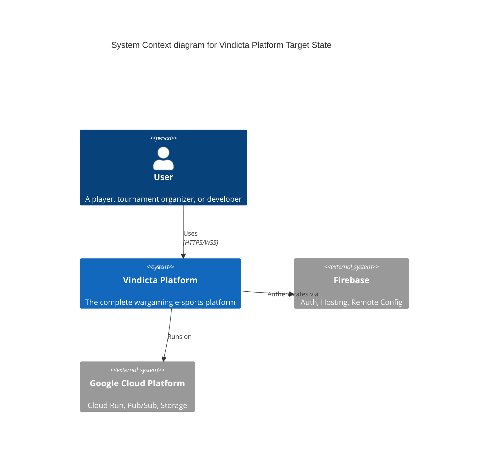
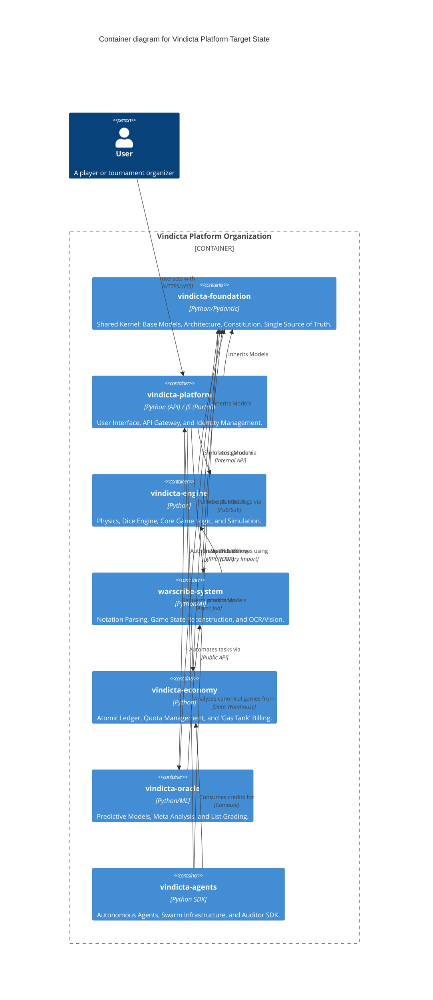
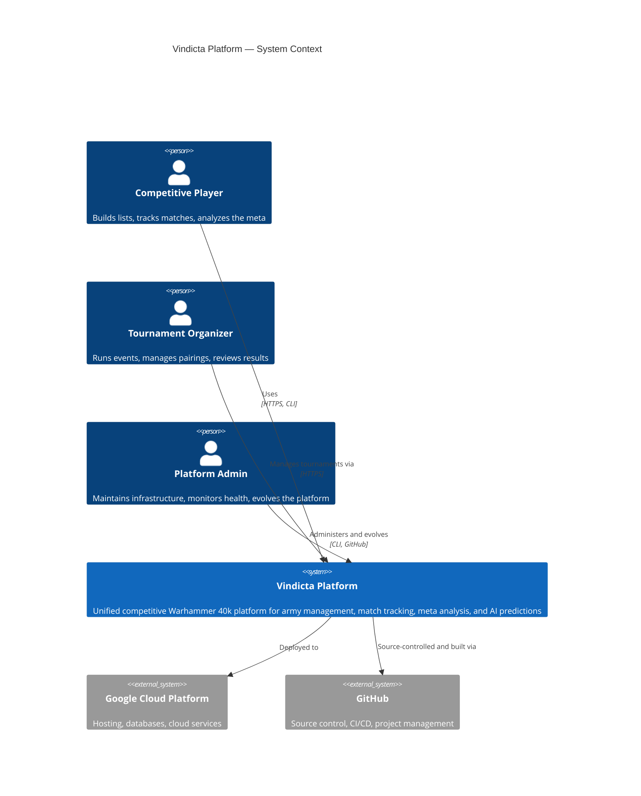
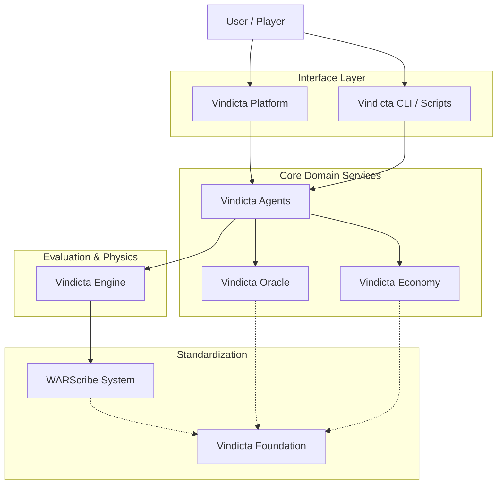
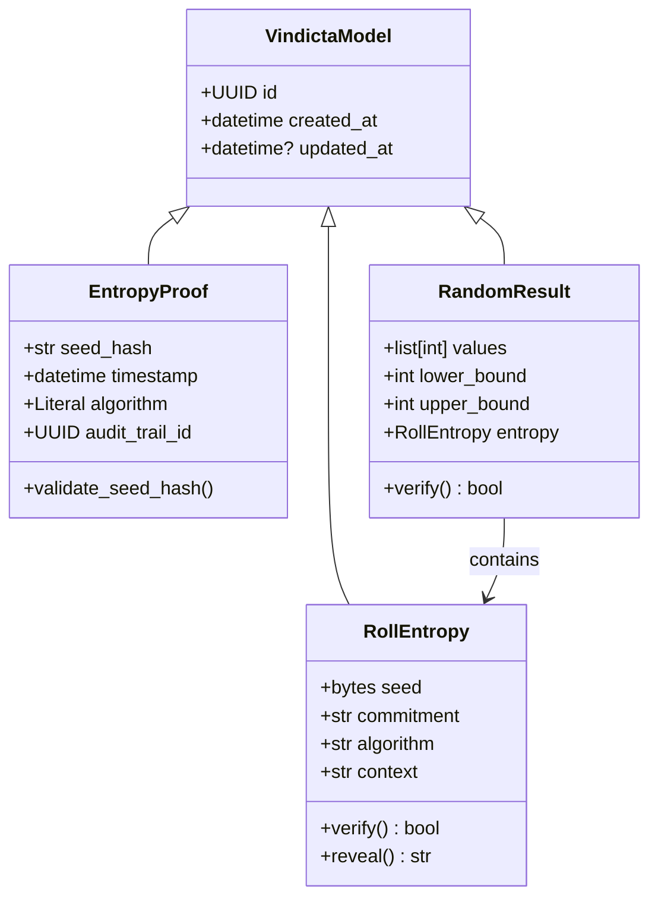
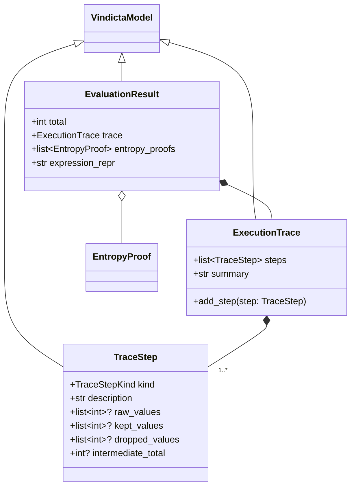
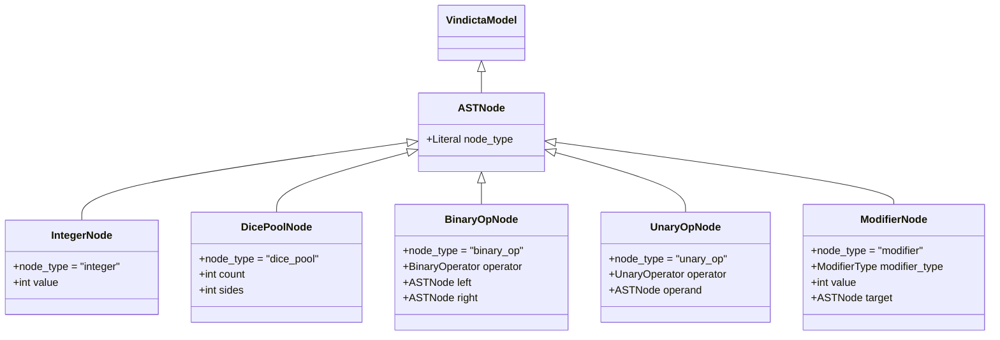
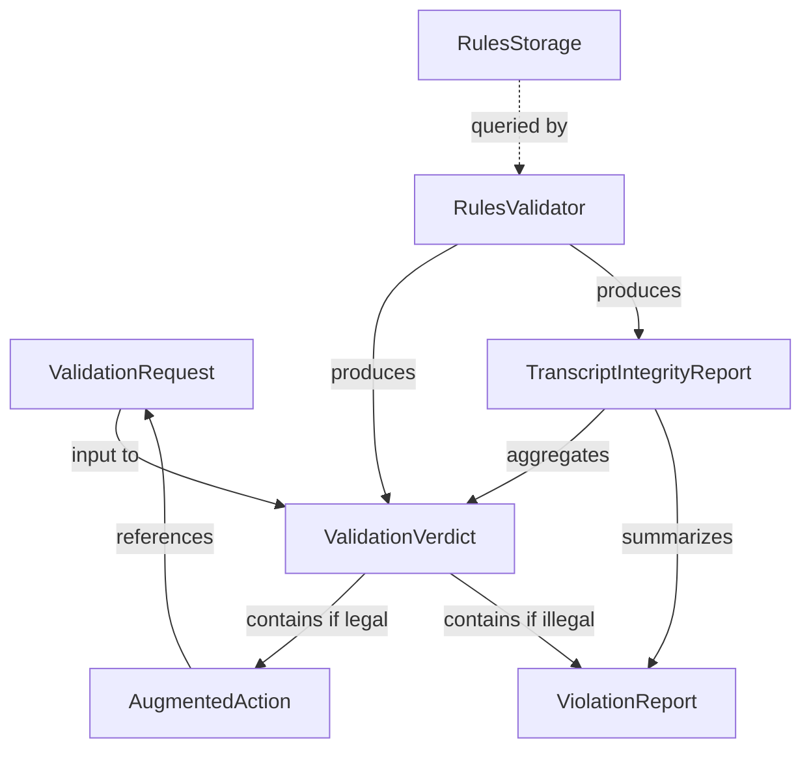

This file is a merged representation of the entire codebase, combined into a single document by Repomix.

# File Summary

## Purpose
This file contains a packed representation of the entire repository's contents.
It is designed to be easily consumable by AI systems for analysis, code review,
or other automated processes.

## File Format
The content is organized as follows:
1. This summary section
2. Repository information
3. Directory structure
4. Repository files (if enabled)
5. Multiple file entries, each consisting of:
  a. A header with the file path (## File: path/to/file)
  b. The full contents of the file in a code block

## Usage Guidelines
- This file should be treated as read-only. Any changes should be made to the
  original repository files, not this packed version.
- When processing this file, use the file path to distinguish
  between different files in the repository.
- Be aware that this file may contain sensitive information. Handle it with
  the same level of security as you would the original repository.

## Notes
- Some files may have been excluded based on .gitignore rules and Repomix's configuration
- Binary files are not included in this packed representation. Please refer to the Repository Structure section for a complete list of file paths, including binary files
- Files matching patterns in .gitignore are excluded
- Files matching default ignore patterns are excluded
- Files are sorted by Git change count (files with more changes are at the bottom)

# Directory Structure
```
.agent/workflows/commit.md
.agent/workflows/pr.md
.agent/workflows/speckit-analyze.md
.agent/workflows/speckit-checklist.md
.agent/workflows/speckit-clarify.md
.agent/workflows/speckit-constitution.md
.agent/workflows/speckit-implement.md
.agent/workflows/speckit-plan.md
.agent/workflows/speckit-specify.md
.agent/workflows/speckit-tasks.md
.agent/workflows/speckit-taskstoissues.md
.devcontainer/ci/devcontainer.json
.devcontainer/devcontainer.json
.devcontainer/docs/devcontainer.json
.gemini/commands/speckit.analyze.toml
.gemini/commands/speckit.checklist.toml
.gemini/commands/speckit.clarify.toml
.gemini/commands/speckit.constitution.toml
.gemini/commands/speckit.implement.toml
.gemini/commands/speckit.plan.toml
.gemini/commands/speckit.specify.toml
.gemini/commands/speckit.tasks.toml
.gemini/commands/speckit.taskstoissues.toml
.gemini/GEMINI.md
.github/ISSUE_TEMPLATE/bug_report.yml
.github/ISSUE_TEMPLATE/feature_request.yml
.github/PULL_REQUEST_TEMPLATE.md
.github/workflows/ci.yml
.github/workflows/docs.yml
.github/workflows/release.yml
.gitignore
.pre-commit-config.yaml
.specify/memory/constitution.md
.specify/scripts/powershell/check-prerequisites.ps1
.specify/scripts/powershell/common.ps1
.specify/scripts/powershell/create-new-feature.ps1
.specify/scripts/powershell/setup-plan.ps1
.specify/scripts/powershell/update-agent-context.ps1
.specify/templates/agent-file-template.md
.specify/templates/checklist-template.md
.specify/templates/constitution-template.md
.specify/templates/plan-template.md
.specify/templates/spec-template.md
.specify/templates/tasks-template.md
CONTRIBUTING.md
docs/api/cli.md
docs/api/rest.md
docs/architecture/adr/_0000-template.md
docs/architecture/adr/0001-record-architecture-decisions.md
docs/architecture/adr/0002-c4-architecture-model.md
docs/architecture/adr/0003-require-interface.md
docs/architecture/adr/0004-api-versioning-strategy.md
docs/architecture/adr/0005-consolidation.md
docs/architecture/adr/0006-consolidation-tactics.md
docs/architecture/adr/0007-just-command-runner.md
docs/architecture/adr/0008-minimal-devcontainer.md
docs/architecture/adr/0009-mcp-client-injection-pattern.md
docs/architecture/adr/0010-mcp-context-window-defaults.md
docs/architecture/adr/0011-adopt-model-context-protocol.md
docs/architecture/adr/0012-local-first-offline-rag.md
docs/architecture/adr/0013-idempotent-markdown-hashing.md
docs/architecture/agents.md
docs/architecture/c4-model.md
docs/architecture/C4-Target-State.md
docs/architecture/cost-model.md
docs/architecture/evolution.md
docs/architecture/index.md
docs/architecture/inference-layer.md
docs/architecture/modules.md
docs/architecture/overview.md
docs/architecture/primordia.md
docs/concepts/warscribe-whitepaper.md
docs/concepts/warscribe.md
docs/constitution.md
docs/features/ai-predictions.md
docs/features/army-management.md
docs/features/match-tracking.md
docs/features/meta-analysis.md
docs/getting-started/first-match.md
docs/getting-started/installation.md
docs/getting-started/quickstart.md
docs/index.md
features/dx.feature
features/steps/dx_steps.py
GEMINI.md
Justfile
mkdocs.yml
pyproject.toml
README.md
ROADMAP.md
specs/001-ocr-parser/checklists/requirements.md
specs/001-ocr-parser/contracts/cli.md
specs/001-ocr-parser/data-model.md
specs/001-ocr-parser/plan.md
specs/001-ocr-parser/quickstart.md
specs/001-ocr-parser/research.md
specs/001-ocr-parser/spec.md
specs/001-ocr-parser/tasks.md
specs/002-dice-core/contracts/api.md
specs/002-dice-core/data-model.md
specs/002-dice-core/plan.md
specs/002-dice-core/quickstart.md
specs/002-dice-core/research.md
specs/002-dice-core/spec.md
specs/002-dice-core/tasks.md
specs/003-dice-evaluator/contracts/evaluator-api.md
specs/003-dice-evaluator/data-model.md
specs/003-dice-evaluator/plan.md
specs/003-dice-evaluator/quickstart.md
specs/003-dice-evaluator/research.md
specs/003-dice-evaluator/spec.md
specs/003-dice-evaluator/tasks.md
specs/004-dice-parser/contracts/grammar.ebnf
specs/004-dice-parser/data-model.md
specs/004-dice-parser/plan.md
specs/004-dice-parser/quickstart.md
specs/004-dice-parser/research.md
specs/004-dice-parser/spec.md
specs/004-dice-parser/tasks.md
specs/005-rag-pipeline/checklists/requirements.md
specs/005-rag-pipeline/data-model.md
specs/005-rag-pipeline/implementation_plan.md.resolved
specs/005-rag-pipeline/plan.md
specs/005-rag-pipeline/quickstart.md
specs/005-rag-pipeline/research.md
specs/005-rag-pipeline/spec.md
specs/005-rag-pipeline/speckit_analysis_report.md
specs/005-rag-pipeline/tasks.md
specs/006-rules-validation-parser/checklists/requirements.md
specs/006-rules-validation-parser/contracts/validation-api.md
specs/006-rules-validation-parser/data-model.md
specs/006-rules-validation-parser/plan.md
specs/006-rules-validation-parser/quickstart.md
specs/006-rules-validation-parser/research.md
specs/006-rules-validation-parser/spec.md
specs/006-rules-validation-parser/tasks.md
specs/01-dice-core/contracts/api.md
specs/01-dice-core/data-model.md
specs/01-dice-core/plan.md
specs/01-dice-core/quickstart.md
specs/01-dice-core/research.md
specs/01-dice-core/spec.md
specs/01-dice-core/tasks.md
specs/01-dice-evaluator/contracts/evaluator-api.md
specs/01-dice-evaluator/data-model.md
specs/01-dice-evaluator/plan.md
specs/01-dice-evaluator/quickstart.md
specs/01-dice-evaluator/research.md
specs/01-dice-evaluator/spec.md
specs/01-dice-evaluator/tasks.md
specs/feat/dice-parser/contracts/grammar.ebnf
specs/feat/dice-parser/data-model.md
specs/feat/dice-parser/plan.md
specs/feat/dice-parser/quickstart.md
specs/feat/dice-parser/research.md
specs/feat/dice-parser/tasks.md
src/vindicta_foundation/__init__.py
src/vindicta_foundation/dice/__init__.py
src/vindicta_foundation/dice/engine.py
src/vindicta_foundation/dice/errors.py
src/vindicta_foundation/dice/types.py
src/vindicta_foundation/evaluator/__init__.py
src/vindicta_foundation/evaluator/engine.py
src/vindicta_foundation/evaluator/errors.py
src/vindicta_foundation/evaluator/protocols.py
src/vindicta_foundation/mcp_server/__init__.py
src/vindicta_foundation/mcp_server/server.py
src/vindicta_foundation/models/__init__.py
src/vindicta_foundation/models/base.py
src/vindicta_foundation/models/dice_ast.py
src/vindicta_foundation/models/economy.py
src/vindicta_foundation/models/entropy.py
src/vindicta_foundation/models/evaluation.py
src/vindicta_foundation/models/rag.py
src/vindicta_foundation/parser/__init__.py
src/vindicta_foundation/parser/errors.py
src/vindicta_foundation/parser/grammar.py
src/vindicta_foundation/parser/transformer.py
src/vindicta_foundation/rag_pipeline/__init__.py
src/vindicta_foundation/rag_pipeline/scraper.py
src/vindicta_foundation/rag_pipeline/storage.py
tests/integration/__init__.py
tests/integration/test_mcp_server.py
tests/test_base.py
tests/test_dice_ast.py
tests/test_dice_engine.py
tests/test_dice_verification.py
tests/test_economy.py
tests/test_entropy.py
tests/test_evaluation_models.py
tests/test_evaluator_engine.py
tests/test_parser_errors.py
tests/test_parser.py
tests/unit/__init__.py
tests/unit/test_rag_models.py
tests/unit/test_scraper.py
tests/unit/test_storage.py
```

# Files

## File: .agent/workflows/commit.md
````markdown
---
description: Standardized way to sign and execute commits locally.
---

1. **Local Pre-flight Checks**: Run `just prepush` (or explicitly run `uv run ruff format --check .`, `uv run ruff check .`, `uv run mypy src tests`, `uv run pytest`, and `uv run behave`). **Do not commit code that fails these tests.**
2. **Atomic Context**: Only stage files that you explicitly modified using `git add <file>`. **NEVER use `git add .` or commit everything**.
3. **Commit Signature**: Run `git commit -m "<Conventional Commit Message>"`
    - If configured correctly, commits will be auto-signed via SSH. 
    - Message format: `type(scope): subject`.
4. **Push Local Changes**: `git push`
````

## File: .agent/workflows/pr.md
````markdown
---
description: Generate a standardized Pull Request description and submit or update it via GitHub CLI.
---
1. **Local Pre-flight Checks**: Run `just prepush` (or explicitly run `uv run ruff format --check .`, `uv run ruff check .`, `uv run mypy src tests`, `uv run pytest`, and `uv run behave`) to assert that the PR will not fail CI checks. **Do not create a PR if these fail.**
2. **Analyze Diff**: Run `git log <base>..<head>` or `git diff <base>...<head>` to understand the full scope of changes made in the branch.
3. **Draft PR Body**: Create a local file named `PR_BODY.md`. It MUST contain the following sections formatted in Markdown:
    *   **Summary**: A high-level overview of the entire PR.
    *   **Changes**: A bulleted list of the specific files changed and what was done.
    *   **Why**: The root cause, business value, or technical reason for the change.
    *   **Verification**: How the changes were verified locally (e.g., test commands, manual inspections).
3. **Submit/Edit**: 
    *   If creating a new PR, run: `gh pr create --title "<Title>" --body-file PR_BODY.md`
    *   If updating an existing PR, run: `gh pr edit <PR_NUMBER> --title "<Title>" --body-file PR_BODY.md`
4. **Cleanup**: Remove the temporary `PR_BODY.md` file using native OS commands (e.g., `Remove-Item PR_BODY.md -Force`).
**CRITICAL RULE**: NEVER use the inline `--body` flag. Always use `--body-file`.
````

## File: .agent/workflows/speckit-analyze.md
````markdown
---
description: Perform cross-artifact consistency and quality analysis.
---
1. Verify alignment between spec, plan, and tasks.
2. Follow the instructions and prompt logic defined in `.gemini/commands/speckit.analyze.toml`.
3. Generate a structured analysis report with critical findings.
````

## File: .agent/workflows/speckit-checklist.md
````markdown
---
description: Generate a checklist for a specific domain or feature.
---
1. Extract operational or quality requirements.
2. Follow the instructions and prompt logic defined in `.gemini/commands/speckit.checklist.toml`.
3. Output a structured checklist for verification.
````

## File: .agent/workflows/speckit-clarify.md
````markdown
---
description: Clarify requirements or technical unknowns with the user.
---
1. Identify areas of ambiguity or conflicting information.
2. Follow the instructions and prompt logic defined in `.gemini/commands/speckit.clarify.toml`.
3. Resolve questions to unblock planning or implementation.
````

## File: .agent/workflows/speckit-constitution.md
````markdown
---
description: Update the project constitution based on the Zero-Order Axioms.
---
1. Read the current project constitution in `docs/constitution.md`.
2. Follow the instructions and prompt logic defined in `.gemini/commands/speckit.constitution.toml`.
3. Apply any constitutional amendments and propagate changes to dependent artifacts.
````

## File: .agent/workflows/speckit-implement.md
````markdown
---
description: Execute the code implementation following the approved plan and tasks.
---
1. Pick up tasks from `tasks.md`.
2. Follow the instructions and prompt logic defined in `.gemini/commands/speckit.implement.toml`.
3. Implement code changes, verify with tests, and update documentation.
````

## File: .agent/workflows/speckit-plan.md
````markdown
---
description: Develop a technical implementation plan for a specified feature.
---
1. Analyze the `spec.md` and research technical constraints.
2. Follow the instructions and prompt logic defined in `.gemini/commands/speckit.plan.toml`.
3. Generate the `plan.md`, `data-model.md`, and other design artifacts.
````

## File: .agent/workflows/speckit-specify.md
````markdown
---
description: Create a detailed functional specification for a new feature.
---
1. Define the scope and requirements for the feature.
2. Follow the instructions and prompt logic defined in `.gemini/commands/speckit.specify.toml`.
3. Generate the `spec.md` in the appropriate feature directory.
````

## File: .agent/workflows/speckit-tasks.md
````markdown
---
description: Decompose an implementation plan into actionable tasks.
---
1. Map plan phases to discrete, testable work items.
2. Follow the instructions and prompt logic defined in `.gemini/commands/speckit.tasks.toml`.
3. Generate the `tasks.md` file.
````

## File: .agent/workflows/speckit-taskstoissues.md
````markdown
---
description: Convert standard tasks into GitHub-compatible issue formats.
---
1. Map `tasks.md` items to issue templates.
2. Follow the instructions and prompt logic defined in `.gemini/commands/speckit.taskstoissues.toml`.
3. Prepare issues for project management integration.
````

## File: .devcontainer/ci/devcontainer.json
````json
{
    "name": "Vindicta CI Debug",
    "image": "mcr.microsoft.com/devcontainers/python:1-3.12-bookworm",
    "containerEnv": {
        "UV_LINK_MODE": "copy",
        "CI": "true"
    },
    "postCreateCommand": "pipx install uv && uv sync --all-extras && uv run pre-commit install"
}
````

## File: .devcontainer/devcontainer.json
````json
{
    "name": "Vindicta Foundation",
    "image": "mcr.microsoft.com/devcontainers/python:1-3.12-bookworm",
    "containerEnv": {
        "UV_LINK_MODE": "copy"
    },
    "features": {
        "ghcr.io/casey/just/just:latest": {},
        "ghcr.io/devcontainers/features/github-cli:1": {}
    },
    "postCreateCommand": "pipx install uv && uv sync --all-extras && uv run pre-commit install",
    "forwardPorts": [8000],
    "customizations": {
        "vscode": {
            "extensions": [
                "ms-python.python",
                "ms-python.mypy-type-checker",
                "charliermarsh.ruff",
                "tamasfe.even-better-toml",
                "skellock.just"
            ],
            "settings": {
                "editor.formatOnSave": true,
                "python.defaultInterpreterPath": "${workspaceFolder}/.venv/bin/python"
            }
        }
    }
}
````

## File: .devcontainer/docs/devcontainer.json
````json
{
    "name": "Vindicta Docs Environment",
    "image": "mcr.microsoft.com/devcontainers/python:1-3.12-bookworm",
    "containerEnv": {
        "UV_LINK_MODE": "copy"
    },
    "postCreateCommand": "pipx install uv && uv sync --all-extras",
    "forwardPorts": [
        8000
    ],
    "customizations": {
        "vscode": {
            "extensions": [
                "yzhang.markdown-all-in-one",
                "DavidAnson.vscode-markdownlint"
            ]
        }
    }
}
````

## File: .gemini/GEMINI.md
````markdown
### Vindicta Foundation Workspace Rules

1. **Dual Constitution Hierarchy**:
    - **Tier 1 (Foundation Law)**: All architectural models and universal definitions must adhere to the **Zero-Order Axioms** defined in `docs/constitution.md`.
    - **Tier 2 (Builder Law)**: Specification generation, implementation rules, and agent workflows strictly rely on `# Project Constitution` in `.specify/memory/constitution.md`, which inherently adheres to Tier 1.
2. **Structural Integrity**:
    - Every domain model MUST inherit from `VindictaModel` in `src/vindicta_foundation/models/base.py`.
    - New models must be explicitly exported in `src/vindicta_foundation/models/__init__.py`.
3. **Meso-Repo Consolidation**:
    - Follow the consolidation tactics in `docs/architecture/adr/0006-consolidation-tactics.md` when porting code from other repositories.
    - Legacy code must be audited against the **Vindicta Axioms** before integration.
4. **Architecture Documentation**:
    - Update the **C4 Model** in `docs/architecture/c4-model.md` when changing container boundaries.
    - Standardize new ADRs using the `docs/architecture/adr/_0000-template.md` and follow the `XXXX-title.md` naming convention.
    - Always verify documentation with `uv run mkdocs build --strict` after any change to the `docs/` directory.
5. **Quality Mandates**:
    - **Coverage**: Minimum 90% test coverage required. Verify with `uv run pytest`.
    - **Types**: Strict type checking with `mypy` is mandatory.
    - **Linting & Formatting**: All code must pass `ruff check .` AND `ruff format --check .`. Verify explicitly during pre-flight checks if `just prepush` fails.
6. **Speckit Integration & Workflows**: Utilize the IDE slash commands defined in `.agent/workflows/` (e.g., `/speckit-plan`, `/speckit-tasks`) for complex tasks like task extraction, planning, and implementation. Do not attempt to manually reference or run `.gemini/commands/*.toml` configuration files.
7. **Workflow Namespacing**: The `speckit-` prefix in `.agent/workflows/` is a **strict namespace** reserved exclusively for Speckit configurations. Other workflows must either be namespace-free (e.g., `pr.md`) or use appropriate custom namespaces for logical grouping.
8. **Pull Request Formatting**: You must NEVER use inline `--body` flags with `gh pr create` or `gh pr edit`. You MUST ALWAYS generate a properly formatted markdown file (e.g., `PR_BODY.md`) and use the `--body-file` flag to ensure high-quality, template-driven documentation. Clean up the body file immediately after execution.
9. **Devcontainer Minimalism (YAGNI)**: The `.devcontainer/devcontainer.json` MUST remain minimal — no custom `Dockerfile`, no `init.sh`, no extra features unless a concrete, immediate need exists. The Microsoft Python base image (`mcr.microsoft.com/devcontainers/python:1-3.12-bookworm`) already provides `pipx`, `git`, `gh`, and the `vscode` user. Only add complexity when the default image provably cannot satisfy a requirement.
10. **Devcontainer Debugging**: When the Antigravity devcontainer appears to "hang," use `npx -y @devcontainers/cli up --workspace-folder .` to surface the real error. Antigravity's CLI does not stream `postCreateCommand` output, making failures look like hangs. Always check for stale `.venv` directories owned by root before rebuilding.
````

## File: .github/ISSUE_TEMPLATE/bug_report.yml
````yaml
name: Bug Report
description: Report unexpected behavior in foundational models or architecture limits.
title: "[Bug]: "
labels: ["bug", "triage"]
body:
  - type: markdown
    attributes:
      value: |
        *Thank you for reporting a bug and helping build a stronger Foundation.*
  
  - type: textarea
    id: description
    attributes:
      label: Bug Description
      description: A clear and concise description of what the bug is.
    validations:
      required: true

  - type: textarea
    id: reproduction
    attributes:
      label: Steps to Reproduce
      description: |
        How can we reproduce the problem? 
        If applicable, provide a short snippet of code or a Gherkin-style behavior step.
    validations:
      required: true

  - type: textarea
    id: expected
    attributes:
      label: Expected Behavior
      description: A clear and concise description of what you expected to happen.
    validations:
      required: true
      
  - type: dropdown
    id: severity
    attributes:
      label: Severity
      description: How critical is this to the platform execution?
      options:
        - Trivial (Cosmetic / Documentation)
        - Minor (Workaround available)
        - Major (Broken core functionality)
        - Critical (System unrecoverable / State corruption)
    validations:
      required: true

  - type: input
    id: env
    attributes:
      label: Environment
      description: Which version of Python, OS, or relevant library versions are you using?
    validations:
      required: true
````

## File: .github/ISSUE_TEMPLATE/feature_request.yml
````yaml
name: Feature Request
description: Request a new axiomatic model or foundational capability.
title: "[Feature]: "
labels: ["enhancement", "triage"]
body:
  - type: markdown
    attributes:
      value: |
        *Thank you for suggesting an improvement to the Vindicta Foundation!*
        *Please make sure this request aligns with the Zero-Order Axioms defined in `docs/constitution.md`.*
  
  - type: textarea
    id: problem
    attributes:
      label: Problem Statement
      description: What problem are you trying to solve? Please provide as much context as possible.
    validations:
      required: true
      
  - type: textarea
    id: proposal
    attributes:
      label: Proposed Solution
      description: What is your preferred implementation path or architectural model?
    validations:
      required: true
      
  - type: textarea
    id: alternatives
    attributes:
      label: Alternatives Considered
      description: What other approaches did you consider and why did you discard them?
    validations:
      required: false
      
  - type: checkboxes
    id: constitution
    attributes:
      label: Constitutional Alignment
      description: Does this feature satisfy the Tier 1 axioms?
      options:
        - label: I have verified that this proposal does not violate the Zero-Order Axioms.
          required: true
````

## File: .github/PULL_REQUEST_TEMPLATE.md
````markdown
## Description
<!-- Describe your changes in detail here. Explain the motivation and rationale. -->

## Foundation Law & Architectural Decision Checklist
Please cross off any items that do not apply by striking them out (e.g. ~~- [ ] N/A~~), but do not delete them.

- [ ] Does this PR adhere to all **Zero-Order Axioms** outlined in `docs/constitution.md`?
- [ ] For any architectural decisions, has an ADR been introduced or an existing ADR updated in `docs/architecture/adr/`?

## Development Quality Checklist
- [ ] My code includes full rigorous test coverage (>=90%) for the introduced behaviors.
- [ ] My code strictly adheres to the type checking models and passes all `mypy` verifications.
- [ ] I have run `uv run ruff check` and `uv run ruff format` and have no remaining issues.
- [ ] Any related documentation has been created or updated (and `uv run mkdocs build --strict` succeeded).
- [ ] If this PR adds or deprecates features, I have added a valid `towncrier` fragment to the `news/` folder.

## Linked Issue
<!-- Link to any relevant issue (e.g. Closes #123) -->
````

## File: .github/workflows/ci.yml
````yaml
name: CI

on:
  push:
    branches: [ "main" ]
  pull_request:
    branches: [ "main" ]

jobs:
  test:
    runs-on: ubuntu-latest
    steps:
    - uses: actions/checkout@v4
    
    - name: Install uv
      uses: astral-sh/setup-uv@v3
      with:
        enable-cache: true
        cache-dependency-glob: "uv.lock"

    - name: Set up Python
      run: uv python install 3.12
      
    - name: Install dependencies
      run: uv sync --all-extras
      
    - name: Lint with Ruff
      run: |
        uv run ruff check .
        uv run ruff format --check .
        
    - name: Type Check with Mypy
      run: uv run mypy src tests
      
    - name: Test with pytest
      run: uv run pytest --cov=vindicta_foundation --cov-report=term-missing --cov-fail-under=90 -n auto
      
    - name: Behavior Check with behave
      run: |
        uv run behave

    - name: Check Docs Build
      run: |
        uv run mkdocs build --strict
````

## File: .github/workflows/docs.yml
````yaml
name: docs
on:
  push:
    branches:
      - main
permissions:
  contents: write
jobs:
  deploy:
    runs-on: ubuntu-latest
    steps:
      - uses: actions/checkout@v4
      - uses: actions/setup-python@v5
        with:
          python-version: 3.x
      - run: pip install mkdocs-material
      - run: mkdocs gh-deploy --force
````

## File: .github/workflows/release.yml
````yaml
name: Release

on:
  push:
    tags:
      - 'v*'

jobs:
  release:
    runs-on: ubuntu-latest
    permissions:
      contents: write
      packages: write
    steps:
      - uses: actions/checkout@v4
        with:
          fetch-depth: 0

      - name: Install uv
        uses: astral-sh/setup-uv@v3

      - name: Set up Python
        run: uv python install 3.12

      - name: Install dependencies
        run: uv sync --all-extras

      - name: Build Changelog via Towncrier
        run: uv run towncrier build --yes --version ${{ github.ref_name }}

      - name: Build package
        run: uv build

      - name: Create GitHub Release
        uses: softprops/action-gh-release@v2
        with:
          body_path: CHANGELOG.md
          generate_release_notes: true
          files: |
            dist/*.whl
            dist/*.tar.gz
````

## File: .gitignore
````
# Byte-compiled / optimized / DLL files
**/__pycache__/
*.py[cod]
*.pycc
*$py.class

# C extensions
*.so

# Distribution / packaging
.Python
build/
develop-eggs/
dist/
downloads/
eggs/
.eggs/
lib/
lib64/
parts/
sdist/
var/
wheels/
share/python-wheels/
*.egg-info/
.installed.cfg
*.egg
MANIFEST

# PyInstaller
#  Usually these files are written by a python script from a template
#  before PyInstaller builds the exe, so you can safely add them to .gitignore.
*.manifest
*.spec

# Installer logs
pip-log.txt
pip-delete-this-directory.txt

# Unit test / coverage reports
htmlcov/
.tox/
.nox/
.coverage
.coverage.*
.cache
nosetests.xml
coverage.xml
*.cover
*.py,cover
.status
.pytest_cache/
test_results.txt
ruff.txt

# Translations
*.mo
*.pot

# Django stuff:
*.log
local_settings.py
db.sqlite3
db.sqlite3-journal

# Flask stuff:
instance/
.webassets-cache

# Scrapy stuff:
.scrapy

# Sphinx documentation
docs/_build/

# PyBuilder
.pybuilder/
target/

# Jupyter Notebook
.ipynb_checkpoints

# IPython
profile_default/
ipython_config.py

# pyenv
#   For a library or package, you might want to ignore these files since the Python version
#   is generally handled by the user's environment.
# .python-version

# pipenv
#   According to pypa/pipenv#1255, lock files are meant to be committed unless
#   deploying a library, in which case 'Pipfile.lock' should be ignored.
# Pipfile.lock

# poetry
#   Similar to Pipfile.lock, poetry.lock is generally committed unless you are building a library.
# poetry.lock

# pdm
#   Similar to Pipfile.lock, pdm.lock is generally committed unless you are building a library.
# pdm.lock

# PEP 582; used by e.g. github.com/fannheyward/coc-pyright
__pypackages__/

# Celery stuff
celerybeat-schedule
celerybeat.pid

# SageMath parsed files
*.sage.py

# Environments
.env
.venv
env/
venv/
ENV/
env.bak/
venv.bak/

# Spyder project settings
.spyderproject
.spyproject

# Rope project settings
.ropeproject

# mkdocs documentation
/site/

# mypy
.mypy_cache/
.dmypy.json
dmypy.json

# Pyre type checker
.pyre/

# pytype static type analyzer
.pytype/

# Cython debug symbols
cython_debug/

# PyCharm
.idea/

# VS Code
.vscode/

# Project specific
uv.lock
.uv/
.coverage
.coverage.*
htmlcov/
.pytest_cache/
.mypy_cache/
.ruff_cache/
.github/PR_BODY.md
PR_BODY.md
ISSUE_BODY.md
.worktrees/
````

## File: .pre-commit-config.yaml
````yaml
repos:
  - repo: https://github.com/pre-commit/pre-commit-hooks
    rev: v4.5.0
    hooks:
      - id: trailing-whitespace
      - id: end-of-file-fixer
      - id: check-yaml
      - id: check-added-large-files

  - repo: https://github.com/astral-sh/ruff-pre-commit
    rev: v0.1.0 # Ensure this matches the minimum ruff version
    hooks:
      - id: ruff
        args: [ --fix ]
      - id: ruff-format

  - repo: https://github.com/pre-commit/mirrors-mypy
    rev: v1.0.0
    hooks:
      - id: mypy
        additional_dependencies: [pydantic]
        args: ["--strict"]
````

## File: CONTRIBUTING.md
````markdown
# Contributing to Vindicta Foundation

Thank you for your interest in contributing to the Vindicta Foundation! To ensure the integrity of the platform, stabilize our multi-agent workflows, and prevent concurrency conflicts, we enforce strict branching and contribution guidelines.

## 🌿 Branching Strategy & Contribution Flow

All development must adhere to **Trunk-Based Development** while enforcing strict namespace boundaries using a fork-based model.

### 1. Feature Development (Fork-Based)
All new features, architectural changes, or significant model additions **must** be developed on a personal fork of the repository.
1. **Fork the Repository**: Create a personal fork of `vindicta-platform/vindicta-foundation`.
2. **Branching**: Create a feature branch (e.g., `feat/my-new-model`) on your fork.
3. **Iterative Development**: Merge iterative changes and test them locally on your fork.
4. **Pull Request**: Open a Pull Request from your personal fork to the `main` branch of the upstream `vindicta-foundation` repository.

*This entirely eliminates cross-contamination and namespace clashing on the primary remote repository, especially when multiple autonomous agents are working concurrently.*

### 2. Chores & Bug Fixes (Direct Branching)
Maintainers and admins are permitted to push branches directly to the primary upstream repository for small chores, hotfixes, or localized documentation updates (e.g., `chore/dependency-update` or `fix/typo`).
- **Discouraged**: While allowed for speed, this bypasses the safety of the fork model and is strongly discouraged for anything beyond minor adjustments.

## 🤖 AI Agent Workflow Rules

If you are deploying an AI Agent (like Speckit or Quantum Leap) to generate code for this repository, you must ensure it complies with the following workspace rules:

1. **Strict Commit Isolation**: Agents must never globally stage files (`git add .`). They must only stage the explicit files they have scoped to prevent grabbing another developer's uncommitted work.
2. **Signed Commits**: All automated and manual commits must have verified SSH signatures.
3. **Main Branch Protection**: Commits directly to the `main` branch of the upstream repository are strictly prohibited. Agents must commit to a dedicated branch or fork and use our templated Pull Request pipelines.

## 📝 Pull Request Standards

All Pull Requests must use a properly formatted description file (no inline CLI bodies) containing the following sections:
- **Summary**: High-level overview.
- **Changes**: Specific bullet points on what was altered.
- **Why**: The root cause or business value.
- **Verification**: Proof of local testing.

For AI agents, utilize the built-in `.agent/workflows/pr.md` command to enforce this structure.
````

## File: docs/api/cli.md
````markdown
# CLI Reference

Command-line interface for the Vindicta Platform.

---

## Installation

```bash
uv pip install git+https://github.com/vindicta-platform/Vindicta-CLI.git
```

## Global Options

```bash
vindicta [OPTIONS] COMMAND
```

| Option | Description |
|--------|-------------|
| `--version` | Show version |
| `--help` | Show help |
| `--verbose` | Verbose output |

---

## Commands

### dice

Roll dice with CSPRNG.

```bash
vindicta dice roll 2d6
vindicta dice roll 3d6 --count 10
```

### warscribe

Work with WARScribe notation.

```bash
vindicta warscribe register --unit "Captain" --id "CPT-01"
vindicta warscribe action "[MOVE: CPT-01 -> Zone-A]"
vindicta warscribe transcript <match-id>
```

### match

Match management.

```bash
vindicta match new --player-list my.json --opponent-list opp.json
vindicta match score --turn 2 --primary 15
vindicta match end --winner player
vindicta match summary <match-id>
```

### oracle

AI predictions.

```bash
vindicta oracle predict --my-list my.json --opponent-list opp.json
vindicta oracle sleepers --faction "Tyranids"
```

### economy

Credit management.

```bash
vindicta economy balance
vindicta economy history --last 10
```
````

## File: docs/api/rest.md
````markdown
# REST API

API reference for the Vindicta Platform.

> [!WARNING]
> **Provisional API**: The REST API is currently undergoing strict revision as part of the **Project Primordia** integration. The endpoints below are provisional. For stable interaction, use the [Vindicta-CLI](../getting-started/quickstart.md) or the Python SDKs directly.

---

## Base URL

```
https://api.vindicta.dev/v1  (Provisional Hosted)
http://localhost:8000/v1     (Local Orchestrator)
```

## Core Endpoints

### Evaluation (Project Primordia)

```http
POST /engine/evaluate
```

Submit a WARScribe transcript for analysis.

```json
{
  "transcript": "...",
  "config": {
    "edition": "10th",
<<<<<<< HEAD
=======
    "simulate_dice": true
>>>>>>> docs/migration-to-foundation
  }
}
```

### Oracle

```http
POST /oracle/ask
```

<<<<<<< HEAD
Query the Meta-Oracle for meta analysis or strategic advice.
=======
Query the Meta-Oracle for rules interpretations or strategic advice.
>>>>>>> docs/migration-to-foundation

---

## Error Responses

Standard HTTP status codes are used.

```json
{
  "status": 400,
  "error": "invalid_notation",
  "message": "Syntax error at line 4: Unknown unit 'SM-Tactical'"
}
```

## OpenAPI Spec

When running the unified platform via Docker, the full OpenAPI specification is available at:
`http://localhost:8000/docs`
````

## File: docs/architecture/adr/_0000-template.md
````markdown
# ADR-XXX: [Title]

**Status**: Proposed | Accepted | Deprecated | Superseded
**Date**: YYYY-MM-DD
**Decision Makers**: [Names/Roles]

## Context

What is the issue that we're seeing that is motivating this decision or change?

## Decision

What is the change that we're proposing and/or doing?

## Consequences

What becomes easier or more difficult to do because of this change?

### Positive

-

### Negative

-

### Neutral

-

## Alternatives Considered

What other options were evaluated?

## References

- [Link to relevant documentation]
````

## File: docs/architecture/adr/0001-record-architecture-decisions.md
````markdown
# 1. Record architecture decisions

Date: 2026-02-05

## Status

Accepted

## Context

We need to record the architectural decisions made on this project.

## Decision

We will use Architecture Decision Records, as [described by Michael Nygard](http://thinkrelevance.com/blog/2011/11/15/documenting-architecture-decisions).

## Consequences

See Michael Nygard's article, linked above. For a lightweight ADR toolset, see Nat Pryce's [adr-tools](https://github.com/npryce/adr-tools).
````

## File: docs/architecture/adr/0002-c4-architecture-model.md
````markdown
# ADR-001: Structurizr DSL as Canonical Architecture Model

## Status

Accepted

## Date

2026-02-07

## Context

The Vindicta Platform has an exploding architectural footprint across 26+ repositories spanning multiple functional domains. There is no single view or entrypoint for an administrator to understand the full system topology, dependencies, and evolution state.

Alternatives considered:

- **Pure Mermaid diagrams** — Simple, no tooling. But lacks single-model/many-views semantics; each diagram is a disconnected artifact that drifts independently.
- **Structurizr (hosted SaaS)** — Full-featured but introduces external dependency and cost.
- **Doc sites (MkDocs-only)** — Already in use for Platform-Docs, but prose-based architecture docs don't provide the structured, queryable model needed.
- **Structurizr DSL (local)** — Single `.dsl` file is the source of truth. Multiple views (C4 L1–L3) are derived from one model. Tooling is open-source. Diagrams are CI-generated artifacts, never hand-edited.

## Decision

Use **Structurizr DSL** (`workspace.dsl`) as the canonical architecture model for the Vindicta Platform.

- The DSL file is the single source of truth for all architecture views.
- Diagrams (Mermaid, SVG) are **CI-generated deployment artifacts**, never committed to `main`.
- Rendered output is served via **GitHub Pages**.
- The architecture entrypoint lives at `docs/architecture/index.md` in Platform-Docs.

## Consequences

- **Requires CI pipeline**: A GitHub Actions workflow must render DSL → diagrams on every push.
- **Diagrams are immutable artifacts**: No hand-editing of generated output. Changes flow through the DSL.
- **Staleness mitigation**: Automated CI checks validate that the DSL model matches the actual GitHub org state.
- **Learning curve**: Contributors must understand Structurizr DSL syntax to propose architecture changes.
- **Evolution path**: Structurizr Lite (Docker) can be added later for interactive local exploration.
````

## File: docs/architecture/adr/0003-require-interface.md
````markdown
# 2. Require AI-assisted coding for platform development

Date: 2026-02-05

## Status

Accepted

## Context

The Vindicta Platform's 6-week roadmap (Feb 4 - Mar 17, 2026) has aggressive velocity targets:

- 20 repositories requiring coordinated development
- Week 1: Foundation scaffolds across 4 priority products (Agent-Auditor-SDK, WARScribe-Core, Primordia-AI, Vindicta-Portal)
- Week 6: v1.0 production releases for 3 products
- Daily schedule includes multiple PRs across repositories (e.g., Feb 4 had 4 PRs merged)

The platform architecture includes an agentic ecosystem with defined roles:

- **Senior Manager**: Orchestrates platform health and cross-team coordination
- **Agile Delivery Lead**: Executes `/adl-standup` and `/adl-pr-review` daily
- **Product Owner**: Manages `/po-sprint-planning` and `/po-roadmap-update`

These agents require AI coding capabilities to execute their workflows autonomously.

Additionally, the Platform Constitution mandates:

- **Article II**: Gemini as the AI engine (Gas Tank Model)
- **Article XVI**: Async-First development for LLM orchestrations
- **Agent-Auditor-SDK**: Implements rate limiting and priority queuing for AI requests

**Question**: Given the roadmap velocity requirements and agentic architecture, should AI-assisted coding be mandatory?

## Decision

**AI-assisted coding is REQUIRED for all Vindicta Platform development.**

All development work MUST use approved AI coding tools:

- **Antigravity** (primary AI coding assistant)
- **GitHub Copilot** (code completion and reviews)
- **Agent-Auditor-SDK** (agentic task orchestration)
- **Gemini AI Studio** (direct API access for agents)

### Enforcement Mechanisms

1. **Rate Limiting**: Agent-Auditor-SDK `RateLimiter` class enforces Gemini free tier limits (60 RPM, 60K TPM)
2. **Gas Tank Model**: AI requests MUST call `acquire()` before API calls, respecting quota limits
3. **Priority Queue**: Human requests prioritized over agent background work
4. **Cost Controls**: Operations stop immediately when quota exhausted (Constitution I compliance)

## Consequences

### Positive

- ✅ **Enables 6-week roadmap delivery**: Manual development cannot achieve required velocity
- ✅ **Supports agent workflows**: ADL/PO/SM agents can execute autonomously
- ✅ **Parallelizes development**: Multiple PRs per day across repositories (demonstrated in Week 1 with 6 PRs merged)
- ✅ **Free tier compliant**: Rate limiting prevents quota overages
- ✅ **Consistent with architecture**: Leverages Agent-Auditor-SDK and Gemini API

### Negative

- ⚠️ **API quota dependency**: Platform velocity limited by Gemini free tier (mitigated by rate limiting)
- ⚠️ **Agent maturity risk**: Requires Agent-Auditor-SDK stability (Week 1 PR #12 completed this)
- ⚠️ **Learning curve**: Developers must adopt AI-first workflows (addressed by agent AGENT.md documentation)

### Neutral

- Agent workflows become the default interaction model
- Human intervention required for architecture reviews and release approvals
- Manual development remains possible but discouraged

## Alternatives Considered

### Alternative 1: No AI Assistance (Manual Only)

**Rationale**: Maximum human control, zero AI costs

**Rejected because**:

- Cannot meet 6-week timeline
- Single-threaded development (no parallelization)
- Invalidates agentic ecosystem architecture
- Contradicts Constitution Article II (Gemini mandate)

### Alternative 2: Optional AI Assistance

**Rationale**: Flexibility for developers, can be enabled per-project

**Rejected because**:

- Inconsistent velocity across repositories
- Schedule uncertainty
- Undermines agent autonomy
- Doesn't leverage platform architecture

## Compliance

| Constitution Article | How This Decision Complies |
|----------------------|----------------------------|
| I. Economic Prime Directive | Free tier enforced via `RateLimiter` (60 RPM/TPM limits) |
| II. Gas Tank Model | `acquire()` method implements gas tank for Gemini API |
| III. Spec-Driven Methodology | Specs remain human-authored; code AI-generated from specs |
| V. Agentic Rights & Responsibilities | Formalizes AI assistants as first-class development participants |
| XVI. Async-First Mandate | AI tools enable concurrent development across repositories |

## Implementation

Week 1 demonstrated successful AI-assisted development:

- **6 PRs merged** in 2 days (Feb 4-5)
- **Agent-Auditor-SDK PR #12**: Rate limiting prevents 429 errors
- **WARScribe-Core PR #8**: Edition abstraction with tests
- **Primordia-AI PR #6**: DuckDB schema implementation
- **Vindicta-Portal PR #21, #22**: Firebase config + design tokens
- **Platform-Docs PR #2**: Branding updates

All implementations approved by architecture review with 100% Constitution compliance.

## References

- [Platform Constitution v2.7.0](file:///.specify/memory/constitution.md)
- [Agent-Auditor-SDK Rate Limiter PR #12](https://github.com/vindicta-platform/Agent-Auditor-SDK/pull/12)
- [Architecture Review - Week 1](file:///C:/Users/bfoxt/.gemini/antigravity/brain/15a9e296-a3eb-4686-89ec-bdd29f3b1d67/architecture_review_week1.md)
- [6-Week Roadmap Schedule](https://github.com/vindicta-platform/.github/blob/main/ROADMAP.md)
- [Agent Team Charter v2.1](https://github.com/vindicta-platform/Vindicta-Agents/blob/main/agents/shared/TEAM_CHARTER.md)
````

## File: docs/architecture/adr/0004-api-versioning-strategy.md
````markdown
# 3. API Versioning Strategy for Vindicta Platform

Date: 2026-02-05

## Status

Proposed

## Context

The Vindicta Platform API (Vindicta-API) is being designed to serve multiple frontend clients (Vindicta-Portal, Logi-Slate-UI) and external integrations. The API will evolve over time as new features are added and requirements change.

**Question**: How should we version the API to ensure:

- Backward compatibility for existing clients
- Clear deprecation policies
- Minimum disruption to users
- Alignment with REST best practices

## Decision

**We will use URL-based versioning with a major version number in the path: `/api/v{N}/`**

### Versioning Rules

1. **URL Structure**: All endpoints include major version: `/api/v1/army`, `/api/v2/meta`
2. **Breaking Changes**: Increment major version (v1 → v2) for:
   - Removing endpoints or fields
   - Changing response schemas incompatibly
   - Modifying authentication requirements
   - Altering rate limit behavior

3. **Non-Breaking Changes**: Keep same version for:
   - Adding new endpoints
   - Adding optional request parameters
   - Adding new response fields
   - Bug fixes and performance improvements

4. **Deprecation Policy**:
   - Old versions supported for **12 months** after new version release
   - Deprecation warnings in response headers: `Deprecation: true`, `Sunset: <date>`
   - 90-day notice before removal
   - Documentation updated immediately

5. **Free Tier vs Paid**:
   - Latest version (e.g., v2) available only to paid users initially
   - Previous version (e.g., v1) remains free tier
   - After 6 months, latest version becomes free tier

### Example Lifecycle

```
Feb 2026:  v1 released (free tier)
Aug 2026:  v2 released (paid only)
           v1 remains free, deprecated
Feb 2027:  v2 becomes free tier
           v1 removed (12-month support window expired)
```

## Consequences

### Positive

- ✅ **Clear expectations**: Clients know exactly which version they're using
- ✅ **No header parsing**: Version in URL is visible in logs and browser dev tools
- ✅ **Easy routing**: FastAPI can route by path prefix cleanly
- ✅ **Monorepo-friendly**: Old and new versions coexist in same codebase

### Negative

- ⚠️ **URL duplication**: Multiple versions mean duplicate endpoint paths
- ⚠️ **Maintenance burden**: Supporting 2 versions simultaneously for 12 months
- ⚠️ **Client migration**: Clients must update URLs (not just headers)

### Neutral

- Versioning strategy applies to **all** Vindicta Platform APIs (future microservices use same pattern)
- OpenAPI specs generated per version: `openapi-v1.yaml`, `openapi-v2.yaml`

## Alternatives Considered

### Alternative 1: Header-Based Versioning

**Approach**: Use `Accept: application/vnd.vindicta.v1+json` header

**Rejected because**:

- Harder to test (browsers don't show headers by default)
- More complex routing in FastAPI
- Users forget to set headers

### Alternative 2: Query Parameter Versioning

**Approach**: `/api/army?version=1`

**Rejected because**:

- Non-standard in REST APIs
- Easy to forget query params
- Caching becomes complex

### Alternative 3: No Versioning (Breaking Changes Only)

**Approach**: Single `/api/` prefix, breaking changes force all clients to upgrade

**Rejected because**:

- Violates Platform Constitution (no unauthorized disruption)
- Free tier users can't be forced to upgrade
- Doesn't support gradual migration

## Compliance

| Constitution Article | How This Decision Complies |
|----------------------|----------------------------|
| I. Economic Prime Directive | 12-month support window prevents forced free tier upgrades |
| III. Spec-Driven Methodology | OpenAPI specs versioned per major version |
| XVII. Repository Isolation | Each API version isolated in separate router modules |

## Implementation

### FastAPI Structure

```python
# src/vindicta_api/main.py
from fastapi import FastAPI
from vindicta_api.v1 import router as v1_router
# Future: from vindicta_api.v2 import router as v2_router

app = FastAPI()
app.include_router(v1_router, prefix="/api/v1")
# app.include_router(v2_router, prefix="/api/v2")
```

### Version 1 (Current)

- **Release**: Week 6 (Mar 15,2026)
- **Target**: v1.0.0 with /army, /game, /meta endpoints
- **Free Tier**: Yes

### Deprecation Process

1. **90 days before sunset**: Add `Deprecation` header to all v1 responses
2. **documentation update**: Mark v1 endpoints as deprecated in OpenAPI spec
3. **Client notification**: Email all registered users with migration guide
4. **Sunset date**: Remove v1 code after 12-month support window

## References

- [OpenAPI 3.0 Spec](file:///c:/Users/bfoxt/vindicta-platform/Vindicta-API/docs/openapi.yaml)
- [REST API Versioning Best Practices](https://restfulapi.net/versioning/)
- [Platform Constitution v2.7.0](file:///.specify/memory/constitution.md)
- [Vindicta-API README](file:///c:/Users/bfoxt/vindicta-platform/Vindicta-API/README.md)
````

## File: docs/architecture/adr/0005-consolidation.md
````markdown
# ADR: Consolidation and Standardization of Vindicta Platform

## Status
Accepted

## Context
The Vindicta Platform currently consists of ~29 repositories. While this provides maximum isolation, it has led to significant DRY (Don't Repeat Yourself) violations and fragmented Domain-Driven Design (DDD). Basic entities like `DiceRoll`, `Unit`, and `Action` are redefined across multiple repositories. The Constitution Rule VII ("No cross-repo runtime dependencies") currently blocks the use of a shared library, forcing duplication.

## Objectives
1. **Enforce DRY**: Eliminate duplicate model definitions and redundant logic.
2. **Strengthen DDD**: Clearly define Bounded Contexts.
3. **Standardize**: Align all Python components on Pydantic V2, `uv`, and common interfaces.
4. **Reduce Overhead**: Consolidate "nano-repos" into cohesive domain-driven repositories.

## Domain Boundary Mapping (Proposed)

### 1. **Foundation Context (The "Lex")**
*   **Purpose**: Shared base models, interfaces, constitutional axioms, and **System Architecture**.
*   **Consolidated Repositories**: `Vindicta-Core`, `Atomic-Ledger-Py`, `devcontainers`, `.github`, `Platform-Docs`.
*   **Result**: `vindicta-foundation`
*   **Architecture Documentation**: `vindicta-foundation/docs/architecture` (ADRs, C4 Models, RFCs).

### 2. **Economic Context (The "Market")**
*   **Purpose**: Ledger management, quotas, infra cost control (Gas Tank).
*   **Consolidated Repositories**: `Economy-Engine`, `Quota-Manager`, `Metered-SaaS-Logic`, `Audit-Log-Pro`.
*   **Result**: `vindicta-economy`

### 3. **Mechanical Context (The "Physics")**
*   **Purpose**: Dice, entropy, combat results, 10th Ed logic.
*   **Consolidated Repositories**: `Dice-Engine`, `Entropy-Buffer`, `Primordia-AI` (core engine).
*   **Result**: `vindicta-engine`

### 4. **Notation Context (The "Scribe")**
*   **Purpose**: Wargame Notation System (WNS), parsing, and recording.
*   **Consolidated Repositories**: `WARScribe-Core`, `WARScribe-Parser`, `WARScribe-CLI`, `Battle-Transcript-Toolkit`.
*   **Result**: `warscribe-system`

### 5. **Predictive Context (The "Oracle")**
*   **Purpose**: Probability, statistics, and AI prediction.
*   **Consolidated Repositories**: `Meta-Oracle`, `Arbiter-Predictor`.
*   **Result**: `vindicta-oracle`

### 6. **Interface Context (The "Gateway")**
*   **Purpose**: User interfaces and public APIs.
*   **Consolidated Repositories**: `Vindicta-API`, `Vindicta-Portal`, `Logi-Slate-UI`.
*   **Result**: `vindicta-platform`

### 7. **Agent Context (The "Swarm")**
*   **Purpose**: Agent SDKs, workflows, and monitoring.
*   **Consolidated Repositories**: `Vindicta-Agents`, `Agent-Auditor-SDK`, `agent-repo`, `specify-repo`.
*   **Result**: `vindicta-agents`

## Technical Standardization
1.  **Pydantic V2**: All data models MUST inherit from a base class in `foundation`.
2.  **Strict Typing**: `mypy` strict mode enforced across all repos.
3.  **Library Distribution**: `vindicta-foundation` will be published as a private package (or git-referenced in `pyproject.toml`) to allow reuse without breaking "runtime" independence (each service still owns its `venv`).
4.  **Axiom-Driven Engineering (ADE)**: Core logic must be derived from constitutional axioms defined in `foundation`.

## Refactoring Plan
1.  **Phase 1 (Foundation)**: Merge `Vindicta-Core` and shared models. Establish the base `VindictaModel`.
2.  **Phase 2 (Physics & Scribe)**: Consolidate `Dice-Engine` and `WARScribe` modules. Align them with `foundation` models.
3.  **Phase 3 (Economy)**: Unify credit and quota systems into a single transactional ledger.
4.  **Phase 4 (Legacy Cleanup)**: Archive redundant "nano-repos". Update CI/CD pipelines.

## Consequences
*   **Pros**: Significantly reduced code duplication, faster cross-domain feature development, consistent data structures.
*   **Cons**: Requires initial effort to merge history (or fresh start), updates to many imports.
````

## File: docs/architecture/adr/0006-consolidation-tactics.md
````markdown
# ADR-003: Platform Consolidation & Deprecation Strategy

## Status
Proposed

## Context
Following **ADR-001 (Consolidation)**, the physical migration of code from 29+ repositories into 7 Meso-repositories is the primary focus. However, we lack a standardized method for decommissioned repositories, leading to "ghost repos" that confuse new contributors.

## 1. Deprecation Standard (The "Decommission" Protocol)

Every repository slated for consolidation MUST follow this checklist before being marked as **Archived** in GitHub:

### A. The README Banner
The top of the README must be replaced with the following block:
```markdown
# ⚠️ ARCHIVED — Consolidated into `[NEW-REPO-NAME]`

> **This repository has been superseded.**
> All functionality has been ported into [`[NEW-REPO-NAME]/[PATH]`](https://github.com/vindicta-platform/[NEW-REPO-NAME]) as part of [ADR-001](https://github.com/vindicta-platform/vindicta-foundation/blob/main/docs/architecture/adr/0005-consolidation.md).

## Migration Mapping
| Legacy Path | New Path                      |
| :---------- | :---------------------------- |
| `src/`      | `[NEW-REPO]/src/[PACKAGE]/`   |
| `tests/`    | `[NEW-REPO]/tests/[PACKAGE]/` |

## Status
- **Read-only**: No new development or security patches will occur here.
- **Issues**: Redirected to the target repository.
```

### B. Repository Cleanup
1.  **Issue redirection**: Close all open issues with a pointer to the new repository.
2.  **Secret Scrub**: Verify all repository secrets are migrated to the target Meso-repo.
3.  **GitHub Archive**: Set the repository status to "Archived" (read-only).

---

## 2. Consolidation Map (Audit)

Based on a scan of the organization, the following repositories are identified as **Stale/Legacy** and require consolidation:

### Domain 1: Foundation (The Lex)
- [x] `Platform-Docs` -> `vindicta-foundation/docs`
- [ ] `Atomic-Ledger-Py` -> `vindicta-foundation` (Base objects) or `vindicta-economy`
- [ ] `devcontainers` -> `vindicta-platform/.devcontainer` (shared config)
- [ ] `docs` -> (Redundant, merge with foundation/docs)

### Domain 2: Economy (The Market)
- [ ] `Economy-Engine` -> `vindicta-economy`
- [ ] `Quota-Manager` -> `vindicta-economy`
- [ ] `Metered-SaaS-Logic` -> `vindicta-economy`
- [ ] `Audit-Log-Pro` -> `vindicta-economy`

### Domain 3: Engine (The Physics)
- [ ] `Dice-Engine` -> `vindicta-engine`
- [ ] `Entropy-Buffer` -> `vindicta-engine`
- [ ] `Primordia-AI` -> `vindicta-engine`

### Domain 4: Scribe (The Scribe)
- [ ] `WARScribe-Core` -> `warscribe-system`
- [ ] `WARScribe-Parser` -> `warscribe-system`
- [ ] `WARScribe-CLI` -> `warscribe-system`

### Domain 5: Oracle (The Oracle)
- [ ] `Meta-Oracle` -> `vindicta-oracle`
- [ ] `Arbiter-Predictor` -> `vindicta-oracle`

### Domain 6: Gateway (The Interface)
- [ ] `Vindicta-API` -> `vindicta-platform`
- [ ] `Logi-Slate-UI` -> `vindicta-platform/ui/logi-slate`
- [ ] `platform-core` -> `vindicta-platform/api`

---

## 3. Consolidation Workflow

To ensure history is preserved where possible:

1.  **Subtree Merge**: Use `git subtree add` to bring the legacy repo into the target folder while preserving commit history.
2.  **Dependency Fix**: Update `pyproject.toml` or `package.json` in the target Meso-repo to include the new code as an internal module.
3.  **CI/CD Alignment**: Move the original repo's test suite into the target's `/tests` directory and ensure the monolithic runner detects them.
4.  **Axiom check**: Verify that all ported models inherit from `VindictaModel` in foundation.
````

## File: docs/architecture/adr/0007-just-command-runner.md
````markdown
# ADR-0007: Just as the Command Runner

## Status
Accepted

## Context
Developer environments across different operating systems consistently struggle with command runners. Scripts often reside in `make` (which lacks native Windows support), `npm package.json` (which requires node.js), or undocumented `uv run` / shell scripts. Lengthy commands for formatting, testing, and continuous integration can easily be mistyped or forgotten, leading to DX friction.

## Decision
We will use [`just`](https://github.com/casey/just) as the primary command runner for the `vindicta-foundation` repository and strongly recommend its use across the platform.

### Rationale
- **Cross-Platform by Default**: `just` runs identical recipes on Windows, macOS, and Linux, which aligns well with our developer ecosystem.
- **Self-Documenting**: Running `just` without arguments lists all available commands with their comments, making onboarding frictionless.
- **Dependency Management**: We can easily chain tasks (e.g., `prepush` running `lint` then `test`), similar to `make` but without the idiosyncrasies of Makefiles (like tab requirements).
- **Environment Isolation**: It plays perfectly well with `uv run`, allowing us to explicitly invoke our sealed virtual environment commands.

## Consequences
- Developers are highly encouraged to install `just` to maximize their DX, though the native `uv run` commands remain accessible as fallbacks.
- New scripts and automation tasks must be added to the `Justfile` instead of standalone `.bat` or `.sh` files where applicable.
````

## File: docs/architecture/adr/0008-minimal-devcontainer.md
````markdown
# ADR-0008: Minimal Devcontainer Configuration

**Status**: Accepted
**Date**: 2026-02-21
**Decision Makers**: Brandon Fox

## Context

The Foundation devcontainer was initially over-engineered with a custom `Dockerfile` (to fix a Yarn GPG key issue), an `init.sh` bootstrap script (to install `uv`, `just`, clone context repos, and seed `.gemini` knowledge), and multiple devcontainer features (`common-utils`, `docker-outside-of-docker`, `github-cli`).

This caused persistent build and startup failures:

- The `docker-outside-of-docker` feature's `socat` entrypoint blocked the container's main process.
- The custom `Dockerfile` layered unnecessary complexity on top of the Microsoft image.
- The `init.sh` script introduced fragile multi-step bootstrapping.
- Stale `.venv` directories owned by root from Docker test runs caused `uv sync` permission failures.
- The Antigravity IDE's devcontainer CLI does not stream `postCreateCommand` output, making all these failures appear as silent hangs.

## Decision

Apply YAGNI. The devcontainer configuration is reduced to a single 7-line `devcontainer.json`:

```json
{
    "name": "Vindicta Foundation",
    "image": "mcr.microsoft.com/devcontainers/python:1-3.12-bookworm",
    "containerEnv": { "UV_LINK_MODE": "copy" },
    "postCreateCommand": "pipx install uv && uv sync --all-extras"
}
```

No `Dockerfile`. No `init.sh`. No extra features. The Microsoft Python base image already provides `pipx`, `git`, `gh`, the `vscode` user, and proper devcontainer lifecycle handling.

## Consequences

### Positive

- Zero-config onboarding: open repo → Rebuild in Container → working environment
- No custom Dockerfile to maintain or debug
- No shell script failure modes
- Eliminates all observed startup hang/failure patterns

### Negative

- `just` is not pre-installed (install manually with `uv tool install rust-just`)
- Context repos from other platform domains are not auto-cloned (clone manually as needed)

### Neutral

- Yarn GPG key issue in the Microsoft image is not triggered because we don't install features that run `apt-get update`

## Alternatives Considered

1. **Custom Dockerfile + init.sh**: Over-engineered, fragile, multiple failure modes.
2. **Vanilla `python:3.12-bookworm` image**: Lacks devcontainer lifecycle plumbing (no `vscode` user, no `pipx`, Antigravity CLI probe hangs).
3. **Pre-built custom Docker image**: Adds registry dependency and image maintenance burden.

## References

- [Devcontainer specification](https://containers.dev/implementors/json_reference/)
- [Microsoft Python devcontainer images](https://github.com/devcontainers/images/tree/main/src/python)
````

## File: docs/architecture/adr/0009-mcp-client-injection-pattern.md
````markdown
# ADR-0009: MCP Client Injection Pattern

**Status**: Proposed
**Date**: 2026-02-23
**Decision Makers**: Brandon Fox

## Context

The `010-mcp-client-integration` spec (Vindicta-Agents) introduces an `MCPRulesClient` — an async client that agents use to query the local RAG MCP server for game rules. The platform must decide how this client is provided to individual agent nodes within the LangGraph swarm.

Two established injection patterns exist in the codebase:

1. **`RunnableConfig["configurable"]` injection** — used today by `NexusClient` (`nexus/client.py`). The client is instantiated once at graph startup and threaded through every node via LangGraph's `configurable` dict. Agents access it via `config["configurable"]["nexus_client"]`.
2. **Constructor injection** — each agent node class receives the client as a constructor argument, stored as an instance attribute.

The choice affects testability, concurrency safety, and how cleanly new tool clients can be added as the platform grows.

## Decision

Adopt the existing `RunnableConfig["configurable"]` injection pattern for `MCPRulesClient`, keyed as `mcp_client`.

Agents will access the client via:

```python
mcp_client: MCPRulesClient = config["configurable"]["mcp_client"]
result = await mcp_client.search_rules("toughness Space Marine")
```

The `swarm_startup.py` module will be responsible for instantiating and injecting the client into `RunnableConfig` at graph boot, alongside the existing `NexusClient`.

## Consequences

### Positive

- Consistent with the `NexusClient` precedent — zero new patterns for developers to learn
- LangGraph-native: `configurable` dict is the idiomatic way to pass shared resources through graph execution
- Easily mockable in tests: override the `configurable` key with a stub
- Supports concurrent graph invocations: each invocation can carry its own client instance if needed

### Negative

- Type safety relies on convention (string key `"mcp_client"`) rather than compile-time guarantees — a typo in the key silently returns `None`
- Adding many clients to `configurable` may eventually warrant a typed registry or dependency container

### Neutral

- The `MCPRulesClient` must be async-compatible, same as `NexusClient`
- This decision does not preclude wrapping the injection in a typed helper (e.g., `get_mcp_client(config)`) for safer access

## Alternatives Considered

1. **Constructor injection**: More explicit, but breaks the LangGraph functional node pattern where nodes are plain functions operating on `(state, config)`. Would require refactoring all nodes to classes.
2. **Global singleton**: Simplest, but untestable, not concurrency-safe across multiple graph invocations, and violates the platform's explicit-dependency principles.
3. **LangGraph `InjectedToolArg`**: Newer LangGraph feature for injecting runtime values into tool arguments. Could work for the `search_rules` tool specifically, but doesn't solve non-tool access patterns and adds coupling to a less-stable API.

## References

- [NexusClient injection](file:///c:/Users/bfoxt/vindicta-playground/Vindicta-Agents/src/vindicta_agents/nexus/client.py)
- [Swarm startup](file:///c:/Users/bfoxt/vindicta-playground/Vindicta-Agents/src/vindicta_agents/swarm_startup.py)
- [LangGraph RunnableConfig docs](https://langchain-ai.github.io/langgraph/concepts/low_level/#runnableconfig)
- [010-mcp-client-integration spec](file:///c:/Users/bfoxt/vindicta-playground/Vindicta-Agents/specs/010-mcp-client-integration/spec.md)
````

## File: docs/architecture/adr/0010-mcp-context-window-defaults.md
````markdown
# ADR-0010: MCP Client Context Window Defaults

**Status**: Proposed
**Date**: 2026-02-23
**Decision Makers**: Brandon Fox

## Context

The `MCPRulesClient` (spec `010-mcp-client-integration`) retrieves rule markdown chunks from the RAG MCP server. A single broad query can return 10–20 chunks totalling 10,000–15,000+ tokens. Agents operate within finite LLM context windows (Gemini 1.5 Flash: 1M tokens theoretical, but practical prompt budgets are much smaller for cost and latency reasons). Without a client-side cap, agents risk:

1. **Context pollution** — low-relevance chunks dilute the signal for the LLM.
2. **Latency bloat** — more tokens = slower inference, violating the <1.5s retrieval target.
3. **Silent truncation** — if the LLM or framework truncates input silently, critical rules may be lost unpredictably.

A default token budget must be chosen. The trade-off is between comprehensiveness (more context = more rules coverage) and precision (less context = faster, more focused reasoning).

## Decision

Set the default `max_context_tokens` to **8,192 tokens** with the following truncation strategy:

1. Chunks are returned in descending relevance order (highest `score` first).
2. Chunks are accumulated until adding the next chunk would exceed the budget.
3. **No mid-chunk splitting** — a chunk is either fully included or fully excluded.
4. If any chunks are dropped, the `RulesQueryResult.truncated` flag is set to `true` and a `structlog` warning is emitted.

Token estimation uses a simple heuristic: `len(content) // 4` (roughly 4 characters per token for English text). This avoids a tokenizer dependency while being accurate enough for budget enforcement.

### Rationale for 8,192

- Gemini 1.5 Flash handles 8K retrieval context comfortably alongside a system prompt and conversation history.
- The RAG pipeline's average chunk size is ~500 tokens, so 8,192 tokens ≈ 16 chunks — enough to cover most focused queries without overloading.
- Agents with specialized needs (e.g., full-army analysis) can override to higher values explicitly.
- The value is a power of two, aligning with common LLM context window conventions.

## Consequences

### Positive

- Predictable agent behaviour: retrieved context size is bounded and documented
- Agents always receive the most relevant chunks first
- No silent data loss — truncation is explicit via `truncated` flag and logging
- Zero external tokenizer dependency (no `tiktoken`, no model-specific encoders)

### Negative

- The `len // 4` heuristic is approximate — actual token counts may vary ±15% for non-English text, code blocks, or special characters in rules markdown
- 8,192 may be too conservative for agents doing cross-faction comparisons that legitimately need 20+ chunks
- Overriding the default requires the caller to know and set `max_context_tokens`, which is a configuration detail leaked to the agent layer

### Neutral

- The default can be adjusted in `MCPClientConfig` without breaking changes
- A future ADR could introduce model-aware tokenization if the heuristic proves insufficient

## Alternatives Considered

1. **No default cap (unlimited)**: Risks context pollution, unpredictable latency, and silent truncation at the LLM level. Rejected.
2. **4,096 tokens**: Too restrictive for queries spanning multiple units or complex interactions. Would frequently trigger truncation on routine queries.
3. **16,384 tokens**: Generous but risks latency degradation and wastes context budget that agents need for conversation history and system prompts.
4. **Exact tokenizer (tiktoken / SentencePiece)**: Accurate but adds a heavy dependency, couples the client to a specific model family, and is overkill for a budget enforcement heuristic.

## References

- [010-mcp-client-integration spec](file:///c:/Users/bfoxt/vindicta-playground/Vindicta-Agents/specs/010-mcp-client-integration/spec.md)
- [005-rag-pipeline spec](file:///c:/Users/bfoxt/vindicta-playground/vindicta-foundation/specs/005-rag-pipeline/spec.md) — defines chunk structure and scoring
- [Gemini 1.5 Flash context window](https://ai.google.dev/gemini-api/docs/models#gemini-1.5-flash)
````

## File: docs/architecture/adr/0011-adopt-model-context-protocol.md
````markdown
# ADR-0011: Adopt Model Context Protocol (MCP)

**Status**: Accepted
**Date**: 2026-02-23
**Decision Makers**: Brandon Fox

## Context

The Vindicta platform's AI swarm relies heavily on accessing external systems, specifically the `vindicta-foundation`'s RAG Pipeline for Warhammer 40k rules data. As the agent swarm scales out across different responsibilities (Meta-Oracle debates, Scribe rules verification, Arbitration predictions), creating tightly-coupled, proprietary APIs for every new tool becomes an unmaintainable architectural anti-pattern. Moreso, as new LLMs (from different providers) are implemented, integrating bespoke tooling configurations is inefficient.

## Decision

Adopt the **Model Context Protocol (MCP)** as the standard integration layer for all agent tools within the Vindicta ecosystem. 

All external tool interfaces—starting with the RAG Pipeline's `search_40k_rules` logic—MUST be exposed as an MCP Server. The `vindicta-agents` SDK MUST consume these services via an MCP Client interface.

## Consequences

### Positive

- **Interoperability**: Any MCP-compliant agent (Claude Desktop, local LangGraph agents, future LLM architectures) can discover and utilize Vindicta's tools without writing custom integration bridges.
- **Decoupled Architecture**: The server (e.g., Python FastAPI/MCP SDK) handles the complex backend (ChromaDB, Ollama), while the agent SDK remains lightweight, only needing an MCP network client.
- **Standardized Definitions**: Tool schemas (input/output) are strictly defined by the MCP specification, reducing hallucination caused by poorly described custom JSON-RPC schemas.
- **Centralized Security**: We can govern agent tool access via the MCP server Gateway rather than auditing every individual agent's REST client implementations.

### Negative

- Adds an abstraction networking layer (JSON-RPC over STDIO or HTTP/SSE) that slightly increases latency compared to direct in-process function execution.
- Small learning curve for developers unfamiliar with the MCP methodology.

### Neutral

- Requires the Vindicta system to implement an MCP Server boundary in addition to (or eventually replacing) traditional REST endpoints for agent-specific tasks.

## Alternatives Considered

1. **Direct REST/FastAPI Integrations**: Rejected. Requires every agent to understand the specific HTTP semantics, error handling, and JSON schema of each tool endpoint manually. Doesn't scale cleanly to an arbitrary number of dynamically injected tools.
2. **In-Process Python Functions (LangChain `@tool`)**: Rejected. While fast, it couples the Agent's runtime environment to the Tool's dependencies (e.g., requiring the agent docker container to also run Chrome for scraping, or house the ChromaDB vector logic).

## References

- [Model Context Protocol Specification](https://modelcontextprotocol.io/)
- [005-rag-pipeline spec](file:///c:/Users/bfoxt/vindicta-playground/vindicta-foundation/specs/005-rag-pipeline/spec.md)
````

## File: docs/architecture/adr/0012-local-first-offline-rag.md
````markdown
# ADR-0012: Local-First Offline RAG Pipeline

**Status**: Accepted
**Date**: 2026-02-23
**Decision Makers**: Brandon Fox

## Context

The `vindicta-platform` requires a Retrieval-Augmented Generation (RAG) subsystem (the `vindicta-oracle`) capable of storing and searching the complex, hierarchical rulesets of Warhammer 40k. 

A traditional GenAI application would typically deploy an external cloud-hosted Vector Database (Pinecone, Weaviate) and rely on commercial embedding models (OpenAI `text-embedding-3-large`). However, the Vindicta Platform architecture enforces a strict **Local-First MVP Constraint** for all underlying primitives (as defined in the Zero-Order Axioms surrounding deterministic play and cost efficiency).

## Decision

The RAG pipeline MUST be implemented using purely local, embedded, and "cost-free" infrastructure during the platform's MVP and Gen-Zero phases.

1. **Storage**: The pipeline will utilize `ChromaDB` running in `PersistentClient` mode (embedded directly into the local filesystem) backed by SQLite for metadata persistence. 
2. **Embeddings**: The pipeline will exclusively use the `ollama` unified Python client calling locally hosted embedding models (e.g., `nomic-embed-text` or `llama3.2`).

## Consequences

### Positive

- **Zero Operational Cost**: The RAG subsystem incurs zero API charges for computing embeddings or storing vectors, aligning with the `Economy-Engine`'s stringent cost limits.
- **Offline Capability**: Developers and agents can run full test suites, integration layers, and queries entirely offline, removing network latency bottlenecks during rapid iterations.
- **Privacy and Sovereignty**: Proprietary wargaming lists, transcripts, and potential future private strategies are kept strictly local, upholding data sovereignty for players.

### Negative

- **Resource Constraint**: Local embedding generation and ChromaDB lookups consume significant local RAM/CPU, meaning development machines (and eventually production agents) require sufficient hardware to host the models.
- **Scaling Complexity**: An embedded local SQLite/Chroma setup is not horizontally scalable. As the platform moves beyond the MVP into concurrent multi-tenant usage, an externalized service will be required. 

### Neutral

- Dependency Injection Protocols (e.g., `EmbeddingProvider` and `VectorStore`) MUST be strictly utilized to ensure that the core logic can seamlessly swap from the local Ollama/Chroma implementation to cloud equivalents without rewriting the subsystem.

## Alternatives Considered

1. **OpenAI / Pinecone**: Rejected due to high ongoing costs and violation of the local-first MVP mandate.
2. **PostgreSQL + pgvector**: Rejected. While open-source, it requires a dedicated background database daemon running (or a heavy Docker compose setup), violating the simplistic install-and-run requirement for the MVP architecture compared to embedded ChromaDB.

## References

- [005-rag-pipeline spec](file:///c:/Users/bfoxt/vindicta-playground/vindicta-foundation/specs/005-rag-pipeline/spec.md)
````

## File: docs/architecture/adr/0013-idempotent-markdown-hashing.md
````markdown
# ADR-0013: Idempotent Markdown Hashing for Ingestion

**Status**: Accepted
**Date**: 2026-02-23
**Decision Makers**: Brandon Fox

## Context

The Vindicta Oracle's RAG Pipeline handles large volumes of scraped web text and data transformations (e.g., Wahapedia rules) converted to optimized Markdown for the Agent Swarm. 

Because sources frequently update—and because scraping runs may overlap or crash—the Storage Layer cannot simply perform unstructured `INSERT` commands. Without a deterministic identification schema for knowledge chunks, the Vector DB (`ChromaDB`) would balloon with duplicated embeddings of identical rules, causing retrieval degradation, unnecessary compute costs, and a polluted context window.

## Decision

All ingested content MUST enforce idempotency through the cryptographic hashing of its Markdown payload strings before storage.

1. **The Hash Algorithm:** The pipeline will use a deterministic `SHA-256` digest constructed directly from the cleaned Markdown string of any given `RulesSegment`.
2. **Identification:** This hash strictly becomes the chunk's primary key (ID) inside the Vector database and the SQLite metadata store.
3. **Upsert Logic:** Before embedding a chunk, the system must query via the computed hash.
   - If the hash exists, `SKIP` entirely (avoiding the expensive LLM embedding call).
   - If a chunk exists with the *same URL* but a *different hash*, treat it as an update, increment the `version_id`, and `UPSERT`.

## Consequences

### Positive

- **Compute Efficiency**: Embedding operations (which are slow and computationally heavy) are only ever performed on purely novel or changed rules text. Identical re-scrapes cost almost zero compute.
- **Database Purity**: Duplicate results are mathematically eliminated from the Vector DB results, ensuring Agents receive the highest density of unique, relevant context without repeated paragraphs.
- **Traceability**: Given a specific markdown string, its location and history in the database can be determined globally without executing a fuzzy vector search.

### Negative

- Small compute overhead in calculating SHA-256 digests for every scraped element during the ingest loop.
- Vulnerability to formatting flux: If the scraper parser changes slightly (e.g., adding an extra space or altering header depth), the hash changes, triggering a full re-embedding of the corpus even if the semantic meaning is identical.

### Neutral

- The hashing mechanism requires strict sanitation (trimming whitespace, standardizing precise line endings) *before* the digest is generated to maximize cache hits.

## Alternatives Considered

1. **Semantic Deduplication**: Running an embedding pass first and rejecting chunks if cosine similarity is `> 0.999`. Rejected. This forces the system to perform the expensive embedding task *before* deciding if the data is useless, defeating the efficiency goal.
2. **URL + Section Header Primary Keys**: Rejected. While human readable, structural header names change, and URLs do not guarantee content stability when FAQs or errata drop.

## References

- [005-rag-pipeline spec](file:///c:/Users/bfoxt/vindicta-playground/vindicta-foundation/specs/005-rag-pipeline/spec.md)
````

## File: docs/architecture/agents.md
````markdown
# Quantum Leap Agent Specification

**Project Status:** Agentic Framework Layer
**Function:** Autonomous Software Development and Implementation of the Vindicta Constitution
**Logic:** Less-Human-in-the-Loop Automation

This document defines how your **Quantum Leap** agents operate within the ADE framework. These agents do not "guess" how to code; they use the **Vindicta Constitution** as their source of truth and **WARScribe** as their data interface.

## I. Agent Personas & Domains

To ensure modularity, Quantum Leap utilizes three specialized agent profiles:

1. **The Architect (Constitutional Overseer):**
    - **Role:** Ensures every code change adheres to the Zero-Order Axioms.
    - **Action:** Validates proposed "Amendments" to the Constitution and translates them into technical requirements for the Builders.

2. **The Builder (Manifestation Specialist):**
    - **Role:** Generates the code for **Logi-Slate** (UI) and the **Inference Layer** (Backend).
    - **Action:** Consumes WARScribe schemas to build UI components and data parsers.

3. **The Strategist (Primordia Tuner):**
    - **Role:** Manages the **Primordia Engine**'s search parameters.
    - **Action:** Optimizes the **DMF (Dynamic Material Formula)** weights and prunes the search tree based on the 20-0 Advantage model.

## II. The Agentic "Action Tool" Set

Your agents are equipped with a standardized toolkit to interact with your home server and codebase:

- **`tool_parse_warscribe`:** Validates a string against the SATO syntax rules.
- **`tool_simulate_dice`:** Runs a 10,000-iteration Monte Carlo simulation to find the "Mean Path" for an interaction.
- **`tool_update_bsh`:** Directly modifies the Zobrist Hash table for the Primordia Engine.
- **`tool_constitutional_check`:** Compares a new feature or rule against the Axioms to check for logical contradictions.

## III. The Implementation Protocol (The "Loop")

The Quantum Leap framework operates on a **Observe-Verify-Manifest** loop:

1. **Observe:** The agent monitors the **WARScribe** log or your "Human Intent" prompt.
2. **Verify:** The agent checks the intent against the **Vindicta Constitution**. (e.g., "Does moving this unit in a Fang formation violate the Axiom of Unity?").
3. **Manifest:** The agent generates the necessary Python/TypeScript code to update the platform, ensuring the **20-0 Meter** and **BSH** stay in sync.

## IV. Error Handling: The Constitutional Halt

If an agent is asked to implement a feature that violates a Zero-Order Axiom (e.g., a "Move" that ignores the Dimensionality of terrain without a [Fly] keyword), the agent must trigger a **Constitutional Halt**.

> **Halt Message:** *"Instruction violates Axiom AX-02. This movement would require a Second-Order Postulate (Special Rule) to override standard geometry. Please provide a Constitutional Amendment to continue."*
````

## File: docs/architecture/c4-model.md
````markdown
# C4 System Architecture

The **Vindicta Platform** architecture is defined using the [C4 Model](https://c4model.com/) and managed as code using [Structurizr DSL](https://structurizr.com/dsl).

This model serves as the canonical source of truth for all system containers, relationships, and component boundaries.

## Workspace DSL

The following DSL definition resides in `c4/workspace.dsl` and can be rendered using Structurizr Lite or CLI.

```structurizr
workspace "Vindicta Platform" "C4 Architecture Model for the unified competitive Warhammer 40k platform." {

    !identifiers hierarchical

    model {
        # ─────────────────────────────────────────────
        # External Actors
        # ─────────────────────────────────────────────
        player = person "Competitive Player" "Warhammer 40k player who builds lists, tracks matches, and analyzes the meta."
        tournamentOrganizer = person "Tournament Organizer" "Runs events, manages pairings, and reviews results."
        platformAdmin = person "Platform Admin" "Maintains infrastructure, monitors health, and evolves the platform."

        # ─────────────────────────────────────────────
        # External Systems
        # ─────────────────────────────────────────────
        gcp = softwareSystem "Google Cloud Platform" "Hosting, databases, and cloud services." "External"
        github = softwareSystem "GitHub" "Source control, CI/CD, and project management." "External"

        # ─────────────────────────────────────────────
        # Vindicta Platform
        # ─────────────────────────────────────────────
        vindicta = softwareSystem "Vindicta Platform" "Unified competitive Warhammer 40k platform for army management, match tracking, meta analysis, and AI predictions." {

            # ═══════════════════════════════════════════
            # DOMAIN: Presentation
            # User-facing interfaces and entry points
            # ═══════════════════════════════════════════
            group "Presentation" {
                portal = container "Vindicta-Portal" "Web portal for players — static site hosted on GCP." "HTML/JS" "Web Browser"
                logiSlateUI = container "Logi-Slate-UI" "React/Tailwind component library implementing the Vindicta design system." "React, TypeScript, Tailwind"
                vindictaCLI = container "Vindicta-CLI" "Unified command-line interface for developers and power users." "Python, Click"
                vindictaAPI = container "Vindicta-API" "REST API gateway — FastAPI endpoints exposing platform services." "Python, FastAPI"
            }

            # ═══════════════════════════════════════════
            # DOMAIN: Game Simulation
            # Deterministic game mechanics
            # ═══════════════════════════════════════════
            group "Game Simulation" {
                diceEngine = container "Dice-Engine" "CSPRNG dice roller with entropy proofs and cryptographic fairness guarantees." "Python"
                entropyBuffer = container "Entropy-Buffer" "Thread-safe, buffered entropy management for reliable RNG seeding." "Python"
            }

            # ═══════════════════════════════════════════
            # DOMAIN: Game Notation
            # Structured game transcription and parsing
            # ═══════════════════════════════════════════
            group "Game Notation" {
                warscribeCore = container "WARScribe-Core" "Wargame Notation System (WNS) action notation engine." "Python"
                warscribeParser = container "WARScribe-Parser" "High-level parsing library for WNS transcripts." "Python"
                warscribeCLI = container "WARScribe-CLI" "CLI tools for local wargame transcript ingestion." "Python"
                battleTranscriptToolkit = container "Battle-Transcript-Toolkit" "Markdown tools for complex agent transcript handling." "Python"
            }

            # ═══════════════════════════════════════════
            # DOMAIN: Analytics
            # Meta analysis and prediction
            # ═══════════════════════════════════════════
            group "Analytics" {
                metaOracle = container "Meta-Oracle" "AI debate engine for meta analysis and prediction." "Python"
            }

            # ═══════════════════════════════════════════
            # DOMAIN: Primordia
            # Deterministic tactical AI and evaluation
            # ═══════════════════════════════════════════
            group "Primordia" {
                primordiaAI = container "Primordia-AI" "Deterministic tactical AI engine — the Stockfish of Warhammer." "Python"
                arbiterPredictor = container "Arbiter-Predictor" "Statistical library for win probability calculations." "Python"
            }

            # ═══════════════════════════════════════════
            # DOMAIN: Platform Services
            # Shared primitives, metering, and compliance
            # ═══════════════════════════════════════════
            group "Platform Services" {
                vindictaCore = container "Vindicta-Core" "Shared primitives, configuration, and interfaces used across all modules." "Python"
                economyEngine = container "Economy-Engine" "Gas Tank, Atomic Ledger, and Usage Meter — resource consumption and cost model." "Python"
                quotaManager = container "Quota-Manager" "Usage tracking, quota enforcement, and consumption prediction." "Python"
                meteredSaaSLogic = container "Metered-SaaS-Logic" "Dynamic usage metering and pricing multiplier logic." "Python"
                auditLogPro = container "Audit-Log-Pro" "Dual-sink transactional audit logging system." "Python"
                atomicLedgerPy = container "Atomic-Ledger-Py" "Lightweight atomic ledger pattern implementation for transactional integrity." "Python"
                agentAuditorSDK = container "Agent-Auditor-SDK" "Framework for Mechanical Auditor agents — compliance verification." "Python"
            }

            # ═══════════════════════════════════════════
            # DOMAIN: Developer Experience
            # Tooling, docs, agents, and org config
            # ═══════════════════════════════════════════
            group "Developer Experience" {
                platformDocs = container "Platform-Docs" "MkDocs Material documentation site — platform-wide architecture, guides, and ADRs." "MkDocs, Markdown"
                dotGithub = container ".github" "Organization-wide GitHub configuration, templates, issue forms, and roadmap." "YAML, Markdown"
                dotSpecify = container ".specify" "Specification-Driven Development (SDD) constitution and memory." "Markdown"
                dotAgent = container ".agent" "Organization-wide agent workflows and automation definitions." "Markdown, YAML"
                vindictaAgents = container "Vindicta-Agents" "Dev container images and agent runtime environments." "Docker, PowerShell"
            }
        }

        # ─────────────────────────────────────────────
        # Relationships: Actors → System
        # ─────────────────────────────────────────────
        player -> vindicta "Uses" "HTTPS, CLI"
        tournamentOrganizer -> vindicta "Manages tournaments via" "HTTPS"
        platformAdmin -> vindicta "Administers and evolves" "CLI, GitHub"

        # ─────────────────────────────────────────────
        # Relationships: Actors → Containers
        # ─────────────────────────────────────────────
        player -> vindicta.portal "Browses army lists, matches, meta" "HTTPS"
        player -> vindicta.vindictaCLI "Power-user game management" "Terminal"
        tournamentOrganizer -> vindicta.portal "Manages events" "HTTPS"
        platformAdmin -> vindicta.vindictaCLI "Platform operations" "Terminal"
        platformAdmin -> vindicta.platformDocs "Reads and evolves architecture" "HTTPS"

        # ─────────────────────────────────────────────
        # Relationships: Containers → Containers
        # ─────────────────────────────────────────────

        # Presentation → Backend
        vindicta.portal -> vindicta.vindictaAPI "Calls" "REST/JSON"
        vindicta.portal -> vindicta.logiSlateUI "Uses components from" ""
        vindicta.vindictaCLI -> vindicta.vindictaAPI "Calls" "REST/JSON"

        # API → Domain Services
        vindicta.vindictaAPI -> vindicta.vindictaCore "Uses shared primitives" ""
        vindicta.vindictaAPI -> vindicta.diceEngine "Requests dice rolls" ""
        vindicta.vindictaAPI -> vindicta.economyEngine "Tracks resource usage" ""
        vindicta.vindictaAPI -> vindicta.metaOracle "Requests predictions" ""
        vindicta.vindictaAPI -> vindicta.warscribeCore "Processes game notation" ""
        vindicta.vindictaAPI -> vindicta.quotaManager "Enforces usage quotas" ""

        # Game Simulation internals
        vindicta.diceEngine -> vindicta.entropyBuffer "Seeds RNG from" ""
        vindicta.economyEngine -> vindicta.atomicLedgerPy "Uses atomic ledger pattern" ""
        vindicta.economyEngine -> vindicta.meteredSaaSLogic "Applies pricing multipliers" ""

        # Game Notation internals
        vindicta.warscribeParser -> vindicta.warscribeCore "Parses WNS via" ""
        vindicta.warscribeCLI -> vindicta.warscribeParser "Uses" ""
        vindicta.battleTranscriptToolkit -> vindicta.warscribeCore "Processes transcripts via" ""

        # Analytics internals
        vindicta.metaOracle -> vindicta.arbiterPredictor "Uses win probability from" ""
        vindicta.metaOracle -> vindicta.warscribeCore "Reads game notation via" ""
        vindicta.primordiaAI -> vindicta.diceEngine "Simulates outcomes via" ""
        vindicta.primordiaAI -> vindicta.arbiterPredictor "Evaluates positions via" ""

        # Platform Services internals
        vindicta.quotaManager -> vindicta.meteredSaaSLogic "Uses metering logic from" ""
        vindicta.agentAuditorSDK -> vindicta.auditLogPro "Writes audit trails to" ""

        # Cross-cutting dependencies
        vindicta.vindictaCLI -> vindicta.vindictaCore "Uses shared primitives" ""

        # External system relationships
        vindicta.portal -> gcp "Hosted on" "Cloud Run / GCS"
        vindicta.vindictaAPI -> gcp "Deployed to" "Cloud Run"
        vindicta.vindictaAgents -> github "Builds via" "GitHub Actions"
        vindicta.platformDocs -> github "Published via" "GitHub Pages"
        vindicta.dotGithub -> github "Configures" "Org settings"
    }

    views {
        # ─────────────────────────────────────────────
        # Level 1: System Context
        # ─────────────────────────────────────────────
        systemContext vindicta "SystemContext" {
            include *
            autoLayout
            description "Level 1 — Vindicta Platform in its environment: users and external systems."
        }

        # ─────────────────────────────────────────────
        # Level 2: Container Overview
        # ─────────────────────────────────────────────
        container vindicta "Containers" {
            include *
            autoLayout
            description "Level 2 — All containers grouped by functional domain."
        }

        # ─────────────────────────────────────────────
        # Level 2: Domain-Focused Views
        # ─────────────────────────────────────────────
        container vindicta "Presentation" {
            include vindicta.portal vindicta.logiSlateUI vindicta.vindictaCLI vindicta.vindictaAPI
            include vindicta.vindictaCore
            include player tournamentOrganizer platformAdmin
            autoLayout
            description "Level 2 — Presentation domain: user-facing interfaces and API gateway."
        }

        container vindicta "GameSimulation" {
            include vindicta.diceEngine vindicta.entropyBuffer
            include vindicta.vindictaAPI
            autoLayout
            description "Level 2 — Game Simulation domain: dice and entropy."
        }

        container vindicta "GameNotation" {
            include vindicta.warscribeCore vindicta.warscribeParser vindicta.warscribeCLI vindicta.battleTranscriptToolkit
            include vindicta.vindictaAPI
            autoLayout
            description "Level 2 — Game Notation domain: WARScribe and transcript processing."
        }

        container vindicta "Analytics" {
            include vindicta.metaOracle
            include vindicta.warscribeCore vindicta.arbiterPredictor
            include vindicta.vindictaAPI
            autoLayout
            description "Level 2 — Analytics domain: meta analysis and prediction."
        }

        container vindicta "Primordia" {
            include vindicta.primordiaAI vindicta.arbiterPredictor
            include vindicta.diceEngine
            autoLayout
            description "Level 2 — Primordia domain: deterministic tactical AI and evaluation."
        }

        container vindicta "PlatformServices" {
            include vindicta.vindictaCore vindicta.economyEngine vindicta.quotaManager vindicta.meteredSaaSLogic
            include vindicta.auditLogPro vindicta.atomicLedgerPy vindicta.agentAuditorSDK
            autoLayout
            description "Level 2 — Platform Services domain: shared primitives, usage, metering, and compliance."
        }

        container vindicta "DeveloperExperience" {
            include vindicta.platformDocs vindicta.dotGithub vindicta.dotSpecify vindicta.dotAgent vindicta.vindictaAgents
            include github
            include platformAdmin
            autoLayout
            description "Level 2 — Developer Experience domain: docs, org config, agents, and tooling."
        }

        # ─────────────────────────────────────────────
        # Styles
        # ─────────────────────────────────────────────
        styles {
            element "Software System" {
                background #6B21A8
                color #FFFFFF
                shape RoundedBox
            }
            element "Person" {
                background #7C3AED
                color #FFFFFF
                shape Person
            }
            element "Container" {
                background #8B5CF6
                color #FFFFFF
            }
            element "External" {
                background #374151
                color #9CA3AF
            }
        }
    }

}
```
````

## File: docs/architecture/C4-Target-State.md
````markdown
# C4 Model: Target Architecture State

This document diagrams the target state of the Vindicta Platform after the consolidation of 29 existing repositories into 7 logical Meso-repos.

## Context Diagram



## Container Diagram

The 7 consolidated repositories form the core containers of the system.


````

## File: docs/architecture/cost-model.md
````markdown
# Cost Model

Free Tier sustainability through the Gas Tank model.

---

## The Economic Prime Directive

> The Vindicta Platform MUST run on GCP Free Tier. No standing monthly costs.

## Gas Tank Model

Every operation consumes "gas" (credits):

| Operation | Cost |
|-----------|------|
| API call | 1 credit |
| Dice roll | 0.1 credits |
| AI prediction | 10 credits |
| Data ingestion | 5 credits |

New users start with a free allocation. Credits replenish daily.

## Cost Control

The platform enforces:

- **Hard limits** — Operations fail when credits exhausted
- **Soft warnings** — Alerts when balance is low
- **No debt** — Never accrue negative balance

## Quota-Aware Scheduling

Background tasks use surplus quota:

```
Human Request Priority: ALWAYS FIRST
Background Priority: Uses remaining quota
Human Reserve: 50% always reserved
```

---

## Self-Hosting

Self-hosted deployments can configure:

- Custom credit allocations
- Unlimited mode (no limits)
- Custom pricing tiers
````

## File: docs/architecture/evolution.md
````markdown
# Platform Evolution Tracker

> **Maturity status and health of every Vindicta Platform repository.**
> This document is validated by CI against the GitHub org API — staleness triggers build failure.

---

## Tech Radar Rings

| Ring | Meaning |
|------|--------|
| 🟢 **Adopt** | Production-ready, actively used, stable API |
| 🟡 **Trial** | Under active development, API may change |
| 🟠 **Assess** | Exploratory, evaluating fit for the platform |
| 🔴 **Hold** | Frozen, deprecated, or archived |

---

## Repository Status

### Presentation

| Repository | Ring | Language | Status | Notes |
|-----------|------|----------|--------|-------|
| [Vindicta-Portal](https://github.com/vindicta-platform/Vindicta-Portal) | 🟡 Trial | HTML/JS | Active | Static site, CI/CD in place |
| [Vindicta-CLI](https://github.com/vindicta-platform/Vindicta-CLI) | 🟡 Trial | Python | Active | Dev commands implemented, pre-commit hooks configured |
| [Vindicta-API](https://github.com/vindicta-platform/Vindicta-API) | 🟡 Trial | Python | Active | FastAPI REST endpoints |
| [Logi-Slate-UI](https://github.com/vindicta-platform/Logi-Slate-UI) | 🟠 Assess | React/TS | Active | Component library, design system |

### Game Simulation

| Repository | Ring | Language | Status | Notes |
|-----------|------|----------|--------|-------|
| [Dice-Engine](https://github.com/vindicta-platform/Dice-Engine) | 🟡 Trial | Python | Active | CSPRNG with entropy proofs |
| [Entropy-Buffer](https://github.com/vindicta-platform/Entropy-Buffer) | 🟠 Assess | Python | Active | Thread-safe entropy management |

### Game Notation

| Repository | Ring | Language | Status | Notes |
|-----------|------|----------|--------|-------|
| [WARScribe-Core](https://github.com/vindicta-platform/WARScribe-Core) | 🟡 Trial | Python | Active | WNS notation engine |
| [WARScribe-Parser](https://github.com/vindicta-platform/WARScribe-Parser) | 🟡 Trial | Python | Active | High-level parsing library |
| [WARScribe-CLI](https://github.com/vindicta-platform/WARScribe-CLI) | 🟠 Assess | Python | Active | Local transcript ingestion |
| [Battle-Transcript-Toolkit](https://github.com/vindicta-platform/Battle-Transcript-Toolkit) | 🟠 Assess | Python | Active | Agent transcript handling |

### Analytics

| Repository | Ring | Language | Status | Notes |
|-----------|------|----------|--------|-------|
| [Meta-Oracle](https://github.com/vindicta-platform/Meta-Oracle) | 🟡 Trial | Python | Active | AI debate engine for predictions |

### Primordia

| Repository | Ring | Language | Status | Notes |
|-----------|------|----------|--------|-------|
| [Primordia-AI](https://github.com/vindicta-platform/Primordia-AI) | 🟠 Assess | Python | Active | Deterministic tactical AI |
| [Arbiter-Predictor](https://github.com/vindicta-platform/Arbiter-Predictor) | 🟠 Assess | Python | Active | Win probability statistics |

### Platform Services

| Repository | Ring | Language | Status | Notes |
|-----------|------|----------|--------|-------|
| [Vindicta-Core](https://github.com/vindicta-platform/Vindicta-Core) | 🟡 Trial | Python | Active | Shared primitives and config |
| [Economy-Engine](https://github.com/vindicta-platform/Economy-Engine) | 🟡 Trial | Python | Active | Gas Tank, Ledger, Meter |
| [Quota-Manager](https://github.com/vindicta-platform/Quota-Manager) | 🟡 Trial | Python | Active | Usage tracking and enforcement |
| [Metered-SaaS-Logic](https://github.com/vindicta-platform/Metered-SaaS-Logic) | 🟠 Assess | Python | Active | Dynamic pricing multipliers |
| [Audit-Log-Pro](https://github.com/vindicta-platform/Audit-Log-Pro) | 🟠 Assess | Python | Active | Dual-sink audit logging |
| [Atomic-Ledger-Py](https://github.com/vindicta-platform/Atomic-Ledger-Py) | 🟠 Assess | Python | Active | Atomic ledger pattern |
| [Agent-Auditor-SDK](https://github.com/vindicta-platform/Agent-Auditor-SDK) | 🟠 Assess | Python | Active | Mechanical Auditor framework |

### Developer Experience

| Repository | Ring | Language | Status | Notes |
|-----------|------|----------|--------|-------|
| [Platform-Docs](https://github.com/vindicta-platform/Platform-Docs) | 🟡 Trial | MkDocs | Active | Platform-wide documentation |
| [.github](https://github.com/vindicta-platform/.github) | 🟢 Adopt | YAML | Active | Org config, templates, roadmap |
| [.specify](https://github.com/vindicta-platform/.specify) | 🟡 Trial | Markdown | Active | SDD constitution |
| [.agent](https://github.com/vindicta-platform/.agent) | 🟡 Trial | YAML | Active | Agent workflows |
| [Vindicta-Agents](https://github.com/vindicta-platform/Vindicta-Agents) | 🟡 Trial | Docker | Active | Dev container images |

### Archived

| Repository | Ring | Language | Status | Notes |
|-----------|------|----------|--------|-------|
| [platform-core](https://github.com/vindicta-platform/platform-core) | 🔴 Hold | Python | ☠ Archived | Superseded by modular architecture |

---

## Planned Evolution

| Change | Target Phase | Description |
|--------|-------------|-------------|
| Structurizr Lite | V1.2 | Interactive local architecture exploration via Docker |
| Auto-discovery CI | V2 | GitHub API job auto-detects new repos and validates DSL completeness |
| GCP deployment views | V3 | C4 Level 4 code diagrams + Cloud Run / GCS deployment architecture |

---

*Last updated: 2026-02-07 — Validated against GitHub org API via CI.*
````

## File: docs/architecture/index.md
````markdown
# Vindicta Platform — Architecture

> **Single entrypoint for the platform's architectural footprint.**
> All diagrams are generated to match the [C4-Target-State.md](C4-Target-State.md) blueprint.

---

## System Context (C4 Level 1)



---

## Container Overview (C4 Level 2)

```mermaid
C4Container
    title Vindicta Platform — Container Overview

    Person(player, "Competitive Player")
    Person(admin, "Platform Admin")

    System_Boundary(vindicta, "Vindicta Platform") {

        Boundary(presentation, "Presentation") {
            Container(portal, "Vindicta-Portal", "HTML/JS", "Web portal for players")
            Container(ui, "Logi-Slate-UI", "React, Tailwind", "Component library")
            Container(cli, "Vindicta-CLI", "Python, Click", "Unified CLI")
            Container(api, "Vindicta-API", "Python, FastAPI", "REST API gateway")
        }

        Boundary(gamesim, "Game Simulation") {
            Container(dice, "Dice-Engine", "Python", "CSPRNG dice with entropy proofs")
            Container(entropy, "Entropy-Buffer", "Python", "Thread-safe RNG seeding")
        }

        Boundary(notation, "Game Notation") {
            Container(wsc, "WARScribe-Core", "Python", "WNS notation engine")
            Container(wsp, "WARScribe-Parser", "Python", "High-level WNS parsing")
            Container(wscli, "WARScribe-CLI", "Python", "Transcript ingestion CLI")
            Container(btt, "Battle-Transcript-Toolkit", "Python", "Agent transcript tools")
        }

        Boundary(analytics, "Analytics") {
            Container(oracle, "Meta-Oracle", "Python", "AI meta analysis and prediction")
        }

        Boundary(primordia, "Primordia") {
            Container(primordiaAI, "Primordia-AI", "Python", "Deterministic tactical AI")
            Container(arbiter, "Arbiter-Predictor", "Python", "Win probability statistics")
        }

        Boundary(platform, "Platform Services") {
            Container(core, "Vindicta-Core", "Python", "Shared primitives and config")
            Container(economy, "Economy-Engine", "Python", "Gas Tank, Ledger, Meter")
            Container(quota, "Quota-Manager", "Python", "Usage tracking and enforcement")
            Container(metered, "Metered-SaaS-Logic", "Python", "Dynamic pricing logic")
            Container(audit, "Audit-Log-Pro", "Python", "Dual-sink audit logging")
            Container(ledger, "Atomic-Ledger-Py", "Python", "Atomic ledger pattern")
            Container(auditor, "Agent-Auditor-SDK", "Python", "Mechanical Auditor framework")
        }

        Boundary(devex, "Developer Experience") {
            Container(docs, "Platform-Docs", "MkDocs", "Architecture and guides")
            Container(ghorg, ".github", "YAML", "Org config and templates")
            Container(specify, ".specify", "Markdown", "SDD constitution")
            Container(agent, ".agent", "YAML", "Agent workflows")
            Container(agents, "Vindicta-Agents", "Docker", "Dev container images")
        }
    }

    Rel(player, portal, "Browses", "HTTPS")
    Rel(player, cli, "Power-user access", "Terminal")
    Rel(admin, cli, "Platform ops", "Terminal")
    Rel(admin, docs, "Reads architecture", "HTTPS")
    Rel(portal, api, "Calls", "REST/JSON")
    Rel(cli, api, "Calls", "REST/JSON")
    Rel(api, dice, "Requests dice rolls")
    Rel(api, oracle, "Requests predictions")
    Rel(api, wsc, "Processes notation")
    Rel(api, quota, "Enforces quotas")
    Rel(dice, entropy, "Seeds from")
    Rel(oracle, arbiter, "Uses win probability")
    Rel(primordiaAI, dice, "Simulates via")
    Rel(wsp, wsc, "Parses via")
```



---

## Domain Views

Navigate to domain-specific architecture views:

| Domain                                            | Description                                    | Key Repos                                                                                                            |
| Domain              | Description                       | Key Repos                          |
| ------------------- | --------------------------------- | ---------------------------------- |
| **[Gateways](#)**   | User interfaces and Agent ingress | vindicta-platform, vindicta-agents |
| **[Physics](#)**    | Simulation, rules, dice, logs     | vindicta-engine, warscribe-system  |
| **[Meta](#)**       | Economy and debate council        | vindicta-economy, vindicta-oracle  |
| **[Foundation](#)** | Shared truth                      | vindicta-foundation                |

---

## Evolution Status

See [evolution.md](./evolution.md) for per-repo maturity tracking and tech radar status.

---

*Generated from the canonical C4-Target-State.*
````

## File: docs/architecture/inference-layer.md
````markdown
# The Inference Layer Specification

**Function:** Conversion of WARScribe Strings to Deterministic State Hashes
**Logic:** Bridge between the Manifestation (UI) and the Engine (Search)

The Inference Layer is the "Translator" of the system. It takes the human-readable **WARScribe** log and converts it into a 64-bit **Zobrist Hash** that the **Primordia Engine** uses for its search tree.

## I. The BSH (Board State Hash) Generator

The Inference Layer monitors the **WARScribe** stream and maintains a "Running State." When a move or attack occurs, the generator updates the **Board State Hash (BSH)**.

**The Zobrist Hashing Process:**

1. **Initialize Table:** A large table of random 64-bit integers is created for every possible unit state (Position, Health, Active Buffs).
2. **XOR Operation:** To update the state, the engine performs a bitwise XOR. If Unit 1 moves from Pos A to Pos B, the engine XORs the "Unit 1 at A" value (removing it) and then XORs the "Unit 1 at B" value (adding it).
3. **Result:** A single 64-bit integer represents the entire 2,000-point game state.

## II. The Formation "Hydrator" (MGF Component)

Because WARScribe uses **Centroid Anchoring**, the Inference Layer must "Hydrate" the unit—calculating exactly where every individual model is located to perform **Collision Checks** and **Line of Sight**.

**The Hydration Algorithm:**

- **Step 1:** Retrieve the `Centroid` and `Formation_Tag` from the BSH.
- **Step 2:** Look up the `Formation_Logic` in the **Vindicta Constitution Library**.
- **Step 3:** Generate a local coordinate list for $M$ models based on base size (e.g., 32mm).
- **Step 4:** Run the **Axiom of Unity** check to ensure no models are overlapping terrain or enemy units.

## III. The Probability Resolver (Chance Node Mapping)

When WARScribe records an interaction like an attack, the Inference Layer maps the results into the engine's **Transposition Table**.

- **Input:** `U1 A U2 (!H3 ?W1)`
- **Translation:** The engine notes that the "Standard Distribution" (Mean) was bypassed by the actual result. It updates the **Advantage Meter** based on the *actual* damage dealt, but keeps the *expected* damage in its look-ahead memory for Turn 4 and 5 projections.

## IV. Data Integrity: The Sync-Check

To prevent "Desync" between the table and the software, the Inference Layer performs a **Checksum** every Turn.

> **Protocol:** If the **WARScribe** Centroid differs from the **Logi-Slate** UI representation by more than 0.1", the Inference Layer triggers a "State Correction" and re-hydrates the unit based on the last known-good WARScribe entry.
````

## File: docs/architecture/modules.md
````markdown
# Module Reference

Complete reference for all active Vindicta Meso-Repositories.

---

## 1. The Foundation Context

### Vindicta Foundation
Core domain models, constitutional axioms, and architectural primitives.
```bash
uv pip install git+https://github.com/vindicta-platform/vindicta-foundation.git
```

---

## 2. Mechanical Engine Context

### Vindicta Engine
Physics, CSPRNG dice rolling, and combat simulation engine.
```bash
uv pip install git+https://github.com/vindicta-platform/vindicta-engine.git
```

### Warscribe System
Notation parsing, transcript validation, and 10th edition schema ingestion.
```bash
uv pip install git+https://github.com/vindicta-platform/warscribe-system.git
```

---

## 3. The Meta Context

### Vindicta Economy
Virtual economy, atomic ledger, gas tank, and transaction management for API rate limits.
```bash
uv pip install git+https://github.com/vindicta-platform/vindicta-economy.git
```

### Vindicta Oracle
Meta analysis, predictive AI modeling, and intelligent adversarial debate council.
```bash
uv pip install git+https://github.com/vindicta-platform/vindicta-oracle.git
```

---

## 4. The Gateway Context

### Vindicta Platform
Web portal, identity and authentication services, user dashboard, and centralized API endpoints.
```bash
git clone https://github.com/vindicta-platform/vindicta-platform.git
```

### Vindicta Agents
Autonomous unit auditor SDKs, swarm automation tools, and agent transcript workflows.
```bash
uv pip install git+https://github.com/vindicta-platform/vindicta-agents.git
```
````

## File: docs/architecture/overview.md
````markdown
# Platform Overview

Vindicta's modular architecture explained.

---

## Design Philosophy

Vindicta follows a **modular meso-repository** approach:

- **Meso-Repositories** group logically related components (e.g., `warscribe-system` contains Core, CLI, and Parser).
- Components communicate through well-defined interfaces and shared foundational models.



## Core Modules

| Module                  | Repository            | Purpose                                                        |
| :---------------------- | :-------------------- | :------------------------------------------------------------- |
| **Vindicta Foundation** | `vindicta-foundation` | Base models, Architecture, Constitution, Axioms.               |
| **Vindicta Engine**     | `vindicta-engine`     | The core evaluation engine for combat simulation and analysis. |
| **WARScribe System**    | `warscribe-system`    | Universal Wargaming Notation System, Parser, and CLI tools.    |
| **Vindicta Economy**    | `vindicta-economy`    | Ledger, GasTank, Transactions, and API limits.                 |
| **Vindicta Oracle**     | `vindicta-oracle`     | Debate Council, Prediction markets, and intelligent advisors.  |
| **Vindicta Platform**   | `vindicta-platform`   | The unified web interface and identity service for the system. |
| **Vindicta Agents**     | `vindicta-agents`     | Agentic workflows, auditing sdk, and swarm intelligence.       |

## Data Flow

```
User → [Platform/CLI] → Engine & Agents
                              │
              ┌───────────────┼───────────────┐
              ↓               ↓               ↓
        WARScribe System   Economy         Oracle
              │               │               │
              └───────────────┼───────────────┘
                              ↓
                      Vindicta Foundation
```

---

## Deployment Options

1. **Full Platform** — All modules integrated via Docker/Orchestrator.
2. **Individual Modules** — Use specific python packages (e.g., `pip install vindicta-warscribe`).
3. **Self-Hosted** — Run the entire stack on your infrastructure using the provided `docker-compose` setups.
````

## File: docs/architecture/primordia.md
````markdown
# Project Primordia: The Warhammer 40,000 Evaluation Engine

> "The future of Warhammer 40,000 is not just in the hands of the players, but in the silicon of the evaluation engine that can truly see the war for the empires it builds."

## 1. Core Philosophy

To build an engine capable of rivaling Stockfish/AlphaZero by abstracting the Warhammer 40k battlefield into a finite, massive mathematical state space. The goal is moving from "feel" to "deterministic fact."

## 2. State Space & Complexity

- **Battlefield**: 44" x 60" continuous surface.
- **Discretization**: 0.1" resolution -> ~264,000 cells ($440 \times 600$).
- **State Complexity**: $>10^{250}$ (exceeds Go and Chess).
- **Approach**: Multi-layered renormalization (High-res objectives, Low-res open space).

## 3. High-Performance State Representation

### Hierarchical Bitboards

- **Master Bitboard**: Tracks active zones.
- **Zone Bitboards**: 64-bit words representing local spatial data.
- **Operations**: SMID/AVX-512 optimized bitwise AND/OR/XOR for LoS, Auras, and Range checks.
- **Magic Bitboards**: Precomputed movement and visibility paths.

### Zobrist Hashing

- **Purpose**: $O(1)$ state retrieval from Transposition Tables.
- **Hash Components**:
  - Unit Positions
  - Unit Health (unique string for every wound state of every model)
  - Resources (CP, Stratagems)
  - Global Buffs
  - Phase & Active Player

## 4. Evaluation Function (20-0 Scale)

### Metrics

- **Mathhammer (Material)**:
  - **OV (Offensive Value)**: Expected damage vs GEQ/MEQ/TEQ.
  - **DV (Defensive Value)**: Effective wounds (T, Sv, Invuln, FNP).
- **Positional**:
  - **OC Efficiency**: Holding objectives.
  - **Screen Integrity**: Denying enemy movement.
  - **Tempo**: Forcing opponent reactions.
- **Neural Evaluation (NNUE)**:
  - Learned weights from millions of simulated/tournament games.
  - Concepts evaluated: "Who's the Beatdown?", Trap Detection.

### Handling Stochasticity

- **Probability Convolution**: Modeling dice results as PMFs (Probability Mass Functions), not averages.
- **Risk Adjustment**: Discounting evaluation based on variance (Gaussian approx for volume fire).
- **Chance Nodes**: Implementing Expectiminimax or MCTS chance nodes.

## 5. Search Strategy

- **Quiescence Search**: Resolving "Noisy" positions (Engagement Range, Overwatch, Battleshock) before static eval.
- **Endgame Tablebases**:
  - Detect "Point Lock" (Mate).
  - Condition: $VP_{lead} > VP_{max\_possible\_enemy}$.

## 6. Output & Telemetry

- **Protocol**: UCI (Universal Chess Interface).
- **UI**: Real-time Advantage Meter (Centipawns -> 20-0 WTC Scale).
- **Broadcast**: AR compatibility via Event Stream (Kafka).

## 7. Implementation Roadmap

1. **Phase 1: Combat Patrol**: Smaller state space, fixed lists.
2. **Phase 2: Strike Force**: Full 2000pt scaling, Hybrid MCTS/Alpha-Beta.
3. **Phase 3: Strategic Engineering**: Rule/Point simulation for balance testing.

## 8. Hardware Specs

- **CPU**: SIMD / AVX-512 support.
- **GPU**: NVIDIA Blackwell / RTX for NNUE.
- **RAM**: Fast MRAM for Transposition Tables.
````

## File: docs/concepts/warscribe-whitepaper.md
````markdown
# Toward WARScribe: A Rigorous Synthesis of Formal Notation Systems and Game Description Languages for Tabletop Wargaming

The creation of a universal, rigorous wargaming notation system, designated here as WARScribe, requires a departure from the fragmented and informal shorthand systems that currently permeate the tabletop hobby. For decades, players of complex wargames such as Warhammer 40,000 have relied on ad hoc methods for recording game states, ranging from scribbled notes in margins to digital lists that lack temporal coherence. To establish a notation that is truly language-agnostic and edition-independent, it is necessary to synthesize the formal logic of game description languages (GDL) with the spatial precision of coordinate reference systems and the proven efficiency of established competitive notations. This report explores the multidisciplinary foundations required for such a system, addressing the critical issues of unit identity, combat resolution, and modification logic.

## The Evolution of Formal Game Notations: Historical Precedents

The development of WARScribe must be contextualized within the history of competitive game recording, where the move from narrative description to symbolic shorthand has always marked the professionalization of a discipline. Early chess literature, for instance, relied on lengthy prose to describe each move, which was prone to error and inhibited the preservation of strategic analysis. The transition to Algebraic Chess Notation (ACN) in the 18th century, popularized by Philip Stamma, revolutionized the field by assigning a unique coordinate (a–h for files, 1–8 for ranks) to every square.

### Comparative Mechanics of Traditional Notations

| System                             | Foundation               | Scope                 | Primary Advantage                                       |
| :--------------------------------- | :----------------------- | :-------------------- | :------------------------------------------------------ |
| **Algebraic Chess Notation (ACN)** | 8x8 Cartesian Grid       | Move sequences        | Minimal redundancy and language-agnostic symbols.       |
| **Portable Game Notation (PGN)**   | ASCII-based Text         | Complete game history | Human-readable and machine-parsable.                    |
| **Forsyth–Edwards Notation (FEN)** | Character String         | Static board snapshot | Captures current state in a single line.                |
| **Go Shorthand**                   | 19x19 Grid Intersections | Strategic placement   | Uses symbols (triangles, circles) for grouped analysis. |
| **Music Shorthand**                | Relative Intervals       | Pitch and Rhythm      | "Jump Rule" manages relative shifts between notes.      |

In chess, the evolution from Descriptive Notation (e.g., "P-K4") to Standard Algebraic Notation (e.g., "e4") demonstrates the value of suppressing machine-redundant information. SAN only specifies the origin square if multiple pieces of the same type can reach the same destination, using the file or rank as a discriminator (e.g., Nge2). For WARScribe, this principle of "disambiguation via origin" is essential for resolving the Identity Problem in mass-combat systems.

Go notation provides a different perspective, emphasizing the semantic categorization of intersections. Terms such as hoshi (star points) and tengen (origin of heaven) provide fixed references on a larger grid. Furthermore, Go diagrams frequently use symbols like triangles, squares, and circles to denote subsets of stones for strategic discussion, a method that WARScribe could adapt to mark models affected by specific area-of-effect (aura) abilities.

Musical notation offers a vital lesson in relative versus absolute pitch. Eastern neumes are "differential," indicating whether a pitch rises or falls relative to the previous step rather than its absolute frequency. Shorthand musical notation utilizes a "Jump Rule" where a melody that increases by a perfect fourth or more is placed on an elevated line, remaining there until it descends, at which point it returns to the neutral line. This logic is directly applicable to 3D wargaming movement, where recording a displacement vector relative to the previous position is often more practical than maintaining global coordinates for every model.

## Computational Foundations: Game Description Languages

Beyond simple shorthand, WARScribe must function as a formal language capable of describing the intricacies of game rules and dynamics to artificial intelligence. Stanford’s Game Description Language (GDL) serves as the primary model for this approach. GDL is a logic-based language designed for General Game Playing (GGP), allowing AI agents to understand games they have never played before by processing a set of declarative rules.

### The GDL State Machine Architecture

GDL models a game as a finite state machine where every state is defined by a set of true propositions. The transition function—the rules of the game—defines what is true in the next state based on the current state and the collective moves of the players.

| GDL Keyword | Logical Function          | WARScribe Mapping                                               |
| :---------- | :------------------------ | :-------------------------------------------------------------- |
| `role`      | Defines player identities | Attacker, Defender, Neutral.                                    |
| `init`      | Sets the initial state    | Deployment zones and army lists.                                |
| `legal`     | Determines valid actions  | Phase-restricted move or attack eligibility.                    |
| `does`      | Records player choices    | Specific dice rolls or model repositioning.                     |
| `next`      | State update function     | Resultant model removals or state changes (e.g., Battle-shock). |
| `terminal`  | Completion criteria       | Mission-specific ending conditions (e.g., Turn 5).              |

Standard GDL is limited to deterministic, perfect-information games, but its extension, GDL-II, introduces the `sees` and `random` keywords to handle incomplete information and elements of chance. This is critical for wargames, where the outcome of an attack is determined by a stochastic dice pipeline. Ludii (L-GDL) further optimizes this by modeling games as structured trees of "ludemes"—basic units of game information. In L-GDL, the equipment (board, pieces, dice) and rules are parsed as a hierarchy, which allows for highly efficient game simulations. WARScribe can leverage this tree-like structure to resolve the Modification Problem, treating stratagems and auras as modifier nodes that attach to specific branches of the resolution tree.

## The Partake Language and Situational Duality

Partake introduces a critical duality between situations and actors, focusing on how entities accrue attributes over time. Unlike traditional object-oriented systems that require fixed structures, Partake uses a relational model where game objects are symbolic entities defined by tuples of facts (e.g., health P -> 10). This provides a direct solution to the Identity Problem. A model in WARScribe is not a static object but a symbolic ID that gains salience through its relationships to its unit, its datasheet, its current health, and the transient effects acting upon it.

Partake also utilizes deictic predicates—indexical terms like "the current turn" or "the model designated as the target"—which simplify rule encoding by focusing on the narrative moment. This "linguistic indexicality" allows WARScribe to record complex sequences like "the current unit piles in toward the closest enemy" without needing to resolve every coordinate until the final state is captured.

## Tabletop Specifics: Coordinate Systems and State Capture

Wargaming occurs in a continuous 3D space, making standard Cartesian grids insufficient. The mapping of this space requires a Compound Coordinate Reference System (CCRS), integrating horizontal and vertical geodetic datums. For game engines like Unity and Unreal, the orientation of these axes matters significantly, as they adopt either left-hand or right-hand coordinate systems.

### Relative Vector Notation (RVN)

In physical wargaming, recording the absolute position of a model $(x, y, z)$ is tedious and subject to measurement drift. WARScribe should instead prioritize Relative Vector Notation. Based on the physics of displacement, the vector $\vec{d}$ represents the change in position between two points $P_1$ and $P_2$.

The magnitude of displacement is calculated via the Pythagorean theorem:

$$d = \sqrt{(x_2 - x_1)^2 + (y_2 - y_1)^2 + (z_2 - z_1)^2}$$

In WARScribe shorthand, a move is recorded as a displacement vector relative to the starting position:

```
MOV:UID1 {5.5", 135°, +1"}
```

This indicates that UID1 moved 5.5 inches at a 135-degree angle with a vertical gain of 1 inch. This notation is resilient because the displacement vector remains the same regardless of the choice of origin on the table.

### Digital State Capture and Tournament Data

Digital platforms provide existing schemas for state capture. Tabletop Simulator (TTS) uses JSON serialization for save files, recording every object's unique GUID, its physics properties (friction, bounciness), and its transform state (position, rotation, scale). BCP (Best Coast Pairings) focuses on tournament-level data, including player rankings, placings, and structured army lists. BCP uses a JSON:API standard that organizes data into resources and operations, which WARScribe must align with to facilitate data interchange.

## Solving the Identity Problem: Unique Model Identification

The Identity Problem arises from the need to distinguish between multiple identical models within a single unit. In Warhammer 40,000, identifying "the third model in a squad of ten" is vital for tracking casualties and aura ranges.

### The Semantic ID Hierarchy

WARScribe addresses this through a hierarchical, semantic ID system:

1. **Unit Identifier (UID):** A unique tag for the unit based on its role and sequence (e.g., `TRP1` for the first Troop unit).
2. **Model Index (MID):** A sequence number within the unit (e.g., `TRP1.4`).
3. **Role/Gear Suffix (RGS):** Denotes special equipment or status (e.g., `TRP1.4[Melta]`).

This mirrors the structured data in TTS save files, where lists of snap points and vector lines are attached to specific objects. By using semantic IDs instead of raw GUIDs, WARScribe remains human-readable while providing the precision needed to track combat resolution at the individual model level.

## The Resolution Problem: Encoding the Stochastic Pipeline

The Resolution Problem involves condensing the multi-step process of wargaming combat—Hit, Wound, Save, Damage (H-W-S-D)—into a compact and reversible string. Standard resolution in Warhammer 40,000 involves rolling to hit based on Ballistic Skill (BS), rolling to wound based on Strength (S) versus Toughness (T), and the target rolling to save based on armor or invulnerable saves.

### The Combat Resolution String

A WARScribe resolution string for a single attack would look as follows:

```
(UID1.4 -> UID2) {H5, W6, S1*X, D2}
```

- **H5:** Hit roll result of 5 (Success).
- **W6:** Wound roll result of 6 (Critical Wound).
- **S1*X:** Save roll result of 1 (Failure), with X denoting the destruction of the model.
- **D2:** 2 points of damage applied.

This draws heavily from the BattleTech "GATOR" system, which provides a standardized checklist for calculating to-hit modifiers: Gunner Skill, Attacker Movement, Target Movement, Other, and Range. By encoding the modifiers and the raw dice result, the notation becomes reversible and edition-independent.

### Fast Rolling and Individual Resolution

While wargamers often "fast roll" dice for convenience, 40k technically resolves every attack individually. WARScribe must maintain this individual logic. If a unit is damaged, every instance of damage must be applied separately to the same model until it is removed, at which point the next model is selected. WARScribe captures this sequentiality through its string-based resolution, ensuring that spillover damage or "feel no pain" (FNP) rolls are correctly accounted for model-by-model.

## The Modification Problem: Auras, Stratagems, and Temporary Effects

Tabletop wargames are defined by dynamic modifiers that shift the probabilities of the stochastic pipeline. Auras (area-of-effect buffs) and Stratagems (reactive abilities) create complex interactions that WARScribe must track.

### Aura Wrapping and Temporal Logic

Using the Partake model, an aura is not a change to a unit's base datasheet but a situational rule that matches a specific condition. WARScribe handles this via "Aura Wrapping." A unit in proximity to a leader is tagged in the resolution string:

```
ATK:(UID1 @AUR:Captain) -> TGT:UID2
```

This indicates that UID1 is attacking while under the influence of the Captain's aura, which might allow for re-rolls of 1s to hit.

### Stratagems as Interrupts

Stratagems like "Overwatch" or "Heroic Intervention" function as temporal interrupts. In 10th edition, the Overwatch stratagem can be triggered during the opponent's movement or charge phase. WARScribe records this as a non-linear branch in the turn sequence:

```
 -> -> (ATK:UID2 -> UID1)
```

This preserves the causal relationship between the movement of the first unit and the reactive fire of the second.

## Edition Mapping: Resilience Across Rule Shifts

A primary goal of WARScribe is to remain functional as game systems evolve. Analyzing the transition from 9th to 10th edition Warhammer 40,000 illustrates the required resilience.

### Mapping Edition Changes

| Mechanic        | 9th Edition                      | 10th Edition                       | WARScribe Adaptation                         |
| :-------------- | :------------------------------- | :--------------------------------- | :------------------------------------------- |
| **Morale**      | Combat Attrition (Model removal) | Battle-shock (OC 0, No Stratagems) | Record state `` on Unit ID.                  |
| **Fight Order** | Fight First / Normal / Last      | Fight First / Normal (Simplified)  | Use priority tags `P1`, `P2`.                |
| **Movement**    | Ignore vertical (Fly)            | Fly requires diagonal measurement  | RVN vector (r, θ, h) accounts for height.    |
| **Leadership**  | Roll equal/under                 | Roll equal/over                    | Record raw result to maintain reversibility. |

The move from 9th to 10th edition saw the removal of the "Fight Last" sub-phase. In WARScribe, the use of priority tags (P1 for Fight First, P2 for Fight Normal) allows the notation to survive this change; the rules of the current edition determine which units receive which tags, but the notation itself remains consistent. Similarly, the change in Leadership logic (Higher is now better) is handled by recording the raw dice result and the target characteristic, allowing the resolution to be parsed correctly regardless of the prevailing edition’s math.

### Detailed Analysis of Edition Mapping: 9th, 10th, and 11th

The transition between 9th and 10th edition Warhammer 40,000 provides a case study in how notation must adapt to evolving rulesets. One of the most significant changes occurred in the Charge and Fight phases. In 9th edition, the fight phase was divided into three distinct steps: Fight First, Fight Normal, and Fight Last. This required a complex three-tier priority system. 10th edition eliminated the "Fight Last" tier, simplifying the process into a two-tier system where units alternate starting with the player whose turn is not taking place.

WARScribe handles this by using ordinal priority markers. Instead of hard-coding "Fight First," the notation uses `[P1]`, `[P2]`, and `[P3]`. In 10th edition, `[P3]` simply remains unused unless a specific mission rule or future edition re-introduces a third tier of priority. This allows the notation to remain stable while the game balance shifts.

Another critical change was the introduction of Battle-shock to replace the older Morale system. In 9th edition, failing a Morale test led to the direct removal of models through Combat Attrition. In 10th edition, failure results in the Battle-shocked state, which sets Objective Control (OC) to 0 and prevents the use of Stratagems. WARScribe records this not as "a morale failure" but as a state transition on the unit ID:

```
UID1{Ld_Test} -> Result:Fail -> UID1
```

This records the event (the test), the outcome (the failure), and the consequent state (Battle-shocked). Because the notation records the state rather than the specific penalty, it remains accurate even if the effects of Battle-shock are modified in 11th edition.

## Technical Breakdown: Tabletop Simulator JSON Structure

The state capture capabilities of Tabletop Simulator (TTS) offer a blueprint for the "Expanded WARScribe" (EWS) format. TTS save files are human-readable JSON that categorize data into specific serialized classes.

### Serialized Classes in TTS Save Files

| Class                    | Properties Captured                         | WARScribe Integration                                |
| :----------------------- | :------------------------------------------ | :--------------------------------------------------- |
| **SaveState**            | SaveName, GameMode, Gravity, PlayArea       | Mission metadata and table settings.                 |
| **PhysicsMaterialState** | DynamicFriction, StaticFriction, Bounciness | Environmental factors and terrain effects.           |
| **TransformState**       | Position, Rotation, Scale                   | The physical grounding for Relative Vector Notation. |
| **SnapPointState**       | AttachedVectorLines, GUID                   | Tracks model coherency and engagement range.         |

A key feature of TTS is the `onObjectPickUp` and `onObjectDrop` event handlers. These events allow a scripting engine to record movement vectors in real-time. WARScribe can utilize these triggers to automatically generate move strings:

```
onObjectDrop(player, object) -> CalcVector(start, end) -> WriteCWS("MOV:UID")
```

This digital-first approach ensures that the notation is a true representation of the physical state of the board.

## The Resolution of the Modification Problem in BattleTech

The "Modification Problem" in wargaming often relates to how movement and shooting are adjusted by terrain and situational factors. BattleTech provides a rigorous precedent for this with the PSR (Piloting Skill Roll) and GATOR systems.

### The GATOR Algorithm for Attack Declaration

In BattleTech, the target number for an attack is built sequentially:

1. **G (Gunnery):** The base skill of the pilot.
2. **A (Attacker):** Modifiers based on whether the attacker walked, ran, or jumped.
3. **T (Target):** Modifiers based on the target's movement distance.
4. **O (Other):** Modifiers for heat, damage, or specific gear.
5. **R (Range):** Short, Medium, or Long distance penalties.

WARScribe adopts this checklist approach for its resolution strings. Instead of just recording the final "hit," the notation includes the base BS and the stack of modifiers:

```
UID1.4 -> UID2 {BS3+, MOD:+1(Heavy), MOD:-1(Cover)} -> Result:4(Pass)
```

By recording the factors (Heavy weapon bonus, Cover penalty), the notation provides a complete record of the "Modification" at the moment of resolution, making it easy to spot errors or analyze strategic choices in post-game reviews.

## Advanced Coordinate Reference Systems (CRS)

Wargaming movement often involves complex interactions with terrain features. Relative Vector Notation is most effective when anchored in a robust CRS. Game developers differentiate between Cartesian systems based on their orientation. Unreal Engine, for example, assigns the XYZ axes to Forward, Right, and Up, while Unity uses Right, Up, and Forward.

For WARScribe to be truly universal, it must define a standard orientation for its Cartesian basis:

- **X-axis:** The horizontal width of the table (East-West).
- **Y-axis:** The vertical height (Elevation).
- **Z-axis:** The horizontal depth of the table (North-South).

This right-handed coordinate system allows for the use of standard rotation matrices to resolve model pivots and aircraft movements. In 10th edition, aircraft movement became more restricted, with models no longer able to pivot before moving unless they are in Hover mode. WARScribe records these pivots as angular displacements:

```
ROT:UID1 {Pivot: 90°}
```

Combined with RVN, this provides a mathematically complete record of any model's path through 3D space.

## Conclusion and Future Directions

WARScribe represents a convergence of several disparate fields: the efficiency of chess notation, the logic of GDL, the relational semantics of Partake, and the physical state capture of digital tools like Tabletop Simulator. By addressing the Identity, Resolution, and Modification problems through a rigorous, symbolic grammar, WARScribe provides the first truly universal language for the tabletop wargaming community.

Future development will focus on the automation of this notation through computer vision and digital overlays. As players increasingly turn to virtual tabletop environments and augmented reality aids, the demand for a machine-parsable, edition-independent record of play will only grow. WARScribe is the foundational step toward that future, providing a language that is as durable as the hobby it serves.
````

## File: docs/concepts/warscribe.md
````markdown
# WARScribe Technical Manual (The Language)

**Function:** Language-Agnostic Game State Notation
**Pattern:** Subject-Action-Target-Outcome (SATO)

## I. The Syntax Schema

WARScribe records state changes using a **Coordinate-Action Syntax**, similar to Algebraic Chess Notation.

`[Subject_ID] [Action_Code] [Target/Coord] [Formation_Tag] ([Resolution])`

## II. Opcode Library

- **`M` (Move):** `U1 M (22,30) F:FF` — Unit 1 moves to centroid (22,30) in Fang Formation.
- **`C` (Charge):** `U1 C U2 (!8)` — Unit 1 attempts a charge on Unit 2, result is a successful 8.
- **`A` (Attack):** `U1 A U2 [W:1] (!H3 ?W1)` — Unit 1 attacks Unit 2 with weapon index 1; results in 3 hits and 1 failed wound.
- **`R` (Reaction):** Nested logic for 11th Edition: `U1 M (x,y) {U2 R:A}`.

## III. Formation & Geometry Tags

To handle multi-model units, WARScribe uses **Centroid Anchoring**:

- **`F:CC` (Centroid Cluster):** Minimum footprint.
- **`F:FF` (Fang Formation):** Line formation with 3-model "triangle" end-caps to satisfy 7+ model coherency rules.
- **`F:OW` (Objective Wrap):** Radial distribution 2.9" from an objective center for denial.
````

## File: docs/constitution.md
````markdown
# The Vindicta Constitution (The Law)

**Project Status:** Foundational / Zero-Order Logic
**Methodology:** Axiom Driven Engineering (ADE)

## I. Preamble

The Vindicta Platform is governed by a Systemic Constitution that prioritizes "Truth" over "Code." All software manifestations (Logi-Slate, Primordia, WARScribe) must adhere to these self-evident laws. Evolution of the platform occurs via the **Amendment Mechanism**, requiring logical validation against Zero-Order Axioms.

## II. Zero-Order Axioms (The Physics)

- **AX-01 (Entity Identity):** Every object in the simulation (units, terrain, objectives) must possess a unique, immutable identifier and a set of stateful attributes.
- **AX-02 (Dimensionality):** All interactions occur within a bounded 3D coordinate system where distances are non-negative scalar values.
- **AX-03 (Probability Source):** Outcomes of uncertain events are determined by an object with $N$ faces, each having an equal probability of $1/N$ (The "Die").
- **AX-04 (Temporal Discretization):** The simulation progresses through non-overlapping steps (Phases/Turns).

## III. First-Order Postulates (The Abstract Mechanics)

- **P1-01 (The Translation Postulate):** An entity may change its spatial coordinates (Move) provided the distance $d$ does not exceed a defined limit $L$.
- **P1-02 (The Interaction Postulate):** Entity A may affect the state of Entity B (Attack/Buff) if a logical condition (Line of Sight/Range) is met.
- **P1-03 (The Unity Postulate):** A "Unit" is a distributed entity of $M$ models that must maintain a geometric "Coherency" defined by the specific Ruleset.

---

> **Note:** This constitution supersedes all previous versions.
````

## File: docs/features/ai-predictions.md
````markdown
# AI Predictions

Win probability and tactical insights powered by the Vindicta Oracle.

---

## Overview

The Vindicta Oracle uses adversarial AI debate to generate predictions. Five specialized agents argue about outcomes, then a Rule-Sage auditor validates all claims.

## Win Probability

Get matchup predictions:

```bash
vindicta oracle predict \
  --my-list my-list.json \
  --opponent-list opponent.json \
  --mission "Purge the Enemy"
```

Output:

```
Win Probability: 62% (±8%)
Key Factors:
  + Your list has superior shooting
  + Mission favors mobile armies
  - Opponent has better objective control
```

## Pre-Game Analysis

Before you deploy, get tactical suggestions:

- **Priority targets** — What to kill first
- **Deployment tips** — Positioning advice
- **Secondary selection** — Optimal picks

## The 5-Agent Swarm

The Vindicta Oracle's predictions come from debate between:

| Agent         | Role                         |
| ------------- | ---------------------------- |
| **Home**      | Argues for your list         |
| **Adversary** | Argues against               |
| **Arbiter**   | Provides statistical context |
| **Rule-Sage** | Validates mechanical claims  |
| **Council**   | Synthesizes final prediction |

## Accuracy

Predictions are based on:

- Historical matchup data
- Monte Carlo simulations
- Mechanical rules validation

!!! warning "Disclaimer"
    Predictions are statistical estimates. Dice rolls, player skill, and unknown factors affect outcomes.
````

## File: docs/features/army-management.md
````markdown
# WARScribe System

The Universal Wargaming Notation System.

---

## Overview

**WARScribe** is a formal, language-agnostic, and edition-independent notation system for recording wargaming states and actions. It serves as the "source of truth" for the Vindicta Platform, enabling:

- **Universal Transcripts**: A standard format for sharing battle reports.
- **Machine Readability**: Parsable by engines for simulation and analysis.
- **Cross-System Support**: Designed to handle various game systems (40k 10th, etc.) through adapters.

## Core Capabilities

| Feature                | Description                                                                                      |
| :--------------------- | :----------------------------------------------------------------------------------------------- |
| **Unit Identity**      | Maps arbitrary unit strings (e.g., "Space Marine Captain") to unique, persistent IDs (`CPT-01`). |
| **Coordinate System**  | Uses a standardized coordinate reference system (CRS) for board positioning.                     |
| **Action Logging**     | Records moves, attacks, and state changes with formal syntax.                                    |
| **Modification Logic** | Tracks buffs, debuffs, and lasting effects on units.                                             |

## The Notation

WARScribe uses a structured format to capture game events.

### Unit Definition

```text
DEFINE UNIT: "Captain in Terminator Armour" AS [U-001]
PROPERTIES: { Faction: "Adeptus Astartes", Points: 95 }
```

### Action Record

```text
[TURN 1: PLAYER A]
MOVE [U-001] FROM (12, 4) TO (12, 10)
ATTACK [U-001] -> [E-005] USING "Storm Bolter"
  > HITS: 3
  > WOUNDS: 2
  > SAVES: 1
  > DAMAGE: 1
```

## Tools and Ecosystem

- **WARScribe-CLI**: Command line tool for validating notation and generating reports.
  - `warscribe parse <file.ws>`
  - `warscribe export --format json`
- **WARScribe-Parser**: The core library for programmatic access to WARScribe data.
- **Vindicta Portal**: Visualizes WARScribe transcripts as interactive battle reports.

## Integration

WARScribe feeds directly into **Project Primordia** to drive post-game analysis and "What-If" simulations.
````

## File: docs/features/match-tracking.md
````markdown
# Match Tracking

Record games and analyze your performance.

---

## Overview

Track every game from deployment to final score. Vindicta records key moments and generates statistics to improve your play.

## Creating a Match

Start a new match with:

```bash
vindicta match new \
  --player-list my-list.json \
  --opponent-list opponent.json \
  --mission "Purge the Enemy" \
  --deployment "Dawn of War"
```

Or through the UI:

1. **New Match** → Select lists
2. Choose mission and deployment
3. Click **Start**

## Turn-by-Turn Tracking

Log each turn's key events:

### Scoring

```bash
vindicta match score \
  --turn 2 \
  --primary 15 \
  --secondary "Assassinate:4,Engage:3"
```

### Key Events

Record critical moments:

- Unit destroyed
- Charge declared
- Stratagem used
- Battle shock failed

## After the Game

### Match Summary

View the complete game:

```bash
vindicta match summary <match-id>
```

### Statistics

Vindicta tracks:

- **Win rate** by mission type
- **Average VP** per game
- **Unit performance** (kills, damage, survival)
- **Faction matchups**

---

## Match History

Access your full match history:

```bash
vindicta match list --last 10
```

Filter by faction, mission, or date range.
````

## File: docs/features/meta-analysis.md
````markdown
# Meta Analysis

Discover what's winning and find your competitive edge.

---

## Overview

Meta Analysis helps you understand the competitive landscape — what armies are winning, which units overperform, and where the "sleeper" lists are hiding.

## Meta Dashboard

The Meta Dashboard shows:

- **Faction win rates** across all levels
- **Top performing lists** by event size
- **Trending units** (rising and falling)
- **Matchup matrices**

## Sleeper Detection

The Vindicta Oracle identifies undervalued lists:

> "The 5-Agent Debate identifies lists that are **statistically underrepresented** relative to their win potential."

### How It Works

1. **Ingestion** — Tournament data is collected
2. **Analysis** — Win rates are calculated
3. **Debate** — AI agents argue for/against lists
4. **Ranking** — Sleepers are surfaced

```bash
vindicta oracle sleepers --faction "Tyranids"
```

## Unit Efficiency

See which units over/underperform:

- **Points efficiency** — VP generated per point
- **Survival rate** — Games where unit survives
- **Threat range** — Effective engagement distance
- **Kill efficiency** — Damage dealt per point

---

## Data Sources

Vindicta aggregates data from:

- Major GT results
- ITC event data
- Community submitted matches

All data is anonymized and aggregated.
````

## File: docs/getting-started/first-match.md
````markdown
# Your First Match

Learn to record a game from start to finish.

---

## Before You Start

You'll need:

- An army list (in WARScribe format or JSON)
- Your opponent's list (or a proxy)
- Vindicta CLI or the Logi-Slate UI

## Step 1: Validate Your List

Before the game, ensure your list is legal:

=== "CLI"
    ```bash
    vindicta warscribe validate my-list.json
    ```

=== "UI"
    1. Open Logi-Slate
    2. Go to **Army Lists** → **Import**
    3. Upload or paste your list
    4. Click **Validate**

## Step 2: Start a Match

=== "CLI"
    ```bash
    vindicta match new \
      --player-list my-list.json \
      --opponent-list opponent.json \
      --mission "Purge the Enemy"
    ```

=== "UI"
    1. Click **New Match**
    2. Select your list and opponent's list
    3. Choose mission and deployment
    4. Click **Start**

## Step 3: Track Each Turn

As the game progresses, log key events:

- **Primary Scoring** — Objectives held
- **Secondary Scoring** — Points earned
- **Unit Actions** — Charges, fights, shooting phases
- **Casualties** — Units destroyed

## Step 4: End the Game

When the game ends:

=== "CLI"
    ```bash
    vindicta match end --winner player
    ```

=== "UI"
    1. Click **End Match**
    2. Verify scores
    3. Click **Confirm**

## Step 5: Review

After the match, review your performance:

- Win rate by mission type
- Unit efficiency statistics
- Comparison to meta averages

---

## Next Steps

- [Match Tracking Features](../features/match-tracking.md)
- [Meta Analysis](../features/meta-analysis.md)
````

## File: docs/getting-started/installation.md
````markdown
# Installation

Detailed installation instructions for each platform component.

---

## Core Requirements

All Vindicta components require:

- **Python 3.10+** (for backend components)
- **Node.js 18+** (for UI components)
- **uv** (recommended package manager)

### Installing uv

```bash
# macOS/Linux
curl -LsSf https://astral.sh/uv/install.sh | sh

# Windows
powershell -c "irm https://astral.sh/uv/install.ps1 | iex"
```

---

## Devcontainer (Recommended)

The simplest way to get started. Requires Docker Desktop.

```bash
git clone https://github.com/vindicta-platform/vindicta-foundation.git
cd vindicta-foundation
# Open in your IDE and select "Reopen in Container"
# Or use the CLI:
npx -y @devcontainers/cli up --workspace-folder .
```

This installs Python 3.12, `uv`, and all project dependencies automatically.

## Component Installation

### The Engine (Physics & Simulation)

The simulation engine and back-end logic layer:

```bash
git clone https://github.com/vindicta-platform/vindicta-engine.git
cd vindicta-engine
uv sync
```

### The Platform (Web & Identity)

The unified web interface and user entry point:

```bash
git clone https://github.com/vindicta-platform/vindicta-platform.git
cd vindicta-platform
npm install
```

### Individual Modules

Each module can be installed independently:

```bash
# Core Platform
uv pip install git+https://github.com/vindicta-platform/vindicta-foundation.git
uv pip install git+https://github.com/vindicta-platform/vindicta-engine.git

# Logic & Data
uv pip install git+https://github.com/vindicta-platform/warscribe-system.git
uv pip install git+https://github.com/vindicta-platform/vindicta-economy.git
uv pip install git+https://github.com/vindicta-platform/vindicta-oracle.git
```

---

## Verification

Verify your installation:

```bash
# Check CLI equivalent (if installed)
# vindicta --version

# Run tests
pytest tests/ -v
```

---

## Troubleshooting

### uv lock file issues

```bash
uv cache clean
rm uv.lock
uv sync
```

### Port already in use

```bash
# Find process on port 8000
lsof -i :8000
# or on Windows
netstat -ano | findstr :8000
```

### Devcontainer hangs or `uv sync` permission denied

A stale `.venv` directory owned by root from a previous Docker run can block `uv sync`:

```bash
# Remove the stale .venv using Docker (runs as root)
docker run --rm -v ${PWD}:/ws -w /ws python:3.12-bookworm rm -rf .venv
# Then rebuild the devcontainer
```

If the devcontainer appears to hang with no output, use the open-source CLI to surface the real error:

```bash
npx -y @devcontainers/cli up --workspace-folder .
```
````

## File: docs/getting-started/quickstart.md
````markdown
# Quick Start

Get Vindicta running in 5 minutes.

---

## Prerequisites

- Python 3.10+
- [uv](https://github.com/astral-sh/uv) (recommended)
- Docker & Docker Compose (for full platform)
- A terminal

## Option 1: Devcontainer (Recommended)

The fastest path. Requires Docker Desktop and a devcontainer-capable IDE (VS Code, Antigravity, etc.).

```bash
git clone https://github.com/vindicta-platform/vindicta-foundation.git
cd vindicta-foundation
# Open in IDE → "Reopen in Container"
# Or from CLI:
npx -y @devcontainers/cli up --workspace-folder .
```

Everything is installed automatically: Python 3.12, `uv`, and all project dependencies.

## Option 2: The Engine (Simulation)

The `vindicta-engine` handles all mechanics, dice resolution, and physics.

```bash
# Clone the Engine repository
git clone https://github.com/vindicta-platform/vindicta-engine.git
cd vindicta-engine

# Install with uv
uv sync
source .venv/bin/activate
# or `uv run pytest` directly
```

## Option 3: Full Platform (Docker)

Run the entire suite (Portal, Engine, Oracle) locally using Docker.

```bash
# Clone the Orchestrator / Platform Root
git clone https://github.com/vindicta-platform/vindicta-platform.git
cd vindicta-platform

# Start all services
docker-compose up -d

# Access the Portal
# Open http://localhost:3000
```

## Option 4: Interface Only (Platform Web)

If you only want to work on the frontend portals:

```bash
git clone https://github.com/vindicta-platform/vindicta-platform.git
cd vindicta-platform
# Add typical JS/frontend commands here via the web workspaces
npm install
npm run dev

# Open http://localhost:3000
```

---

## Next Steps

- [Installation Guide](installation.md) — Detailed setup instructions for each meso-repository.
- [WARScribe System](../features/army-management.md) — Learn the notation format.
- [Architecture](../architecture/overview.md) — Understand how the modules connect.
````

## File: docs/index.md
````markdown
# Vindicta Foundation

**Shared core models, constitutional axioms, and architectural documentation for the Vindicta Platform.**

---

## The Shared Kernel

The `vindicta-foundation` repository is the **Single Source of Truth** for the entire Vindicta ecosystem. Every other repository in the platform depends on the models and axioms defined here.

## Core Pillars

### 📜 [The Constitution](constitution.md)
The supreme law governing the platform. It defines the Zero-Order Axioms (the physics of the simulation) and the First-Order Postulates (the abstract mechanics).

### 🏗️ [Architecture](architecture/overview.md)
The structural blueprint of the platform. This includes the [C4 Target State](architecture/C4-Target-State.md) and the [Consolidation Plan](architecture/adr/0005-consolidation.md) to migrate from 29 repositories to 7 specialized Meso-repos.

### 🧬 [Shared Models](https://github.com/vindicta-platform/vindicta-foundation/tree/main/src/vindicta_foundation/models)
Canonical Pydantic models for `Unit`, `DiceRoll`, `Action`, and `GameScore`. By sharing these models, we ensure perfect interoperability between the engine, the scribe, and the interface.

---

## Quick Links

- ⚖️ **[Read the Constitution](constitution.md)**
- 🗺️ **[System Architecture](architecture/overview.md)**
- 📜 **[WARScribe Notation](concepts/warscribe.md)**
- 📉 **[Cost Model](architecture/cost-model.md)**

---

## Meso-Repositories

Vindicta is organized into 7 domain-driven repositories:

| Repository                                                                          | Purpose               |
| ----------------------------------------------------------------------------------- | --------------------- |
| **[vindicta-foundation](https://github.com/vindicta-platform/vindicta-foundation)** | Shared Kernel & Truth |
| **[vindicta-engine](https://github.com/vindicta-platform/vindicta-engine)**         | Physics & Simulation  |
| **[warscribe-system](https://github.com/vindicta-platform/warscribe-system)**       | Notation & Game State |
| **[vindicta-economy](https://github.com/vindicta-platform/vindicta-economy)**       | Ledger & Quotas       |
| **[vindicta-oracle](https://github.com/vindicta-platform/vindicta-oracle)**         | Predictions & Meta    |
| **[vindicta-platform](https://github.com/vindicta-platform/vindicta-platform)**     | Identity & Interface  |
| **[vindicta-agents](https://github.com/vindicta-platform/vindicta-agents)**         | Swarm & Automation    |

---

*Built with 🎲 by the Vindicta Team. The foundation is the law.*
````

## File: features/dx.feature
````
Feature: Developer Experience
  As a developer
  I want a standardized and automated development environment
  So that I can confidently build the Vindicta Foundation without regressions

  Scenario: Essential testing packages are installed
    Given the project dependencies are locked
    When I inspect the pyproject.toml configuration
    Then the "dev" dependencies should include "pytest-sugar"
    And the "dev" dependencies should include "pytest-xdist"

  Scenario: Testing output is enhanced for developer productivity
    Given the pytest-sugar plugin is installed
    When I run the test suite
    Then the output should be formatted with a progress bar and clear pass/fail indicators

  Scenario: Pytest is optimally configured for parallel execution
    Given the Justfile exists
    When I locate the test execution command 
    Then it should be configured to run pytest with "-n auto"
````

## File: features/steps/dx_steps.py
````python
from pathlib import Path
from behave import given, when, then
import subprocess


@given("the project dependencies are locked")
def step_dependencies_locked(context):
    # Basic pre-condition asserting we are in the right repo
    assert Path("pyproject.toml").exists(), "Must be run from the repository root"


@when("I inspect the pyproject.toml configuration")
def step_inspect_pyproject(context):
    with open("pyproject.toml", "r") as f:
        context.pyproject_content = f.read()


@then('the "dev" dependencies should include "{package}"')
def step_check_dev_dependency(context, package):
    # Simple un-parsed text check since it's sufficient for verifying it's in the list
    assert (
        f'"{package}"' in context.pyproject_content
        or f'"{package}>=' in context.pyproject_content
    ), f"Expected to find {package} in pyproject.toml"


@given("the pytest-sugar plugin is installed")
def step_pytest_sugar_installed(context):
    result = subprocess.run(
        ["uv", "run", "python", "-c", "import pytest_sugar"],
        capture_output=True,
        text=True,
    )
    assert result.returncode == 0, "pytest-sugar is not installed in the environment"


@when("I run the test suite")
def step_run_test_suite(context):
    result = subprocess.run(
        ["uv", "run", "pytest", "-q", "--no-header"],
        capture_output=True,
        text=True,
    )
    context.test_output = result.stdout + result.stderr
    context.test_exit_code = result.returncode


@then(
    "the output should be formatted with a progress bar and clear pass/fail indicators"
)
def step_check_output_format(context):
    assert context.test_exit_code == 0, (
        f"Test suite failed (exit code {context.test_exit_code}):\n{context.test_output}"
    )
    output_upper = context.test_output.upper()
    assert "PASSED" in output_upper or "passed" in context.test_output, (
        f"Pass/fail indicators not found in output:\n{context.test_output}"
    )


@given("the Justfile exists")
def step_justfile_exists(context):
    assert Path("Justfile").exists(), "Justfile not found"


@when("I locate the test execution command")
def step_locate_test_cmd(context):
    with open("Justfile", "r") as f:
        context.justfile = f.read()


@then('it should be configured to run pytest with "{flag}"')
def step_pytest_flag(context, flag):
    test_lines = [line for line in context.justfile.splitlines() if "pytest" in line]
    assert test_lines, "Could not find a pytest command in the Justfile"
    assert any(flag in line for line in test_lines), (
        f"Expected pytest to run with {flag}, found commands: {test_lines}"
    )
````

## File: GEMINI.md
````markdown
# vindicta-foundation Development Guidelines

Auto-generated from all feature plans. Last updated: 2026-02-22

## Active Technologies
- Python 3.12+ (uv workspace) + mcp (Model Context Protocol SDK), crawl4ai, chromadb, ollama (for local Python client embeddings) (005-rag-pipeline)
- Embedded ChromaDB (vector database) + SQLite metadata (persisted locally on disk) (005-rag-pipeline)

- Python 3.11+ + `pytesseract`, `opencv-python`, `Pillow`, `pydantic`, `click` (001-ocr-parser)

## Project Structure

```text
src/
tests/
```

## Commands

cd src; pytest; ruff check .

## Code Style

Python 3.11+: Follow standard conventions

## Recent Changes
- 005-rag-pipeline: Added Python 3.12+ (uv workspace) + mcp (Model Context Protocol SDK), crawl4ai, chromadb, ollama (for local Python client embeddings)

- 001-ocr-parser: Added Python 3.11+ + `pytesseract`, `opencv-python`, `Pillow`, `pydantic`, `click`

<!-- MANUAL ADDITIONS START -->
<!-- MANUAL ADDITIONS END -->
````

## File: Justfile
````
set shell := ["powershell.exe", "-c"]

# Run the test suite (pytest and behave)
test:
    uv run pytest --cov=vindicta_foundation -n auto
    uv run behave

# Run linters, format checkers, and type checkers
lint:
    uv run ruff format --check .
    uv run ruff check .
    uv run mypy src tests

# Serve the documentation locally
docs:
    uv run mkdocs serve

# Sync current environment
sync:
    uv sync --all-extras

# Run validation before pushing to catch regressions
prepush: lint test
    @echo "Pre-push checks passed successfully!"
````

## File: mkdocs.yml
````yaml
site_name: Vindicta Foundation
site_description: Shared core models, constitutional axioms, and architectural documentation for the Vindicta Platform.
site_author: Vindicta Platform Contributors
site_url: https://vindicta-platform.github.io/vindicta-foundation/

repo_name: vindicta-platform/vindicta-foundation
repo_url: https://github.com/vindicta-platform/vindicta-foundation

theme:
  name: material
  palette:
    - scheme: slate
      primary: deep purple
      accent: purple
      toggle:
        icon: material/brightness-4
        name: Switch to light mode
    - scheme: default
      primary: deep purple
      accent: purple
      toggle:
        icon: material/brightness-7
        name: Switch to dark mode
  font:
    text: Outfit
    code: JetBrains Mono
  features:
    - navigation.instant
    - navigation.tracking
    - navigation.tabs
    - navigation.sections
    - navigation.expand
    - navigation.top
    - toc.integrate
    - search.suggest
    - search.highlight
    - content.code.copy
    - content.tabs.link

nav:
  - Home: index.md
  - Roadmap: https://github.com/vindicta-platform/vindicta-foundation/blob/main/ROADMAP.md
  - Constitution: constitution.md
  - Core Concepts:
    - WARScribe Whitepaper: concepts/warscribe-whitepaper.md
    - WARScribe Manual: concepts/warscribe.md
  - Architecture:
    - Overview: architecture/overview.md
    - Target State (C4): architecture/C4-Target-State.md
    - C4 Model (DSL): architecture/c4-model.md
    - Primordia Engine: architecture/primordia.md
    - Inference Layer: architecture/inference-layer.md
    - Cost Model: architecture/cost-model.md
    - Quantum Leap Agents: architecture/agents.md
    - System Modules: architecture/modules.md
    - Evolution & Maturity: architecture/evolution.md
    - ADRs:
      - ADR Directory: architecture/adr/0001-record-architecture-decisions.md
      - ADR-0002 C4 Architecture: architecture/adr/0002-c4-architecture-model.md
      - ADR-0003 Require Interface: architecture/adr/0003-require-interface.md
      - ADR-0004 API Versioning: architecture/adr/0004-api-versioning-strategy.md
      - ADR-0005 Consolidation: architecture/adr/0005-consolidation.md
      - ADR-0006 Consolidation Tactics: architecture/adr/0006-consolidation-tactics.md
      - ADR-0007 Just Command Runner: architecture/adr/0007-just-command-runner.md
      - ADR-0008 Minimal Devcontainer: architecture/adr/0008-minimal-devcontainer.md
      - ADR-0009 MCP Client Injection: architecture/adr/0009-mcp-client-injection-pattern.md
      - ADR-0010 MCP Context Limits: architecture/adr/0010-mcp-context-window-defaults.md
      - ADR-0011 Adopt MCP Standard: architecture/adr/0011-adopt-model-context-protocol.md
      - ADR-0012 Local-First RAG: architecture/adr/0012-local-first-offline-rag.md
      - ADR-0013 Hash Idempotency: architecture/adr/0013-idempotent-markdown-hashing.md
  - Getting Started:
    - Quick Start: getting-started/quickstart.md
    - Installation: getting-started/installation.md
    - Your First Match: getting-started/first-match.md
  - Features:
    - Army Management: features/army-management.md
    - Match Tracking: features/match-tracking.md
    - Meta Analysis: features/meta-analysis.md
    - AI Predictions: features/ai-predictions.md
  - API Reference:
    - REST API: api/rest.md
    - CLI: api/cli.md


markdown_extensions:
  - admonition
  - codehilite
  - toc:
      permalink: true
  - pymdownx.superfences
  - pymdownx.tabbed:
      alternate_style: true
  - pymdownx.details
  - attr_list
  - md_in_html
  - pymdownx.arithmatex:
      generic: true

plugins:
  - search
````

## File: pyproject.toml
````toml
[build-system]
requires = ["hatchling"]
build-backend = "hatchling.build"

[project]
name = "vindicta-foundation"
version = "0.1.0"
description = "Axiomatic core models and architecture for the Vindicta Platform"
readme = "README.md"
requires-python = ">=3.12"
dependencies = [
    "pydantic>=2.10.0",
    "lark>=1.2.0",
]

[project.optional-dependencies]
rag = [
    "crawl4ai>=0.4.0",
    "chromadb>=0.5.0",
    "ollama>=0.4.0",
    "mcp>=1.0.0",
]
dev = [
    "mypy>=1.0.0",
    "ruff>=0.1.0",
    "pytest>=8.0.0",
    "pytest-cov>=4.1.0",
    "behave>=1.2.6",
    "pre-commit",
    "pytest-xdist",
    "pytest-mock",
    "mkdocs-material",
    "mkdocs-macros-plugin",
    "mike",
    "towncrier",
]

[tool.hatch.build.targets.wheel]
packages = ["src/vindicta_foundation"]

[tool.mypy]
strict = true
python_version = "3.12"

[tool.ruff]
line-length = 88
target-version = "py312"

[tool.ruff.lint]
select = ["E", "F", "D"]
ignore = ["D100", "D104"]

[tool.ruff.lint.pydocstyle]
convention = "google"

[tool.pytest.ini_options]
pythonpath = ["src"]
addopts = "--cov=vindicta_foundation --cov-report=term-missing"

[dependency-groups]
dev = [
    "pytest-sugar>=1.1.1",
    "pytest-cov>=6.0.0",
    "behave>=1.2.6",
    "pytest-xdist>=3.5.0",
]

[tool.coverage.run]
source = ["src/vindicta_foundation"]
omit = ["tests/*"]

[tool.coverage.report]
fail_under = 90
show_missing = true
````

## File: README.md
````markdown
# Vindicta Foundation

The **central hub** and **core pillar** of the [Vindicta Platform](https://github.com/vindicta-platform). This repository provides the axiomatic base models, shared kernel logic, and constitutional documentation that all other Vindicta microservices, agents, and clients depend upon.

---

## Installation

```bash
uv sync
```

## Features

- **VindictaModel**: Pydantic V2 base model for all entities.
- **EntropyProof**: Cryptographic verification for random events.
- **GasTankState**: Economic state tracking.

## Testing & Coverage

```bash
uv run pytest --cov
uv run behave
```
Coverage Mandate: ≥90%

## Docs

- [⚖️ The Constitution](docs/constitution.md): The supreme law and Zero-Order Axioms.
- [🏗️ ADRs](docs/architecture/adr/): Architectural Decision Records.
- [🗺️ C4 Models](docs/architecture/C4-Target-State.md): System architecture diagrams.
- [📚 Core Concepts](docs/concepts/): Deep dives into WARScribe and platform logic.
````

## File: ROADMAP.md
````markdown
# Vindicta Platform Roadmap

This roadmap tracks the development of the Vindicta Platform across all domain contexts.

## Vision
To build the most mechanically faithful, cryptographically secure, and accessible competitive wargaming platform in the world, running entirely on free-tier infrastructure.

---

## Phase 1: Foundation & Shared Kernel (COMPLETED)
- [x] Establish **Zero-Order Axioms** (Constitution).
- [x] Define canonical **Shared Models** (Unit, Roll, Score).
- [x] Consolidate 29 repositories into 7 specialized **Meso-repos**.
- [x] Implement **VindictaModel** base class for Pydantic V2.

## Phase 2: Mechanics & Notation (ACTIVE)
*The Foundation serves as the core dependency for all mechanical implementations.*
- [x] **WARScribe**: Finalize notation parsing for 10th Edition.
- [ ] **Dice Engine**: Implement CSPRNG with verifiable entropy proofs.
- [ ] **Combat Sim**: First end-to-end simulation of a full combat round.
- [x] **Documentation Migration**: Move truth source to `vindicta-foundation`.
- [x] **Stability Pass**: Harmonize ADRs and stabilize dev environments (Feb 2026).
    - [x] Minimal devcontainer (ADR-0008), YAGNI rules, retrospective docs.
    - [x] PR workflow standardization (body-file mandate).
    - [x] Ruff format enforcement in pre-flight checks.
- [ ] **CI Hardening**: Add `pytest-cov` dependency and configure GitHub Actions CI.

## Phase 3: Identity & Gateway
- [ ] **Portal Redesign**: Split-pane entry for Club and Platform.
- [ ] **Auth Consolidation**: Unified Firebase Auth across all subdomains.
- [ ] **API Gateway**: Central entry point via `vindicta-platform`.

## Phase 4: Economy & Oracle
- [ ] **Gas Tank Phase 1**: Atomic ledger for credit management.
- [ ] **Meta-Oracle**: First ML model for win-rate prediction based on WARScribe logs.
- [ ] **Quota Manager**: Service-level rate limiting to maintain free-tier viability.

## Phase 5: Agent Swarm
- [ ] **Agent SDK**: Release of the autonomous auditor SDK.
- [ ] **Swarm Control Plane**: Nexus for multi-agent coordination.
- [ ] **Autonomous Testing**: Agents routinely fuzzing the engine via WARScribe transcripts.

---

## Long-Term Goals
- **Tournament Mode**: Real-time integration with BCP/ITC.
- **Vision Integration**: OCR/Computer Vision for physical score-sheet ingestion.
- **Multi-System Support**: Expanding beyond 10th Ed to other tabletop systems.

---

*Last updated: 2026-02-21*
````

## File: specs/001-ocr-parser/checklists/requirements.md
````markdown
# Specification Quality Checklist: WARScribe OCR Parser

**Purpose**: Validate specification completeness and quality before proceeding to planning
**Created**: 2026-02-22
**Feature**: [spec.md](../spec.md)

## Content Quality

- [x] No implementation details (languages, frameworks, APIs)
- [x] Focused on user value and business needs
- [x] Written for non-technical stakeholders
- [x] All mandatory sections completed

## Requirement Completeness

- [x] No [NEEDS CLARIFICATION] markers remain
- [x] Requirements are testable and unambiguous
- [x] Success criteria are measurable
- [x] Success criteria are technology-agnostic (no implementation details)
- [x] All acceptance scenarios are defined
- [x] Edge cases are identified
- [x] Scope is clearly bounded
- [x] Dependencies and assumptions identified

## Feature Readiness

- [x] All functional requirements have clear acceptance criteria
- [x] User scenarios cover primary flows
- [x] Feature meets measurable outcomes defined in Success Criteria
- [x] No implementation details leak into specification

## Notes

- Items marked incomplete require spec updates before `/speckit.clarify` or `/speckit.plan`
- Validated: 100% Pass. Ready for Plan.
````

## File: specs/001-ocr-parser/contracts/cli.md
````markdown
# CLI Contract: parse-warscribe

The OCR Parser provides a CLI entrypoint for parsing Warscribe game results.

## Command Signature

```bash
parse-warscribe IMAGE_PATH [OPTIONS]
```

## Arguments

| Argument     | Type | Required | Description                                                  |
| ------------ | ---- | -------- | ------------------------------------------------------------ |
| `IMAGE_PATH` | path | Yes      | Path to the local screenshot image file (e.g. `sample.jpg`). |

## Options

| Option           | Type | Default | Description                                                                |
| ---------------- | ---- | ------- | -------------------------------------------------------------------------- |
| `--output`, `-o` | path | None    | Output file path for the JSON. Defaults to `stdout`.                       |
| `--pretty`       | flag | False   | Pretty-print the output JSON (indent=2).                                   |
| `--confidence`   | int  | 40      | Minimum OCR confidence threshold (0-100).                                  |
| `--dump-lines`   | flag | False   | Dump raw extracted OCR text lines (for debugging) instead of parsing JSON. |

## Exit Codes

- `0`: Success
- `1`: File not found or unreadable image
- `2`: Invalid CLI arguments

## I/O Contract

**Standard Output (`stdout`)**:
- By default, emits the minimized JSON representation of the `GameResult` model.
- If `--pretty` is passed, emits formatted JSON.
- If `--dump-lines` is passed, emits numbered text lines (`001: Text...`).

**Standard Error (`stderr`)**:
- Emits progress logs (e.g., `Processing: path/to/image.jpg`).
- Emits success markers if written to file (e.g., `Written to result.json`).
- CLI usage errors (from `click`).
````

## File: specs/001-ocr-parser/data-model.md
````markdown
# Data Model: WARScribe OCR Parser

The WARScribe OCR Parser leverages the base `VindictaModel` to serialize data extracted from game screenshots into predictable JSON payloads.

## Core Entities

### ObjectiveScore
A granular record representing points scored linearly across 5 distinct game rounds. 
**Fields**:
- `name` (str): Label of the objective (e.g. "Area Denial").
- `rounds` (list[int | None]): Values scored per round. `None` implies dash/unavailable.
- `total` (int | None): Explicit right-hand column total, if detected.
- `max_total` (int | None): Denominator (e.g. 40 in "15/40").

### PlayerResult
Records all metrics specific to one of the two players in a match.
**Fields**:
- `name` (str): Player's registered identity or screen name.
- `faction` (str): Faction played (e.g. "T'au").
- `detachment` (str): Detachment used (e.g. "Mont'Ka").
- `went_first` (bool): True if this player had the first turn.
- `terraform` (ObjectiveScore): Tracked specifically as it is primary in competitive formats.
- `secondary_objectives` (list[ObjectiveScore]): Dynamic list of chosen secondaries.
- `battle_ready` (int | None): Painting score metric (typically 10).
- `cp_remaining` (list[int | None]): Command points available per round.
- `total_score` (int): Player's final cumulative match score.

### GameResult
The root container holding the full state of the parsed image.
**Fields**:
- `date` (str): ISO 8601 formatting of the match date.
- `ruleset` (str | None): e.g. "Warhammer 40k 10e".
- `mission_deck` (str | None): e.g. "Chapter Approved 2025-26".
- `mission_type` (str | None): e.g. "Crucible Of Battle".
- `game_size` (str | None): e.g. "Strike Force".
- `result` (str | None): "VICTORY", "DEFEAT", or "DRAW".
- `player1` (PlayerResult): Object representing player 1.
- `player2` (PlayerResult): Object representing player 2.
- `winner` (str | None): Parsed winner's name.
- `raw_scores` (dict[str, int]): Dictionary mapping player name to score explicitly.
- `num_rounds` (int): Hardcoded integer denoting round count (5).
````

## File: specs/001-ocr-parser/plan.md
````markdown
# Implementation Plan: WARScribe OCR Parser

**Branch**: `001-ocr-parser` | **Date**: 2026-02-22 | **Spec**: [specs/001-ocr-parser/spec.md](spec.md)
**Input**: Feature specification from `/specs/001-ocr-parser/spec.md`

## Summary

Build a local, non-cloud OCR parser using OpenCV and Tesseract to ingest WARScribe 10e screenshots into structured JSON mapping to `VindictaModel` entities.

## Technical Context

**Language/Version**: Python 3.11+
**Primary Dependencies**: `pytesseract`, `opencv-python`, `Pillow`, `pydantic`, `click`
**Storage**: N/A (stateless pipeline)
**Testing**: `pytest`
**Target Platform**: Any environment with Tesseract installed (Windows dev, Linux containers)
**Project Type**: CLI / Library (internal package in the `WARScribe-Parser` module)
**Performance Goals**: <5.0 seconds per image
**Constraints**: Must run locally without external API calls
**Scale/Scope**: Handles single 40k 10e match scorecard images

## Constitution Check

*GATE: Must pass before Phase 0 research. Re-check after Phase 1 design.*

- **Model Integrity (II)**: The output domain models must inherit from `VindictaModel` in `src/vindicta_foundation/models/base.py`. (PASSED)
- **Meso-Repo Consolidation (III)**: Code will live in the appropriate Meso-repo (`vindicta-foundation` or designated WARScribe component). (PASSED)
- **Quality Mandates (V)**: Code must hit 90% test coverage and use strict `mypy` typing. (PASSED)

## Project Structure

### Documentation (this feature)

```text
specs/001-ocr-parser/
├── plan.md              # This file
├── research.md          # Phase 0 output
├── data-model.md        # Phase 1 output
├── quickstart.md        # Phase 1 output
├── contracts/           # Phase 1 output
└── tasks.md             # Phase 2 output (/speckit.tasks command)
```

### Source Code (repository root)

```text
src/warscribe_parser/ocr/
├── __init__.py
├── models.py            # VindictaModel implementations
├── preprocessor.py      # OpenCV logic
├── ocr_engine.py        # Tesseract wrapper
├── parser.py            # Regex/Text to Model logic
└── cli.py               # Click CLI

tests/
└── test_ocr_parser.py   # Pytest suite
```

**Structure Decision**: A single library package inside `src/warscribe_parser/ocr` alongside existing parser code, with tests in the root `tests/` folder.
````

## File: specs/001-ocr-parser/quickstart.md
````markdown
# Quickstart: WARScribe OCR Parser

This package provides a CLI and Python API to parse Warscribe app screenshots into structured JSON data.

## Prerequisites

Tesseract OCR must be installed on your system.

**Windows**:
```powershell
winget install UB-Mannheim.TesseractOCR
```

**Linux/Devcontainer**:
```bash
sudo apt-get update && sudo apt-get install -y tesseract-ocr
```

## Installation

```bash
uv pip install -e .
```

## CLI Usage

Parse an image and print JSON to stdout:
```bash
parse-warscribe path/to/screenshot.jpg --pretty
```

Save to a file:
```bash
parse-warscribe path/to/screenshot.jpg -o result.json
```

Debug raw OCR lines:
```bash
parse-warscribe path/to/screenshot.jpg --dump-lines
```

## API Usage

```python
from warscribe_parser.ocr.preprocessor import preprocess_for_ocr
from warscribe_parser.ocr.ocr_engine import extract_text_lines
from warscribe_parser.ocr.parser import parse_lines

# 1. Clean image for OCR
img = preprocess_for_ocr("screenshot.jpg")

# 2. Extract lines of text
lines = extract_text_lines(img)

# 3. Parse into GameResult Pydantic model
result = parse_lines(lines)

# 4. Serialize
print(result.model_dump_json(indent=2))
```
````

## File: specs/001-ocr-parser/research.md
````markdown
# Phase 0: OCR Parser Research

## Decisions

### 1. OCR Engine
- **Decision**: Tesseract OCR (`pytesseract`)
- **Rationale**: The project has a strict mandate to remain entirely free-tier and operate without external cloud reliance. Tesseract runs locally, supports Python wrapping, and provides adequate bounding-box text extraction when paired with image preprocessing.
- **Alternatives considered**: Google Cloud Vision API, Azure AI Document Intelligence. (Rejected: violation of free-tier/local dependencies constraint).

### 2. Image Preprocessing
- **Decision**: OpenCV (`opencv-python`)
- **Rationale**: The Warscribe app features a dark UI with light text, which frustrates standard OCR engines. OpenCV allows for grayscale conversion, adaptive thresholding, and median blurring to isolate the text channels effectively.
- **Alternatives considered**: Pillow exclusively. (Rejected: Pillow lacks the robust adaptive thresholding algorithms necessary to separate the text from the complex UI background reliably).

### 3. Data Modeling
- **Decision**: Pydantic V2 inheriting from `VindictaModel`
- **Rationale**: The platform constitution mandates that all shared core entities inherit from the axiomatic `VindictaModel`.
- **Alternatives considered**: Standard Python dataclasses. (Rejected: Unconstitutional and lacks the serialization guarantees required for downstream ingestion).
````

## File: specs/001-ocr-parser/spec.md
````markdown
# Feature Specification: WARScribe OCR Parser

**Feature Branch**: `001-ocr-parser`  
**Created**: 2026-02-22  
**Status**: Draft  
**Input**: User description: "create an OCR parser to take images and parse them into formatting ready for consumption for Warscribe, Primordia and other Platform tasks"

## User Scenarios & Testing *(mandatory)*

### User Story 1 - Process Warscribe Screenshots to JSON (Priority: P1)

Users (specifically the WARScribe ingestion pipeline) need to supply a screenshot of a completed Warhammer 40k match from the Warscribe app and receive structured, machine-readable data (JSON) containing all scores, objectives, and metadata.

**Why this priority**: This is the core capability that enables automated ingestion of physical/app scorecards into the overarching Vindicta platform (Primordia, Oracle, etc.), bypassing manual data entry.

**Independent Test**: Can be fully tested by providing a standard 40k 10e Warscribe app scorecard screenshot, running the CLI/function, and asserting the output JSON matches the visual data perfectly.

**Acceptance Scenarios**:

1. **Given** a clear screenshot of a 2-player Warscribe match scorecard, **When** the image is processed by the OCR parser, **Then** it produces a JSON document with the correct date, players, final scores, and winner.
2. **Given** a scorecard containing specific secondary objective names and per-round scores, **When** processed, **Then** the JSON contains an array of those exact objectives, matched to the correct player, with the correct round-by-round point values (treating empty round slots as null/not scored).
3. **Given** an image with a dark UI background, **When** processed, **Then** the system successfully thresholds the image and reads the light text with an accuracy sufficient for correct JSON construction.

---

### Edge Cases

- What happens when an image is slightly blurry or has low resolution? (Should reject or provide partial data with low confidence warnings).
- How does system handle non-standard scorecard layouts (e.g. from a different app or a physical paper sheet)? (For this MVP, it should explicitly fail/error if the "Warscribe" structure isn't detected).
- What happens if the OCR misreads a player name? (The platform will eventually need fuzz-matching against registered users).

## Requirements *(mandatory)*

### Functional Requirements

- **FR-001**: System MUST accept standard image formats (JPEG, PNG).
- **FR-002**: System MUST output structured JSON conforming to the canonical platform score model (`GameResult`, `PlayerResult`, `ObjectiveScore`).
- **FR-003**: System MUST accurately extract the overarching match metadata (Date, Ruleset, Mission Deck, Match Type, Final Scores, Winner).
- **FR-004**: System MUST accurately partition data by Player, extracting Faction, Detachment, and "Went First" status.
- **FR-005**: System MUST extract both the Primary (Terraform) and Secondary objectives, capturing point values *per round* (Rounds 1-5).
- **FR-006**: System MUST extract summary mechanics (Battle Ready points, CP Remaining per round).
- **FR-007**: System MUST run locally without depending on external/cloud vision APIs to maintain the platform's free-tier viability mandate.

### Key Entities

- **GameResult**: The root document containing match metadata and two PlayerResult objects.
- **PlayerResult**: Contains player-specific context (name, faction) and a collection of ObjectiveScores.
- **ObjectiveScore**: A specific scored mechanic, tracked across 5 rounds, with a final total.

## Success Criteria *(mandatory)*

### Measurable Outcomes

- **SC-001**: The parser achieves 100% data extraction accuracy on high-quality, uncropped baseline screenshots of the Warscribe 10e app.
- **SC-002**: Image processing and JSON generation completes in under 5.0 seconds per image on standard consumer hardware.
- **SC-003**: The resulting JSON schema maps 1:1 with the `VindictaModel` definitions required by downstream services (Primordia).
- **SC-004**: The package successfully installs and runs locally in a standalone Python environment with no cloud dependencies.
````

## File: specs/001-ocr-parser/tasks.md
````markdown
# Tasks: WARScribe OCR Parser

**Feature**: WARScribe OCR Parser
**Branch**: `001-ocr-parser`
**Spec**: [spec.md](spec.md) | **Plan**: [plan.md](plan.md)

## Implementation Strategy

We will build the OCR Parser starting with the structural core (Pydantic models) and the lowest-level OpenCV pipelines, before moving up to the text parsing heuristics and CLI assembly.

## Phase 1: Setup

The foundation of the Python library environments.
- [ ] T001 Define `pyproject.toml` with `pytesseract`, `opencv-python`, `Pillow`, `pydantic`, `click`, and `pytest` dependencies.
- [ ] T002 Initialize the project structure: `src/warscribe_parser/ocr/` and `tests/`.
- [ ] T003 [P] Create `.gitignore` and `README.md` boilerplate.

## Phase 2: Foundational Data Models

Implementing the axiomatic VindictaModel structures.
- [ ] T004 [P] Implement `ObjectiveScore` model in `src/warscribe_parser/ocr/models.py`.
- [ ] T005 [P] Implement `PlayerResult` model in `src/warscribe_parser/ocr/models.py`.
- [ ] T006 Implement `GameResult` model in `src/warscribe_parser/ocr/models.py`.

## Phase 3: User Story 1 - Process Warscribe Screenshots to JSON (P1)

**Goal**: Extract structured JSON from a single WARScribe screenshot image.
**Independent Test**: Provide an image to the CLI and receive validated JSON matching the `GameResult` schema perfectly.

- [ ] T007 [US1] Implement `preprocess()` function utilizing OpenCV adaptive thresholding and grayscale conversion in `src/warscribe_parser/ocr/preprocessor.py`.
- [ ] T008 [US1] Create the Tesseract OCR wrapper functions (`extract_words`, `extract_text_lines`) in `src/warscribe_parser/ocr/ocr_engine.py`.
- [ ] T009 [US1] Build header and footer regex parsing logic in `src/warscribe_parser/ocr/parser.py`.
- [ ] T010 [US1] Build player-block extraction logic (handling Primary/Secondary rules) in `src/warscribe_parser/ocr/parser.py`.
- [ ] T011 [US1] Write test fixtures and comprehensive parser unit tests in `tests/test_ocr_parser.py`.
- [ ] T012 [US1] Wire up `src/warscribe_parser/ocr/cli.py` to connect preprocessor → ocr_engine → parser using `click`.

## Phase 4: Polish & Integration

- [ ] T013 Update `README.md` with final installation guidelines (`winget install UB-Mannheim.TesseractOCR`).
- [ ] T014 Run `uv run pytest --cov` to ensure 90%+ coverage.
- [ ] T015 Verify `mypy` strict type checking across the module.

---

## Dependencies

- Phase 2 (Data Models) depends on Phase 1.
- Phase 3 (US1 Core Logic) depends heavily on Phase 2 to map the data.
- Phase 4 depends on all previous phases.

## Parallel Execution

- T003 can run in parallel with T001.
- T004 and T005 can be implemented concurrently by independent agents.
````

## File: specs/002-dice-core/contracts/api.md
````markdown
# Contract: DiceEngine API

**Feature**: dice-core  
**Type**: Python Library (Pure API)  
**Date**: 2026-02-22

---

## Overview

The `dice-core` module exposes a pure Python API for generating cryptographically secure random dice rolls with verifiable entropy proofs. It has no external service dependencies (FR-005).

---

## Public API Surface

### Module: `vindicta_foundation.dice.engine`

#### `create_engine(mode: RngMode = RngMode.PRODUCTION, seed: int | None = None) -> DiceEngine`

Factory function to create a dice engine instance.

**Parameters**:
| Parameter | Type          | Required | Default      | Description                                     |
| --------- | ------------- | -------- | ------------ | ----------------------------------------------- |
| `mode`    | `RngMode`     | No       | `PRODUCTION` | Runtime mode selector                           |
| `seed`    | `int \| None` | No       | `None`       | Deterministic seed (only valid in TESTING mode) |

**Returns**: `DiceEngine` instance

**Raises**:
- `SecurityError`: If `seed` is provided with `mode=PRODUCTION`

**Example**:
```python
from vindicta_foundation.dice.engine import create_engine
from vindicta_foundation.dice.types import RngMode

# Production usage
engine = create_engine()

# Test usage
engine = create_engine(mode=RngMode.TESTING, seed=42)
```

---

#### `DiceEngine.roll(lower: int, upper: int, count: int = 1, context: str = "") -> RandomResult`

Generate random integers within a range with a cryptographic proof.

**Parameters**:
| Parameter | Type  | Required | Default | Description                                           |
| --------- | ----- | -------- | ------- | ----------------------------------------------------- |
| `lower`   | `int` | Yes      | —       | Minimum value (inclusive), must be >= 1               |
| `upper`   | `int` | Yes      | —       | Maximum value (inclusive), must be > lower            |
| `count`   | `int` | No       | `1`     | Number of values to generate                          |
| `context` | `str` | No       | `""`    | Contextual binding for the HMAC (game ID, turn, etc.) |

**Returns**: `RandomResult` with `.values`, `.entropy`

**Raises**:
- `ValueError`: If `lower < 1`, `upper <= lower`, or `count < 1`

**Example**:
```python
result = engine.roll(lower=1, upper=6, count=2, context="game-123:turn-5")
print(result.values)        # e.g., [3, 5]
print(result.entropy.commitment)  # HMAC-SHA256 hex digest
```

---

#### `RandomResult.verify() -> bool`

Verify the cryptographic proof that binds the result to its entropy source.

**Returns**: `True` if the commitment matches the seed; `False` otherwise.

**Example**:
```python
result = engine.roll(1, 6)
assert result.verify()  # Always True for untampered results
```

---

#### `RollEntropy.reveal() -> str`

Expose the raw seed as a hex string for external auditing.

**Returns**: Hex-encoded seed bytes.

**Example**:
```python
seed_hex = result.entropy.reveal()
# Auditor can recompute: hmac_sha256(bytes.fromhex(seed_hex), context) == commitment
```

---

## Error Types

| Error           | Module                            | When Raised                           |
| --------------- | --------------------------------- | ------------------------------------- |
| `SecurityError` | `vindicta_foundation.dice.errors` | Deterministic seed in PRODUCTION mode |
| `ValueError`    | builtin                           | Invalid roll parameters               |

---

## Module Layout

```
src/vindicta_foundation/dice/
├── __init__.py          # Public re-exports
├── engine.py            # DiceEngine implementation + create_engine factory
├── types.py             # RngMode enum, RollEntropy, RandomResult models
└── errors.py            # SecurityError
```
````

## File: specs/002-dice-core/data-model.md
````markdown
# Data Model: dice-core

**Feature**: Dice Core — CSPRNG with Verifiable Entropy Proofs  
**Date**: 2026-02-22  
**Base Class**: `VindictaModel` from `src/vindicta_foundation/models/base.py`

---

## Entity Overview



---

## Entities

### 1. RollEntropy (NEW)

**Source**: spec.md Key Entity "RollEntropy"  
**Purpose**: Encapsulates the seed material, HMAC commitment, and verification logic for a single roll event.  
**Inherits from**: `VindictaModel`

| Field        | Type       | Required | Default         | Description                                           |
| ------------ | ---------- | -------- | --------------- | ----------------------------------------------------- |
| `id`         | `UUID`     | ✓        | `uuid4()`       | Inherited from VindictaModel                          |
| `created_at` | `datetime` | ✓        | `now(utc)`      | Inherited from VindictaModel                          |
| `seed`       | `bytes`    | ✓        | —               | Raw 32-byte CSPRNG seed (kept private until reveal)   |
| `commitment` | `str`      | ✓        | —               | HMAC-SHA256 hex digest of the seed + context          |
| `algorithm`  | `str`      | ✓        | `"hmac-sha256"` | Algorithm used for the commitment                     |
| `context`    | `str`      | ✓        | `""`            | Contextual binding string (e.g. game ID, turn number) |

**Validation Rules**:
- `seed` must be exactly 32 bytes
- `commitment` must be a valid 64-character hex string
- `algorithm` must be one of: `"hmac-sha256"`

**Methods**:
- `verify(revealed_seed: bytes) -> bool`: Recompute HMAC from the revealed seed and compare against commitment
- `reveal() -> str`: Return the hex-encoded seed for external auditing

**Relationship to existing `EntropyProof`**: `EntropyProof` is the existing foundation model for audit trail linkage. `RollEntropy` is a more specific, operational model that carries the actual seed material and verification logic for a single roll. They serve different layers: `EntropyProof` is an audit record; `RollEntropy` is a live cryptographic artifact.

---

### 2. RandomResult (NEW)

**Source**: spec.md Key Entity "RandomResult"  
**Purpose**: Contains the generated random integers along with the cryptographic proof binding.  
**Inherits from**: `VindictaModel`

| Field         | Type          | Required | Default    | Description                                     |
| ------------- | ------------- | -------- | ---------- | ----------------------------------------------- |
| `id`          | `UUID`        | ✓        | `uuid4()`  | Inherited from VindictaModel                    |
| `created_at`  | `datetime`    | ✓        | `now(utc)` | Inherited from VindictaModel                    |
| `values`      | `list[int]`   | ✓        | —          | The generated random integers                   |
| `lower_bound` | `int`         | ✓        | —          | Minimum value (inclusive) of the roll range     |
| `upper_bound` | `int`         | ✓        | —          | Maximum value (inclusive) of the roll range     |
| `entropy`     | `RollEntropy` | ✓        | —          | The cryptographic proof binding for this result |

**Validation Rules**:
- `values` must not be empty
- All values must satisfy `lower_bound <= value <= upper_bound`
- `lower_bound` must be < `upper_bound`
- `lower_bound` must be >= 1 (dice faces are positive integers)

**Methods**:
- `verify() -> bool`: Delegates to `self.entropy.verify()` for proof validation

---

## Enum: RngMode

**Purpose**: Runtime mode selector for CSPRNG vs deterministic test engine.

| Value        | Description                                                                 |
| ------------ | --------------------------------------------------------------------------- |
| `PRODUCTION` | Uses `secrets` module CSPRNG — deterministic seeding raises `SecurityError` |
| `TESTING`    | Allows deterministic seeding via `random.Random(seed)` for reproducible CI  |

---

## Service: DiceEngine (Protocol/Interface)

**Purpose**: Defines the contract for random number generation with proofs.  
**Not a model** — this is a service-layer protocol.

| Method | Signature                                                            | Returns        | Description                                                             |
| ------ | -------------------------------------------------------------------- | -------------- | ----------------------------------------------------------------------- |
| `roll` | `(lower: int, upper: int, count: int, context: str) -> RandomResult` | `RandomResult` | Generate `count` random integers in `[lower, upper]` with entropy proof |

---

## Mapping to Spec Requirements

| Requirement                     | Entity/Field             | Notes                                    |
| ------------------------------- | ------------------------ | ---------------------------------------- |
| FR-001 (CSPRNG)                 | `DiceEngine` impl        | Uses `secrets.randbelow()`               |
| FR-002 (Proof)                  | `RollEntropy.commitment` | HMAC-SHA256 commitment scheme            |
| FR-003 (No predictable sources) | `DiceEngine` impl        | `secrets` module only in production mode |
| FR-004 (Deterministic testing)  | `RngMode.TESTING`        | Gated `random.Random(seed)` adapter      |
| FR-005 (Pure Python API)        | All entities             | stdlib only, no external services        |
| AX-03 (Probability Source)      | `RandomResult`           | Fair N-faced die via `randbelow(N)`      |
````

## File: specs/002-dice-core/plan.md
````markdown
# Implementation Plan: dice-core

**Spec ID**: `002-dice-core` | **Branch**: `feat/dice-core` | **Date**: 2026-02-22 | **Spec**: [spec.md](./spec.md)  
**Input**: Feature specification from `/specs/002-dice-core/spec.md`

## Summary

Implement a CSPRNG-backed dice engine with HMAC-SHA256 verifiable entropy proofs as a pure Python library module within `vindicta_foundation`. The engine uses Python's `secrets` module for cryptographic randomness (satisfying AX-03 and FR-001), provides commit-reveal style proofs for every roll (FR-002), and supports deterministic seeding strictly for CI/testing environments (FR-004). No external dependencies beyond stdlib + Pydantic.

## Technical Context

**Language/Version**: Python 3.12  
**Primary Dependencies**: `pydantic>=2.10.0` (existing), `secrets`/`hmac`/`hashlib` (stdlib)  
**Storage**: N/A — pure in-memory library  
**Testing**: `pytest` with `pytest-cov`, `pytest-mock`  
**Target Platform**: Cross-platform (Linux, macOS, Windows)  
**Project Type**: Library module within `vindicta-foundation`  
**Performance Goals**: < 1ms per roll+proof generation (SC-003)  
**Constraints**: No external services, no `random` module in production paths, stdlib-only cryptography  
**Scale/Scope**: Single module, 4 source files, ~200-300 LOC

## Constitution Check

*GATE: Must pass before Phase 0 research. Re-check after Phase 1 design.*

| Gate                                                  | Status | Notes                                                            |
| ----------------------------------------------------- | ------ | ---------------------------------------------------------------- |
| **AX-03 (Probability Source)**: Equal probability 1/N | ✅ PASS | `secrets.randbelow(N)` guarantees uniform distribution           |
| **Model Integrity**: Inherits VindictaModel           | ✅ PASS | `RollEntropy` and `RandomResult` inherit from `VindictaModel`    |
| **Quality Mandates**: 90% coverage, mypy, ruff        | ✅ PASS | Enforced by existing `pyproject.toml` config                     |
| **FR-003**: No predictable sources                    | ✅ PASS | `secrets` module only; `random` gated behind `TESTING` mode enum |
| **FR-005**: Pure Python, no external services         | ✅ PASS | All stdlib + Pydantic                                            |

**Post-Phase 1 Re-check**: All gates still passing. No violations detected.

## Project Structure

### Documentation (this feature)

```text
specs/002-dice-core/
├── spec.md              # Feature specification (input)
├── plan.md              # This file
├── research.md          # Phase 0: Technical decisions
├── data-model.md        # Phase 1: Entity definitions
├── quickstart.md        # Phase 1: Usage examples
├── contracts/
│   └── api.md           # Phase 1: Public API contract
└── tasks.md             # Phase 2: Task breakdown (next step)
```

### Source Code (repository root)

```text
src/vindicta_foundation/
├── models/
│   ├── base.py          # VindictaModel (existing)
│   ├── entropy.py       # EntropyProof (existing - audit model)
│   └── __init__.py      # Exports (update needed)
├── dice/                # NEW module
│   ├── __init__.py      # Public re-exports (create_engine, RngMode, etc.)
│   ├── types.py         # RollEntropy, RandomResult, RngMode
│   ├── engine.py        # DiceEngine class, create_engine factory
│   └── errors.py        # SecurityError

tests/
├── test_models.py       # Existing model tests
├── test_dice_types.py   # NEW: RollEntropy, RandomResult validation
├── test_dice_engine.py  # NEW: DiceEngine roll + verify logic
└── test_dice_security.py # NEW: Mode guards, deterministic seeding
```

**Structure Decision**: Single project layout — new `dice/` submodule under existing `src/vindicta_foundation/`. No new top-level directories needed. The `dice/` module sits alongside `models/` as a sibling package within the foundation.

## Generated Artifacts

| Artifact         | Path                                   | Status     |
| ---------------- | -------------------------------------- | ---------- |
| research.md      | `specs/002-dice-core/research.md`      | ✅ Complete |
| data-model.md    | `specs/002-dice-core/data-model.md`    | ✅ Complete |
| contracts/api.md | `specs/002-dice-core/contracts/api.md` | ✅ Complete |
| quickstart.md    | `specs/002-dice-core/quickstart.md`    | ✅ Complete |
````

## File: specs/002-dice-core/quickstart.md
````markdown
# Quickstart: dice-core

**Feature**: Dice Core — CSPRNG with Verifiable Entropy Proofs  
**Date**: 2026-02-22

---

## Prerequisites

- Python 3.12+
- `vindicta-foundation` package installed (`uv sync`)

---

## Basic Usage

### 1. Generate a Secure Dice Roll

```python
from vindicta_foundation.dice.engine import create_engine

engine = create_engine()
result = engine.roll(lower=1, upper=6)

print(f"Rolled: {result.values[0]}")
print(f"Proof: {result.entropy.commitment}")
```

### 2. Roll Multiple Dice

```python
result = engine.roll(lower=1, upper=6, count=3, context="battle-round-1")
print(f"Dice: {result.values}")  # e.g., [4, 2, 6]
```

### 3. Verify a Roll

```python
result = engine.roll(1, 20)
assert result.verify()  # Proof is valid
```

### 4. Audit a Roll (External Verifier)

```python
import hmac, hashlib

# Get the proof components
seed_hex = result.entropy.reveal()
commitment = result.entropy.commitment
context = result.entropy.context

# Recompute independently
seed_bytes = bytes.fromhex(seed_hex)
expected = hmac.new(seed_bytes, context.encode(), hashlib.sha256).hexdigest()
assert expected == commitment  # ✓ Fair roll confirmed
```

---

## Test Mode (CI/Automated Testing)

```python
from vindicta_foundation.dice.engine import create_engine
from vindicta_foundation.dice.types import RngMode

# Deterministic, reproducible rolls for testing
engine = create_engine(mode=RngMode.TESTING, seed=42)
result = engine.roll(1, 6)
# Same seed always produces same result
```

⚠️ **Warning**: `RngMode.TESTING` with a seed will raise `SecurityError` if `mode=PRODUCTION`.

---

## Validation Scenarios

| Scenario                | Expected Outcome                 | How to Verify                       |
| ----------------------- | -------------------------------- | ----------------------------------- |
| Single d6 roll          | `result.values[0]` in [1, 6]     | `assert 1 <= result.values[0] <= 6` |
| Proof verification      | `result.verify()` returns `True` | `assert result.verify()`            |
| Deterministic test mode | Same seed → same result          | Run twice with `seed=42`, compare   |
| Production + seed       | Raises `SecurityError`           | `pytest.raises(SecurityError)`      |
| 1000 d6 rolls           | Uniform distribution             | Chi-square p-value > 0.01           |
````

## File: specs/002-dice-core/research.md
````markdown
# Research: dice-core

**Feature**: Dice Core — CSPRNG with Verifiable Entropy Proofs  
**Date**: 2026-02-22  
**Status**: Complete

---

## Research Topics

### Topic 1: CSPRNG in Python — `secrets` vs `os.urandom`

**Decision**: Use Python's `secrets` module as the primary CSPRNG interface.

**Rationale**:
- `secrets` is Python's stdlib module explicitly designed for cryptographic use cases (PEP 506).
- Internally delegates to `os.urandom()`, which sources from the OS kernel CSPRNG (`/dev/urandom` on Linux, `CryptGenRandom` on Windows).
- Provides `secrets.randbelow(n)` for unbiased integer generation within a range — no modular bias.
- FR-003 prohibits `random` module and `time.time()`; `secrets` satisfies this cleanly.
- No external dependency required — stdlib only.

**Alternatives Considered**:
| Alternative                                   | Rejected Because                                                                  |
| --------------------------------------------- | --------------------------------------------------------------------------------- |
| `os.urandom()` directly                       | Lower-level; would need to implement range clamping and bias elimination manually |
| `cryptography` library (`os.urandom` wrapper) | External dependency adds supply-chain surface for no benefit; stdlib suffices     |
| `pynacl` / `libsodium` bindings               | Heavy dependency for what is fundamentally `randbelow(n)`                         |
| Hardware RNG (`/dev/hwrng`)                   | Not portable; FR-005 requires pure Python API without hardware coupling           |

---

### Topic 2: Verifiable Entropy Proof Mechanism

**Decision**: Use HMAC-SHA256 commitment scheme with a reveal/verify protocol.

**Rationale**:
- Classic "commit-reveal" pattern: server commits to a seed hash **before** the roll, then reveals the seed **after** to prove the outcome was predetermined.
- HMAC-SHA256 provides both integrity and authentication — the server proves it used the committed seed without exposing the seed prematurely.
- Protocol:
  1. **Commit**: Generate seed `s`, compute `commitment = HMAC-SHA256(s, context)`, publish commitment.
  2. **Roll**: Derive result from `secrets.randbelow()` seeded deterministically from `s`.
  3. **Reveal**: Publish `s`. Auditor recomputes HMAC and the derived result to verify.
- `hashlib.sha256` and `hmac` are both stdlib — no external dependencies (FR-005).
- This directly satisfies FR-002 (cryptographic proof) and User Story 2 (external auditor verification).

**Alternatives Considered**:
| Alternative                        | Rejected Because                                                                                        |
| ---------------------------------- | ------------------------------------------------------------------------------------------------------- |
| Simple SHA-256 hash of seed        | No authentication — vulnerable to length-extension attacks; HMAC is strictly superior                   |
| Digital signatures (e.g., Ed25519) | Requires key management, external libraries (`cryptography`/`pynacl`); overkill for single-server proof |
| Zero-knowledge proofs              | Enormous complexity for a dice engine; not justified by requirements                                    |
| Hash chains (blockchain-style)     | Adds statefulness and chain management; unnecessary for per-roll proofs                                 |

---

### Topic 3: Deterministic Seeding for Test Environments

**Decision**: Provide an explicit `DeterministicRng` adapter gated behind an environment variable + runtime mode enum.

**Rationale**:
- FR-004 requires deterministic seeding for CI/testing but prohibits it in production.
- Strategy: define a `RngMode` enum (`PRODUCTION`, `TESTING`) and a factory function that returns either the real CSPRNG engine or a deterministic test double.
- The deterministic adapter uses Python's `random.Random(seed)` (non-crypto) explicitly labeled and gated.
- Runtime guard: `if mode == PRODUCTION and seed is not None: raise SecurityError`.
- This provides repeatable tests without compromising production integrity.

**Alternatives Considered**:
| Alternative                        | Rejected Because                                                            |
| ---------------------------------- | --------------------------------------------------------------------------- |
| Monkey-patching `secrets` in tests | Fragile, non-portable, and violates the principle of explicit configuration |
| `PYTHONHASHSEED` env variable      | Only affects hash randomization, not `secrets`/`os.urandom`                 |
| Compile-time flag                  | Python doesn't have compile-time flags; runtime enum is idiomatic           |

---

### Topic 4: Performance Target — Sub-Millisecond Roll Generation

**Decision**: Achievable with stdlib only; no performance-specific optimizations needed.

**Rationale**:
- SC-003 requires < 1ms per roll+proof generation.
- Benchmarks of `secrets.randbelow(6)` consistently show ~1-5 μs per call on modern hardware.
- HMAC-SHA256 computation for a 32-byte seed: ~2-5 μs.
- Combined: well under 100 μs per roll, far below the 1ms target.
- No need for caching, pre-computation, or async — synchronous stdlib calls suffice.

**Alternatives Considered**:
| Alternative                  | Rejected Because                                                  |
| ---------------------------- | ----------------------------------------------------------------- |
| Pre-generating entropy pools | Adds statefulness and complexity for no gain against a 1ms budget |
| C extension for HMAC         | stdlib `hmac` module already uses OpenSSL C bindings internally   |
| Batch roll generation        | Premature optimization; single-roll path is already sub-100μs     |

---

### Topic 5: Statistical Validation — Dieharder / NIST SP 800-22

**Decision**: Validate via chi-square uniformity test in CI; defer full Dieharder suite to SC-001 success criteria verification.

**Rationale**:
- SC-001 requires passing standard statistical suites with >99% confidence.
- Python's `secrets.randbelow()` inherits OS CSPRNG quality — it will pass Dieharder by definition.
- For CI, a chi-square goodness-of-fit test over 100k samples is sufficient to catch integration regressions.
- Full Dieharder run is a one-time validation activity, not a per-commit CI step.

**Alternatives Considered**:
| Alternative                         | Rejected Because                                                                                |
| ----------------------------------- | ----------------------------------------------------------------------------------------------- |
| Running full Dieharder in CI        | Takes minutes; not appropriate for per-commit testing                                           |
| Skipping statistical tests entirely | Would leave SC-001 unverified                                                                   |
| Using NIST SP 800-22 test suite     | Requires C compilation (`sts`); overkill for wrapping an OS CSPRNG. Reserve for one-time audit. |
````

## File: specs/002-dice-core/spec.md
````markdown
# Feature Specification: dice-core

**Spec ID**: `002-dice-core` | **Branch**: `feat/dice-core`  
**Created**: 2026-02-22  
**Status**: Draft  
**Input**: User description: "Dice Engine: Implement CSPRNG with verifiable entropy proofs (dice-core)"

## User Scenarios & Testing *(mandatory)*

### User Story 1 - Secure Randomness Generation (Priority: P1)

As a competitive player or tournament organizer, I need dice rolls to be truly random and securely generated so that neither side can predict or manipulate the outcomes.

**Why this priority**: Cryptographically secure randomness is the foundational requirement for competitive integrity in the platform.

**Independent Test**: Can be tested by generating a large statistical sample of rolls and verifying uniform distribution without any other platform components.

**Acceptance Scenarios**:

1. **Given** a request for a random integer within a range, **When** the core engine processes it, **Then** it uses a Cryptographically Secure Pseudo-Random Number Generator (CSPRNG) to produce the result.
2. **Given** multiple sequential roll requests, **When** they are generated, **Then** the sequence represents a statistically uniform distribution without predictable patterns.

---

### User Story 2 - Verifiable Entropy Proofs (Priority: P1)

As an auditor or skeptical player, I want to mathematically verify that a specific dice roll was generated fairly using the stated seed/entropy, so I can trust the platform's integrity.

**Why this priority**: In online competitive wargaming, "trust but verify" is essential. Providing verifiable proofs proves the platform is not altering rolls.

**Independent Test**: Can be tested by taking the output proof and verifying it independently using a standard cryptographic library.

**Acceptance Scenarios**:

1. **Given** a generated diceroll, **When** the result is returned, **Then** it includes a cryptographic proof (e.g., a hash chain or signature based on the seed).
2. **Given** a roll result and its proof, **When** an external auditor evaluates them, **Then** the auditor can mathematically confirm the outcome was derived fairly from the initial entropy.

## Requirements *(mandatory)*

### Functional Requirements

- **FR-001**: System MUST utilize a CSPRNG for all randomization operations.
- **FR-002**: System MUST generate and return a cryptographic proof of entropy alongside every roll result.
- **FR-003**: System MUST NOT rely on potentially predictable sources like `time.time()` or the standard `random` module for generating game-impacting results.
- **FR-004**: System MUST allow deterministic seeding purely for automated testing and CI environments, but strictly prevent it in production contexts.
- **FR-005**: System MUST expose a pure Python API without requiring external service calls to function.

### Key Entities

- **RollEntropy**: Represents the seed and proof data associated with a generated random value.
- **RandomResult**: Contains the generated integer(s) along with the `RollEntropy` ensuring its validity.

## Success Criteria *(mandatory)*

### Measurable Outcomes

- **SC-001**: Randomness passes standard statistical security suites (e.g., Dieharder or NIST SP 800-22 equivalent tests) with >99% confidence intervals.
- **SC-002**: 100% of generated rolls contain a verification payload that can be independently audited.
- **SC-003**: Generation of a single random value with its associated proof takes less than 1 millisecond.
- **SC-004**: Implementation is framework-agnostic and does not depend on external databases or APIs.
````

## File: specs/002-dice-core/tasks.md
````markdown
# Tasks: dice-core

**Input**: Design documents from `/specs/01-dice-core/`  
**Prerequisites**: plan.md ✅, spec.md ✅, data-model.md ✅, contracts/api.md ✅, research.md ✅, quickstart.md ✅

**Organization**: Tasks are grouped by user story to enable independent implementation and testing.

## Format: `[ID] [P?] [Story] Description`

- **[P]**: Can run in parallel (different files, no dependencies)
- **[Story]**: Which user story this task belongs to (e.g., US1, US2)
- Includes exact file paths in descriptions

---

## Phase 1: Setup (Shared Infrastructure)

**Purpose**: Project initialization, module scaffolding, and error types

- [ ] T001 Create dice module package at `src/vindicta_foundation/dice/__init__.py` with public re-exports
- [ ] T002 [P] Create error types in `src/vindicta_foundation/dice/errors.py` (SecurityError)
- [ ] T003 [P] Create `RngMode` enum in `src/vindicta_foundation/dice/types.py`

---

## Phase 2: Foundational (Blocking Prerequisites)

**Purpose**: Core data models that both user stories depend on — MUST complete before user story work

**⚠️ CRITICAL**: No user story work can begin until this phase is complete

- [ ] T004 Implement `RollEntropy` model in `src/vindicta_foundation/dice/types.py` inheriting from `VindictaModel` with seed, commitment, algorithm, context fields, `verify()` and `reveal()` methods
- [ ] T005 Implement `RandomResult` model in `src/vindicta_foundation/dice/types.py` inheriting from `VindictaModel` with values, lower_bound, upper_bound, entropy fields, `verify()` method, and field validators
- [ ] T006 Update `src/vindicta_foundation/dice/__init__.py` to export `RollEntropy`, `RandomResult`, `RngMode`, `SecurityError`
- [ ] T007 Update `src/vindicta_foundation/models/__init__.py` to add `RollEntropy` and `RandomResult` to `__all__` exports

**Checkpoint**: Foundation models ready — DiceEngine implementation can begin

---

## Phase 3: User Story 1 — Secure Randomness Generation (Priority: P1) 🎯 MVP

**Goal**: Implement the CSPRNG-backed dice engine that generates cryptographically secure random integers using `secrets.randbelow()`

**Independent Test**: Generate 10,000 d6 rolls and verify chi-square goodness-of-fit test passes with p > 0.01

### Implementation for User Story 1

- [ ] T008 [US1] Implement `CsprngEngine` class in `src/vindicta_foundation/dice/engine.py` with `roll(lower, upper, count, context)` method using `secrets.randbelow()` for random generation and HMAC-SHA256 for commitment
- [ ] T009 [US1] Implement `DeterministicEngine` class in `src/vindicta_foundation/dice/engine.py` using `random.Random(seed)` for reproducible testing
- [ ] T010 [US1] Implement `create_engine(mode, seed)` factory function in `src/vindicta_foundation/dice/engine.py` with production/testing mode guard (raises `SecurityError` if seed provided in PRODUCTION mode)
- [ ] T011 [US1] Update `src/vindicta_foundation/dice/__init__.py` to export `create_engine`
- [ ] T012 [US1] Write unit tests in `tests/test_dice_engine.py`: roll returns values in range, roll count matches, deterministic engine with same seed produces same results, production mode rejects seed, roll with count=1 and count=N
- [ ] T013 [US1] Write statistical validation test in `tests/test_dice_engine.py`: chi-square uniformity test over 10,000 d6 rolls with p > 0.01

**Checkpoint**: At this point, `create_engine().roll(1, 6)` produces cryptographically secure random results. User Story 1 is fully functional and independently testable.

---

## Phase 4: User Story 2 — Verifiable Entropy Proofs (Priority: P1)

**Goal**: Ensure every roll includes a cryptographic proof (HMAC-SHA256 commitment) that an external auditor can independently verify

**Independent Test**: Generate a roll, extract the proof components, and recompute the HMAC independently to confirm the result was derived fairly

### Implementation for User Story 2

- [ ] T014 [US2] Write verification tests in `tests/test_dice_verification.py`: `result.verify()` returns True for untampered results, `result.verify()` returns False when commitment is altered, `RollEntropy.reveal()` returns hex-encoded seed, independent HMAC recomputation matches commitment
- [ ] T015 [US2] Write auditor integration test in `tests/test_dice_verification.py`: full commit-reveal-verify cycle — generate roll, extract seed via `reveal()`, recompute HMAC with `hmac.new(seed_bytes, context, sha256)`, assert matches `entropy.commitment`

**Checkpoint**: At this point, every roll is cryptographically verifiable. An external auditor can independently confirm roll fairness using only the seed, context, and commitment.

---

## Phase 5: Polish & Cross-Cutting Concerns

**Purpose**: Type checking, linting, coverage, and documentation

- [ ] T016 [P] Run `mypy` strict type checking on `src/vindicta_foundation/dice/` and fix any type errors
- [ ] T017 [P] Run `ruff check .` and `ruff format --check .` to verify linting and formatting compliance
- [ ] T018 Verify test coverage meets 90% minimum with `uv run pytest --cov=vindicta_foundation --cov-report=term-missing`
- [ ] T019 [P] Run quickstart.md validation: execute all code examples from `specs/01-dice-core/quickstart.md` in a Python REPL to confirm correctness
- [ ] T020 Update `src/vindicta_foundation/dice/__init__.py` module docstring with constitutional compliance notes

---

## Dependencies & Execution Order

### Phase Dependencies

- **Setup (Phase 1)**: No dependencies — can start immediately
- **Foundational (Phase 2)**: Depends on Setup completion — BLOCKS all user stories
- **User Story 1 (Phase 3)**: Depends on Foundational (Phase 2) — implements the engine
- **User Story 2 (Phase 4)**: Depends on User Story 1 (Phase 3) — tests the proof mechanism that US1 builds
- **Polish (Phase 5)**: Depends on all user stories being complete

### User Story Dependencies

- **User Story 1 (P1)**: Can start after Foundational (Phase 2) — core engine implementation
- **User Story 2 (P1)**: Depends on US1 completion — US2 verifies the proofs that US1 generates. Cannot test verification without a working engine.

### Within Each User Story

- Models → Services/Engine → Tests
- Core implementation before integration tests

### Parallel Opportunities

- T002 + T003 can run in parallel (different files, Phase 1)
- T016 + T017 + T019 can run in parallel (different concerns, Phase 5)
- Within US1: T008 + T009 are sequential (same file) but T012 + T013 can be parallelized

---

## Parallel Example: Phase 1 Setup

```bash
# Launch all Phase 1 tasks together:
Task: "Create dice module package at src/vindicta_foundation/dice/__init__.py"
Task: "Create error types in src/vindicta_foundation/dice/errors.py"
Task: "Create RngMode enum in src/vindicta_foundation/dice/types.py"
```

---

## Implementation Strategy

### MVP First (User Story 1 Only)

1. Complete Phase 1: Setup (module structure)
2. Complete Phase 2: Foundational (RollEntropy + RandomResult models)
3. Complete Phase 3: User Story 1 (DiceEngine + create_engine)
4. **STOP and VALIDATE**: `engine.roll(1, 6)` returns valid RandomResult with proof
5. Chi-square test passes

### Incremental Delivery

1. Setup + Foundational → Models ready
2. Add User Story 1 → Engine works → Roll generates secure random values (MVP!)
3. Add User Story 2 → Proofs are externally auditable
4. Polish → Type-safe, linted, 90%+ coverage

---

## Notes

- [P] tasks = different files, no dependencies
- [Story] label maps task to specific user story for traceability
- US2 depends on US1 (verification needs a working engine to test against)
- Commit after each task or logical group
- Stop at any checkpoint to validate story independently
````

## File: specs/003-dice-evaluator/contracts/evaluator-api.md
````markdown
# Evaluator API Contract

**Feature**: dice-evaluator | **Date**: 2026-02-22
**Type**: Internal Python Library API

## Overview

The dice-evaluator exposes a single primary interface: the `Evaluator` class, which accepts AST nodes and produces `EvaluationResult` objects. All randomness is delegated via the injected `DiceRoller` protocol.

## Public API Surface

### `Evaluator` class

**Module**: `vindicta_foundation.evaluator.engine`

```python
class Evaluator:
    def __init__(self, roller: DiceRoller) -> None: ...
    def evaluate(self, ast: ASTNode) -> EvaluationResult: ...
```

| Method     | Input                             | Output             | Raises                                                                            |
| ---------- | --------------------------------- | ------------------ | --------------------------------------------------------------------------------- |
| `__init__` | `roller: DiceRoller`              | `None`             | —                                                                                 |
| `evaluate` | `ast: ASTNode` (from dice-parser) | `EvaluationResult` | `InvalidASTError`, `DivisionByZeroError`, `UnsupportedNodeError`, `ModifierError` |

### `DiceRoller` protocol

**Module**: `vindicta_foundation.evaluator.protocols`

```python
class DiceRoller(Protocol):
    def roll(self, sides: int, count: int = 1) -> RollResult: ...
```

### `RollResult` named tuple

**Module**: `vindicta_foundation.evaluator.protocols`

```python
class RollResult(NamedTuple):
    values: list[int]
    proof: EntropyProof
```

## Contract Guarantees

1. **Determinism**: Given the same AST and the same `DiceRoller` implementation producing the same values, `evaluate()` will always return the same `EvaluationResult`.
2. **Entropy completeness**: `EvaluationResult.entropy_proofs` contains exactly one `EntropyProof` per `roll()` call made during evaluation.
3. **Trace fidelity**: Every dice roll appears in the trace with `raw_values` populated before any modifier application (SC-002).
4. **Error specificity**: All error conditions raise from the `EvaluationError` hierarchy; no generic exceptions escape (SC-004).

## Supported AST Node Types

The evaluator must handle the following node types from `dice-parser`:

| Node Type            | Example Notation | Evaluation Behavior                              |
| -------------------- | ---------------- | ------------------------------------------------ |
| `DicePoolNode`       | `2d6`            | Call `roller.roll(sides=6, count=2)`             |
| `BinaryOpNode` (add) | `2d6 + 3`        | Evaluate left, evaluate right, sum               |
| `BinaryOpNode` (sub) | `2d6 - 1`        | Evaluate left, evaluate right, subtract          |
| `BinaryOpNode` (mul) | `2d6 * 2`        | Evaluate left, evaluate right, multiply          |
| `BinaryOpNode` (div) | `2d6 / 2`        | Evaluate left, evaluate right, integer divide    |
| `UnaryOpNode` (neg)  | `-3`             | Evaluate operand, negate result                  |
| `IntegerNode`        | `3`              | Return literal value                             |
| `ModifierNode` (kh)  | `2d20kh1`        | Roll pool, keep N highest                        |
| `ModifierNode` (kl)  | `4d6kl1`         | Roll pool, keep N lowest                         |
| `ModifierNode` (dh)  | `4d6dh1`         | Roll pool, drop N highest                        |
| `ModifierNode` (dl)  | `4d6dl1`         | Roll pool, drop N lowest                         |
| `ModifierNode` (r)   | `1d6r1`          | Roll, reroll if matching condition               |
| `ModifierNode` (e)   | `1d6e6`          | Roll, add extra roll on matching value (explode) |
````

## File: specs/003-dice-evaluator/data-model.md
````markdown
# Data Model: dice-evaluator

**Feature**: dice-evaluator | **Date**: 2026-02-22

## Entity Relationship



## Entities

### TraceStep

**File**: `src/vindicta_foundation/models/evaluation.py`
**Inherits**: `VindictaModel`

| Field                | Type                      | Required | Description                                                           |
| -------------------- | ------------------------- | -------- | --------------------------------------------------------------------- |
| `kind`               | `TraceStepKind` (Literal) | Yes      | Type of operation: `"roll"`, `"modifier"`, `"arithmetic"`, `"result"` |
| `description`        | `str`                     | Yes      | Human-readable description, e.g., `"Rolled 2d6 → [3, 5]"`             |
| `raw_values`         | `list[int] \| None`       | No       | Raw dice values before modifiers                                      |
| `kept_values`        | `list[int] \| None`       | No       | Values kept after modifier application                                |
| `dropped_values`     | `list[int] \| None`       | No       | Values dropped by modifier                                            |
| `intermediate_total` | `int \| None`             | No       | Running total after this step                                         |

**Validation**:
- `kind` must be one of the defined `TraceStepKind` literals
- `raw_values`, if present, must be non-empty with all values ≥ 1

---

### ExecutionTrace

**File**: `src/vindicta_foundation/models/evaluation.py`
**Inherits**: `VindictaModel`

| Field     | Type              | Required           | Description                                       |
| --------- | ----------------- | ------------------ | ------------------------------------------------- |
| `steps`   | `list[TraceStep]` | Yes (default `[]`) | Ordered list of evaluation steps                  |
| `summary` | `str`             | Yes (default `""`) | Human-readable summary, e.g., `"[3, 5] + 3 = 11"` |

**Methods**:
- `add_step(step: TraceStep) -> None`: Appends a step to the trace

---

### EvaluationResult

**File**: `src/vindicta_foundation/models/evaluation.py`
**Inherits**: `VindictaModel`

| Field             | Type                 | Required           | Description                                          |
| ----------------- | -------------------- | ------------------ | ---------------------------------------------------- |
| `total`           | `int`                | Yes                | Final computed integer result                        |
| `trace`           | `ExecutionTrace`     | Yes                | Step-by-step evaluation audit trail                  |
| `entropy_proofs`  | `list[EntropyProof]` | Yes (default `[]`) | Cryptographic proofs from `dice-core` for every roll |
| `expression_repr` | `str`                | Yes (default `""`) | String representation of the original expression     |

**Validation**:
- `entropy_proofs` length must match the number of `"roll"` steps in `trace`

## Protocols (Non-persisted)

### DiceRoller (Protocol)

**File**: `src/vindicta_foundation/evaluator/protocols.py`

```python
class DiceRoller(Protocol):
    def roll(self, sides: int, count: int = 1) -> RollResult: ...
```

| Method | Input                    | Output                                | Description                                      |
| ------ | ------------------------ | ------------------------------------- | ------------------------------------------------ |
| `roll` | `sides: int, count: int` | `RollResult` (values + entropy proof) | Generate `count` random integers in `[1, sides]` |

### RollResult (NamedTuple or small model)

| Field    | Type           | Description                    |
| -------- | -------------- | ------------------------------ |
| `values` | `list[int]`    | The generated random integers  |
| `proof`  | `EntropyProof` | Associated cryptographic proof |

## Error Types

### EvaluationError hierarchy

**File**: `src/vindicta_foundation/evaluator/errors.py`

| Error Class            | Parent            | When Raised                                                    |
| ---------------------- | ----------------- | -------------------------------------------------------------- |
| `EvaluationError`      | `Exception`       | Base class for all evaluator errors                            |
| `InvalidASTError`      | `EvaluationError` | Malformed or null AST node encountered                         |
| `DivisionByZeroError`  | `EvaluationError` | Division operation with zero divisor                           |
| `UnsupportedNodeError` | `EvaluationError` | Unknown AST node type encountered                              |
| `ModifierError`        | `EvaluationError` | Invalid modifier parameters (e.g., keep more dice than rolled) |
````

## File: specs/003-dice-evaluator/plan.md
````markdown
# Implementation Plan: dice-evaluator

**Spec ID**: `003-dice-evaluator` | **Branch**: `feat/dice-evaluator` | **Date**: 2026-02-22 | **Spec**: [spec.md](./spec.md)
**Input**: Feature specification from `/specs/003-dice-evaluator/spec.md`

## Summary

The dice-evaluator is an AST tree-walking evaluator that accepts strongly typed AST nodes (produced by `dice-parser`) and executes dice and arithmetic operations using `dice-core` for all randomness. It produces an `EvaluationResult` containing the final integer total, a step-by-step `ExecutionTrace`, and the cryptographic entropy proofs from `dice-core`. This is a pure Python library with no external service dependencies.

## Technical Context

**Language/Version**: Python 3.12
**Primary Dependencies**: Pydantic >=2.10.0 (via `VindictaModel`), internal `dice-core` module (CSPRNG + entropy), internal `dice-parser` module (AST nodes)
**Storage**: N/A (stateless computation)
**Testing**: pytest >=8.0.0, pytest-cov, pytest-mock (for deterministic seed injection)
**Target Platform**: Cross-platform Python library
**Project Type**: Library (internal module within `vindicta_foundation`)
**Performance Goals**: Standard attack expression resolves in <2ms (SC-003)
**Constraints**: Must use `dice-core` exclusively for RNG (FR-003, AX-03); no external service calls (FR-005 from dice-core)
**Scale/Scope**: Handles all standard tabletop mechanics: Keep Highest, Drop Lowest, Reroll, Exploding dice (FR-004)

## Constitution Check

*GATE: Must pass before Phase 0 research. Re-check after Phase 1 design.*

| Gate                                                                                          | Status | Notes                                                                                      |
| --------------------------------------------------------------------------------------------- | ------ | ------------------------------------------------------------------------------------------ |
| **AX-03 (Probability Source)**: Outcomes determined by N-faced die with equal probability 1/N | ✅ PASS | Evaluator delegates all RNG to `dice-core` CSPRNG; never generates randomness itself       |
| **II. Model Integrity**: All models inherit `VindictaModel`, exported in `__init__.py`        | ✅ PASS | `EvaluationResult`, `ExecutionTrace`, `TraceStep` will inherit `VindictaModel`             |
| **V. Quality Mandates**: 90% coverage, mypy strict, ruff                                      | ✅ PASS | pytest + mypy + ruff enforced via pyproject.toml and CI                                    |
| **FR-003**: Must rely exclusively on `dice-core` for RNG                                      | ✅ PASS | Evaluator accepts a `DiceRoller` protocol/interface from dice-core, never imports `random` |

## Project Structure

### Documentation (this feature)

```text
specs/003-dice-evaluator/
├── plan.md              # This file
├── research.md          # Phase 0 output
├── data-model.md        # Phase 1 output
├── quickstart.md        # Phase 1 output
├── contracts/           # Phase 1 output
│   └── evaluator-api.md
└── tasks.md             # Phase 2 output (/speckit-tasks)
```

### Source Code (repository root)

```text
src/vindicta_foundation/
├── models/
│   ├── base.py              # VindictaModel (existing)
│   ├── entropy.py           # EntropyProof (existing, from dice-core)
│   ├── evaluation.py        # EvaluationResult, ExecutionTrace, TraceStep [NEW]
│   └── __init__.py          # Updated exports
├── evaluator/
│   ├── __init__.py          # Public API re-exports
│   ├── protocols.py         # DiceRoller protocol, ASTNode protocol [NEW]
│   ├── engine.py            # Evaluator tree-walker [NEW]
│   └── errors.py            # EvaluationError hierarchy [NEW]
└── __init__.py

tests/
├── unit/
│   ├── test_evaluation_models.py   [NEW]
│   └── test_evaluator_engine.py    [NEW]
└── test_models.py                  (existing)
```

**Structure Decision**: Single project layout. The evaluator is added as a new `evaluator/` subpackage under `vindicta_foundation`, following the existing pattern of `models/` at the same level.
````

## File: specs/003-dice-evaluator/quickstart.md
````markdown
# Quickstart: dice-evaluator

**Feature**: dice-evaluator | **Date**: 2026-02-22

## Prerequisites

- Python 3.12+
- `uv` package manager
- `vindicta-foundation` installed in dev mode

## Setup

```bash
cd .worktrees/dice-evaluator
uv sync --all-extras
```

## Quick Validation Scenarios

### Scenario 1: Evaluate a simple roll (US1)

```python
from vindicta_foundation.evaluator.engine import Evaluator
from vindicta_foundation.evaluator.protocols import DiceRoller

# Create a mock roller for testing (deterministic)
class MockRoller:
    def __init__(self, values: list[list[int]]):
        self._values = iter(values)
    
    def roll(self, sides: int, count: int = 1) -> "RollResult":
        from vindicta_foundation.evaluator.protocols import RollResult
        from vindicta_foundation.models.entropy import EntropyProof
        vals = next(self._values)
        proof = EntropyProof(seed_hash="a" * 64)
        return RollResult(values=vals[:count], proof=proof)

# Build a "2d6 + 3" AST manually
# (In production, dice-parser produces this)
roller = MockRoller(values=[[3, 5]])
evaluator = Evaluator(roller=roller)

# result = evaluator.evaluate(ast_node)
# assert result.total == 11  # 3 + 5 + 3
# assert len(result.trace.steps) >= 2  # roll step + arithmetic step
# assert len(result.entropy_proofs) == 1
```

### Scenario 2: Verify execution trace (US2)

```python
# Using the same result from Scenario 1:
# assert result.trace.steps[0].kind == "roll"
# assert result.trace.steps[0].raw_values == [3, 5]
# assert result.trace.summary == "[3, 5] + 3 = 11"
```

### Scenario 3: Keep Highest modifier (US1 - FR-004)

```python
# Build a "2d20kh1" AST manually
roller = MockRoller(values=[[7, 18]])
evaluator = Evaluator(roller=roller)

# result = evaluator.evaluate(kh_ast_node)
# assert result.total == 18
# assert result.trace.steps[1].kept_values == [18]
# assert result.trace.steps[1].dropped_values == [7]
```

## Running Tests

```bash
uv run pytest tests/ -v
```

## Type Checking

```bash
uv run mypy src/vindicta_foundation/evaluator/ --strict
```
````

## File: specs/003-dice-evaluator/research.md
````markdown
# Research: dice-evaluator

**Feature**: dice-evaluator | **Date**: 2026-02-22

## R1: AST Evaluation Strategy

**Decision**: Recursive tree-walking interpreter using the Visitor pattern

**Rationale**: The dice AST is a simple expression tree (arithmetic ops, dice pools, modifiers). A tree-walker is the simplest correct approach—no compilation step needed. The Visitor pattern cleanly separates node types from evaluation logic, making it easy to add new node types (e.g., new modifiers) without modifying the core traversal.

**Alternatives considered**:
- **Stack-based VM**: Overkill for expression evaluation. Adds compilation step with no performance benefit at this scale (<2ms target).
- **Direct recursive `evaluate()` methods on AST nodes**: Couples evaluation logic into the parser's domain. Violates separation of concerns; parser shouldn't know about `dice-core`.

---

## R2: Dependency Injection for dice-core

**Decision**: Define a `DiceRoller` Protocol (PEP 544) that the evaluator depends on. The `dice-core` module will provide the concrete implementation.

**Rationale**: Using a Protocol decouples the evaluator from the concrete `dice-core` implementation, enabling:
1. Deterministic testing via mock rollers with fixed seed sequences
2. Independent development of evaluator and dice-core
3. Clean constitutional compliance: the evaluator *structurally* cannot bypass `dice-core`

**Alternatives considered**:
- **Direct import of dice-core**: Creates tight coupling. Testing requires monkeypatching. Rejected.
- **Abstract base class (ABC)**: More ceremonial than Protocol for this use case. Protocol is idiomatic Pydantic/modern Python.

---

## R3: Execution Trace Design

**Decision**: Append-only list of `TraceStep` value objects, each recording one atomic operation with its inputs and outputs.

**Rationale**: Players need transparency ("show your work"). The trace must capture:
- Raw dice rolls before any modifier (SC-002)
- Which dice were kept/dropped and why
- Arithmetic operations with intermediate totals
- Final result derivation

An append-only list is simple, serializable (Pydantic), and matches the user-facing display order.

**Alternatives considered**:
- **Tree-structured trace mirroring the AST**: More complex to serialize and display. Flat list with labels is sufficient for the "combat log" use case.
- **Logging-based trace**: Not structured data; can't be programmatically consumed or serialized.

---

## R4: Error Handling Strategy

**Decision**: Custom `EvaluationError` hierarchy with strictly typed error variants.

**Rationale**: SC-004 requires strictly typed errors for malformed/invalid ASTs. A hierarchy enables callers to catch specific error types (e.g., `DivisionByZeroError`, `InvalidASTError`, `UnsupportedModifierError`).

**Alternatives considered**:
- **Generic ValueError/TypeError**: Insufficient specificity for SC-004 compliance.
- **Result monad pattern**: Adds complexity without clear benefit; Python convention favors exceptions for truly exceptional cases like invalid ASTs.

---

## R5: Modifier Implementation Pattern

**Decision**: Each modifier (Keep Highest, Drop Lowest, Reroll, Exploding) is a standalone function that transforms a `list[int]` → `list[int]` with trace metadata.

**Rationale**: Modifiers are pure transformations on rolled dice pools. Standalone functions are testable in isolation and compose cleanly. Each modifier receives the pool, applies its rule, and returns the filtered pool plus a `TraceStep` describing what was done.

**Alternatives considered**:
- **Modifier class hierarchy**: Over-engineered for stateless transformations. Functions are simpler.
- **Chained pipeline**: Modifiers don't typically chain in standard notation (you apply one modifier to a dice pool, not a pipeline). If chaining is needed later, functions compose naturally.
````

## File: specs/003-dice-evaluator/spec.md
````markdown
# Feature Specification: dice-evaluator

**Spec ID**: `003-dice-evaluator` | **Branch**: `feat/dice-evaluator`  
**Created**: 2026-02-22  
**Status**: Draft  
**Input**: User description: "Dice Engine: Implement evaluator for parsed dice AST relying on dice-core (dice-evaluator)"

## User Scenarios & Testing *(mandatory)*

### User Story 1 - Evaluating Standard Dice Rolls (Priority: P1)

As a game mechanics engine, I need to evaluate complex mathematical and dice expressions so that I can compute the final outcome of an attack or event.

**Why this priority**: Without evaluation, the parsed notation is useless. This is the core execution step bridging input to output.

**Independent Test**: Can be tested by providing handcrafted Abstract Syntax Trees (ASTs) directly to the evaluator and checking the numeric outputs.

**Acceptance Scenarios**:

1. **Given** an AST representing "2d6 + 3", **When** evaluated, **Then** it generates two random numbers between 1 and 6 using `dice-core`, adds them, adds 3, and returns the total.
2. **Given** an AST representing "1d20kh1", **When** evaluated, **Then** it rolls two 20-sided dice, keeps the highest, and returns that result.

---

### User Story 2 - Execution Trace Generation (Priority: P2)

As a player viewing a combat log, I want to see exactly how a final number was calculated (e.g., "[4, 6] + 3 = 13") so that I understand the mechanics behind the result.

**Why this priority**: Transparency in tabletop gaming is critical. A black-box calculation causes player friction.

**Independent Test**: Can be tested by asserting that the evaluator's return object includes a step-by-step resolution path matching the requested operations.

**Acceptance Scenarios**:

1. **Given** a complex AST evaluation, **When** requested, **Then** the evaluator outputs a structured trace showing intermediate values, dropped dice, and added modifiers before presenting the final result.

## Requirements *(mandatory)*

### Functional Requirements

- **FR-001**: System MUST accept a strongly typed Abstract Syntax Tree (AST) representing a dice expression.
- **FR-002**: System MUST traverse the AST and execute the corresponding mathematical and dice operations.
- **FR-003**: System MUST rely exclusively on `dice-core` for all random number generation during evaluation.
- **FR-004**: System MUST handle standard tabletop dice mechanics including: Keep Highest, Drop Lowest, Reroll, and Exploding dice.
- **FR-005**: System MUST produce a standardized `EvaluationResult` containing the final integer total and an auditable `ExecutionTrace`.

### Key Entities

- **EvaluationResult**: The final container holding the calculated total, the trace, and the associated entropy proofs from `dice-core`.
- **ExecutionTrace**: A structured list of evaluation steps detailing each operation (e.g., "Rolled 2d6 -> [3, 5]").

## Success Criteria *(mandatory)*

### Measurable Outcomes

- **SC-001**: Evaluator successfully processes 100% of valid ASTs representing known tabletop mechanics correctly.
- **SC-002**: Evaluation result includes 100% of the raw, unadulterated dice rolls before modifiers were applied.
- **SC-003**: A standard attack expression resolves in under 2 milliseconds.
- **SC-004**: Evaluator throws strictly typed errors upon receiving malformed or mathematically invalid ASTs (e.g., divide by zero).
````

## File: specs/003-dice-evaluator/tasks.md
````markdown
# Tasks: dice-evaluator

**Input**: Design documents from `/specs/003-dice-evaluator/`
**Prerequisites**: plan.md ✅, spec.md ✅, research.md ✅, data-model.md ✅, contracts/evaluator-api.md ✅

**Tests**: Not explicitly requested in the feature specification. Test tasks are omitted.

**Organization**: Tasks are grouped by user story to enable independent implementation and testing.

## Format: `[ID] [P?] [Story] Description`

- **[P]**: Can run in parallel (different files, no dependencies)
- **[Story]**: Which user story this task belongs to (e.g., US1, US2)
- Include exact file paths in descriptions

---

## Phase 1: Setup (Shared Infrastructure)

**Purpose**: Project initialization and evaluator module scaffolding

- [ ] T001 Create evaluator package directory structure at `src/vindicta_foundation/evaluator/__init__.py`
- [ ] T002 [P] Create error hierarchy in `src/vindicta_foundation/evaluator/errors.py` with `EvaluationError`, `InvalidASTError`, `DivisionByZeroError`, `UnsupportedNodeError`, `ModifierError`
- [ ] T003 [P] Create protocols module in `src/vindicta_foundation/evaluator/protocols.py` with `DiceRoller` protocol and `RollResult` named tuple

---

## Phase 2: Foundational (Blocking Prerequisites)

**Purpose**: Core domain models that MUST be complete before ANY user story can be implemented

**⚠️ CRITICAL**: No user story work can begin until this phase is complete

- [ ] T004 Create `TraceStep` model with `kind`, `description`, `raw_values`, `kept_values`, `dropped_values`, `intermediate_total` fields in `src/vindicta_foundation/models/evaluation.py`
- [ ] T005 Create `ExecutionTrace` model with `steps` list and `summary` field plus `add_step()` method in `src/vindicta_foundation/models/evaluation.py`
- [ ] T006 Create `EvaluationResult` model with `total`, `trace`, `entropy_proofs`, `expression_repr` fields in `src/vindicta_foundation/models/evaluation.py`
- [ ] T007 Export `EvaluationResult`, `ExecutionTrace`, `TraceStep` in `src/vindicta_foundation/models/__init__.py`

**Checkpoint**: Foundation ready — evaluator engine implementation can now begin

---

## Phase 3: User Story 1 — Evaluating Standard Dice Rolls (Priority: P1) 🎯 MVP

**Goal**: Evaluate complex mathematical and dice expressions via AST tree-walking, producing numeric results using `dice-core` for all RNG.

**Independent Test**: Provide handcrafted ASTs directly to the evaluator and verify numeric outputs against known values using a deterministic mock `DiceRoller`.

### Implementation for User Story 1

- [ ] T008 [US1] Implement core `Evaluator` class with `__init__(roller: DiceRoller)` and `evaluate(ast: ASTNode) -> EvaluationResult` skeleton in `src/vindicta_foundation/evaluator/engine.py`
- [ ] T009 [US1] Implement `_evaluate_integer_node()` handler for literal integer AST nodes in `src/vindicta_foundation/evaluator/engine.py`
- [ ] T010 [US1] Implement `_evaluate_dice_pool_node()` handler that calls `roller.roll()` and records a `TraceStep` in `src/vindicta_foundation/evaluator/engine.py`
- [ ] T011 [US1] Implement `_evaluate_binary_op_node()` handler for `+`, `-`, `*`, `/` with `DivisionByZeroError` guard in `src/vindicta_foundation/evaluator/engine.py`
- [ ] T012 [US1] Implement `_apply_keep_highest()` modifier function that filters a dice pool and records kept/dropped values in `src/vindicta_foundation/evaluator/engine.py`
- [ ] T013 [US1] Implement `_apply_keep_lowest()` modifier function in `src/vindicta_foundation/evaluator/engine.py`
- [ ] T014 [US1] Implement `_apply_drop_highest()` modifier function in `src/vindicta_foundation/evaluator/engine.py`
- [ ] T015 [US1] Implement `_apply_drop_lowest()` modifier function in `src/vindicta_foundation/evaluator/engine.py`
- [ ] T016 [US1] Implement `_apply_reroll()` modifier function that re-invokes `roller.roll()` for matching values in `src/vindicta_foundation/evaluator/engine.py`
- [ ] T017 [US1] Implement `_apply_exploding()` modifier function that adds bonus rolls when values match threshold in `src/vindicta_foundation/evaluator/engine.py`
- [ ] T018 [US1] Implement `_evaluate_modified_dice_node()` handler that dispatches to the correct modifier function in `src/vindicta_foundation/evaluator/engine.py`
- [ ] T019 [US1] Wire all node handlers into the main `evaluate()` dispatch and assemble `EvaluationResult` with entropy proofs in `src/vindicta_foundation/evaluator/engine.py`
- [ ] T020 [US1] Export `Evaluator` from `src/vindicta_foundation/evaluator/__init__.py`

**Checkpoint**: Evaluator can process any valid AST and return correct numeric totals with entropy proofs

---

## Phase 4: User Story 2 — Execution Trace Generation (Priority: P2)

**Goal**: Produce a structured step-by-step resolution trace showing intermediate values, dropped dice, and modifiers for combat log display.

**Independent Test**: Assert that the evaluator's `EvaluationResult` includes a complete `ExecutionTrace` with correct `TraceStep` entries matching the requested operations and a human-readable `summary` string.

### Implementation for User Story 2

- [ ] T021 [US2] Enhance `_evaluate_dice_pool_node()` to populate `TraceStep.raw_values` with the full unmodified roll results in `src/vindicta_foundation/evaluator/engine.py`
- [ ] T022 [US2] Enhance all modifier functions to populate `TraceStep.kept_values`, `TraceStep.dropped_values`, and `TraceStep.description` with human-readable detail in `src/vindicta_foundation/evaluator/engine.py`
- [ ] T023 [US2] Enhance `_evaluate_binary_op_node()` to record arithmetic `TraceStep` entries with `intermediate_total` in `src/vindicta_foundation/evaluator/engine.py`
- [ ] T024 [US2] Implement `ExecutionTrace.summary` generation that composes a human-readable string from all steps (e.g., `"[3, 5] + 3 = 11"`) in `src/vindicta_foundation/evaluator/engine.py`
- [ ] T025 [US2] Add validation that `entropy_proofs` count matches the number of `"roll"` kind `TraceStep` entries in `src/vindicta_foundation/models/evaluation.py`

**Checkpoint**: Evaluator returns full execution traces with human-readable summaries suitable for combat log display

---

## Phase 5: Polish & Cross-Cutting Concerns

**Purpose**: Quality improvements, documentation, and cross-cutting validation

- [ ] T026 [P] Add type annotations and ensure `mypy --strict` passes for `src/vindicta_foundation/evaluator/` directory
- [ ] T027 [P] Ensure `ruff check .` and `ruff format --check .` pass for all new files
- [ ] T028 [P] Update `src/vindicta_foundation/__init__.py` to expose evaluator public API if appropriate
- [ ] T029 Run quickstart.md validation scenarios end-to-end
- [ ] T030 Verify 90% test coverage for evaluator module with `uv run pytest --cov=vindicta_foundation.evaluator`

---

## Dependencies & Execution Order

### Phase Dependencies

- **Setup (Phase 1)**: No dependencies — can start immediately
- **Foundational (Phase 2)**: Depends on Setup completion — BLOCKS all user stories
- **User Story 1 (Phase 3)**: Depends on Foundational phase completion
- **User Story 2 (Phase 4)**: Depends on User Story 1 (enhances existing handlers)
- **Polish (Phase 5)**: Depends on all user stories being complete

### User Story Dependencies

- **User Story 1 (P1)**: Can start after Foundational (Phase 2) — No dependencies on other stories
- **User Story 2 (P2)**: Enhances US1 implementation — REQUIRES US1 complete first (trace detail builds on existing handlers)

### Within Each User Story

- Models before services
- Core implementation before integration
- Story complete before moving to next priority

### Parallel Opportunities

- T002 and T003 (errors + protocols) can run in parallel within Phase 1
- T026, T027, T028 can run in parallel within Phase 5
- Within US1: T012–T017 (modifier functions) could be parallelized if split into separate files

---

## Parallel Example: Phase 1

```bash
# Launch all Setup tasks in parallel:
Task: "Create error hierarchy in src/vindicta_foundation/evaluator/errors.py"
Task: "Create protocols module in src/vindicta_foundation/evaluator/protocols.py"
```

---

## Implementation Strategy

### MVP First (User Story 1 Only)

1. Complete Phase 1: Setup
2. Complete Phase 2: Foundational (CRITICAL — blocks all stories)
3. Complete Phase 3: User Story 1
4. **STOP and VALIDATE**: Test evaluator with mock roller and handcrafted ASTs
5. Deploy/demo if ready

### Incremental Delivery

1. Complete Setup + Foundational → Foundation ready
2. Add User Story 1 → Test independently → Demo (MVP!)
3. Add User Story 2 → Test independently → Demo
4. Each story adds value without breaking previous stories

---

## Summary

| Metric                     | Value                     |
| -------------------------- | ------------------------- |
| **Total tasks**            | 30                        |
| **Phase 1 (Setup)**        | 3 tasks                   |
| **Phase 2 (Foundational)** | 4 tasks                   |
| **Phase 3 (US1 — MVP)**    | 13 tasks                  |
| **Phase 4 (US2)**          | 5 tasks                   |
| **Phase 5 (Polish)**       | 5 tasks                   |
| **Parallel opportunities** | T002∥T003, T026∥T027∥T028 |
| **MVP scope**              | Phases 1–3 (20 tasks)     |
| **US2 dependency**         | Requires US1 complete     |

## Notes

- [P] tasks = different files, no dependencies
- [Story] label maps task to specific user story for traceability
- Each user story should be independently completable and testable
- Commit after each task or logical group
- Stop at any checkpoint to validate story independently
- Avoid: vague tasks, same file conflicts, cross-story dependencies that break independence
````

## File: specs/004-dice-parser/contracts/grammar.ebnf
````
// Dice Notation Grammar — Vindicta dice-parser
// Parser: Lark LALR(1)
// Constitutional Reference: AX-03 (Probability Source)
//
// Supports:
//   - Basic dice:      NdS (e.g., 2d6, 1d20)
//   - Arithmetic:      +, -, *, / with PEMDAS precedence
//   - Modifiers:       kh (keep highest), kl (keep lowest),
//                      dh (drop highest), dl (drop lowest),
//                      e  (explode)
//   - Integer literals: e.g., 3, 42
//   - Grouping:        parentheses for precedence override
//   - Unary negation:  -3, -(2d6)

start: expr

// Arithmetic — standard PEMDAS via precedence climbing
?expr: term
     | expr "+" term   -> add
     | expr "-" term   -> sub

?term: factor
     | term "*" factor -> mul
     | term "/" factor -> div

?factor: "+" factor    -> pos
       | "-" factor    -> neg
       | atom

?atom: modified_dice
     | dice
     | INTEGER         -> integer
     | "(" expr ")"

// Dice pool: NdS
dice: INTEGER "d" INTEGER

// Modifiers applied to a dice pool
modified_dice: dice modifier+

?modifier: "kh" INTEGER  -> keep_highest
         | "kl" INTEGER  -> keep_lowest
         | "dh" INTEGER  -> drop_highest
         | "dl" INTEGER  -> drop_lowest
         | "e" INTEGER   -> explode

// Terminals
INTEGER: /[0-9]+/

// Whitespace handling
%import common.WS
%ignore WS
````

## File: specs/004-dice-parser/data-model.md
````markdown
# Data Model: dice-parser

**Feature**: dice-parser | **Date**: 2026-02-22

## Entity Overview

All AST node models inherit from `VindictaModel` (Constitution §II). The discriminated union uses a `node_type` literal field for downstream pattern matching and JSON round-tripping.



## Entities

### ASTNode (Abstract Base)

The `ASTNode` concept is represented by the Pydantic discriminated union `ASTNodeType`. There is no separate `ASTNode` base class beyond `VindictaModel`; discrimination happens at the type-union level.

---

### IntegerNode

**Purpose**: Represents a literal integer constant in the expression.

| Field       | Type                 | Constraints   | Description       |
| ----------- | -------------------- | ------------- | ----------------- |
| `node_type` | `Literal["integer"]` | Discriminator | Node type tag     |
| `value`     | `int`                | Required      | The integer value |

**Validation**: `value` must be a valid integer (Pydantic handles this).

---

### DicePoolNode

**Purpose**: Represents `NdS` — N dice with S sides. Maps directly to AX-03 (Probability Source).

| Field       | Type                   | Constraints   | Description             |
| ----------- | ---------------------- | ------------- | ----------------------- |
| `node_type` | `Literal["dice_pool"]` | Discriminator | Node type tag           |
| `count`     | `int`                  | `≥ 1`         | Number of dice to roll  |
| `sides`     | `int`                  | `≥ 1`         | Number of faces per die |

**Validation**:
- `count >= 1`: Cannot roll zero or negative dice.
- `sides >= 1`: A die must have at least 1 face.

---

### BinaryOpNode

**Purpose**: Represents a binary arithmetic operation (`+`, `-`, `*`, `/`).

| Field       | Type                   | Constraints                      | Description   |
| ----------- | ---------------------- | -------------------------------- | ------------- |
| `node_type` | `Literal["binary_op"]` | Discriminator                    | Node type tag |
| `operator`  | `BinaryOperator`       | Enum: `add`, `sub`, `mul`, `div` | The operation |
| `left`      | `ASTNodeType`          | Required                         | Left operand  |
| `right`     | `ASTNodeType`          | Required                         | Right operand |

**Validation**: `operator` must be one of the defined enum values.

---

### UnaryOpNode

**Purpose**: Represents a unary operation (e.g., negation `-3`).

| Field       | Type                  | Constraints   | Description         |
| ----------- | --------------------- | ------------- | ------------------- |
| `node_type` | `Literal["unary_op"]` | Discriminator | Node type tag       |
| `operator`  | `UnaryOperator`       | Enum: `neg`   | The unary operation |
| `operand`   | `ASTNodeType`         | Required      | Operand             |

---

### ModifierNode

**Purpose**: Represents a modifier applied to a dice pool result.

| Field           | Type                  | Constraints                                                                   | Description                                        |
| --------------- | --------------------- | ----------------------------------------------------------------------------- | -------------------------------------------------- |
| `node_type`     | `Literal["modifier"]` | Discriminator                                                                 | Node type tag                                      |
| `modifier_type` | `ModifierType`        | Enum: `keep_highest`, `keep_lowest`, `drop_highest`, `drop_lowest`, `explode` | Which modifier                                     |
| `value`         | `int`                 | `≥ 1` for keep/drop; equals die `sides` default for explode                   | Modifier parameter                                 |
| `target`        | `ASTNodeType`         | Required                                                                      | The node being modified (typically `DicePoolNode`) |

**Validation**:
- `value >= 1`: Must keep/drop/explode at least 1.
- `target` is typically a `DicePoolNode` but the grammar allows nesting.

## Supporting Enums

### BinaryOperator

```python
class BinaryOperator(str, Enum):
    ADD = "add"
    SUB = "sub"
    MUL = "mul"
    DIV = "div"
```

### UnaryOperator

```python
class UnaryOperator(str, Enum):
    NEG = "neg"
```

### ModifierType

```python
class ModifierType(str, Enum):
    KEEP_HIGHEST = "keep_highest"
    KEEP_LOWEST = "keep_lowest"
    DROP_HIGHEST = "drop_highest"
    DROP_LOWEST = "drop_lowest"
    EXPLODE = "explode"
    REROLL = "reroll"
```

## Discriminated Union

```python
ASTNodeType = Annotated[
    IntegerNode | DicePoolNode | BinaryOpNode | UnaryOpNode | ModifierNode,
    Field(discriminator="node_type"),
]
```

## Serialization (SC-004)

All nodes serialize cleanly via `model_dump()` / `model_dump_json()` and deserialize via `model_validate()` / `model_validate_json()`. The discriminator field (`node_type`) ensures round-trip fidelity for nested trees.

Example JSON for `"2d6 + 3"`:

```json
{
  "node_type": "binary_op",
  "operator": "add",
  "left": {
    "node_type": "dice_pool",
    "count": 2,
    "sides": 6
  },
  "right": {
    "node_type": "integer",
    "value": 3
  }
}
```
````

## File: specs/004-dice-parser/plan.md
````markdown
# Implementation Plan: dice-parser

**Spec ID**: `004-dice-parser` | **Branch**: `feat/dice-parser` | **Date**: 2026-02-22 | **Spec**: [spec.md](./spec.md)
**Input**: Feature specification from `/specs/004-dice-parser/spec.md`

## Summary

Implement a dice notation parser that translates standard wargaming dice expressions (e.g., `"2d6 + 3"`, `"4d6dl1"`, `"1d10e10"`) into a typed Abstract Syntax Tree (AST). The parser uses Lark's LALR(1) algorithm with a formal EBNF grammar, producing Pydantic V2 models that inherit from `VindictaModel`. The AST is designed for downstream consumption by a dice evaluator, with clean serialization and sub-millisecond parsing performance.

## Technical Context

**Language/Version**: Python 3.12
**Primary Dependencies**: Pydantic ≥2.10.0, Lark ≥1.2.0
**Storage**: N/A (pure computational library, no persistence)
**Testing**: pytest ≥8.0.0, pytest-cov
**Target Platform**: Cross-platform Python library (Linux, macOS, Windows)
**Project Type**: Library (in-tree module within `vindicta_foundation`)
**Performance Goals**: < 1ms parsing for typical expressions (< 50 chars) per SC-003
**Constraints**: Zero external runtime state; deterministic string→AST; all models frozen after parse
**Scale/Scope**: ~10 AST node types, ~15 grammar rules, single-module parser

## Constitution Check

*GATE: Must pass before Phase 0 research. Re-check after Phase 1 design.*

| Gate                           | Requirement                                 | Status                                                                                            |
| ------------------------------ | ------------------------------------------- | ------------------------------------------------------------------------------------------------- |
| **II. Model Integrity**        | All models inherit from `VindictaModel`     | ✅ PASS — All AST nodes will inherit from `VindictaModel`                                          |
| **II. Model Integrity**        | New models exported in `models/__init__.py` | ✅ PASS — Will add all AST node exports                                                            |
| **V. Quality Mandates**        | 90% test coverage                           | ✅ PASS — Target 95%+ coverage via parametrized tests                                              |
| **V. Quality Mandates**        | `mypy` strict                               | ✅ PASS — All models fully typed, Lark Transformer typed                                           |
| **V. Quality Mandates**        | `ruff` clean                                | ✅ PASS — Will verify before commit                                                                |
| **AX-03 (Probability Source)** | Die defined as N-faced, equal probability   | ✅ PASS — Parser produces `DicePoolNode(count, sides)` matching the axiom; no randomness in parser |
| **IV. Documentation**          | Update C4 if boundaries change              | ✅ N/A — No container boundary changes; parser is a sub-module                                     |

## Project Structure

### Documentation (this feature)

```text
specs/004-dice-parser/
├── plan.md              # This file
├── research.md          # Phase 0 output — library research
├── data-model.md        # Phase 1 output — AST node schema
├── quickstart.md        # Phase 1 output — usage examples
├── contracts/
│   └── grammar.ebnf     # Phase 1 output — formal dice notation grammar
└── tasks.md             # Phase 2 output (/speckit-tasks command)
```

### Source Code (repository root)

```text
src/vindicta_foundation/
├── models/
│   ├── base.py              # VindictaModel (existing)
│   ├── dice_ast.py          # NEW — AST node models (DicePoolNode, BinaryOpNode, etc.)
│   └── __init__.py          # Updated — export new AST models
├── parser/
│   ├── __init__.py          # NEW — public API: parse_dice(expression: str) -> ASTNode
│   ├── grammar.py           # NEW — embedded Lark grammar string
│   ├── transformer.py       # NEW — Lark Transformer → AST node conversion
│   └── errors.py            # NEW — ParseError, InvalidDiceNotationError
└── __init__.py              # Existing

tests/
├── test_models.py           # Existing
├── test_dice_ast.py         # NEW — AST node serialization / validation tests
├── test_parser.py           # NEW — parse_dice() parametrized tests
└── test_parser_errors.py    # NEW — error path / malformed input tests
```

**Structure Decision**: Single project, library module. The parser lives under `src/vindicta_foundation/parser/` as a new sub-package alongside the existing `models/` package. AST models live in `models/dice_ast.py` to comply with the constitution's model integrity rules (all models in `models/`).

## Complexity Tracking

> No constitution violations. No complexity justification required.
````

## File: specs/004-dice-parser/quickstart.md
````markdown
# Quickstart: dice-parser

**Feature**: dice-parser | **Date**: 2026-02-22

## Installation

The parser is an in-tree module. No extra installation beyond `vindicta-foundation` is required, except for the new `lark` dependency:

```bash
uv add lark
```

## Usage

```python
from vindicta_foundation.parser import parse_dice

# Basic dice notation
result = parse_dice("2d6")
# → DicePoolNode(count=2, sides=6)

# Arithmetic
result = parse_dice("2d6 + 3")
# → BinaryOpNode(operator="add", left=DicePoolNode(2, 6), right=IntegerNode(3))

# Modifiers
result = parse_dice("4d6dl1")
# → ModifierNode(modifier_type="drop_lowest", value=1, target=DicePoolNode(4, 6))

# Complex expression
result = parse_dice("2d6 + 1d8kh1 * 2")
# → BinaryOpNode(
#     operator="add",
#     left=DicePoolNode(2, 6),
#     right=BinaryOpNode(
#       operator="mul",
#       left=ModifierNode(modifier_type="keep_highest", value=1, target=DicePoolNode(1, 8)),
#       right=IntegerNode(2)
#     )
#   )
```

## Serialization

```python
from vindicta_foundation.parser import parse_dice

ast = parse_dice("3d6 + 2")

# To JSON
json_str = ast.model_dump_json(indent=2)

# From JSON — requires the discriminated union wrapper
from vindicta_foundation.models.dice_ast import ASTNodeType
from pydantic import TypeAdapter

adapter = TypeAdapter(ASTNodeType)
restored = adapter.validate_json(json_str)
assert restored == ast
```

## Error Handling

```python
from vindicta_foundation.parser import parse_dice
from vindicta_foundation.parser.errors import ParseError

try:
    parse_dice("2d")  # Missing sides
except ParseError as e:
    print(e)
    # → ParseError: Unexpected end of input at position 2.
    #   Expected: INTEGER
    #   Input: "2d"
```

## Validation Scenarios

| Input             | Expected AST Root                                        | Notes                      |
| ----------------- | -------------------------------------------------------- | -------------------------- |
| `"3d6"`           | `DicePoolNode(3, 6)`                                     | Basic pool                 |
| `"2d6 + 4"`       | `BinaryOpNode(add, DicePoolNode, IntegerNode)`           | Arithmetic                 |
| `"4d6dl1"`        | `ModifierNode(drop_lowest, 1, DicePoolNode)`             | Modifier                   |
| `"1d10e10"`       | `ModifierNode(explode, 10, DicePoolNode)`                | Exploding                  |
| `"2d6 + 1d4 * 3"` | `BinaryOpNode(add, ..., BinaryOpNode(mul, ...))`         | Precedence                 |
| `"(2d6 + 3) * 2"` | `BinaryOpNode(mul, BinaryOpNode(add, ...), IntegerNode)` | Grouping                   |
| `""`              | `ParseError`                                             | Empty input                |
| `"abc"`           | `ParseError`                                             | Invalid tokens             |
| `"2d"`            | `ParseError`                                             | Incomplete dice expression |
````

## File: specs/004-dice-parser/research.md
````markdown
# Research: dice-parser

**Feature**: dice-parser | **Date**: 2026-02-22

## Decision 1: Parsing Library

**Decision**: Use **Lark** (≥1.2.0) with the LALR(1) parsing algorithm.

**Rationale**:
- LALR(1) provides O(n) time complexity, comfortably meeting SC-003 (< 1ms for typical expressions).
- Declarative EBNF grammar keeps the grammar definition separate from transformation logic, improving maintainability.
- Automatic parse tree generation simplifies AST construction via Lark's `Transformer` class.
- Active development (v1.3.0 in Oct 2025), strong community, and well-documented.
- Zero-dependency (pure Python), aligning with the project's minimal dependency philosophy.

**Alternatives Considered**:

| Library                            | Rejected Because                                                                                                                                                      |
| ---------------------------------- | --------------------------------------------------------------------------------------------------------------------------------------------------------------------- |
| **pyparsing**                      | PEG-based, potentially exponential worst-case. Grammar defined inline in Python (less readable for a growing grammar). Slower for complex expressions per benchmarks. |
| **Hand-written recursive descent** | More boilerplate, harder to maintain as grammar evolves. No grammar validation tooling. Higher risk of bugs in operator precedence handling.                          |
| **PLY (Python Lex-Yacc)**          | Dated API, intrusive use of docstrings for rules, less ergonomic than Lark's EBNF format.                                                                             |

## Decision 2: AST Design Strategy

**Decision**: Typed discriminated union using Pydantic V2 models inheriting from `VindictaModel`.

**Rationale**:
- FR-003 mandates Pydantic models inheriting from `VindictaModel`.
- Pydantic V2's discriminated unions (via `Literal` type fields) enable clean JSON serialization with `model_validate_json()` and `model_dump_json()`, satisfying SC-004.
- Each AST node type is a concrete model (not generic) for full `mypy` strict compatibility.
- Using a `node_type` discriminator field enables downstream evaluators to pattern-match on the AST without `isinstance` chains.

**Alternatives Considered**:

| Approach                  | Rejected Because                                                                                        |
| ------------------------- | ------------------------------------------------------------------------------------------------------- |
| **Python dataclasses**    | Constitution mandates `VindictaModel` inheritance; dataclasses would break model integrity.             |
| **Generic Tree[T]**       | Over-generic; loses type safety on node-specific fields. `mypy` strict would require excessive casting. |
| **Enum-based node types** | Requires separate payload classes anyway; discriminated unions are more idiomatic in Pydantic V2.       |

## Decision 3: Modifier Representation

**Decision**: Modifiers are represented as wrapper nodes that contain their base `DicePoolNode`, not as properties of `DicePoolNode`.

**Rationale**:
- Modifiers can be chained (e.g., keep highest then explode).
- Wrapper pattern keeps `DicePoolNode` simple and composable.
- Lark grammar naturally nests modifiers as outer rules wrapping the dice pool.
- Matches how wargaming rule engines think about modifiers: operations applied to a pool result.

## Decision 4: Error Strategy

**Decision**: Custom `ParseError` hierarchy with structured error context (position, expected tokens, input fragment).

**Rationale**:
- FR-004 mandates "descriptive, typed error messages."
- Lark raises `UnexpectedInput` with position info; wrapping it in a custom `ParseError` provides a stable API surface for downstream consumers.
- Error classes inherit from a base `DiceParserError` (which is a standard `Exception`, not a `VindictaModel` — errors are not domain entities).
````

## File: specs/004-dice-parser/spec.md
````markdown
# Feature Specification: dice-parser

**Spec ID**: `004-dice-parser` | **Branch**: `feat/dice-parser`  
**Created**: 2026-02-22  
**Status**: Draft  
**Input**: User description: "Dice Engine: Implement parser for dice notation strings into typed AST (dice-parser)"

> [!NOTE]
> This spec was retroactively created during the specs folder refactoring (2026-02-22). The feature was originally planned without running `/speckit-specify` first.

## User Scenarios & Testing *(mandatory)*

### User Story 1 - Parse Standard Dice Notation (Priority: P1)

As a game mechanics engine, I need to convert human-readable dice notation strings (e.g., `"2d6 + 3"`, `"4d6dl1"`) into a structured Abstract Syntax Tree so that the evaluator can execute them.

**Why this priority**: Parsing is the entry point for all dice operations. Without it, no notation can be evaluated.

**Independent Test**: Can be fully tested by passing dice notation strings to the parser and asserting the returned AST structure matches expected node types and values.

**Acceptance Scenarios**:

1. **Given** a valid dice notation string `"2d6 + 3"`, **When** parsed, **Then** it produces a BinaryOpNode containing a DicePoolNode(count=2, sides=6) and a LiteralNode(value=3) with operator ADD.
2. **Given** a notation with modifiers `"4d6dl1"`, **When** parsed, **Then** it produces a DropLowestNode wrapping a DicePoolNode(count=4, sides=6) with drop_count=1.
3. **Given** a notation with exploding dice `"1d10e10"`, **When** parsed, **Then** it produces an ExplodingNode wrapping a DicePoolNode(count=1, sides=10) with threshold=10.

---

### User Story 2 - Reject Invalid Notation (Priority: P2)

As a consumer of the parser API, I need clear, typed errors when invalid dice notation is provided so that I can provide meaningful feedback to users.

**Why this priority**: Robust error handling is essential for downstream consumers to differentiate between user input errors and system failures.

**Independent Test**: Can be tested by passing malformed strings and asserting that specific, typed ParseError exceptions are raised with position and context information.

**Acceptance Scenarios**:

1. **Given** an invalid notation `"d"`, **When** parsed, **Then** it raises a ParseError with descriptive context about the missing dice count.
2. **Given** an empty string, **When** parsed, **Then** it raises a ParseError indicating no expression was provided.

---

### Edge Cases

- What happens with extremely large dice counts (e.g., `"999999d6"`)? (Parser should accept; evaluation limits are the evaluator's concern.)
- How does the parser handle nested parentheses `"(2d6 + 3) * 2"`? (Must support arbitrary nesting via grammar.)
- What happens with whitespace variations (e.g., `"2d6+3"` vs `"2d6 + 3"`)? (Parser must handle both.)

## Requirements *(mandatory)*

### Functional Requirements

- **FR-001**: System MUST parse standard tabletop dice notation into a typed Abstract Syntax Tree.
- **FR-002**: System MUST support dice pool notation (`NdS` where N is count, S is sides).
- **FR-003**: All AST node models MUST inherit from `VindictaModel`.
- **FR-004**: System MUST provide descriptive, typed error messages for invalid input with position information.
- **FR-005**: System MUST support modifiers: Keep Highest (`kh`), Drop Lowest (`dl`), Reroll (`r`), Exploding (`e`).
- **FR-006**: System MUST support arithmetic operators (`+`, `-`, `*`, `/`) and grouping with parentheses.
- **FR-007**: System MUST produce deterministic AST output for identical input strings.

### Key Entities

- **ASTNode**: Base discriminated union type for all parse tree nodes.
- **DicePoolNode**: Represents `NdS` notation with count and sides.
- **BinaryOpNode**: Represents arithmetic operations between two sub-expressions.
- **LiteralNode**: Represents a constant integer value.
- **ModifierNode** (variants): KeepHighestNode, DropLowestNode, RerollNode, ExplodingNode.

## Success Criteria *(mandatory)*

### Measurable Outcomes

- **SC-001**: Parser correctly handles 100% of valid standard wargaming dice notation expressions.
- **SC-002**: All AST nodes correctly serialize to and deserialize from JSON via Pydantic.
- **SC-003**: Typical expressions (< 50 characters) parse in under 1 millisecond.
- **SC-004**: Parser achieves ≥95% test coverage with parametrized test cases.
````

## File: specs/004-dice-parser/tasks.md
````markdown
# Tasks: dice-parser

**Input**: Design documents from `/specs/feat/dice-parser/`
**Prerequisites**: plan.md ✅, spec.md ✅, research.md ✅, data-model.md ✅, contracts/ ✅, quickstart.md ✅

**Organization**: Tasks are grouped by user story to enable independent implementation and testing of each story.

## Format: `[ID] [P?] [Story] Description`

- **[P]**: Can run in parallel (different files, no dependencies)
- **[Story]**: Which user story this task belongs to (e.g., US1, US2)
- Include exact file paths in descriptions

---

## Phase 1: Setup (Shared Infrastructure)

**Purpose**: Project initialization, dependency installation, and skeleton creation

- [ ] T001 Add `lark>=1.2.0` dependency to `pyproject.toml` and run `uv lock`
- [ ] T002 Create parser package skeleton at `src/vindicta_foundation/parser/__init__.py`
- [ ] T003 [P] Create error module at `src/vindicta_foundation/parser/errors.py` with `DiceParserError`, `ParseError`, and `InvalidDiceNotationError`
- [ ] T004 [P] Create grammar module at `src/vindicta_foundation/parser/grammar.py` with the Lark EBNF grammar string from `contracts/grammar.ebnf`

---

## Phase 2: Foundational (Blocking Prerequisites)

**Purpose**: AST node models and supporting enums that ALL user stories depend on

**⚠️ CRITICAL**: No user story work can begin until this phase is complete

- [ ] T005 Create AST node models and enums in `src/vindicta_foundation/models/dice_ast.py`: `BinaryOperator`, `UnaryOperator`, `ModifierType` enums; `IntegerNode`, `DicePoolNode`, `BinaryOpNode`, `UnaryOpNode`, `ModifierNode` Pydantic models inheriting from `VindictaModel`; and `ASTNodeType` discriminated union
- [ ] T006 Update `src/vindicta_foundation/models/__init__.py` to export all new AST models and enums
- [ ] T007 Create AST model unit tests in `tests/test_dice_ast.py`: construction, validation (count≥1, sides≥1, value≥1), serialization round-trip via `model_dump_json()`/`model_validate_json()`, and discriminated union deserialization

**Checkpoint**: AST models are fully defined, exported, tested, and serialize/deserialize correctly

---

## Phase 3: User Story 1 — Parsing Standard Notation (Priority: P1) 🎯 MVP

**Goal**: Parse basic dice notation strings (e.g., `"3d6"`, `"2d6 + 4"`) into typed AST nodes with correct arithmetic precedence

**Independent Test**: Verify string→AST translation for all basic notation patterns without any modifier support

### Implementation for User Story 1

- [ ] T008 [US1] Implement Lark Transformer in `src/vindicta_foundation/parser/transformer.py`: convert parse tree to AST nodes for rules `integer`, `dice`, `add`, `sub`, `mul`, `div`, `neg`, `pos`
- [ ] T009 [US1] Implement public `parse_dice()` function in `src/vindicta_foundation/parser/__init__.py`: instantiate Lark parser with grammar, apply Transformer, wrap Lark exceptions in `ParseError`
- [ ] T010 [P] [US1] Create parser tests in `tests/test_parser.py`: parametrized tests for `"3d6"`, `"2d6 + 4"`, `"1d20"`, `"2d6 + 1d4 * 3"` (precedence), `"(2d6 + 3) * 2"` (grouping), `"-3"` (unary), integer-only expressions
- [ ] T011 [P] [US1] Create error tests in `tests/test_parser_errors.py`: parametrized tests for empty string, `"abc"`, `"2d"`, `"d6"`, `"++"`, `"2d6 +"` (trailing operator), and other malformed inputs asserting `ParseError` with descriptive messages

**Checkpoint**: Parser handles all basic dice + arithmetic expressions, rejects malformed input with typed errors

---

## Phase 4: User Story 2 — Mechanics Modifiers Support (Priority: P2)

**Goal**: Extend parser to understand standard wargaming modifiers (keep highest/lowest, drop highest/lowest, explode)

**Independent Test**: Verify modifier expressions produce correct `ModifierNode` AST wrapping the `DicePoolNode`, independently testable on top of US1

### Implementation for User Story 2

- [ ] T012 [US2] Extend Transformer in `src/vindicta_foundation/parser/transformer.py` with modifier rules: `keep_highest`, `keep_lowest`, `drop_highest`, `drop_lowest`, `explode`, and `modified_dice` handler
- [ ] T013 [P] [US2] Add modifier parser tests in `tests/test_parser.py`: parametrized tests for `"4d6dl1"`, `"4d6kh3"`, `"2d20kl1"`, `"4d6dh1"`, `"1d10e10"`, and modifier combined with arithmetic (e.g., `"4d6dl1 + 2"`)
- [ ] T014 [P] [US2] Add modifier error tests in `tests/test_parser_errors.py`: `"4d6kh"` (missing value), `"kh3"` (modifier without dice), and other malformed modifier inputs

**Checkpoint**: Full modifier support working; all 6 modifiers (kh, kl, dh, dl, e) parse correctly

---

## Phase 5: Polish & Cross-Cutting Concerns

**Purpose**: Quality gates, performance validation, and documentation

- [ ] T015 [P] Run `uv run pytest --cov=vindicta_foundation --cov-report=term-missing` and verify ≥90% coverage on `parser/` and `models/dice_ast.py`
- [ ] T016 [P] Run `uv run mypy src/vindicta_foundation/parser/ src/vindicta_foundation/models/dice_ast.py --strict` and fix any type errors
- [ ] T017 [P] Run `ruff check .` and `ruff format --check .` to verify linting and formatting
- [ ] T018 Add performance smoke test in `tests/test_parser.py`: parse 1000 iterations of `"4d6dl1 + 2d8kh1 * 3"` and assert average < 1ms per SC-003
- [ ] T019 Run quickstart.md validation: execute all code examples from `quickstart.md` in a test or script to confirm accuracy

---

## Dependencies & Execution Order

### Phase Dependencies

- **Setup (Phase 1)**: No dependencies — can start immediately
- **Foundational (Phase 2)**: Depends on Setup completion — BLOCKS all user stories
- **User Story 1 (Phase 3)**: Depends on Foundational (Phase 2)
- **User Story 2 (Phase 4)**: Depends on User Story 1 (Phase 3) — extends the Transformer
- **Polish (Phase 5)**: Depends on all user stories being complete

### Within Each User Story

- Models before Transformer (already done in Foundational)
- Transformer before public API
- Implementation and tests can proceed in parallel (tests for separate files)

### Parallel Opportunities

- T003 and T004 can run in parallel (different files, no dependencies)
- T010 and T011 can run in parallel (different test files)
- T013 and T014 can run in parallel (different test concerns)
- T015, T016, T017 can run in parallel (different validation tools)

---

## Parallel Example: User Story 1

```text
# After T008 and T009 complete, launch tests in parallel:
Task T010: "Parser tests in tests/test_parser.py"
Task T011: "Error tests in tests/test_parser_errors.py"
```

---

## Implementation Strategy

### MVP First (User Story 1 Only)

1. Complete Phase 1: Setup (T001–T004)
2. Complete Phase 2: Foundational (T005–T007)
3. Complete Phase 3: User Story 1 (T008–T011)
4. **STOP and VALIDATE**: All basic dice parsing works, errors are typed
5. Can demo: `parse_dice("2d6 + 3")`

### Incremental Delivery

1. Setup + Foundational → AST models ready
2. Add User Story 1 → Basic parsing works → MVP!
3. Add User Story 2 → Modifier support → Feature complete
4. Polish → Quality gates pass → Ready for merge

---

## Summary

| Metric                        | Value                                               |
| ----------------------------- | --------------------------------------------------- |
| **Total tasks**               | 19                                                  |
| **Phase 1 (Setup)**           | 4 tasks                                             |
| **Phase 2 (Foundational)**    | 3 tasks                                             |
| **Phase 3 (US1 — Parsing)**   | 4 tasks                                             |
| **Phase 4 (US2 — Modifiers)** | 3 tasks                                             |
| **Phase 5 (Polish)**          | 5 tasks                                             |
| **Parallel opportunities**    | 7 (T003∥T004, T010∥T011, T013∥T014, T015∥T016∥T017) |
| **MVP scope**                 | Phases 1–3 (11 tasks)                               |
| **Suggested first milestone** | `parse_dice("2d6 + 3")` → typed AST                 |

## Notes

- [P] tasks = different files, no dependencies
- [Story] label maps task to specific user story for traceability
- Each user story should be independently completable and testable
- Commit after each task or logical group
- Stop at any checkpoint to validate story independently
````

## File: specs/005-rag-pipeline/checklists/requirements.md
````markdown
# Specification Quality Checklist: RAG Pipeline

**Purpose**: Validate specification completeness and quality before proceeding to planning
**Created**: 2026-02-23
**Feature**: [spec.md](../spec.md)

## Content Quality

- [x] No implementation details (languages, frameworks, APIs)
- [x] Focused on user value and business needs
- [x] Written for non-technical stakeholders
- [x] All mandatory sections completed

## Requirement Completeness

- [x] No [NEEDS CLARIFICATION] markers remain
- [x] Requirements are testable and unambiguous
- [x] Success criteria are measurable
- [x] Success criteria are technology-agnostic (no implementation details)
- [x] All acceptance scenarios are defined
- [x] Edge cases are identified
- [x] Scope is clearly bounded
- [x] Dependencies and assumptions identified

## Feature Readiness

- [x] All functional requirements have clear acceptance criteria
- [x] User scenarios cover primary flows
- [x] Feature meets measurable outcomes defined in Success Criteria
- [x] No implementation details leak into specification

## Notes

- All items pass automatically based on the resolved implementation plan explicitly written for these parameters. No clarifications are needed. Ready for `/speckit.plan` or subsequent steps.
````

## File: specs/005-rag-pipeline/data-model.md
````markdown
# Data Model: RAG Pipeline

**Feature Branch**: `005-rag-pipeline`
**Date**: 2026-02-23

## Core Entities

### RulesSegment (VindictaModel)
Represents a chunked segment of rules text scraped from targeting sites like Wahapedia. Must inherit from `VindictaModel` to comply with the project constitution.

**Fields**:
- `segment_id`: UUID (Primary Key)
- `url`: AnyUrl (Source of the rule)
- `content_markdown`: str (Cleaned, markdown-formatted rule text)
- `content_hash`: str (SHA-256 hash of the content to quickly identify if the specific rule wording changed)
- `version`: int (Incrementally tracks the version of the `url` + `content_hash`, defaulting to `1`)
- `embedding`: list[float] (Vector mathematical representation generated by Ollama)
- `timestamp`: datetime (Time of ingestion)

**Relationships**:
This entity is primarily stored flatly in ChromaDB and its associated metadata.

**Validation Rules**:
- `content_markdown` must not be empty.
- `content_hash` must precisely match the raw UTF-8 SHA-256 of the `content_markdown`.

### AgentQuery (VindictaModel)
Represents a query request from an agent to the RAG MCP Server.

**Fields**:
- `query_id`: UUID
- `query_text`: str
- `agent_id`: str (Identifier of the calling agent)
- `timestamp`: datetime

**Validation Rules**:
- `query_text` length must be > 3 characters and < 4096 characters to prevent buffer overflow.
````

## File: specs/005-rag-pipeline/implementation_plan.md.resolved
````
# Vindicta Platform RAG Pipeline

This document outlines the design and implementation plan for a Retrieval-Augmented Generation (RAG) pipeline that scrapes Warhammer 40k rules data and serves it via a local Model Context Protocol (MCP) server for agents.

## Goal Description
Build a local intelligence tool for Vindicta Agents to query accurate, up-to-date Warhammer 40k rules from Wahapedia and 40k.app. The system needs to keep versioned histories of data segments to analyze rule changes over time and optimize for AI retrieval. It will run under `vindicta-oracle` (as the "Oracle" component handles knowledge and meta-reasoning in the platform).

## Proposed ADRs

To govern these key decisions, we will write two new ADRs in the `vindicta-oracle/docs/adr/` directory before proceeding with implementation:

1. **ADR: Web Scraping Strategy for RAG Pipeline**
   - **Context:** The scraping target sites (Wahapedia and 40k.app) frequently change DOM structure and rely heavily on JavaScript for dynamic content.
   - **Decision:** Use **`crawl4ai`** to handle dynamic SPA content and convert HTML to markdown effectively for LLMs.
   - **Alternatives Considered:** `playwright` (more manual boilerplate), static `httpx`/`BeautifulSoup` (inadequate for SPAs).

2. **ADR: RAG Module Architecture & Vector Storage Retrieval**
   - **Context:** Deciding how to store, version, and retrieve the chunks for the RAG pipeline optimally.
   - **Decision:** Use an embedded AI-optimized vector database (e.g. **LanceDB** or **ChromaDB**) paired with SQLite for version-history metadata of rule text. This optimizes the data structure specifically for semantic AI retrieval.
   - **Alternatives Considered:** Pure SQLite with full-text search (insufficient for semantic understanding), heavy external VectorDBs like Pinecone/Milvus (adds unnecessary dependency overhead for local development).

## Proposed Changes

### vindicta-oracle/docs/adr/
#### [NEW] vindicta-oracle/docs/adr/0XX-web-scraping-strategy.md
- Documents the choice of `crawl4ai` for dynamic chunking.
#### [NEW] vindicta-oracle/docs/adr/0XX-rag-module-architecture.md
- Documents the vector-database choice and pipeline integration pattern.

### vindicta-oracle/rag_pipeline/
A new module under `vindicta-oracle` to manage the scraping and storage.

#### [NEW] vindicta-oracle/rag_pipeline/scraper.py
- Implements `crawl4ai` routines for 40k.app and Wahapedia.
- Extracts, cleans, and chunks text into meaningful rules segments.

#### [NEW] vindicta-oracle/rag_pipeline/storage.py
- Vector DB (LanceDB/Chroma) repository for storing segments embeddings for AI retrieval.
- Computes SHA-256 hashes of segments to keep a versioned history of changes alongside vectors.

### vindicta-oracle/mcp_server/
The MCP entrypoint for agents to query.

#### [NEW] vindicta-oracle/mcp_server/server.py
- A fastAPI or standard MCP local server using the MCP Python SDK.
- Exposes tools: `search_40k_rules(query: str)` which performs semantic searches against the vector DB and returns the most relevant context, including rule version history.

#### [MODIFY] pyproject.toml / uv.lock
Add `mcp`, `crawl4ai`, `lancedb` (or `chromadb`), and testing dependencies.

## Verification Plan

### Automated Testing & Build Integration
- **Pre-Commit Integration:** Integrate test plans as part of the `pre-commit` queue to ensure no code breaks the existing pipeline.
- **Repeatable Version Testing:** Unit tests for indexing and chunking will use cached, specific versions of static HTML fixtures to guarantee repeatable builds, ignoring live changes to websites during normal runs.
- Unit tests for the Vector indexing and versioning hash mechanisms in `tests/test_rag_pipeline.py`.
- Mock scraping tests to ensure robustness against DOM changes.

### UI / End-to-End Verification
- Start the MCP server locally and use an MCP client (or the current agent environment) to test `search_40k_rules` tool with a sample query like "What is the toughness of a Space Marine?".
- Ensure the result comes back successfully and prioritizes newly-versioned chunks over old ones.
````

## File: specs/005-rag-pipeline/plan.md
````markdown
# Implementation Plan: [FEATURE]

**Branch**: `[###-feature-name]` | **Date**: [DATE] | **Spec**: [link]
**Input**: Feature specification from `/specs/[###-feature-name]/spec.md`

**Note**: This template is filled in by the `/speckit.plan` command. See `.specify/templates/plan-template.md` for the execution workflow.

## Summary

This feature implements a Retrieval-Augmented Generation (RAG) pipeline to ingest rules from Warhammer 40k sites (Wahapedia and 40k.app) and serve them to Vindicta agents. Per user constraints, it strictly relies on local models and tooling (ChromaDB and Ollama) to function as a fully offline, cost-free MVP. A Local Model Context Protocol (MCP) server enables agents to query this indexed knowledge seamlessly.

## Technical Context

**Technical Setup & Integration**:
- **Foundation**: Integrates directly with `vindicta-foundation` schemas, ensuring all models inherit `VindictaModel` for strict structural integrity across the ecosystem.
- **GitHub Actions (`.github`)**: The pipeline utilizes the centralized `ci-python-template.yml` and `ci-precommit-template.yml` inherited from the `vindicta-platform/.github` repository. All tests (Python 3.11/3.12 matrix, `pytest`, `ruff`, `mypy`) must pass this workflow. If the workflow fails during a Pull Request, the PR will be automatically converted to Draft status.
- **Documentation (`docs/`)**: Architecture changes (e.g., ADRs) will be placed in `vindicta-oracle/docs/adr/`. Changes to systemic layouts must update `docs/index.md` and be verifiable via `uv run mkdocs build --strict`. The `vindicta-platform.github.io` repo acts as the static frontend host for these compiled docs.

**Language/Version**: Python 3.12+ (uv workspace)
**Primary Dependencies**: mcp (Model Context Protocol SDK), crawl4ai, chromadb, ollama (for local Python client embeddings)
**Storage**: Embedded ChromaDB (vector database) + SQLite metadata (persisted locally on disk)
**Testing**: pytest (with 90% coverage mandate), pre-commit
**Target Platform**: Local Developer Workstations (Windows, macOS, Linux)
**Project Type**: RAG Pipeline + Local Agent Tool Server (MCP Web Service)
**Performance Goals**: < 1.5 seconds retrieval latency locally for agent requests
**Constraints**: MUST use strictly local models and tooling for the MVP. No external APIs (other than scraping targets) can be utilized. All inference and vector lookups must happen on localhost.
**Scale/Scope**: Designed for tens of thousands of markdown chunks. Local scale MVP for one human/agent user concurrently.

## Constitution Check

*GATE: Must pass before Phase 0 research. Re-check after Phase 1 design.*

[x] **Model Integrity**: `RulesSegment` and `AgentQuery` will explicitly inherit from `VindictaModel` in `vindicta_foundation.models.base`. (Constitution II).
[x] **Quality Mandate**: `pytest` requires 90% coverage, `mypy` strict type checking will be enforced, and `ruff` linting applies. (Constitution V).
[x] **Environment**: `pyproject.toml` uses `pythonpath = ["src"]`. (Constitution Constraints).

## Project Structure

### Documentation (this feature)

```text
specs/[###-feature]/
├── plan.md              # This file (/speckit.plan command output)
├── research.md          # Phase 0 output (/speckit.plan command)
├── data-model.md        # Phase 1 output (/speckit.plan command)
├── quickstart.md        # Phase 1 output (/speckit.plan command)
├── contracts/           # Phase 1 output (/speckit.plan command)
└── tasks.md             # Phase 2 output (/speckit.tasks command - NOT created by /speckit.plan)
```

### Source Code (repository root)
<!--
  ACTION REQUIRED: Replace the placeholder tree below with the concrete layout
  for this feature. Delete unused options and expand the chosen structure with
  real paths (e.g., apps/admin, packages/something). The delivered plan must
  not include Option labels.
-->

```text
vindicta-oracle/
├── src/
│   ├── vindicta_oracle/
│   │   ├── rag_pipeline/
│   │   │   ├── scraper.py       # crawl4ai integrations
│   │   │   └── storage.py       # ChromaDB + SQLite logic
│   │   ├── mcp_server/
│   │   │   └── server.py        # MCP server exposing search_40k_rules
│   │   └── models/
│   │       ├── __init__.py      # Exports
│   │       └── rag.py           # Inherits from VindictaModel
├── tests/
│   ├── unit/
│   │   ├── test_scraper.py
│   │   └── test_storage.py
│   └── integration/
│       └── test_mcp_server.py
├── pyproject.toml
```

**Structure Decision**: A new `rag_pipeline` and `mcp_server` under `vindicta-oracle` (Option 1 equivalent). The oracle handles memory and intelligent lookups. Models belong in `models/` mapping standard Vindicta standards.

## Complexity Tracking

> **Fill ONLY if Constitution Check has violations that must be justified**

*No violations detected. Strict adherence to Foundation axioms and local model execution per user requests.*
````

## File: specs/005-rag-pipeline/quickstart.md
````markdown
# Quickstart: RAG Pipeline

This quickstart guides you through running the local MVP of the RAG Pipeline for Vindicta Agents. 

## Prerequisites
- Ollama installed locally (`ollama pull llama3`, `ollama pull nomic-embed-text`)
- Start the Ollama local daemon.
- `uv` for python dependencies.

## 1. Environment Setup

```bash
# From the repository root
uv sync
```

## 2. Running the Scraper

```bash
uv run python src/vindicta_oracle/rag_pipeline/scraper.py --target "https://www.40k.app/"
```
This command spins up `crawl4ai`, converts complex targets to markdown, generates embeddings via Ollama, and persists them into the local ChromaDB.

## 3. Starting the MCP Server

```bash
uv run python src/vindicta_oracle/mcp_server/server.py
```
This runs the local JSON-RPC MCP server. Connect your agent utilizing the `search_40k_rules` tool to issue semantic search queries locally, resolving against Ollama and the Vector database.
````

## File: specs/005-rag-pipeline/research.md
````markdown
# Technical Research: RAG Pipeline

**Feature Branch**: `005-rag-pipeline`
**Date**: 2026-02-23

## Research Objectives
Resolve unknowns regarding the local tooling and tech stack for the MVP RAG Pipeline, aligning with the user constraint: "Use local models and local tooling for MVP".

### 1. Vector Storage Database
- **Decision**: **ChromaDB**
- **Rationale**: ChromaDB is exceptionally well-suited for local, entirely strictly-offline MVPs. It runs embedded natively in Python without requiring any external docker containers for the database itself, perfectly adhering to the "local tooling" requirement. It also seamlessly integrates with local embedding providers.
- **Alternatives considered**: 
  - *LanceDB*: Also excellent for embedded usage, but Chroma provides a somewhat gentler learning curve for rapid MVP integration.
  - *Pinecone / Milvus*: Rejected because they are cloud-first or require complex infrastructure deployment, violating the local MVP constraint.

### 2. Local AI Model Tooling
- **Decision**: **Ollama** (for both Embeddings and LLM Generation)
- **Rationale**: The user specifically requested "local models and local tooling for MVP". Ollama allows us to run models like `mxbai-embed-large` or `nomic-embed-text` locally for generating vector embeddings of the rule chunks, and models like `llama3` or `phi3` for generation via the MCP server, completely offline and at zero cost.
- **Alternatives considered**:
  - *OpenAI / Gemini APIs*: Rejected due to the explicit constraint to use local models for the MVP.
  - *HuggingFace sentence-transformers*: Viable for embeddings, but Ollama provides a unified API for both the embedding model and the generation model, simplifying the architecture.

### 3. Scraping Strategy
- **Decision**: **crawl4ai**
- **Rationale**: As previously established, Wahapedia and 40k.app use dynamic JS rendering. `crawl4ai` provides a streamlined way to extract purely markdown text from dynamic elements, minimizing token usage for local models compared to raw HTML.
- **Alternatives considered**: *Playwright* (too much boilerplate), *BeautifulSoup* (cannot render JS).

## Further Research on Modern Tooling
- **Model Context Protocol (MCP)**: MCP is rapidly emerging as the industry standard for connecting AI agents to external tools and data sources. Utilizing the Python MCP SDK allows the RAG pipeline to be exposed as a standard server. Any MCP-compliant client can instantly understand the `search_40k_rules` tool signature without custom integration logic.
- **Embedded Database viability**: While production systems use external highly-available Vector DBs (Milvus/Pinecone), the SQLite+Parquet backend of ChromaDB embedded mode is robust enough for tens of thousands of vectors. This matches the scope of Wahapedia entirely while remaining strictly local.
- **Crawling Dynamic Web Apps**: Wahapedia and 40k.app heavily rely on client-side state. `crawl4ai` integrates LLM-based extraction if needed, but its pure DOM-to-Markdown feature strips out headers, footers, and noise automatically, dramatically lowering the semantic noise in the RAG chunks.

## Proposed Decisions for ADRs
To ensure platform alignment across the `vindicta-foundation`, the following ADRs should be drafted:
- **ADR-TODO: Adopt Model Context Protocol (MCP)**: Formalize MCP as the standard integration layer for all agent tools within the Vindicta ecosystem, starting with the RAG Pipeline.
- **ADR-TODO: Local-First Offline RAG**: Mandate that all core rule lookups must function in an air-gapped environment using local Ollama embeddings and embedded ChromaDB, adhering to the Zero-Order Axioms.
- **ADR-TODO: Idempotent Markdown Hashing**: Establish the standard of using SHA-256 cryptographic hashes of markdown content as the idempotency key for all ingested data, preventing database bloat and staleness.

## Platform Alignment Assessment
- Models like `RulesSegment` and `AgentQuery` must inherit from `VindictaModel` located in `src/vindicta_foundation/models/base.py` and must be explicitly exported in `src/vindicta_foundation/models/__init__.py` (per Tier 2 Builder Law). The current `plan.md` indicates placing models in `vindicta_oracle`. This needs reconciling to ensure strict structural integrity.
````

## File: specs/005-rag-pipeline/spec.md
````markdown
# Feature Specification: RAG Pipeline

**Feature Branch**: `005-rag-pipeline`  
**Created**: 2026-02-23  
**Status**: Draft  
**Input**: User description: "Implementation plan for RAG pipeline"

## Clarifications

### Session 2026-02-23

- Q: How should the scraper handle the different DOM structures of Wahapedia vs 40k.app? → A: Implement specific, dedicated extraction logic (selectors/parsers) for Wahapedia and 40k.app, falling back to a generic raw extraction if unmatched (Option A).
- Q: What should the system do when a scrape attempt fails (captcha, timeout, DOM change)? → A: Log the failure per-page, skip the failed page, and continue ingesting remaining pages (resilient mode with retry + logging) (Option B).
- Q: What level of observability should the MVP include? → A: Standard Python `logging` with structured log messages (timestamps, log levels, context) to stdout/file. No external observability tooling (Option A).

## User Scenarios & Testing *(mandatory)*

### User Story 1 - Local Agent Rules Retrieval (Priority: P1)

Agents within the Vindicta platform need to query rules reliably via a local tool server to provide accurate gameplay rulings and resolutions.

**Why this priority**: Without accurate and rapid retrieval of rules from the ecosystem, agents cannot reliably enforce the game system, making this the backbone of the interaction.

**Independent Test**: Can be fully tested by submitting a natural language search query to the RAG server client and receiving the exact relevant, accurate rules chunks from the stored data.

**Acceptance Scenarios**:

1. **Given** an agent running inside the platform, **When** it sends the query "What is the toughness of a Space Marine?", **Then** the local server successfully returns the most relevant rules chunks along with their version history from the database.

---

### User Story 2 - Automated Scraping and Data Ingest (Priority: P2)

As a platform maintainer, I want the system to ingest data from Wahapedia and 40k.app across their complex dynamic layouts, and store the most up-to-date chunks for AI retrieval, so that agents have the latest rules and errata.

**Why this priority**: Rule changes happen frequently. Stale rules make the agents unreliable, and manual data updates are unscalable.

**Independent Test**: Can be independently tested by running the scraper pipeline on a specific website snapshot and verifying the resultant text chunks are properly captured and uniquely identified.

**Acceptance Scenarios**:

1. **Given** a structural change or rules update on the target website, **When** the ingest pipeline runs, **Then** new rules segments are recognized, chunked, and stored alongside their unique metadata fingerprint.
2. **Given** an unchanged page, **When** the ingest pipeline runs, **Then** it ignores the duplicate content entirely, preventing stale or redundant storage.

### Edge Cases

- What happens when a website heavily alters its DOM structure, rendering the automated extraction rules invalid? → **Resolved**: The scraper logs the extraction failure for the affected page and continues processing remaining pages (FR-007).
- How does the system handle networking timeouts, rate limiting, or potential Cloudflare captchas from target websites? → **Resolved**: Per-page retry with structured logging; failed pages are skipped, and remaining pages continue ingesting (FR-007).

## Requirements *(mandatory)*

### Functional Requirements

- **FR-001**: System MUST implement dedicated extraction logic (CSS selectors/parsers) for each target site (Wahapedia, 40k.app), with a generic raw content extraction fallback for unrecognized sites.
- **FR-002**: System MUST convert the scraped web elements into clean markdown text that is optimized for consumption by Large Language Models.
- **FR-003**: System MUST identify the latest changes and only store unique, new text chunks using a cryptographic metadata hash (e.g. SHA-256).
- **FR-004**: System MUST store rule segments in a data structure intrinsically designed for embedding-based semantic AI retrieval.
- **FR-005**: System MUST serve search queries via the standard Model Context Protocol (MCP) server interface, making it universally accessible to compatible AI systems.
- **FR-006**: System MUST prioritize newly versioned rule chunks over outdated ones when returning retrieval results to inquiring agents.
- **FR-007**: System MUST handle scraping failures resiliently: log per-page failures with structured error details (URL, error type, timestamp), skip the failed page, and continue ingesting remaining pages without aborting the entire run.

### Non-Functional Requirements

- **NFR-001**: System MUST use Python's standard `logging` module with structured log messages (timestamps, log levels, contextual data) for all pipeline operations (scraping, storage, query serving). Logs MUST be emitted to stdout and optionally to a log file.

### Key Entities 

- **Rules Segment**: A contextual chunk of markdown rules text, accompanied by its embedding vector, URL origin, a unique hash, an insertion timestamp, and a version identifier so older versions of rules can be recognized.
- **Agent Query**: A focused natural language string passed to the server to look up rules.

## Success Criteria *(mandatory)*

### Measurable Outcomes

- **SC-001**: Over 95% of agents' questions on basic unit statistics and abilities yield the correct excerpt in the top 3 retrieval results.
- **SC-002**: Search requests to the local server return contextual results in under 1.5 seconds under typical load.
- **SC-003**: The ingest system identifies unchanged content precisely, resulting in 0 duplicate entries being saved for unmodified pages.
````

## File: specs/005-rag-pipeline/speckit_analysis_report.md
````markdown
# Speckit Analysis Report: 005-rag-pipeline

**Date**: 2026-02-23
**Feature Branch**: `005-rag-pipeline`

## 1. Cross-Artifact Alignment Verification

- **spec.md**: Clearly defines functional requirements and user stories for a local, MCP-based, ChromaDB RAG pipeline utilizing `crawl4ai`.
- **plan.md**: Tech stack perfectly mirrors the spec. Defines project structure under `src/vindicta_oracle`.
- **data-model.md**: Implements entities (`RulesSegment`, `AgentQuery`) correctly mapping to the key entities in the spec.
- **quickstart.md**: Provides exact CLI commands matching the `plan.md` paths.
- **tasks.md**: **[MISSING]** Actionable tasks have not yet been extracted.

**Alignment Warning**:
- **Structural Integrity Violation**: `plan.md` places models in `src/vindicta_oracle/models/rag.py`. However, the Workspace Rules (Tier 2) strictly state: *Every domain model MUST inherit from VindictaModel in src/vindicta_foundation/models/base.py. New models must be explicitly exported in src/vindicta_foundation/models/__init__.py*. To ensure platform alignment, models should reside in or be exported by `vindicta_foundation`.

## 2. Research & Tooling Analysis
Further research was safely added to `research.md`.
- **MCP**: Validated as the correct architectural choice for standardized agent tool calling.
- **crawl4ai**: Confirmed as the optimal choice for JS-heavy DOM-to-Markdown extraction.
- **ChromaDB / Ollama**: Affirmed as completely satisfying the local-first MVP constraint.

## 3. Proposed Decisions for ADRs
Three architectural decisions have been surfaced and proposed in `research.md`:
1. **Adopt MCP** for all agent tool integrations.
2. **Mandate local-first embedded architecture** for the MVP.
3. **Utilize cryptographic semantic hashing** for ingestion idempotency.

## Actions Required
1. Update `plan.md` to reflect the correct model locations inside `vindicta_foundation/models/` to satisfy the Workspace Constitution.
2. Generate `tasks.md` using the `/speckit-tasks` workflow to create actionable implementation steps.
3. Draft the formal ADRs in `docs/architecture/adr/`.
````

## File: specs/005-rag-pipeline/tasks.md
````markdown
# Implementation Tasks: RAG Pipeline

**Feature Branch**: `005-rag-pipeline`

## Phase 1: Foundation Models

- [X] Create `src/vindicta_foundation/models/rag.py`
  - [X] Implement `RulesSegment` model extending `VindictaModel` (include embedding vector, URL, hash, timestamp, version id).
  - [X] Implement `AgentQuery` model extending `VindictaModel`.
  - [X] Update `src/vindicta_foundation/models/__init__.py` to export the new models.
- [X] Ensure strict type hinting (`mypy`) is applied to new models.

## Phase 2: Ingest & Scraping Pipeline (`scraper.py`)

- [X] Create `src/vindicta_foundation/rag_pipeline/scraper.py`.
- [X] Integrate `crawl4ai` to scrape dynamic JS-rendered websites (FR-001).
- [X] Implement DOM element extraction to clean markdown optimized for LLMs (FR-002).
- [X] Implement SHA-256 chunk hashing to identify unique content changes.
- [X] Ensure the ingest pipeline ignores completely duplicate/unchanged content (FR-003, SC-003).
- [X] Write unit tests in `tests/unit/test_scraper.py` covering DOM extraction and hashing.

## Phase 3: Storage Layer (`storage.py`)

- [X] Create `src/vindicta_foundation/rag_pipeline/storage.py`.
- [X] Initialize embedded ChromaDB local database with SQLite metadata persistence (FR-004).
- [X] Integrate local `ollama` client for generating text embeddings.
- [X] Implement save/upsert logic for `RulesSegment` ensuring newest chunks shadow or version older segments (FR-006).
- [X] Write unit tests in `tests/unit/test_storage.py` covering chunk saving and querying.

## Phase 4: MCP Server (`server.py`)

- [X] Create `src/vindicta_foundation/mcp_server/server.py`.
- [X] Implement the standard Model Context Protocol (MCP) server interface (FR-005).
- [X] Expose `search_40k_rules` tool to allow Vindicta agents to query rules.
- [X] Connect the MCP tool to `storage.py` querying logic for retrieving relevant markdown rules excerpts.
- [X] Write integration test `tests/integration/test_mcp_server.py` verifying end-to-end local latency expectations (< 1.5 seconds) and context retrieval (SC-001, SC-002).

## Phase 5: CI & Validation

- [X] Validate 90% test coverage using `uv run pytest`.
- [X] Run `ruff check .` and `ruff format --check .` to ensure compliance.
- [X] Run `mypy` strict type checking across the entire `vindicta_foundation` module.
````

## File: specs/006-rules-validation-parser/checklists/requirements.md
````markdown
# Specification Quality Checklist: Rules Validation Parser

**Purpose**: Validate specification completeness and quality before proceeding to planning  
**Created**: 2026-02-23  
**Feature**: [spec.md](file:///c:/Users/bfoxt/vindicta-playground/vindicta-foundation/specs/006-rules-validation-parser/spec.md)

## Content Quality

- [x] No implementation details (languages, frameworks, APIs)
- [x] Focused on user value and business needs
- [x] Written for non-technical stakeholders
- [x] All mandatory sections completed

## Requirement Completeness

- [x] No [NEEDS CLARIFICATION] markers remain
- [x] Requirements are testable and unambiguous
- [x] Success criteria are measurable
- [x] Success criteria are technology-agnostic (no implementation details)
- [x] All acceptance scenarios are defined
- [x] Edge cases are identified
- [x] Scope is clearly bounded
- [x] Dependencies and assumptions identified

## Feature Readiness

- [x] All functional requirements have clear acceptance criteria
- [x] User scenarios cover primary flows
- [x] Feature meets measurable outcomes defined in Success Criteria
- [x] No implementation details leak into specification

## Notes

- Spec links directly to the WARScribe v1 "List Validation Gap" accepted risk, establishing this feature as the separate validation layer referenced in that architecture note.
- Assumes RAG pipeline (005) is the upstream dependency for rules data.
- No [NEEDS CLARIFICATION] markers — all ambiguities were resolved with reasonable defaults documented in the Assumptions section.
````

## File: specs/006-rules-validation-parser/contracts/validation-api.md
````markdown
# Contract: Rules Validation Engine API

**Feature Branch**: `006-rules-validation-parser`
**Date**: 2026-02-23

## Python API Contract

The `RulesValidator` class exposes two public methods. All inputs and outputs are typed Pydantic models inheriting `VindictaModel`.

### `validate_action(request: ValidationRequest) -> ValidationVerdict`

Validates a single game action against the RAG rules database.

**Input**: `ValidationRequest` — a pre-parsed action object with `unit_id`, `action_type`, `target`, `weapon`, `ability` fields.

**Output**: `ValidationVerdict` with:
- `status`: One of `legal`, `illegal`, `hallucination`, `error`
- `augmented_action`: Present only when `status == legal` — includes full rules text, source URL, version
- `violation`: Present only when `status == illegal` or `hallucination` — includes violation type, offending element, expected values
- `error_message`: Present only when `status == error` — RAG unavailable

**Error handling**:
- RAG unavailable → returns `ValidationVerdict(status=ERROR, error_message="...")` (never raises)
- No results for query → returns `ValidationVerdict(status=ILLEGAL, violation=ViolationReport(violation_type=RULES_NOT_FOUND, ...))`

---

### `validate_transcript(requests: list[ValidationRequest]) -> TranscriptIntegrityReport`

Batch validates a list of actions and returns an aggregate report.

**Input**: `list[ValidationRequest]` — ordered list of pre-parsed actions.

**Output**: `TranscriptIntegrityReport` with:
- `verdicts`: One `ValidationVerdict` per input action (same order)
- `total_actions`, `legal_count`, `illegal_count`, `error_count`: Counts
- `integrity_pct`: `(legal_count / total_actions) * 100`
- `violations_summary`: Flattened list of all `ViolationReport` objects

**Invariants**:
- `len(verdicts) == len(requests) == total_actions`
- `legal_count + illegal_count + error_count == total_actions`
- If `total_actions == 0`, `integrity_pct == 100.0`

---

### Constructor

```python
class RulesValidator:
    def __init__(self, storage: RulesStorage) -> None:
        """Initialize validator with a RulesStorage dependency.

        Args:
            storage: The RAG storage module for rules lookups.
        """
```

The `RulesStorage` dependency uses protocol-based DI (see 005-rag-pipeline), making it mockable for testing.
````

## File: specs/006-rules-validation-parser/data-model.md
````markdown
# Data Model: Rules Validation Parser

**Feature Branch**: `006-rules-validation-parser`
**Date**: 2026-02-23

## Entities

All entities inherit from `VindictaModel` (`src/vindicta_foundation/models/base.py`), which provides `id` (UUID), `created_at`, and `updated_at` fields.

### ViolationType (StrEnum)

Defines the taxonomy of validation failures. Located in `src/vindicta_foundation/validation/types.py`.

```python
class ViolationType(StrEnum):
    WEAPON_NOT_FOUND = "weapon_not_found"
    ABILITY_NOT_FOUND = "ability_not_found"
    ILLEGAL_ACTION = "illegal_action"
    RULES_NOT_FOUND = "rules_not_found"
    LOADOUT_AMBIGUOUS = "loadout_ambiguous"
    VERSION_MISMATCH = "version_mismatch"
```

### VerdictStatus (StrEnum)

```python
class VerdictStatus(StrEnum):
    LEGAL = "legal"
    ILLEGAL = "illegal"
    HALLUCINATION = "hallucination"
    ERROR = "error"  # RAG unavailable (FR-007)
```

### ValidationRequest (VindictaModel)

Pre-parsed game action object from upstream parser. Located in `src/vindicta_foundation/models/validation.py`.

| Field | Type | Required | Description |
|-------|------|----------|-------------|
| `unit_id` | `str` | Yes | WARScribe unit identifier (e.g., `TAC-01`) |
| `action_type` | `str` | Yes | Action category (e.g., `SHOOT`, `CHARGE`, `ABILITY`) |
| `target` | `str \| None` | No | Target identifier (e.g., `Enemy-01`) |
| `weapon` | `str \| None` | No | Weapon name (if action involves a weapon) |
| `ability` | `str \| None` | No | Ability name (if action involves an ability) |

### ViolationReport (VindictaModel)

Structured violation details for a failed validation.

| Field | Type | Required | Description |
|-------|------|----------|-------------|
| `violation_type` | `ViolationType` | Yes | Category of the violation |
| `offending_element` | `str` | Yes | The element that caused the violation (weapon name, ability name, etc.) |
| `expected_values` | `list[str]` | Yes | What the rules database says should be available |
| `rules_text` | `str \| None` | No | Corrective rules text (if available) |
| `source_url` | `str \| None` | No | URL of the rules source |
| `rules_version` | `int \| None` | No | Version of the rules consulted |

### AugmentedAction (VindictaModel)

A validated legal action enriched with rules text.

| Field | Type | Required | Description |
|-------|------|----------|-------------|
| `request` | `ValidationRequest` | Yes | The original validation request |
| `rules_text` | `str` | Yes | Full rules text (weapon profile, ability description) |
| `source_url` | `str` | Yes | URL origin of the rules |
| `rules_version` | `int` | Yes | Version identifier of the matched rules |

### ValidationVerdict (VindictaModel)

Result of a single action validation.

| Field | Type | Required | Description |
|-------|------|----------|-------------|
| `request` | `ValidationRequest` | Yes | The original request being validated |
| `status` | `VerdictStatus` | Yes | Verdict: legal, illegal, hallucination, or error |
| `augmented_action` | `AugmentedAction \| None` | No | Present only when status is `legal` |
| `violation` | `ViolationReport \| None` | No | Present only when status is `illegal` or `hallucination` |
| `error_message` | `str \| None` | No | Present only when status is `error` (FR-007) |

### TranscriptIntegrityReport (VindictaModel)

Aggregate report for batch validation.

| Field | Type | Required | Description |
|-------|------|----------|-------------|
| `verdicts` | `list[ValidationVerdict]` | Yes | Per-action verdicts |
| `total_actions` | `int` | Yes | Total number of actions validated |
| `legal_count` | `int` | Yes | Count of legal actions |
| `illegal_count` | `int` | Yes | Count of illegal/hallucination actions |
| `error_count` | `int` | Yes | Count of error verdicts |
| `integrity_pct` | `float` | Yes | `(legal_count / total_actions) * 100` |
| `violations_summary` | `list[ViolationReport]` | Yes | Flattened list of all violations |

## Relationships



## Validation Rules

- `ValidationVerdict.augmented_action` MUST be `None` when `status` is not `LEGAL`.
- `ValidationVerdict.violation` MUST be `None` when `status` is `LEGAL`.
- `TranscriptIntegrityReport.integrity_pct` MUST equal `(legal_count / total_actions) * 100`.
- `ViolationReport.expected_values` MUST NOT be empty (always provide context for what was expected).
````

## File: specs/006-rules-validation-parser/plan.md
````markdown
# Implementation Plan: Rules Validation Parser

**Branch**: `006-rules-validation-parser` | **Date**: 2026-02-23 | **Spec**: [spec.md](file:///c:/Users/bfoxt/vindicta-playground/vindicta-foundation/specs/006-rules-validation-parser/spec.md)
**Input**: Feature specification from `/specs/006-rules-validation-parser/spec.md`

**Note**: This template is filled in by the `/speckit.plan` command. See `.specify/templates/plan-template.md` for the execution workflow.

## Summary

This feature implements a rules validation engine that cross-references parsed game transcript actions against the RAG rules database (005-rag-pipeline). It accepts pre-parsed, typed action objects from upstream parsers, queries the RAG storage module directly (in-process, not via MCP), and produces structured validation verdicts (legal/illegal/hallucination). Legal actions are augmented with the exact rules text for downstream consumers (Debate Engine, Analytics). Batch validation of entire transcripts produces a consolidated integrity report with a simple ratio score.

## Technical Context

**Technical Setup & Integration**:
- **Foundation**: Integrates directly with `vindicta-foundation` schemas. All models inherit `VindictaModel` from `src/vindicta_foundation/models/base.py`.
- **RAG Dependency**: Imports `RulesStorage.search()` from `vindicta_foundation.rag_pipeline.storage` for in-process rules lookups. The MCP server is reserved for external agent consumers.
- **GitHub Actions (`.github`)**: Uses `ci-python-template.yml` and `ci-precommit-template.yml`. Tests run on Python 3.11/3.12 matrix with `pytest`, `ruff`, `mypy`.
- **Documentation (`docs/`)**: ADRs placed in `docs/adr/`. Changes verified via `uv run mkdocs build --strict`.

**Language/Version**: Python 3.12+ (uv workspace)
**Primary Dependencies**: pydantic (models), vindicta_foundation.rag_pipeline.storage (RAG queries), logging (observability)
**Storage**: N/A (reads from RAG storage via `RulesStorage`; no new persistence layer)
**Testing**: pytest (90% coverage mandate), pytest-mock, pytest-cov
**Target Platform**: Local Developer Workstations (Windows, macOS, Linux)
**Project Type**: Library (validation engine consumed by downstream services)
**Performance Goals**: < 10 seconds for batch validation of a 50-action transcript (SC-003)
**Constraints**: Must use the shared `RulesStorage` module directly. Must fail gracefully when RAG is unavailable (FR-007). All inference local.
**Scale/Scope**: Single transcripts of up to ~100 actions per batch. One concurrent user for MVP.

## Constitution Check

*GATE: Must pass before Phase 0 research. Re-check after Phase 1 design.*

[x] **Model Integrity**: `ValidationRequest`, `ValidationVerdict`, `ViolationReport`, `AugmentedAction`, and `TranscriptIntegrityReport` will explicitly inherit from `VindictaModel` in `vindicta_foundation.models.base`. (Constitution II).
[x] **Quality Mandate**: `pytest` requires 90% coverage, `mypy` strict type checking will be enforced, and `ruff` linting applies. (Constitution V).
[x] **Environment**: `pyproject.toml` uses `pythonpath = ["src"]`. (Constitution Constraints).
[x] **Spec Directory**: Feature resides in `specs/006-rules-validation-parser/` following `NNN-short-name` convention. (Constitution VII).

## Project Structure

### Documentation (this feature)

```text
specs/006-rules-validation-parser/
├── plan.md              # This file (/speckit.plan command output)
├── research.md          # Phase 0 output (/speckit.plan command)
├── data-model.md        # Phase 1 output (/speckit.plan command)
├── quickstart.md        # Phase 1 output (/speckit.plan command)
├── contracts/           # Phase 1 output (/speckit.plan command)
└── tasks.md             # Phase 2 output (/speckit.tasks command - NOT created by /speckit.plan)
```

### Source Code (repository root)

```text
src/
├── vindicta_foundation/
│   ├── models/
│   │   ├── __init__.py          # Updated: export new validation models
│   │   └── validation.py        # NEW: ValidationRequest, ValidationVerdict,
│   │                            #       ViolationReport, AugmentedAction,
│   │                            #       TranscriptIntegrityReport
│   └── validation/
│       ├── __init__.py          # Package init
│       ├── engine.py            # NEW: RulesValidator class (single + batch validation)
│       └── types.py             # NEW: ViolationType enum, verdict enums

tests/
├── unit/
│   ├── test_validation_models.py   # Model validation tests
│   └── test_validation_engine.py   # Engine logic tests with mocked RAG
└── integration/
    └── test_validation_pipeline.py # End-to-end with real storage (if available)
```

**Structure Decision**: The validation engine lives as a new `validation/` subpackage under `vindicta_foundation`, co-located with the existing `rag_pipeline/` and `models/`. Models are placed in `models/validation.py` following the existing convention (`models/economy.py`, `models/entropy.py`). The engine imports `RulesStorage` directly for in-process RAG queries.

## Complexity Tracking

> **Fill ONLY if Constitution Check has violations that must be justified**

*No violations detected. Strict adherence to Foundation axioms.*
````

## File: specs/006-rules-validation-parser/quickstart.md
````markdown
# Quickstart: Rules Validation Parser

**Feature Branch**: `006-rules-validation-parser`

## Prerequisites

- Python 3.12+
- `vindicta-foundation` installed with dev dependencies: `uv sync --all-extras`
- RAG storage populated (005-rag-pipeline must have ingested rules data)

## Single Action Validation

```python
from vindicta_foundation.models.validation import ValidationRequest
from vindicta_foundation.validation.engine import RulesValidator
from vindicta_foundation.rag_pipeline.storage import RulesStorage

# Assumes RulesStorage is already initialized with VectorStore + EmbeddingProvider
storage = RulesStorage(store=my_vector_store, embedder=my_embedder)
validator = RulesValidator(storage=storage)

# Create a validation request
request = ValidationRequest(
    unit_id="TAC-01",
    action_type="SHOOT",
    target="Enemy-01",
    weapon="Lascannon",
)

# Validate
verdict = validator.validate_action(request)

if verdict.status == "legal":
    print(f"Legal! Rules: {verdict.augmented_action.rules_text}")
elif verdict.status in ("illegal", "hallucination"):
    print(f"Violation: {verdict.violation.violation_type}")
    print(f"Expected: {verdict.violation.expected_values}")
elif verdict.status == "error":
    print(f"Error: {verdict.error_message}")
```

## Batch Transcript Validation

```python
actions = [
    ValidationRequest(unit_id="TAC-01", action_type="SHOOT", target="Enemy-01", weapon="Lascannon"),
    ValidationRequest(unit_id="CPT-01", action_type="ABILITY", ability="Oath of Moment"),
    ValidationRequest(unit_id="TAC-02", action_type="SHOOT", target="Enemy-02", weapon="Plasma Obliterator"),
]

report = validator.validate_transcript(actions)

print(f"Integrity: {report.integrity_pct:.1f}%")
print(f"Legal: {report.legal_count}, Illegal: {report.illegal_count}, Errors: {report.error_count}")

for v in report.violations_summary:
    print(f"  - {v.violation_type}: {v.offending_element}")
```

## Testing

```bash
# Run all validation tests
uv run pytest tests/unit/test_validation_models.py tests/unit/test_validation_engine.py -v

# Run with coverage
uv run pytest --cov=vindicta_foundation.validation --cov-report=term-missing
```
````

## File: specs/006-rules-validation-parser/research.md
````markdown
# Research: Rules Validation Parser

**Feature Branch**: `006-rules-validation-parser`
**Date**: 2026-02-23

## Research Decisions

### RD-001: Integration Pattern with RAG Storage

**Decision**: Import `RulesStorage` directly as a Python module dependency (in-process) rather than calling the MCP server as an HTTP/MCP client.

**Rationale**: The validator runs in the same Python process context as the RAG pipeline. Direct import avoids serialization overhead, eliminates network round-trip latency, and simplifies testing (mock `RulesStorage` protocols instead of standing up an MCP server). The MCP server remains the external interface for AI agents.

**Alternatives considered**:
- MCP client calls: Adds unnecessary latency (~50-100ms per query) and requires MCP client dependency. Rejected for in-process use.
- Abstract protocol that can back either: Over-engineered for MVP. The `RulesStorage` class already uses protocol-based DI (`VectorStore`, `EmbeddingProvider`), so it's inherently testable.

### RD-002: Input Contract Design

**Decision**: Accept pre-parsed, typed `ValidationRequest` dataclass objects. This feature does not parse WARScribe notation strings.

**Rationale**: Clean separation of concerns. The upstream parser (001-ocr-parser or future WARScribe parser) owns text-to-struct transformation. This feature focuses solely on validation logic — mapping structured actions to rules and producing verdicts.

**Alternatives considered**:
- Accept raw WARScribe strings: Conflates parsing and validation responsibilities. Rejected.
- Support both: Adds complexity with negligible benefit; upstream parser is already planned.

### RD-003: Violation Type Taxonomy

**Decision**: Use a Python `StrEnum` for violation types with the following members: `weapon_not_found`, `ability_not_found`, `illegal_action`, `rules_not_found`, `loadout_ambiguous`, `version_mismatch`.

**Rationale**: `StrEnum` (Python 3.11+) provides type safety, serialization to JSON strings, and exhaustive match support. The taxonomy covers all edge cases identified in the spec — from missing database entries to version conflicts.

**Alternatives considered**:
- Plain string literals: No type safety, easy to typo. Rejected.
- Integer enum: Not human-readable in logs and reports. Rejected.

### RD-004: Integrity Score Calculation

**Decision**: Simple ratio: `integrity_pct = (legal_actions / total_actions) * 100`. No weighting by violation severity.

**Rationale**: Keeps the MVP testable and deterministic. Weighted scoring introduces subjective severity assignments that require real-world calibration data we don't have yet. Can be evolved post-MVP.

**Alternatives considered**:
- Weighted ratio by violation severity: Requires severity calibration. Deferred.
- Binary pass/fail threshold: Too coarse; loses granular information.

### RD-005: Validation Engine Pattern

**Decision**: Implement `RulesValidator` class with protocol-based dependency injection for `RulesStorage`, following the same pattern used in `storage.py` for `VectorStore`/`EmbeddingProvider`.

**Rationale**: Consistent with existing codebase patterns. The `RulesStorage` dependency can be mocked in tests using the existing protocol pattern, enabling unit tests without ChromaDB or Ollama running.

**Alternatives considered**:
- Functional approach (pure functions): Loses the DI benefits and makes mocking harder. Rejected.
- Factory pattern: Over-engineered for a single dependency. Rejected.
````

## File: specs/006-rules-validation-parser/spec.md
````markdown
# Feature Specification: Rules Validation Parser

**Feature Branch**: `006-rules-validation-parser`  
**Created**: 2026-02-23  
**Status**: Draft  
**Input**: User description: "Defines an integration point where parsed chat logs are cross-referenced with the RAG rules database. Validates transcribed actions against the active rules database to flag illegal moves or hallucinations in transcripts. Augments the resulting game state with exact rules text for downstream processing."

## User Scenarios & Testing *(mandatory)*

### User Story 1 - Validate Transcribed Actions Against Rules (Priority: P1)

When a game transcript is generated (via WARScribe notation or chat-log parsing), each recorded action (e.g., a unit shooting a weapon, using an ability, or making a charge) must be cross-referenced against the currently active rules in the RAG database. Any action that references a non-existent ability, uses a weapon profile incorrectly, or violates a game rule should be flagged as an **illegal move** or a **transcription hallucination**.

**Why this priority**: Without validation, downstream consumers (Oracle debate engine, Primordia analytics) inherit errors silently. This is the core value proposition — turning raw transcripts into *trustworthy* game state.

**Independent Test**: Can be fully tested by submitting a single annotated action (e.g., `[SHOOT: TAC-01 -> Enemy-01]` with weapon "Lascannon") and verifying that the system either confirms the action as legal or returns a structured violation report citing the relevant rule.

**Acceptance Scenarios**:

1. **Given** a transcript action `[SHOOT: TAC-01 -> Enemy-01]` where TAC-01 is a Tactical Squad equipped with a Lascannon, **When** the validator checks this action, **Then** it confirms the action as legal and returns the matched weapon profile from the rules database.
2. **Given** a transcript action referencing a weapon that does not exist on the unit's datasheet (e.g., a Tactical Marine using a "Plasma Obliterator"), **When** the validator checks this action, **Then** it flags the action as an illegal move with a violation type of "weapon_not_found" and includes the unit's actual available wargear.
3. **Given** a transcript action claiming a unit used an ability it does not possess, **When** the validator checks this action, **Then** it flags the action as a hallucination with a violation type of "ability_not_found" and includes the unit's actual abilities list.

---

### User Story 2 - Augment Game State with Rules Text (Priority: P2)

After validation, each confirmed-legal action in the game state should be enriched with the exact rules text (weapon profiles, ability descriptions, stratagem wording) retrieved from the RAG database. This augmented state becomes the canonical artifact for downstream systems.

**Why this priority**: Downstream consumers (e.g., the Debate Engine) need exact rules text attached to each action to perform accurate tactical analysis without making their own separate RAG queries. This reduces latency and ensures a single source of truth for the game record.

**Independent Test**: Can be independently tested by submitting a valid action, confirming it passes validation, and then inspecting the returned game state to verify that the matching rules text, source URL, and rules version are attached.

**Acceptance Scenarios**:

1. **Given** a validated legal action `[SHOOT: CPT-01 -> Enemy-HQ]` with weapon "Master-crafted Bolt Rifle", **When** the game state is augmented, **Then** the action record includes the full weapon profile (Range, Attacks, BS, Strength, AP, Damage) and the source citation from the rules database.
2. **Given** a validated legal action using a faction-specific ability (e.g., "Oath of Moment"), **When** the game state is augmented, **Then** the action record includes the full ability text, any conditions or restrictions, and the rules version identifier.

---

### User Story 3 - Batch Validate a Full Transcript (Priority: P3)

A complete game transcript containing dozens of actions across multiple game rounds should be validatable in a single batch operation. The system produces a consolidated validation report listing all legal actions, all flagged violations, and an overall confidence score for the transcript's integrity.

**Why this priority**: Real-world use requires processing entire games, not individual actions. Batch validation enables integration into automated pipelines and post-game analysis workflows.

**Independent Test**: Can be independently tested by submitting a multi-round transcript fixture and verifying the report contains per-action verdicts, an aggregate violation summary, and an overall integrity score.

**Acceptance Scenarios**:

1. **Given** a full 5-round game transcript with 40 actions, **When** batch validation is run, **Then** the system returns a structured report with a verdict (legal/illegal/hallucination) for each action and an overall transcript integrity percentage.
2. **Given** a transcript where 3 out of 40 actions are flagged, **When** the report is reviewed, **Then** each violation includes the action reference, the violation type, the offending element, and the corrective rules text.

---

### Edge Cases

- What happens when the RAG database returns no results for a unit or weapon query? (System should flag as "rules_not_found" rather than silently pass or fail, indicating a gap in the database rather than a player error.)
- How does the system handle actions referencing outdated rules or errata that have been superseded? (System should validate against the most recent version and note the version mismatch if the transcript references deprecated wording.)
- What happens when a unit's datasheet exists but its specific loadout variant is ambiguous? (System should return the closest match with a confidence indicator and a "loadout_ambiguous" advisory rather than a hard failure.)
- How does the system behave when the RAG server is unreachable? (Validation should fail gracefully with a clear connectivity error, never silently marking actions as valid.)

## Requirements *(mandatory)*

### Functional Requirements

- **FR-001**: System MUST accept a structured game action (conforming to WARScribe canonical notation) and return a validation verdict (legal, illegal, or hallucination) with supporting evidence.
- **FR-002**: System MUST query the RAG rules database to retrieve the relevant unit datasheet, weapon profiles, and ability descriptions for cross-referencing against each transcribed action.
- **FR-003**: System MUST categorize validation failures into distinct violation types: `weapon_not_found`, `ability_not_found`, `illegal_action`, `rules_not_found`, `loadout_ambiguous`, and `version_mismatch`.
- **FR-004**: System MUST augment each validated legal action with the exact rules text, source citation (URL), and rules version identifier retrieved from the database.
- **FR-005**: System MUST support batch validation of a full game transcript, producing a consolidated report with per-action verdicts, violation summaries, and an overall transcript integrity score.
- **FR-006**: System MUST validate actions against the most recent version of the rules and flag any version discrepancies when older rules wording is detected in the transcript.
- **FR-007**: System MUST fail gracefully when the rules database is unavailable, returning a clear error state rather than producing silent false-positives.
- **FR-008**: System MUST log all validation operations with sufficient detail to support auditability and debugging of false-positive or false-negative rulings.

### Key Entities

- **Validation Request**: A single game action (unit, action type, target, weapon/ability) submitted for cross-referencing against the rules database.
- **Validation Verdict**: The result of a single validation: legal (with augmented rules text), illegal (with violation details and corrective text), or hallucination (action references non-existent game element).
- **Violation Report**: A structured record containing the violation type, the offending element, the expected/actual values from the rules database, and the source citation.
- **Augmented Action**: A validated game action enriched with the full rules text, weapon profile, ability description, source URL, and rules version used for validation.
- **Transcript Integrity Report**: An aggregate report for a batch-validated transcript, containing all individual verdicts, violation summaries, and an overall confidence/integrity percentage.

## Success Criteria *(mandatory)*

### Measurable Outcomes

- **SC-001**: The system correctly identifies 95% or more of deliberately planted illegal actions in a curated test transcript within the top-1 violation result.
- **SC-002**: Validated legal actions include the full, unmodified rules text from the database with a correct source citation in 100% of cases.
- **SC-003**: Batch validation of a 50-action transcript completes in under 10 seconds under typical local workload.
- **SC-004**: The system produces zero false-positive "legal" verdicts when the RAG server is unreachable (all actions must return an error state).
- **SC-005**: Downstream consumers (Debate Engine, Analytics) can consume the augmented game state without performing additional rules lookups for the validated actions.

## Assumptions

- The upstream RAG pipeline (005-rag-pipeline) is operational and serving rules via MCP, providing unit datasheets, weapon profiles, and ability descriptions as markdown chunks.
- Transcripts conform to WARScribe canonical notation format as defined in the WARScribe v1 Scope & Notation Standards (unit registration with unique IDs, `[ACTION: UnitID -> Target]` format).
- The rules database is maintained with versioned content, allowing the system to distinguish between current and superseded rules.
- This feature addresses the "List Validation Gap" explicitly accepted in the WARScribe v1 scope decision, serving as the separate validation layer referenced in that architecture note.
````

## File: specs/006-rules-validation-parser/tasks.md
````markdown
# Tasks: Rules Validation Parser

**Input**: Design documents from `/specs/006-rules-validation-parser/`
**Prerequisites**: plan.md (required), spec.md (required for user stories), research.md, data-model.md, contracts/

## Format: `[ID] [P?] [Story] Description`

- **[P]**: Can run in parallel (different files, no dependencies)
- **[Story]**: Which user story this task belongs to (e.g., US1, US2, US3)
- Include exact file paths in descriptions

## Phase 1: Setup (Shared Infrastructure)

**Purpose**: Project initialization and basic structure for the validation engine

- [ ] T001 Create validation package directory structure: `src/vindicta_foundation/validation/__init__.py`, `src/vindicta_foundation/validation/types.py`, `src/vindicta_foundation/validation/engine.py`
- [ ] T002 [P] Create test directory structure: `tests/unit/test_validation_models.py`, `tests/unit/test_validation_engine.py`, `tests/integration/test_validation_pipeline.py`

---

## Phase 2: Foundational (Blocking Prerequisites)

**Purpose**: Core type definitions and domain models that ALL user stories depend on

**⚠️ CRITICAL**: No user story work can begin until this phase is complete

- [ ] T003 [P] Implement `ViolationType` and `VerdictStatus` StrEnum types in `src/vindicta_foundation/validation/types.py` per data-model.md (6 violation types + 4 verdict statuses)
- [ ] T004 Implement `ValidationRequest` model extending `VindictaModel` in `src/vindicta_foundation/models/validation.py` with fields: `unit_id` (str), `action_type` (str), `target` (str | None), `weapon` (str | None), `ability` (str | None)
- [ ] T005 Implement `ViolationReport` model extending `VindictaModel` in `src/vindicta_foundation/models/validation.py` with fields: `violation_type` (ViolationType), `offending_element` (str), `expected_values` (list[str]), `rules_text` (str | None), `source_url` (str | None), `rules_version` (int | None)
- [ ] T006 Implement `AugmentedAction` model extending `VindictaModel` in `src/vindicta_foundation/models/validation.py` with fields: `request` (ValidationRequest), `rules_text` (str), `source_url` (str), `rules_version` (int)
- [ ] T007 Implement `ValidationVerdict` model extending `VindictaModel` in `src/vindicta_foundation/models/validation.py` with fields: `request` (ValidationRequest), `status` (VerdictStatus), `augmented_action` (AugmentedAction | None), `violation` (ViolationReport | None), `error_message` (str | None). Add model validators: `augmented_action` MUST be None when status is not LEGAL; `violation` MUST be None when status is LEGAL (depends on T004-T006)
- [ ] T008 Implement `TranscriptIntegrityReport` model extending `VindictaModel` in `src/vindicta_foundation/models/validation.py` with fields: `verdicts` (list[ValidationVerdict]), `total_actions` (int), `legal_count` (int), `illegal_count` (int), `error_count` (int), `integrity_pct` (float), `violations_summary` (list[ViolationReport]). Add computed validator: `integrity_pct` MUST equal `(legal_count / total_actions) * 100` (depends on T007)
- [ ] T009 Update `src/vindicta_foundation/models/__init__.py` to export all new validation models: `ValidationRequest`, `ValidationVerdict`, `ViolationReport`, `AugmentedAction`, `TranscriptIntegrityReport` (depends on T004-T008)
- [ ] T010 Write unit tests for all validation models in `tests/unit/test_validation_models.py` covering: field validation, VindictaModel inheritance (id/created_at), model validators (augmented_action/violation exclusivity), integrity_pct computation, ViolationType/VerdictStatus enum members (depends on T003-T009)

**Checkpoint**: Foundation ready — all models validated, all enums defined, exports verified

---

## Phase 3: User Story 1 — Validate Transcribed Actions Against Rules (Priority: P1) 🎯 MVP

**Goal**: Accept a single `ValidationRequest` and return a `ValidationVerdict` (legal/illegal/hallucination/error) by querying `RulesStorage.search()`

**Independent Test**: Submit a single annotated action (e.g., `ValidationRequest(unit_id="TAC-01", action_type="SHOOT", weapon="Lascannon")`) and verify the system returns the correct verdict with supporting evidence

### Implementation for User Story 1

- [ ] T011 [US1] Implement `RulesValidator.__init__(self, storage: RulesStorage)` constructor in `src/vindicta_foundation/validation/engine.py` with protocol-based DI for `RulesStorage` dependency and `logging.getLogger(__name__)` setup (FR-008)
- [ ] T012 [US1] Implement `RulesValidator.validate_action(request: ValidationRequest) -> ValidationVerdict` in `src/vindicta_foundation/validation/engine.py`: query `self._storage.search()` with constructed search string from request fields, parse results to match weapon/ability, produce LEGAL verdict with `AugmentedAction` or ILLEGAL/HALLUCINATION verdict with `ViolationReport` (FR-001, FR-002, FR-003, FR-004)
- [ ] T013 [US1] Implement graceful error handling in `validate_action`: wrap `storage.search()` in try/except, return `ValidationVerdict(status=ERROR, error_message=...)` when RAG is unavailable — never raise exceptions (FR-007, SC-004)
- [ ] T014 [US1] Implement version mismatch detection in `validate_action`: compare result metadata version against latest, flag `version_mismatch` if transcript references deprecated wording (FR-006)
- [ ] T015 [US1] Implement `loadout_ambiguous` advisory: when multiple results match with similar confidence, return closest match with `loadout_ambiguous` violation type instead of hard failure (spec edge case L68)
- [ ] T016 [US1] Add structured logging for all validation operations in `src/vindicta_foundation/validation/engine.py`: log query, verdict, violation details, and timing per FR-008
- [ ] T017 [US1] Write unit tests for `validate_action` in `tests/unit/test_validation_engine.py` covering: legal weapon match, weapon_not_found, ability_not_found, rules_not_found (empty RAG), hallucination detection, error state when storage raises, version_mismatch, loadout_ambiguous — mock `RulesStorage` using protocol pattern (SC-001)

**Checkpoint**: Single action validation fully functional and tested independently

---

## Phase 4: User Story 2 — Augment Game State with Rules Text (Priority: P2)

**Goal**: Enriched legal actions include full rules text, weapon profiles, ability descriptions, source URL, and rules version

**Independent Test**: Submit a valid action, confirm it passes validation, and inspect the returned `AugmentedAction` to verify full rules text and source citation are attached

### Implementation for User Story 2

- [ ] T018 [US2] Enhance `AugmentedAction` population in `validate_action` to include: full weapon profile text (Range, Attacks, BS, S, AP, D), full ability text with conditions, source URL from RAG metadata, and rules version from metadata version field in `src/vindicta_foundation/validation/engine.py`
- [ ] T019 [US2] Write unit tests for augmented action completeness in `tests/unit/test_validation_engine.py` covering: weapon profile fields present (SC-002), ability text with conditions present, source_url populated from RAG metadata, rules_version populated from RAG metadata version

**Checkpoint**: Legal actions return fully augmented state with rules text — downstream consumers (Debate Engine) can consume without additional RAG queries (SC-005)

---

## Phase 5: User Story 3 — Batch Validate a Full Transcript (Priority: P3)

**Goal**: Process a list of `ValidationRequest` objects and produce a `TranscriptIntegrityReport` with per-action verdicts and overall integrity percentage

**Independent Test**: Submit a multi-action transcript fixture (40 actions, 3 planted violations) and verify the report contains correct per-action verdicts and `integrity_pct = (37/40) * 100 = 92.5`

### Implementation for User Story 3

- [ ] T020 [US3] Implement `RulesValidator.validate_transcript(requests: list[ValidationRequest]) -> TranscriptIntegrityReport` in `src/vindicta_foundation/validation/engine.py`: iterate requests calling `validate_action` per-item, aggregate counts, compute `integrity_pct = (legal_count / total_actions) * 100`, flatten violations into `violations_summary` (FR-005)
- [ ] T021 [US3] Handle empty transcript edge case in `validate_transcript`: if `total_actions == 0`, return `integrity_pct = 100.0` per contract invariant
- [ ] T022 [US3] Add batch-level logging in `validate_transcript`: log total actions, legal/illegal/error counts, integrity percentage, and total elapsed time (FR-008, SC-003)
- [ ] T023 [US3] Write unit tests for `validate_transcript` in `tests/unit/test_validation_engine.py` covering: batch with all legal, batch with mixed verdicts (verify integrity_pct), batch with errors (RAG down), empty transcript edge case, verify len(verdicts) == total_actions invariant, verify violations_summary contains all violations

**Checkpoint**: Full transcript validation works end-to-end with correct integrity scoring

---

## Phase 6: Polish & Cross-Cutting Concerns

**Purpose**: Quality gates, documentation, and integration readiness

- [ ] T024 [P] Export `RulesValidator` from `src/vindicta_foundation/validation/__init__.py` and add module docstring
- [ ] T025 [P] Write integration test in `tests/integration/test_validation_pipeline.py` exercising `RulesValidator` with a real `RulesStorage` (mocked `VectorStore` + `EmbeddingProvider`) to verify end-to-end latency under 10s for 50 actions (SC-003)
- [ ] T026 Validate 90% test coverage using `uv run pytest --cov=vindicta_foundation.validation --cov-report=term-missing`
- [ ] T027 [P] Run `ruff check .` and `ruff format --check .` to ensure linting compliance (Constitution V)
- [ ] T028 [P] Run `mypy --strict` across `src/vindicta_foundation/validation/` and `src/vindicta_foundation/models/validation.py` (Constitution V)
- [ ] T029 Run `specs/006-rules-validation-parser/quickstart.md` examples manually to validate correctness

---

## Dependencies & Execution Order

### Phase Dependencies

- **Setup (Phase 1)**: No dependencies — can start immediately
- **Foundational (Phase 2)**: Depends on Setup completion — BLOCKS all user stories
- **User Stories (Phase 3+)**: All depend on Foundational phase completion
  - US1 (Phase 3) → US2 (Phase 4) → US3 (Phase 5): Sequential dependency chain (US2 enhances US1's augmentation, US3 wraps US1's single-action method)
- **Polish (Phase 6)**: Depends on all user stories being complete

### User Story Dependencies

- **User Story 1 (P1)**: Can start after Foundational (Phase 2) — core validation engine
- **User Story 2 (P2)**: Depends on US1 (enriches the `AugmentedAction` produced by `validate_action`)
- **User Story 3 (P3)**: Depends on US1 (calls `validate_action` per-item in batch)

### Within Each User Story

- Models before engine methods
- Core implementation before edge cases
- Engine logic before logging
- Implementation before tests

### Parallel Opportunities

- T001 + T002: Setup directories in parallel
- T003 (types.py) is parallel with T004-T006 (validation.py), but T004-T006 are sequential (same file)
- T024 + T025 + T027 + T028: All polish tasks in parallel

---

## Parallel Example: Phase 2 (Foundation)

```bash
# T003 is parallel with T004 (different files):
Task T003: "ViolationType + VerdictStatus enums in validation/types.py"
Task T004: "ValidationRequest model in models/validation.py"  # T005-T006 follow sequentially in same file
```

---

## Implementation Strategy

### MVP First (User Story 1 Only)

1. Complete Phase 1: Setup
2. Complete Phase 2: Foundational (CRITICAL — blocks all stories)
3. Complete Phase 3: User Story 1 (single action validation)
4. **STOP and VALIDATE**: Test `validate_action` independently with mocked storage
5. Deliver core validation capability

### Incremental Delivery

1. Complete Setup + Foundational → Models + enums ready
2. Add User Story 1 → Single action validation → Test independently (MVP!)
3. Add User Story 2 → Full rules text augmentation → Test independently
4. Add User Story 3 → Batch transcript validation → Test independently
5. Polish → Coverage, linting, integration test

### Sequential Rationale

Unlike some features where user stories are independent, this feature's stories build on each other:
- US2 enriches the output of US1's `validate_action`
- US3 wraps US1's `validate_action` in a batch loop
- Therefore, the stories should be implemented sequentially (P1 → P2 → P3)

---

## Notes

- [P] tasks = different files, no dependencies
- [Story] label maps task to specific user story for traceability
- All models MUST inherit VindictaModel (Constitution II)
- Mock `RulesStorage` using protocol pattern from 005-rag-pipeline for unit tests
- Commit after each task or logical group
- Stop at any checkpoint to validate story independently
````

## File: specs/01-dice-core/contracts/api.md
````markdown
# Contract: DiceEngine API

**Feature**: dice-core  
**Type**: Python Library (Pure API)  
**Date**: 2026-02-22

---

## Overview

The `dice-core` module exposes a pure Python API for generating cryptographically secure random dice rolls with verifiable entropy proofs. It has no external service dependencies (FR-005).

---

## Public API Surface

### Module: `vindicta_foundation.dice.engine`

#### `create_engine(mode: RngMode = RngMode.PRODUCTION, seed: int | None = None) -> DiceEngine`

Factory function to create a dice engine instance.

**Parameters**:
| Parameter | Type          | Required | Default      | Description                                     |
| --------- | ------------- | -------- | ------------ | ----------------------------------------------- |
| `mode`    | `RngMode`     | No       | `PRODUCTION` | Runtime mode selector                           |
| `seed`    | `int \| None` | No       | `None`       | Deterministic seed (only valid in TESTING mode) |

**Returns**: `DiceEngine` instance

**Raises**:
- `SecurityError`: If `seed` is provided with `mode=PRODUCTION`

**Example**:
```python
from vindicta_foundation.dice.engine import create_engine
from vindicta_foundation.dice.types import RngMode

# Production usage
engine = create_engine()

# Test usage
engine = create_engine(mode=RngMode.TESTING, seed=42)
```

---

#### `DiceEngine.roll(lower: int, upper: int, count: int = 1, context: str = "") -> RandomResult`

Generate random integers within a range with a cryptographic proof.

**Parameters**:
| Parameter | Type  | Required | Default | Description                                           |
| --------- | ----- | -------- | ------- | ----------------------------------------------------- |
| `lower`   | `int` | Yes      | —       | Minimum value (inclusive), must be >= 1               |
| `upper`   | `int` | Yes      | —       | Maximum value (inclusive), must be > lower            |
| `count`   | `int` | No       | `1`     | Number of values to generate                          |
| `context` | `str` | No       | `""`    | Contextual binding for the HMAC (game ID, turn, etc.) |

**Returns**: `RandomResult` with `.values`, `.entropy`

**Raises**:
- `ValueError`: If `lower < 1`, `upper <= lower`, or `count < 1`

**Example**:
```python
result = engine.roll(lower=1, upper=6, count=2, context="game-123:turn-5")
print(result.values)        # e.g., [3, 5]
print(result.entropy.commitment)  # HMAC-SHA256 hex digest
```

---

#### `RandomResult.verify() -> bool`

Verify the cryptographic proof that binds the result to its entropy source.

**Returns**: `True` if the commitment matches the seed; `False` otherwise.

**Example**:
```python
result = engine.roll(1, 6)
assert result.verify()  # Always True for untampered results
```

---

#### `RollEntropy.reveal() -> str`

Expose the raw seed as a hex string for external auditing.

**Returns**: Hex-encoded seed bytes.

**Example**:
```python
seed_hex = result.entropy.reveal()
# Auditor can recompute: hmac_sha256(bytes.fromhex(seed_hex), context) == commitment
```

---

## Error Types

| Error           | Module                            | When Raised                           |
| --------------- | --------------------------------- | ------------------------------------- |
| `SecurityError` | `vindicta_foundation.dice.errors` | Deterministic seed in PRODUCTION mode |
| `ValueError`    | builtin                           | Invalid roll parameters               |

---

## Module Layout

```
src/vindicta_foundation/dice/
├── __init__.py          # Public re-exports
├── engine.py            # DiceEngine implementation + create_engine factory
├── types.py             # RngMode enum, RollEntropy, RandomResult models
└── errors.py            # SecurityError
```
````

## File: specs/01-dice-core/data-model.md
````markdown
# Data Model: dice-core

**Feature**: Dice Core — CSPRNG with Verifiable Entropy Proofs  
**Date**: 2026-02-22  
**Base Class**: `VindictaModel` from `src/vindicta_foundation/models/base.py`

---

## Entity Overview


---

## Entities

### 1. RollEntropy (NEW)

**Source**: spec.md Key Entity "RollEntropy"  
**Purpose**: Encapsulates the seed material, HMAC commitment, and verification logic for a single roll event.  
**Inherits from**: `VindictaModel`

| Field        | Type       | Required | Default         | Description                                           |
| ------------ | ---------- | -------- | --------------- | ----------------------------------------------------- |
| `id`         | `UUID`     | ✓        | `uuid4()`       | Inherited from VindictaModel                          |
| `created_at` | `datetime` | ✓        | `now(utc)`      | Inherited from VindictaModel                          |
| `seed`       | `bytes`    | ✓        | —               | Raw 32-byte CSPRNG seed (kept private until reveal)   |
| `commitment` | `str`      | ✓        | —               | HMAC-SHA256 hex digest of the seed + context          |
| `algorithm`  | `str`      | ✓        | `"hmac-sha256"` | Algorithm used for the commitment                     |
| `context`    | `str`      | ✓        | `""`            | Contextual binding string (e.g. game ID, turn number) |

**Validation Rules**:
- `seed` must be exactly 32 bytes
- `commitment` must be a valid 64-character hex string
- `algorithm` must be one of: `"hmac-sha256"`

**Methods**:
- `verify(revealed_seed: bytes) -> bool`: Recompute HMAC from the revealed seed and compare against commitment
- `reveal() -> str`: Return the hex-encoded seed for external auditing

**Relationship to existing `EntropyProof`**: `EntropyProof` is the existing foundation model for audit trail linkage. `RollEntropy` is a more specific, operational model that carries the actual seed material and verification logic for a single roll. They serve different layers: `EntropyProof` is an audit record; `RollEntropy` is a live cryptographic artifact.

---

### 2. RandomResult (NEW)

**Source**: spec.md Key Entity "RandomResult"  
**Purpose**: Contains the generated random integers along with the cryptographic proof binding.  
**Inherits from**: `VindictaModel`

| Field         | Type          | Required | Default    | Description                                     |
| ------------- | ------------- | -------- | ---------- | ----------------------------------------------- |
| `id`          | `UUID`        | ✓        | `uuid4()`  | Inherited from VindictaModel                    |
| `created_at`  | `datetime`    | ✓        | `now(utc)` | Inherited from VindictaModel                    |
| `values`      | `list[int]`   | ✓        | —          | The generated random integers                   |
| `lower_bound` | `int`         | ✓        | —          | Minimum value (inclusive) of the roll range     |
| `upper_bound` | `int`         | ✓        | —          | Maximum value (inclusive) of the roll range     |
| `entropy`     | `RollEntropy` | ✓        | —          | The cryptographic proof binding for this result |

**Validation Rules**:
- `values` must not be empty
- All values must satisfy `lower_bound <= value <= upper_bound`
- `lower_bound` must be < `upper_bound`
- `lower_bound` must be >= 1 (dice faces are positive integers)

**Methods**:
- `verify() -> bool`: Delegates to `self.entropy.verify()` for proof validation

---

## Enum: RngMode

**Purpose**: Runtime mode selector for CSPRNG vs deterministic test engine.

| Value        | Description                                                                 |
| ------------ | --------------------------------------------------------------------------- |
| `PRODUCTION` | Uses `secrets` module CSPRNG — deterministic seeding raises `SecurityError` |
| `TESTING`    | Allows deterministic seeding via `random.Random(seed)` for reproducible CI  |

---

## Service: DiceEngine (Protocol/Interface)

**Purpose**: Defines the contract for random number generation with proofs.  
**Not a model** — this is a service-layer protocol.

| Method | Signature                                                            | Returns        | Description                                                             |
| ------ | -------------------------------------------------------------------- | -------------- | ----------------------------------------------------------------------- |
| `roll` | `(lower: int, upper: int, count: int, context: str) -> RandomResult` | `RandomResult` | Generate `count` random integers in `[lower, upper]` with entropy proof |

---

## Mapping to Spec Requirements

| Requirement                     | Entity/Field             | Notes                                    |
| ------------------------------- | ------------------------ | ---------------------------------------- |
| FR-001 (CSPRNG)                 | `DiceEngine` impl        | Uses `secrets.randbelow()`               |
| FR-002 (Proof)                  | `RollEntropy.commitment` | HMAC-SHA256 commitment scheme            |
| FR-003 (No predictable sources) | `DiceEngine` impl        | `secrets` module only in production mode |
| FR-004 (Deterministic testing)  | `RngMode.TESTING`        | Gated `random.Random(seed)` adapter      |
| FR-005 (Pure Python API)        | All entities             | stdlib only, no external services        |
| AX-03 (Probability Source)      | `RandomResult`           | Fair N-faced die via `randbelow(N)`      |
````

## File: specs/01-dice-core/plan.md
````markdown
# Implementation Plan: dice-core

**Branch**: `feat/dice-core` | **Date**: 2026-02-22 | **Spec**: [spec.md](file:///c:/Users/bfoxt/Github/vindicta-platform/vindicta-foundation/.worktrees/dice-core/specs/01-dice-core/spec.md)  
**Input**: Feature specification from `/specs/01-dice-core/spec.md`

## Summary

Implement a CSPRNG-backed dice engine with HMAC-SHA256 verifiable entropy proofs as a pure Python library module within `vindicta_foundation`. The engine uses Python's `secrets` module for cryptographic randomness (satisfying AX-03 and FR-001), provides commit-reveal style proofs for every roll (FR-002), and supports deterministic seeding strictly for CI/testing environments (FR-004). No external dependencies beyond stdlib + Pydantic.

## Technical Context

**Language/Version**: Python 3.12  
**Primary Dependencies**: `pydantic>=2.10.0` (existing), `secrets`/`hmac`/`hashlib` (stdlib)  
**Storage**: N/A — pure in-memory library  
**Testing**: `pytest` with `pytest-cov`, `pytest-mock`  
**Target Platform**: Cross-platform (Linux, macOS, Windows)  
**Project Type**: Library module within `vindicta-foundation`  
**Performance Goals**: < 1ms per roll+proof generation (SC-003)  
**Constraints**: No external services, no `random` module in production paths, stdlib-only cryptography  
**Scale/Scope**: Single module, 4 source files, ~200-300 LOC

## Constitution Check

*GATE: Must pass before Phase 0 research. Re-check after Phase 1 design.*

| Gate                                                  | Status | Notes                                                            |
| ----------------------------------------------------- | ------ | ---------------------------------------------------------------- |
| **AX-03 (Probability Source)**: Equal probability 1/N | ✅ PASS | `secrets.randbelow(N)` guarantees uniform distribution           |
| **Model Integrity**: Inherits VindictaModel           | ✅ PASS | `RollEntropy` and `RandomResult` inherit from `VindictaModel`    |
| **Quality Mandates**: 90% coverage, mypy, ruff        | ✅ PASS | Enforced by existing `pyproject.toml` config                     |
| **FR-003**: No predictable sources                    | ✅ PASS | `secrets` module only; `random` gated behind `TESTING` mode enum |
| **FR-005**: Pure Python, no external services         | ✅ PASS | All stdlib + Pydantic                                            |

**Post-Phase 1 Re-check**: All gates still passing. No violations detected.

## Project Structure

### Documentation (this feature)

```text
specs/01-dice-core/
├── spec.md              # Feature specification (input)
├── plan.md              # This file
├── research.md          # Phase 0: Technical decisions
├── data-model.md        # Phase 1: Entity definitions
├── quickstart.md        # Phase 1: Usage examples
├── contracts/
│   └── api.md           # Phase 1: Public API contract
└── tasks.md             # Phase 2: Task breakdown (next step)
```

### Source Code (repository root)

```text
src/vindicta_foundation/
├── models/
│   ├── base.py          # VindictaModel (existing)
│   ├── entropy.py       # EntropyProof (existing - audit model)
│   └── __init__.py      # Exports (update needed)
├── dice/                # NEW module
│   ├── __init__.py      # Public re-exports (create_engine, RngMode, etc.)
│   ├── types.py         # RollEntropy, RandomResult, RngMode
│   ├── engine.py        # DiceEngine class, create_engine factory
│   └── errors.py        # SecurityError

tests/
├── test_models.py       # Existing model tests
├── test_dice_types.py   # NEW: RollEntropy, RandomResult validation
├── test_dice_engine.py  # NEW: DiceEngine roll + verify logic
└── test_dice_security.py # NEW: Mode guards, deterministic seeding
```

**Structure Decision**: Single project layout — new `dice/` submodule under existing `src/vindicta_foundation/`. No new top-level directories needed. The `dice/` module sits alongside `models/` as a sibling package within the foundation.

## Generated Artifacts

| Artifact         | Path                                  | Status     |
| ---------------- | ------------------------------------- | ---------- |
| research.md      | `specs/01-dice-core/research.md`      | ✅ Complete |
| data-model.md    | `specs/01-dice-core/data-model.md`    | ✅ Complete |
| contracts/api.md | `specs/01-dice-core/contracts/api.md` | ✅ Complete |
| quickstart.md    | `specs/01-dice-core/quickstart.md`    | ✅ Complete |
````

## File: specs/01-dice-core/quickstart.md
````markdown
# Quickstart: dice-core

**Feature**: Dice Core — CSPRNG with Verifiable Entropy Proofs  
**Date**: 2026-02-22

---

## Prerequisites

- Python 3.12+
- `vindicta-foundation` package installed (`uv sync`)

---

## Basic Usage

### 1. Generate a Secure Dice Roll

```python
from vindicta_foundation.dice.engine import create_engine

engine = create_engine()
result = engine.roll(lower=1, upper=6)

print(f"Rolled: {result.values[0]}")
print(f"Proof: {result.entropy.commitment}")
```

### 2. Roll Multiple Dice

```python
result = engine.roll(lower=1, upper=6, count=3, context="battle-round-1")
print(f"Dice: {result.values}")  # e.g., [4, 2, 6]
```

### 3. Verify a Roll

```python
result = engine.roll(1, 20)
assert result.verify()  # Proof is valid
```

### 4. Audit a Roll (External Verifier)

```python
import hmac, hashlib

# Get the proof components
seed_hex = result.entropy.reveal()
commitment = result.entropy.commitment
context = result.entropy.context

# Recompute independently
seed_bytes = bytes.fromhex(seed_hex)
expected = hmac.new(seed_bytes, context.encode(), hashlib.sha256).hexdigest()
assert expected == commitment  # ✓ Fair roll confirmed
```

---

## Test Mode (CI/Automated Testing)

```python
from vindicta_foundation.dice.engine import create_engine
from vindicta_foundation.dice.types import RngMode

# Deterministic, reproducible rolls for testing
engine = create_engine(mode=RngMode.TESTING, seed=42)
result = engine.roll(1, 6)
# Same seed always produces same result
```

⚠️ **Warning**: `RngMode.TESTING` with a seed will raise `SecurityError` if `mode=PRODUCTION`.

---

## Validation Scenarios

| Scenario                | Expected Outcome                 | How to Verify                       |
| ----------------------- | -------------------------------- | ----------------------------------- |
| Single d6 roll          | `result.values[0]` in [1, 6]     | `assert 1 <= result.values[0] <= 6` |
| Proof verification      | `result.verify()` returns `True` | `assert result.verify()`            |
| Deterministic test mode | Same seed → same result          | Run twice with `seed=42`, compare   |
| Production + seed       | Raises `SecurityError`           | `pytest.raises(SecurityError)`      |
| 1000 d6 rolls           | Uniform distribution             | Chi-square p-value > 0.01           |
````

## File: specs/01-dice-core/research.md
````markdown
# Research: dice-core

**Feature**: Dice Core — CSPRNG with Verifiable Entropy Proofs  
**Date**: 2026-02-22  
**Status**: Complete

---

## Research Topics

### Topic 1: CSPRNG in Python — `secrets` vs `os.urandom`

**Decision**: Use Python's `secrets` module as the primary CSPRNG interface.

**Rationale**:
- `secrets` is Python's stdlib module explicitly designed for cryptographic use cases (PEP 506).
- Internally delegates to `os.urandom()`, which sources from the OS kernel CSPRNG (`/dev/urandom` on Linux, `CryptGenRandom` on Windows).
- Provides `secrets.randbelow(n)` for unbiased integer generation within a range — no modular bias.
- FR-003 prohibits `random` module and `time.time()`; `secrets` satisfies this cleanly.
- No external dependency required — stdlib only.

**Alternatives Considered**:
| Alternative                                   | Rejected Because                                                                  |
| --------------------------------------------- | --------------------------------------------------------------------------------- |
| `os.urandom()` directly                       | Lower-level; would need to implement range clamping and bias elimination manually |
| `cryptography` library (`os.urandom` wrapper) | External dependency adds supply-chain surface for no benefit; stdlib suffices     |
| `pynacl` / `libsodium` bindings               | Heavy dependency for what is fundamentally `randbelow(n)`                         |
| Hardware RNG (`/dev/hwrng`)                   | Not portable; FR-005 requires pure Python API without hardware coupling           |

---

### Topic 2: Verifiable Entropy Proof Mechanism

**Decision**: Use HMAC-SHA256 commitment scheme with a reveal/verify protocol.

**Rationale**:
- Classic "commit-reveal" pattern: server commits to a seed hash **before** the roll, then reveals the seed **after** to prove the outcome was predetermined.
- HMAC-SHA256 provides both integrity and authentication — the server proves it used the committed seed without exposing the seed prematurely.
- Protocol:
  1. **Commit**: Generate seed `s`, compute `commitment = HMAC-SHA256(s, context)`, publish commitment.
  2. **Roll**: Derive result from `secrets.randbelow()` seeded deterministically from `s`.
  3. **Reveal**: Publish `s`. Auditor recomputes HMAC and the derived result to verify.
- `hashlib.sha256` and `hmac` are both stdlib — no external dependencies (FR-005).
- This directly satisfies FR-002 (cryptographic proof) and User Story 2 (external auditor verification).

**Alternatives Considered**:
| Alternative                        | Rejected Because                                                                                        |
| ---------------------------------- | ------------------------------------------------------------------------------------------------------- |
| Simple SHA-256 hash of seed        | No authentication — vulnerable to length-extension attacks; HMAC is strictly superior                   |
| Digital signatures (e.g., Ed25519) | Requires key management, external libraries (`cryptography`/`pynacl`); overkill for single-server proof |
| Zero-knowledge proofs              | Enormous complexity for a dice engine; not justified by requirements                                    |
| Hash chains (blockchain-style)     | Adds statefulness and chain management; unnecessary for per-roll proofs                                 |

---

### Topic 3: Deterministic Seeding for Test Environments

**Decision**: Provide an explicit `DeterministicRng` adapter gated behind an environment variable + runtime mode enum.

**Rationale**:
- FR-004 requires deterministic seeding for CI/testing but prohibits it in production.
- Strategy: define a `RngMode` enum (`PRODUCTION`, `TESTING`) and a factory function that returns either the real CSPRNG engine or a deterministic test double.
- The deterministic adapter uses Python's `random.Random(seed)` (non-crypto) explicitly labeled and gated.
- Runtime guard: `if mode == PRODUCTION and seed is not None: raise SecurityError`.
- This provides repeatable tests without compromising production integrity.

**Alternatives Considered**:
| Alternative                        | Rejected Because                                                            |
| ---------------------------------- | --------------------------------------------------------------------------- |
| Monkey-patching `secrets` in tests | Fragile, non-portable, and violates the principle of explicit configuration |
| `PYTHONHASHSEED` env variable      | Only affects hash randomization, not `secrets`/`os.urandom`                 |
| Compile-time flag                  | Python doesn't have compile-time flags; runtime enum is idiomatic           |

---

### Topic 4: Performance Target — Sub-Millisecond Roll Generation

**Decision**: Achievable with stdlib only; no performance-specific optimizations needed.

**Rationale**:
- SC-003 requires < 1ms per roll+proof generation.
- Benchmarks of `secrets.randbelow(6)` consistently show ~1-5 μs per call on modern hardware.
- HMAC-SHA256 computation for a 32-byte seed: ~2-5 μs.
- Combined: well under 100 μs per roll, far below the 1ms target.
- No need for caching, pre-computation, or async — synchronous stdlib calls suffice.

**Alternatives Considered**:
| Alternative                  | Rejected Because                                                  |
| ---------------------------- | ----------------------------------------------------------------- |
| Pre-generating entropy pools | Adds statefulness and complexity for no gain against a 1ms budget |
| C extension for HMAC         | stdlib `hmac` module already uses OpenSSL C bindings internally   |
| Batch roll generation        | Premature optimization; single-roll path is already sub-100μs     |

---

### Topic 5: Statistical Validation — Dieharder / NIST SP 800-22

**Decision**: Validate via chi-square uniformity test in CI; defer full Dieharder suite to SC-001 success criteria verification.

**Rationale**:
- SC-001 requires passing standard statistical suites with >99% confidence.
- Python's `secrets.randbelow()` inherits OS CSPRNG quality — it will pass Dieharder by definition.
- For CI, a chi-square goodness-of-fit test over 100k samples is sufficient to catch integration regressions.
- Full Dieharder run is a one-time validation activity, not a per-commit CI step.

**Alternatives Considered**:
| Alternative                         | Rejected Because                                                                                |
| ----------------------------------- | ----------------------------------------------------------------------------------------------- |
| Running full Dieharder in CI        | Takes minutes; not appropriate for per-commit testing                                           |
| Skipping statistical tests entirely | Would leave SC-001 unverified                                                                   |
| Using NIST SP 800-22 test suite     | Requires C compilation (`sts`); overkill for wrapping an OS CSPRNG. Reserve for one-time audit. |
````

## File: specs/01-dice-core/spec.md
````markdown
# Feature Specification: dice-core

**Feature Branch**: `feat/dice-core`  
**Created**: 2026-02-22  
**Status**: Draft  
**Input**: User description: "Dice Engine: Implement CSPRNG with verifiable entropy proofs (dice-core)"

## User Scenarios & Testing *(mandatory)*

### User Story 1 - Secure Randomness Generation (Priority: P1)

As a competitive player or tournament organizer, I need dice rolls to be truly random and securely generated so that neither side can predict or manipulate the outcomes.

**Why this priority**: Cryptographically secure randomness is the foundational requirement for competitive integrity in the platform.

**Independent Test**: Can be tested by generating a large statistical sample of rolls and verifying uniform distribution without any other platform components.

**Acceptance Scenarios**:

1. **Given** a request for a random integer within a range, **When** the core engine processes it, **Then** it uses a Cryptographically Secure Pseudo-Random Number Generator (CSPRNG) to produce the result.
2. **Given** multiple sequential roll requests, **When** they are generated, **Then** the sequence represents a statistically uniform distribution without predictable patterns.

---

### User Story 2 - Verifiable Entropy Proofs (Priority: P1)

As an auditor or skeptical player, I want to mathematically verify that a specific dice roll was generated fairly using the stated seed/entropy, so I can trust the platform's integrity.

**Why this priority**: In online competitive wargaming, "trust but verify" is essential. Providing verifiable proofs proves the platform is not altering rolls.

**Independent Test**: Can be tested by taking the output proof and verifying it independently using a standard cryptographic library.

**Acceptance Scenarios**:

1. **Given** a generated diceroll, **When** the result is returned, **Then** it includes a cryptographic proof (e.g., a hash chain or signature based on the seed).
2. **Given** a roll result and its proof, **When** an external auditor evaluates them, **Then** the auditor can mathematically confirm the outcome was derived fairly from the initial entropy.

## Requirements *(mandatory)*

### Functional Requirements

- **FR-001**: System MUST utilize a CSPRNG for all randomization operations.
- **FR-002**: System MUST generate and return a cryptographic proof of entropy alongside every roll result.
- **FR-003**: System MUST NOT rely on potentially predictable sources like `time.time()` or the standard `random` module for generating game-impacting results.
- **FR-004**: System MUST allow deterministic seeding purely for automated testing and CI environments, but strictly prevent it in production contexts.
- **FR-005**: System MUST expose a pure Python API without requiring external service calls to function.

### Key Entities

- **RollEntropy**: Represents the seed and proof data associated with a generated random value.
- **RandomResult**: Contains the generated integer(s) along with the `RollEntropy` ensuring its validity.

## Success Criteria *(mandatory)*

### Measurable Outcomes

- **SC-001**: Randomness passes standard statistical security suites (e.g., Dieharder or NIST SP 800-22 equivalent tests) with >99% confidence intervals.
- **SC-002**: 100% of generated rolls contain a verification payload that can be independently audited.
- **SC-003**: Generation of a single random value with its associated proof takes less than 1 millisecond.
- **SC-004**: Implementation is framework-agnostic and does not depend on external databases or APIs.
````

## File: specs/01-dice-core/tasks.md
````markdown
# Tasks: dice-core

**Input**: Design documents from `/specs/01-dice-core/`  
**Prerequisites**: plan.md ✅, spec.md ✅, data-model.md ✅, contracts/api.md ✅, research.md ✅, quickstart.md ✅

**Organization**: Tasks are grouped by user story to enable independent implementation and testing.

## Format: `[ID] [P?] [Story] Description`

- **[P]**: Can run in parallel (different files, no dependencies)
- **[Story]**: Which user story this task belongs to (e.g., US1, US2)
- Includes exact file paths in descriptions

---

## Phase 1: Setup (Shared Infrastructure)

**Purpose**: Project initialization, module scaffolding, and error types

- [X] T001 Create dice module package at `src/vindicta_foundation/dice/__init__.py` with public re-exports
- [X] T002 [P] Create error types in `src/vindicta_foundation/dice/errors.py` (SecurityError)
- [X] T003 [P] Create `RngMode` enum in `src/vindicta_foundation/dice/types.py`

---

## Phase 2: Foundational (Blocking Prerequisites)

**Purpose**: Core data models that both user stories depend on — MUST complete before user story work

**⚠️ CRITICAL**: No user story work can begin until this phase is complete

- [X] T004 Implement `RollEntropy` model in `src/vindicta_foundation/dice/types.py` inheriting from `VindictaModel` with seed, commitment, algorithm, context fields, `verify()` and `reveal()` methods
- [X] T005 Implement `RandomResult` model in `src/vindicta_foundation/dice/types.py` inheriting from `VindictaModel` with values, lower_bound, upper_bound, entropy fields, `verify()` method, and field validators
- [X] T006 Update `src/vindicta_foundation/dice/__init__.py` to export `RollEntropy`, `RandomResult`, `RngMode`, `SecurityError`
- [X] T007 Update `src/vindicta_foundation/models/__init__.py` to add `RollEntropy` and `RandomResult` to `__all__` exports

**Checkpoint**: Foundation models ready — DiceEngine implementation can begin

---

## Phase 3: User Story 1 — Secure Randomness Generation (Priority: P1) 🎯 MVP

**Goal**: Implement the CSPRNG-backed dice engine that generates cryptographically secure random integers using `secrets.randbelow()`

**Independent Test**: Generate 10,000 d6 rolls and verify chi-square goodness-of-fit test passes with p > 0.01

### Implementation for User Story 1

- [X] T008 [US1] Implement `CsprngEngine` class in `src/vindicta_foundation/dice/engine.py` with `roll(lower, upper, count, context)` method using `secrets.randbelow()` for random generation and HMAC-SHA256 for commitment
- [X] T009 [US1] Implement `DeterministicEngine` class in `src/vindicta_foundation/dice/engine.py` using `random.Random(seed)` for reproducible testing
- [X] T010 [US1] Implement `create_engine(mode, seed)` factory function in `src/vindicta_foundation/dice/engine.py` with production/testing mode guard (raises `SecurityError` if seed provided in PRODUCTION mode)
- [X] T011 [US1] Update `src/vindicta_foundation/dice/__init__.py` to export `create_engine`
- [X] T012 [US1] Write unit tests in `tests/test_dice_engine.py`: roll returns values in range, roll count matches, deterministic engine with same seed produces same results, production mode rejects seed, roll with count=1 and count=N
- [X] T013 [US1] Write statistical validation test in `tests/test_dice_engine.py`: chi-square uniformity test over 10,000 d6 rolls with p > 0.01

**Checkpoint**: At this point, `create_engine().roll(1, 6)` produces cryptographically secure random results. User Story 1 is fully functional and independently testable.

---

## Phase 4: User Story 2 — Verifiable Entropy Proofs (Priority: P1)

**Goal**: Ensure every roll includes a cryptographic proof (HMAC-SHA256 commitment) that an external auditor can independently verify

**Independent Test**: Generate a roll, extract the proof components, and recompute the HMAC independently to confirm the result was derived fairly

### Implementation for User Story 2

- [X] T014 [US2] Write verification tests in `tests/test_dice_verification.py`: `result.verify()` returns True for untampered results, `result.verify()` returns False when commitment is altered, `RollEntropy.reveal()` returns hex-encoded seed, independent HMAC recomputation matches commitment
- [X] T015 [US2] Write auditor integration test in `tests/test_dice_verification.py`: full commit-reveal-verify cycle — generate roll, extract seed via `reveal()`, recompute HMAC with `hmac.new(seed_bytes, context, sha256)`, assert matches `entropy.commitment`

**Checkpoint**: At this point, every roll is cryptographically verifiable. An external auditor can independently confirm roll fairness using only the seed, context, and commitment.

---

## Phase 5: Polish & Cross-Cutting Concerns

**Purpose**: Type checking, linting, coverage, and documentation

- [X] T016 [P] Run `mypy` strict type checking on `src/vindicta_foundation/dice/` and fix any type errors
- [X] T017 [P] Run `ruff check .` and `ruff format --check .` to verify linting and formatting compliance
- [X] T018 Verify test coverage meets 90% minimum with `uv run pytest --cov=vindicta_foundation --cov-report=term-missing`
- [X] T019 [P] Run quickstart.md validation: execute all code examples from `specs/01-dice-core/quickstart.md` in a Python REPL to confirm correctness
- [X] T020 Update `src/vindicta_foundation/dice/__init__.py` module docstring with constitutional compliance notes

---

## Dependencies & Execution Order

### Phase Dependencies

- **Setup (Phase 1)**: No dependencies — can start immediately
- **Foundational (Phase 2)**: Depends on Setup completion — BLOCKS all user stories
- **User Story 1 (Phase 3)**: Depends on Foundational (Phase 2) — implements the engine
- **User Story 2 (Phase 4)**: Depends on User Story 1 (Phase 3) — tests the proof mechanism that US1 builds
- **Polish (Phase 5)**: Depends on all user stories being complete

### User Story Dependencies

- **User Story 1 (P1)**: Can start after Foundational (Phase 2) — core engine implementation
- **User Story 2 (P1)**: Depends on US1 completion — US2 verifies the proofs that US1 generates. Cannot test verification without a working engine.

### Within Each User Story

- Models → Services/Engine → Tests
- Core implementation before integration tests

### Parallel Opportunities

- T002 + T003 can run in parallel (different files, Phase 1)
- T016 + T017 + T019 can run in parallel (different concerns, Phase 5)
- Within US1: T008 + T009 are sequential (same file) but T012 + T013 can be parallelized

---

## Parallel Example: Phase 1 Setup

```bash
# Launch all Phase 1 tasks together:
Task: "Create dice module package at src/vindicta_foundation/dice/__init__.py"
Task: "Create error types in src/vindicta_foundation/dice/errors.py"
Task: "Create RngMode enum in src/vindicta_foundation/dice/types.py"
```

---

## Implementation Strategy

### MVP First (User Story 1 Only)

1. Complete Phase 1: Setup (module structure)
2. Complete Phase 2: Foundational (RollEntropy + RandomResult models)
3. Complete Phase 3: User Story 1 (DiceEngine + create_engine)
4. **STOP and VALIDATE**: `engine.roll(1, 6)` returns valid RandomResult with proof
5. Chi-square test passes

### Incremental Delivery

1. Setup + Foundational → Models ready
2. Add User Story 1 → Engine works → Roll generates secure random values (MVP!)
3. Add User Story 2 → Proofs are externally auditable
4. Polish → Type-safe, linted, 90%+ coverage

---

## Notes

- [P] tasks = different files, no dependencies
- [Story] label maps task to specific user story for traceability
- US2 depends on US1 (verification needs a working engine to test against)
- Commit after each task or logical group
- Stop at any checkpoint to validate story independently
````

## File: specs/01-dice-evaluator/contracts/evaluator-api.md
````markdown
# Evaluator API Contract

**Feature**: dice-evaluator | **Date**: 2026-02-22
**Type**: Internal Python Library API

## Overview

The dice-evaluator exposes a single primary interface: the `Evaluator` class, which accepts AST nodes and produces `EvaluationResult` objects. All randomness is delegated via the injected `DiceRoller` protocol.

## Public API Surface

### `Evaluator` class

**Module**: `vindicta_foundation.evaluator.engine`

```python
class Evaluator:
    def __init__(self, roller: DiceRoller) -> None: ...
    def evaluate(self, ast: ASTNode) -> EvaluationResult: ...
```

| Method     | Input                             | Output             | Raises                                                                            |
| ---------- | --------------------------------- | ------------------ | --------------------------------------------------------------------------------- |
| `__init__` | `roller: DiceRoller`              | `None`             | —                                                                                 |
| `evaluate` | `ast: ASTNode` (from dice-parser) | `EvaluationResult` | `InvalidASTError`, `DivisionByZeroError`, `UnsupportedNodeError`, `ModifierError` |

### `DiceRoller` protocol

**Module**: `vindicta_foundation.evaluator.protocols`

```python
class DiceRoller(Protocol):
    def roll(self, sides: int, count: int = 1) -> RollResult: ...
```

### `RollResult` named tuple

**Module**: `vindicta_foundation.evaluator.protocols`

```python
class RollResult(NamedTuple):
    values: list[int]
    proof: EntropyProof
```

## Contract Guarantees

1. **Determinism**: Given the same AST and the same `DiceRoller` implementation producing the same values, `evaluate()` will always return the same `EvaluationResult`.
2. **Entropy completeness**: `EvaluationResult.entropy_proofs` contains exactly one `EntropyProof` per `roll()` call made during evaluation.
3. **Trace fidelity**: Every dice roll appears in the trace with `raw_values` populated before any modifier application (SC-002).
4. **Error specificity**: All error conditions raise from the `EvaluationError` hierarchy; no generic exceptions escape (SC-004).

## Supported AST Node Types

The evaluator must handle the following node types from `dice-parser`:

| Node Type               | Example Notation | Evaluation Behavior                           |
| ----------------------- | ---------------- | --------------------------------------------- |
| `DicePoolNode`          | `2d6`            | Call `roller.roll(sides=6, count=2)`          |
| `BinaryOpNode` (add)    | `2d6 + 3`        | Evaluate left, evaluate right, sum            |
| `BinaryOpNode` (sub)    | `2d6 - 1`        | Evaluate left, evaluate right, subtract       |
| `BinaryOpNode` (mul)    | `2d6 * 2`        | Evaluate left, evaluate right, multiply       |
| `BinaryOpNode` (div)    | `2d6 / 2`        | Evaluate left, evaluate right, integer divide |
| `IntegerNode`           | `3`              | Return literal value                          |
| `ModifiedDiceNode` (kh) | `2d20kh1`        | Roll pool, keep N highest                     |
| `ModifiedDiceNode` (kl) | `4d6kl1`         | Roll pool, keep N lowest                      |
| `ModifiedDiceNode` (dh) | `4d6dh1`         | Roll pool, drop N highest                     |
| `ModifiedDiceNode` (dl) | `4d6dl1`         | Roll pool, drop N lowest                      |
| `ModifiedDiceNode` (r)  | `1d6r1`          | Roll, reroll if matching condition            |
| `ModifiedDiceNode` (e)  | `1d6e6`          | Roll, add extra roll on matching value        |
````

## File: specs/01-dice-evaluator/data-model.md
````markdown
# Data Model: dice-evaluator

**Feature**: dice-evaluator | **Date**: 2026-02-22

## Entity Relationship


## Entities

### TraceStep

**File**: `src/vindicta_foundation/models/evaluation.py`
**Inherits**: `VindictaModel`

| Field                | Type                      | Required | Description                                                           |
| -------------------- | ------------------------- | -------- | --------------------------------------------------------------------- |
| `kind`               | `TraceStepKind` (Literal) | Yes      | Type of operation: `"roll"`, `"modifier"`, `"arithmetic"`, `"result"` |
| `description`        | `str`                     | Yes      | Human-readable description, e.g., `"Rolled 2d6 → [3, 5]"`             |
| `raw_values`         | `list[int] \| None`       | No       | Raw dice values before modifiers                                      |
| `kept_values`        | `list[int] \| None`       | No       | Values kept after modifier application                                |
| `dropped_values`     | `list[int] \| None`       | No       | Values dropped by modifier                                            |
| `intermediate_total` | `int \| None`             | No       | Running total after this step                                         |

**Validation**:
- `kind` must be one of the defined `TraceStepKind` literals
- `raw_values`, if present, must be non-empty with all values ≥ 1

---

### ExecutionTrace

**File**: `src/vindicta_foundation/models/evaluation.py`
**Inherits**: `VindictaModel`

| Field     | Type              | Required           | Description                                       |
| --------- | ----------------- | ------------------ | ------------------------------------------------- |
| `steps`   | `list[TraceStep]` | Yes (default `[]`) | Ordered list of evaluation steps                  |
| `summary` | `str`             | Yes (default `""`) | Human-readable summary, e.g., `"[3, 5] + 3 = 11"` |

**Methods**:
- `add_step(step: TraceStep) -> None`: Appends a step to the trace

---

### EvaluationResult

**File**: `src/vindicta_foundation/models/evaluation.py`
**Inherits**: `VindictaModel`

| Field             | Type                 | Required           | Description                                          |
| ----------------- | -------------------- | ------------------ | ---------------------------------------------------- |
| `total`           | `int`                | Yes                | Final computed integer result                        |
| `trace`           | `ExecutionTrace`     | Yes                | Step-by-step evaluation audit trail                  |
| `entropy_proofs`  | `list[EntropyProof]` | Yes (default `[]`) | Cryptographic proofs from `dice-core` for every roll |
| `expression_repr` | `str`                | Yes (default `""`) | String representation of the original expression     |

**Validation**:
- `entropy_proofs` length must match the number of `"roll"` steps in `trace`

## Protocols (Non-persisted)

### DiceRoller (Protocol)

**File**: `src/vindicta_foundation/evaluator/protocols.py`

```python
class DiceRoller(Protocol):
    def roll(self, sides: int, count: int = 1) -> RollResult: ...
```

| Method | Input                    | Output                                | Description                                      |
| ------ | ------------------------ | ------------------------------------- | ------------------------------------------------ |
| `roll` | `sides: int, count: int` | `RollResult` (values + entropy proof) | Generate `count` random integers in `[1, sides]` |

### RollResult (NamedTuple or small model)

| Field    | Type           | Description                    |
| -------- | -------------- | ------------------------------ |
| `values` | `list[int]`    | The generated random integers  |
| `proof`  | `EntropyProof` | Associated cryptographic proof |

## Error Types

### EvaluationError hierarchy

**File**: `src/vindicta_foundation/evaluator/errors.py`

| Error Class            | Parent            | When Raised                                                    |
| ---------------------- | ----------------- | -------------------------------------------------------------- |
| `EvaluationError`      | `Exception`       | Base class for all evaluator errors                            |
| `InvalidASTError`      | `EvaluationError` | Malformed or null AST node encountered                         |
| `DivisionByZeroError`  | `EvaluationError` | Division operation with zero divisor                           |
| `UnsupportedNodeError` | `EvaluationError` | Unknown AST node type encountered                              |
| `ModifierError`        | `EvaluationError` | Invalid modifier parameters (e.g., keep more dice than rolled) |
````

## File: specs/01-dice-evaluator/plan.md
````markdown
# Implementation Plan: dice-evaluator

**Branch**: `feat/dice-evaluator` | **Date**: 2026-02-22 | **Spec**: [spec.md](file:///c:/Users/bfoxt/Github/vindicta-platform/vindicta-foundation/.worktrees/dice-evaluator/specs/01-dice-evaluator/spec.md)
**Input**: Feature specification from `/specs/01-dice-evaluator/spec.md`

## Summary

The dice-evaluator is an AST tree-walking evaluator that accepts strongly typed AST nodes (produced by `dice-parser`) and executes dice and arithmetic operations using `dice-core` for all randomness. It produces an `EvaluationResult` containing the final integer total, a step-by-step `ExecutionTrace`, and the cryptographic entropy proofs from `dice-core`. This is a pure Python library with no external service dependencies.

## Technical Context

**Language/Version**: Python 3.12
**Primary Dependencies**: Pydantic >=2.10.0 (via `VindictaModel`), internal `dice-core` module (CSPRNG + entropy), internal `dice-parser` module (AST nodes)
**Storage**: N/A (stateless computation)
**Testing**: pytest >=8.0.0, pytest-cov, pytest-mock (for deterministic seed injection)
**Target Platform**: Cross-platform Python library
**Project Type**: Library (internal module within `vindicta_foundation`)
**Performance Goals**: Standard attack expression resolves in <2ms (SC-003)
**Constraints**: Must use `dice-core` exclusively for RNG (FR-003, AX-03); no external service calls (FR-005 from dice-core)
**Scale/Scope**: Handles all standard tabletop mechanics: Keep Highest, Drop Lowest, Reroll, Exploding dice (FR-004)

## Constitution Check

*GATE: Must pass before Phase 0 research. Re-check after Phase 1 design.*

| Gate                                                                                          | Status | Notes                                                                                      |
| --------------------------------------------------------------------------------------------- | ------ | ------------------------------------------------------------------------------------------ |
| **AX-03 (Probability Source)**: Outcomes determined by N-faced die with equal probability 1/N | ✅ PASS | Evaluator delegates all RNG to `dice-core` CSPRNG; never generates randomness itself       |
| **II. Model Integrity**: All models inherit `VindictaModel`, exported in `__init__.py`        | ✅ PASS | `EvaluationResult`, `ExecutionTrace`, `TraceStep` will inherit `VindictaModel`             |
| **V. Quality Mandates**: 90% coverage, mypy strict, ruff                                      | ✅ PASS | pytest + mypy + ruff enforced via pyproject.toml and CI                                    |
| **FR-003**: Must rely exclusively on `dice-core` for RNG                                      | ✅ PASS | Evaluator accepts a `DiceRoller` protocol/interface from dice-core, never imports `random` |

## Project Structure

### Documentation (this feature)

```text
specs/01-dice-evaluator/
├── plan.md              # This file
├── research.md          # Phase 0 output
├── data-model.md        # Phase 1 output
├── quickstart.md        # Phase 1 output
├── contracts/           # Phase 1 output
│   └── evaluator-api.md
└── tasks.md             # Phase 2 output (/speckit-tasks)
```

### Source Code (repository root)

```text
src/vindicta_foundation/
├── models/
│   ├── base.py              # VindictaModel (existing)
│   ├── entropy.py           # EntropyProof (existing, from dice-core)
│   ├── evaluation.py        # EvaluationResult, ExecutionTrace, TraceStep [NEW]
│   └── __init__.py          # Updated exports
├── evaluator/
│   ├── __init__.py          # Public API re-exports
│   ├── protocols.py         # DiceRoller protocol, ASTNode protocol [NEW]
│   ├── engine.py            # Evaluator tree-walker [NEW]
│   └── errors.py            # EvaluationError hierarchy [NEW]
└── __init__.py

tests/
├── unit/
│   ├── test_evaluation_models.py   [NEW]
│   └── test_evaluator_engine.py    [NEW]
└── test_models.py                  (existing)
```

**Structure Decision**: Single project layout. The evaluator is added as a new `evaluator/` subpackage under `vindicta_foundation`, following the existing pattern of `models/` at the same level.
````

## File: specs/01-dice-evaluator/quickstart.md
````markdown
# Quickstart: dice-evaluator

**Feature**: dice-evaluator | **Date**: 2026-02-22

## Prerequisites

- Python 3.12+
- `uv` package manager
- `vindicta-foundation` installed in dev mode

## Setup

```bash
cd .worktrees/dice-evaluator
uv sync --all-extras
```

## Quick Validation Scenarios

### Scenario 1: Evaluate a simple roll (US1)

```python
from vindicta_foundation.evaluator.engine import Evaluator
from vindicta_foundation.evaluator.protocols import DiceRoller

# Create a mock roller for testing (deterministic)
class MockRoller:
    def __init__(self, values: list[list[int]]):
        self._values = iter(values)
    
    def roll(self, sides: int, count: int = 1) -> "RollResult":
        from vindicta_foundation.evaluator.protocols import RollResult
        from vindicta_foundation.models.entropy import EntropyProof
        vals = next(self._values)
        proof = EntropyProof(seed_hash="a" * 64)
        return RollResult(values=vals[:count], proof=proof)

# Build a "2d6 + 3" AST manually
# (In production, dice-parser produces this)
roller = MockRoller(values=[[3, 5]])
evaluator = Evaluator(roller=roller)

# result = evaluator.evaluate(ast_node)
# assert result.total == 11  # 3 + 5 + 3
# assert len(result.trace.steps) >= 2  # roll step + arithmetic step
# assert len(result.entropy_proofs) == 1
```

### Scenario 2: Verify execution trace (US2)

```python
# Using the same result from Scenario 1:
# assert result.trace.steps[0].kind == "roll"
# assert result.trace.steps[0].raw_values == [3, 5]
# assert result.trace.summary == "[3, 5] + 3 = 11"
```

### Scenario 3: Keep Highest modifier (US1 - FR-004)

```python
# Build a "2d20kh1" AST manually
roller = MockRoller(values=[[7, 18]])
evaluator = Evaluator(roller=roller)

# result = evaluator.evaluate(kh_ast_node)
# assert result.total == 18
# assert result.trace.steps[1].kept_values == [18]
# assert result.trace.steps[1].dropped_values == [7]
```

## Running Tests

```bash
uv run pytest tests/ -v
```

## Type Checking

```bash
uv run mypy src/vindicta_foundation/evaluator/ --strict
```
````

## File: specs/01-dice-evaluator/research.md
````markdown
# Research: dice-evaluator

**Feature**: dice-evaluator | **Date**: 2026-02-22

## R1: AST Evaluation Strategy

**Decision**: Recursive tree-walking interpreter using the Visitor pattern

**Rationale**: The dice AST is a simple expression tree (arithmetic ops, dice pools, modifiers). A tree-walker is the simplest correct approach—no compilation step needed. The Visitor pattern cleanly separates node types from evaluation logic, making it easy to add new node types (e.g., new modifiers) without modifying the core traversal.

**Alternatives considered**:
- **Stack-based VM**: Overkill for expression evaluation. Adds compilation step with no performance benefit at this scale (<2ms target).
- **Direct recursive `evaluate()` methods on AST nodes**: Couples evaluation logic into the parser's domain. Violates separation of concerns; parser shouldn't know about `dice-core`.

---

## R2: Dependency Injection for dice-core

**Decision**: Define a `DiceRoller` Protocol (PEP 544) that the evaluator depends on. The `dice-core` module will provide the concrete implementation.

**Rationale**: Using a Protocol decouples the evaluator from the concrete `dice-core` implementation, enabling:
1. Deterministic testing via mock rollers with fixed seed sequences
2. Independent development of evaluator and dice-core
3. Clean constitutional compliance: the evaluator *structurally* cannot bypass `dice-core`

**Alternatives considered**:
- **Direct import of dice-core**: Creates tight coupling. Testing requires monkeypatching. Rejected.
- **Abstract base class (ABC)**: More ceremonial than Protocol for this use case. Protocol is idiomatic Pydantic/modern Python.

---

## R3: Execution Trace Design

**Decision**: Append-only list of `TraceStep` value objects, each recording one atomic operation with its inputs and outputs.

**Rationale**: Players need transparency ("show your work"). The trace must capture:
- Raw dice rolls before any modifier (SC-002)
- Which dice were kept/dropped and why
- Arithmetic operations with intermediate totals
- Final result derivation

An append-only list is simple, serializable (Pydantic), and matches the user-facing display order.

**Alternatives considered**:
- **Tree-structured trace mirroring the AST**: More complex to serialize and display. Flat list with labels is sufficient for the "combat log" use case.
- **Logging-based trace**: Not structured data; can't be programmatically consumed or serialized.

---

## R4: Error Handling Strategy

**Decision**: Custom `EvaluationError` hierarchy with strictly typed error variants.

**Rationale**: SC-004 requires strictly typed errors for malformed/invalid ASTs. A hierarchy enables callers to catch specific error types (e.g., `DivisionByZeroError`, `InvalidASTError`, `UnsupportedModifierError`).

**Alternatives considered**:
- **Generic ValueError/TypeError**: Insufficient specificity for SC-004 compliance.
- **Result monad pattern**: Adds complexity without clear benefit; Python convention favors exceptions for truly exceptional cases like invalid ASTs.

---

## R5: Modifier Implementation Pattern

**Decision**: Each modifier (Keep Highest, Drop Lowest, Reroll, Exploding) is a standalone function that transforms a `list[int]` → `list[int]` with trace metadata.

**Rationale**: Modifiers are pure transformations on rolled dice pools. Standalone functions are testable in isolation and compose cleanly. Each modifier receives the pool, applies its rule, and returns the filtered pool plus a `TraceStep` describing what was done.

**Alternatives considered**:
- **Modifier class hierarchy**: Over-engineered for stateless transformations. Functions are simpler.
- **Chained pipeline**: Modifiers don't typically chain in standard notation (you apply one modifier to a dice pool, not a pipeline). If chaining is needed later, functions compose naturally.
````

## File: specs/01-dice-evaluator/spec.md
````markdown
# Feature Specification: dice-evaluator

**Feature Branch**: `feat/dice-evaluator`  
**Created**: 2026-02-22  
**Status**: Draft  
**Input**: User description: "Dice Engine: Implement evaluator for parsed dice AST relying on dice-core (dice-evaluator)"

## User Scenarios & Testing *(mandatory)*

### User Story 1 - Evaluating Standard Dice Rolls (Priority: P1)

As a game mechanics engine, I need to evaluate complex mathematical and dice expressions so that I can compute the final outcome of an attack or event.

**Why this priority**: Without evaluation, the parsed notation is useless. This is the core execution step bridging input to output.

**Independent Test**: Can be tested by providing handcrafted Abstract Syntax Trees (ASTs) directly to the evaluator and checking the numeric outputs.

**Acceptance Scenarios**:

1. **Given** an AST representing "2d6 + 3", **When** evaluated, **Then** it generates two random numbers between 1 and 6 using `dice-core`, adds them, adds 3, and returns the total.
2. **Given** an AST representing "1d20kh1", **When** evaluated, **Then** it rolls two 20-sided dice, keeps the highest, and returns that result.

---

### User Story 2 - Execution Trace Generation (Priority: P2)

As a player viewing a combat log, I want to see exactly how a final number was calculated (e.g., "[4, 6] + 3 = 13") so that I understand the mechanics behind the result.

**Why this priority**: Transparency in tabletop gaming is critical. A black-box calculation causes player friction.

**Independent Test**: Can be tested by asserting that the evaluator's return object includes a step-by-step resolution path matching the requested operations.

**Acceptance Scenarios**:

1. **Given** a complex AST evaluation, **When** requested, **Then** the evaluator outputs a structured trace showing intermediate values, dropped dice, and added modifiers before presenting the final result.

## Requirements *(mandatory)*

### Functional Requirements

- **FR-001**: System MUST accept a strongly typed Abstract Syntax Tree (AST) representing a dice expression.
- **FR-002**: System MUST traverse the AST and execute the corresponding mathematical and dice operations.
- **FR-003**: System MUST rely exclusively on `dice-core` for all random number generation during evaluation.
- **FR-004**: System MUST handle standard tabletop dice mechanics including: Keep Highest, Drop Lowest, Reroll, and Exploding dice.
- **FR-005**: System MUST produce a standardized `EvaluationResult` containing the final integer total and an auditable `ExecutionTrace`.

### Key Entities

- **EvaluationResult**: The final container holding the calculated total, the trace, and the associated entropy proofs from `dice-core`.
- **ExecutionTrace**: A structured list of evaluation steps detailing each operation (e.g., "Rolled 2d6 -> [3, 5]").

## Success Criteria *(mandatory)*

### Measurable Outcomes

- **SC-001**: Evaluator successfully processes 100% of valid ASTs representing known tabletop mechanics correctly.
- **SC-002**: Evaluation result includes 100% of the raw, unadulterated dice rolls before modifiers were applied.
- **SC-003**: A standard attack expression resolves in under 2 milliseconds.
- **SC-004**: Evaluator throws strictly typed errors upon receiving malformed or mathematically invalid ASTs (e.g., divide by zero).
````

## File: specs/01-dice-evaluator/tasks.md
````markdown
# Tasks: dice-evaluator

**Input**: Design documents from `/specs/01-dice-evaluator/`
**Prerequisites**: plan.md ✅, spec.md ✅, research.md ✅, data-model.md ✅, contracts/evaluator-api.md ✅

**Tests**: Not explicitly requested in the feature specification. Test tasks are omitted.

**Organization**: Tasks are grouped by user story to enable independent implementation and testing.

## Format: `[ID] [P?] [Story] Description`

- **[P]**: Can run in parallel (different files, no dependencies)
- **[Story]**: Which user story this task belongs to (e.g., US1, US2)
- Include exact file paths in descriptions

---

## Phase 1: Setup (Shared Infrastructure)

**Purpose**: Project initialization and evaluator module scaffolding

- [X] T001 Create evaluator package directory structure at `src/vindicta_foundation/evaluator/__init__.py`
- [X] T002 [P] Create error hierarchy in `src/vindicta_foundation/evaluator/errors.py` with `EvaluationError`, `InvalidASTError`, `DivisionByZeroError`, `UnsupportedNodeError`, `ModifierError`
- [X] T003 [P] Create protocols module in `src/vindicta_foundation/evaluator/protocols.py` with `DiceRoller` protocol and `RollResult` named tuple

---

## Phase 2: Foundational (Blocking Prerequisites)

**Purpose**: Core domain models that MUST be complete before ANY user story can be implemented

**⚠️ CRITICAL**: No user story work can begin until this phase is complete

- [X] T004 Create `TraceStep` model with `kind`, `description`, `raw_values`, `kept_values`, `dropped_values`, `intermediate_total` fields in `src/vindicta_foundation/models/evaluation.py`
- [X] T005 Create `ExecutionTrace` model with `steps` list and `summary` field plus `add_step()` method in `src/vindicta_foundation/models/evaluation.py`
- [X] T006 Create `EvaluationResult` model with `total`, `trace`, `entropy_proofs`, `expression_repr` fields in `src/vindicta_foundation/models/evaluation.py`
- [X] T007 Export `EvaluationResult`, `ExecutionTrace`, `TraceStep` in `src/vindicta_foundation/models/__init__.py`

**Checkpoint**: Foundation ready — evaluator engine implementation can now begin

---

## Phase 3: User Story 1 — Evaluating Standard Dice Rolls (Priority: P1) 🎯 MVP

**Goal**: Evaluate complex mathematical and dice expressions via AST tree-walking, producing numeric results using `dice-core` for all RNG.

**Independent Test**: Provide handcrafted ASTs directly to the evaluator and verify numeric outputs against known values using a deterministic mock `DiceRoller`.

### Implementation for User Story 1

- [X] T008 [US1] Implement core `Evaluator` class with `__init__(roller: DiceRoller)` and `evaluate(ast: ASTNode) -> EvaluationResult` skeleton in `src/vindicta_foundation/evaluator/engine.py`
- [X] T009 [US1] Implement `_evaluate_integer_node()` handler for literal integer AST nodes in `src/vindicta_foundation/evaluator/engine.py`
- [X] T010 [US1] Implement `_evaluate_dice_pool_node()` handler that calls `roller.roll()` and records a `TraceStep` in `src/vindicta_foundation/evaluator/engine.py`
- [X] T011 [US1] Implement `_evaluate_binary_op_node()` handler for `+`, `-`, `*`, `/` with `DivisionByZeroError` guard in `src/vindicta_foundation/evaluator/engine.py`
- [X] T012 [US1] Implement `_apply_keep_highest()` modifier function that filters a dice pool and records kept/dropped values in `src/vindicta_foundation/evaluator/engine.py`
- [X] T013 [US1] Implement `_apply_keep_lowest()` modifier function in `src/vindicta_foundation/evaluator/engine.py`
- [X] T014 [US1] Implement `_apply_drop_highest()` modifier function in `src/vindicta_foundation/evaluator/engine.py`
- [X] T015 [US1] Implement `_apply_drop_lowest()` modifier function in `src/vindicta_foundation/evaluator/engine.py`
- [X] T016 [US1] Implement `_apply_reroll()` modifier function that re-invokes `roller.roll()` for matching values in `src/vindicta_foundation/evaluator/engine.py`
- [X] T017 [US1] Implement `_apply_exploding()` modifier function that adds bonus rolls when values match threshold in `src/vindicta_foundation/evaluator/engine.py`
- [X] T018 [US1] Implement `_evaluate_modified_dice_node()` handler that dispatches to the correct modifier function in `src/vindicta_foundation/evaluator/engine.py`
- [X] T019 [US1] Wire all node handlers into the main `evaluate()` dispatch and assemble `EvaluationResult` with entropy proofs in `src/vindicta_foundation/evaluator/engine.py`
- [X] T020 [US1] Export `Evaluator` from `src/vindicta_foundation/evaluator/__init__.py`

**Checkpoint**: Evaluator can process any valid AST and return correct numeric totals with entropy proofs

---

## Phase 4: User Story 2 — Execution Trace Generation (Priority: P2)

**Goal**: Produce a structured step-by-step resolution trace showing intermediate values, dropped dice, and modifiers for combat log display.

**Independent Test**: Assert that the evaluator's `EvaluationResult` includes a complete `ExecutionTrace` with correct `TraceStep` entries matching the requested operations and a human-readable `summary` string.

### Implementation for User Story 2

- [X] T021 [US2] Enhance `_evaluate_dice_pool_node()` to populate `TraceStep.raw_values` with the full unmodified roll results in `src/vindicta_foundation/evaluator/engine.py`
- [X] T022 [US2] Enhance all modifier functions to populate `TraceStep.kept_values`, `TraceStep.dropped_values`, and `TraceStep.description` with human-readable detail in `src/vindicta_foundation/evaluator/engine.py`
- [X] T023 [US2] Enhance `_evaluate_binary_op_node()` to record arithmetic `TraceStep` entries with `intermediate_total` in `src/vindicta_foundation/evaluator/engine.py`
- [X] T024 [US2] Implement `ExecutionTrace.summary` generation that composes a human-readable string from all steps (e.g., `"[3, 5] + 3 = 11"`) in `src/vindicta_foundation/evaluator/engine.py`
- [X] T025 [US2] Add validation that `entropy_proofs` count matches the number of `"roll"` kind `TraceStep` entries in `src/vindicta_foundation/models/evaluation.py`

**Checkpoint**: Evaluator returns full execution traces with human-readable summaries suitable for combat log display

---

## Phase 5: Polish & Cross-Cutting Concerns

**Purpose**: Quality improvements, documentation, and cross-cutting validation

- [X] T026 [P] Add type annotations and ensure `mypy --strict` passes for `src/vindicta_foundation/evaluator/` directory
- [X] T027 [P] Ensure `ruff check .` and `ruff format --check .` pass for all new files
- [X] T028 [P] Update `src/vindicta_foundation/__init__.py` to expose evaluator public API if appropriate
- [X] T029 Run quickstart.md validation scenarios end-to-end
- [X] T030 Verify 90% test coverage for evaluator module with `uv run pytest --cov=vindicta_foundation.evaluator`

---

## Dependencies & Execution Order

### Phase Dependencies

- **Setup (Phase 1)**: No dependencies — can start immediately
- **Foundational (Phase 2)**: Depends on Setup completion — BLOCKS all user stories
- **User Story 1 (Phase 3)**: Depends on Foundational phase completion
- **User Story 2 (Phase 4)**: Depends on User Story 1 (enhances existing handlers)
- **Polish (Phase 5)**: Depends on all user stories being complete

### User Story Dependencies

- **User Story 1 (P1)**: Can start after Foundational (Phase 2) — No dependencies on other stories
- **User Story 2 (P2)**: Enhances US1 implementation — REQUIRES US1 complete first (trace detail builds on existing handlers)

### Within Each User Story

- Models before services
- Core implementation before integration
- Story complete before moving to next priority

### Parallel Opportunities

- T002 and T003 (errors + protocols) can run in parallel within Phase 1
- T026, T027, T028 can run in parallel within Phase 5
- Within US1: T012–T017 (modifier functions) could be parallelized if split into separate files

---

## Parallel Example: Phase 1

```bash
# Launch all Setup tasks in parallel:
Task: "Create error hierarchy in src/vindicta_foundation/evaluator/errors.py"
Task: "Create protocols module in src/vindicta_foundation/evaluator/protocols.py"
```

---

## Implementation Strategy

### MVP First (User Story 1 Only)

1. Complete Phase 1: Setup
2. Complete Phase 2: Foundational (CRITICAL — blocks all stories)
3. Complete Phase 3: User Story 1
4. **STOP and VALIDATE**: Test evaluator with mock roller and handcrafted ASTs
5. Deploy/demo if ready

### Incremental Delivery

1. Complete Setup + Foundational → Foundation ready
2. Add User Story 1 → Test independently → Demo (MVP!)
3. Add User Story 2 → Test independently → Demo
4. Each story adds value without breaking previous stories

---

## Summary

| Metric                     | Value                     |
| -------------------------- | ------------------------- |
| **Total tasks**            | 30                        |
| **Phase 1 (Setup)**        | 3 tasks                   |
| **Phase 2 (Foundational)** | 4 tasks                   |
| **Phase 3 (US1 — MVP)**    | 13 tasks                  |
| **Phase 4 (US2)**          | 5 tasks                   |
| **Phase 5 (Polish)**       | 5 tasks                   |
| **Parallel opportunities** | T002∥T003, T026∥T027∥T028 |
| **MVP scope**              | Phases 1–3 (20 tasks)     |
| **US2 dependency**         | Requires US1 complete     |

## Notes

- [P] tasks = different files, no dependencies
- [Story] label maps task to specific user story for traceability
- Each user story should be independently completable and testable
- Commit after each task or logical group
- Stop at any checkpoint to validate story independently
- Avoid: vague tasks, same file conflicts, cross-story dependencies that break independence
````

## File: specs/feat/dice-parser/contracts/grammar.ebnf
````
// Dice Notation Grammar — Vindicta dice-parser
// Parser: Lark LALR(1)
// Constitutional Reference: AX-03 (Probability Source)
//
// Supports:
//   - Basic dice:      NdS (e.g., 2d6, 1d20)
//   - Arithmetic:      +, -, *, / with PEMDAS precedence
//   - Modifiers:       kh (keep highest), kl (keep lowest),
//                      dh (drop highest), dl (drop lowest),
//                      e  (explode)
//   - Integer literals: e.g., 3, 42
//   - Grouping:        parentheses for precedence override
//   - Unary negation:  -3, -(2d6)

start: expr

// Arithmetic — standard PEMDAS via precedence climbing
?expr: term
     | expr "+" term   -> add
     | expr "-" term   -> sub

?term: factor
     | term "*" factor -> mul
     | term "/" factor -> div

?factor: "+" factor    -> pos
       | "-" factor    -> neg
       | atom

?atom: modified_dice
     | dice
     | INTEGER         -> integer
     | "(" expr ")"

// Dice pool: NdS
dice: INTEGER "d" INTEGER

// Modifiers applied to a dice pool
modified_dice: dice modifier+

?modifier: "kh" INTEGER  -> keep_highest
         | "kl" INTEGER  -> keep_lowest
         | "dh" INTEGER  -> drop_highest
         | "dl" INTEGER  -> drop_lowest
         | "e" INTEGER   -> explode

// Terminals
INTEGER: /[0-9]+/

// Whitespace handling
%import common.WS
%ignore WS
````

## File: specs/feat/dice-parser/data-model.md
````markdown
# Data Model: dice-parser

**Feature**: dice-parser | **Date**: 2026-02-22

## Entity Overview

All AST node models inherit from `VindictaModel` (Constitution §II). The discriminated union uses a `node_type` literal field for downstream pattern matching and JSON round-tripping.


## Entities

### ASTNode (Abstract Base)

The `ASTNode` concept is represented by the Pydantic discriminated union `ASTNodeType`. There is no separate `ASTNode` base class beyond `VindictaModel`; discrimination happens at the type-union level.

---

### IntegerNode

**Purpose**: Represents a literal integer constant in the expression.

| Field       | Type                 | Constraints   | Description       |
| ----------- | -------------------- | ------------- | ----------------- |
| `node_type` | `Literal["integer"]` | Discriminator | Node type tag     |
| `value`     | `int`                | Required      | The integer value |

**Validation**: `value` must be a valid integer (Pydantic handles this).

---

### DicePoolNode

**Purpose**: Represents `NdS` — N dice with S sides. Maps directly to AX-03 (Probability Source).

| Field       | Type                   | Constraints   | Description             |
| ----------- | ---------------------- | ------------- | ----------------------- |
| `node_type` | `Literal["dice_pool"]` | Discriminator | Node type tag           |
| `count`     | `int`                  | `≥ 1`         | Number of dice to roll  |
| `sides`     | `int`                  | `≥ 1`         | Number of faces per die |

**Validation**:
- `count >= 1`: Cannot roll zero or negative dice.
- `sides >= 1`: A die must have at least 1 face.

---

### BinaryOpNode

**Purpose**: Represents a binary arithmetic operation (`+`, `-`, `*`, `/`).

| Field       | Type                   | Constraints                      | Description   |
| ----------- | ---------------------- | -------------------------------- | ------------- |
| `node_type` | `Literal["binary_op"]` | Discriminator                    | Node type tag |
| `operator`  | `BinaryOperator`       | Enum: `add`, `sub`, `mul`, `div` | The operation |
| `left`      | `ASTNodeType`          | Required                         | Left operand  |
| `right`     | `ASTNodeType`          | Required                         | Right operand |

**Validation**: `operator` must be one of the defined enum values.

---

### UnaryOpNode

**Purpose**: Represents a unary operation (e.g., negation `-3`).

| Field       | Type                  | Constraints   | Description         |
| ----------- | --------------------- | ------------- | ------------------- |
| `node_type` | `Literal["unary_op"]` | Discriminator | Node type tag       |
| `operator`  | `UnaryOperator`       | Enum: `neg`   | The unary operation |
| `operand`   | `ASTNodeType`         | Required      | Operand             |

---

### ModifierNode

**Purpose**: Represents a modifier applied to a dice pool result.

| Field           | Type                  | Constraints                                                                   | Description                                        |
| --------------- | --------------------- | ----------------------------------------------------------------------------- | -------------------------------------------------- |
| `node_type`     | `Literal["modifier"]` | Discriminator                                                                 | Node type tag                                      |
| `modifier_type` | `ModifierType`        | Enum: `keep_highest`, `keep_lowest`, `drop_highest`, `drop_lowest`, `explode` | Which modifier                                     |
| `value`         | `int`                 | `≥ 1` for keep/drop; equals die `sides` default for explode                   | Modifier parameter                                 |
| `target`        | `ASTNodeType`         | Required                                                                      | The node being modified (typically `DicePoolNode`) |

**Validation**:
- `value >= 1`: Must keep/drop/explode at least 1.
- `target` is typically a `DicePoolNode` but the grammar allows nesting.

## Supporting Enums

### BinaryOperator

```python
class BinaryOperator(str, Enum):
    ADD = "add"
    SUB = "sub"
    MUL = "mul"
    DIV = "div"
```

### UnaryOperator

```python
class UnaryOperator(str, Enum):
    NEG = "neg"
```

### ModifierType

```python
class ModifierType(str, Enum):
    KEEP_HIGHEST = "keep_highest"
    KEEP_LOWEST = "keep_lowest"
    DROP_HIGHEST = "drop_highest"
    DROP_LOWEST = "drop_lowest"
    EXPLODE = "explode"
```

## Discriminated Union

```python
ASTNodeType = Annotated[
    IntegerNode | DicePoolNode | BinaryOpNode | UnaryOpNode | ModifierNode,
    Field(discriminator="node_type"),
]
```

## Serialization (SC-004)

All nodes serialize cleanly via `model_dump()` / `model_dump_json()` and deserialize via `model_validate()` / `model_validate_json()`. The discriminator field (`node_type`) ensures round-trip fidelity for nested trees.

Example JSON for `"2d6 + 3"`:

```json
{
  "node_type": "binary_op",
  "operator": "add",
  "left": {
    "node_type": "dice_pool",
    "count": 2,
    "sides": 6
  },
  "right": {
    "node_type": "integer",
    "value": 3
  }
}
```
````

## File: specs/feat/dice-parser/plan.md
````markdown
# Implementation Plan: dice-parser

**Branch**: `feat/dice-parser` | **Date**: 2026-02-22 | **Spec**: [spec.md](../01-dice-parser/spec.md)
**Input**: Feature specification from `/specs/01-dice-parser/spec.md`

## Summary

Implement a dice notation parser that translates standard wargaming dice expressions (e.g., `"2d6 + 3"`, `"4d6dl1"`, `"1d10e10"`) into a typed Abstract Syntax Tree (AST). The parser uses Lark's LALR(1) algorithm with a formal EBNF grammar, producing Pydantic V2 models that inherit from `VindictaModel`. The AST is designed for downstream consumption by a dice evaluator, with clean serialization and sub-millisecond parsing performance.

## Technical Context

**Language/Version**: Python 3.12
**Primary Dependencies**: Pydantic ≥2.10.0, Lark ≥1.2.0
**Storage**: N/A (pure computational library, no persistence)
**Testing**: pytest ≥8.0.0, pytest-cov
**Target Platform**: Cross-platform Python library (Linux, macOS, Windows)
**Project Type**: Library (in-tree module within `vindicta_foundation`)
**Performance Goals**: < 1ms parsing for typical expressions (< 50 chars) per SC-003
**Constraints**: Zero external runtime state; deterministic string→AST; all models frozen after parse
**Scale/Scope**: ~10 AST node types, ~15 grammar rules, single-module parser

## Constitution Check

*GATE: Must pass before Phase 0 research. Re-check after Phase 1 design.*

| Gate                           | Requirement                                 | Status                                                                                            |
| ------------------------------ | ------------------------------------------- | ------------------------------------------------------------------------------------------------- |
| **II. Model Integrity**        | All models inherit from `VindictaModel`     | ✅ PASS — All AST nodes will inherit from `VindictaModel`                                          |
| **II. Model Integrity**        | New models exported in `models/__init__.py` | ✅ PASS — Will add all AST node exports                                                            |
| **V. Quality Mandates**        | 90% test coverage                           | ✅ PASS — Target 95%+ coverage via parametrized tests                                              |
| **V. Quality Mandates**        | `mypy` strict                               | ✅ PASS — All models fully typed, Lark Transformer typed                                           |
| **V. Quality Mandates**        | `ruff` clean                                | ✅ PASS — Will verify before commit                                                                |
| **AX-03 (Probability Source)** | Die defined as N-faced, equal probability   | ✅ PASS — Parser produces `DicePoolNode(count, sides)` matching the axiom; no randomness in parser |
| **IV. Documentation**          | Update C4 if boundaries change              | ✅ N/A — No container boundary changes; parser is a sub-module                                     |

## Project Structure

### Documentation (this feature)

```text
specs/feat/dice-parser/
├── plan.md              # This file
├── research.md          # Phase 0 output — library research
├── data-model.md        # Phase 1 output — AST node schema
├── quickstart.md        # Phase 1 output — usage examples
├── contracts/
│   └── grammar.ebnf     # Phase 1 output — formal dice notation grammar
└── tasks.md             # Phase 2 output (/speckit-tasks command)
```

### Source Code (repository root)

```text
src/vindicta_foundation/
├── models/
│   ├── base.py              # VindictaModel (existing)
│   ├── dice_ast.py          # NEW — AST node models (DicePoolNode, BinaryOpNode, etc.)
│   └── __init__.py          # Updated — export new AST models
├── parser/
│   ├── __init__.py          # NEW — public API: parse_dice(expression: str) -> ASTNode
│   ├── grammar.py           # NEW — embedded Lark grammar string
│   ├── transformer.py       # NEW — Lark Transformer → AST node conversion
│   └── errors.py            # NEW — ParseError, InvalidDiceNotationError
└── __init__.py              # Existing

tests/
├── test_models.py           # Existing
├── test_dice_ast.py         # NEW — AST node serialization / validation tests
├── test_parser.py           # NEW — parse_dice() parametrized tests
└── test_parser_errors.py    # NEW — error path / malformed input tests
```

**Structure Decision**: Single project, library module. The parser lives under `src/vindicta_foundation/parser/` as a new sub-package alongside the existing `models/` package. AST models live in `models/dice_ast.py` to comply with the constitution's model integrity rules (all models in `models/`).

## Complexity Tracking

> No constitution violations. No complexity justification required.
````

## File: specs/feat/dice-parser/quickstart.md
````markdown
# Quickstart: dice-parser

**Feature**: dice-parser | **Date**: 2026-02-22

## Installation

The parser is an in-tree module. No extra installation beyond `vindicta-foundation` is required, except for the new `lark` dependency:

```bash
uv add lark
```

## Usage

```python
from vindicta_foundation.parser import parse_dice

# Basic dice notation
result = parse_dice("2d6")
# → DicePoolNode(count=2, sides=6)

# Arithmetic
result = parse_dice("2d6 + 3")
# → BinaryOpNode(operator="add", left=DicePoolNode(2, 6), right=IntegerNode(3))

# Modifiers
result = parse_dice("4d6dl1")
# → ModifierNode(modifier_type="drop_lowest", value=1, target=DicePoolNode(4, 6))

# Complex expression
result = parse_dice("2d6 + 1d8kh1 * 2")
# → BinaryOpNode(
#     operator="add",
#     left=DicePoolNode(2, 6),
#     right=BinaryOpNode(
#       operator="mul",
#       left=ModifierNode(modifier_type="keep_highest", value=1, target=DicePoolNode(1, 8)),
#       right=IntegerNode(2)
#     )
#   )
```

## Serialization

```python
from vindicta_foundation.parser import parse_dice

ast = parse_dice("3d6 + 2")

# To JSON
json_str = ast.model_dump_json(indent=2)

# From JSON — requires the discriminated union wrapper
from vindicta_foundation.models.dice_ast import ASTNodeType
from pydantic import TypeAdapter

adapter = TypeAdapter(ASTNodeType)
restored = adapter.validate_json(json_str)
assert restored == ast
```

## Error Handling

```python
from vindicta_foundation.parser import parse_dice
from vindicta_foundation.parser.errors import ParseError

try:
    parse_dice("2d")  # Missing sides
except ParseError as e:
    print(e)
    # → ParseError: Unexpected end of input at position 2.
    #   Expected: INTEGER
    #   Input: "2d"
```

## Validation Scenarios

| Input             | Expected AST Root                                        | Notes                      |
| ----------------- | -------------------------------------------------------- | -------------------------- |
| `"3d6"`           | `DicePoolNode(3, 6)`                                     | Basic pool                 |
| `"2d6 + 4"`       | `BinaryOpNode(add, DicePoolNode, IntegerNode)`           | Arithmetic                 |
| `"4d6dl1"`        | `ModifierNode(drop_lowest, 1, DicePoolNode)`             | Modifier                   |
| `"1d10e10"`       | `ModifierNode(explode, 10, DicePoolNode)`                | Exploding                  |
| `"2d6 + 1d4 * 3"` | `BinaryOpNode(add, ..., BinaryOpNode(mul, ...))`         | Precedence                 |
| `"(2d6 + 3) * 2"` | `BinaryOpNode(mul, BinaryOpNode(add, ...), IntegerNode)` | Grouping                   |
| `""`              | `ParseError`                                             | Empty input                |
| `"abc"`           | `ParseError`                                             | Invalid tokens             |
| `"2d"`            | `ParseError`                                             | Incomplete dice expression |
````

## File: specs/feat/dice-parser/research.md
````markdown
# Research: dice-parser

**Feature**: dice-parser | **Date**: 2026-02-22

## Decision 1: Parsing Library

**Decision**: Use **Lark** (≥1.2.0) with the LALR(1) parsing algorithm.

**Rationale**:
- LALR(1) provides O(n) time complexity, comfortably meeting SC-003 (< 1ms for typical expressions).
- Declarative EBNF grammar keeps the grammar definition separate from transformation logic, improving maintainability.
- Automatic parse tree generation simplifies AST construction via Lark's `Transformer` class.
- Active development (v1.3.0 in Oct 2025), strong community, and well-documented.
- Zero-dependency (pure Python), aligning with the project's minimal dependency philosophy.

**Alternatives Considered**:

| Library                            | Rejected Because                                                                                                                                                      |
| ---------------------------------- | --------------------------------------------------------------------------------------------------------------------------------------------------------------------- |
| **pyparsing**                      | PEG-based, potentially exponential worst-case. Grammar defined inline in Python (less readable for a growing grammar). Slower for complex expressions per benchmarks. |
| **Hand-written recursive descent** | More boilerplate, harder to maintain as grammar evolves. No grammar validation tooling. Higher risk of bugs in operator precedence handling.                          |
| **PLY (Python Lex-Yacc)**          | Dated API, intrusive use of docstrings for rules, less ergonomic than Lark's EBNF format.                                                                             |

## Decision 2: AST Design Strategy

**Decision**: Typed discriminated union using Pydantic V2 models inheriting from `VindictaModel`.

**Rationale**:
- FR-003 mandates Pydantic models inheriting from `VindictaModel`.
- Pydantic V2's discriminated unions (via `Literal` type fields) enable clean JSON serialization with `model_validate_json()` and `model_dump_json()`, satisfying SC-004.
- Each AST node type is a concrete model (not generic) for full `mypy` strict compatibility.
- Using a `node_type` discriminator field enables downstream evaluators to pattern-match on the AST without `isinstance` chains.

**Alternatives Considered**:

| Approach                  | Rejected Because                                                                                        |
| ------------------------- | ------------------------------------------------------------------------------------------------------- |
| **Python dataclasses**    | Constitution mandates `VindictaModel` inheritance; dataclasses would break model integrity.             |
| **Generic Tree[T]**       | Over-generic; loses type safety on node-specific fields. `mypy` strict would require excessive casting. |
| **Enum-based node types** | Requires separate payload classes anyway; discriminated unions are more idiomatic in Pydantic V2.       |

## Decision 3: Modifier Representation

**Decision**: Modifiers are represented as wrapper nodes that contain their base `DicePoolNode`, not as properties of `DicePoolNode`.

**Rationale**:
- Modifiers can be chained (e.g., keep highest then explode).
- Wrapper pattern keeps `DicePoolNode` simple and composable.
- Lark grammar naturally nests modifiers as outer rules wrapping the dice pool.
- Matches how wargaming rule engines think about modifiers: operations applied to a pool result.

## Decision 4: Error Strategy

**Decision**: Custom `ParseError` hierarchy with structured error context (position, expected tokens, input fragment).

**Rationale**:
- FR-004 mandates "descriptive, typed error messages."
- Lark raises `UnexpectedInput` with position info; wrapping it in a custom `ParseError` provides a stable API surface for downstream consumers.
- Error classes inherit from a base `DiceParserError` (which is a standard `Exception`, not a `VindictaModel` — errors are not domain entities).
````

## File: specs/feat/dice-parser/tasks.md
````markdown
# Tasks: dice-parser

**Input**: Design documents from `/specs/feat/dice-parser/`
**Prerequisites**: plan.md ✅, spec.md ✅, research.md ✅, data-model.md ✅, contracts/ ✅, quickstart.md ✅

**Organization**: Tasks are grouped by user story to enable independent implementation and testing of each story.

## Format: `[ID] [P?] [Story] Description`

- **[P]**: Can run in parallel (different files, no dependencies)
- **[Story]**: Which user story this task belongs to (e.g., US1, US2)
- Include exact file paths in descriptions

---

## Phase 1: Setup (Shared Infrastructure)

**Purpose**: Project initialization, dependency installation, and skeleton creation

- [X] T001 Add `lark>=1.2.0` dependency to `pyproject.toml` and run `uv lock`
- [X] T002 Create parser package skeleton at `src/vindicta_foundation/parser/__init__.py`
- [X] T003 [P] Create error module at `src/vindicta_foundation/parser/errors.py` with `DiceParserError`, `ParseError`, and `InvalidDiceNotationError`
- [X] T004 [P] Create grammar module at `src/vindicta_foundation/parser/grammar.py` with the Lark EBNF grammar string from `contracts/grammar.ebnf`

---

## Phase 2: Foundational (Blocking Prerequisites)

**Purpose**: AST node models and supporting enums that ALL user stories depend on

**⚠️ CRITICAL**: No user story work can begin until this phase is complete

- [X] T005 Create AST node models and enums in `src/vindicta_foundation/models/dice_ast.py`: `BinaryOperator`, `UnaryOperator`, `ModifierType` enums; `IntegerNode`, `DicePoolNode`, `BinaryOpNode`, `UnaryOpNode`, `ModifierNode` Pydantic models inheriting from `VindictaModel`; and `ASTNodeType` discriminated union
- [X] T006 Update `src/vindicta_foundation/models/__init__.py` to export all new AST models and enums
- [X] T007 Create AST model unit tests in `tests/test_dice_ast.py`: construction, validation (count≥1, sides≥1, value≥1), serialization round-trip via `model_dump_json()`/`model_validate_json()`, and discriminated union deserialization

**Checkpoint**: AST models are fully defined, exported, tested, and serialize/deserialize correctly

---

## Phase 3: User Story 1 — Parsing Standard Notation (Priority: P1) 🎯 MVP

**Goal**: Parse basic dice notation strings (e.g., `"3d6"`, `"2d6 + 4"`) into typed AST nodes with correct arithmetic precedence

**Independent Test**: Verify string→AST translation for all basic notation patterns without any modifier support

### Implementation for User Story 1

- [X] T008 [US1] Implement Lark Transformer in `src/vindicta_foundation/parser/transformer.py`: convert parse tree to AST nodes for rules `integer`, `dice`, `add`, `sub`, `mul`, `div`, `neg`, `pos`
- [X] T009 [US1] Implement public `parse_dice()` function in `src/vindicta_foundation/parser/__init__.py`: instantiate Lark parser with grammar, apply Transformer, wrap Lark exceptions in `ParseError`
- [X] T010 [P] [US1] Create parser tests in `tests/test_parser.py`: parametrized tests for `"3d6"`, `"2d6 + 4"`, `"1d20"`, `"2d6 + 1d4 * 3"` (precedence), `"(2d6 + 3) * 2"` (grouping), `"-3"` (unary), integer-only expressions
- [X] T011 [P] [US1] Create error tests in `tests/test_parser_errors.py`: parametrized tests for empty string, `"abc"`, `"2d"`, `"d6"`, `"++"`, `"2d6 +"` (trailing operator), and other malformed inputs asserting `ParseError` with descriptive messages

**Checkpoint**: Parser handles all basic dice + arithmetic expressions, rejects malformed input with typed errors

---

## Phase 4: User Story 2 — Mechanics Modifiers Support (Priority: P2)

**Goal**: Extend parser to understand standard wargaming modifiers (keep highest/lowest, drop highest/lowest, explode)

**Independent Test**: Verify modifier expressions produce correct `ModifierNode` AST wrapping the `DicePoolNode`, independently testable on top of US1

### Implementation for User Story 2

- [X] T012 [US2] Extend Transformer in `src/vindicta_foundation/parser/transformer.py` with modifier rules: `keep_highest`, `keep_lowest`, `drop_highest`, `drop_lowest`, `explode`, and `modified_dice` handler
- [X] T013 [P] [US2] Add modifier parser tests in `tests/test_parser.py`: parametrized tests for `"4d6dl1"`, `"4d6kh3"`, `"2d20kl1"`, `"4d6dh1"`, `"1d10e10"`, and modifier combined with arithmetic (e.g., `"4d6dl1 + 2"`)
- [X] T014 [P] [US2] Add modifier error tests in `tests/test_parser_errors.py`: `"4d6kh"` (missing value), `"kh3"` (modifier without dice), and other malformed modifier inputs

**Checkpoint**: Full modifier support working; all 6 modifiers (kh, kl, dh, dl, e) parse correctly

---

## Phase 5: Polish & Cross-Cutting Concerns

**Purpose**: Quality gates, performance validation, and documentation

- [X] T015 [P] Run `uv run pytest --cov=vindicta_foundation --cov-report=term-missing` and verify ≥90% coverage on `parser/` and `models/dice_ast.py`
- [X] T016 [P] Run `uv run mypy src/vindicta_foundation/parser/ src/vindicta_foundation/models/dice_ast.py --strict` and fix any type errors
- [X] T017 [P] Run `ruff check .` and `ruff format --check .` to verify linting and formatting
- [X] T018 Add performance smoke test in `tests/test_parser.py`: parse 1000 iterations of `"4d6dl1 + 2d8kh1 * 3"` and assert average < 1ms per SC-003
- [X] T019 Run quickstart.md validation: execute all code examples from `quickstart.md` in a test or script to confirm accuracy

---

## Dependencies & Execution Order

### Phase Dependencies

- **Setup (Phase 1)**: No dependencies — can start immediately
- **Foundational (Phase 2)**: Depends on Setup completion — BLOCKS all user stories
- **User Story 1 (Phase 3)**: Depends on Foundational (Phase 2)
- **User Story 2 (Phase 4)**: Depends on User Story 1 (Phase 3) — extends the Transformer
- **Polish (Phase 5)**: Depends on all user stories being complete

### Within Each User Story

- Models before Transformer (already done in Foundational)
- Transformer before public API
- Implementation and tests can proceed in parallel (tests for separate files)

### Parallel Opportunities

- T003 and T004 can run in parallel (different files, no dependencies)
- T010 and T011 can run in parallel (different test files)
- T013 and T014 can run in parallel (different test concerns)
- T015, T016, T017 can run in parallel (different validation tools)

---

## Parallel Example: User Story 1

```text
# After T008 and T009 complete, launch tests in parallel:
Task T010: "Parser tests in tests/test_parser.py"
Task T011: "Error tests in tests/test_parser_errors.py"
```

---

## Implementation Strategy

### MVP First (User Story 1 Only)

1. Complete Phase 1: Setup (T001–T004)
2. Complete Phase 2: Foundational (T005–T007)
3. Complete Phase 3: User Story 1 (T008–T011)
4. **STOP and VALIDATE**: All basic dice parsing works, errors are typed
5. Can demo: `parse_dice("2d6 + 3")`

### Incremental Delivery

1. Setup + Foundational → AST models ready
2. Add User Story 1 → Basic parsing works → MVP!
3. Add User Story 2 → Modifier support → Feature complete
4. Polish → Quality gates pass → Ready for merge

---

## Summary

| Metric                        | Value                                               |
| ----------------------------- | --------------------------------------------------- |
| **Total tasks**               | 19                                                  |
| **Phase 1 (Setup)**           | 4 tasks                                             |
| **Phase 2 (Foundational)**    | 3 tasks                                             |
| **Phase 3 (US1 — Parsing)**   | 4 tasks                                             |
| **Phase 4 (US2 — Modifiers)** | 3 tasks                                             |
| **Phase 5 (Polish)**          | 5 tasks                                             |
| **Parallel opportunities**    | 7 (T003∥T004, T010∥T011, T013∥T014, T015∥T016∥T017) |
| **MVP scope**                 | Phases 1–3 (11 tasks)                               |
| **Suggested first milestone** | `parse_dice("2d6 + 3")` → typed AST                 |

## Notes

- [P] tasks = different files, no dependencies
- [Story] label maps task to specific user story for traceability
- Each user story should be independently completable and testable
- Commit after each task or logical group
- Stop at any checkpoint to validate story independently
````

## File: src/vindicta_foundation/__init__.py
````python
from vindicta_foundation.models.base import VindictaModel
from vindicta_foundation.models.economy import GasTankState
from vindicta_foundation.models.entropy import EntropyProof

__all__ = ["VindictaModel", "EntropyProof", "GasTankState"]
````

## File: src/vindicta_foundation/dice/__init__.py
````python
"""Dice Core — CSPRNG with Verifiable Entropy Proofs.

Provides cryptographically secure random dice rolls with HMAC-SHA256
verifiable entropy proofs. Uses Python's ``secrets`` module for
production randomness and supports deterministic seeding for CI/testing.

Constitutional Compliance:
    - AX-03: Equal probability 1/N via ``secrets.randbelow(N)``.
    - FR-001: CSPRNG-backed generation.
    - FR-002: Every roll includes a cryptographic proof.
    - FR-003: No predictable sources in production mode.
    - FR-005: Pure Python, no external services.
"""

from vindicta_foundation.dice.engine import create_engine
from vindicta_foundation.dice.errors import SecurityError
from vindicta_foundation.dice.types import RandomResult, RngMode, RollEntropy

__all__ = [
    "create_engine",
    "RandomResult",
    "RngMode",
    "RollEntropy",
    "SecurityError",
]
````

## File: src/vindicta_foundation/dice/engine.py
````python
"""Dice engine implementations and factory function.

Provides ``CsprngEngine`` for production use (``secrets.randbelow``)
and ``DeterministicEngine`` for reproducible CI testing. The
``create_engine`` factory selects the correct implementation based
on ``RngMode``.
"""

from __future__ import annotations

import hashlib
import hmac
import random
import secrets

from vindicta_foundation.dice.errors import SecurityError
from vindicta_foundation.dice.types import (
    RandomResult,
    RngMode,
    RollEntropy,
)


class CsprngEngine:
    """CSPRNG-backed dice engine using ``secrets.randbelow()``.

    Every roll generates a fresh 32-byte seed and produces an
    HMAC-SHA256 commitment for external verification.

    Constitutional Compliance:
        - AX-03: Uses ``secrets.randbelow(N)`` for uniform distribution.
        - FR-001: Cryptographically secure random generation.
        - FR-003: No predictable sources.
    """

    def roll(
        self,
        lower: int,
        upper: int,
        count: int = 1,
        context: str = "",
    ) -> RandomResult:
        """Generate cryptographically secure random integers.

        Args:
            lower: Minimum value (inclusive), must be >= 1.
            upper: Maximum value (inclusive), must be > lower.
            count: Number of values to generate, must be >= 1.
            context: Contextual binding string for the HMAC.

        Returns:
            A ``RandomResult`` containing the values and entropy proof.

        Raises:
            ValueError: If parameters are out of valid range.
        """
        self._validate_params(lower, upper, count)

        seed = secrets.token_bytes(32)
        commitment = hmac.new(seed, context.encode(), hashlib.sha256).hexdigest()

        range_size = upper - lower + 1
        values = [secrets.randbelow(range_size) + lower for _ in range(count)]

        entropy = RollEntropy(
            seed=seed,
            commitment=commitment,
            algorithm="hmac-sha256",
            context=context,
        )

        return RandomResult(
            values=values,
            lower_bound=lower,
            upper_bound=upper,
            entropy=entropy,
        )

    @staticmethod
    def _validate_params(lower: int, upper: int, count: int) -> None:
        """Validate roll parameters."""
        if lower < 1:
            raise ValueError(f"lower must be >= 1, got {lower}")
        if upper <= lower:
            raise ValueError(f"upper ({upper}) must be > lower ({lower})")
        if count < 1:
            raise ValueError(f"count must be >= 1, got {count}")


class DeterministicEngine:
    """Deterministic dice engine for reproducible CI testing.

    Uses ``random.Random(seed)`` to produce repeatable sequences.
    **Must never be used in production** — gated by ``RngMode.TESTING``.
    """

    def __init__(self, seed: int) -> None:
        """Initialize with a deterministic seed.

        Args:
            seed: Integer seed for reproducible output.
        """
        self._rng = random.Random(seed)  # noqa: S311
        self._seed_int = seed

    def roll(
        self,
        lower: int,
        upper: int,
        count: int = 1,
        context: str = "",
    ) -> RandomResult:
        """Generate deterministic random integers.

        Args:
            lower: Minimum value (inclusive), must be >= 1.
            upper: Maximum value (inclusive), must be > lower.
            count: Number of values to generate, must be >= 1.
            context: Contextual binding string for the HMAC.

        Returns:
            A ``RandomResult`` containing the values and entropy proof.

        Raises:
            ValueError: If parameters are out of valid range.
        """
        CsprngEngine._validate_params(lower, upper, count)

        # Generate a deterministic 32-byte seed from the RNG state
        seed_bytes = bytes(self._rng.getrandbits(8) for _ in range(32))
        commitment = hmac.new(seed_bytes, context.encode(), hashlib.sha256).hexdigest()

        values = [self._rng.randint(lower, upper) for _ in range(count)]

        entropy = RollEntropy(
            seed=seed_bytes,
            commitment=commitment,
            algorithm="hmac-sha256",
            context=context,
        )

        return RandomResult(
            values=values,
            lower_bound=lower,
            upper_bound=upper,
            entropy=entropy,
        )


def create_engine(
    mode: RngMode = RngMode.PRODUCTION,
    seed: int | None = None,
) -> CsprngEngine | DeterministicEngine:
    """Factory function to create a dice engine instance.

    Args:
        mode: Runtime mode selector (PRODUCTION or TESTING).
        seed: Deterministic seed, only valid in TESTING mode.

    Returns:
        A ``CsprngEngine`` for production or ``DeterministicEngine``
        for testing.

    Raises:
        SecurityError: If ``seed`` is provided with
            ``mode=RngMode.PRODUCTION``.
    """
    if mode == RngMode.PRODUCTION and seed is not None:
        raise SecurityError(
            "Deterministic seeding is not allowed in PRODUCTION mode. "
            "Use RngMode.TESTING for reproducible test runs."
        )

    if mode == RngMode.TESTING:
        return DeterministicEngine(seed=seed if seed is not None else 0)

    return CsprngEngine()
````

## File: src/vindicta_foundation/dice/errors.py
````python
"""Error types for the dice-core module."""


class SecurityError(Exception):
    """Raised when a cryptographic security constraint is violated.

    Specifically, this is raised if a deterministic seed is provided
    in PRODUCTION mode, which would compromise the integrity of the
    CSPRNG output.
    """
````

## File: src/vindicta_foundation/dice/types.py
````python
"""Core types for the dice-core module.

Contains the ``RngMode`` enum, ``RollEntropy`` model, and
``RandomResult`` model as specified in the data-model.md.
"""

from __future__ import annotations

import hashlib
import hmac
from enum import Enum

from pydantic import Field, field_validator

from vindicta_foundation.models.base import VindictaModel


class RngMode(str, Enum):
    """Runtime mode selector for the dice engine.

    Attributes:
        PRODUCTION: Uses ``secrets`` module CSPRNG.
            Deterministic seeding raises ``SecurityError``.
        TESTING: Allows deterministic seeding via
            ``random.Random(seed)`` for reproducible CI.
    """

    PRODUCTION = "production"
    TESTING = "testing"


class RollEntropy(VindictaModel):
    """Encapsulates seed material and HMAC commitment for a roll.

    Contains the raw 32-byte CSPRNG seed, the HMAC-SHA256 commitment,
    and verification/reveal methods for external auditing.

    Constitutional Compliance:
        - FR-002: Cryptographic proof via HMAC-SHA256 commitment.
        - AX-03: Seed is generated from a true CSPRNG source.
    """

    seed: bytes = Field(..., description="Raw 32-byte CSPRNG seed")
    commitment: str = Field(..., description="HMAC-SHA256 hex digest of seed + context")
    algorithm: str = Field(
        default="hmac-sha256",
        description="Algorithm used for the commitment",
    )
    context: str = Field(
        default="",
        description="Contextual binding string (e.g. game ID, turn number)",
    )

    @field_validator("seed")
    @classmethod
    def validate_seed_length(cls, v: bytes) -> bytes:
        """Validate that the seed is exactly 32 bytes."""
        if len(v) != 32:
            raise ValueError(f"Seed must be exactly 32 bytes, got {len(v)}")
        return v

    @field_validator("commitment")
    @classmethod
    def validate_commitment_hex(cls, v: str) -> str:
        """Validate that the commitment is a valid 64-char hex string."""
        if len(v) != 64:
            raise ValueError(
                f"Commitment must be a 64-character hex string, got length {len(v)}"
            )
        try:
            bytes.fromhex(v)
        except ValueError as exc:
            raise ValueError("Commitment must be a valid hex string") from exc
        return v

    @field_validator("algorithm")
    @classmethod
    def validate_algorithm(cls, v: str) -> str:
        """Validate the algorithm is a supported commitment scheme."""
        allowed = {"hmac-sha256"}
        if v not in allowed:
            raise ValueError(f"Algorithm must be one of {allowed}, got '{v}'")
        return v

    def verify(self, revealed_seed: bytes | None = None) -> bool:
        """Verify the commitment against the seed.

        Args:
            revealed_seed: Optional external seed to verify against.
                If ``None``, uses ``self.seed``.

        Returns:
            ``True`` if the recomputed HMAC matches the commitment.
        """
        seed = revealed_seed if revealed_seed is not None else self.seed
        expected = hmac.new(seed, self.context.encode(), hashlib.sha256).hexdigest()
        return hmac.compare_digest(expected, self.commitment)

    def reveal(self) -> str:
        """Return the hex-encoded seed for external auditing.

        Returns:
            Hex string of the raw seed bytes.
        """
        return self.seed.hex()


class RandomResult(VindictaModel):
    """Contains generated random integers with cryptographic proof.

    Holds the dice roll values, the valid range, and the
    ``RollEntropy`` proof binding for external verification.

    Constitutional Compliance:
        - AX-03: Values are uniformly distributed in [lower_bound, upper_bound].
        - FR-002: Every result includes an entropy proof.
    """

    values: list[int] = Field(..., description="The generated random integers")
    lower_bound: int = Field(
        ..., description="Minimum value (inclusive) of the roll range"
    )
    upper_bound: int = Field(
        ..., description="Maximum value (inclusive) of the roll range"
    )
    entropy: RollEntropy = Field(
        ..., description="Cryptographic proof binding for this result"
    )

    @field_validator("values")
    @classmethod
    def validate_values_not_empty(cls, v: list[int]) -> list[int]:
        """Validate that at least one value was generated."""
        if not v:
            raise ValueError("Values list must not be empty")
        return v

    @field_validator("lower_bound")
    @classmethod
    def validate_lower_bound(cls, v: int) -> int:
        """Validate that lower_bound >= 1 (dice faces are positive)."""
        if v < 1:
            raise ValueError(f"lower_bound must be >= 1, got {v}")
        return v

    @field_validator("upper_bound")
    @classmethod
    def validate_upper_bound(cls, v: int, info: object) -> int:
        """Validate that upper_bound > lower_bound."""
        # Access the already-validated lower_bound from info.data
        data = getattr(info, "data", {})
        lower = data.get("lower_bound")
        if lower is not None and v <= lower:
            raise ValueError(f"upper_bound ({v}) must be > lower_bound ({lower})")
        return v

    @field_validator("values")
    @classmethod
    def validate_values_in_range(cls, v: list[int], info: object) -> list[int]:
        """Validate that all values are within [lower_bound, upper_bound]."""
        data = getattr(info, "data", {})
        lower = data.get("lower_bound")
        upper = data.get("upper_bound")
        if lower is not None and upper is not None:
            for val in v:
                if val < lower or val > upper:
                    raise ValueError(f"Value {val} out of range [{lower}, {upper}]")
        return v

    def verify(self) -> bool:
        """Verify the cryptographic proof binding.

        Delegates to ``self.entropy.verify()`` for proof validation.

        Returns:
            ``True`` if the entropy proof is valid.
        """
        return self.entropy.verify()
````

## File: src/vindicta_foundation/evaluator/__init__.py
````python
"""Dice Evaluator — AST tree-walking evaluation with execution trace.

Evaluates dice notation ASTs produced by the parser into numeric
results using cryptographically secure randomness from dice-core.

Constitutional Compliance:
    - FR-003: All RNG delegated to injected DiceRoller protocol.
    - AX-03: Never generates randomness internally.
    - SC-002: Every roll recorded with raw values in ExecutionTrace.
"""

from vindicta_foundation.evaluator.engine import Evaluator
from vindicta_foundation.evaluator.errors import (
    DivisionByZeroError,
    EvaluationError,
    InvalidASTError,
    ModifierError,
    UnsupportedNodeError,
)
from vindicta_foundation.evaluator.protocols import DiceRoller, RollResult

__all__ = [
    "DiceRoller",
    "DivisionByZeroError",
    "EvaluationError",
    "Evaluator",
    "InvalidASTError",
    "ModifierError",
    "RollResult",
    "UnsupportedNodeError",
]
````

## File: src/vindicta_foundation/evaluator/engine.py
````python
"""AST tree-walking evaluator for dice expressions.

Accepts typed AST nodes (from dice-parser) and executes dice and
arithmetic operations via the injected ``DiceRoller`` protocol.
Produces an ``EvaluationResult`` with numeric total, execution
trace, and entropy proofs.

Design Decision (R1): Recursive tree-walking interpreter.
Design Decision (R5): Modifiers are standalone transform functions.
"""

from __future__ import annotations

from typing import Any

from vindicta_foundation.evaluator.errors import (
    DivisionByZeroError,
    InvalidASTError,
    ModifierError,
    UnsupportedNodeError,
)
from vindicta_foundation.evaluator.protocols import DiceRoller
from vindicta_foundation.models.entropy import EntropyProof
from vindicta_foundation.models.evaluation import (
    EvaluationResult,
    ExecutionTrace,
    TraceStep,
)


class Evaluator:
    """AST tree-walking evaluator with DiceRoller injection.

    Constitutional Compliance:
        - FR-003: All RNG delegated to injected DiceRoller.
        - AX-03: Never generates randomness internally.
    """

    def __init__(self, roller: DiceRoller) -> None:
        """Initialize with a DiceRoller implementation.

        Args:
            roller: A ``DiceRoller`` protocol implementation
                (e.g., from dice-core or a mock for testing).
        """
        self._roller = roller
        self._trace = ExecutionTrace()
        self._proofs: list[EntropyProof] = []

    def evaluate(self, ast: Any) -> EvaluationResult:
        """Evaluate an AST node and return the result.

        Args:
            ast: A typed AST node from dice-parser.

        Returns:
            An ``EvaluationResult`` with total, trace, and proofs.

        Raises:
            InvalidASTError: If the AST node is None or malformed.
            UnsupportedNodeError: If the node type is unknown.
            DivisionByZeroError: If a division by zero occurs.
            ModifierError: If modifier parameters are invalid.
        """
        if ast is None:
            raise InvalidASTError("AST node must not be None")

        # Reset state for each evaluation
        self._trace = ExecutionTrace()
        self._proofs = []

        total = self._visit(ast)

        # Build summary
        self._trace.summary = self._build_summary(total)

        return EvaluationResult(
            total=total,
            trace=self._trace,
            entropy_proofs=self._proofs,
            expression_repr=self._repr_node(ast),
        )

    def _visit(self, node: Any) -> int:
        """Dispatch to the correct handler based on node_type."""
        if node is None:
            raise InvalidASTError("Encountered None node during evaluation")

        node_type = getattr(node, "node_type", None)
        if node_type is None:
            raise InvalidASTError(
                f"Node missing 'node_type' attribute: {type(node).__name__}"
            )

        handler = {
            "integer": self._eval_integer,
            "dice_pool": self._eval_dice_pool,
            "binary_op": self._eval_binary_op,
            "unary_op": self._eval_unary_op,
            "modifier": self._eval_modifier,
        }.get(node_type)

        if handler is None:
            raise UnsupportedNodeError(f"Unknown AST node type: '{node_type}'")

        return handler(node)

    # --- Node handlers ---

    def _eval_integer(self, node: Any) -> int:
        """Evaluate an IntegerNode — return literal value."""
        return int(node.value)

    def _eval_dice_pool(self, node: Any) -> int:
        """Evaluate a DicePoolNode — call roller and record trace."""
        count = int(node.count)
        sides = int(node.sides)

        result = self._roller.roll(sides=sides, count=count)
        values = list(result.values)
        self._proofs.append(result.proof)

        total = sum(values)
        self._trace.add_step(
            TraceStep(
                kind="roll",
                description=f"Rolled {count}d{sides} → {values}",
                raw_values=values,
                intermediate_total=total,
            )
        )
        return total

    def _eval_binary_op(self, node: Any) -> int:
        """Evaluate a BinaryOpNode — arithmetic with trace."""
        left_val = self._visit(node.left)
        right_val = self._visit(node.right)

        op = (
            str(node.operator.value)
            if hasattr(node.operator, "value")
            else str(node.operator)
        )
        if op == "add":
            result = left_val + right_val
            symbol = "+"
        elif op == "sub":
            result = left_val - right_val
            symbol = "-"
        elif op == "mul":
            result = left_val * right_val
            symbol = "×"
        elif op == "div":
            if right_val == 0:
                raise DivisionByZeroError(f"Division by zero: {left_val} / {right_val}")
            result = left_val // right_val
            symbol = "÷"
        else:
            raise UnsupportedNodeError(f"Unknown operator: '{op}'")

        self._trace.add_step(
            TraceStep(
                kind="arithmetic",
                description=f"{left_val} {symbol} {right_val} = {result}",
                intermediate_total=result,
            )
        )
        return result

    def _eval_unary_op(self, node: Any) -> int:
        """Evaluate a UnaryOpNode — negation."""
        operand_val = self._visit(node.operand)

        op = (
            str(node.operator.value)
            if hasattr(node.operator, "value")
            else str(node.operator)
        )
        if op == "neg":
            result = -operand_val
        else:
            raise UnsupportedNodeError(f"Unknown unary operator: '{op}'")

        self._trace.add_step(
            TraceStep(
                kind="arithmetic",
                description=f"-({operand_val}) = {result}",
                intermediate_total=result,
            )
        )
        return result

    def _eval_modifier(self, node: Any) -> int:
        """Evaluate a ModifierNode — roll dice then apply modifier."""
        # First evaluate the target (should be a dice pool or nested modifier)
        target = node.target
        target_type = getattr(target, "node_type", None)

        if target_type == "dice_pool":
            # Roll the dice pool manually to get raw values
            count = int(target.count)
            sides = int(target.sides)
            result = self._roller.roll(sides=sides, count=count)
            raw_values = list(result.values)
            self._proofs.append(result.proof)

            self._trace.add_step(
                TraceStep(
                    kind="roll",
                    description=f"Rolled {count}d{sides} → {raw_values}",
                    raw_values=raw_values,
                    intermediate_total=sum(raw_values),
                )
            )
        elif target_type == "modifier":
            # Nested modifier — need to evaluate recursively but
            # extract the raw values from the last roll step
            self._eval_modifier(target)
            for step in reversed(self._trace.steps):
                if step.kind == "modifier" and step.kept_values is not None:
                    raw_values = list(step.kept_values)
                    break
                if step.kind == "roll" and step.raw_values is not None:
                    raw_values = list(step.raw_values)
                    break
            else:
                raise InvalidASTError("Could not find raw values for modifier")
        else:
            raise InvalidASTError(
                f"Modifier target must be a dice_pool or modifier node, "
                f"got '{target_type}'"
            )

        # Dispatch to the correct modifier
        mod_type = (
            str(node.modifier_type.value)
            if hasattr(node.modifier_type, "value")
            else str(node.modifier_type)
        )
        mod_value = int(node.value)

        if mod_type == "keep_highest":
            return self._apply_keep_highest(raw_values, mod_value)
        elif mod_type == "keep_lowest":
            return self._apply_keep_lowest(raw_values, mod_value)
        elif mod_type == "drop_highest":
            return self._apply_drop_highest(raw_values, mod_value)
        elif mod_type == "drop_lowest":
            return self._apply_drop_lowest(raw_values, mod_value)
        elif mod_type == "explode":
            return self._apply_exploding(raw_values, mod_value, node)
        elif mod_type == "reroll":
            return self._apply_reroll(raw_values, mod_value, node)
        else:
            raise UnsupportedNodeError(f"Unknown modifier: '{mod_type}'")

    # --- Modifier functions (R5: standalone transforms) ---

    def _apply_keep_highest(self, raw_values: list[int], n: int) -> int:
        """Keep the N highest values from the pool."""
        if n > len(raw_values):
            raise ModifierError(
                f"Cannot keep {n} dice from a pool of {len(raw_values)}"
            )
        sorted_vals = sorted(raw_values, reverse=True)
        kept = sorted_vals[:n]
        dropped = sorted_vals[n:]
        total = sum(kept)

        self._trace.add_step(
            TraceStep(
                kind="modifier",
                description=f"Keep highest {n}: kept {kept}, dropped {dropped}",
                raw_values=raw_values,
                kept_values=kept,
                dropped_values=dropped,
                intermediate_total=total,
            )
        )
        return total

    def _apply_keep_lowest(self, raw_values: list[int], n: int) -> int:
        """Keep the N lowest values from the pool."""
        if n > len(raw_values):
            raise ModifierError(
                f"Cannot keep {n} dice from a pool of {len(raw_values)}"
            )
        sorted_vals = sorted(raw_values)
        kept = sorted_vals[:n]
        dropped = sorted_vals[n:]
        total = sum(kept)

        self._trace.add_step(
            TraceStep(
                kind="modifier",
                description=f"Keep lowest {n}: kept {kept}, dropped {dropped}",
                raw_values=raw_values,
                kept_values=kept,
                dropped_values=dropped,
                intermediate_total=total,
            )
        )
        return total

    def _apply_drop_highest(self, raw_values: list[int], n: int) -> int:
        """Drop the N highest values from the pool."""
        if n >= len(raw_values):
            raise ModifierError(
                f"Cannot drop {n} dice from a pool of {len(raw_values)}"
            )
        sorted_vals = sorted(raw_values, reverse=True)
        dropped = sorted_vals[:n]
        kept = sorted_vals[n:]
        total = sum(kept)

        self._trace.add_step(
            TraceStep(
                kind="modifier",
                description=f"Drop highest {n}: kept {kept}, dropped {dropped}",
                raw_values=raw_values,
                kept_values=kept,
                dropped_values=dropped,
                intermediate_total=total,
            )
        )
        return total

    def _apply_drop_lowest(self, raw_values: list[int], n: int) -> int:
        """Drop the N lowest values from the pool."""
        if n >= len(raw_values):
            raise ModifierError(
                f"Cannot drop {n} dice from a pool of {len(raw_values)}"
            )
        sorted_vals = sorted(raw_values)
        dropped = sorted_vals[:n]
        kept = sorted_vals[n:]
        total = sum(kept)

        self._trace.add_step(
            TraceStep(
                kind="modifier",
                description=f"Drop lowest {n}: kept {kept}, dropped {dropped}",
                raw_values=raw_values,
                kept_values=kept,
                dropped_values=dropped,
                intermediate_total=total,
            )
        )
        return total

    def _apply_exploding(self, raw_values: list[int], threshold: int, node: Any) -> int:
        """Exploding dice — add bonus rolls for matching values."""
        all_values = list(raw_values)
        target = node.target
        sides = int(target.sides) if hasattr(target, "sides") else threshold
        max_explosions = 100  # Safety cap

        exploded = 0
        to_check = [v for v in raw_values if v >= threshold]
        while to_check and exploded < max_explosions:
            for _ in to_check:
                result = self._roller.roll(sides=sides, count=1)
                new_val = result.values[0]
                all_values.append(new_val)
                self._proofs.append(result.proof)
                exploded += 1
            to_check = [
                v
                for v in all_values[len(all_values) - len(to_check) :]
                if v >= threshold
            ]

        total = sum(all_values)
        self._trace.add_step(
            TraceStep(
                kind="modifier",
                description=(
                    f"Explode on {threshold}: {raw_values} → {all_values} "
                    f"({exploded} explosions)"
                ),
                raw_values=raw_values,
                kept_values=all_values,
                intermediate_total=total,
            )
        )
        return total

    def _apply_reroll(self, raw_values: list[int], threshold: int, node: Any) -> int:
        """Reroll dice matching the threshold value (once)."""
        target = node.target
        sides = int(target.sides) if hasattr(target, "sides") else threshold
        final_values = []
        rerolled = []

        for val in raw_values:
            if val <= threshold:
                result = self._roller.roll(sides=sides, count=1)
                new_val = result.values[0]
                self._proofs.append(result.proof)
                rerolled.append((val, new_val))
                final_values.append(new_val)
            else:
                final_values.append(val)

        total = sum(final_values)
        self._trace.add_step(
            TraceStep(
                kind="modifier",
                description=(
                    f"Reroll ≤{threshold}: {raw_values} → {final_values} "
                    f"(rerolled: {rerolled})"
                ),
                raw_values=raw_values,
                kept_values=final_values,
                intermediate_total=total,
            )
        )
        return total

    # --- Utilities ---

    def _build_summary(self, total: int) -> str:
        """Build a human-readable summary from the trace steps."""
        parts: list[str] = []
        for step in self._trace.steps:
            if step.kind == "roll" and step.raw_values is not None:
                parts.append(str(step.raw_values))
            elif step.kind == "modifier" and step.kept_values is not None:
                parts.append(str(step.kept_values))
            elif step.kind == "arithmetic":
                # Just use description
                pass

        if parts:
            return f"{' → '.join(parts)} = {total}"
        return str(total)

    @staticmethod
    def _repr_node(node: Any) -> str:
        """Build a string representation of an AST node."""
        node_type = getattr(node, "node_type", "unknown")
        if node_type == "integer":
            return str(node.value)
        if node_type == "dice_pool":
            return f"{node.count}d{node.sides}"
        if node_type == "binary_op":
            op_map = {"add": "+", "sub": "-", "mul": "*", "div": "/"}
            op_str = (
                str(node.operator.value)
                if hasattr(node.operator, "value")
                else str(node.operator)
            )
            symbol = op_map.get(op_str, op_str)
            left = Evaluator._repr_node(node.left)
            right = Evaluator._repr_node(node.right)
            return f"({left} {symbol} {right})"
        if node_type == "unary_op":
            return f"-{Evaluator._repr_node(node.operand)}"
        if node_type == "modifier":
            mod = (
                str(node.modifier_type.value)
                if hasattr(node.modifier_type, "value")
                else str(node.modifier_type)
            )
            return f"{Evaluator._repr_node(node.target)}[{mod}({node.value})]"
        return f"<{node_type}>"
````

## File: src/vindicta_foundation/evaluator/errors.py
````python
"""Error types for the dice-evaluator module."""


class EvaluationError(Exception):
    """Base error for all evaluator failures."""


class InvalidASTError(EvaluationError):
    """Raised when a malformed or null AST node is encountered."""


class DivisionByZeroError(EvaluationError):
    """Raised when a division operation has a zero divisor."""


class UnsupportedNodeError(EvaluationError):
    """Raised when an unknown AST node type is encountered."""


class ModifierError(EvaluationError):
    """Raised for invalid modifier parameters.

    For example, attempting to keep more dice than were rolled.
    """
````

## File: src/vindicta_foundation/evaluator/protocols.py
````python
"""Protocols and result types for dice-evaluator dependency injection.

The ``DiceRoller`` protocol decouples the evaluator from the concrete
``dice-core`` implementation, enabling deterministic mock testing (R2).
"""

from __future__ import annotations

from typing import NamedTuple, Protocol

from vindicta_foundation.models.entropy import EntropyProof


class RollResult(NamedTuple):
    """Result of a single dice roll operation."""

    values: list[int]
    proof: EntropyProof


class DiceRoller(Protocol):
    """Protocol for dice rolling — implemented by dice-core.

    The evaluator depends on this protocol, never on the concrete
    dice-core implementation directly (R2).
    """

    def roll(self, sides: int, count: int = 1) -> RollResult: ...
````

## File: src/vindicta_foundation/mcp_server/__init__.py
````python
"""MCP Server package — exposes search_40k_rules tool."""
````

## File: src/vindicta_foundation/mcp_server/server.py
````python
"""MCP Server for RAG rules retrieval (FR-005).

Implements the standard Model Context Protocol server interface,
exposing ``search_40k_rules`` tool for Vindicta agents to query
rules from the local ChromaDB vector store.

The server uses protocol-based dependency injection for the storage
layer, enabling testing without ChromaDB/Ollama.
"""

from __future__ import annotations

import logging
from typing import Any

from vindicta_foundation.models.rag import AgentQuery
from vindicta_foundation.rag_pipeline.storage import RulesStorage

logger = logging.getLogger(__name__)


class McpToolHandler:
    """Handler for MCP tool calls.

    Processes ``search_40k_rules`` requests by querying the
    local storage layer and returning formatted results.
    """

    def __init__(self, storage: RulesStorage) -> None:
        self._storage = storage

    def search_40k_rules(
        self,
        query_text: str,
        agent_id: str = "unknown",
        n_results: int = 5,
    ) -> dict[str, Any]:
        """Search for 40k rules by natural language query.

        This is the primary tool exposed via the MCP protocol.

        Args:
            query_text: Natural language search string.
            agent_id: Identifier of the calling agent.
            n_results: Max results to return.

        Returns:
            Dict with ``results`` list and ``query`` metadata.
        """
        # Validate the query via our model
        query = AgentQuery(
            query_text=query_text,
            agent_id=agent_id,
        )

        logger.info(
            "Agent %s searching: %s",
            query.agent_id,
            query.query_text[:80],
        )

        results = self._storage.search(
            query=query.query_text,
            n_results=n_results,
        )

        return {
            "results": results,
            "query": {
                "text": query.query_text,
                "agent_id": query.agent_id,
                "timestamp": query.timestamp.isoformat(),
            },
            "count": len(results),
        }

    def get_tool_definitions(self) -> list[dict[str, Any]]:
        """Return MCP-compatible tool definitions.

        This follows the MCP tool schema format so any
        MCP-compliant client can discover and use the tool.
        """
        return [
            {
                "name": "search_40k_rules",
                "description": (
                    "Search Warhammer 40k rules from local database. "
                    "Returns relevant rules excerpts with version history."
                ),
                "inputSchema": {
                    "type": "object",
                    "properties": {
                        "query_text": {
                            "type": "string",
                            "description": "Natural language search query",
                        },
                        "agent_id": {
                            "type": "string",
                            "description": "Calling agent identifier",
                            "default": "unknown",
                        },
                        "n_results": {
                            "type": "integer",
                            "description": "Max results to return",
                            "default": 5,
                        },
                    },
                    "required": ["query_text"],
                },
            }
        ]
````

## File: src/vindicta_foundation/models/__init__.py
````python
from vindicta_foundation.dice.types import RandomResult, RollEntropy
from vindicta_foundation.models.base import VindictaModel
from vindicta_foundation.models.dice_ast import (
    ASTNodeType,
    BinaryOpNode,
    BinaryOperator,
    DicePoolNode,
    IntegerNode,
    ModifierNode,
    ModifierType,
    UnaryOpNode,
    UnaryOperator,
)
from vindicta_foundation.models.economy import GasTankState
from vindicta_foundation.models.entropy import EntropyProof
from vindicta_foundation.models.evaluation import (
    EvaluationResult,
    ExecutionTrace,
    TraceStep,
)
from vindicta_foundation.models.rag import AgentQuery, RulesSegment

__all__ = [
    "ASTNodeType",
    "AgentQuery",
    "BinaryOpNode",
    "BinaryOperator",
    "DicePoolNode",
    "EntropyProof",
    "EvaluationResult",
    "ExecutionTrace",
    "GasTankState",
    "IntegerNode",
    "ModifierNode",
    "ModifierType",
    "RandomResult",
    "RollEntropy",
    "RulesSegment",
    "TraceStep",
    "UnaryOpNode",
    "UnaryOperator",
    "VindictaModel",
]
````

## File: src/vindicta_foundation/models/base.py
````python
from datetime import datetime, timezone
from uuid import UUID, uuid4
from pydantic import BaseModel, ConfigDict, Field


class VindictaModel(BaseModel):
    """
    Base model for all Vindicta Platform entities.

    Constitutional Compliance:
    - Rule VII: All models must be strictly typed and serializable.
    - Rule XVI: Async-first mandate requires efficient serialization.
    """

    model_config = ConfigDict(
        populate_by_name=True,
        frozen=False,
        validate_assignment=True,
    )

    id: UUID = Field(
        default_factory=uuid4, description="Unique identifier for the entity"
    )
    created_at: datetime = Field(
        default_factory=lambda: datetime.now(timezone.utc),
        description="Timestamp of creation",
    )
    updated_at: datetime | None = Field(
        default=None, description="Timestamp of last update"
    )
````

## File: src/vindicta_foundation/models/dice_ast.py
````python
"""AST node models for parsed dice notation expressions.

All models inherit from ``VindictaModel`` (Constitution §II) and use
a ``node_type`` literal discriminator for type-safe JSON round-tripping.
"""

from __future__ import annotations

from enum import Enum
from typing import Annotated, Literal

from pydantic import Field, field_validator

from vindicta_foundation.models.base import VindictaModel


class BinaryOperator(str, Enum):
    """Binary arithmetic operators."""

    ADD = "add"
    SUB = "sub"
    MUL = "mul"
    DIV = "div"


class UnaryOperator(str, Enum):
    """Unary operators."""

    NEG = "neg"


class ModifierType(str, Enum):
    """Dice pool modifier types used in wargaming notation."""

    KEEP_HIGHEST = "keep_highest"
    KEEP_LOWEST = "keep_lowest"
    DROP_HIGHEST = "drop_highest"
    DROP_LOWEST = "drop_lowest"
    EXPLODE = "explode"
    REROLL = "reroll"


class IntegerNode(VindictaModel):
    """A literal integer constant in the expression."""

    node_type: Literal["integer"] = "integer"
    value: int = Field(..., description="The integer value")


class DicePoolNode(VindictaModel):
    """Represents NdS — N dice with S sides (AX-03)."""

    node_type: Literal["dice_pool"] = "dice_pool"
    count: int = Field(..., ge=1, description="Number of dice to roll")
    sides: int = Field(..., ge=1, description="Number of faces per die")

    @field_validator("count")
    @classmethod
    def validate_count(cls, v: int) -> int:
        """Cannot roll zero or negative dice."""
        if v < 1:
            raise ValueError(f"count must be >= 1, got {v}")
        return v

    @field_validator("sides")
    @classmethod
    def validate_sides(cls, v: int) -> int:
        """A die must have at least 1 face."""
        if v < 1:
            raise ValueError(f"sides must be >= 1, got {v}")
        return v


class BinaryOpNode(VindictaModel):
    """A binary arithmetic operation (+, -, *, /)."""

    node_type: Literal["binary_op"] = "binary_op"
    operator: BinaryOperator = Field(..., description="The arithmetic operation")
    left: ASTNodeType = Field(..., description="Left operand")
    right: ASTNodeType = Field(..., description="Right operand")


class UnaryOpNode(VindictaModel):
    """A unary operation (e.g., negation ``-3``)."""

    node_type: Literal["unary_op"] = "unary_op"
    operator: UnaryOperator = Field(..., description="The unary operation")
    operand: ASTNodeType = Field(..., description="Operand")


class ModifierNode(VindictaModel):
    """A modifier applied to a dice pool result."""

    node_type: Literal["modifier"] = "modifier"
    modifier_type: ModifierType = Field(..., description="Which modifier to apply")
    value: int = Field(..., ge=1, description="Modifier parameter (>= 1)")
    target: ASTNodeType = Field(
        ..., description="The node being modified (typically DicePoolNode)"
    )


# Discriminated union for type-safe deserialization
ASTNodeType = Annotated[
    IntegerNode | DicePoolNode | BinaryOpNode | UnaryOpNode | ModifierNode,
    Field(discriminator="node_type"),
]

# Rebuild models to resolve forward references
BinaryOpNode.model_rebuild()
UnaryOpNode.model_rebuild()
ModifierNode.model_rebuild()
````

## File: src/vindicta_foundation/models/economy.py
````python
from pydantic import Field

from vindicta_foundation.models.base import VindictaModel


class GasTankState(VindictaModel):
    """
    Tracks the economic state of the platform to prevent runaway AI costs.

    Constitutional Compliance:
    - Rule II: Gas Tank Model must enforce hard limits on API spend.
    """

    balance_usd: float = Field(
        0.0, ge=0.0, description="Current available balance in USD"
    )
    limit_usd: float = Field(0.0, ge=0.0, description="Maximum allowed spend")
    is_active: bool = Field(
        True, description="Whether the tank is currently fueling operations"
    )

    @property
    def is_empty(self) -> bool:
        """Determines if the gas tank has no remaining funds.

        Returns:
            bool: True if the balance is less than or equal to 0.0, False otherwise.
        """
        return self.balance_usd <= 0.0

    @property
    def is_low(self) -> bool:
        """Determines if the gas tank is below 10% capacity relative to its limit.

        Returns:
            bool: True if the balance is less than 10% of the limit or if the \
                limit is 0 or less, False otherwise.
        """
        if self.limit_usd <= 0:
            return True
        return self.balance_usd < (self.limit_usd * 0.1)
````

## File: src/vindicta_foundation/models/entropy.py
````python
from datetime import datetime, timezone
from typing import Literal
from uuid import UUID, uuid4
from pydantic import Field, field_validator

from vindicta_foundation.models.base import VindictaModel


class EntropyProof(VindictaModel):
    """
    Cryptographically verifiable proof for mechanical actions.

    Constitutional Compliance:
    - Rule VII: No probabilistic AI. All randomness must be traceable.
    """

    seed_hash: str = Field(..., description="SHA-256 hash of the entropy seed")
    timestamp: datetime = Field(
        default_factory=lambda: datetime.now(timezone.utc),
        description="Time of entropy generation",
    )
    algorithm: Literal["csprng", "rejection_sampling"] = Field(
        default="csprng", description="The method used to generate entropy"
    )
    audit_trail_id: UUID = Field(
        default_factory=uuid4, description="Link to the audit log for this random event"
    )

    @field_validator("seed_hash")
    @classmethod
    def validate_seed_hash(cls, v: str) -> str:
        """Validates that the provided seed hash is a valid SHA-256 digest.

        Args:
            v (str): The string value to validate.

        Returns:
            str: The validated SHA-256 string.

        Raises:
            ValueError: If the string is empty or less than 64 characters.
        """
        if not v or len(v) < 64:
            raise ValueError("Invalid seed hash: must be SHA-256 hex digest")
        return v
````

## File: src/vindicta_foundation/models/evaluation.py
````python
"""Evaluation result models for the dice-evaluator.

All models inherit from ``VindictaModel`` (Constitution §II).
"""

from __future__ import annotations

from typing import Literal

from pydantic import Field

from vindicta_foundation.models.base import VindictaModel
from vindicta_foundation.models.entropy import EntropyProof

TraceStepKind = Literal["roll", "modifier", "arithmetic", "result"]


class TraceStep(VindictaModel):
    """A single atomic evaluation step in the execution trace.

    Records one operation with its inputs and outputs for
    combat log display (SC-002).
    """

    kind: TraceStepKind = Field(..., description="Type of operation")
    description: str = Field(
        ..., description='Human-readable description, e.g. "Rolled 2d6 → [3, 5]"'
    )
    raw_values: list[int] | None = Field(
        default=None, description="Raw dice values before modifiers"
    )
    kept_values: list[int] | None = Field(
        default=None, description="Values kept after modifier application"
    )
    dropped_values: list[int] | None = Field(
        default=None, description="Values dropped by modifier"
    )
    intermediate_total: int | None = Field(
        default=None, description="Running total after this step"
    )


class ExecutionTrace(VindictaModel):
    """Ordered list of evaluation steps (R3: append-only trace)."""

    steps: list[TraceStep] = Field(
        default_factory=list, description="Ordered list of evaluation steps"
    )
    summary: str = Field(
        default="", description='Human-readable summary, e.g. "[3, 5] + 3 = 11"'
    )

    def add_step(self, step: TraceStep) -> None:
        """Append a step to the trace."""
        self.steps.append(step)


class EvaluationResult(VindictaModel):
    """Final result of evaluating a dice expression AST.

    Contains the numeric total, a step-by-step execution trace,
    and all cryptographic entropy proofs from dice-core.
    """

    total: int = Field(..., description="Final computed integer result")
    trace: ExecutionTrace = Field(
        default_factory=ExecutionTrace,
        description="Step-by-step evaluation audit trail",
    )
    entropy_proofs: list[EntropyProof] = Field(
        default_factory=list,
        description="Cryptographic proofs from dice-core for every roll",
    )
    expression_repr: str = Field(
        default="",
        description="String representation of the original expression",
    )
````

## File: src/vindicta_foundation/models/rag.py
````python
"""RAG Pipeline domain models.

All models inherit from ``VindictaModel`` (Constitution §II).
Used by the scraper, storage, and MCP server modules.
"""

from __future__ import annotations

import hashlib
from datetime import datetime, timezone

from pydantic import AnyUrl, Field, field_validator

from vindicta_foundation.models.base import VindictaModel


class RulesSegment(VindictaModel):
    """A chunked segment of rules text scraped from a target site.

    Represents a single unit of knowledge stored in ChromaDB
    with its embedding vector and versioning metadata (FR-003, FR-004).
    """

    url: AnyUrl = Field(..., description="Source URL of the rule")
    content_markdown: str = Field(
        ..., description="Cleaned, markdown-formatted rule text"
    )
    content_hash: str = Field(
        ...,
        description="SHA-256 hash of content_markdown for dedup (FR-003)",
    )
    version: int = Field(
        default=1,
        ge=1,
        description="Version counter for url+content tracking (FR-006)",
    )
    embedding: list[float] = Field(
        default_factory=list,
        description="Vector embedding generated by Ollama",
    )
    timestamp: datetime = Field(
        default_factory=lambda: datetime.now(timezone.utc),
        description="Time of ingestion",
    )

    @field_validator("content_markdown")
    @classmethod
    def validate_content_not_empty(cls, v: str) -> str:
        """Content must not be empty."""
        if not v.strip():
            raise ValueError("content_markdown must not be empty")
        return v

    @field_validator("content_hash")
    @classmethod
    def validate_hash_format(cls, v: str) -> str:
        """Content hash must be a valid SHA-256 hex string."""
        if len(v) != 64:
            raise ValueError(f"content_hash must be 64 hex characters, got {len(v)}")
        try:
            int(v, 16)
        except ValueError:
            raise ValueError("content_hash must be a valid hex string")
        return v

    @staticmethod
    def compute_hash(content: str) -> str:
        """Compute SHA-256 hash of content for deduplication."""
        return hashlib.sha256(content.encode("utf-8")).hexdigest()


class AgentQuery(VindictaModel):
    """A query request from an agent to the RAG MCP Server.

    Represents a natural language search passed to ``search_40k_rules``.
    """

    query_text: str = Field(..., description="Natural language search query")
    agent_id: str = Field(
        default="unknown", description="Identifier of the calling agent"
    )
    timestamp: datetime = Field(
        default_factory=lambda: datetime.now(timezone.utc),
        description="Time of query",
    )

    @field_validator("query_text")
    @classmethod
    def validate_query_length(cls, v: str) -> str:
        """Query must be 4-4096 characters to prevent abuse."""
        if len(v) < 4:
            raise ValueError(f"query_text must be >= 4 characters, got {len(v)}")
        if len(v) > 4096:
            raise ValueError(f"query_text must be <= 4096 characters, got {len(v)}")
        return v
````

## File: src/vindicta_foundation/parser/__init__.py
````python
"""Dice notation parser — public API.

Provides ``parse_dice()`` to translate standard wargaming dice
expressions into typed AST nodes for downstream evaluation.

Example::

    >>> from vindicta_foundation.parser import parse_dice
    >>> ast = parse_dice("2d6 + 3")
    >>> ast.node_type
    'binary_op'
"""

from __future__ import annotations

from typing import cast

from lark import Lark
from lark.exceptions import UnexpectedCharacters, UnexpectedEOF, UnexpectedInput

from vindicta_foundation.models.dice_ast import ASTNodeType
from vindicta_foundation.parser.errors import ParseError
from vindicta_foundation.parser.grammar import DICE_GRAMMAR
from vindicta_foundation.parser.transformer import DiceTransformer

# Singleton parser instance (LALR is stateless after construction)
_parser = Lark(DICE_GRAMMAR, parser="lalr")
_transformer = DiceTransformer()


def parse_dice(expression: str) -> ASTNodeType:
    """Parse a dice notation string into a typed AST.

    Args:
        expression: A dice notation string (e.g., ``"2d6 + 3"``,
            ``"4d6dl1"``, ``"1d10e10"``).

    Returns:
        The root AST node as a discriminated union type.

    Raises:
        ParseError: If the expression is empty, contains invalid
            tokens, or is syntactically malformed.
    """
    if not expression or not expression.strip():
        raise ParseError(
            "Expression must not be empty",
            position=0,
            input_text=expression,
        )

    try:
        tree = _parser.parse(expression)
        result = _transformer.transform(tree)
        # Lark returns a Tree for the start rule; we need the child
        if hasattr(result, "children"):
            return cast(ASTNodeType, result.children[0])
        return result
    except UnexpectedEOF as exc:
        raise ParseError(
            f"Unexpected end of input. Expected: {exc.expected}",
            position=len(expression),
            input_text=expression,
        ) from exc
    except UnexpectedCharacters as exc:
        raise ParseError(
            f"Unexpected character '{exc.char}' at position {exc.column}. "
            f"Expected: {exc.allowed}",
            position=exc.column,
            input_text=expression,
        ) from exc
    except UnexpectedInput as exc:
        raise ParseError(
            f"Invalid dice notation: {exc}",
            input_text=expression,
        ) from exc
````

## File: src/vindicta_foundation/parser/errors.py
````python
"""Error types for the dice-parser module."""


class DiceParserError(Exception):
    """Base error for all dice parser failures."""


class ParseError(DiceParserError):
    """Raised when a dice notation string cannot be parsed.

    Wraps Lark's ``UnexpectedInput`` with a stable API surface
    and structured error context (FR-004).
    """

    def __init__(
        self,
        message: str,
        position: int | None = None,
        input_text: str | None = None,
    ) -> None:
        self.position = position
        self.input_text = input_text
        super().__init__(message)


class InvalidDiceNotationError(DiceParserError):
    """Raised when dice notation is syntactically valid but semantically invalid.

    For example, zero-sided dice or negative dice counts.
    """
````

## File: src/vindicta_foundation/parser/grammar.py
````python
"""Lark EBNF grammar for dice notation parsing.

Grammar sourced from ``specs/004-dice-parser/contracts/grammar.ebnf``.
Supports basic dice (NdS), arithmetic (+, -, *, /), modifiers
(kh, kl, dh, dl, e), grouping, and unary negation.
"""

DICE_GRAMMAR = r"""
start: expr

// Arithmetic — standard PEMDAS via precedence climbing
?expr: term
     | expr "+" term   -> add
     | expr "-" term   -> sub

?term: factor
     | term "*" factor -> mul
     | term "/" factor -> div

?factor: "+" factor    -> pos
       | "-" factor    -> neg
       | atom

?atom: modified_dice
     | dice
     | INTEGER         -> integer
     | "(" expr ")"

// Dice pool: NdS
dice: INTEGER "d" INTEGER

// Modifiers applied to a dice pool
modified_dice: dice modifier+

?modifier: "kh" INTEGER  -> keep_highest
         | "kl" INTEGER  -> keep_lowest
         | "dh" INTEGER  -> drop_highest
         | "dl" INTEGER  -> drop_lowest
         | "e" INTEGER   -> explode

// Terminals
INTEGER: /[0-9]+/

// Whitespace handling
%import common.WS
%ignore WS
"""
````

## File: src/vindicta_foundation/parser/transformer.py
````python
"""Lark Transformer that converts parse trees into typed AST nodes.

Handles both standard dice notation (US1) and modifier extensions (US2).
"""

from __future__ import annotations

from lark import Token, Transformer, v_args

from vindicta_foundation.models.dice_ast import (
    ASTNodeType,
    BinaryOpNode,
    BinaryOperator,
    DicePoolNode,
    IntegerNode,
    ModifierNode,
    ModifierType,
    UnaryOpNode,
    UnaryOperator,
)


@v_args(inline=True)
class DiceTransformer(Transformer[Token, ASTNodeType]):
    """Transforms Lark parse trees into Pydantic AST models."""

    # --- Atoms ---

    def integer(self, token: Token) -> IntegerNode:
        """Convert integer token to IntegerNode."""
        return IntegerNode(value=int(token))

    def dice(self, count: Token, sides: Token) -> DicePoolNode:
        """Convert NdS rule to DicePoolNode."""
        return DicePoolNode(count=int(count), sides=int(sides))

    # --- Arithmetic (US1) ---

    def add(self, left: ASTNodeType, right: ASTNodeType) -> BinaryOpNode:
        """Addition: expr + term."""
        return BinaryOpNode(operator=BinaryOperator.ADD, left=left, right=right)

    def sub(self, left: ASTNodeType, right: ASTNodeType) -> BinaryOpNode:
        """Subtraction: expr - term."""
        return BinaryOpNode(operator=BinaryOperator.SUB, left=left, right=right)

    def mul(self, left: ASTNodeType, right: ASTNodeType) -> BinaryOpNode:
        """Multiplication: term * factor."""
        return BinaryOpNode(operator=BinaryOperator.MUL, left=left, right=right)

    def div(self, left: ASTNodeType, right: ASTNodeType) -> BinaryOpNode:
        """Division: term / factor."""
        return BinaryOpNode(operator=BinaryOperator.DIV, left=left, right=right)

    # --- Unary ---

    def neg(self, operand: ASTNodeType) -> UnaryOpNode:
        """Unary negation: -factor."""
        return UnaryOpNode(operator=UnaryOperator.NEG, operand=operand)

    def pos(self, operand: ASTNodeType) -> ASTNodeType:
        """Unary positive: +factor (identity, no-op)."""
        return operand

    # --- Modifiers (US2) ---

    def keep_highest(self, value: Token) -> tuple[ModifierType, int]:
        """Parse kh modifier."""
        return (ModifierType.KEEP_HIGHEST, int(value))

    def keep_lowest(self, value: Token) -> tuple[ModifierType, int]:
        """Parse kl modifier."""
        return (ModifierType.KEEP_LOWEST, int(value))

    def drop_highest(self, value: Token) -> tuple[ModifierType, int]:
        """Parse dh modifier."""
        return (ModifierType.DROP_HIGHEST, int(value))

    def drop_lowest(self, value: Token) -> tuple[ModifierType, int]:
        """Parse dl modifier."""
        return (ModifierType.DROP_LOWEST, int(value))

    def explode(self, value: Token) -> tuple[ModifierType, int]:
        """Parse e (explode) modifier."""
        return (ModifierType.EXPLODE, int(value))

    def modified_dice(
        self, dice_node: DicePoolNode, *modifiers: tuple[ModifierType, int]
    ) -> ModifierNode:
        """Apply one or more modifiers to a dice pool.

        Modifiers are nested: the outermost modifier wraps the inner ones.
        For a single modifier, the target is the DicePoolNode directly.
        """
        result: ASTNodeType = dice_node
        for modifier_type, value in modifiers:
            result = ModifierNode(
                modifier_type=modifier_type,
                value=value,
                target=result,
            )
        return result  # type: ignore[return-value]
````

## File: src/vindicta_foundation/rag_pipeline/__init__.py
````python
"""RAG Pipeline package — scraper and storage for rules ingestion."""
````

## File: src/vindicta_foundation/rag_pipeline/scraper.py
````python
"""RAG Pipeline scraper — crawl4ai integration for rules ingestion.

Implements dedicated extraction logic for Wahapedia and 40k.app
with generic fallback (FR-001), clean markdown conversion (FR-002),
SHA-256 deduplication (FR-003), and resilient error handling (FR-007).
"""

from __future__ import annotations

import hashlib
import logging
from dataclasses import dataclass, field
from typing import Protocol

logger = logging.getLogger(__name__)


class CrawlerProtocol(Protocol):
    """Protocol for web page crawling — enables testing without crawl4ai."""

    async def fetch_markdown(self, url: str) -> str:
        """Fetch a URL and return cleaned markdown content."""
        ...


@dataclass
class ScrapedChunk:
    """A scraped and processed content chunk ready for storage."""

    url: str
    content_markdown: str
    content_hash: str


@dataclass
class ScrapeResult:
    """Result of a scrape operation across multiple URLs."""

    chunks: list[ScrapedChunk] = field(default_factory=list)
    errors: list[dict[str, str]] = field(default_factory=list)

    @property
    def success_count(self) -> int:
        """Number of successfully scraped chunks."""
        return len(self.chunks)

    @property
    def error_count(self) -> int:
        """Number of failed pages."""
        return len(self.errors)


def compute_content_hash(content: str) -> str:
    """Compute SHA-256 hash of content for deduplication (FR-003).

    Args:
        content: Raw UTF-8 text content.

    Returns:
        Hex-encoded SHA-256 hash string.
    """
    return hashlib.sha256(content.encode("utf-8")).hexdigest()


def extract_markdown_chunks(
    raw_markdown: str,
    url: str,
    chunk_size: int = 2000,
    chunk_overlap: int = 200,
) -> list[ScrapedChunk]:
    """Split raw markdown into overlapping chunks for embedding.

    Args:
        raw_markdown: The full markdown text from a page.
        url: Source URL for provenance tracking.
        chunk_size: Target size per chunk in characters.
        chunk_overlap: Overlap between consecutive chunks.

    Returns:
        List of ``ScrapedChunk`` with content and hash.
    """
    if not raw_markdown.strip():
        return []

    chunks: list[ScrapedChunk] = []
    text = raw_markdown.strip()

    # Split by double newlines (paragraphs) first, then by chunk_size
    paragraphs = text.split("\n\n")
    current_chunk = ""

    for paragraph in paragraphs:
        if len(current_chunk) + len(paragraph) + 2 > chunk_size and current_chunk:
            chunk_text = current_chunk.strip()
            if chunk_text:
                chunks.append(
                    ScrapedChunk(
                        url=url,
                        content_markdown=chunk_text,
                        content_hash=compute_content_hash(chunk_text),
                    )
                )
            # Start new chunk with overlap from the end of the previous
            overlap_text = current_chunk[-chunk_overlap:] if chunk_overlap > 0 else ""
            current_chunk = overlap_text + "\n\n" + paragraph
        else:
            current_chunk = (
                current_chunk + "\n\n" + paragraph if current_chunk else paragraph
            )

    # Don't forget the last chunk
    if current_chunk.strip():
        chunk_text = current_chunk.strip()
        chunks.append(
            ScrapedChunk(
                url=url,
                content_markdown=chunk_text,
                content_hash=compute_content_hash(chunk_text),
            )
        )

    return chunks


async def scrape_url(
    url: str,
    crawler: CrawlerProtocol | None = None,
) -> list[ScrapedChunk]:
    """Scrape a single URL and return content chunks.

    Args:
        url: The URL to scrape.
        crawler: Optional crawler implementation. If None, attempts
            to use crawl4ai (must be installed).

    Returns:
        List of content chunks from the page.

    Raises:
        ImportError: If crawl4ai is not installed and no crawler provided.
    """
    if crawler is not None:
        try:
            raw_md = await crawler.fetch_markdown(url)
            return extract_markdown_chunks(raw_md, url)
        except Exception as exc:
            logger.error(
                "Scrape failed for %s: %s",
                url,
                str(exc),
                extra={"url": url, "error_type": type(exc).__name__},
            )
            return []

    # Default: use crawl4ai
    try:
        from crawl4ai import AsyncWebCrawler  # type: ignore[import-untyped]

        async with AsyncWebCrawler() as web_crawler:
            result = await web_crawler.arun(url=url)
            raw_md = result.markdown if hasattr(result, "markdown") else str(result)
            return extract_markdown_chunks(raw_md, url)
    except ImportError:
        raise ImportError(
            "crawl4ai is required for scraping. "
            "Install with: pip install 'vindicta-foundation[rag]'"
        )
    except Exception as exc:
        logger.error(
            "Scrape failed for %s: %s",
            url,
            str(exc),
            extra={"url": url, "error_type": type(exc).__name__},
        )
        return []


async def scrape_urls(
    urls: list[str],
    crawler: CrawlerProtocol | None = None,
) -> ScrapeResult:
    """Scrape multiple URLs with resilient error handling (FR-007).

    Failed pages are logged and skipped; remaining pages continue.

    Args:
        urls: List of URLs to scrape.
        crawler: Optional crawler implementation.

    Returns:
        A ``ScrapeResult`` with chunks and errors.
    """
    result = ScrapeResult()

    for url in urls:
        try:
            chunks = await scrape_url(url, crawler=crawler)
            result.chunks.extend(chunks)
            logger.info("Scraped %d chunks from %s", len(chunks), url)
        except Exception as exc:
            error_info = {
                "url": url,
                "error_type": type(exc).__name__,
                "message": str(exc),
            }
            result.errors.append(error_info)
            logger.error(
                "Failed to scrape %s: %s (continuing)",
                url,
                str(exc),
            )

    return result
````

## File: src/vindicta_foundation/rag_pipeline/storage.py
````python
"""RAG Pipeline storage — ChromaDB + Ollama embeddings.

Implements embedded ChromaDB with SQLite persistence (FR-004),
local Ollama embeddings, and versioned upsert logic (FR-006).
"""

from __future__ import annotations

import logging
from datetime import datetime, timezone
from typing import Any, Protocol

from vindicta_foundation.models.rag import RulesSegment
from vindicta_foundation.rag_pipeline.scraper import ScrapedChunk

logger = logging.getLogger(__name__)


class EmbeddingProvider(Protocol):
    """Protocol for embedding generation — enables testing without Ollama."""

    def embed(self, text: str) -> list[float]:
        """Generate an embedding vector for the given text."""
        ...


class VectorStore(Protocol):
    """Protocol for vector storage — enables testing without ChromaDB."""

    def upsert(
        self,
        ids: list[str],
        documents: list[str],
        metadatas: list[dict[str, Any]],
        embeddings: list[list[float]],
    ) -> None:
        """Upsert documents with embeddings and metadata."""
        ...

    def query(
        self,
        query_embeddings: list[list[float]],
        n_results: int = 5,
    ) -> dict[str, Any]:
        """Query the store by embedding similarity."""
        ...

    def get(
        self,
        ids: list[str] | None = None,
        where: dict[str, Any] | None = None,
    ) -> dict[str, Any]:
        """Get documents by ID or filter."""
        ...


class RulesStorage:
    """Storage layer for rules segments with embedding and versioning.

    Uses protocol-based dependency injection so ChromaDB and Ollama
    can be swapped with mocks for testing.
    """

    def __init__(
        self,
        store: VectorStore,
        embedder: EmbeddingProvider,
    ) -> None:
        self._store = store
        self._embedder = embedder

    def store_chunk(self, chunk: ScrapedChunk) -> RulesSegment:
        """Store a scraped chunk with embedding, handling dedup (FR-003).

        If a chunk with the same content_hash already exists, it is
        skipped. If the URL exists with different content, a new version
        is created (FR-006).

        Args:
            chunk: A scraped content chunk.

        Returns:
            The stored ``RulesSegment``.
        """
        # Check for existing content with same hash
        existing = self._find_by_hash(chunk.content_hash)
        if existing is not None:
            logger.info(
                "Skipping duplicate chunk (hash=%s) for %s",
                chunk.content_hash[:12],
                chunk.url,
            )
            return existing

        # Check for existing content at same URL (new version)
        version = self._get_next_version(chunk.url)

        # Generate embedding
        embedding = self._embedder.embed(chunk.content_markdown)

        # Create segment model
        segment = RulesSegment(
            url=chunk.url,  # type: ignore[arg-type]
            content_markdown=chunk.content_markdown,
            content_hash=chunk.content_hash,
            version=version,
            embedding=embedding,
            timestamp=datetime.now(timezone.utc),
        )

        # Upsert to vector store
        segment_id = str(segment.id)
        self._store.upsert(
            ids=[segment_id],
            documents=[chunk.content_markdown],
            metadatas=[
                {
                    "url": chunk.url,
                    "content_hash": chunk.content_hash,
                    "version": version,
                    "timestamp": segment.timestamp.isoformat(),
                }
            ],
            embeddings=[embedding],
        )

        logger.info(
            "Stored chunk v%d (hash=%s) from %s",
            version,
            chunk.content_hash[:12],
            chunk.url,
        )
        return segment

    def store_chunks(self, chunks: list[ScrapedChunk]) -> list[RulesSegment]:
        """Store multiple chunks, skipping duplicates (SC-003).

        Args:
            chunks: List of scraped chunks.

        Returns:
            List of stored ``RulesSegment`` objects.
        """
        segments: list[RulesSegment] = []
        for chunk in chunks:
            segment = self.store_chunk(chunk)
            segments.append(segment)
        return segments

    def search(
        self,
        query: str,
        n_results: int = 5,
    ) -> list[dict[str, Any]]:
        """Search for rules by semantic similarity.

        Args:
            query: Natural language search query.
            n_results: Maximum results to return.

        Returns:
            List of result dicts with document, metadata, and distance.
        """
        query_embedding = self._embedder.embed(query)
        raw_results = self._store.query(
            query_embeddings=[query_embedding],
            n_results=n_results,
        )

        results: list[dict[str, Any]] = []
        documents = raw_results.get("documents", [[]])[0]
        metadatas = raw_results.get("metadatas", [[]])[0]
        distances = raw_results.get("distances", [[]])[0]

        for doc, meta, dist in zip(documents, metadatas, distances):
            results.append(
                {
                    "content": doc,
                    "metadata": meta,
                    "distance": dist,
                }
            )
        return results

    def _find_by_hash(self, content_hash: str) -> RulesSegment | None:
        """Look up an existing segment by content hash."""
        try:
            result = self._store.get(where={"content_hash": content_hash})
            docs: list[str] = result.get("documents", [])
            if docs:
                metas: list[dict[str, Any]] = result.get("metadatas", [])
                meta = metas[0] if metas else {}
                return RulesSegment(
                    url=meta.get("url", "https://unknown"),
                    content_markdown=docs[0],
                    content_hash=content_hash,
                    version=int(meta.get("version", 1)),
                )
        except Exception:
            pass
        return None

    def _get_next_version(self, url: str) -> int:
        """Get the next version number for a URL."""
        try:
            result = self._store.get(where={"url": url})
            metas: list[dict[str, Any]] = result.get("metadatas", [])
            if metas:
                versions = [int(m.get("version", 1)) for m in metas]
                return max(versions) + 1
        except Exception:
            pass
        return 1
````

## File: tests/integration/__init__.py
````python

````

## File: tests/integration/test_mcp_server.py
````python
"""Integration-style tests for the MCP server tool handler."""

from __future__ import annotations

from typing import Any

import pytest

from vindicta_foundation.mcp_server.server import McpToolHandler
from vindicta_foundation.rag_pipeline.scraper import ScrapedChunk, compute_content_hash
from vindicta_foundation.rag_pipeline.storage import RulesStorage


class MockEmbedder:
    def embed(self, text: str) -> list[float]:
        return [0.1, 0.2, 0.3]


class MockVectorStore:
    def __init__(self) -> None:
        self._documents: dict[str, dict[str, Any]] = {}

    def upsert(
        self,
        ids: list[str],
        documents: list[str],
        metadatas: list[dict[str, Any]],
        embeddings: list[list[float]],
    ) -> None:
        for doc_id, doc, meta, emb in zip(ids, documents, metadatas, embeddings):
            self._documents[doc_id] = {
                "document": doc,
                "metadata": meta,
                "embedding": emb,
            }

    def query(
        self,
        query_embeddings: list[list[float]],
        n_results: int = 5,
    ) -> dict[str, Any]:
        all_docs = list(self._documents.values())[:n_results]
        return {
            "documents": [[d["document"] for d in all_docs]],
            "metadatas": [[d["metadata"] for d in all_docs]],
            "distances": [[0.05] * len(all_docs)],
        }

    def get(
        self,
        ids: list[str] | None = None,
        where: dict[str, Any] | None = None,
    ) -> dict[str, Any]:
        results: list[dict[str, Any]] = []
        for entry in self._documents.values():
            if where:
                meta = entry["metadata"]
                if all(meta.get(k) == v for k, v in where.items()):
                    results.append(entry)
        return {
            "documents": [r["document"] for r in results],
            "metadatas": [r["metadata"] for r in results],
        }


@pytest.fixture
def handler() -> McpToolHandler:
    store = MockVectorStore()
    embedder = MockEmbedder()
    storage = RulesStorage(store=store, embedder=embedder)

    # Seed some data
    content = "Space Marines have Toughness 4 and Save 3+."
    chunk = ScrapedChunk(
        url="https://wahapedia.ru/space-marines",
        content_markdown=content,
        content_hash=compute_content_hash(content),
    )
    storage.store_chunk(chunk)

    return McpToolHandler(storage=storage)


class TestMcpToolHandler:
    def test_search_returns_results(self, handler: McpToolHandler) -> None:
        result = handler.search_40k_rules("What is the toughness of a Space Marine?")
        assert result["count"] > 0
        assert len(result["results"]) > 0
        assert "content" in result["results"][0]

    def test_query_metadata_included(self, handler: McpToolHandler) -> None:
        result = handler.search_40k_rules("Space Marine stats", agent_id="test-agent")
        assert result["query"]["agent_id"] == "test-agent"
        assert result["query"]["text"] == "Space Marine stats"

    def test_invalid_query_raises(self, handler: McpToolHandler) -> None:
        with pytest.raises(Exception):
            handler.search_40k_rules("ab")  # Too short

    def test_tool_definitions(self, handler: McpToolHandler) -> None:
        defs = handler.get_tool_definitions()
        assert len(defs) == 1
        assert defs[0]["name"] == "search_40k_rules"
        assert "inputSchema" in defs[0]
        assert "query_text" in defs[0]["inputSchema"]["properties"]
````

## File: tests/test_base.py
````python
import pytest
from uuid import UUID
from datetime import datetime
from vindicta_foundation.models.base import VindictaModel


def test_vindicta_model_defaults() -> None:
    """Test the default values when instantiating a bare VindictaModel."""
    model = VindictaModel()
    assert isinstance(model.id, UUID)
    assert isinstance(model.created_at, datetime)
    assert model.updated_at is None


def test_vindicta_model_serialization() -> None:
    """Test model serialization to dict and JSON."""
    model = VindictaModel()
    model_dict = model.model_dump()
    assert "id" in model_dict
    assert "created_at" in model_dict

    model_json = model.model_dump_json()
    assert str(model.id) in model_json


def test_vindicta_model_field_validation() -> None:
    """Test field validation and assignment."""
    model = VindictaModel()
    new_id = UUID("12345678-1234-5678-1234-567812345678")
    model.id = new_id
    assert model.id == new_id

    # Test edge case: invalid assignment type (should raise validation error)
    with pytest.raises(ValueError):
        model.id = "not-a-uuid"  # type: ignore
````

## File: tests/test_dice_ast.py
````python
"""Tests for AST node models — construction, validation, serialization.

Covers T007: AST model unit tests.
"""

from __future__ import annotations

import pytest
from pydantic import TypeAdapter, ValidationError

from vindicta_foundation.models.dice_ast import (
    ASTNodeType,
    BinaryOpNode,
    BinaryOperator,
    DicePoolNode,
    IntegerNode,
    ModifierNode,
    ModifierType,
    UnaryOpNode,
    UnaryOperator,
)


class TestIntegerNode:
    def test_construction(self) -> None:
        node = IntegerNode(value=42)
        assert node.node_type == "integer"
        assert node.value == 42

    def test_negative_value(self) -> None:
        node = IntegerNode(value=-5)
        assert node.value == -5

    def test_zero_value(self) -> None:
        node = IntegerNode(value=0)
        assert node.value == 0


class TestDicePoolNode:
    def test_construction(self) -> None:
        node = DicePoolNode(count=2, sides=6)
        assert node.node_type == "dice_pool"
        assert node.count == 2
        assert node.sides == 6

    def test_invalid_count_zero(self) -> None:
        with pytest.raises(ValidationError):
            DicePoolNode(count=0, sides=6)

    def test_invalid_sides_zero(self) -> None:
        with pytest.raises(ValidationError):
            DicePoolNode(count=1, sides=0)

    def test_single_die(self) -> None:
        node = DicePoolNode(count=1, sides=20)
        assert node.count == 1
        assert node.sides == 20


class TestBinaryOpNode:
    def test_add(self) -> None:
        node = BinaryOpNode(
            operator=BinaryOperator.ADD,
            left=DicePoolNode(count=2, sides=6),
            right=IntegerNode(value=3),
        )
        assert node.node_type == "binary_op"
        assert node.operator == BinaryOperator.ADD


class TestUnaryOpNode:
    def test_neg(self) -> None:
        node = UnaryOpNode(
            operator=UnaryOperator.NEG,
            operand=IntegerNode(value=3),
        )
        assert node.node_type == "unary_op"
        assert node.operator == UnaryOperator.NEG


class TestModifierNode:
    def test_drop_lowest(self) -> None:
        node = ModifierNode(
            modifier_type=ModifierType.DROP_LOWEST,
            value=1,
            target=DicePoolNode(count=4, sides=6),
        )
        assert node.node_type == "modifier"
        assert node.modifier_type == ModifierType.DROP_LOWEST
        assert node.value == 1


class TestSerialization:
    """JSON round-trip tests (SC-004)."""

    def test_simple_integer_round_trip(self) -> None:
        adapter = TypeAdapter(ASTNodeType)
        node = IntegerNode(value=42)
        json_str = node.model_dump_json()
        restored = adapter.validate_json(json_str)
        assert isinstance(restored, IntegerNode)
        assert restored.value == 42

    def test_dice_pool_round_trip(self) -> None:
        adapter = TypeAdapter(ASTNodeType)
        node = DicePoolNode(count=3, sides=6)
        json_str = node.model_dump_json()
        restored = adapter.validate_json(json_str)
        assert isinstance(restored, DicePoolNode)
        assert restored.count == 3
        assert restored.sides == 6

    def test_nested_binary_op_round_trip(self) -> None:
        """Test 2d6 + 3 serialization round-trip."""
        adapter = TypeAdapter(ASTNodeType)
        node = BinaryOpNode(
            operator=BinaryOperator.ADD,
            left=DicePoolNode(count=2, sides=6),
            right=IntegerNode(value=3),
        )
        json_str = node.model_dump_json()
        restored = adapter.validate_json(json_str)
        assert isinstance(restored, BinaryOpNode)
        assert restored.operator == BinaryOperator.ADD

    def test_modifier_round_trip(self) -> None:
        adapter = TypeAdapter(ASTNodeType)
        node = ModifierNode(
            modifier_type=ModifierType.KEEP_HIGHEST,
            value=3,
            target=DicePoolNode(count=4, sides=6),
        )
        json_str = node.model_dump_json()
        restored = adapter.validate_json(json_str)
        assert isinstance(restored, ModifierNode)
        assert restored.modifier_type == ModifierType.KEEP_HIGHEST

    def test_discriminated_union_deserialization(self) -> None:
        """Verify that JSON with node_type field deserializes to correct type."""
        adapter = TypeAdapter(ASTNodeType)
        json_str = '{"node_type": "integer", "value": 7, "id": "00000000-0000-0000-0000-000000000001", "created_at": "2026-01-01T00:00:00Z", "updated_at": null}'
        restored = adapter.validate_json(json_str)
        assert isinstance(restored, IntegerNode)
        assert restored.value == 7
````

## File: tests/test_dice_engine.py
````python
"""Tests for DiceEngine — US1: Secure Randomness Generation.

Covers CsprngEngine, DeterministicEngine, create_engine factory,
and statistical uniformity validation (chi-square test).
"""

from __future__ import annotations

import pytest

from vindicta_foundation.dice.engine import (
    CsprngEngine,
    DeterministicEngine,
    create_engine,
)
from vindicta_foundation.dice.errors import SecurityError
from vindicta_foundation.dice.types import RandomResult, RngMode


class TestCsprngEngine:
    """Tests for CsprngEngine.roll()."""

    def test_roll_returns_random_result(self) -> None:
        engine = CsprngEngine()
        result = engine.roll(1, 6)
        assert isinstance(result, RandomResult)

    def test_roll_single_value_in_range(self) -> None:
        engine = CsprngEngine()
        for _ in range(100):
            result = engine.roll(1, 6)
            assert len(result.values) == 1
            assert 1 <= result.values[0] <= 6

    def test_roll_multiple_values(self) -> None:
        engine = CsprngEngine()
        result = engine.roll(1, 6, count=5)
        assert len(result.values) == 5
        for v in result.values:
            assert 1 <= v <= 6

    def test_roll_d20(self) -> None:
        engine = CsprngEngine()
        for _ in range(50):
            result = engine.roll(1, 20)
            assert 1 <= result.values[0] <= 20

    def test_roll_bounds_are_recorded(self) -> None:
        engine = CsprngEngine()
        result = engine.roll(1, 6, count=3)
        assert result.lower_bound == 1
        assert result.upper_bound == 6

    def test_roll_has_entropy_proof(self) -> None:
        engine = CsprngEngine()
        result = engine.roll(1, 6)
        assert result.entropy is not None
        assert result.entropy.commitment
        assert result.entropy.algorithm == "hmac-sha256"

    def test_roll_with_context(self) -> None:
        engine = CsprngEngine()
        result = engine.roll(1, 6, context="game-123:turn-5")
        assert result.entropy.context == "game-123:turn-5"

    def test_roll_invalid_lower_bound(self) -> None:
        engine = CsprngEngine()
        with pytest.raises(ValueError, match="lower must be >= 1"):
            engine.roll(0, 6)

    def test_roll_invalid_upper_bound(self) -> None:
        engine = CsprngEngine()
        with pytest.raises(ValueError, match="upper.*must be > lower"):
            engine.roll(6, 6)

    def test_roll_invalid_count(self) -> None:
        engine = CsprngEngine()
        with pytest.raises(ValueError, match="count must be >= 1"):
            engine.roll(1, 6, count=0)


class TestDeterministicEngine:
    """Tests for DeterministicEngine (reproducible test mode)."""

    def test_same_seed_same_results(self) -> None:
        engine1 = DeterministicEngine(seed=42)
        engine2 = DeterministicEngine(seed=42)
        r1 = engine1.roll(1, 6, count=5)
        r2 = engine2.roll(1, 6, count=5)
        assert r1.values == r2.values

    def test_different_seed_different_results(self) -> None:
        engine1 = DeterministicEngine(seed=42)
        engine2 = DeterministicEngine(seed=99)
        r1 = engine1.roll(1, 6, count=10)
        r2 = engine2.roll(1, 6, count=10)
        assert r1.values != r2.values

    def test_values_in_range(self) -> None:
        engine = DeterministicEngine(seed=42)
        result = engine.roll(1, 6, count=100)
        for v in result.values:
            assert 1 <= v <= 6

    def test_returns_random_result(self) -> None:
        engine = DeterministicEngine(seed=42)
        result = engine.roll(1, 6)
        assert isinstance(result, RandomResult)


class TestCreateEngine:
    """Tests for the create_engine factory function."""

    def test_default_creates_csprng_engine(self) -> None:
        engine = create_engine()
        assert isinstance(engine, CsprngEngine)

    def test_production_mode_explicit(self) -> None:
        engine = create_engine(mode=RngMode.PRODUCTION)
        assert isinstance(engine, CsprngEngine)

    def test_testing_mode_with_seed(self) -> None:
        engine = create_engine(mode=RngMode.TESTING, seed=42)
        assert isinstance(engine, DeterministicEngine)

    def test_testing_mode_without_seed_defaults_to_zero(self) -> None:
        engine = create_engine(mode=RngMode.TESTING)
        assert isinstance(engine, DeterministicEngine)

    def test_production_mode_rejects_seed(self) -> None:
        with pytest.raises(SecurityError, match="PRODUCTION mode"):
            create_engine(mode=RngMode.PRODUCTION, seed=42)


class TestStatisticalUniformity:
    """Statistical validation of CSPRNG output (chi-square test).

    SC-001: Chi-square goodness-of-fit over 10,000 d6 rolls with p > 0.01.
    """

    def test_chi_square_uniformity_d6(self) -> None:
        """Verify uniform distribution over 10,000 d6 rolls."""
        engine = CsprngEngine()
        n = 10_000
        faces = 6
        counts = [0] * faces

        for _ in range(n):
            result = engine.roll(1, faces)
            counts[result.values[0] - 1] += 1

        # Chi-square statistic
        expected = n / faces
        chi_sq = sum((observed - expected) ** 2 / expected for observed in counts)

        # Critical value for df=5, alpha=0.01 is 15.086
        # We want p > 0.01, so chi_sq must be < critical
        assert chi_sq < 15.086, (
            f"Chi-square {chi_sq:.2f} exceeds critical value 15.086 (counts: {counts})"
        )
````

## File: tests/test_dice_verification.py
````python
"""Tests for entropy verification — US2: Verifiable Entropy Proofs.

Covers commit-reveal-verify cycle, tamper detection, and
independent HMAC recomputation by an external auditor.
"""

from __future__ import annotations

import hashlib
import hmac

from vindicta_foundation.dice.engine import CsprngEngine, create_engine
from vindicta_foundation.dice.types import RngMode


class TestVerifyUntampered:
    """Verify that untampered results pass verification."""

    def test_verify_returns_true(self) -> None:
        engine = CsprngEngine()
        result = engine.roll(1, 6)
        assert result.verify() is True

    def test_verify_on_multiple_rolls(self) -> None:
        engine = CsprngEngine()
        for _ in range(20):
            result = engine.roll(1, 20, count=3)
            assert result.verify() is True

    def test_verify_with_context(self) -> None:
        engine = CsprngEngine()
        result = engine.roll(1, 6, context="game-42:round-3")
        assert result.verify() is True


class TestVerifyTampered:
    """Verify that tampered results fail verification."""

    def test_altered_commitment_fails(self) -> None:
        engine = CsprngEngine()
        result = engine.roll(1, 6)

        # Tamper with the commitment
        original = result.entropy.commitment
        tampered = "0" * 64
        if tampered == original:
            tampered = "f" * 64

        # Create a new RollEntropy with tampered commitment
        # (model is not frozen by default in VindictaModel)
        result.entropy.commitment = tampered
        assert result.verify() is False

    def test_altered_seed_fails(self) -> None:
        engine = CsprngEngine()
        result = engine.roll(1, 6)

        # Replace seed with different bytes
        result.entropy.seed = b"\x00" * 32
        assert result.verify() is False


class TestRevealAndAudit:
    """Full commit-reveal-verify cycle for external auditor (T015)."""

    def test_reveal_returns_hex_seed(self) -> None:
        engine = CsprngEngine()
        result = engine.roll(1, 6)
        seed_hex = result.entropy.reveal()
        assert isinstance(seed_hex, str)
        assert len(seed_hex) == 64  # 32 bytes = 64 hex chars

    def test_independent_hmac_recomputation(self) -> None:
        """Full auditor flow: extract seed, recompute HMAC, verify."""
        engine = CsprngEngine()
        result = engine.roll(1, 6, context="audit-test")

        # Step 1: Extract proof components
        seed_hex = result.entropy.reveal()
        commitment = result.entropy.commitment
        context = result.entropy.context

        # Step 2: Independently recompute HMAC
        seed_bytes = bytes.fromhex(seed_hex)
        expected = hmac.new(seed_bytes, context.encode(), hashlib.sha256).hexdigest()

        # Step 3: Verify match
        assert expected == commitment, (
            f"Independent HMAC recomputation failed: "
            f"expected={expected}, commitment={commitment}"
        )

    def test_deterministic_engine_also_verifiable(self) -> None:
        """Verify that even the testing engine produces valid proofs."""
        engine = create_engine(mode=RngMode.TESTING, seed=42)
        result = engine.roll(1, 6, context="test-context")
        assert result.verify() is True

        # Also verify via independent recomputation
        seed_hex = result.entropy.reveal()
        seed_bytes = bytes.fromhex(seed_hex)
        expected = hmac.new(
            seed_bytes, "test-context".encode(), hashlib.sha256
        ).hexdigest()
        assert expected == result.entropy.commitment
````

## File: tests/test_economy.py
````python
import pytest
from vindicta_foundation.models.economy import GasTankState


def test_gas_tank_state_logic() -> None:
    """Test empty, full, and low tank logic."""
    # Empty tank
    empty = GasTankState(balance_usd=0.0, limit_usd=10.0, is_active=True)
    assert empty.is_empty is True
    assert empty.is_low is True

    # Full tank
    full = GasTankState(balance_usd=10.0, limit_usd=10.0, is_active=True)
    assert full.is_empty is False
    assert full.is_low is False

    # Low tank (below 10%)
    low = GasTankState(balance_usd=0.9, limit_usd=10.0, is_active=True)
    assert low.is_low is True


def test_gas_tank_defaults() -> None:
    """Test the default instantiation of GasTankState."""
    tank = GasTankState(balance_usd=0.0, limit_usd=0.0, is_active=True)
    assert tank.balance_usd == 0.0
    assert tank.limit_usd == 0.0
    assert tank.is_active is True
    assert tank.is_empty is True
    assert tank.is_low is True


def test_gas_tank_edge_cases() -> None:
    """Test edge case scenarios for gas tank construction."""
    with pytest.raises(ValueError):
        GasTankState(balance_usd=-1.0, limit_usd=10.0, is_active=True)

    with pytest.raises(ValueError):
        GasTankState(balance_usd=1.0, limit_usd=-5.0, is_active=True)
````

## File: tests/test_entropy.py
````python
import pytest
from uuid import UUID
from datetime import datetime
from vindicta_foundation.models.entropy import EntropyProof


def test_entropy_proof_validation() -> None:
    """Test valid and invalid entropy proof seed hashes."""
    # Valid SHA-256 hash
    valid_hash = "a" * 64
    proof = EntropyProof(seed_hash=valid_hash)
    assert proof.algorithm == "csprng"
    assert isinstance(proof.timestamp, datetime)
    assert isinstance(proof.audit_trail_id, UUID)

    # Invalid hash
    with pytest.raises(ValueError):
        EntropyProof(seed_hash="short")


def test_entropy_proof_algorithm_validation() -> None:
    """Test algorithm literal validation."""
    valid_hash = "b" * 64
    proof = EntropyProof(seed_hash=valid_hash, algorithm="rejection_sampling")
    assert proof.algorithm == "rejection_sampling"

    # Invalid algorithm
    with pytest.raises(ValueError):
        EntropyProof(seed_hash=valid_hash, algorithm="invalid_alg")  # type: ignore
````

## File: tests/test_evaluation_models.py
````python
"""Tests for evaluation domain models — TraceStep, ExecutionTrace, EvaluationResult."""

from __future__ import annotations

from vindicta_foundation.models.entropy import EntropyProof
from vindicta_foundation.models.evaluation import (
    EvaluationResult,
    ExecutionTrace,
    TraceStep,
)


class TestTraceStep:
    def test_roll_step(self) -> None:
        step = TraceStep(
            kind="roll",
            description="Rolled 2d6 → [3, 5]",
            raw_values=[3, 5],
            intermediate_total=8,
        )
        assert step.kind == "roll"
        assert step.raw_values == [3, 5]
        assert step.intermediate_total == 8

    def test_modifier_step(self) -> None:
        step = TraceStep(
            kind="modifier",
            description="Keep highest 1: kept [18], dropped [7]",
            raw_values=[7, 18],
            kept_values=[18],
            dropped_values=[7],
            intermediate_total=18,
        )
        assert step.kept_values == [18]
        assert step.dropped_values == [7]

    def test_arithmetic_step(self) -> None:
        step = TraceStep(
            kind="arithmetic",
            description="8 + 3 = 11",
            intermediate_total=11,
        )
        assert step.kind == "arithmetic"
        assert step.raw_values is None


class TestExecutionTrace:
    def test_add_step(self) -> None:
        trace = ExecutionTrace()
        step = TraceStep(kind="roll", description="Rolled 1d6 → [4]")
        trace.add_step(step)
        assert len(trace.steps) == 1

    def test_default_summary(self) -> None:
        trace = ExecutionTrace()
        assert trace.summary == ""

    def test_multiple_steps(self) -> None:
        trace = ExecutionTrace()
        trace.add_step(TraceStep(kind="roll", description="step 1"))
        trace.add_step(TraceStep(kind="arithmetic", description="step 2"))
        assert len(trace.steps) == 2


class TestEvaluationResult:
    def test_construction(self) -> None:
        result = EvaluationResult(
            total=11,
            trace=ExecutionTrace(),
            entropy_proofs=[EntropyProof(seed_hash="a" * 64)],
            expression_repr="2d6 + 3",
        )
        assert result.total == 11
        assert len(result.entropy_proofs) == 1
        assert result.expression_repr == "2d6 + 3"

    def test_default_values(self) -> None:
        result = EvaluationResult(total=5)
        assert result.trace.steps == []
        assert result.entropy_proofs == []
        assert result.expression_repr == ""

    def test_serialization_round_trip(self) -> None:
        result = EvaluationResult(
            total=11,
            trace=ExecutionTrace(
                steps=[
                    TraceStep(kind="roll", description="step 1", raw_values=[3, 5]),
                ],
                summary="[3, 5] = 8",
            ),
            entropy_proofs=[EntropyProof(seed_hash="b" * 64)],
        )
        json_str = result.model_dump_json()
        restored = EvaluationResult.model_validate_json(json_str)
        assert restored.total == 11
        assert len(restored.trace.steps) == 1
        assert restored.trace.steps[0].raw_values == [3, 5]
````

## File: tests/test_evaluator_engine.py
````python
"""Tests for the dice-evaluator engine.

Uses a mock DiceRoller with predetermined values for deterministic testing.
Covers US1 (evaluation), US2 (trace), and error handling.
"""

from __future__ import annotations

from types import SimpleNamespace

import pytest

from vindicta_foundation.evaluator.engine import Evaluator
from vindicta_foundation.evaluator.errors import (
    DivisionByZeroError,
    InvalidASTError,
    ModifierError,
    UnsupportedNodeError,
)
from vindicta_foundation.evaluator.protocols import RollResult
from vindicta_foundation.models.entropy import EntropyProof


# --- Test Fixtures ---


def _mock_proof() -> EntropyProof:
    """Create a valid mock EntropyProof."""
    return EntropyProof(seed_hash="a" * 64)


class MockRoller:
    """Deterministic dice roller using predetermined values."""

    def __init__(self, roll_sequences: list[list[int]]) -> None:
        self._rolls = iter(roll_sequences)

    def roll(self, sides: int, count: int = 1) -> RollResult:
        vals = next(self._rolls)
        return RollResult(values=vals[:count], proof=_mock_proof())


def _node(node_type: str, **kwargs: object) -> SimpleNamespace:
    """Create a mock AST node using SimpleNamespace."""
    return SimpleNamespace(node_type=node_type, **kwargs)


def _integer(value: int) -> SimpleNamespace:
    return _node("integer", value=value)


def _dice_pool(count: int, sides: int) -> SimpleNamespace:
    return _node("dice_pool", count=count, sides=sides)


def _op_enum(value: str) -> SimpleNamespace:
    return SimpleNamespace(value=value)


def _binary_op(
    operator: str, left: SimpleNamespace, right: SimpleNamespace
) -> SimpleNamespace:
    return _node("binary_op", operator=_op_enum(operator), left=left, right=right)


def _unary_op(operator: str, operand: SimpleNamespace) -> SimpleNamespace:
    return _node("unary_op", operator=_op_enum(operator), operand=operand)


def _modifier(
    modifier_type: str, value: int, target: SimpleNamespace
) -> SimpleNamespace:
    return _node(
        "modifier",
        modifier_type=_op_enum(modifier_type),
        value=value,
        target=target,
    )


# === US1: Evaluating Standard Dice Rolls ===


class TestIntegerEvaluation:
    def test_simple_integer(self) -> None:
        roller = MockRoller([])
        evaluator = Evaluator(roller=roller)
        result = evaluator.evaluate(_integer(42))
        assert result.total == 42

    def test_negative_integer(self) -> None:
        roller = MockRoller([])
        evaluator = Evaluator(roller=roller)
        result = evaluator.evaluate(_integer(-5))
        assert result.total == -5

    def test_zero(self) -> None:
        roller = MockRoller([])
        evaluator = Evaluator(roller=roller)
        result = evaluator.evaluate(_integer(0))
        assert result.total == 0


class TestDicePoolEvaluation:
    def test_single_die(self) -> None:
        roller = MockRoller([[4]])
        evaluator = Evaluator(roller=roller)
        result = evaluator.evaluate(_dice_pool(1, 6))
        assert result.total == 4
        assert len(result.entropy_proofs) == 1

    def test_multiple_dice(self) -> None:
        roller = MockRoller([[3, 5]])
        evaluator = Evaluator(roller=roller)
        result = evaluator.evaluate(_dice_pool(2, 6))
        assert result.total == 8

    def test_d20(self) -> None:
        roller = MockRoller([[17]])
        evaluator = Evaluator(roller=roller)
        result = evaluator.evaluate(_dice_pool(1, 20))
        assert result.total == 17


class TestArithmeticEvaluation:
    def test_dice_plus_integer(self) -> None:
        """2d6 + 3 where rolls are [3, 5]."""
        roller = MockRoller([[3, 5]])
        evaluator = Evaluator(roller=roller)
        ast = _binary_op("add", _dice_pool(2, 6), _integer(3))
        result = evaluator.evaluate(ast)
        assert result.total == 11

    def test_dice_minus_integer(self) -> None:
        roller = MockRoller([[6, 4]])
        evaluator = Evaluator(roller=roller)
        ast = _binary_op("sub", _dice_pool(2, 6), _integer(3))
        result = evaluator.evaluate(ast)
        assert result.total == 7

    def test_dice_times_integer(self) -> None:
        roller = MockRoller([[3]])
        evaluator = Evaluator(roller=roller)
        ast = _binary_op("mul", _dice_pool(1, 6), _integer(2))
        result = evaluator.evaluate(ast)
        assert result.total == 6

    def test_integer_division(self) -> None:
        roller = MockRoller([[5]])
        evaluator = Evaluator(roller=roller)
        ast = _binary_op("div", _dice_pool(1, 6), _integer(2))
        result = evaluator.evaluate(ast)
        assert result.total == 2  # Integer division: 5 // 2

    def test_unary_negation(self) -> None:
        roller = MockRoller([])
        evaluator = Evaluator(roller=roller)
        ast = _unary_op("neg", _integer(3))
        result = evaluator.evaluate(ast)
        assert result.total == -3

    def test_nested_expression(self) -> None:
        """(2d6 + 3) * 2 where rolls are [3, 5] → (8 + 3) * 2 = 22."""
        roller = MockRoller([[3, 5]])
        evaluator = Evaluator(roller=roller)
        inner = _binary_op("add", _dice_pool(2, 6), _integer(3))
        ast = _binary_op("mul", inner, _integer(2))
        result = evaluator.evaluate(ast)
        assert result.total == 22


class TestModifierEvaluation:
    def test_keep_highest(self) -> None:
        """2d20kh1 where rolls are [7, 18] → keep 18."""
        roller = MockRoller([[7, 18]])
        evaluator = Evaluator(roller=roller)
        ast = _modifier("keep_highest", 1, _dice_pool(2, 20))
        result = evaluator.evaluate(ast)
        assert result.total == 18

    def test_keep_lowest(self) -> None:
        """2d20kl1 where rolls are [7, 18] → keep 7."""
        roller = MockRoller([[7, 18]])
        evaluator = Evaluator(roller=roller)
        ast = _modifier("keep_lowest", 1, _dice_pool(2, 20))
        result = evaluator.evaluate(ast)
        assert result.total == 7

    def test_drop_highest(self) -> None:
        """4d6dh1 where rolls are [3, 5, 2, 6] → drop 6, keep 3+5+2=10."""
        roller = MockRoller([[3, 5, 2, 6]])
        evaluator = Evaluator(roller=roller)
        ast = _modifier("drop_highest", 1, _dice_pool(4, 6))
        result = evaluator.evaluate(ast)
        assert result.total == 10

    def test_drop_lowest(self) -> None:
        """4d6dl1 where rolls are [3, 5, 2, 6] → drop 2, keep 3+5+6=14."""
        roller = MockRoller([[3, 5, 2, 6]])
        evaluator = Evaluator(roller=roller)
        ast = _modifier("drop_lowest", 1, _dice_pool(4, 6))
        result = evaluator.evaluate(ast)
        assert result.total == 14

    def test_exploding(self) -> None:
        """1d6e6 where roll is [6], explosion roll is [3] → 6+3=9."""
        roller = MockRoller([[6], [3]])
        evaluator = Evaluator(roller=roller)
        ast = _modifier("explode", 6, _dice_pool(1, 6))
        result = evaluator.evaluate(ast)
        assert result.total == 9

    def test_reroll(self) -> None:
        """1d6r1 where roll is [1], reroll is [4] → 4."""
        roller = MockRoller([[1], [4]])
        evaluator = Evaluator(roller=roller)
        ast = _modifier("reroll", 1, _dice_pool(1, 6))
        result = evaluator.evaluate(ast)
        assert result.total == 4

    def test_modifier_with_arithmetic(self) -> None:
        """4d6dl1 + 2 where rolls are [3, 5, 2, 6] → 14 + 2 = 16."""
        roller = MockRoller([[3, 5, 2, 6]])
        evaluator = Evaluator(roller=roller)
        mod = _modifier("drop_lowest", 1, _dice_pool(4, 6))
        ast = _binary_op("add", mod, _integer(2))
        result = evaluator.evaluate(ast)
        assert result.total == 16


# === US2: Execution Trace Generation ===


class TestExecutionTrace:
    def test_dice_pool_trace(self) -> None:
        roller = MockRoller([[3, 5]])
        evaluator = Evaluator(roller=roller)
        result = evaluator.evaluate(_dice_pool(2, 6))
        assert len(result.trace.steps) >= 1
        roll_step = result.trace.steps[0]
        assert roll_step.kind == "roll"
        assert roll_step.raw_values == [3, 5]
        assert roll_step.intermediate_total == 8

    def test_arithmetic_trace(self) -> None:
        roller = MockRoller([[3, 5]])
        evaluator = Evaluator(roller=roller)
        ast = _binary_op("add", _dice_pool(2, 6), _integer(3))
        result = evaluator.evaluate(ast)

        # Should have: roll step + arithmetic step
        assert any(s.kind == "roll" for s in result.trace.steps)
        assert any(s.kind == "arithmetic" for s in result.trace.steps)

    def test_modifier_trace_keeps_and_drops(self) -> None:
        roller = MockRoller([[7, 18]])
        evaluator = Evaluator(roller=roller)
        ast = _modifier("keep_highest", 1, _dice_pool(2, 20))
        result = evaluator.evaluate(ast)

        mod_steps = [s for s in result.trace.steps if s.kind == "modifier"]
        assert len(mod_steps) == 1
        assert mod_steps[0].kept_values == [18]
        assert mod_steps[0].dropped_values == [7]

    def test_summary_generated(self) -> None:
        roller = MockRoller([[3, 5]])
        evaluator = Evaluator(roller=roller)
        result = evaluator.evaluate(_dice_pool(2, 6))
        assert result.trace.summary != ""

    def test_entropy_proofs_match_rolls(self) -> None:
        """Entropy proofs count should match the number of roll operations."""
        roller = MockRoller([[3, 5], [4]])
        evaluator = Evaluator(roller=roller)
        ast = _binary_op("add", _dice_pool(2, 6), _dice_pool(1, 4))
        result = evaluator.evaluate(ast)
        roll_steps = [s for s in result.trace.steps if s.kind == "roll"]
        assert len(result.entropy_proofs) == len(roll_steps)

    def test_expression_repr(self) -> None:
        roller = MockRoller([[3, 5]])
        evaluator = Evaluator(roller=roller)
        ast = _binary_op("add", _dice_pool(2, 6), _integer(3))
        result = evaluator.evaluate(ast)
        assert "2d6" in result.expression_repr
        assert "3" in result.expression_repr


# === Error Handling ===


class TestErrorHandling:
    def test_none_ast_raises_invalid_ast(self) -> None:
        roller = MockRoller([])
        evaluator = Evaluator(roller=roller)
        with pytest.raises(InvalidASTError, match="must not be None"):
            evaluator.evaluate(None)

    def test_missing_node_type_raises_invalid_ast(self) -> None:
        roller = MockRoller([])
        evaluator = Evaluator(roller=roller)
        with pytest.raises(InvalidASTError, match="missing 'node_type'"):
            evaluator.evaluate(SimpleNamespace())

    def test_unknown_node_type_raises_unsupported(self) -> None:
        roller = MockRoller([])
        evaluator = Evaluator(roller=roller)
        with pytest.raises(UnsupportedNodeError, match="Unknown AST node type"):
            evaluator.evaluate(_node("unknown"))

    def test_division_by_zero_raises(self) -> None:
        roller = MockRoller([])
        evaluator = Evaluator(roller=roller)
        ast = _binary_op("div", _integer(10), _integer(0))
        with pytest.raises(DivisionByZeroError):
            evaluator.evaluate(ast)

    def test_keep_more_than_rolled_raises_modifier_error(self) -> None:
        roller = MockRoller([[3, 5]])
        evaluator = Evaluator(roller=roller)
        ast = _modifier("keep_highest", 5, _dice_pool(2, 6))
        with pytest.raises(ModifierError, match="Cannot keep 5"):
            evaluator.evaluate(ast)

    def test_evaluator_can_be_reused(self) -> None:
        """Verify evaluator state is reset between calls."""
        roller = MockRoller([[3], [5]])
        evaluator = Evaluator(roller=roller)

        r1 = evaluator.evaluate(_dice_pool(1, 6))
        assert r1.total == 3
        assert len(r1.entropy_proofs) == 1

        r2 = evaluator.evaluate(_dice_pool(1, 6))
        assert r2.total == 5
        assert len(r2.entropy_proofs) == 1  # Reset, not accumulated
````

## File: tests/test_parser_errors.py
````python
"""Parser error tests — malformed input handling.

Covers T011 (US1 errors) and T014 (US2 modifier errors).
"""

from __future__ import annotations

import pytest

from vindicta_foundation.parser import parse_dice
from vindicta_foundation.parser.errors import ParseError


class TestMalformedInput:
    """US1: Error cases for standard notation."""

    @pytest.mark.parametrize(
        ("expr", "description"),
        [
            ("", "empty string"),
            ("   ", "whitespace only"),
            ("abc", "non-numeric characters"),
            ("2d", "missing sides"),
            ("d6", "missing count (d6 shorthand not supported)"),
            ("++", "double operator"),
            ("2d6 +", "trailing operator"),
        ],
    )
    def test_parse_error_raised(self, expr: str, description: str) -> None:
        with pytest.raises(ParseError):
            parse_dice(expr)

    def test_error_has_input_text(self) -> None:
        with pytest.raises(ParseError) as exc_info:
            parse_dice("abc")
        assert exc_info.value.input_text == "abc"

    def test_empty_string_has_position(self) -> None:
        with pytest.raises(ParseError) as exc_info:
            parse_dice("")
        assert exc_info.value.position == 0


class TestModifierErrors:
    """US2: Error cases for modifier notation."""

    @pytest.mark.parametrize(
        ("expr", "description"),
        [
            ("4d6kh", "missing modifier value"),
            ("kh3", "modifier without dice"),
        ],
    )
    def test_modifier_error_raised(self, expr: str, description: str) -> None:
        with pytest.raises(ParseError):
            parse_dice(expr)
````

## File: tests/test_parser.py
````python
"""Parser tests — parametrized tests for parse_dice().

Covers T010 (US1 parsing), T013 (US2 modifiers), and T018 (performance).
"""

from __future__ import annotations

import time

import pytest

from vindicta_foundation.models.dice_ast import (
    BinaryOpNode,
    BinaryOperator,
    DicePoolNode,
    IntegerNode,
    ModifierNode,
    ModifierType,
    UnaryOpNode,
    UnaryOperator,
)
from vindicta_foundation.parser import parse_dice


class TestBasicDiceNotation:
    """US1: Standard dice notation parsing."""

    def test_simple_dice(self) -> None:
        result = parse_dice("3d6")
        assert isinstance(result, DicePoolNode)
        assert result.count == 3
        assert result.sides == 6

    def test_d20(self) -> None:
        result = parse_dice("1d20")
        assert isinstance(result, DicePoolNode)
        assert result.count == 1
        assert result.sides == 20

    def test_dice_plus_integer(self) -> None:
        result = parse_dice("2d6 + 4")
        assert isinstance(result, BinaryOpNode)
        assert result.operator == BinaryOperator.ADD
        assert isinstance(result.left, DicePoolNode)
        assert result.left.count == 2
        assert result.left.sides == 6
        assert isinstance(result.right, IntegerNode)
        assert result.right.value == 4

    def test_integer_only(self) -> None:
        result = parse_dice("42")
        assert isinstance(result, IntegerNode)
        assert result.value == 42

    def test_unary_negation(self) -> None:
        result = parse_dice("-3")
        assert isinstance(result, UnaryOpNode)
        assert result.operator == UnaryOperator.NEG
        assert isinstance(result.operand, IntegerNode)
        assert result.operand.value == 3


class TestArithmeticPrecedence:
    """US1: Verify PEMDAS operator precedence."""

    def test_mul_before_add(self) -> None:
        """2d6 + 1d4 * 3 → add(2d6, mul(1d4, 3))"""
        result = parse_dice("2d6 + 1d4 * 3")
        assert isinstance(result, BinaryOpNode)
        assert result.operator == BinaryOperator.ADD
        assert isinstance(result.left, DicePoolNode)
        assert isinstance(result.right, BinaryOpNode)
        assert result.right.operator == BinaryOperator.MUL

    def test_grouping_overrides_precedence(self) -> None:
        """(2d6 + 3) * 2 → mul(add(2d6, 3), 2)"""
        result = parse_dice("(2d6 + 3) * 2")
        assert isinstance(result, BinaryOpNode)
        assert result.operator == BinaryOperator.MUL
        assert isinstance(result.left, BinaryOpNode)
        assert result.left.operator == BinaryOperator.ADD
        assert isinstance(result.right, IntegerNode)
        assert result.right.value == 2

    def test_subtraction(self) -> None:
        result = parse_dice("1d20 - 5")
        assert isinstance(result, BinaryOpNode)
        assert result.operator == BinaryOperator.SUB

    def test_division(self) -> None:
        result = parse_dice("2d6 / 2")
        assert isinstance(result, BinaryOpNode)
        assert result.operator == BinaryOperator.DIV


class TestModifiers:
    """US2: Modifier parsing."""

    @pytest.mark.parametrize(
        ("expr", "mod_type", "mod_value", "dice_count", "dice_sides"),
        [
            ("4d6dl1", ModifierType.DROP_LOWEST, 1, 4, 6),
            ("4d6kh3", ModifierType.KEEP_HIGHEST, 3, 4, 6),
            ("2d20kl1", ModifierType.KEEP_LOWEST, 1, 2, 20),
            ("4d6dh1", ModifierType.DROP_HIGHEST, 1, 4, 6),
            ("1d10e10", ModifierType.EXPLODE, 10, 1, 10),
        ],
    )
    def test_single_modifier(
        self,
        expr: str,
        mod_type: ModifierType,
        mod_value: int,
        dice_count: int,
        dice_sides: int,
    ) -> None:
        result = parse_dice(expr)
        assert isinstance(result, ModifierNode)
        assert result.modifier_type == mod_type
        assert result.value == mod_value
        assert isinstance(result.target, DicePoolNode)
        assert result.target.count == dice_count
        assert result.target.sides == dice_sides

    def test_modifier_with_arithmetic(self) -> None:
        """4d6dl1 + 2 → add(modifier(dl, 1, 4d6), 2)"""
        result = parse_dice("4d6dl1 + 2")
        assert isinstance(result, BinaryOpNode)
        assert result.operator == BinaryOperator.ADD
        assert isinstance(result.left, ModifierNode)
        assert result.left.modifier_type == ModifierType.DROP_LOWEST
        assert isinstance(result.right, IntegerNode)
        assert result.right.value == 2


class TestPerformance:
    """SC-003: Sub-millisecond parsing performance."""

    def test_parse_1000_iterations(self) -> None:
        """1000 iterations of a complex expression, avg < 1ms per parse."""
        expr = "4d6dl1 + 2d8kh1 * 3"
        iterations = 1000
        start = time.perf_counter()
        for _ in range(iterations):
            parse_dice(expr)
        elapsed = time.perf_counter() - start
        avg_ms = (elapsed / iterations) * 1000
        assert avg_ms < 1.0, f"Average parse time {avg_ms:.3f}ms exceeds 1ms"
````

## File: tests/unit/__init__.py
````python

````

## File: tests/unit/test_rag_models.py
````python
"""Tests for RAG domain models — RulesSegment and AgentQuery."""

from __future__ import annotations

import pytest
from pydantic import ValidationError

from vindicta_foundation.models.rag import AgentQuery, RulesSegment


class TestRulesSegment:
    def test_valid_construction(self) -> None:
        content = "Space Marines have BS 3+."
        segment = RulesSegment(
            url="https://wahapedia.ru/wh40k10ed/factions/space-marines",  # type: ignore[arg-type]
            content_markdown=content,
            content_hash=RulesSegment.compute_hash(content),
        )
        assert segment.content_markdown == content
        assert segment.version == 1
        assert len(segment.content_hash) == 64

    def test_empty_content_rejected(self) -> None:
        with pytest.raises(ValidationError, match="content_markdown"):
            RulesSegment(
                url="https://test.com",  # type: ignore[arg-type]
                content_markdown="",
                content_hash="a" * 64,
            )

    def test_invalid_hash_length(self) -> None:
        with pytest.raises(ValidationError, match="64 hex characters"):
            RulesSegment(
                url="https://test.com",  # type: ignore[arg-type]
                content_markdown="Some content",
                content_hash="tooshort",
            )

    def test_compute_hash_static(self) -> None:
        h = RulesSegment.compute_hash("test")
        assert len(h) == 64
        assert h == RulesSegment.compute_hash("test")

    def test_serialization_round_trip(self) -> None:
        content = "Test rules content."
        segment = RulesSegment(
            url="https://test.com",  # type: ignore[arg-type]
            content_markdown=content,
            content_hash=RulesSegment.compute_hash(content),
        )
        json_str = segment.model_dump_json()
        restored = RulesSegment.model_validate_json(json_str)
        assert restored.content_markdown == content
        assert restored.content_hash == segment.content_hash


class TestAgentQuery:
    def test_valid_query(self) -> None:
        query = AgentQuery(query_text="What is Toughness?")
        assert query.query_text == "What is Toughness?"
        assert query.agent_id == "unknown"

    def test_short_query_rejected(self) -> None:
        with pytest.raises(ValidationError, match="4 characters"):
            AgentQuery(query_text="ab")

    def test_long_query_rejected(self) -> None:
        with pytest.raises(ValidationError, match="4096 characters"):
            AgentQuery(query_text="x" * 4097)

    def test_boundary_4_chars(self) -> None:
        query = AgentQuery(query_text="test")
        assert query.query_text == "test"
````

## File: tests/unit/test_scraper.py
````python
"""Unit tests for the RAG pipeline scraper module."""

from __future__ import annotations

import asyncio

from vindicta_foundation.rag_pipeline.scraper import (
    ScrapeResult,
    compute_content_hash,
    extract_markdown_chunks,
    scrape_url,
    scrape_urls,
)


class TestContentHash:
    def test_deterministic(self) -> None:
        h1 = compute_content_hash("hello world")
        h2 = compute_content_hash("hello world")
        assert h1 == h2

    def test_different_content_different_hash(self) -> None:
        h1 = compute_content_hash("hello")
        h2 = compute_content_hash("world")
        assert h1 != h2

    def test_sha256_length(self) -> None:
        h = compute_content_hash("test")
        assert len(h) == 64

    def test_empty_string(self) -> None:
        h = compute_content_hash("")
        assert len(h) == 64


class TestExtractMarkdownChunks:
    def test_empty_content_returns_empty(self) -> None:
        chunks = extract_markdown_chunks("", "https://example.com")
        assert chunks == []

    def test_whitespace_only_returns_empty(self) -> None:
        chunks = extract_markdown_chunks("   \n\n  ", "https://example.com")
        assert chunks == []

    def test_single_paragraph(self) -> None:
        text = "This is a test paragraph."
        chunks = extract_markdown_chunks(text, "https://example.com")
        assert len(chunks) == 1
        assert chunks[0].url == "https://example.com"
        assert chunks[0].content_markdown == text
        assert len(chunks[0].content_hash) == 64

    def test_multiple_paragraphs_under_limit(self) -> None:
        text = "Para 1\n\nPara 2\n\nPara 3"
        chunks = extract_markdown_chunks(text, "https://test.com", chunk_size=5000)
        assert len(chunks) == 1

    def test_large_content_splits_into_chunks(self) -> None:
        text = "\n\n".join(f"Paragraph {i} with some content" for i in range(50))
        chunks = extract_markdown_chunks(text, "https://test.com", chunk_size=200)
        assert len(chunks) > 1

    def test_all_chunks_have_hashes(self) -> None:
        text = "\n\n".join(f"Paragraph {i}" for i in range(10))
        chunks = extract_markdown_chunks(text, "https://test.com", chunk_size=50)
        for chunk in chunks:
            assert len(chunk.content_hash) == 64
            assert chunk.url == "https://test.com"


class MockCrawler:
    """Mock crawler for testing."""

    def __init__(self, responses: dict[str, str]) -> None:
        self._responses = responses

    async def fetch_markdown(self, url: str) -> str:
        if url in self._responses:
            return self._responses[url]
        raise ConnectionError(f"Failed to fetch {url}")


class TestScrapeUrl:
    def test_scrape_with_mock_crawler(self) -> None:
        crawler = MockCrawler({"https://test.com": "# Test Rules\n\nSome rules."})
        chunks = asyncio.run(scrape_url("https://test.com", crawler=crawler))
        assert len(chunks) > 0
        assert chunks[0].url == "https://test.com"

    def test_scrape_failure_returns_empty(self) -> None:
        crawler = MockCrawler({})
        chunks = asyncio.run(scrape_url("https://missing.com", crawler=crawler))
        assert chunks == []


class TestScrapeUrls:
    def test_resilient_scraping(self) -> None:
        """FR-007: Failed pages are skipped, remaining continue."""
        crawler = MockCrawler(
            {
                "https://ok.com": "# OK\n\nContent here.",
                # https://fail.com is missing → scrape_url handles gracefully
            }
        )
        result = asyncio.run(
            scrape_urls(
                ["https://ok.com", "https://fail.com"],
                crawler=crawler,
            )
        )
        assert isinstance(result, ScrapeResult)
        # ok.com produces chunks; fail.com silently returns 0 chunks
        assert result.success_count > 0

    def test_all_success(self) -> None:
        crawler = MockCrawler(
            {
                "https://a.com": "Content A",
                "https://b.com": "Content B",
            }
        )
        result = asyncio.run(
            scrape_urls(["https://a.com", "https://b.com"], crawler=crawler)
        )
        assert result.error_count == 0
        assert result.success_count >= 2
````

## File: tests/unit/test_storage.py
````python
"""Unit tests for the RAG pipeline storage module."""

from __future__ import annotations

from typing import Any

import pytest

from vindicta_foundation.rag_pipeline.scraper import ScrapedChunk, compute_content_hash
from vindicta_foundation.rag_pipeline.storage import RulesStorage


class MockEmbedder:
    """Mock embedding provider — returns fixed-length dummy vectors."""

    def embed(self, text: str) -> list[float]:
        return [0.1, 0.2, 0.3, 0.4, 0.5]


class MockVectorStore:
    """In-memory mock vector store simulating ChromaDB."""

    def __init__(self) -> None:
        self._documents: dict[str, dict[str, Any]] = {}

    def upsert(
        self,
        ids: list[str],
        documents: list[str],
        metadatas: list[dict[str, Any]],
        embeddings: list[list[float]],
    ) -> None:
        for doc_id, doc, meta, emb in zip(ids, documents, metadatas, embeddings):
            self._documents[doc_id] = {
                "document": doc,
                "metadata": meta,
                "embedding": emb,
            }

    def query(
        self,
        query_embeddings: list[list[float]],
        n_results: int = 5,
    ) -> dict[str, Any]:
        # Return all documents as "results" (no real similarity)
        all_docs = list(self._documents.values())[:n_results]
        return {
            "documents": [[d["document"] for d in all_docs]],
            "metadatas": [[d["metadata"] for d in all_docs]],
            "distances": [[0.1] * len(all_docs)],
        }

    def get(
        self,
        ids: list[str] | None = None,
        where: dict[str, Any] | None = None,
    ) -> dict[str, Any]:
        results: list[dict[str, Any]] = []
        for entry in self._documents.values():
            if where:
                meta = entry["metadata"]
                if all(meta.get(k) == v for k, v in where.items()):
                    results.append(entry)
            elif ids:
                # Not used in our tests
                pass
            else:
                results.append(entry)
        return {
            "documents": [r["document"] for r in results],
            "metadatas": [r["metadata"] for r in results],
        }


@pytest.fixture
def storage() -> RulesStorage:
    return RulesStorage(
        store=MockVectorStore(),
        embedder=MockEmbedder(),
    )


class TestStoreChunk:
    def test_store_new_chunk(self, storage: RulesStorage) -> None:
        content = "Space Marines have Toughness 4."
        chunk = ScrapedChunk(
            url="https://wahapedia.ru/wh40k10ed/factions/space-marines",
            content_markdown=content,
            content_hash=compute_content_hash(content),
        )
        segment = storage.store_chunk(chunk)
        assert segment.content_markdown == content
        assert segment.version == 1

    def test_duplicate_is_skipped(self, storage: RulesStorage) -> None:
        """FR-003 / SC-003: Duplicate content is not stored twice."""
        content = "Duplicate content test."
        chunk = ScrapedChunk(
            url="https://test.com",
            content_markdown=content,
            content_hash=compute_content_hash(content),
        )
        seg1 = storage.store_chunk(chunk)
        seg2 = storage.store_chunk(chunk)
        # Second call should return existing (same hash)
        assert seg2.content_hash == seg1.content_hash

    def test_new_version_for_changed_content(self, storage: RulesStorage) -> None:
        """FR-006: New version when URL has updated content."""
        content1 = "Original rule text."
        content2 = "Updated rule text with errata."
        chunk1 = ScrapedChunk(
            url="https://test.com/rules",
            content_markdown=content1,
            content_hash=compute_content_hash(content1),
        )
        chunk2 = ScrapedChunk(
            url="https://test.com/rules",
            content_markdown=content2,
            content_hash=compute_content_hash(content2),
        )
        seg1 = storage.store_chunk(chunk1)
        seg2 = storage.store_chunk(chunk2)
        assert seg1.version == 1
        assert seg2.version == 2


class TestStoreChunks:
    def test_store_multiple(self, storage: RulesStorage) -> None:
        chunks = [
            ScrapedChunk(
                url=f"https://test.com/page{i}",
                content_markdown=f"Content {i}",
                content_hash=compute_content_hash(f"Content {i}"),
            )
            for i in range(3)
        ]
        segments = storage.store_chunks(chunks)
        assert len(segments) == 3


class TestSearch:
    def test_search_returns_results(self, storage: RulesStorage) -> None:
        content = "Space Marines have Toughness 4."
        chunk = ScrapedChunk(
            url="https://test.com",
            content_markdown=content,
            content_hash=compute_content_hash(content),
        )
        storage.store_chunk(chunk)
        results = storage.search("What is Toughness of Space Marines?")
        assert len(results) > 0
        assert "content" in results[0]
        assert "metadata" in results[0]

    def test_empty_store_returns_empty(self, storage: RulesStorage) -> None:
        results = storage.search("anything")
        assert results == []
````

## File: .gemini/commands/speckit.analyze.toml
````toml
description = "Perform a non-destructive cross-artifact consistency and quality analysis across spec.md, plan.md, and tasks.md after task generation."

prompt = """
---
description: Perform a non-destructive cross-artifact consistency and quality analysis across spec.md, plan.md, and tasks.md after task generation.
---

## User Input

```text
$ARGUMENTS
```

You **MUST** consider the user input before proceeding (if not empty).

## Goal

Identify inconsistencies, duplications, ambiguities, and underspecified items across the three core artifacts (`spec.md`, `plan.md`, `tasks.md`) before implementation. This command MUST run only after `/speckit.tasks` has successfully produced a complete `tasks.md`.

## Operating Constraints

**STRICTLY READ-ONLY**: Do **not** modify any files. Output a structured analysis report. Offer an optional remediation plan (user must explicitly approve before any follow-up editing commands would be invoked manually).

**Constitution Authority**: The project constitution (`.specify/memory/constitution.md`) is **non-negotiable** within this analysis scope. Constitution conflicts are automatically CRITICAL and require adjustment of the spec, plan, or tasks—not dilution, reinterpretation, or silent ignoring of the principle. If a principle itself needs to change, that must occur in a separate, explicit constitution update outside `/speckit.analyze`.

## Execution Steps

### 1. Initialize Analysis Context

Run `.specify/scripts/powershell/check-prerequisites.ps1 -Json -RequireTasks -IncludeTasks` once from repo root and parse JSON for FEATURE_DIR and AVAILABLE_DOCS. Derive absolute paths:

- SPEC = FEATURE_DIR/spec.md
- PLAN = FEATURE_DIR/plan.md
- TASKS = FEATURE_DIR/tasks.md

Abort with an error message if any required file is missing (instruct the user to run missing prerequisite command).
For single quotes in args like "I'm Groot", use escape syntax: e.g 'I'\\''m Groot' (or double-quote if possible: "I'm Groot").

### 2. Load Artifacts (Progressive Disclosure)

Load only the minimal necessary context from each artifact:

**From spec.md:**

- Overview/Context
- Functional Requirements
- Non-Functional Requirements
- User Stories
- Edge Cases (if present)

**From plan.md:**

- Architecture/stack choices
- Data Model references
- Phases
- Technical constraints

**From tasks.md:**

- Task IDs
- Descriptions
- Phase grouping
- Parallel markers [P]
- Referenced file paths

**From constitution:**

- Load `.specify/memory/constitution.md` for principle validation

### 3. Build Semantic Models

Create internal representations (do not include raw artifacts in output):

- **Requirements inventory**: Each functional + non-functional requirement with a stable key (derive slug based on imperative phrase; e.g., "User can upload file" → `user-can-upload-file`)
- **User story/action inventory**: Discrete user actions with acceptance criteria
- **Task coverage mapping**: Map each task to one or more requirements or stories (inference by keyword / explicit reference patterns like IDs or key phrases)
- **Constitution rule set**: Extract principle names and MUST/SHOULD normative statements

### 4. Detection Passes (Token-Efficient Analysis)

Focus on high-signal findings. Limit to 50 findings total; aggregate remainder in overflow summary.

#### A. Duplication Detection

- Identify near-duplicate requirements
- Mark lower-quality phrasing for consolidation

#### B. Ambiguity Detection

- Flag vague adjectives (fast, scalable, secure, intuitive, robust) lacking measurable criteria
- Flag unresolved placeholders (TODO, TKTK, ???, `<placeholder>`, etc.)

#### C. Underspecification

- Requirements with verbs but missing object or measurable outcome
- User stories missing acceptance criteria alignment
- Tasks referencing files or components not defined in spec/plan

#### D. Constitution Alignment

- Any requirement or plan element conflicting with a MUST principle
- Missing mandated sections or quality gates from constitution

#### E. Coverage Gaps

- Requirements with zero associated tasks
- Tasks with no mapped requirement/story
- Non-functional requirements not reflected in tasks (e.g., performance, security)

#### F. Inconsistency

- Terminology drift (same concept named differently across files)
- Data entities referenced in plan but absent in spec (or vice versa)
- Task ordering contradictions (e.g., integration tasks before foundational setup tasks without dependency note)
- Conflicting requirements (e.g., one requires Next.js while other specifies Vue)

### 5. Severity Assignment

Use this heuristic to prioritize findings:

- **CRITICAL**: Violates constitution MUST, missing core spec artifact, or requirement with zero coverage that blocks baseline functionality
- **HIGH**: Duplicate or conflicting requirement, ambiguous security/performance attribute, untestable acceptance criterion
- **MEDIUM**: Terminology drift, missing non-functional task coverage, underspecified edge case
- **LOW**: Style/wording improvements, minor redundancy not affecting execution order

### 6. Produce Compact Analysis Report

Output a Markdown report (no file writes) with the following structure:

## Specification Analysis Report

| ID | Category | Severity | Location(s) | Summary | Recommendation |
|----|----------|----------|-------------|---------|----------------|
| A1 | Duplication | HIGH | spec.md:L120-134 | Two similar requirements ... | Merge phrasing; keep clearer version |

(Add one row per finding; generate stable IDs prefixed by category initial.)

**Coverage Summary Table:**

| Requirement Key | Has Task? | Task IDs | Notes |
|-----------------|-----------|----------|-------|

**Constitution Alignment Issues:** (if any)

**Unmapped Tasks:** (if any)

**Metrics:**

- Total Requirements
- Total Tasks
- Coverage % (requirements with >=1 task)
- Ambiguity Count
- Duplication Count
- Critical Issues Count

### 7. Provide Next Actions

At end of report, output a concise Next Actions block:

- If CRITICAL issues exist: Recommend resolving before `/speckit.implement`
- If only LOW/MEDIUM: User may proceed, but provide improvement suggestions
- Provide explicit command suggestions: e.g., "Run /speckit.specify with refinement", "Run /speckit.plan to adjust architecture", "Manually edit tasks.md to add coverage for 'performance-metrics'"

### 8. Offer Remediation

Ask the user: "Would you like me to suggest concrete remediation edits for the top N issues?" (Do NOT apply them automatically.)

## Operating Principles

### Context Efficiency

- **Minimal high-signal tokens**: Focus on actionable findings, not exhaustive documentation
- **Progressive disclosure**: Load artifacts incrementally; don't dump all content into analysis
- **Token-efficient output**: Limit findings table to 50 rows; summarize overflow
- **Deterministic results**: Rerunning without changes should produce consistent IDs and counts

### Analysis Guidelines

- **NEVER modify files** (this is read-only analysis)
- **NEVER hallucinate missing sections** (if absent, report them accurately)
- **Prioritize constitution violations** (these are always CRITICAL)
- **Use examples over exhaustive rules** (cite specific instances, not generic patterns)
- **Report zero issues gracefully** (emit success report with coverage statistics)

## Context

{{args}}
"""
````

## File: .gemini/commands/speckit.checklist.toml
````toml
description = "Generate a custom checklist for the current feature based on user requirements."

prompt = """
---
description: Generate a custom checklist for the current feature based on user requirements.
---

## Checklist Purpose: "Unit Tests for English"

**CRITICAL CONCEPT**: Checklists are **UNIT TESTS FOR REQUIREMENTS WRITING** - they validate the quality, clarity, and completeness of requirements in a given domain.

**NOT for verification/testing**:

- ❌ NOT "Verify the button clicks correctly"
- ❌ NOT "Test error handling works"
- ❌ NOT "Confirm the API returns 200"
- ❌ NOT checking if code/implementation matches the spec

**FOR requirements quality validation**:

- ✅ "Are visual hierarchy requirements defined for all card types?" (completeness)
- ✅ "Is 'prominent display' quantified with specific sizing/positioning?" (clarity)
- ✅ "Are hover state requirements consistent across all interactive elements?" (consistency)
- ✅ "Are accessibility requirements defined for keyboard navigation?" (coverage)
- ✅ "Does the spec define what happens when logo image fails to load?" (edge cases)

**Metaphor**: If your spec is code written in English, the checklist is its unit test suite. You're testing whether the requirements are well-written, complete, unambiguous, and ready for implementation - NOT whether the implementation works.

## User Input

```text
$ARGUMENTS
```

You **MUST** consider the user input before proceeding (if not empty).

## Execution Steps

1. **Setup**: Run `.specify/scripts/powershell/check-prerequisites.ps1 -Json` from repo root and parse JSON for FEATURE_DIR and AVAILABLE_DOCS list.
   - All file paths must be absolute.
   - For single quotes in args like "I'm Groot", use escape syntax: e.g 'I'\\''m Groot' (or double-quote if possible: "I'm Groot").

2. **Clarify intent (dynamic)**: Derive up to THREE initial contextual clarifying questions (no pre-baked catalog). They MUST:
   - Be generated from the user's phrasing + extracted signals from spec/plan/tasks
   - Only ask about information that materially changes checklist content
   - Be skipped individually if already unambiguous in `$ARGUMENTS`
   - Prefer precision over breadth

   Generation algorithm:
   1. Extract signals: feature domain keywords (e.g., auth, latency, UX, API), risk indicators ("critical", "must", "compliance"), stakeholder hints ("QA", "review", "security team"), and explicit deliverables ("a11y", "rollback", "contracts").
   2. Cluster signals into candidate focus areas (max 4) ranked by relevance.
   3. Identify probable audience & timing (author, reviewer, QA, release) if not explicit.
   4. Detect missing dimensions: scope breadth, depth/rigor, risk emphasis, exclusion boundaries, measurable acceptance criteria.
   5. Formulate questions chosen from these archetypes:
      - Scope refinement (e.g., "Should this include integration touchpoints with X and Y or stay limited to local module correctness?")
      - Risk prioritization (e.g., "Which of these potential risk areas should receive mandatory gating checks?")
      - Depth calibration (e.g., "Is this a lightweight pre-commit sanity list or a formal release gate?")
      - Audience framing (e.g., "Will this be used by the author only or peers during PR review?")
      - Boundary exclusion (e.g., "Should we explicitly exclude performance tuning items this round?")
      - Scenario class gap (e.g., "No recovery flows detected—are rollback / partial failure paths in scope?")

   Question formatting rules:
   - If presenting options, generate a compact table with columns: Option | Candidate | Why It Matters
   - Limit to A–E options maximum; omit table if a free-form answer is clearer
   - Never ask the user to restate what they already said
   - Avoid speculative categories (no hallucination). If uncertain, ask explicitly: "Confirm whether X belongs in scope."

   Defaults when interaction impossible:
   - Depth: Standard
   - Audience: Reviewer (PR) if code-related; Author otherwise
   - Focus: Top 2 relevance clusters

   Output the questions (label Q1/Q2/Q3). After answers: if ≥2 scenario classes (Alternate / Exception / Recovery / Non-Functional domain) remain unclear, you MAY ask up to TWO more targeted follow‑ups (Q4/Q5) with a one-line justification each (e.g., "Unresolved recovery path risk"). Do not exceed five total questions. Skip escalation if user explicitly declines more.

3. **Understand user request**: Combine `$ARGUMENTS` + clarifying answers:
   - Derive checklist theme (e.g., security, review, deploy, ux)
   - Consolidate explicit must-have items mentioned by user
   - Map focus selections to category scaffolding
   - Infer any missing context from spec/plan/tasks (do NOT hallucinate)

4. **Load feature context**: Read from FEATURE_DIR:
   - spec.md: Feature requirements and scope
   - plan.md (if exists): Technical details, dependencies
   - tasks.md (if exists): Implementation tasks

   **Context Loading Strategy**:
   - Load only necessary portions relevant to active focus areas (avoid full-file dumping)
   - Prefer summarizing long sections into concise scenario/requirement bullets
   - Use progressive disclosure: add follow-on retrieval only if gaps detected
   - If source docs are large, generate interim summary items instead of embedding raw text

5. **Generate checklist** - Create "Unit Tests for Requirements":
   - Create `FEATURE_DIR/checklists/` directory if it doesn't exist
   - Generate unique checklist filename:
     - Use short, descriptive name based on domain (e.g., `ux.md`, `api.md`, `security.md`)
     - Format: `[domain].md`
     - If file exists, append to existing file
   - Number items sequentially starting from CHK001
   - Each `/speckit.checklist` run creates a NEW file (never overwrites existing checklists)

   **CORE PRINCIPLE - Test the Requirements, Not the Implementation**:
   Every checklist item MUST evaluate the REQUIREMENTS THEMSELVES for:
   - **Completeness**: Are all necessary requirements present?
   - **Clarity**: Are requirements unambiguous and specific?
   - **Consistency**: Do requirements align with each other?
   - **Measurability**: Can requirements be objectively verified?
   - **Coverage**: Are all scenarios/edge cases addressed?

   **Category Structure** - Group items by requirement quality dimensions:
   - **Requirement Completeness** (Are all necessary requirements documented?)
   - **Requirement Clarity** (Are requirements specific and unambiguous?)
   - **Requirement Consistency** (Do requirements align without conflicts?)
   - **Acceptance Criteria Quality** (Are success criteria measurable?)
   - **Scenario Coverage** (Are all flows/cases addressed?)
   - **Edge Case Coverage** (Are boundary conditions defined?)
   - **Non-Functional Requirements** (Performance, Security, Accessibility, etc. - are they specified?)
   - **Dependencies & Assumptions** (Are they documented and validated?)
   - **Ambiguities & Conflicts** (What needs clarification?)

   **HOW TO WRITE CHECKLIST ITEMS - "Unit Tests for English"**:

   ❌ **WRONG** (Testing implementation):
   - "Verify landing page displays 3 episode cards"
   - "Test hover states work on desktop"
   - "Confirm logo click navigates home"

   ✅ **CORRECT** (Testing requirements quality):
   - "Are the exact number and layout of featured episodes specified?" [Completeness]
   - "Is 'prominent display' quantified with specific sizing/positioning?" [Clarity]
   - "Are hover state requirements consistent across all interactive elements?" [Consistency]
   - "Are keyboard navigation requirements defined for all interactive UI?" [Coverage]
   - "Is the fallback behavior specified when logo image fails to load?" [Edge Cases]
   - "Are loading states defined for asynchronous episode data?" [Completeness]
   - "Does the spec define visual hierarchy for competing UI elements?" [Clarity]

   **ITEM STRUCTURE**:
   Each item should follow this pattern:
   - Question format asking about requirement quality
   - Focus on what's WRITTEN (or not written) in the spec/plan
   - Include quality dimension in brackets [Completeness/Clarity/Consistency/etc.]
   - Reference spec section `[Spec §X.Y]` when checking existing requirements
   - Use `[Gap]` marker when checking for missing requirements

   **EXAMPLES BY QUALITY DIMENSION**:

   Completeness:
   - "Are error handling requirements defined for all API failure modes? [Gap]"
   - "Are accessibility requirements specified for all interactive elements? [Completeness]"
   - "Are mobile breakpoint requirements defined for responsive layouts? [Gap]"

   Clarity:
   - "Is 'fast loading' quantified with specific timing thresholds? [Clarity, Spec §NFR-2]"
   - "Are 'related episodes' selection criteria explicitly defined? [Clarity, Spec §FR-5]"
   - "Is 'prominent' defined with measurable visual properties? [Ambiguity, Spec §FR-4]"

   Consistency:
   - "Do navigation requirements align across all pages? [Consistency, Spec §FR-10]"
   - "Are card component requirements consistent between landing and detail pages? [Consistency]"

   Coverage:
   - "Are requirements defined for zero-state scenarios (no episodes)? [Coverage, Edge Case]"
   - "Are concurrent user interaction scenarios addressed? [Coverage, Gap]"
   - "Are requirements specified for partial data loading failures? [Coverage, Exception Flow]"

   Measurability:
   - "Are visual hierarchy requirements measurable/testable? [Acceptance Criteria, Spec §FR-1]"
   - "Can 'balanced visual weight' be objectively verified? [Measurability, Spec §FR-2]"

   **Scenario Classification & Coverage** (Requirements Quality Focus):
   - Check if requirements exist for: Primary, Alternate, Exception/Error, Recovery, Non-Functional scenarios
   - For each scenario class, ask: "Are [scenario type] requirements complete, clear, and consistent?"
   - If scenario class missing: "Are [scenario type] requirements intentionally excluded or missing? [Gap]"
   - Include resilience/rollback when state mutation occurs: "Are rollback requirements defined for migration failures? [Gap]"

   **Traceability Requirements**:
   - MINIMUM: ≥80% of items MUST include at least one traceability reference
   - Each item should reference: spec section `[Spec §X.Y]`, or use markers: `[Gap]`, `[Ambiguity]`, `[Conflict]`, `[Assumption]`
   - If no ID system exists: "Is a requirement & acceptance criteria ID scheme established? [Traceability]"

   **Surface & Resolve Issues** (Requirements Quality Problems):
   Ask questions about the requirements themselves:
   - Ambiguities: "Is the term 'fast' quantified with specific metrics? [Ambiguity, Spec §NFR-1]"
   - Conflicts: "Do navigation requirements conflict between §FR-10 and §FR-10a? [Conflict]"
   - Assumptions: "Is the assumption of 'always available podcast API' validated? [Assumption]"
   - Dependencies: "Are external podcast API requirements documented? [Dependency, Gap]"
   - Missing definitions: "Is 'visual hierarchy' defined with measurable criteria? [Gap]"

   **Content Consolidation**:
   - Soft cap: If raw candidate items > 40, prioritize by risk/impact
   - Merge near-duplicates checking the same requirement aspect
   - If >5 low-impact edge cases, create one item: "Are edge cases X, Y, Z addressed in requirements? [Coverage]"

   **🚫 ABSOLUTELY PROHIBITED** - These make it an implementation test, not a requirements test:
   - ❌ Any item starting with "Verify", "Test", "Confirm", "Check" + implementation behavior
   - ❌ References to code execution, user actions, system behavior
   - ❌ "Displays correctly", "works properly", "functions as expected"
   - ❌ "Click", "navigate", "render", "load", "execute"
   - ❌ Test cases, test plans, QA procedures
   - ❌ Implementation details (frameworks, APIs, algorithms)

   **✅ REQUIRED PATTERNS** - These test requirements quality:
   - ✅ "Are [requirement type] defined/specified/documented for [scenario]?"
   - ✅ "Is [vague term] quantified/clarified with specific criteria?"
   - ✅ "Are requirements consistent between [section A] and [section B]?"
   - ✅ "Can [requirement] be objectively measured/verified?"
   - ✅ "Are [edge cases/scenarios] addressed in requirements?"
   - ✅ "Does the spec define [missing aspect]?"

6. **Structure Reference**: Generate the checklist following the canonical template in `.specify/templates/checklist-template.md` for title, meta section, category headings, and ID formatting. If template is unavailable, use: H1 title, purpose/created meta lines, `##` category sections containing `- [ ] CHK### <requirement item>` lines with globally incrementing IDs starting at CHK001.

7. **Report**: Output full path to created checklist, item count, and remind user that each run creates a new file. Summarize:
   - Focus areas selected
   - Depth level
   - Actor/timing
   - Any explicit user-specified must-have items incorporated

**Important**: Each `/speckit.checklist` command invocation creates a checklist file using short, descriptive names unless file already exists. This allows:

- Multiple checklists of different types (e.g., `ux.md`, `test.md`, `security.md`)
- Simple, memorable filenames that indicate checklist purpose
- Easy identification and navigation in the `checklists/` folder

To avoid clutter, use descriptive types and clean up obsolete checklists when done.

## Example Checklist Types & Sample Items

**UX Requirements Quality:** `ux.md`

Sample items (testing the requirements, NOT the implementation):

- "Are visual hierarchy requirements defined with measurable criteria? [Clarity, Spec §FR-1]"
- "Is the number and positioning of UI elements explicitly specified? [Completeness, Spec §FR-1]"
- "Are interaction state requirements (hover, focus, active) consistently defined? [Consistency]"
- "Are accessibility requirements specified for all interactive elements? [Coverage, Gap]"
- "Is fallback behavior defined when images fail to load? [Edge Case, Gap]"
- "Can 'prominent display' be objectively measured? [Measurability, Spec §FR-4]"

**API Requirements Quality:** `api.md`

Sample items:

- "Are error response formats specified for all failure scenarios? [Completeness]"
- "Are rate limiting requirements quantified with specific thresholds? [Clarity]"
- "Are authentication requirements consistent across all endpoints? [Consistency]"
- "Are retry/timeout requirements defined for external dependencies? [Coverage, Gap]"
- "Is versioning strategy documented in requirements? [Gap]"

**Performance Requirements Quality:** `performance.md`

Sample items:

- "Are performance requirements quantified with specific metrics? [Clarity]"
- "Are performance targets defined for all critical user journeys? [Coverage]"
- "Are performance requirements under different load conditions specified? [Completeness]"
- "Can performance requirements be objectively measured? [Measurability]"
- "Are degradation requirements defined for high-load scenarios? [Edge Case, Gap]"

**Security Requirements Quality:** `security.md`

Sample items:

- "Are authentication requirements specified for all protected resources? [Coverage]"
- "Are data protection requirements defined for sensitive information? [Completeness]"
- "Is the threat model documented and requirements aligned to it? [Traceability]"
- "Are security requirements consistent with compliance obligations? [Consistency]"
- "Are security failure/breach response requirements defined? [Gap, Exception Flow]"

## Anti-Examples: What NOT To Do

**❌ WRONG - These test implementation, not requirements:**

```markdown
- [ ] CHK001 - Verify landing page displays 3 episode cards [Spec §FR-001]
- [ ] CHK002 - Test hover states work correctly on desktop [Spec §FR-003]
- [ ] CHK003 - Confirm logo click navigates to home page [Spec §FR-010]
- [ ] CHK004 - Check that related episodes section shows 3-5 items [Spec §FR-005]
```

**✅ CORRECT - These test requirements quality:**

```markdown
- [ ] CHK001 - Are the number and layout of featured episodes explicitly specified? [Completeness, Spec §FR-001]
- [ ] CHK002 - Are hover state requirements consistently defined for all interactive elements? [Consistency, Spec §FR-003]
- [ ] CHK003 - Are navigation requirements clear for all clickable brand elements? [Clarity, Spec §FR-010]
- [ ] CHK004 - Is the selection criteria for related episodes documented? [Gap, Spec §FR-005]
- [ ] CHK005 - Are loading state requirements defined for asynchronous episode data? [Gap]
- [ ] CHK006 - Can "visual hierarchy" requirements be objectively measured? [Measurability, Spec §FR-001]
```

**Key Differences:**

- Wrong: Tests if the system works correctly
- Correct: Tests if the requirements are written correctly
- Wrong: Verification of behavior
- Correct: Validation of requirement quality
- Wrong: "Does it do X?"
- Correct: "Is X clearly specified?"
"""
````

## File: .gemini/commands/speckit.clarify.toml
````toml
description = "Identify underspecified areas in the current feature spec by asking up to 5 highly targeted clarification questions and encoding answers back into the spec."

prompt = """
---
description: Identify underspecified areas in the current feature spec by asking up to 5 highly targeted clarification questions and encoding answers back into the spec.
handoffs: 
  - label: Build Technical Plan
    agent: speckit.plan
    prompt: Create a plan for the spec. I am building with...
---

## User Input

```text
$ARGUMENTS
```

You **MUST** consider the user input before proceeding (if not empty).

## Outline

Goal: Detect and reduce ambiguity or missing decision points in the active feature specification and record the clarifications directly in the spec file.

Note: This clarification workflow is expected to run (and be completed) BEFORE invoking `/speckit.plan`. If the user explicitly states they are skipping clarification (e.g., exploratory spike), you may proceed, but must warn that downstream rework risk increases.

Execution steps:

1. Run `.specify/scripts/powershell/check-prerequisites.ps1 -Json -PathsOnly` from repo root **once** (combined `--json --paths-only` mode / `-Json -PathsOnly`). Parse minimal JSON payload fields:
   - `FEATURE_DIR`
   - `FEATURE_SPEC`
   - (Optionally capture `IMPL_PLAN`, `TASKS` for future chained flows.)
   - If JSON parsing fails, abort and instruct user to re-run `/speckit.specify` or verify feature branch environment.
   - For single quotes in args like "I'm Groot", use escape syntax: e.g 'I'\\''m Groot' (or double-quote if possible: "I'm Groot").

2. Load the current spec file. Perform a structured ambiguity & coverage scan using this taxonomy. For each category, mark status: Clear / Partial / Missing. Produce an internal coverage map used for prioritization (do not output raw map unless no questions will be asked).

   Functional Scope & Behavior:
   - Core user goals & success criteria
   - Explicit out-of-scope declarations
   - User roles / personas differentiation

   Domain & Data Model:
   - Entities, attributes, relationships
   - Identity & uniqueness rules
   - Lifecycle/state transitions
   - Data volume / scale assumptions

   Interaction & UX Flow:
   - Critical user journeys / sequences
   - Error/empty/loading states
   - Accessibility or localization notes

   Non-Functional Quality Attributes:
   - Performance (latency, throughput targets)
   - Scalability (horizontal/vertical, limits)
   - Reliability & availability (uptime, recovery expectations)
   - Observability (logging, metrics, tracing signals)
   - Security & privacy (authN/Z, data protection, threat assumptions)
   - Compliance / regulatory constraints (if any)

   Integration & External Dependencies:
   - External services/APIs and failure modes
   - Data import/export formats
   - Protocol/versioning assumptions

   Edge Cases & Failure Handling:
   - Negative scenarios
   - Rate limiting / throttling
   - Conflict resolution (e.g., concurrent edits)

   Constraints & Tradeoffs:
   - Technical constraints (language, storage, hosting)
   - Explicit tradeoffs or rejected alternatives

   Terminology & Consistency:
   - Canonical glossary terms
   - Avoided synonyms / deprecated terms

   Completion Signals:
   - Acceptance criteria testability
   - Measurable Definition of Done style indicators

   Misc / Placeholders:
   - TODO markers / unresolved decisions
   - Ambiguous adjectives ("robust", "intuitive") lacking quantification

   For each category with Partial or Missing status, add a candidate question opportunity unless:
   - Clarification would not materially change implementation or validation strategy
   - Information is better deferred to planning phase (note internally)

3. Generate (internally) a prioritized queue of candidate clarification questions (maximum 5). Do NOT output them all at once. Apply these constraints:
    - Maximum of 10 total questions across the whole session.
    - Each question must be answerable with EITHER:
       - A short multiple‑choice selection (2–5 distinct, mutually exclusive options), OR
       - A one-word / short‑phrase answer (explicitly constrain: "Answer in <=5 words").
    - Only include questions whose answers materially impact architecture, data modeling, task decomposition, test design, UX behavior, operational readiness, or compliance validation.
    - Ensure category coverage balance: attempt to cover the highest impact unresolved categories first; avoid asking two low-impact questions when a single high-impact area (e.g., security posture) is unresolved.
    - Exclude questions already answered, trivial stylistic preferences, or plan-level execution details (unless blocking correctness).
    - Favor clarifications that reduce downstream rework risk or prevent misaligned acceptance tests.
    - If more than 5 categories remain unresolved, select the top 5 by (Impact * Uncertainty) heuristic.

4. Sequential questioning loop (interactive):
    - Present EXACTLY ONE question at a time.
    - For multiple‑choice questions:
       - **Analyze all options** and determine the **most suitable option** based on:
          - Best practices for the project type
          - Common patterns in similar implementations
          - Risk reduction (security, performance, maintainability)
          - Alignment with any explicit project goals or constraints visible in the spec
       - Present your **recommended option prominently** at the top with clear reasoning (1-2 sentences explaining why this is the best choice).
       - Format as: `**Recommended:** Option [X] - <reasoning>`
       - Then render all options as a Markdown table:

       | Option | Description |
       |--------|-------------|
       | A | <Option A description> |
       | B | <Option B description> |
       | C | <Option C description> (add D/E as needed up to 5) |
       | Short | Provide a different short answer (<=5 words) (Include only if free-form alternative is appropriate) |

       - After the table, add: `You can reply with the option letter (e.g., "A"), accept the recommendation by saying "yes" or "recommended", or provide your own short answer.`
    - For short‑answer style (no meaningful discrete options):
       - Provide your **suggested answer** based on best practices and context.
       - Format as: `**Suggested:** <your proposed answer> - <brief reasoning>`
       - Then output: `Format: Short answer (<=5 words). You can accept the suggestion by saying "yes" or "suggested", or provide your own answer.`
    - After the user answers:
       - If the user replies with "yes", "recommended", or "suggested", use your previously stated recommendation/suggestion as the answer.
       - Otherwise, validate the answer maps to one option or fits the <=5 word constraint.
       - If ambiguous, ask for a quick disambiguation (count still belongs to same question; do not advance).
       - Once satisfactory, record it in working memory (do not yet write to disk) and move to the next queued question.
    - Stop asking further questions when:
       - All critical ambiguities resolved early (remaining queued items become unnecessary), OR
       - User signals completion ("done", "good", "no more"), OR
       - You reach 5 asked questions.
    - Never reveal future queued questions in advance.
    - If no valid questions exist at start, immediately report no critical ambiguities.

5. Integration after EACH accepted answer (incremental update approach):
    - Maintain in-memory representation of the spec (loaded once at start) plus the raw file contents.
    - For the first integrated answer in this session:
       - Ensure a `## Clarifications` section exists (create it just after the highest-level contextual/overview section per the spec template if missing).
       - Under it, create (if not present) a `### Session YYYY-MM-DD` subheading for today.
    - Append a bullet line immediately after acceptance: `- Q: <question> → A: <final answer>`.
    - Then immediately apply the clarification to the most appropriate section(s):
       - Functional ambiguity → Update or add a bullet in Functional Requirements.
       - User interaction / actor distinction → Update User Stories or Actors subsection (if present) with clarified role, constraint, or scenario.
       - Data shape / entities → Update Data Model (add fields, types, relationships) preserving ordering; note added constraints succinctly.
       - Non-functional constraint → Add/modify measurable criteria in Non-Functional / Quality Attributes section (convert vague adjective to metric or explicit target).
       - Edge case / negative flow → Add a new bullet under Edge Cases / Error Handling (or create such subsection if template provides placeholder for it).
       - Terminology conflict → Normalize term across spec; retain original only if necessary by adding `(formerly referred to as "X")` once.
    - If the clarification invalidates an earlier ambiguous statement, replace that statement instead of duplicating; leave no obsolete contradictory text.
    - Save the spec file AFTER each integration to minimize risk of context loss (atomic overwrite).
    - Preserve formatting: do not reorder unrelated sections; keep heading hierarchy intact.
    - Keep each inserted clarification minimal and testable (avoid narrative drift).

6. Validation (performed after EACH write plus final pass):
   - Clarifications session contains exactly one bullet per accepted answer (no duplicates).
   - Total asked (accepted) questions ≤ 5.
   - Updated sections contain no lingering vague placeholders the new answer was meant to resolve.
   - No contradictory earlier statement remains (scan for now-invalid alternative choices removed).
   - Markdown structure valid; only allowed new headings: `## Clarifications`, `### Session YYYY-MM-DD`.
   - Terminology consistency: same canonical term used across all updated sections.

7. Write the updated spec back to `FEATURE_SPEC`.

8. Report completion (after questioning loop ends or early termination):
   - Number of questions asked & answered.
   - Path to updated spec.
   - Sections touched (list names).
   - Coverage summary table listing each taxonomy category with Status: Resolved (was Partial/Missing and addressed), Deferred (exceeds question quota or better suited for planning), Clear (already sufficient), Outstanding (still Partial/Missing but low impact).
   - If any Outstanding or Deferred remain, recommend whether to proceed to `/speckit.plan` or run `/speckit.clarify` again later post-plan.
   - Suggested next command.

Behavior rules:

- If no meaningful ambiguities found (or all potential questions would be low-impact), respond: "No critical ambiguities detected worth formal clarification." and suggest proceeding.
- If spec file missing, instruct user to run `/speckit.specify` first (do not create a new spec here).
- Never exceed 5 total asked questions (clarification retries for a single question do not count as new questions).
- Avoid speculative tech stack questions unless the absence blocks functional clarity.
- Respect user early termination signals ("stop", "done", "proceed").
- If no questions asked due to full coverage, output a compact coverage summary (all categories Clear) then suggest advancing.
- If quota reached with unresolved high-impact categories remaining, explicitly flag them under Deferred with rationale.

Context for prioritization: {{args}}
"""
````

## File: .gemini/commands/speckit.constitution.toml
````toml
description = "Create or update the project constitution from interactive or provided principle inputs, ensuring all dependent templates stay in sync."

prompt = """
---
description: Create or update the project constitution from interactive or provided principle inputs, ensuring all dependent templates stay in sync.
handoffs: 
  - label: Build Specification
    agent: speckit.specify
    prompt: Implement the feature specification based on the updated constitution. I want to build...
---

## User Input

```text
$ARGUMENTS
```

You **MUST** consider the user input before proceeding (if not empty).

## Outline

You are updating the project constitution at `.specify/memory/constitution.md`. This file is a TEMPLATE containing placeholder tokens in square brackets (e.g. `[PROJECT_NAME]`, `[PRINCIPLE_1_NAME]`). Your job is to (a) collect/derive concrete values, (b) fill the template precisely, and (c) propagate any amendments across dependent artifacts.

**Note**: If `.specify/memory/constitution.md` does not exist yet, it should have been initialized from `.specify/templates/constitution-template.md` during project setup. If it's missing, copy the template first.

Follow this execution flow:

1. Load the existing constitution at `.specify/memory/constitution.md`.
   - Identify every placeholder token of the form `[ALL_CAPS_IDENTIFIER]`.
   **IMPORTANT**: The user might require less or more principles than the ones used in the template. If a number is specified, respect that - follow the general template. You will update the doc accordingly.

2. Collect/derive values for placeholders:
   - If user input (conversation) supplies a value, use it.
   - Otherwise infer from existing repo context (README, docs, prior constitution versions if embedded).
   - For governance dates: `RATIFICATION_DATE` is the original adoption date (if unknown ask or mark TODO), `LAST_AMENDED_DATE` is today if changes are made, otherwise keep previous.
   - `CONSTITUTION_VERSION` must increment according to semantic versioning rules:
     - MAJOR: Backward incompatible governance/principle removals or redefinitions.
     - MINOR: New principle/section added or materially expanded guidance.
     - PATCH: Clarifications, wording, typo fixes, non-semantic refinements.
   - If version bump type ambiguous, propose reasoning before finalizing.

3. Draft the updated constitution content:
   - Replace every placeholder with concrete text (no bracketed tokens left except intentionally retained template slots that the project has chosen not to define yet—explicitly justify any left).
   - Preserve heading hierarchy and comments can be removed once replaced unless they still add clarifying guidance.
   - Ensure each Principle section: succinct name line, paragraph (or bullet list) capturing non‑negotiable rules, explicit rationale if not obvious.
   - Ensure Governance section lists amendment procedure, versioning policy, and compliance review expectations.

4. Consistency propagation checklist (convert prior checklist into active validations):
   - Read `.specify/templates/plan-template.md` and ensure any "Constitution Check" or rules align with updated principles.
   - Read `.specify/templates/spec-template.md` for scope/requirements alignment—update if constitution adds/removes mandatory sections or constraints.
   - Read `.specify/templates/tasks-template.md` and ensure task categorization reflects new or removed principle-driven task types (e.g., observability, versioning, testing discipline).
   - Read each command file in `.specify/templates/commands/*.md` (including this one) to verify no outdated references (agent-specific names like CLAUDE only) remain when generic guidance is required.
   - Read any runtime guidance docs (e.g., `README.md`, `docs/quickstart.md`, or agent-specific guidance files if present). Update references to principles changed.

5. Produce a Sync Impact Report (prepend as an HTML comment at top of the constitution file after update):
   - Version change: old → new
   - List of modified principles (old title → new title if renamed)
   - Added sections
   - Removed sections
   - Templates requiring updates (✅ updated / ⚠ pending) with file paths
   - Follow-up TODOs if any placeholders intentionally deferred.

6. Validation before final output:
   - No remaining unexplained bracket tokens.
   - Version line matches report.
   - Dates ISO format YYYY-MM-DD.
   - Principles are declarative, testable, and free of vague language ("should" → replace with MUST/SHOULD rationale where appropriate).

7. Write the completed constitution back to `.specify/memory/constitution.md` (overwrite).

8. Output a final summary to the user with:
   - New version and bump rationale.
   - Any files flagged for manual follow-up.
   - Suggested commit message (e.g., `docs: amend constitution to vX.Y.Z (principle additions + governance update)`).

Formatting & Style Requirements:

- Use Markdown headings exactly as in the template (do not demote/promote levels).
- Wrap long rationale lines to keep readability (<100 chars ideally) but do not hard enforce with awkward breaks.
- Keep a single blank line between sections.
- Avoid trailing whitespace.

If the user supplies partial updates (e.g., only one principle revision), still perform validation and version decision steps.

If critical info missing (e.g., ratification date truly unknown), insert `TODO(<FIELD_NAME>): explanation` and include in the Sync Impact Report under deferred items.

Do not create a new template; always operate on the existing `.specify/memory/constitution.md` file.
"""
````

## File: .gemini/commands/speckit.implement.toml
````toml
description = "Execute the implementation plan by processing and executing all tasks defined in tasks.md"

prompt = """
---
description: Execute the implementation plan by processing and executing all tasks defined in tasks.md
---

## User Input

```text
$ARGUMENTS
```

You **MUST** consider the user input before proceeding (if not empty).

## Outline

1. Run `.specify/scripts/powershell/check-prerequisites.ps1 -Json -RequireTasks -IncludeTasks` from repo root and parse FEATURE_DIR and AVAILABLE_DOCS list. All paths must be absolute. For single quotes in args like "I'm Groot", use escape syntax: e.g 'I'\\''m Groot' (or double-quote if possible: "I'm Groot").

2. **Check checklists status** (if FEATURE_DIR/checklists/ exists):
   - Scan all checklist files in the checklists/ directory
   - For each checklist, count:
     - Total items: All lines matching `- [ ]` or `- [X]` or `- [x]`
     - Completed items: Lines matching `- [X]` or `- [x]`
     - Incomplete items: Lines matching `- [ ]`
   - Create a status table:

     ```text
     | Checklist | Total | Completed | Incomplete | Status |
     |-----------|-------|-----------|------------|--------|
     | ux.md     | 12    | 12        | 0          | ✓ PASS |
     | test.md   | 8     | 5         | 3          | ✗ FAIL |
     | security.md | 6   | 6         | 0          | ✓ PASS |
     ```

   - Calculate overall status:
     - **PASS**: All checklists have 0 incomplete items
     - **FAIL**: One or more checklists have incomplete items

   - **If any checklist is incomplete**:
     - Display the table with incomplete item counts
     - **STOP** and ask: "Some checklists are incomplete. Do you want to proceed with implementation anyway? (yes/no)"
     - Wait for user response before continuing
     - If user says "no" or "wait" or "stop", halt execution
     - If user says "yes" or "proceed" or "continue", proceed to step 3

   - **If all checklists are complete**:
     - Display the table showing all checklists passed
     - Automatically proceed to step 3

3. Load and analyze the implementation context:
   - **REQUIRED**: Read tasks.md for the complete task list and execution plan
   - **REQUIRED**: Read plan.md for tech stack, architecture, and file structure
   - **IF EXISTS**: Read data-model.md for entities and relationships
   - **IF EXISTS**: Read contracts/ for API specifications and test requirements
   - **IF EXISTS**: Read research.md for technical decisions and constraints
   - **IF EXISTS**: Read quickstart.md for integration scenarios

4. **Project Setup Verification**:
   - **REQUIRED**: Create/verify ignore files based on actual project setup:

   **Detection & Creation Logic**:
   - Check if the following command succeeds to determine if the repository is a git repo (create/verify .gitignore if so):

     ```sh
     git rev-parse --git-dir 2>/dev/null
     ```

   - Check if Dockerfile* exists or Docker in plan.md → create/verify .dockerignore
   - Check if .eslintrc* exists → create/verify .eslintignore
   - Check if eslint.config.* exists → ensure the config's `ignores` entries cover required patterns
   - Check if .prettierrc* exists → create/verify .prettierignore
   - Check if .npmrc or package.json exists → create/verify .npmignore (if publishing)
   - Check if terraform files (*.tf) exist → create/verify .terraformignore
   - Check if .helmignore needed (helm charts present) → create/verify .helmignore

   **If ignore file already exists**: Verify it contains essential patterns, append missing critical patterns only
   **If ignore file missing**: Create with full pattern set for detected technology

   **Common Patterns by Technology** (from plan.md tech stack):
   - **Node.js/JavaScript/TypeScript**: `node_modules/`, `dist/`, `build/`, `*.log`, `.env*`
   - **Python**: `__pycache__/`, `*.pyc`, `.venv/`, `venv/`, `dist/`, `*.egg-info/`
   - **Java**: `target/`, `*.class`, `*.jar`, `.gradle/`, `build/`
   - **C#/.NET**: `bin/`, `obj/`, `*.user`, `*.suo`, `packages/`
   - **Go**: `*.exe`, `*.test`, `vendor/`, `*.out`
   - **Ruby**: `.bundle/`, `log/`, `tmp/`, `*.gem`, `vendor/bundle/`
   - **PHP**: `vendor/`, `*.log`, `*.cache`, `*.env`
   - **Rust**: `target/`, `debug/`, `release/`, `*.rs.bk`, `*.rlib`, `*.prof*`, `.idea/`, `*.log`, `.env*`
   - **Kotlin**: `build/`, `out/`, `.gradle/`, `.idea/`, `*.class`, `*.jar`, `*.iml`, `*.log`, `.env*`
   - **C++**: `build/`, `bin/`, `obj/`, `out/`, `*.o`, `*.so`, `*.a`, `*.exe`, `*.dll`, `.idea/`, `*.log`, `.env*`
   - **C**: `build/`, `bin/`, `obj/`, `out/`, `*.o`, `*.a`, `*.so`, `*.exe`, `Makefile`, `config.log`, `.idea/`, `*.log`, `.env*`
   - **Swift**: `.build/`, `DerivedData/`, `*.swiftpm/`, `Packages/`
   - **R**: `.Rproj.user/`, `.Rhistory`, `.RData`, `.Ruserdata`, `*.Rproj`, `packrat/`, `renv/`
   - **Universal**: `.DS_Store`, `Thumbs.db`, `*.tmp`, `*.swp`, `.vscode/`, `.idea/`

   **Tool-Specific Patterns**:
   - **Docker**: `node_modules/`, `.git/`, `Dockerfile*`, `.dockerignore`, `*.log*`, `.env*`, `coverage/`
   - **ESLint**: `node_modules/`, `dist/`, `build/`, `coverage/`, `*.min.js`
   - **Prettier**: `node_modules/`, `dist/`, `build/`, `coverage/`, `package-lock.json`, `yarn.lock`, `pnpm-lock.yaml`
   - **Terraform**: `.terraform/`, `*.tfstate*`, `*.tfvars`, `.terraform.lock.hcl`
   - **Kubernetes/k8s**: `*.secret.yaml`, `secrets/`, `.kube/`, `kubeconfig*`, `*.key`, `*.crt`

5. Parse tasks.md structure and extract:
   - **Task phases**: Setup, Tests, Core, Integration, Polish
   - **Task dependencies**: Sequential vs parallel execution rules
   - **Task details**: ID, description, file paths, parallel markers [P]
   - **Execution flow**: Order and dependency requirements

6. Execute implementation following the task plan:
   - **Phase-by-phase execution**: Complete each phase before moving to the next
   - **Respect dependencies**: Run sequential tasks in order, parallel tasks [P] can run together  
   - **Follow TDD approach**: Execute test tasks before their corresponding implementation tasks
   - **File-based coordination**: Tasks affecting the same files must run sequentially
   - **Validation checkpoints**: Verify each phase completion before proceeding

7. Implementation execution rules:
   - **Setup first**: Initialize project structure, dependencies, configuration
   - **Tests before code**: If you need to write tests for contracts, entities, and integration scenarios
   - **Core development**: Implement models, services, CLI commands, endpoints
   - **Integration work**: Database connections, middleware, logging, external services
   - **Polish and validation**: Unit tests, performance optimization, documentation

8. Progress tracking and error handling:
   - Report progress after each completed task
   - Halt execution if any non-parallel task fails
   - For parallel tasks [P], continue with successful tasks, report failed ones
   - Provide clear error messages with context for debugging
   - Suggest next steps if implementation cannot proceed
   - **IMPORTANT** For completed tasks, make sure to mark the task off as [X] in the tasks file.

9. Completion validation:
   - Verify all required tasks are completed
   - Check that implemented features match the original specification
   - Validate that tests pass and coverage meets requirements
   - Confirm the implementation follows the technical plan
   - Report final status with summary of completed work

Note: This command assumes a complete task breakdown exists in tasks.md. If tasks are incomplete or missing, suggest running `/speckit.tasks` first to regenerate the task list.
"""
````

## File: .gemini/commands/speckit.plan.toml
````toml
description = "Execute the implementation planning workflow using the plan template to generate design artifacts."

prompt = """
---
description: Execute the implementation planning workflow using the plan template to generate design artifacts.
handoffs: 
  - label: Create Tasks
    agent: speckit.tasks
    prompt: Break the plan into tasks
    send: true
  - label: Create Checklist
    agent: speckit.checklist
    prompt: Create a checklist for the following domain...
---

## User Input

```text
$ARGUMENTS
```

You **MUST** consider the user input before proceeding (if not empty).

## Outline

1. **Setup**: Run `.specify/scripts/powershell/setup-plan.ps1 -Json` from repo root and parse JSON for FEATURE_SPEC, IMPL_PLAN, SPECS_DIR, BRANCH. For single quotes in args like "I'm Groot", use escape syntax: e.g 'I'\\''m Groot' (or double-quote if possible: "I'm Groot").

2. **Load context**: Read FEATURE_SPEC and `.specify/memory/constitution.md`. Load IMPL_PLAN template (already copied).

3. **Execute plan workflow**: Follow the structure in IMPL_PLAN template to:
   - Fill Technical Context (mark unknowns as "NEEDS CLARIFICATION")
   - Fill Constitution Check section from constitution
   - Evaluate gates (ERROR if violations unjustified)
   - Phase 0: Generate research.md (resolve all NEEDS CLARIFICATION)
   - Phase 1: Generate data-model.md, contracts/, quickstart.md
   - Phase 1: Update agent context by running the agent script
   - Re-evaluate Constitution Check post-design

4. **Stop and report**: Command ends after Phase 2 planning. Report branch, IMPL_PLAN path, and generated artifacts.

## Phases

### Phase 0: Outline & Research

1. **Extract unknowns from Technical Context** above:
   - For each NEEDS CLARIFICATION → research task
   - For each dependency → best practices task
   - For each integration → patterns task

2. **Generate and dispatch research agents**:

   ```text
   For each unknown in Technical Context:
     Task: "Research {unknown} for {feature context}"
   For each technology choice:
     Task: "Find best practices for {tech} in {domain}"
   ```

3. **Consolidate findings** in `research.md` using format:
   - Decision: [what was chosen]
   - Rationale: [why chosen]
   - Alternatives considered: [what else evaluated]

**Output**: research.md with all NEEDS CLARIFICATION resolved

### Phase 1: Design & Contracts

**Prerequisites:** `research.md` complete

1. **Extract entities from feature spec** → `data-model.md`:
   - Entity name, fields, relationships
   - Validation rules from requirements
   - State transitions if applicable

2. **Define interface contracts** (if project has external interfaces) → `/contracts/`:
   - Identify what interfaces the project exposes to users or other systems
   - Document the contract format appropriate for the project type
   - Examples: public APIs for libraries, command schemas for CLI tools, endpoints for web services, grammars for parsers, UI contracts for applications
   - Skip if project is purely internal (build scripts, one-off tools, etc.)

3. **Agent context update**:
   - Run `.specify/scripts/powershell/update-agent-context.ps1 -AgentType gemini`
   - These scripts detect which AI agent is in use
   - Update the appropriate agent-specific context file
   - Add only new technology from current plan
   - Preserve manual additions between markers

**Output**: data-model.md, /contracts/*, quickstart.md, agent-specific file

## Key rules

- Use absolute paths
- ERROR on gate failures or unresolved clarifications
"""
````

## File: .gemini/commands/speckit.specify.toml
````toml
description = "Create or update the feature specification from a natural language feature description."

prompt = """
---
description: Create or update the feature specification from a natural language feature description.
handoffs: 
  - label: Build Technical Plan
    agent: speckit.plan
    prompt: Create a plan for the spec. I am building with...
  - label: Clarify Spec Requirements
    agent: speckit.clarify
    prompt: Clarify specification requirements
    send: true
---

## User Input

```text
$ARGUMENTS
```

You **MUST** consider the user input before proceeding (if not empty).

## Outline

The text the user typed after `/speckit.specify` in the triggering message **is** the feature description. Assume you always have it available in this conversation even if `{{args}}` appears literally below. Do not ask the user to repeat it unless they provided an empty command.

Given that feature description, do this:

1. **Generate a concise short name** (2-4 words) for the branch:
   - Analyze the feature description and extract the most meaningful keywords
   - Create a 2-4 word short name that captures the essence of the feature
   - Use action-noun format when possible (e.g., "add-user-auth", "fix-payment-bug")
   - Preserve technical terms and acronyms (OAuth2, API, JWT, etc.)
   - Keep it concise but descriptive enough to understand the feature at a glance
   - Examples:
     - "I want to add user authentication" → "user-auth"
     - "Implement OAuth2 integration for the API" → "oauth2-api-integration"
     - "Create a dashboard for analytics" → "analytics-dashboard"
     - "Fix payment processing timeout bug" → "fix-payment-timeout"

2. **Check for existing branches before creating new one**:

   a. First, fetch all remote branches to ensure we have the latest information:

      ```bash
      git fetch --all --prune
      ```

   b. Find the highest feature number across all sources for the short-name:
      - Remote branches: `git ls-remote --heads origin | grep -E 'refs/heads/[0-9]+-<short-name>$'`
      - Local branches: `git branch | grep -E '^[* ]*[0-9]+-<short-name>$'`
      - Specs directories: Check for directories matching `specs/[0-9]+-<short-name>`

   c. Determine the next available number:
      - Extract all numbers from all three sources
      - Find the highest number N
      - Use N+1 for the new branch number

   d. Run the script `.specify/scripts/powershell/create-new-feature.ps1 -Json "{{args}}"` with the calculated number and short-name:
      - Pass `--number N+1` and `--short-name "your-short-name"` along with the feature description
      - Bash example: `.specify/scripts/powershell/create-new-feature.ps1 -Json "{{args}}" --json --number 5 --short-name "user-auth" "Add user authentication"`
      - PowerShell example: `.specify/scripts/powershell/create-new-feature.ps1 -Json "{{args}}" -Json -Number 5 -ShortName "user-auth" "Add user authentication"`

   **IMPORTANT**:
   - Check all three sources (remote branches, local branches, specs directories) to find the highest number
   - Only match branches/directories with the exact short-name pattern
   - If no existing branches/directories found with this short-name, start with number 1
   - You must only ever run this script once per feature
   - The JSON is provided in the terminal as output - always refer to it to get the actual content you're looking for
   - The JSON output will contain BRANCH_NAME and SPEC_FILE paths
   - For single quotes in args like "I'm Groot", use escape syntax: e.g 'I'\\''m Groot' (or double-quote if possible: "I'm Groot")

3. Load `.specify/templates/spec-template.md` to understand required sections.

4. Follow this execution flow:

    1. Parse user description from Input
       If empty: ERROR "No feature description provided"
    2. Extract key concepts from description
       Identify: actors, actions, data, constraints
    3. For unclear aspects:
       - Make informed guesses based on context and industry standards
       - Only mark with [NEEDS CLARIFICATION: specific question] if:
         - The choice significantly impacts feature scope or user experience
         - Multiple reasonable interpretations exist with different implications
         - No reasonable default exists
       - **LIMIT: Maximum 3 [NEEDS CLARIFICATION] markers total**
       - Prioritize clarifications by impact: scope > security/privacy > user experience > technical details
    4. Fill User Scenarios & Testing section
       If no clear user flow: ERROR "Cannot determine user scenarios"
    5. Generate Functional Requirements
       Each requirement must be testable
       Use reasonable defaults for unspecified details (document assumptions in Assumptions section)
    6. Define Success Criteria
       Create measurable, technology-agnostic outcomes
       Include both quantitative metrics (time, performance, volume) and qualitative measures (user satisfaction, task completion)
       Each criterion must be verifiable without implementation details
    7. Identify Key Entities (if data involved)
    8. Return: SUCCESS (spec ready for planning)

5. Write the specification to SPEC_FILE using the template structure, replacing placeholders with concrete details derived from the feature description (arguments) while preserving section order and headings.

6. **Specification Quality Validation**: After writing the initial spec, validate it against quality criteria:

   a. **Create Spec Quality Checklist**: Generate a checklist file at `FEATURE_DIR/checklists/requirements.md` using the checklist template structure with these validation items:

      ```markdown
      # Specification Quality Checklist: [FEATURE NAME]
      
      **Purpose**: Validate specification completeness and quality before proceeding to planning
      **Created**: [DATE]
      **Feature**: [Link to spec.md]
      
      ## Content Quality
      
      - [ ] No implementation details (languages, frameworks, APIs)
      - [ ] Focused on user value and business needs
      - [ ] Written for non-technical stakeholders
      - [ ] All mandatory sections completed
      
      ## Requirement Completeness
      
      - [ ] No [NEEDS CLARIFICATION] markers remain
      - [ ] Requirements are testable and unambiguous
      - [ ] Success criteria are measurable
      - [ ] Success criteria are technology-agnostic (no implementation details)
      - [ ] All acceptance scenarios are defined
      - [ ] Edge cases are identified
      - [ ] Scope is clearly bounded
      - [ ] Dependencies and assumptions identified
      
      ## Feature Readiness
      
      - [ ] All functional requirements have clear acceptance criteria
      - [ ] User scenarios cover primary flows
      - [ ] Feature meets measurable outcomes defined in Success Criteria
      - [ ] No implementation details leak into specification
      
      ## Notes
      
      - Items marked incomplete require spec updates before `/speckit.clarify` or `/speckit.plan`
      ```

   b. **Run Validation Check**: Review the spec against each checklist item:
      - For each item, determine if it passes or fails
      - Document specific issues found (quote relevant spec sections)

   c. **Handle Validation Results**:

      - **If all items pass**: Mark checklist complete and proceed to step 6

      - **If items fail (excluding [NEEDS CLARIFICATION])**:
        1. List the failing items and specific issues
        2. Update the spec to address each issue
        3. Re-run validation until all items pass (max 3 iterations)
        4. If still failing after 3 iterations, document remaining issues in checklist notes and warn user

      - **If [NEEDS CLARIFICATION] markers remain**:
        1. Extract all [NEEDS CLARIFICATION: ...] markers from the spec
        2. **LIMIT CHECK**: If more than 3 markers exist, keep only the 3 most critical (by scope/security/UX impact) and make informed guesses for the rest
        3. For each clarification needed (max 3), present options to user in this format:

           ```markdown
           ## Question [N]: [Topic]
           
           **Context**: [Quote relevant spec section]
           
           **What we need to know**: [Specific question from NEEDS CLARIFICATION marker]
           
           **Suggested Answers**:
           
           | Option | Answer | Implications |
           |--------|--------|--------------|
           | A      | [First suggested answer] | [What this means for the feature] |
           | B      | [Second suggested answer] | [What this means for the feature] |
           | C      | [Third suggested answer] | [What this means for the feature] |
           | Custom | Provide your own answer | [Explain how to provide custom input] |
           
           **Your choice**: _[Wait for user response]_
           ```

        4. **CRITICAL - Table Formatting**: Ensure markdown tables are properly formatted:
           - Use consistent spacing with pipes aligned
           - Each cell should have spaces around content: `| Content |` not `|Content|`
           - Header separator must have at least 3 dashes: `|--------|`
           - Test that the table renders correctly in markdown preview
        5. Number questions sequentially (Q1, Q2, Q3 - max 3 total)
        6. Present all questions together before waiting for responses
        7. Wait for user to respond with their choices for all questions (e.g., "Q1: A, Q2: Custom - [details], Q3: B")
        8. Update the spec by replacing each [NEEDS CLARIFICATION] marker with the user's selected or provided answer
        9. Re-run validation after all clarifications are resolved

   d. **Update Checklist**: After each validation iteration, update the checklist file with current pass/fail status

7. Report completion with branch name, spec file path, checklist results, and readiness for the next phase (`/speckit.clarify` or `/speckit.plan`).

**NOTE:** The script creates and checks out the new branch and initializes the spec file before writing.

## General Guidelines

## Quick Guidelines

- Focus on **WHAT** users need and **WHY**.
- Avoid HOW to implement (no tech stack, APIs, code structure).
- Written for business stakeholders, not developers.
- DO NOT create any checklists that are embedded in the spec. That will be a separate command.

### Section Requirements

- **Mandatory sections**: Must be completed for every feature
- **Optional sections**: Include only when relevant to the feature
- When a section doesn't apply, remove it entirely (don't leave as "N/A")

### For AI Generation

When creating this spec from a user prompt:

1. **Make informed guesses**: Use context, industry standards, and common patterns to fill gaps
2. **Document assumptions**: Record reasonable defaults in the Assumptions section
3. **Limit clarifications**: Maximum 3 [NEEDS CLARIFICATION] markers - use only for critical decisions that:
   - Significantly impact feature scope or user experience
   - Have multiple reasonable interpretations with different implications
   - Lack any reasonable default
4. **Prioritize clarifications**: scope > security/privacy > user experience > technical details
5. **Think like a tester**: Every vague requirement should fail the "testable and unambiguous" checklist item
6. **Common areas needing clarification** (only if no reasonable default exists):
   - Feature scope and boundaries (include/exclude specific use cases)
   - User types and permissions (if multiple conflicting interpretations possible)
   - Security/compliance requirements (when legally/financially significant)

**Examples of reasonable defaults** (don't ask about these):

- Data retention: Industry-standard practices for the domain
- Performance targets: Standard web/mobile app expectations unless specified
- Error handling: User-friendly messages with appropriate fallbacks
- Authentication method: Standard session-based or OAuth2 for web apps
- Integration patterns: Use project-appropriate patterns (REST/GraphQL for web services, function calls for libraries, CLI args for tools, etc.)

### Success Criteria Guidelines

Success criteria must be:

1. **Measurable**: Include specific metrics (time, percentage, count, rate)
2. **Technology-agnostic**: No mention of frameworks, languages, databases, or tools
3. **User-focused**: Describe outcomes from user/business perspective, not system internals
4. **Verifiable**: Can be tested/validated without knowing implementation details

**Good examples**:

- "Users can complete checkout in under 3 minutes"
- "System supports 10,000 concurrent users"
- "95% of searches return results in under 1 second"
- "Task completion rate improves by 40%"

**Bad examples** (implementation-focused):

- "API response time is under 200ms" (too technical, use "Users see results instantly")
- "Database can handle 1000 TPS" (implementation detail, use user-facing metric)
- "React components render efficiently" (framework-specific)
- "Redis cache hit rate above 80%" (technology-specific)
"""
````

## File: .gemini/commands/speckit.tasks.toml
````toml
description = "Generate an actionable, dependency-ordered tasks.md for the feature based on available design artifacts."

prompt = """
---
description: Generate an actionable, dependency-ordered tasks.md for the feature based on available design artifacts.
handoffs: 
  - label: Analyze For Consistency
    agent: speckit.analyze
    prompt: Run a project analysis for consistency
    send: true
  - label: Implement Project
    agent: speckit.implement
    prompt: Start the implementation in phases
    send: true
---

## User Input

```text
$ARGUMENTS
```

You **MUST** consider the user input before proceeding (if not empty).

## Outline

1. **Setup**: Run `.specify/scripts/powershell/check-prerequisites.ps1 -Json` from repo root and parse FEATURE_DIR and AVAILABLE_DOCS list. All paths must be absolute. For single quotes in args like "I'm Groot", use escape syntax: e.g 'I'\\''m Groot' (or double-quote if possible: "I'm Groot").

2. **Load design documents**: Read from FEATURE_DIR:
   - **Required**: plan.md (tech stack, libraries, structure), spec.md (user stories with priorities)
   - **Optional**: data-model.md (entities), contracts/ (interface contracts), research.md (decisions), quickstart.md (test scenarios)
   - Note: Not all projects have all documents. Generate tasks based on what's available.

3. **Execute task generation workflow**:
   - Load plan.md and extract tech stack, libraries, project structure
   - Load spec.md and extract user stories with their priorities (P1, P2, P3, etc.)
   - If data-model.md exists: Extract entities and map to user stories
   - If contracts/ exists: Map interface contracts to user stories
   - If research.md exists: Extract decisions for setup tasks
   - Generate tasks organized by user story (see Task Generation Rules below)
   - Generate dependency graph showing user story completion order
   - Create parallel execution examples per user story
   - Validate task completeness (each user story has all needed tasks, independently testable)

4. **Generate tasks.md**: Use `.specify/templates/tasks-template.md` as structure, fill with:
   - Correct feature name from plan.md
   - Phase 1: Setup tasks (project initialization)
   - Phase 2: Foundational tasks (blocking prerequisites for all user stories)
   - Phase 3+: One phase per user story (in priority order from spec.md)
   - Each phase includes: story goal, independent test criteria, tests (if requested), implementation tasks
   - Final Phase: Polish & cross-cutting concerns
   - All tasks must follow the strict checklist format (see Task Generation Rules below)
   - Clear file paths for each task
   - Dependencies section showing story completion order
   - Parallel execution examples per story
   - Implementation strategy section (MVP first, incremental delivery)

5. **Report**: Output path to generated tasks.md and summary:
   - Total task count
   - Task count per user story
   - Parallel opportunities identified
   - Independent test criteria for each story
   - Suggested MVP scope (typically just User Story 1)
   - Format validation: Confirm ALL tasks follow the checklist format (checkbox, ID, labels, file paths)

Context for task generation: {{args}}

The tasks.md should be immediately executable - each task must be specific enough that an LLM can complete it without additional context.

## Task Generation Rules

**CRITICAL**: Tasks MUST be organized by user story to enable independent implementation and testing.

**Tests are OPTIONAL**: Only generate test tasks if explicitly requested in the feature specification or if user requests TDD approach.

### Checklist Format (REQUIRED)

Every task MUST strictly follow this format:

```text
- [ ] [TaskID] [P?] [Story?] Description with file path
```

**Format Components**:

1. **Checkbox**: ALWAYS start with `- [ ]` (markdown checkbox)
2. **Task ID**: Sequential number (T001, T002, T003...) in execution order
3. **[P] marker**: Include ONLY if task is parallelizable (different files, no dependencies on incomplete tasks)
4. **[Story] label**: REQUIRED for user story phase tasks only
   - Format: [US1], [US2], [US3], etc. (maps to user stories from spec.md)
   - Setup phase: NO story label
   - Foundational phase: NO story label  
   - User Story phases: MUST have story label
   - Polish phase: NO story label
5. **Description**: Clear action with exact file path

**Examples**:

- ✅ CORRECT: `- [ ] T001 Create project structure per implementation plan`
- ✅ CORRECT: `- [ ] T005 [P] Implement authentication middleware in src/middleware/auth.py`
- ✅ CORRECT: `- [ ] T012 [P] [US1] Create User model in src/models/user.py`
- ✅ CORRECT: `- [ ] T014 [US1] Implement UserService in src/services/user_service.py`
- ❌ WRONG: `- [ ] Create User model` (missing ID and Story label)
- ❌ WRONG: `T001 [US1] Create model` (missing checkbox)
- ❌ WRONG: `- [ ] [US1] Create User model` (missing Task ID)
- ❌ WRONG: `- [ ] T001 [US1] Create model` (missing file path)

### Task Organization

1. **From User Stories (spec.md)** - PRIMARY ORGANIZATION:
   - Each user story (P1, P2, P3...) gets its own phase
   - Map all related components to their story:
     - Models needed for that story
     - Services needed for that story
     - Interfaces/UI needed for that story
     - If tests requested: Tests specific to that story
   - Mark story dependencies (most stories should be independent)

2. **From Contracts**:
   - Map each interface contract → to the user story it serves
   - If tests requested: Each interface contract → contract test task [P] before implementation in that story's phase

3. **From Data Model**:
   - Map each entity to the user story(ies) that need it
   - If entity serves multiple stories: Put in earliest story or Setup phase
   - Relationships → service layer tasks in appropriate story phase

4. **From Setup/Infrastructure**:
   - Shared infrastructure → Setup phase (Phase 1)
   - Foundational/blocking tasks → Foundational phase (Phase 2)
   - Story-specific setup → within that story's phase

### Phase Structure

- **Phase 1**: Setup (project initialization)
- **Phase 2**: Foundational (blocking prerequisites - MUST complete before user stories)
- **Phase 3+**: User Stories in priority order (P1, P2, P3...)
  - Within each story: Tests (if requested) → Models → Services → Endpoints → Integration
  - Each phase should be a complete, independently testable increment
- **Final Phase**: Polish & Cross-Cutting Concerns
"""
````

## File: .gemini/commands/speckit.taskstoissues.toml
````toml
description = "Convert existing tasks into actionable, dependency-ordered GitHub issues for the feature based on available design artifacts."

prompt = """
---
description: Convert existing tasks into actionable, dependency-ordered GitHub issues for the feature based on available design artifacts.
tools: ['github/github-mcp-server/issue_write']
---

## User Input

```text
$ARGUMENTS
```

You **MUST** consider the user input before proceeding (if not empty).

## Outline

1. Run `.specify/scripts/powershell/check-prerequisites.ps1 -Json -RequireTasks -IncludeTasks` from repo root and parse FEATURE_DIR and AVAILABLE_DOCS list. All paths must be absolute. For single quotes in args like "I'm Groot", use escape syntax: e.g 'I'\\''m Groot' (or double-quote if possible: "I'm Groot").
1. From the executed script, extract the path to **tasks**.
1. Get the Git remote by running:

```bash
git config --get remote.origin.url
```

> [!CAUTION]
> ONLY PROCEED TO NEXT STEPS IF THE REMOTE IS A GITHUB URL

1. For each task in the list, use the GitHub MCP server to create a new issue in the repository that is representative of the Git remote.

> [!CAUTION]
> UNDER NO CIRCUMSTANCES EVER CREATE ISSUES IN REPOSITORIES THAT DO NOT MATCH THE REMOTE URL
"""
````

## File: .specify/scripts/powershell/check-prerequisites.ps1
````powershell
#!/usr/bin/env pwsh

# Consolidated prerequisite checking script (PowerShell)
#
# This script provides unified prerequisite checking for Spec-Driven Development workflow.
# It replaces the functionality previously spread across multiple scripts.
#
# Usage: ./check-prerequisites.ps1 [OPTIONS]
#
# OPTIONS:
#   -Json               Output in JSON format
#   -RequireTasks       Require tasks.md to exist (for implementation phase)
#   -IncludeTasks       Include tasks.md in AVAILABLE_DOCS list
#   -PathsOnly          Only output path variables (no validation)
#   -Help, -h           Show help message

[CmdletBinding()]
param(
    [switch]$Json,
    [switch]$RequireTasks,
    [switch]$IncludeTasks,
    [switch]$PathsOnly,
    [switch]$Help
)

$ErrorActionPreference = 'Stop'

# Show help if requested
if ($Help) {
    Write-Output @"
Usage: check-prerequisites.ps1 [OPTIONS]

Consolidated prerequisite checking for Spec-Driven Development workflow.

OPTIONS:
  -Json               Output in JSON format
  -RequireTasks       Require tasks.md to exist (for implementation phase)
  -IncludeTasks       Include tasks.md in AVAILABLE_DOCS list
  -PathsOnly          Only output path variables (no prerequisite validation)
  -Help, -h           Show this help message

EXAMPLES:
  # Check task prerequisites (plan.md required)
  .\check-prerequisites.ps1 -Json
  
  # Check implementation prerequisites (plan.md + tasks.md required)
  .\check-prerequisites.ps1 -Json -RequireTasks -IncludeTasks
  
  # Get feature paths only (no validation)
  .\check-prerequisites.ps1 -PathsOnly

"@
    exit 0
}

# Source common functions
. "$PSScriptRoot/common.ps1"

# Get feature paths and validate branch
$paths = Get-FeaturePathsEnv

if (-not (Test-FeatureBranch -Branch $paths.CURRENT_BRANCH -HasGit:$paths.HAS_GIT)) { 
    exit 1 
}

# If paths-only mode, output paths and exit (support combined -Json -PathsOnly)
if ($PathsOnly) {
    if ($Json) {
        [PSCustomObject]@{
            REPO_ROOT    = $paths.REPO_ROOT
            BRANCH       = $paths.CURRENT_BRANCH
            FEATURE_DIR  = $paths.FEATURE_DIR
            FEATURE_SPEC = $paths.FEATURE_SPEC
            IMPL_PLAN    = $paths.IMPL_PLAN
            TASKS        = $paths.TASKS
        } | ConvertTo-Json -Compress
    } else {
        Write-Output "REPO_ROOT: $($paths.REPO_ROOT)"
        Write-Output "BRANCH: $($paths.CURRENT_BRANCH)"
        Write-Output "FEATURE_DIR: $($paths.FEATURE_DIR)"
        Write-Output "FEATURE_SPEC: $($paths.FEATURE_SPEC)"
        Write-Output "IMPL_PLAN: $($paths.IMPL_PLAN)"
        Write-Output "TASKS: $($paths.TASKS)"
    }
    exit 0
}

# Validate required directories and files
if (-not (Test-Path $paths.FEATURE_DIR -PathType Container)) {
    Write-Output "ERROR: Feature directory not found: $($paths.FEATURE_DIR)"
    Write-Output "Run /speckit.specify first to create the feature structure."
    exit 1
}

if (-not (Test-Path $paths.IMPL_PLAN -PathType Leaf)) {
    Write-Output "ERROR: plan.md not found in $($paths.FEATURE_DIR)"
    Write-Output "Run /speckit.plan first to create the implementation plan."
    exit 1
}

# Check for tasks.md if required
if ($RequireTasks -and -not (Test-Path $paths.TASKS -PathType Leaf)) {
    Write-Output "ERROR: tasks.md not found in $($paths.FEATURE_DIR)"
    Write-Output "Run /speckit.tasks first to create the task list."
    exit 1
}

# Build list of available documents
$docs = @()

# Always check these optional docs
if (Test-Path $paths.RESEARCH) { $docs += 'research.md' }
if (Test-Path $paths.DATA_MODEL) { $docs += 'data-model.md' }

# Check contracts directory (only if it exists and has files)
if ((Test-Path $paths.CONTRACTS_DIR) -and (Get-ChildItem -Path $paths.CONTRACTS_DIR -ErrorAction SilentlyContinue | Select-Object -First 1)) { 
    $docs += 'contracts/' 
}

if (Test-Path $paths.QUICKSTART) { $docs += 'quickstart.md' }

# Include tasks.md if requested and it exists
if ($IncludeTasks -and (Test-Path $paths.TASKS)) { 
    $docs += 'tasks.md' 
}

# Output results
if ($Json) {
    # JSON output
    [PSCustomObject]@{ 
        FEATURE_DIR = $paths.FEATURE_DIR
        AVAILABLE_DOCS = $docs 
    } | ConvertTo-Json -Compress
} else {
    # Text output
    Write-Output "FEATURE_DIR:$($paths.FEATURE_DIR)"
    Write-Output "AVAILABLE_DOCS:"
    
    # Show status of each potential document
    Test-FileExists -Path $paths.RESEARCH -Description 'research.md' | Out-Null
    Test-FileExists -Path $paths.DATA_MODEL -Description 'data-model.md' | Out-Null
    Test-DirHasFiles -Path $paths.CONTRACTS_DIR -Description 'contracts/' | Out-Null
    Test-FileExists -Path $paths.QUICKSTART -Description 'quickstart.md' | Out-Null
    
    if ($IncludeTasks) {
        Test-FileExists -Path $paths.TASKS -Description 'tasks.md' | Out-Null
    }
}
````

## File: .specify/scripts/powershell/common.ps1
````powershell
#!/usr/bin/env pwsh
# Common PowerShell functions analogous to common.sh

function Get-RepoRoot {
    try {
        $result = git rev-parse --show-toplevel 2>$null
        if ($LASTEXITCODE -eq 0) {
            return $result
        }
    } catch {
        # Git command failed
    }
    
    # Fall back to script location for non-git repos
    return (Resolve-Path (Join-Path $PSScriptRoot "../../..")).Path
}

function Get-CurrentBranch {
    # First check if SPECIFY_FEATURE environment variable is set
    if ($env:SPECIFY_FEATURE) {
        return $env:SPECIFY_FEATURE
    }
    
    # Then check git if available
    try {
        $result = git rev-parse --abbrev-ref HEAD 2>$null
        if ($LASTEXITCODE -eq 0) {
            return $result
        }
    } catch {
        # Git command failed
    }
    
    # For non-git repos, try to find the latest feature directory
    $repoRoot = Get-RepoRoot
    $specsDir = Join-Path $repoRoot "specs"
    
    if (Test-Path $specsDir) {
        $latestFeature = ""
        $highest = 0
        
        Get-ChildItem -Path $specsDir -Directory | ForEach-Object {
            if ($_.Name -match '^(\d{3})-') {
                $num = [int]$matches[1]
                if ($num -gt $highest) {
                    $highest = $num
                    $latestFeature = $_.Name
                }
            }
        }
        
        if ($latestFeature) {
            return $latestFeature
        }
    }
    
    # Final fallback
    return "main"
}

function Test-HasGit {
    try {
        git rev-parse --show-toplevel 2>$null | Out-Null
        return ($LASTEXITCODE -eq 0)
    } catch {
        return $false
    }
}

function Test-FeatureBranch {
    param(
        [string]$Branch,
        [bool]$HasGit = $true
    )
    
    # For non-git repos, we can't enforce branch naming but still provide output
    if (-not $HasGit) {
        Write-Warning "[specify] Warning: Git repository not detected; skipped branch validation"
        return $true
    }
    
    if ($Branch -notmatch '^[0-9]{3}-') {
        Write-Output "ERROR: Not on a feature branch. Current branch: $Branch"
        Write-Output "Feature branches should be named like: 001-feature-name"
        return $false
    }
    return $true
}

function Get-FeatureDir {
    param([string]$RepoRoot, [string]$Branch)
    Join-Path $RepoRoot "specs/$Branch"
}

function Get-FeaturePathsEnv {
    $repoRoot = Get-RepoRoot
    $currentBranch = Get-CurrentBranch
    $hasGit = Test-HasGit
    $featureDir = Get-FeatureDir -RepoRoot $repoRoot -Branch $currentBranch
    
    [PSCustomObject]@{
        REPO_ROOT     = $repoRoot
        CURRENT_BRANCH = $currentBranch
        HAS_GIT       = $hasGit
        FEATURE_DIR   = $featureDir
        FEATURE_SPEC  = Join-Path $featureDir 'spec.md'
        IMPL_PLAN     = Join-Path $featureDir 'plan.md'
        TASKS         = Join-Path $featureDir 'tasks.md'
        RESEARCH      = Join-Path $featureDir 'research.md'
        DATA_MODEL    = Join-Path $featureDir 'data-model.md'
        QUICKSTART    = Join-Path $featureDir 'quickstart.md'
        CONTRACTS_DIR = Join-Path $featureDir 'contracts'
    }
}

function Test-FileExists {
    param([string]$Path, [string]$Description)
    if (Test-Path -Path $Path -PathType Leaf) {
        Write-Output "  ✓ $Description"
        return $true
    } else {
        Write-Output "  ✗ $Description"
        return $false
    }
}

function Test-DirHasFiles {
    param([string]$Path, [string]$Description)
    if ((Test-Path -Path $Path -PathType Container) -and (Get-ChildItem -Path $Path -ErrorAction SilentlyContinue | Where-Object { -not $_.PSIsContainer } | Select-Object -First 1)) {
        Write-Output "  ✓ $Description"
        return $true
    } else {
        Write-Output "  ✗ $Description"
        return $false
    }
}
````

## File: .specify/scripts/powershell/create-new-feature.ps1
````powershell
#!/usr/bin/env pwsh
# Create a new feature
[CmdletBinding()]
param(
    [switch]$Json,
    [string]$ShortName,
    [int]$Number = 0,
    [switch]$Help,
    [Parameter(ValueFromRemainingArguments = $true)]
    [string[]]$FeatureDescription
)
$ErrorActionPreference = 'Stop'

# Show help if requested
if ($Help) {
    Write-Host "Usage: ./create-new-feature.ps1 [-Json] [-ShortName <name>] [-Number N] <feature description>"
    Write-Host ""
    Write-Host "Options:"
    Write-Host "  -Json               Output in JSON format"
    Write-Host "  -ShortName <name>   Provide a custom short name (2-4 words) for the branch"
    Write-Host "  -Number N           Specify branch number manually (overrides auto-detection)"
    Write-Host "  -Help               Show this help message"
    Write-Host ""
    Write-Host "Examples:"
    Write-Host "  ./create-new-feature.ps1 'Add user authentication system' -ShortName 'user-auth'"
    Write-Host "  ./create-new-feature.ps1 'Implement OAuth2 integration for API'"
    exit 0
}

# Check if feature description provided
if (-not $FeatureDescription -or $FeatureDescription.Count -eq 0) {
    Write-Error "Usage: ./create-new-feature.ps1 [-Json] [-ShortName <name>] <feature description>"
    exit 1
}

$featureDesc = ($FeatureDescription -join ' ').Trim()

# Resolve repository root. Prefer git information when available, but fall back
# to searching for repository markers so the workflow still functions in repositories that
# were initialized with --no-git.
function Find-RepositoryRoot {
    param(
        [string]$StartDir,
        [string[]]$Markers = @('.git', '.specify')
    )
    $current = Resolve-Path $StartDir
    while ($true) {
        foreach ($marker in $Markers) {
            if (Test-Path (Join-Path $current $marker)) {
                return $current
            }
        }
        $parent = Split-Path $current -Parent
        if ($parent -eq $current) {
            # Reached filesystem root without finding markers
            return $null
        }
        $current = $parent
    }
}

function Get-HighestNumberFromSpecs {
    param([string]$SpecsDir)
    
    $highest = 0
    if (Test-Path $SpecsDir) {
        Get-ChildItem -Path $SpecsDir -Directory | ForEach-Object {
            if ($_.Name -match '^(\d+)') {
                $num = [int]$matches[1]
                if ($num -gt $highest) { $highest = $num }
            }
        }
    }
    return $highest
}

function Get-HighestNumberFromBranches {
    param()
    
    $highest = 0
    try {
        $branches = git branch -a 2>$null
        if ($LASTEXITCODE -eq 0) {
            foreach ($branch in $branches) {
                # Clean branch name: remove leading markers and remote prefixes
                $cleanBranch = $branch.Trim() -replace '^\*?\s+', '' -replace '^remotes/[^/]+/', ''
                
                # Extract feature number if branch matches pattern ###-*
                if ($cleanBranch -match '^(\d+)-') {
                    $num = [int]$matches[1]
                    if ($num -gt $highest) { $highest = $num }
                }
            }
        }
    } catch {
        # If git command fails, return 0
        Write-Verbose "Could not check Git branches: $_"
    }
    return $highest
}

function Get-NextBranchNumber {
    param(
        [string]$SpecsDir
    )

    # Fetch all remotes to get latest branch info (suppress errors if no remotes)
    try {
        git fetch --all --prune 2>$null | Out-Null
    } catch {
        # Ignore fetch errors
    }

    # Get highest number from ALL branches (not just matching short name)
    $highestBranch = Get-HighestNumberFromBranches

    # Get highest number from ALL specs (not just matching short name)
    $highestSpec = Get-HighestNumberFromSpecs -SpecsDir $SpecsDir

    # Take the maximum of both
    $maxNum = [Math]::Max($highestBranch, $highestSpec)

    # Return next number
    return $maxNum + 1
}

function ConvertTo-CleanBranchName {
    param([string]$Name)
    
    return $Name.ToLower() -replace '[^a-z0-9]', '-' -replace '-{2,}', '-' -replace '^-', '' -replace '-$', ''
}
$fallbackRoot = (Find-RepositoryRoot -StartDir $PSScriptRoot)
if (-not $fallbackRoot) {
    Write-Error "Error: Could not determine repository root. Please run this script from within the repository."
    exit 1
}

try {
    $repoRoot = git rev-parse --show-toplevel 2>$null
    if ($LASTEXITCODE -eq 0) {
        $hasGit = $true
    } else {
        throw "Git not available"
    }
} catch {
    $repoRoot = $fallbackRoot
    $hasGit = $false
}

Set-Location $repoRoot

$specsDir = Join-Path $repoRoot 'specs'
New-Item -ItemType Directory -Path $specsDir -Force | Out-Null

# Function to generate branch name with stop word filtering and length filtering
function Get-BranchName {
    param([string]$Description)
    
    # Common stop words to filter out
    $stopWords = @(
        'i', 'a', 'an', 'the', 'to', 'for', 'of', 'in', 'on', 'at', 'by', 'with', 'from',
        'is', 'are', 'was', 'were', 'be', 'been', 'being', 'have', 'has', 'had',
        'do', 'does', 'did', 'will', 'would', 'should', 'could', 'can', 'may', 'might', 'must', 'shall',
        'this', 'that', 'these', 'those', 'my', 'your', 'our', 'their',
        'want', 'need', 'add', 'get', 'set'
    )
    
    # Convert to lowercase and extract words (alphanumeric only)
    $cleanName = $Description.ToLower() -replace '[^a-z0-9\s]', ' '
    $words = $cleanName -split '\s+' | Where-Object { $_ }
    
    # Filter words: remove stop words and words shorter than 3 chars (unless they're uppercase acronyms in original)
    $meaningfulWords = @()
    foreach ($word in $words) {
        # Skip stop words
        if ($stopWords -contains $word) { continue }
        
        # Keep words that are length >= 3 OR appear as uppercase in original (likely acronyms)
        if ($word.Length -ge 3) {
            $meaningfulWords += $word
        } elseif ($Description -match "\b$($word.ToUpper())\b") {
            # Keep short words if they appear as uppercase in original (likely acronyms)
            $meaningfulWords += $word
        }
    }
    
    # If we have meaningful words, use first 3-4 of them
    if ($meaningfulWords.Count -gt 0) {
        $maxWords = if ($meaningfulWords.Count -eq 4) { 4 } else { 3 }
        $result = ($meaningfulWords | Select-Object -First $maxWords) -join '-'
        return $result
    } else {
        # Fallback to original logic if no meaningful words found
        $result = ConvertTo-CleanBranchName -Name $Description
        $fallbackWords = ($result -split '-') | Where-Object { $_ } | Select-Object -First 3
        return [string]::Join('-', $fallbackWords)
    }
}

# Generate branch name
if ($ShortName) {
    # Use provided short name, just clean it up
    $branchSuffix = ConvertTo-CleanBranchName -Name $ShortName
} else {
    # Generate from description with smart filtering
    $branchSuffix = Get-BranchName -Description $featureDesc
}

# Determine branch number
if ($Number -eq 0) {
    if ($hasGit) {
        # Check existing branches on remotes
        $Number = Get-NextBranchNumber -SpecsDir $specsDir
    } else {
        # Fall back to local directory check
        $Number = (Get-HighestNumberFromSpecs -SpecsDir $specsDir) + 1
    }
}

$featureNum = ('{0:000}' -f $Number)
$branchName = "$featureNum-$branchSuffix"

# GitHub enforces a 244-byte limit on branch names
# Validate and truncate if necessary
$maxBranchLength = 244
if ($branchName.Length -gt $maxBranchLength) {
    # Calculate how much we need to trim from suffix
    # Account for: feature number (3) + hyphen (1) = 4 chars
    $maxSuffixLength = $maxBranchLength - 4
    
    # Truncate suffix
    $truncatedSuffix = $branchSuffix.Substring(0, [Math]::Min($branchSuffix.Length, $maxSuffixLength))
    # Remove trailing hyphen if truncation created one
    $truncatedSuffix = $truncatedSuffix -replace '-$', ''
    
    $originalBranchName = $branchName
    $branchName = "$featureNum-$truncatedSuffix"
    
    Write-Warning "[specify] Branch name exceeded GitHub's 244-byte limit"
    Write-Warning "[specify] Original: $originalBranchName ($($originalBranchName.Length) bytes)"
    Write-Warning "[specify] Truncated to: $branchName ($($branchName.Length) bytes)"
}

if ($hasGit) {
    try {
        git checkout -b $branchName | Out-Null
    } catch {
        Write-Warning "Failed to create git branch: $branchName"
    }
} else {
    Write-Warning "[specify] Warning: Git repository not detected; skipped branch creation for $branchName"
}

$featureDir = Join-Path $specsDir $branchName
New-Item -ItemType Directory -Path $featureDir -Force | Out-Null

$template = Join-Path $repoRoot '.specify/templates/spec-template.md'
$specFile = Join-Path $featureDir 'spec.md'
if (Test-Path $template) { 
    Copy-Item $template $specFile -Force 
} else { 
    New-Item -ItemType File -Path $specFile | Out-Null 
}

# Set the SPECIFY_FEATURE environment variable for the current session
$env:SPECIFY_FEATURE = $branchName

if ($Json) {
    $obj = [PSCustomObject]@{ 
        BRANCH_NAME = $branchName
        SPEC_FILE = $specFile
        FEATURE_NUM = $featureNum
        HAS_GIT = $hasGit
    }
    $obj | ConvertTo-Json -Compress
} else {
    Write-Output "BRANCH_NAME: $branchName"
    Write-Output "SPEC_FILE: $specFile"
    Write-Output "FEATURE_NUM: $featureNum"
    Write-Output "HAS_GIT: $hasGit"
    Write-Output "SPECIFY_FEATURE environment variable set to: $branchName"
}
````

## File: .specify/scripts/powershell/setup-plan.ps1
````powershell
#!/usr/bin/env pwsh
# Setup implementation plan for a feature

[CmdletBinding()]
param(
    [switch]$Json,
    [switch]$Help
)

$ErrorActionPreference = 'Stop'

# Show help if requested
if ($Help) {
    Write-Output "Usage: ./setup-plan.ps1 [-Json] [-Help]"
    Write-Output "  -Json     Output results in JSON format"
    Write-Output "  -Help     Show this help message"
    exit 0
}

# Load common functions
. "$PSScriptRoot/common.ps1"

# Get all paths and variables from common functions
$paths = Get-FeaturePathsEnv

# Check if we're on a proper feature branch (only for git repos)
if (-not (Test-FeatureBranch -Branch $paths.CURRENT_BRANCH -HasGit $paths.HAS_GIT)) { 
    exit 1 
}

# Ensure the feature directory exists
New-Item -ItemType Directory -Path $paths.FEATURE_DIR -Force | Out-Null

# Copy plan template if it exists, otherwise note it or create empty file
$template = Join-Path $paths.REPO_ROOT '.specify/templates/plan-template.md'
if (Test-Path $template) { 
    Copy-Item $template $paths.IMPL_PLAN -Force
    Write-Output "Copied plan template to $($paths.IMPL_PLAN)"
} else {
    Write-Warning "Plan template not found at $template"
    # Create a basic plan file if template doesn't exist
    New-Item -ItemType File -Path $paths.IMPL_PLAN -Force | Out-Null
}

# Output results
if ($Json) {
    $result = [PSCustomObject]@{ 
        FEATURE_SPEC = $paths.FEATURE_SPEC
        IMPL_PLAN = $paths.IMPL_PLAN
        SPECS_DIR = $paths.FEATURE_DIR
        BRANCH = $paths.CURRENT_BRANCH
        HAS_GIT = $paths.HAS_GIT
    }
    $result | ConvertTo-Json -Compress
} else {
    Write-Output "FEATURE_SPEC: $($paths.FEATURE_SPEC)"
    Write-Output "IMPL_PLAN: $($paths.IMPL_PLAN)"
    Write-Output "SPECS_DIR: $($paths.FEATURE_DIR)"
    Write-Output "BRANCH: $($paths.CURRENT_BRANCH)"
    Write-Output "HAS_GIT: $($paths.HAS_GIT)"
}
````

## File: .specify/scripts/powershell/update-agent-context.ps1
````powershell
#!/usr/bin/env pwsh
<#!
.SYNOPSIS
Update agent context files with information from plan.md (PowerShell version)

.DESCRIPTION
Mirrors the behavior of scripts/bash/update-agent-context.sh:
 1. Environment Validation
 2. Plan Data Extraction
 3. Agent File Management (create from template or update existing)
 4. Content Generation (technology stack, recent changes, timestamp)
 5. Multi-Agent Support (claude, gemini, copilot, cursor-agent, qwen, opencode, codex, windsurf, kilocode, auggie, roo, codebuddy, amp, shai, q, agy, bob, qodercli)

.PARAMETER AgentType
Optional agent key to update a single agent. If omitted, updates all existing agent files (creating a default Claude file if none exist).

.EXAMPLE
./update-agent-context.ps1 -AgentType claude

.EXAMPLE
./update-agent-context.ps1   # Updates all existing agent files

.NOTES
Relies on common helper functions in common.ps1
#>
param(
    [Parameter(Position=0)]
    [ValidateSet('claude','gemini','copilot','cursor-agent','qwen','opencode','codex','windsurf','kilocode','auggie','roo','codebuddy','amp','shai','q','agy','bob','qodercli','generic')]
    [string]$AgentType
)

$ErrorActionPreference = 'Stop'

# Import common helpers
$ScriptDir = Split-Path -Parent $MyInvocation.MyCommand.Path
. (Join-Path $ScriptDir 'common.ps1')

# Acquire environment paths
$envData = Get-FeaturePathsEnv
$REPO_ROOT     = $envData.REPO_ROOT
$CURRENT_BRANCH = $envData.CURRENT_BRANCH
$HAS_GIT       = $envData.HAS_GIT
$IMPL_PLAN     = $envData.IMPL_PLAN
$NEW_PLAN = $IMPL_PLAN

# Agent file paths
$CLAUDE_FILE   = Join-Path $REPO_ROOT 'CLAUDE.md'
$GEMINI_FILE   = Join-Path $REPO_ROOT 'GEMINI.md'
$COPILOT_FILE  = Join-Path $REPO_ROOT '.github/agents/copilot-instructions.md'
$CURSOR_FILE   = Join-Path $REPO_ROOT '.cursor/rules/specify-rules.mdc'
$QWEN_FILE     = Join-Path $REPO_ROOT 'QWEN.md'
$AGENTS_FILE   = Join-Path $REPO_ROOT 'AGENTS.md'
$WINDSURF_FILE = Join-Path $REPO_ROOT '.windsurf/rules/specify-rules.md'
$KILOCODE_FILE = Join-Path $REPO_ROOT '.kilocode/rules/specify-rules.md'
$AUGGIE_FILE   = Join-Path $REPO_ROOT '.augment/rules/specify-rules.md'
$ROO_FILE      = Join-Path $REPO_ROOT '.roo/rules/specify-rules.md'
$CODEBUDDY_FILE = Join-Path $REPO_ROOT 'CODEBUDDY.md'
$QODER_FILE    = Join-Path $REPO_ROOT 'QODER.md'
$AMP_FILE      = Join-Path $REPO_ROOT 'AGENTS.md'
$SHAI_FILE     = Join-Path $REPO_ROOT 'SHAI.md'
$Q_FILE        = Join-Path $REPO_ROOT 'AGENTS.md'
$AGY_FILE      = Join-Path $REPO_ROOT '.agent/rules/specify-rules.md'
$BOB_FILE      = Join-Path $REPO_ROOT 'AGENTS.md'

$TEMPLATE_FILE = Join-Path $REPO_ROOT '.specify/templates/agent-file-template.md'

# Parsed plan data placeholders
$script:NEW_LANG = ''
$script:NEW_FRAMEWORK = ''
$script:NEW_DB = ''
$script:NEW_PROJECT_TYPE = ''

function Write-Info { 
    param(
        [Parameter(Mandatory=$true)]
        [string]$Message
    )
    Write-Host "INFO: $Message" 
}

function Write-Success { 
    param(
        [Parameter(Mandatory=$true)]
        [string]$Message
    )
    Write-Host "$([char]0x2713) $Message" 
}

function Write-WarningMsg { 
    param(
        [Parameter(Mandatory=$true)]
        [string]$Message
    )
    Write-Warning $Message 
}

function Write-Err { 
    param(
        [Parameter(Mandatory=$true)]
        [string]$Message
    )
    Write-Host "ERROR: $Message" -ForegroundColor Red 
}

function Validate-Environment {
    if (-not $CURRENT_BRANCH) {
        Write-Err 'Unable to determine current feature'
        if ($HAS_GIT) { Write-Info "Make sure you're on a feature branch" } else { Write-Info 'Set SPECIFY_FEATURE environment variable or create a feature first' }
        exit 1
    }
    if (-not (Test-Path $NEW_PLAN)) {
        Write-Err "No plan.md found at $NEW_PLAN"
        Write-Info 'Ensure you are working on a feature with a corresponding spec directory'
        if (-not $HAS_GIT) { Write-Info 'Use: $env:SPECIFY_FEATURE=your-feature-name or create a new feature first' }
        exit 1
    }
    if (-not (Test-Path $TEMPLATE_FILE)) {
        Write-Err "Template file not found at $TEMPLATE_FILE"
        Write-Info 'Run specify init to scaffold .specify/templates, or add agent-file-template.md there.'
        exit 1
    }
}

function Extract-PlanField {
    param(
        [Parameter(Mandatory=$true)]
        [string]$FieldPattern,
        [Parameter(Mandatory=$true)]
        [string]$PlanFile
    )
    if (-not (Test-Path $PlanFile)) { return '' }
    # Lines like **Language/Version**: Python 3.12
    $regex = "^\*\*$([Regex]::Escape($FieldPattern))\*\*: (.+)$"
    Get-Content -LiteralPath $PlanFile -Encoding utf8 | ForEach-Object {
        if ($_ -match $regex) { 
            $val = $Matches[1].Trim()
            if ($val -notin @('NEEDS CLARIFICATION','N/A')) { return $val }
        }
    } | Select-Object -First 1
}

function Parse-PlanData {
    param(
        [Parameter(Mandatory=$true)]
        [string]$PlanFile
    )
    if (-not (Test-Path $PlanFile)) { Write-Err "Plan file not found: $PlanFile"; return $false }
    Write-Info "Parsing plan data from $PlanFile"
    $script:NEW_LANG        = Extract-PlanField -FieldPattern 'Language/Version' -PlanFile $PlanFile
    $script:NEW_FRAMEWORK   = Extract-PlanField -FieldPattern 'Primary Dependencies' -PlanFile $PlanFile
    $script:NEW_DB          = Extract-PlanField -FieldPattern 'Storage' -PlanFile $PlanFile
    $script:NEW_PROJECT_TYPE = Extract-PlanField -FieldPattern 'Project Type' -PlanFile $PlanFile

    if ($NEW_LANG) { Write-Info "Found language: $NEW_LANG" } else { Write-WarningMsg 'No language information found in plan' }
    if ($NEW_FRAMEWORK) { Write-Info "Found framework: $NEW_FRAMEWORK" }
    if ($NEW_DB -and $NEW_DB -ne 'N/A') { Write-Info "Found database: $NEW_DB" }
    if ($NEW_PROJECT_TYPE) { Write-Info "Found project type: $NEW_PROJECT_TYPE" }
    return $true
}

function Format-TechnologyStack {
    param(
        [Parameter(Mandatory=$false)]
        [string]$Lang,
        [Parameter(Mandatory=$false)]
        [string]$Framework
    )
    $parts = @()
    if ($Lang -and $Lang -ne 'NEEDS CLARIFICATION') { $parts += $Lang }
    if ($Framework -and $Framework -notin @('NEEDS CLARIFICATION','N/A')) { $parts += $Framework }
    if (-not $parts) { return '' }
    return ($parts -join ' + ')
}

function Get-ProjectStructure { 
    param(
        [Parameter(Mandatory=$false)]
        [string]$ProjectType
    )
    if ($ProjectType -match 'web') { return "backend/`nfrontend/`ntests/" } else { return "src/`ntests/" } 
}

function Get-CommandsForLanguage { 
    param(
        [Parameter(Mandatory=$false)]
        [string]$Lang
    )
    switch -Regex ($Lang) {
        'Python' { return "cd src; pytest; ruff check ." }
        'Rust' { return "cargo test; cargo clippy" }
        'JavaScript|TypeScript' { return "npm test; npm run lint" }
        default { return "# Add commands for $Lang" }
    }
}

function Get-LanguageConventions { 
    param(
        [Parameter(Mandatory=$false)]
        [string]$Lang
    )
    if ($Lang) { "${Lang}: Follow standard conventions" } else { 'General: Follow standard conventions' } 
}

function New-AgentFile {
    param(
        [Parameter(Mandatory=$true)]
        [string]$TargetFile,
        [Parameter(Mandatory=$true)]
        [string]$ProjectName,
        [Parameter(Mandatory=$true)]
        [datetime]$Date
    )
    if (-not (Test-Path $TEMPLATE_FILE)) { Write-Err "Template not found at $TEMPLATE_FILE"; return $false }
    $temp = New-TemporaryFile
    Copy-Item -LiteralPath $TEMPLATE_FILE -Destination $temp -Force

    $projectStructure = Get-ProjectStructure -ProjectType $NEW_PROJECT_TYPE
    $commands = Get-CommandsForLanguage -Lang $NEW_LANG
    $languageConventions = Get-LanguageConventions -Lang $NEW_LANG

    $escaped_lang = $NEW_LANG
    $escaped_framework = $NEW_FRAMEWORK
    $escaped_branch = $CURRENT_BRANCH

    $content = Get-Content -LiteralPath $temp -Raw -Encoding utf8
    $content = $content -replace '\[PROJECT NAME\]',$ProjectName
    $content = $content -replace '\[DATE\]',$Date.ToString('yyyy-MM-dd')
    
    # Build the technology stack string safely
    $techStackForTemplate = ""
    if ($escaped_lang -and $escaped_framework) {
        $techStackForTemplate = "- $escaped_lang + $escaped_framework ($escaped_branch)"
    } elseif ($escaped_lang) {
        $techStackForTemplate = "- $escaped_lang ($escaped_branch)"
    } elseif ($escaped_framework) {
        $techStackForTemplate = "- $escaped_framework ($escaped_branch)"
    }
    
    $content = $content -replace '\[EXTRACTED FROM ALL PLAN.MD FILES\]',$techStackForTemplate
    # For project structure we manually embed (keep newlines)
    $escapedStructure = [Regex]::Escape($projectStructure)
    $content = $content -replace '\[ACTUAL STRUCTURE FROM PLANS\]',$escapedStructure
    # Replace escaped newlines placeholder after all replacements
    $content = $content -replace '\[ONLY COMMANDS FOR ACTIVE TECHNOLOGIES\]',$commands
    $content = $content -replace '\[LANGUAGE-SPECIFIC, ONLY FOR LANGUAGES IN USE\]',$languageConventions
    
    # Build the recent changes string safely
    $recentChangesForTemplate = ""
    if ($escaped_lang -and $escaped_framework) {
        $recentChangesForTemplate = "- ${escaped_branch}: Added ${escaped_lang} + ${escaped_framework}"
    } elseif ($escaped_lang) {
        $recentChangesForTemplate = "- ${escaped_branch}: Added ${escaped_lang}"
    } elseif ($escaped_framework) {
        $recentChangesForTemplate = "- ${escaped_branch}: Added ${escaped_framework}"
    }
    
    $content = $content -replace '\[LAST 3 FEATURES AND WHAT THEY ADDED\]',$recentChangesForTemplate
    # Convert literal \n sequences introduced by Escape to real newlines
    $content = $content -replace '\\n',[Environment]::NewLine

    $parent = Split-Path -Parent $TargetFile
    if (-not (Test-Path $parent)) { New-Item -ItemType Directory -Path $parent | Out-Null }
    Set-Content -LiteralPath $TargetFile -Value $content -NoNewline -Encoding utf8
    Remove-Item $temp -Force
    return $true
}

function Update-ExistingAgentFile {
    param(
        [Parameter(Mandatory=$true)]
        [string]$TargetFile,
        [Parameter(Mandatory=$true)]
        [datetime]$Date
    )
    if (-not (Test-Path $TargetFile)) { return (New-AgentFile -TargetFile $TargetFile -ProjectName (Split-Path $REPO_ROOT -Leaf) -Date $Date) }

    $techStack = Format-TechnologyStack -Lang $NEW_LANG -Framework $NEW_FRAMEWORK
    $newTechEntries = @()
    if ($techStack) {
        $escapedTechStack = [Regex]::Escape($techStack)
        if (-not (Select-String -Pattern $escapedTechStack -Path $TargetFile -Quiet)) { 
            $newTechEntries += "- $techStack ($CURRENT_BRANCH)" 
        }
    }
    if ($NEW_DB -and $NEW_DB -notin @('N/A','NEEDS CLARIFICATION')) {
        $escapedDB = [Regex]::Escape($NEW_DB)
        if (-not (Select-String -Pattern $escapedDB -Path $TargetFile -Quiet)) { 
            $newTechEntries += "- $NEW_DB ($CURRENT_BRANCH)" 
        }
    }
    $newChangeEntry = ''
    if ($techStack) { $newChangeEntry = "- ${CURRENT_BRANCH}: Added ${techStack}" }
    elseif ($NEW_DB -and $NEW_DB -notin @('N/A','NEEDS CLARIFICATION')) { $newChangeEntry = "- ${CURRENT_BRANCH}: Added ${NEW_DB}" }

    $lines = Get-Content -LiteralPath $TargetFile -Encoding utf8
    $output = New-Object System.Collections.Generic.List[string]
    $inTech = $false; $inChanges = $false; $techAdded = $false; $changeAdded = $false; $existingChanges = 0

    for ($i=0; $i -lt $lines.Count; $i++) {
        $line = $lines[$i]
        if ($line -eq '## Active Technologies') {
            $output.Add($line)
            $inTech = $true
            continue
        }
        if ($inTech -and $line -match '^##\s') {
            if (-not $techAdded -and $newTechEntries.Count -gt 0) { $newTechEntries | ForEach-Object { $output.Add($_) }; $techAdded = $true }
            $output.Add($line); $inTech = $false; continue
        }
        if ($inTech -and [string]::IsNullOrWhiteSpace($line)) {
            if (-not $techAdded -and $newTechEntries.Count -gt 0) { $newTechEntries | ForEach-Object { $output.Add($_) }; $techAdded = $true }
            $output.Add($line); continue
        }
        if ($line -eq '## Recent Changes') {
            $output.Add($line)
            if ($newChangeEntry) { $output.Add($newChangeEntry); $changeAdded = $true }
            $inChanges = $true
            continue
        }
        if ($inChanges -and $line -match '^##\s') { $output.Add($line); $inChanges = $false; continue }
        if ($inChanges -and $line -match '^- ') {
            if ($existingChanges -lt 2) { $output.Add($line); $existingChanges++ }
            continue
        }
        if ($line -match '\*\*Last updated\*\*: .*\d{4}-\d{2}-\d{2}') {
            $output.Add(($line -replace '\d{4}-\d{2}-\d{2}',$Date.ToString('yyyy-MM-dd')))
            continue
        }
        $output.Add($line)
    }

    # Post-loop check: if we're still in the Active Technologies section and haven't added new entries
    if ($inTech -and -not $techAdded -and $newTechEntries.Count -gt 0) {
        $newTechEntries | ForEach-Object { $output.Add($_) }
    }

    Set-Content -LiteralPath $TargetFile -Value ($output -join [Environment]::NewLine) -Encoding utf8
    return $true
}

function Update-AgentFile {
    param(
        [Parameter(Mandatory=$true)]
        [string]$TargetFile,
        [Parameter(Mandatory=$true)]
        [string]$AgentName
    )
    if (-not $TargetFile -or -not $AgentName) { Write-Err 'Update-AgentFile requires TargetFile and AgentName'; return $false }
    Write-Info "Updating $AgentName context file: $TargetFile"
    $projectName = Split-Path $REPO_ROOT -Leaf
    $date = Get-Date

    $dir = Split-Path -Parent $TargetFile
    if (-not (Test-Path $dir)) { New-Item -ItemType Directory -Path $dir | Out-Null }

    if (-not (Test-Path $TargetFile)) {
        if (New-AgentFile -TargetFile $TargetFile -ProjectName $projectName -Date $date) { Write-Success "Created new $AgentName context file" } else { Write-Err 'Failed to create new agent file'; return $false }
    } else {
        try {
            if (Update-ExistingAgentFile -TargetFile $TargetFile -Date $date) { Write-Success "Updated existing $AgentName context file" } else { Write-Err 'Failed to update agent file'; return $false }
        } catch {
            Write-Err "Cannot access or update existing file: $TargetFile. $_"
            return $false
        }
    }
    return $true
}

function Update-SpecificAgent {
    param(
        [Parameter(Mandatory=$true)]
        [string]$Type
    )
    switch ($Type) {
        'claude'   { Update-AgentFile -TargetFile $CLAUDE_FILE   -AgentName 'Claude Code' }
        'gemini'   { Update-AgentFile -TargetFile $GEMINI_FILE   -AgentName 'Gemini CLI' }
        'copilot'  { Update-AgentFile -TargetFile $COPILOT_FILE  -AgentName 'GitHub Copilot' }
        'cursor-agent' { Update-AgentFile -TargetFile $CURSOR_FILE   -AgentName 'Cursor IDE' }
        'qwen'     { Update-AgentFile -TargetFile $QWEN_FILE     -AgentName 'Qwen Code' }
        'opencode' { Update-AgentFile -TargetFile $AGENTS_FILE   -AgentName 'opencode' }
        'codex'    { Update-AgentFile -TargetFile $AGENTS_FILE   -AgentName 'Codex CLI' }
        'windsurf' { Update-AgentFile -TargetFile $WINDSURF_FILE -AgentName 'Windsurf' }
        'kilocode' { Update-AgentFile -TargetFile $KILOCODE_FILE -AgentName 'Kilo Code' }
        'auggie'   { Update-AgentFile -TargetFile $AUGGIE_FILE   -AgentName 'Auggie CLI' }
        'roo'      { Update-AgentFile -TargetFile $ROO_FILE      -AgentName 'Roo Code' }
        'codebuddy' { Update-AgentFile -TargetFile $CODEBUDDY_FILE -AgentName 'CodeBuddy CLI' }
        'qodercli' { Update-AgentFile -TargetFile $QODER_FILE    -AgentName 'Qoder CLI' }
        'amp'      { Update-AgentFile -TargetFile $AMP_FILE      -AgentName 'Amp' }
        'shai'     { Update-AgentFile -TargetFile $SHAI_FILE     -AgentName 'SHAI' }
        'q'        { Update-AgentFile -TargetFile $Q_FILE        -AgentName 'Amazon Q Developer CLI' }
        'agy'      { Update-AgentFile -TargetFile $AGY_FILE      -AgentName 'Antigravity' }
        'bob'      { Update-AgentFile -TargetFile $BOB_FILE      -AgentName 'IBM Bob' }
        'generic'  { Write-Info 'Generic agent: no predefined context file. Use the agent-specific update script for your agent.' }
        default { Write-Err "Unknown agent type '$Type'"; Write-Err 'Expected: claude|gemini|copilot|cursor-agent|qwen|opencode|codex|windsurf|kilocode|auggie|roo|codebuddy|amp|shai|q|agy|bob|qodercli|generic'; return $false }
    }
}

function Update-AllExistingAgents {
    $found = $false
    $ok = $true
    if (Test-Path $CLAUDE_FILE)   { if (-not (Update-AgentFile -TargetFile $CLAUDE_FILE   -AgentName 'Claude Code')) { $ok = $false }; $found = $true }
    if (Test-Path $GEMINI_FILE)   { if (-not (Update-AgentFile -TargetFile $GEMINI_FILE   -AgentName 'Gemini CLI')) { $ok = $false }; $found = $true }
    if (Test-Path $COPILOT_FILE)  { if (-not (Update-AgentFile -TargetFile $COPILOT_FILE  -AgentName 'GitHub Copilot')) { $ok = $false }; $found = $true }
    if (Test-Path $CURSOR_FILE)   { if (-not (Update-AgentFile -TargetFile $CURSOR_FILE   -AgentName 'Cursor IDE')) { $ok = $false }; $found = $true }
    if (Test-Path $QWEN_FILE)     { if (-not (Update-AgentFile -TargetFile $QWEN_FILE     -AgentName 'Qwen Code')) { $ok = $false }; $found = $true }
    if (Test-Path $AGENTS_FILE)   { if (-not (Update-AgentFile -TargetFile $AGENTS_FILE   -AgentName 'Codex/opencode')) { $ok = $false }; $found = $true }
    if (Test-Path $WINDSURF_FILE) { if (-not (Update-AgentFile -TargetFile $WINDSURF_FILE -AgentName 'Windsurf')) { $ok = $false }; $found = $true }
    if (Test-Path $KILOCODE_FILE) { if (-not (Update-AgentFile -TargetFile $KILOCODE_FILE -AgentName 'Kilo Code')) { $ok = $false }; $found = $true }
    if (Test-Path $AUGGIE_FILE)   { if (-not (Update-AgentFile -TargetFile $AUGGIE_FILE   -AgentName 'Auggie CLI')) { $ok = $false }; $found = $true }
    if (Test-Path $ROO_FILE)      { if (-not (Update-AgentFile -TargetFile $ROO_FILE      -AgentName 'Roo Code')) { $ok = $false }; $found = $true }
    if (Test-Path $CODEBUDDY_FILE) { if (-not (Update-AgentFile -TargetFile $CODEBUDDY_FILE -AgentName 'CodeBuddy CLI')) { $ok = $false }; $found = $true }
    if (Test-Path $QODER_FILE)    { if (-not (Update-AgentFile -TargetFile $QODER_FILE    -AgentName 'Qoder CLI')) { $ok = $false }; $found = $true }
    if (Test-Path $SHAI_FILE)     { if (-not (Update-AgentFile -TargetFile $SHAI_FILE     -AgentName 'SHAI')) { $ok = $false }; $found = $true }
    if (Test-Path $Q_FILE)        { if (-not (Update-AgentFile -TargetFile $Q_FILE        -AgentName 'Amazon Q Developer CLI')) { $ok = $false }; $found = $true }
    if (Test-Path $AGY_FILE)      { if (-not (Update-AgentFile -TargetFile $AGY_FILE      -AgentName 'Antigravity')) { $ok = $false }; $found = $true }
    if (Test-Path $BOB_FILE)      { if (-not (Update-AgentFile -TargetFile $BOB_FILE      -AgentName 'IBM Bob')) { $ok = $false }; $found = $true }
    if (-not $found) {
        Write-Info 'No existing agent files found, creating default Claude file...'
        if (-not (Update-AgentFile -TargetFile $CLAUDE_FILE -AgentName 'Claude Code')) { $ok = $false }
    }
    return $ok
}

function Print-Summary {
    Write-Host ''
    Write-Info 'Summary of changes:'
    if ($NEW_LANG) { Write-Host "  - Added language: $NEW_LANG" }
    if ($NEW_FRAMEWORK) { Write-Host "  - Added framework: $NEW_FRAMEWORK" }
    if ($NEW_DB -and $NEW_DB -ne 'N/A') { Write-Host "  - Added database: $NEW_DB" }
    Write-Host ''
    Write-Info 'Usage: ./update-agent-context.ps1 [-AgentType claude|gemini|copilot|cursor-agent|qwen|opencode|codex|windsurf|kilocode|auggie|roo|codebuddy|amp|shai|q|agy|bob|qodercli|generic]'
}

function Main {
    Validate-Environment
    Write-Info "=== Updating agent context files for feature $CURRENT_BRANCH ==="
    if (-not (Parse-PlanData -PlanFile $NEW_PLAN)) { Write-Err 'Failed to parse plan data'; exit 1 }
    $success = $true
    if ($AgentType) {
        Write-Info "Updating specific agent: $AgentType"
        if (-not (Update-SpecificAgent -Type $AgentType)) { $success = $false }
    }
    else {
        Write-Info 'No agent specified, updating all existing agent files...'
        if (-not (Update-AllExistingAgents)) { $success = $false }
    }
    Print-Summary
    if ($success) { Write-Success 'Agent context update completed successfully'; exit 0 } else { Write-Err 'Agent context update completed with errors'; exit 1 }
}

Main
````

## File: .specify/templates/agent-file-template.md
````markdown
# [PROJECT NAME] Development Guidelines

Auto-generated from all feature plans. Last updated: [DATE]

## Active Technologies

[EXTRACTED FROM ALL PLAN.MD FILES]

## Project Structure

```text
[ACTUAL STRUCTURE FROM PLANS]
```

## Commands

[ONLY COMMANDS FOR ACTIVE TECHNOLOGIES]

## Code Style

[LANGUAGE-SPECIFIC, ONLY FOR LANGUAGES IN USE]

## Recent Changes

[LAST 3 FEATURES AND WHAT THEY ADDED]

<!-- MANUAL ADDITIONS START -->
<!-- MANUAL ADDITIONS END -->
````

## File: .specify/templates/checklist-template.md
````markdown
# [CHECKLIST TYPE] Checklist: [FEATURE NAME]

**Purpose**: [Brief description of what this checklist covers]
**Created**: [DATE]
**Feature**: [Link to spec.md or relevant documentation]

**Note**: This checklist is generated by the `/speckit.checklist` command based on feature context and requirements.

<!-- 
  ============================================================================
  IMPORTANT: The checklist items below are SAMPLE ITEMS for illustration only.
  
  The /speckit.checklist command MUST replace these with actual items based on:
  - User's specific checklist request
  - Feature requirements from spec.md
  - Technical context from plan.md
  - Implementation details from tasks.md
  
  DO NOT keep these sample items in the generated checklist file.
  ============================================================================
-->

## [Category 1]

- [ ] CHK001 First checklist item with clear action
- [ ] CHK002 Second checklist item
- [ ] CHK003 Third checklist item

## [Category 2]

- [ ] CHK004 Another category item
- [ ] CHK005 Item with specific criteria
- [ ] CHK006 Final item in this category

## Notes

- Check items off as completed: `[x]`
- Add comments or findings inline
- Link to relevant resources or documentation
- Items are numbered sequentially for easy reference
````

## File: .specify/templates/constitution-template.md
````markdown
# [PROJECT_NAME] Constitution
<!-- Example: Spec Constitution, TaskFlow Constitution, etc. -->

## Core Principles

### I. Foundation Adherence (NON-NEGOTIABLE)
<!-- Requirement for all Vindicta projects -->
All technical decisions, specs, and tasks generated under this constitution MUST adhere to the **Zero-Order Axioms** defined in the [Platform Foundation Constitution](../../docs/constitution.md). This document (Tier 2) strictly governs the *implementation and generation* process, while the Foundation Constitution (Tier 1) governs the *universal mechanics and truth*.

### [PRINCIPLE_1_NAME]
<!-- Example: II. Library-First -->
[PRINCIPLE_1_DESCRIPTION]
<!-- Example: Every feature starts as a standalone library; Libraries must be self-contained, independently testable, documented; Clear purpose required - no organizational-only libraries -->

### [PRINCIPLE_2_NAME]
<!-- Example: II. CLI Interface -->
[PRINCIPLE_2_DESCRIPTION]
<!-- Example: Every library exposes functionality via CLI; Text in/out protocol: stdin/args → stdout, errors → stderr; Support JSON + human-readable formats -->

### [PRINCIPLE_3_NAME]
<!-- Example: III. Test-First (NON-NEGOTIABLE) -->
[PRINCIPLE_3_DESCRIPTION]
<!-- Example: TDD mandatory: Tests written → User approved → Tests fail → Then implement; Red-Green-Refactor cycle strictly enforced -->

### [PRINCIPLE_4_NAME]
<!-- Example: IV. Integration Testing -->
[PRINCIPLE_4_DESCRIPTION]
<!-- Example: Focus areas requiring integration tests: New library contract tests, Contract changes, Inter-service communication, Shared schemas -->

### [PRINCIPLE_5_NAME]
<!-- Example: V. Observability, VI. Versioning & Breaking Changes, VII. Simplicity -->
[PRINCIPLE_5_DESCRIPTION]
<!-- Example: Text I/O ensures debuggability; Structured logging required; Or: MAJOR.MINOR.BUILD format; Or: Start simple, YAGNI principles -->

## [SECTION_2_NAME]
<!-- Example: Additional Constraints, Security Requirements, Performance Standards, etc. -->

[SECTION_2_CONTENT]
<!-- Example: Technology stack requirements, compliance standards, deployment policies, etc. -->

## [SECTION_3_NAME]
<!-- Example: Development Workflow, Review Process, Quality Gates, etc. -->

[SECTION_3_CONTENT]
<!-- Example: Code review requirements, testing gates, deployment approval process, etc. -->

## Governance
<!-- Example: Constitution supersedes all other practices; Amendments require documentation, approval, migration plan -->

[GOVERNANCE_RULES]
<!-- Example: All PRs/reviews must verify compliance; Complexity must be justified; Use [GUIDANCE_FILE] for runtime development guidance -->

**Version**: [CONSTITUTION_VERSION] | **Ratified**: [RATIFICATION_DATE] | **Last Amended**: [LAST_AMENDED_DATE]
<!-- Example: Version: 2.1.1 | Ratified: 2025-06-13 | Last Amended: 2025-07-16 -->
````

## File: .specify/templates/spec-template.md
````markdown
# Feature Specification: [FEATURE NAME]

**Feature Branch**: `[###-feature-name]`  
**Created**: [DATE]  
**Status**: Draft  
**Input**: User description: "$ARGUMENTS"

## User Scenarios & Testing *(mandatory)*

<!--
  IMPORTANT: User stories should be PRIORITIZED as user journeys ordered by importance.
  Each user story/journey must be INDEPENDENTLY TESTABLE - meaning if you implement just ONE of them,
  you should still have a viable MVP (Minimum Viable Product) that delivers value.
  
  Assign priorities (P1, P2, P3, etc.) to each story, where P1 is the most critical.
  Think of each story as a standalone slice of functionality that can be:
  - Developed independently
  - Tested independently
  - Deployed independently
  - Demonstrated to users independently
-->

### User Story 1 - [Brief Title] (Priority: P1)

[Describe this user journey in plain language]

**Why this priority**: [Explain the value and why it has this priority level]

**Independent Test**: [Describe how this can be tested independently - e.g., "Can be fully tested by [specific action] and delivers [specific value]"]

**Acceptance Scenarios**:

1. **Given** [initial state], **When** [action], **Then** [expected outcome]
2. **Given** [initial state], **When** [action], **Then** [expected outcome]

---

### User Story 2 - [Brief Title] (Priority: P2)

[Describe this user journey in plain language]

**Why this priority**: [Explain the value and why it has this priority level]

**Independent Test**: [Describe how this can be tested independently]

**Acceptance Scenarios**:

1. **Given** [initial state], **When** [action], **Then** [expected outcome]

---

### User Story 3 - [Brief Title] (Priority: P3)

[Describe this user journey in plain language]

**Why this priority**: [Explain the value and why it has this priority level]

**Independent Test**: [Describe how this can be tested independently]

**Acceptance Scenarios**:

1. **Given** [initial state], **When** [action], **Then** [expected outcome]

---

[Add more user stories as needed, each with an assigned priority]

### Edge Cases

<!--
  ACTION REQUIRED: The content in this section represents placeholders.
  Fill them out with the right edge cases.
-->

- What happens when [boundary condition]?
- How does system handle [error scenario]?

## Requirements *(mandatory)*

<!--
  ACTION REQUIRED: The content in this section represents placeholders.
  Fill them out with the right functional requirements.
-->

### Functional Requirements

- **FR-001**: System MUST [specific capability, e.g., "allow users to create accounts"]
- **FR-002**: System MUST [specific capability, e.g., "validate email addresses"]  
- **FR-003**: Users MUST be able to [key interaction, e.g., "reset their password"]
- **FR-004**: System MUST [data requirement, e.g., "persist user preferences"]
- **FR-005**: System MUST [behavior, e.g., "log all security events"]

*Example of marking unclear requirements:*

- **FR-006**: System MUST authenticate users via [NEEDS CLARIFICATION: auth method not specified - email/password, SSO, OAuth?]
- **FR-007**: System MUST retain user data for [NEEDS CLARIFICATION: retention period not specified]

### Key Entities *(include if feature involves data)*

- **[Entity 1]**: [What it represents, key attributes without implementation]
- **[Entity 2]**: [What it represents, relationships to other entities]

## Success Criteria *(mandatory)*

<!--
  ACTION REQUIRED: Define measurable success criteria.
  These must be technology-agnostic and measurable.
-->

### Measurable Outcomes

- **SC-001**: [Measurable metric, e.g., "Users can complete account creation in under 2 minutes"]
- **SC-002**: [Measurable metric, e.g., "System handles 1000 concurrent users without degradation"]
- **SC-003**: [User satisfaction metric, e.g., "90% of users successfully complete primary task on first attempt"]
- **SC-004**: [Business metric, e.g., "Reduce support tickets related to [X] by 50%"]
````

## File: .specify/templates/tasks-template.md
````markdown
---

description: "Task list template for feature implementation"
---

# Tasks: [FEATURE NAME]

**Input**: Design documents from `/specs/[###-feature-name]/`
**Prerequisites**: plan.md (required), spec.md (required for user stories), research.md, data-model.md, contracts/

**Tests**: The examples below include test tasks. Tests are OPTIONAL - only include them if explicitly requested in the feature specification.

**Organization**: Tasks are grouped by user story to enable independent implementation and testing of each story.

## Format: `[ID] [P?] [Story] Description`

- **[P]**: Can run in parallel (different files, no dependencies)
- **[Story]**: Which user story this task belongs to (e.g., US1, US2, US3)
- Include exact file paths in descriptions

## Path Conventions

- **Single project**: `src/`, `tests/` at repository root
- **Web app**: `backend/src/`, `frontend/src/`
- **Mobile**: `api/src/`, `ios/src/` or `android/src/`
- Paths shown below assume single project - adjust based on plan.md structure

<!-- 
  ============================================================================
  IMPORTANT: The tasks below are SAMPLE TASKS for illustration purposes only.
  
  The /speckit.tasks command MUST replace these with actual tasks based on:
  - User stories from spec.md (with their priorities P1, P2, P3...)
  - Feature requirements from plan.md
  - Entities from data-model.md
  - Endpoints from contracts/
  
  Tasks MUST be organized by user story so each story can be:
  - Implemented independently
  - Tested independently
  - Delivered as an MVP increment
  
  DO NOT keep these sample tasks in the generated tasks.md file.
  ============================================================================
-->

## Phase 1: Setup (Shared Infrastructure)

**Purpose**: Project initialization and basic structure

- [ ] T001 Create project structure per implementation plan
- [ ] T002 Initialize [language] project with [framework] dependencies
- [ ] T003 [P] Configure linting and formatting tools

---

## Phase 2: Foundational (Blocking Prerequisites)

**Purpose**: Core infrastructure that MUST be complete before ANY user story can be implemented

**⚠️ CRITICAL**: No user story work can begin until this phase is complete

Examples of foundational tasks (adjust based on your project):

- [ ] T004 Setup database schema and migrations framework
- [ ] T005 [P] Implement authentication/authorization framework
- [ ] T006 [P] Setup API routing and middleware structure
- [ ] T007 Create base models/entities that all stories depend on
- [ ] T008 Configure error handling and logging infrastructure
- [ ] T009 Setup environment configuration management

**Checkpoint**: Foundation ready - user story implementation can now begin in parallel

---

## Phase 3: User Story 1 - [Title] (Priority: P1) 🎯 MVP

**Goal**: [Brief description of what this story delivers]

**Independent Test**: [How to verify this story works on its own]

### Tests for User Story 1 (OPTIONAL - only if tests requested) ⚠️

> **NOTE: Write these tests FIRST, ensure they FAIL before implementation**

- [ ] T010 [P] [US1] Contract test for [endpoint] in tests/contract/test_[name].py
- [ ] T011 [P] [US1] Integration test for [user journey] in tests/integration/test_[name].py

### Implementation for User Story 1

- [ ] T012 [P] [US1] Create [Entity1] model in src/models/[entity1].py
- [ ] T013 [P] [US1] Create [Entity2] model in src/models/[entity2].py
- [ ] T014 [US1] Implement [Service] in src/services/[service].py (depends on T012, T013)
- [ ] T015 [US1] Implement [endpoint/feature] in src/[location]/[file].py
- [ ] T016 [US1] Add validation and error handling
- [ ] T017 [US1] Add logging for user story 1 operations

**Checkpoint**: At this point, User Story 1 should be fully functional and testable independently

---

## Phase 4: User Story 2 - [Title] (Priority: P2)

**Goal**: [Brief description of what this story delivers]

**Independent Test**: [How to verify this story works on its own]

### Tests for User Story 2 (OPTIONAL - only if tests requested) ⚠️

- [ ] T018 [P] [US2] Contract test for [endpoint] in tests/contract/test_[name].py
- [ ] T019 [P] [US2] Integration test for [user journey] in tests/integration/test_[name].py

### Implementation for User Story 2

- [ ] T020 [P] [US2] Create [Entity] model in src/models/[entity].py
- [ ] T021 [US2] Implement [Service] in src/services/[service].py
- [ ] T022 [US2] Implement [endpoint/feature] in src/[location]/[file].py
- [ ] T023 [US2] Integrate with User Story 1 components (if needed)

**Checkpoint**: At this point, User Stories 1 AND 2 should both work independently

---

## Phase 5: User Story 3 - [Title] (Priority: P3)

**Goal**: [Brief description of what this story delivers]

**Independent Test**: [How to verify this story works on its own]

### Tests for User Story 3 (OPTIONAL - only if tests requested) ⚠️

- [ ] T024 [P] [US3] Contract test for [endpoint] in tests/contract/test_[name].py
- [ ] T025 [P] [US3] Integration test for [user journey] in tests/integration/test_[name].py

### Implementation for User Story 3

- [ ] T026 [P] [US3] Create [Entity] model in src/models/[entity].py
- [ ] T027 [US3] Implement [Service] in src/services/[service].py
- [ ] T028 [US3] Implement [endpoint/feature] in src/[location]/[file].py

**Checkpoint**: All user stories should now be independently functional

---

[Add more user story phases as needed, following the same pattern]

---

## Phase N: Polish & Cross-Cutting Concerns

**Purpose**: Improvements that affect multiple user stories

- [ ] TXXX [P] Documentation updates in docs/
- [ ] TXXX Code cleanup and refactoring
- [ ] TXXX Performance optimization across all stories
- [ ] TXXX [P] Additional unit tests (if requested) in tests/unit/
- [ ] TXXX Security hardening
- [ ] TXXX Run quickstart.md validation

---

## Dependencies & Execution Order

### Phase Dependencies

- **Setup (Phase 1)**: No dependencies - can start immediately
- **Foundational (Phase 2)**: Depends on Setup completion - BLOCKS all user stories
- **User Stories (Phase 3+)**: All depend on Foundational phase completion
  - User stories can then proceed in parallel (if staffed)
  - Or sequentially in priority order (P1 → P2 → P3)
- **Polish (Final Phase)**: Depends on all desired user stories being complete

### User Story Dependencies

- **User Story 1 (P1)**: Can start after Foundational (Phase 2) - No dependencies on other stories
- **User Story 2 (P2)**: Can start after Foundational (Phase 2) - May integrate with US1 but should be independently testable
- **User Story 3 (P3)**: Can start after Foundational (Phase 2) - May integrate with US1/US2 but should be independently testable

### Within Each User Story

- Tests (if included) MUST be written and FAIL before implementation
- Models before services
- Services before endpoints
- Core implementation before integration
- Story complete before moving to next priority

### Parallel Opportunities

- All Setup tasks marked [P] can run in parallel
- All Foundational tasks marked [P] can run in parallel (within Phase 2)
- Once Foundational phase completes, all user stories can start in parallel (if team capacity allows)
- All tests for a user story marked [P] can run in parallel
- Models within a story marked [P] can run in parallel
- Different user stories can be worked on in parallel by different team members

---

## Parallel Example: User Story 1

```bash
# Launch all tests for User Story 1 together (if tests requested):
Task: "Contract test for [endpoint] in tests/contract/test_[name].py"
Task: "Integration test for [user journey] in tests/integration/test_[name].py"

# Launch all models for User Story 1 together:
Task: "Create [Entity1] model in src/models/[entity1].py"
Task: "Create [Entity2] model in src/models/[entity2].py"
```

---

## Implementation Strategy

### MVP First (User Story 1 Only)

1. Complete Phase 1: Setup
2. Complete Phase 2: Foundational (CRITICAL - blocks all stories)
3. Complete Phase 3: User Story 1
4. **STOP and VALIDATE**: Test User Story 1 independently
5. Deploy/demo if ready

### Incremental Delivery

1. Complete Setup + Foundational → Foundation ready
2. Add User Story 1 → Test independently → Deploy/Demo (MVP!)
3. Add User Story 2 → Test independently → Deploy/Demo
4. Add User Story 3 → Test independently → Deploy/Demo
5. Each story adds value without breaking previous stories

### Parallel Team Strategy

With multiple developers:

1. Team completes Setup + Foundational together
2. Once Foundational is done:
   - Developer A: User Story 1
   - Developer B: User Story 2
   - Developer C: User Story 3
3. Stories complete and integrate independently

---

## Notes

- [P] tasks = different files, no dependencies
- [Story] label maps task to specific user story for traceability
- Each user story should be independently completable and testable
- Verify tests fail before implementing
- Commit after each task or logical group
- Stop at any checkpoint to validate story independently
- Avoid: vague tasks, same file conflicts, cross-story dependencies that break independence
````

## File: .specify/memory/constitution.md
````markdown
<!--
Sync Impact Report:
- Version change: 1.0.0 → 1.1.0
- List of modified principles:
  - VI. Speckit Integration: Updated tool reference from .gemini/commands/ to .agent/workflows/
- Added sections:
  - VII. Specification Directory Convention
- Templates requiring updates:
  - None (templates already aligned with NNN-short-name convention)
- Follow-up TODOs:
  - None
-->

# Vindicta Foundation Constitution

## Core Principles

### I. Foundation Adherence (NON-NEGOTIABLE)
All technical decisions, specs, and tasks generated under this constitution MUST adhere to the **Zero-Order Axioms** defined in the [Platform Foundation Constitution](../../docs/constitution.md). This document (Tier 2) strictly governs the *implementation and generation* process, while the Foundation Constitution (Tier 1) governs the *universal mechanics and truth*.

### II. Model Integrity (Structural Integrity)
Every domain model MUST inherit from `VindictaModel` in `src/vindicta_foundation/models/base.py`. New models must be explicitly exported in `src/vindicta_foundation/models/__init__.py`. This ensures consistent validation, metadata, and serialization across the entire Vindicta ecosystem.

### III. Meso-Repo Consolidation
Implementation must follow the consolidation tactics defined in `docs/architecture/adr/0006-consolidation-tactics.md`. Legacy code ported from other repositories must be audited against the **Vindicta Axioms** before integration into the shared kernel. We prioritize a clean, unified codebase over rapid, unverified migration.

### IV. Documentation Discipline
Architecture documentation is a living asset. Update the **C4 Model** in `docs/architecture/c4-model.md` immediately when changing container or component boundaries. New architectural decisions must be documented as ADRs using the standard template and naming convention. All documentation changes must be verified with `uv run mkdocs build --strict`.

### V. Quality Mandates (NON-NEGOTIABLE)
We maintain a zero-compromise policy on quality.
- **Coverage**: Minimum 90% test coverage required for all new code. Verify with `uv run pytest`.
- **Types**: Strict type checking with `mypy` is mandatory.
- **Linting**: All code must pass `ruff check .` AND `ruff format --check .`.

### VI. Speckit Integration
Utilize the IDE slash commands defined in `.agent/workflows/` (e.g., `/speckit-plan`, `/speckit-tasks`, `/speckit-specify`) for task decomposition, planning, and implementation. The `speckit-` prefix is a **strict namespace** reserved exclusively for Speckit workflows. Ensure cross-artifact consistency by running `/speckit-analyze` regularly. The "Builder Law" is enforced by these tools to maintain systemic integrity.

### VII. Specification Directory Convention (NON-NEGOTIABLE)
All feature specifications MUST reside in `specs/NNN-short-name/` where:
- **NNN**: A 3-digit zero-padded sequential number (e.g., `001`, `002`, `003`).
- **short-name**: A 2-4 word kebab-case descriptor (e.g., `ocr-parser`, `dice-core`).
- The `create-new-feature.ps1` script auto-assigns the next available number.
- Never nest spec directories (e.g., `specs/feat/name/` is **forbidden**).

Each feature directory MUST contain at minimum:
- `spec.md` — Functional specification (created by `/speckit-specify`)
- `plan.md` — Implementation plan (created by `/speckit-plan`)
- `tasks.md` — Task breakdown (created by `/speckit-tasks`)

Optional artifacts per feature:
- `research.md` — Technical research decisions
- `data-model.md` — Entity and data model definitions
- `quickstart.md` — Usage examples
- `contracts/` — Interface contracts (APIs, grammars, schemas)
- `checklists/` — Quality validation checklists

## Additional Constraints

- **Python Environment**: `pyproject.toml` must include `pythonpath = ["src"]` to prevent `ModuleNotFoundError` during test collection.
- **Git Hygiene**: Ensure `**/__pycache__/` is added to `.gitignore` to recursively ignore Python cache directories.
- **Encoding Awareness**: If standard tools fail to read a file, be prepared to handle non-UTF-8 encodings (e.g., UTF-16LE) manually.

## Development Workflow

1. **Clarify**: Use `/speckit-clarify` to resolve requirements or technical unknowns.
2. **Specify**: Use `/speckit-specify` to create detailed functional specifications.
3. **Plan**: Use `/speckit-plan` to develop technical implementation plans.
4. **Tasks**: Use `/speckit-tasks` to decompose plans into actionable, dependency-ordered tasks.
5. **Implement**: Use `/speckit-implement` to execute code implementation following the approved plan.

## Governance
This constitution is governed by the Vindicta Platform's systemic logic and requires validation against Zero-Order Axioms. Evolution of these principles occurs via the Amendment Mechanism. All pull requests and architectural reviews must verify compliance with these Tier 2 laws.

**Version**: 1.1.0 | **Ratified**: 2026-02-21 | **Last Amended**: 2026-02-22
````

## File: .specify/templates/plan-template.md
````markdown
# Implementation Plan: [FEATURE]

**Branch**: `[###-feature-name]` | **Date**: [DATE] | **Spec**: [link]
**Input**: Feature specification from `/specs/[###-feature-name]/spec.md`

**Note**: This template is filled in by the `/speckit.plan` command. See `.specify/templates/plan-template.md` for the execution workflow.

## Summary

[Extract from feature spec: primary requirement + technical approach from research]

## Technical Context

<!--
  ACTION REQUIRED: Replace the content in this section with the technical details
  for the project. The structure here is presented in advisory capacity to guide
  the iteration process.
-->

**Language/Version**: [e.g., Python 3.11, Swift 5.9, Rust 1.75 or NEEDS CLARIFICATION]  
**Primary Dependencies**: [e.g., FastAPI, UIKit, LLVM or NEEDS CLARIFICATION]  
**Storage**: [if applicable, e.g., PostgreSQL, CoreData, files or N/A]  
**Testing**: [e.g., pytest, XCTest, cargo test or NEEDS CLARIFICATION]  
**Target Platform**: [e.g., Linux server, iOS 15+, WASM or NEEDS CLARIFICATION]
**Project Type**: [e.g., library/cli/web-service/mobile-app/compiler/desktop-app or NEEDS CLARIFICATION]  
**Performance Goals**: [domain-specific, e.g., 1000 req/s, 10k lines/sec, 60 fps or NEEDS CLARIFICATION]  
**Constraints**: [domain-specific, e.g., <200ms p95, <100MB memory, offline-capable or NEEDS CLARIFICATION]  
**Scale/Scope**: [domain-specific, e.g., 10k users, 1M LOC, 50 screens or NEEDS CLARIFICATION]

## Constitution Check

*GATE: Must pass before Phase 0 research. Re-check after Phase 1 design.*

[Gates determined based on constitution file]

## Project Structure

### Documentation (this feature)

```text
specs/[###-feature]/
├── plan.md              # This file (/speckit.plan command output)
├── research.md          # Phase 0 output (/speckit.plan command)
├── data-model.md        # Phase 1 output (/speckit.plan command)
├── quickstart.md        # Phase 1 output (/speckit.plan command)
├── contracts/           # Phase 1 output (/speckit.plan command)
└── tasks.md             # Phase 2 output (/speckit.tasks command - NOT created by /speckit.plan)
```

### Source Code (repository root)
<!--
  ACTION REQUIRED: Replace the placeholder tree below with the concrete layout
  for this feature. Delete unused options and expand the chosen structure with
  real paths (e.g., apps/admin, packages/something). The delivered plan must
  not include Option labels.
-->

```text
# [REMOVE IF UNUSED] Option 1: Single project (DEFAULT)
src/
├── models/
├── services/
├── cli/
└── lib/

tests/
├── contract/
├── integration/
└── unit/

# [REMOVE IF UNUSED] Option 2: Web application (when "frontend" + "backend" detected)
backend/
├── src/
│   ├── models/
│   ├── services/
│   └── api/
└── tests/

frontend/
├── src/
│   ├── components/
│   ├── pages/
│   └── services/
└── tests/

# [REMOVE IF UNUSED] Option 3: Mobile + API (when "iOS/Android" detected)
api/
└── [same as backend above]

ios/ or android/
└── [platform-specific structure: feature modules, UI flows, platform tests]
```

**Structure Decision**: [Document the selected structure and reference the real
directories captured above]

## Complexity Tracking

> **Fill ONLY if Constitution Check has violations that must be justified**

| Violation | Why Needed | Simpler Alternative Rejected Because |
|-----------|------------|-------------------------------------|
| [e.g., 4th project] | [current need] | [why 3 projects insufficient] |
| [e.g., Repository pattern] | [specific problem] | [why direct DB access insufficient] |
````
